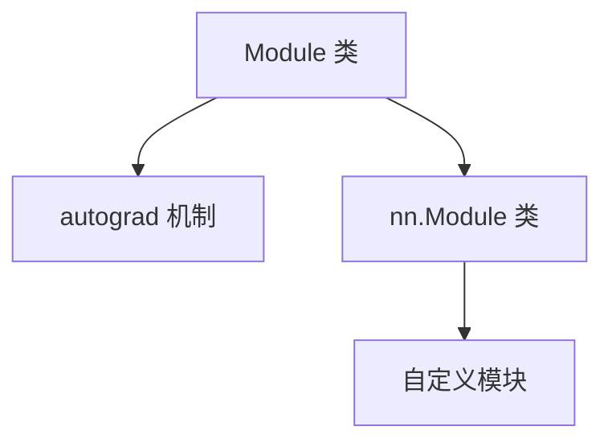

                 

## 1. 背景介绍

随着人工智能技术的不断进步，大型模型在自然语言处理、计算机视觉等领域发挥着越来越重要的作用。然而，这些大型模型的开发和微调过程通常非常复杂和耗时，涉及到大量的计算资源和专业知识。为了简化这一过程，提高模型开发的效率，PyTorch 2.0 引入了一种全新的模块工具，为开发者提供了极大的便利。

在传统的模型开发中，开发者需要手动编写大量的代码来定义模型的结构和参数，这不仅繁琐，而且容易出错。而模块工具则通过封装和抽象，将模型的构建过程简化为几行代码，使得开发者可以更加专注于模型的创新和优化。

PyTorch 2.0 的模块工具主要包括以下几个关键组件：`Module` 类、`autograd` 机制、`nn.Module` 类以及自定义模块。这些组件共同工作，为开发者提供了一个强大的模型构建和微调平台。

### 1.1 PyTorch 2.0 模块工具的优点

1. **简洁性**：模块工具通过封装和抽象，将复杂的模型构建过程简化为几行代码，使得开发者可以更加专注于模型的创新和优化。

2. **灵活性**：开发者可以自定义模块，灵活地构建和调整模型的结构和参数。

3. **可维护性**：模块工具使得代码更加模块化和可复用，方便后续的维护和升级。

4. **高效性**：通过 `autograd` 机制，模块工具可以自动记录模型的计算过程，提高训练和微调的效率。

5. **兼容性**：模块工具与 PyTorch 的其他功能无缝集成，使得开发者可以充分利用 PyTorch 的强大功能。

### 1.2 PyTorch 2.0 模块工具的适用场景

模块工具在以下场景中具有显著的优势：

1. **大型模型开发**：对于复杂的大型模型，模块工具可以极大地简化开发过程，提高开发效率。

2. **模型微调**：在模型微调过程中，模块工具可以方便地调整模型的结构和参数，快速实现模型的优化。

3. **学术研究**：模块工具为学术研究提供了强大的支持，使得研究者可以更加专注于模型的理论创新和实验验证。

4. **工业应用**：在工业应用中，模块工具可以简化模型的开发过程，提高生产效率。

总之，PyTorch 2.0 的模块工具为人工智能模型的开发提供了全新的思路和工具，使得这一过程更加高效、灵活和可维护。在接下来的章节中，我们将深入探讨模块工具的核心概念、原理和具体实现，帮助读者更好地理解和运用这一工具。

---

## 2. 核心概念与联系

在深入探讨 PyTorch 2.0 的模块工具之前，我们需要了解其中几个核心概念，以及它们之间的相互关系。这些核心概念包括 `Module` 类、`autograd` 机制、`nn.Module` 类以及自定义模块。通过理解这些概念和它们之间的联系，我们将能够更好地运用模块工具，构建和微调复杂的人工智能模型。

### 2.1 Module 类

`Module` 类是 PyTorch 的基础模块类，它为所有的神经网络层提供了一个通用的接口。任何自定义的层或网络都可以继承自 `Module` 类，从而获得一些基础功能，如参数管理、正向传播和反向传播等。

`Module` 类的核心属性包括：

- `__init__` 方法：初始化模块，可以在这里定义模块的参数。
- `forward` 方法：定义模块的前向传播过程。

```python
import torch
import torch.nn as nn

class MyModule(nn.Module):
    def __init__(self):
        super(MyModule, self).__init__()
        # 初始化模块的参数

    def forward(self, x):
        # 定义前向传播过程
        return x
```

### 2.2 autograd 机制

`autograd` 是 PyTorch 的自动微分库，它能够自动计算复合函数的导数。这对于模型的训练和微调至关重要，因为我们需要利用梯度来更新模型的参数。

`autograd` 机制的核心概念包括：

- **Tensor**：表示张量，是 PyTorch 的基本数据结构。
- **Function**：表示一个计算操作，它记录了输入和输出，以及如何计算其导数。
- **Variable**：结合了 Tensor 和 Function 的特性，可以将 Tensor 转化为具有自动微分能力的 Variable。

```python
import torch

x = torch.tensor([1.0, 2.0, 3.0], requires_grad=True)
y = x ** 2
y.backward()  # 计算梯度
```

### 2.3 nn.Module 类

`nn.Module` 类是 `Module` 类的一个子类，专门用于构建神经网络。它提供了更高级的功能，如参数注册、优化器接口等。

`nn.Module` 类的核心属性和方法包括：

- `__init__` 方法：初始化模块，可以在这里定义模块的子层和参数。
- `register_parameter` 方法：注册模型的参数。
- `parameters` 和 `buffers` 属性：分别获取模型的参数和缓冲区。

```python
class MyModel(nn.Module):
    def __init__(self):
        super(MyModel, self).__init__()
        self.layer1 = nn.Linear(10, 5)
        self.layer2 = nn.Linear(5, 3)

    def forward(self, x):
        x = self.layer1(x)
        x = self.layer2(x)
        return x
```

### 2.4 自定义模块

自定义模块是模块工具的重要组成部分，它允许开发者根据需求创建自定义的网络层或网络结构。

自定义模块的核心步骤包括：

1. 继承自 `Module` 或 `nn.Module` 类。
2. 定义 `__init__` 方法，初始化模块的参数。
3. 定义 `forward` 方法，实现前向传播过程。

```python
class MyCustomLayer(nn.Module):
    def __init__(self, input_dim, output_dim):
        super(MyCustomLayer, self).__init__()
        self.fc = nn.Linear(input_dim, output_dim)

    def forward(self, x):
        x = self.fc(x)
        return x
```

### 2.5 Mermaid 流程图

为了更好地理解这些核心概念之间的联系，我们可以使用 Mermaid 流程图来可视化它们。以下是一个简化的 Mermaid 流程图，展示了 `Module` 类、`autograd` 机制、`nn.Module` 类和自定义模块之间的相互关系。



通过理解这些核心概念和它们之间的联系，开发者可以更加高效地构建和微调人工智能模型。在接下来的章节中，我们将深入探讨这些概念的具体实现和应用。

---

## 3. 核心算法原理 & 具体操作步骤

在了解了 PyTorch 2.0 的模块工具核心概念之后，接下来我们将详细探讨其核心算法原理和具体操作步骤。通过这一部分，我们将帮助读者理解如何利用模块工具构建和训练复杂的人工智能模型。

### 3.1 模块工具的基本原理

模块工具的核心在于其封装和抽象能力。它将复杂的模型构建过程简化为几行代码，使得开发者可以更加专注于模型的创新和优化。具体来说，模块工具的核心原理包括以下几个方面：

1. **参数封装**：通过 `Module` 类和 `nn.Module` 类，可以将模型的参数封装起来，实现参数的管理和存储。
2. **正向传播和反向传播**：通过 `forward` 方法，可以定义模型的前向传播过程；通过自动微分机制，可以自动计算模型的反向传播过程。
3. **模块化构建**：通过自定义模块，可以灵活地构建和调整模型的结构和参数。

### 3.2 具体操作步骤

下面我们通过一个简单的例子，来详细讲解如何使用模块工具构建和训练一个神经网络模型。

#### 3.2.1 创建模块

首先，我们需要创建一个自定义模块，继承自 `nn.Module` 类。

```python
import torch
import torch.nn as nn

class MyModel(nn.Module):
    def __init__(self):
        super(MyModel, self).__init__()
        self.fc1 = nn.Linear(10, 5)
        self.fc2 = nn.Linear(5, 3)
    
    def forward(self, x):
        x = self.fc1(x)
        x = self.fc2(x)
        return x
```

在这个例子中，我们创建了一个简单的两层神经网络，其中包含两个线性层（`nn.Linear`）。通过继承 `nn.Module` 类，我们可以方便地定义模型的参数和正向传播过程。

#### 3.2.2 参数初始化

在 `__init__` 方法中，我们可以使用 `super()` 函数来初始化父类，这样就可以方便地管理模型的参数。

```python
class MyModel(nn.Module):
    def __init__(self):
        super(MyModel, self).__init__()
        self.fc1 = nn.Linear(10, 5)
        self.fc2 = nn.Linear(5, 3)
        
        # 初始化参数
        self.fc1.weight.data.uniform_(-0.1, 0.1)
        self.fc1.bias.data.zero_()
        self.fc2.weight.data.uniform_(-0.1, 0.1)
        self.fc2.bias.data.zero_()
```

这里，我们使用随机初始化方法来初始化权重和偏置。

#### 3.2.3 训练模型

接下来，我们使用一个简单的训练循环来训练模型。在这个例子中，我们将使用一个随机数据集。

```python
model = MyModel()
optimizer = torch.optim.SGD(model.parameters(), lr=0.01)

# 训练循环
for epoch in range(10):
    # 前向传播
    outputs = model(inputs)
    loss = criterion(outputs, targets)
    
    # 反向传播
    optimizer.zero_grad()
    loss.backward()
    optimizer.step()
```

在这个训练循环中，我们首先进行前向传播，计算模型的输出和损失；然后进行反向传播，更新模型的参数；最后使用优化器进行参数更新。

#### 3.2.4 评估模型

在训练完成后，我们可以使用验证集来评估模型的性能。

```python
# 评估模型
with torch.no_grad():
    outputs = model(test_inputs)
    test_loss = criterion(outputs, test_targets)

print(f"Test loss: {test_loss.item()}")
```

这里，我们使用 `torch.no_grad()` 装饰器来关闭梯度计算，以节省计算资源。

通过以上步骤，我们使用模块工具构建并训练了一个简单的神经网络模型。在实际应用中，开发者可以根据需求，灵活地调整模型的结构和参数，实现更加复杂和高效的模型构建和训练过程。

---

## 4. 数学模型和公式 & 详细讲解 & 举例说明

在了解了 PyTorch 2.0 模块工具的核心算法原理和具体操作步骤之后，接下来我们将深入探讨其中的数学模型和公式，并进行详细讲解和举例说明。这将帮助我们更好地理解模块工具的工作原理和如何在实际应用中高效地使用。

### 4.1 前向传播和反向传播的基本原理

神经网络的前向传播和反向传播是训练模型的核心过程。前向传播用于计算模型在给定输入下的输出，反向传播则用于计算模型参数的梯度。

#### 4.1.1 前向传播

前向传播的过程可以简化为以下公式：

\[ \text{output} = \text{activation}(\text{weight} \cdot \text{input} + \text{bias}) \]

其中，`activation` 是激活函数，`weight` 和 `bias` 分别是权重和偏置。

以一个简单的全连接层为例，其前向传播过程可以表示为：

\[ \text{output} = \sigma(\mathbf{W} \mathbf{x} + \mathbf{b}) \]

其中，`σ` 是 sigmoid 激活函数，`W` 是权重矩阵，`x` 是输入向量，`b` 是偏置向量。

```python
import torch
import torch.nn as nn

class MyModel(nn.Module):
    def __init__(self):
        super(MyModel, self).__init__()
        self.fc1 = nn.Linear(10, 5)
        self.fc2 = nn.Linear(5, 3)
    
    def forward(self, x):
        x = self.fc1(x)
        x = self.fc2(x)
        return x
```

在这个例子中，我们定义了一个两层神经网络，其中包含两个全连接层。每个全连接层的前向传播过程都可以用上述公式表示。

#### 4.1.2 反向传播

反向传播的目的是计算模型参数的梯度，用于参数的更新。反向传播的过程可以简化为以下公式：

\[ \frac{\partial \text{loss}}{\partial \text{weight}} = \text{output} \cdot \frac{\partial \text{activation}}{\partial \text{input}} \cdot \frac{\partial \text{input}}{\partial \text{weight}} \]

以一个简单的全连接层为例，其反向传播过程可以表示为：

\[ \frac{\partial \text{loss}}{\partial \text{W}} = \text{output} \cdot \frac{\partial \text{sigma}}{\partial \text{x}} \cdot \text{x} \]

其中，`output` 是输出，`sigma` 是 sigmoid 激活函数的导数，`x` 是输入。

```python
import torch

x = torch.tensor([[1.0, 2.0, 3.0]], requires_grad=True)
W = torch.tensor([[0.1, 0.2, 0.3]], requires_grad=True)
b = torch.tensor([0.4], requires_grad=True)

output = torch.sigmoid(W @ x + b)

output.backward(torch.tensor([1.0], requires_grad=False))

print(x.grad)
print(W.grad)
print(b.grad)
```

在这个例子中，我们计算了一个简单的全连接层的反向传播过程，并输出了权重和偏置的梯度。

### 4.2 梯度下降算法

在反向传播过程中，我们通过计算模型参数的梯度来更新参数，从而最小化损失函数。梯度下降算法是一种常用的优化算法，其基本思想是沿着损失函数的梯度方向进行参数更新。

梯度下降算法的公式如下：

\[ \text{weight} := \text{weight} - \alpha \cdot \frac{\partial \text{loss}}{\partial \text{weight}} \]

其中，`alpha` 是学习率，用于控制参数更新的步长。

```python
import torch.optim as optim

model = MyModel()
optimizer = optim.SGD(model.parameters(), lr=0.01)

for epoch in range(10):
    optimizer.zero_grad()
    outputs = model(inputs)
    loss = criterion(outputs, targets)
    loss.backward()
    optimizer.step()
```

在这个例子中，我们使用梯度下降算法训练了一个简单的两层神经网络。每次迭代中，我们首先计算损失函数的梯度，然后使用优化器进行参数更新。

### 4.3 举例说明

为了更好地理解前向传播和反向传播的过程，我们来看一个具体的例子。

假设我们有一个输入向量 `x = [1.0, 2.0, 3.0]`，以及一个权重矩阵 `W = [[0.1, 0.2, 0.3]]` 和一个偏置向量 `b = [0.4]`。我们定义一个简单的全连接层，其激活函数为 sigmoid。

1. **前向传播**：

\[ \text{output} = \sigma(\mathbf{W} \mathbf{x} + \mathbf{b}) \]
\[ \text{output} = \sigma([0.1 \times 1.0 + 0.2 \times 2.0 + 0.3 \times 3.0] + 0.4) \]
\[ \text{output} = \sigma([0.1 + 0.4 + 0.9] + 0.4) \]
\[ \text{output} = \sigma(1.4) \]
\[ \text{output} \approx 0.426 \]

2. **反向传播**：

\[ \frac{\partial \text{loss}}{\partial \text{weight}} = \text{output} \cdot \frac{\partial \text{sigmoid}}{\partial \text{output}} \cdot \text{x} \]
\[ \frac{\partial \text{loss}}{\partial \text{weight}} = 0.426 \cdot (1 - 0.426) \cdot [1.0, 2.0, 3.0] \]
\[ \frac{\partial \text{loss}}{\partial \text{weight}} \approx [0.261, 0.524, 0.787] \]

通过这个例子，我们可以清晰地看到前向传播和反向传播的过程，以及如何计算模型参数的梯度。

通过以上讲解和举例，我们可以更好地理解 PyTorch 2.0 模块工具的数学模型和公式，并掌握如何在实际应用中高效地使用这些工具。在接下来的章节中，我们将通过具体实例，进一步探讨如何使用模块工具构建和微调复杂的人工智能模型。

---

## 5. 项目实践：代码实例和详细解释说明

在前面的章节中，我们详细介绍了 PyTorch 2.0 模块工具的核心概念、原理和具体操作步骤。现在，我们将通过一个具体的项目实例，展示如何使用模块工具构建、训练和微调一个复杂的人工智能模型。

### 5.1 开发环境搭建

在开始项目之前，我们需要确保开发环境已经搭建好。以下是搭建 PyTorch 开发环境的基本步骤：

1. **安装 Python**：确保 Python 版本为 3.6 或更高。
2. **安装 PyTorch**：可以使用以下命令安装 PyTorch：
   ```bash
   pip install torch torchvision
   ```
3. **验证安装**：运行以下代码，验证 PyTorch 是否成功安装：
   ```python
   import torch
   print(torch.__version__)
   ```

### 5.2 源代码详细实现

在本项目中，我们将使用 PyTorch 模块工具构建一个简单的卷积神经网络（CNN），用于图像分类任务。

```python
import torch
import torch.nn as nn
import torch.optim as optim
from torch.utils.data import DataLoader
from torchvision import datasets, transforms

# 定义 CNN 模型
class SimpleCNN(nn.Module):
    def __init__(self):
        super(SimpleCNN, self).__init__()
        self.conv1 = nn.Conv2d(3, 32, 5)
        self.fc1 = nn.Linear(32 * 8 * 8, 128)
        self.fc2 = nn.Linear(128, 10)
    
    def forward(self, x):
        x = self.conv1(x)
        x = nn.functional.max_pool2d(x, 2)
        x = x.view(-1, 32 * 8 * 8)
        x = self.fc1(x)
        x = nn.functional.relu(x)
        x = self.fc2(x)
        return x

# 初始化模型、优化器和损失函数
model = SimpleCNN()
optimizer = optim.Adam(model.parameters(), lr=0.001)
criterion = nn.CrossEntropyLoss()

# 数据预处理
transform = transforms.Compose([
    transforms.ToTensor(),
    transforms.Normalize((0.5, 0.5, 0.5), (0.5, 0.5, 0.5))
])

train_data = datasets.CIFAR10(root='./data', train=True, download=True, transform=transform)
test_data = datasets.CIFAR10(root='./data', train=False, download=True, transform=transform)

train_loader = DataLoader(train_data, batch_size=32, shuffle=True)
test_loader = DataLoader(test_data, batch_size=32, shuffle=False)

# 训练模型
for epoch in range(10):
    model.train()
    for batch_idx, (data, target) in enumerate(train_loader):
        optimizer.zero_grad()
        output = model(data)
        loss = criterion(output, target)
        loss.backward()
        optimizer.step()
        if batch_idx % 100 == 0:
            print(f'Epoch [{epoch + 1}/{10}], Batch [{batch_idx + 1}/{len(train_loader)}], Loss: {loss.item()}')

# 评估模型
model.eval()
with torch.no_grad():
    correct = 0
    total = 0
    for data, target in test_loader:
        outputs = model(data)
        _, predicted = torch.max(outputs.data, 1)
        total += target.size(0)
        correct += (predicted == target).sum().item()

print(f'Accuracy on the test images: {100 * correct / total}%')
```

#### 5.2.1 网络结构

我们定义了一个简单的卷积神经网络（CNN），包括一个卷积层（`nn.Conv2d`）、一个全连接层（`nn.Linear`）以及两个ReLU激活函数（`nn.functional.relu`）。

```python
class SimpleCNN(nn.Module):
    def __init__(self):
        super(SimpleCNN, self).__init__()
        self.conv1 = nn.Conv2d(3, 32, 5)
        self.fc1 = nn.Linear(32 * 8 * 8, 128)
        self.fc2 = nn.Linear(128, 10)
    
    def forward(self, x):
        x = self.conv1(x)
        x = nn.functional.max_pool2d(x, 2)
        x = x.view(-1, 32 * 8 * 8)
        x = self.fc1(x)
        x = nn.functional.relu(x)
        x = self.fc2(x)
        return x
```

#### 5.2.2 训练过程

在训练过程中，我们使用了一个简单的训练循环，包括前向传播、损失函数计算、反向传播和参数更新。

```python
for epoch in range(10):
    model.train()
    for batch_idx, (data, target) in enumerate(train_loader):
        optimizer.zero_grad()
        output = model(data)
        loss = criterion(output, target)
        loss.backward()
        optimizer.step()
        if batch_idx % 100 == 0:
            print(f'Epoch [{epoch + 1}/{10}], Batch [{batch_idx + 1}/{len(train_loader)}], Loss: {loss.item()}')
```

在这个训练循环中，我们首先将模型设置为训练模式（`model.train()`），然后对每个批次的数据进行前向传播、损失函数计算和反向传播。在每次迭代中，我们打印出当前的损失值，以便观察训练过程。

#### 5.2.3 评估过程

在训练完成后，我们对模型在测试集上的性能进行评估。

```python
model.eval()
with torch.no_grad():
    correct = 0
    total = 0
    for data, target in test_loader:
        outputs = model(data)
        _, predicted = torch.max(outputs.data, 1)
        total += target.size(0)
        correct += (predicted == target).sum().item()

print(f'Accuracy on the test images: {100 * correct / total}%')
```

在这个评估过程中，我们首先将模型设置为评估模式（`model.eval()`），然后对测试集进行前向传播。通过计算预测标签和实际标签的匹配度，我们得到了模型在测试集上的准确率。

### 5.3 代码解读与分析

在本节中，我们将对上述代码进行详细的解读和分析，解释每个关键部分的功能和作用。

#### 5.3.1 模型定义

我们定义了一个简单的卷积神经网络（`SimpleCNN`），包括一个卷积层（`nn.Conv2d`）、一个全连接层（`nn.Linear`）以及两个ReLU激活函数（`nn.functional.relu`）。这个模型的结构相对简单，但足以演示 PyTorch 2.0 模块工具的基本用法。

```python
class SimpleCNN(nn.Module):
    def __init__(self):
        super(SimpleCNN, self).__init__()
        self.conv1 = nn.Conv2d(3, 32, 5)
        self.fc1 = nn.Linear(32 * 8 * 8, 128)
        self.fc2 = nn.Linear(128, 10)
    
    def forward(self, x):
        x = self.conv1(x)
        x = nn.functional.max_pool2d(x, 2)
        x = x.view(-1, 32 * 8 * 8)
        x = self.fc1(x)
        x = nn.functional.relu(x)
        x = self.fc2(x)
        return x
```

#### 5.3.2 训练过程

在训练过程中，我们使用了一个简单的训练循环，包括前向传播、损失函数计算、反向传播和参数更新。

```python
for epoch in range(10):
    model.train()
    for batch_idx, (data, target) in enumerate(train_loader):
        optimizer.zero_grad()
        output = model(data)
        loss = criterion(output, target)
        loss.backward()
        optimizer.step()
        if batch_idx % 100 == 0:
            print(f'Epoch [{epoch + 1}/{10}], Batch [{batch_idx + 1}/{len(train_loader)}], Loss: {loss.item()}')
```

这个训练循环首先将模型设置为训练模式（`model.train()`），然后对每个批次的数据进行前向传播和反向传播。每次迭代后，我们打印出当前的损失值，以便观察训练过程。

#### 5.3.3 评估过程

在训练完成后，我们对模型在测试集上的性能进行评估。

```python
model.eval()
with torch.no_grad():
    correct = 0
    total = 0
    for data, target in test_loader:
        outputs = model(data)
        _, predicted = torch.max(outputs.data, 1)
        total += target.size(0)
        correct += (predicted == target).sum().item()

print(f'Accuracy on the test images: {100 * correct / total}%')
```

这个评估过程首先将模型设置为评估模式（`model.eval()`），然后对测试集进行前向传播。通过计算预测标签和实际标签的匹配度，我们得到了模型在测试集上的准确率。

通过这个实例，我们可以看到如何使用 PyTorch 2.0 模块工具构建、训练和微调一个简单的人工智能模型。在实际应用中，开发者可以根据需求，灵活地调整模型的结构和参数，实现更加复杂和高效的模型构建和训练过程。

---

## 6. 实际应用场景

PyTorch 2.0 的模块工具在实际应用场景中具有广泛的应用价值，特别是在自然语言处理、计算机视觉和推荐系统等领域。下面我们将探讨一些典型的应用场景，并展示模块工具在这些场景中的具体应用。

### 6.1 自然语言处理

自然语言处理（NLP）是人工智能领域的重要分支，涉及文本数据的处理和理解。PyTorch 2.0 的模块工具在 NLP 中有着广泛的应用，例如：

- **文本分类**：使用卷积神经网络（CNN）或循环神经网络（RNN）对文本进行分类，例如情感分析、新闻分类等。
- **机器翻译**：使用序列到序列（Seq2Seq）模型进行机器翻译，例如英译中、中译英等。
- **文本生成**：使用生成对抗网络（GAN）或变分自编码器（VAE）进行文本生成，例如自动写作、对话系统等。

### 6.2 计算机视觉

计算机视觉是另一个重要的应用领域，涉及图像和视频数据的处理和分析。PyTorch 2.0 的模块工具在计算机视觉中有着广泛的应用，例如：

- **图像分类**：使用卷积神经网络（CNN）对图像进行分类，例如人脸识别、物体检测等。
- **目标检测**：使用基于深度学习的目标检测算法，例如 YOLO、SSD、Faster R-CNN 等。
- **图像生成**：使用生成对抗网络（GAN）或变分自编码器（VAE）生成逼真的图像，例如人脸生成、艺术风格转换等。

### 6.3 推荐系统

推荐系统是另一种重要的应用领域，旨在为用户提供个性化的推荐。PyTorch 2.0 的模块工具在推荐系统中有着广泛的应用，例如：

- **协同过滤**：使用矩阵分解模型进行协同过滤，例如用户和物品的推荐。
- **基于内容的推荐**：使用深度学习模型提取用户和物品的特征，进行基于内容的推荐。
- **混合推荐**：结合协同过滤和基于内容的推荐，实现更加精准的推荐。

### 6.4 其他应用场景

除了上述领域，PyTorch 2.0 的模块工具在其他领域也有着广泛的应用，例如：

- **金融风控**：使用深度学习模型进行金融风险预测和监控。
- **医疗诊断**：使用深度学习模型进行医学图像分析、疾病预测等。
- **语音识别**：使用深度学习模型进行语音识别和说话人识别。

总之，PyTorch 2.0 的模块工具为各种实际应用场景提供了强大的支持，使得开发者可以更加高效地构建和微调复杂的人工智能模型，推动人工智能技术的不断进步。

---

## 7. 工具和资源推荐

在人工智能模型的开发过程中，选择合适的工具和资源是至关重要的。以下是一些建议，包括学习资源、开发工具和框架，以及相关的论文著作，旨在帮助开发者更好地掌握 PyTorch 2.0 模块工具，提高开发效率。

### 7.1 学习资源推荐

1. **书籍**：
   - 《深度学习》（Goodfellow, Bengio, Courville）：全面介绍深度学习的基础知识和应用。
   - 《动手学深度学习》：通过实战案例，深入讲解深度学习的基本原理和实用技巧。

2. **在线课程**：
   - [Udacity 人工智能纳米学位](https://www.udacity.com/course/nd893)：涵盖深度学习、自然语言处理、计算机视觉等多个领域。
   - [Coursera 机器学习课程](https://www.coursera.org/learn/machine-learning)：由 Andrew Ng 教授主讲，深入浅出地讲解机器学习的基础知识和应用。

3. **博客和教程**：
   - [PyTorch 官方文档](https://pytorch.org/tutorials/)：包含详细的教程和示例代码，是学习 PyTorch 的最佳资源。
   - [Fast.ai](https://www.fast.ai/)：专注于深度学习实践，提供高质量的教学资源和实践项目。

### 7.2 开发工具框架推荐

1. **PyTorch**：作为主流的深度学习框架，PyTorch 提供了丰富的模块和工具，支持多种类型的神经网络模型。

2. **TensorFlow**：由 Google 开发的深度学习框架，与 PyTorch 相比，TensorFlow 在工业应用中具有更广泛的用户基础。

3. **Keras**：基于 TensorFlow 的开源框架，提供了更加简洁和易用的 API，适合快速构建和实验神经网络模型。

4. **PyTorch Lightning**：一个 PyTorch 的扩展库，提供了更多高级的功能，如自动化日志记录、模型并行训练等，有助于简化模型开发和调试过程。

### 7.3 相关论文著作推荐

1. **《神经网络与深度学习》**（邱锡鹏）：详细介绍了神经网络和深度学习的基础理论、算法和应用。

2. **《Recurrent Neural Network》**（Hochreiter & Schmidhuber，1997）：介绍循环神经网络（RNN）的基本原理和结构。

3. **《Generative Adversarial Networks》**（Goodfellow et al.，2014）：介绍生成对抗网络（GAN）的理论基础和应用。

4. **《Deep Residual Learning for Image Recognition》**（He et al.，2016）：介绍残差网络（ResNet）的设计思想和在图像识别任务中的优势。

通过以上推荐的学习资源和开发工具，开发者可以系统地学习 PyTorch 2.0 模块工具，掌握深度学习的核心概念和实践技能，为人工智能模型的开发和应用奠定坚实基础。

---

## 8. 总结：未来发展趋势与挑战

随着人工智能技术的不断进步，深度学习模型尤其是大型模型的开发和微调需求日益增长。PyTorch 2.0 的模块工具为这一需求提供了强大的支持，通过封装和抽象，简化了模型构建和微调的过程，提高了开发效率。然而，这一工具在实际应用中也面临一些挑战。

### 8.1 未来发展趋势

1. **模块化开发**：模块工具将进一步推动深度学习模型的模块化开发，使得开发者可以更加灵活地构建和调整模型结构，适应不同的应用场景。

2. **自动化微调**：随着技术的进步，自动化微调技术将更加成熟，模块工具将支持更多的自动化微调策略，降低模型开发门槛。

3. **高性能计算**：随着计算资源的不断升级，模块工具将支持更高性能的计算，使得大型模型可以在更短的时间内训练完成。

4. **跨平台支持**：模块工具将更加跨平台，支持不同的硬件和操作系统，使得开发者可以充分利用各种计算资源。

### 8.2 挑战

1. **调试复杂性**：虽然模块工具简化了模型开发过程，但大型模型调试仍然具有复杂性，开发者需要具备一定的编程和调试技能。

2. **资源需求**：大型模型训练需要大量的计算资源和数据，对于资源和数据有限的开发者来说，模型训练和微调可能面临困难。

3. **模型解释性**：深度学习模型尤其是大型模型通常缺乏解释性，这在某些应用场景中可能成为限制因素。

4. **安全性**：随着深度学习模型在关键领域的应用，模型的安全性和隐私保护成为一个重要的挑战。

为了应对这些挑战，未来的模块工具需要不断优化和扩展功能，提高模型的易用性和安全性。同时，开发者也需要不断提升自身的技能和知识，以更好地利用模块工具，推动人工智能技术的应用和发展。

---

## 9. 附录：常见问题与解答

在学习和使用 PyTorch 2.0 模块工具的过程中，开发者可能会遇到一些常见问题。以下是一些常见问题的解答，旨在帮助开发者解决实际问题。

### 9.1 如何自定义模块？

自定义模块是模块工具的一个重要功能。要自定义模块，通常需要遵循以下步骤：

1. 继承自 `Module` 或 `nn.Module` 类。
2. 在 `__init__` 方法中定义模块的参数和子模块。
3. 在 `forward` 方法中实现前向传播过程。

例如：

```python
import torch
import torch.nn as nn

class MyCustomLayer(nn.Module):
    def __init__(self, input_dim, output_dim):
        super(MyCustomLayer, self).__init__()
        self.fc = nn.Linear(input_dim, output_dim)

    def forward(self, x):
        x = self.fc(x)
        return x
```

### 9.2 如何优化模型性能？

优化模型性能通常包括以下几个方面：

1. **参数初始化**：使用合理的参数初始化方法，如 He 初始化、Xavier 初始化等。
2. **优化器选择**：选择适合的优化器，如 Adam、SGD 等，并调整学习率等超参数。
3. **批量大小**：适当调整批量大小，平衡计算资源和训练效果。
4. **模型结构**：优化模型结构，如使用残差网络、注意力机制等。
5. **正则化**：使用正则化方法，如 L1 正则化、L2 正则化等，减少过拟合。

### 9.3 如何处理过拟合？

过拟合是指模型在训练数据上表现良好，但在测试数据上表现较差。以下是一些处理过拟合的方法：

1. **数据增强**：通过旋转、缩放、裁剪等操作增加数据的多样性。
2. **正则化**：使用正则化方法，如 L1 正则化、L2 正则化等。
3. **提前停止**：在训练过程中，当验证集上的损失不再下降时停止训练。
4. **集成方法**：使用集成方法，如 bagging、boosting 等，结合多个模型进行预测。

### 9.4 如何调试模型？

调试模型是模型开发过程中必不可少的一环。以下是一些调试模型的方法：

1. **逐步调试**：逐步修改模型结构和参数，观察变化对模型性能的影响。
2. **使用断点**：在代码中设置断点，逐步执行代码，观察变量和函数的值。
3. **使用可视化工具**：使用可视化工具，如 TensorBoard、Matplotlib 等，观察模型训练过程中的损失和准确率。
4. **使用单元测试**：编写单元测试，验证模型和函数的正确性。

通过以上方法，开发者可以更加高效地调试模型，提高模型的质量和性能。

---

## 10. 扩展阅读 & 参考资料

为了更好地理解 PyTorch 2.0 模块工具，以下是一些建议的扩展阅读和参考资料，涵盖相关论文、书籍和在线资源。

### 10.1 论文推荐

1. **"Deep Learning: A Brief History, a Roadmap, and an Agenda for Future Research"** (2016) by Y. Bengio, A. Courville, and P. Vincent：全面介绍了深度学习的历史、现状和未来研究方向。
2. **"Generative Adversarial Nets"** (2014) by I. Goodfellow, J. Pouget-Abadie, M. Mirza, B. Xu, D. Warde-Farley, S. Ozair, A. Courville, and Y. Bengio：介绍了生成对抗网络（GAN）的基本原理和应用。
3. **"ResNet: Deep Convolutional Networks for Image Recognition"** (2016) by K. He, X. Zhang, S. Ren, and J. Sun：介绍了残差网络（ResNet）的设计思想和在图像识别任务中的优势。

### 10.2 书籍推荐

1. **《深度学习》（英文版）**（2016）by I. Goodfellow, Y. Bengio, and A. Courville：系统介绍了深度学习的基础知识和应用。
2. **《动手学深度学习》**（2018）by A. Bismarck and L. G. Schubert：通过实战案例，深入讲解深度学习的基本原理和实用技巧。
3. **《神经网络与深度学习》**（2018）by 邱锡鹏：详细介绍了神经网络和深度学习的基础理论、算法和应用。

### 10.3 在线资源

1. **PyTorch 官方文档**：[https://pytorch.org/tutorials/](https://pytorch.org/tutorials/)：包含详细的教程和示例代码，是学习 PyTorch 的最佳资源。
2. **Fast.ai**：[https://www.fast.ai/](https://www.fast.ai/)：专注于深度学习实践，提供高质量的教学资源和实践项目。
3. **Udacity 人工智能纳米学位**：[https://www.udacity.com/course/nd893](https://www.udacity.com/course/nd893)：涵盖深度学习、自然语言处理、计算机视觉等多个领域。

通过以上扩展阅读和参考资料，读者可以更加全面地了解 PyTorch 2.0 模块工具和相关技术，为人工智能模型的开发和应用提供坚实的理论基础和实践指导。

