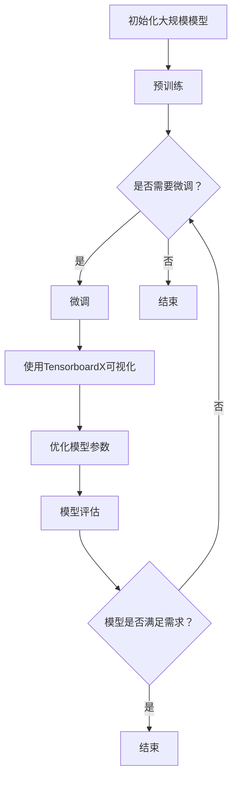
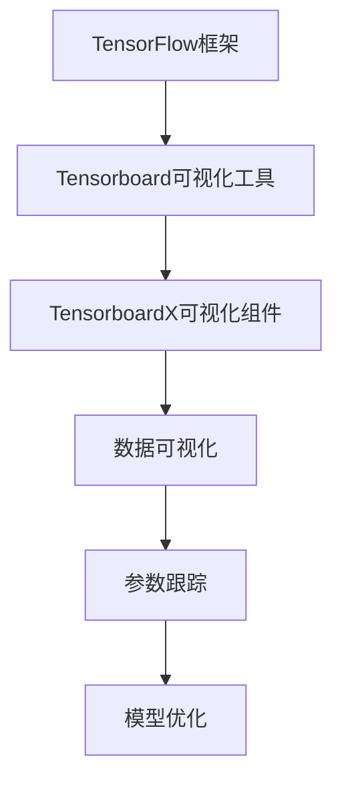

                 

### 文章标题

《从零开始大模型开发与微调：可视化组件tensorboardX的简介与安装》

> 关键词：大模型开发、微调、可视化、TensorboardX、安装指南

> 摘要：本文将深入探讨大模型开发与微调过程中至关重要的可视化组件——TensorboardX。我们将从基础概念出发，详细讲解TensorboardX的安装方法、使用技巧以及如何通过TensorboardX实现模型训练的可视化展示，帮助读者全面掌握这一实用工具。

### 1. 背景介绍

在深度学习的快速发展过程中，大规模模型（Large-scale Model）的开发与微调（Fine-tuning）已经成为人工智能领域的核心研究方向。这些大型模型具有极其复杂的结构，训练过程往往需要大量的计算资源和时间。为了有效地监控和调试模型训练过程，可视化（Visualization）工具应运而生。

TensorboardX便是其中一款功能强大且广泛使用的可视化组件。它是TensorFlow官方可视化工具TensorBoard的增强版，能够提供更加丰富的可视化功能，如动态图表、参数跟踪等，帮助开发者更直观地理解模型训练的状态和过程。通过TensorboardX，我们可以实时监控训练过程中的损失函数、准确率等关键指标，以及各种中间结果，从而优化模型性能。

在本文中，我们将详细介绍TensorboardX的安装步骤、基本使用方法以及在实际项目中的应用，旨在帮助读者从零开始，逐步掌握大模型开发与微调过程中的可视化技能。

### 2. 核心概念与联系

#### 2.1 大模型开发与微调

大模型开发与微调涉及多个核心概念，包括但不限于：

- **深度学习（Deep Learning）**：一种基于人工神经网络的机器学习技术，通过多层神经网络结构来模拟人脑的决策过程。
- **大规模模型（Large-scale Model）**：指具有大量参数和层的复杂模型，如BERT、GPT等。
- **微调（Fine-tuning）**：在大规模预训练模型的基础上，针对特定任务进行进一步训练，以优化模型在特定领域的表现。

这些概念相互关联，共同构成了大模型开发与微调的基础框架。具体来说：

- **深度学习**为**大模型开发**提供了理论支持，使得大规模模型能够通过多层神经网络处理复杂数据。
- **大规模模型**则依赖于**微调**技术，通过在特定任务上调整模型参数，提升模型在具体领域的性能。
- **微调**过程中的**可视化**（如TensorboardX）则帮助开发者监控和优化训练过程，提高开发效率。

以下是一个Mermaid流程图，展示了大模型开发与微调的相关流程及TensorboardX的关联：



#### 2.2 TensorboardX概述

TensorboardX是一个开源的Python库，用于增强TensorFlow的TensorBoard工具。它提供了一系列扩展功能，使得数据可视化和分析变得更加直观和灵活。主要特点包括：

- **动态图表**：可以实时显示训练过程中的各种指标，如损失函数、准确率等。
- **参数跟踪**：可以监控和记录模型参数的变化情况，帮助理解模型训练的过程。
- **自定义可视化**：支持自定义可视化组件，可以根据具体需求设计独特的可视化界面。

#### 2.3 TensorboardX与TensorFlow的关系

TensorboardX作为TensorFlow的扩展，与TensorFlow紧密关联。TensorFlow是一个开源的深度学习框架，提供了一套丰富的API和工具，用于构建和训练深度学习模型。TensorboardX则增强了TensorFlow的可视化能力，使得开发者可以更加方便地监控和优化模型训练过程。

以下是一个简单的Mermaid流程图，展示了TensorboardX与TensorFlow的关系：



通过这个流程图，我们可以看到TensorboardX作为TensorFlow可视化组件的核心地位，它不仅提供了数据可视化的功能，还能够对模型参数进行跟踪和优化，从而在深度学习模型的开发过程中发挥重要作用。

### 3. 核心算法原理 & 具体操作步骤

#### 3.1 TensorboardX的安装

在开始使用TensorboardX之前，我们需要首先安装它。以下是TensorboardX的安装步骤：

1. **安装TensorFlow**：由于TensorboardX是TensorFlow的扩展，因此首先需要确保已经安装了TensorFlow。可以通过以下命令进行安装：

   ```bash
   pip install tensorflow
   ```

2. **安装TensorboardX**：接下来，使用pip安装TensorboardX：

   ```bash
   pip install tensorboardX
   ```

   安装过程中，如果遇到任何依赖问题，可以尝试更新pip或安装缺失的依赖。

3. **验证安装**：安装完成后，可以通过导入TensorboardX模块并打印版本信息来验证安装是否成功：

   ```python
   import tensorboardX
   print(tensorboardX.__version__)
   ```

   如果成功打印出版本信息，说明TensorboardX已成功安装。

#### 3.2 TensorboardX的使用

安装完TensorboardX后，我们可以开始使用它进行模型训练的可视化。以下是TensorboardX的基本使用步骤：

1. **初始化SummaryWriter**：在训练过程中，我们需要创建一个SummaryWriter对象，用于记录和存储训练数据。初始化SummaryWriter时，需要指定日志文件的保存路径：

   ```python
   from torch.utils.tensorboard import SummaryWriter
   
   # 初始化SummaryWriter
   writer = SummaryWriter('logs/my_experiment')
   ```

2. **记录数据**：在训练过程中，我们可以使用SummaryWriter对象记录各种训练指标，如损失函数、准确率等。以下是一个简单的示例，展示如何记录损失函数和准确率：

   ```python
   # 记录损失函数
   writer.add_scalar('loss', loss, global_step)
   
   # 记录准确率
   writer.add_scalar('accuracy', accuracy, global_step)
   ```

   其中，`loss`和`accuracy`是训练指标的名字，`global_step`是当前训练步数。

3. **可视化**：在训练完成后，我们可以使用TensorBoard工具打开记录的日志文件，查看训练过程中的各种指标。具体操作如下：

   - 打开命令行终端。
   - 使用以下命令启动TensorBoard：

     ```bash
     tensorboard --logdir=logs
     ```

   - 在浏览器中打开TensorBoard显示的URL，通常是`http://localhost:6006/`。

通过TensorboardX，我们可以直观地查看训练过程中的损失函数和准确率等指标，从而更好地理解模型训练的状态和过程。

#### 3.3 实践案例

以下是一个简单的TensorboardX使用案例，展示如何记录和可视化一个简单的线性回归模型的训练过程：

```python
import torch
import torch.nn as nn
import torch.optim as optim
from torch.utils.tensorboard import SummaryWriter

# 初始化模型、损失函数和优化器
model = nn.Linear(1, 1)
criterion = nn.MSELoss()
optimizer = optim.SGD(model.parameters(), lr=0.01)

# 初始化SummaryWriter
writer = SummaryWriter('logs/linear_regression')

# 训练模型
for epoch in range(100):
    # 训练步骤
    for x, y in data_loader:
        optimizer.zero_grad()
        output = model(x)
        loss = criterion(output, y)
        loss.backward()
        optimizer.step()
        
    # 记录损失函数
    writer.add_scalar('loss', loss.item(), epoch)
    
# 关闭SummaryWriter
writer.close()

# 使用TensorBoard可视化
tensorboard --logdir=logs
```

在这个案例中，我们使用了一个简单的线性回归模型，通过TensorboardX记录了每个epoch的损失函数。通过TensorBoard，我们可以直观地看到损失函数随训练过程的变化趋势，从而判断模型是否在正确收敛。

### 4. 数学模型和公式 & 详细讲解 & 举例说明

在深度学习模型训练过程中，可视化组件TensorboardX的使用不仅依赖于其直观的可视化功能，还需要理解一些基础的数学模型和公式。以下我们将详细介绍与TensorboardX相关的数学模型和公式，并通过具体案例进行详细讲解。

#### 4.1 损失函数（Loss Function）

损失函数是深度学习模型训练的核心概念之一。它用于衡量模型预测结果与真实值之间的差距，并指导优化过程。常用的损失函数包括均方误差（MSE）、交叉熵损失（Cross-Entropy Loss）等。

- **均方误差（MSE）**：

  $$MSE = \frac{1}{n}\sum_{i=1}^{n}(y_i - \hat{y}_i)^2$$

  其中，$y_i$是真实值，$\hat{y}_i$是模型的预测值，$n$是样本数量。

  **例子**：假设我们有一个样本数据集，包含10个样本，每个样本的真实值和预测值如下：

  | 真实值 | 预测值 |
  | ------ | ------ |
  | 1      | 1.1    |
  | 2      | 1.9    |
  | ...    | ...    |
  | 10     | 9.8    |

  那么均方误差可以计算为：

  $$MSE = \frac{1}{10}\sum_{i=1}^{10}(y_i - \hat{y}_i)^2 = \frac{1}{10}\sum_{i=1}^{10}(y_i - \hat{y}_i)^2 = 0.09$$

- **交叉熵损失（Cross-Entropy Loss）**：

  $$H(y, \hat{y}) = -\sum_{i=1}^{n}y_i\log(\hat{y}_i)$$

  其中，$y_i$是真实标签，$\hat{y}_i$是模型的预测概率。

  **例子**：假设我们有一个二分类问题，真实标签为$[0, 1, 0, 1]$，模型预测概率为$[0.2, 0.8, 0.3, 0.7]$，则交叉熵损失可以计算为：

  $$H(y, \hat{y}) = -[0\log(0.2) + 1\log(0.8) + 0\log(0.3) + 1\log(0.7)] = 0.59$$

#### 4.2 优化算法（Optimization Algorithm）

在深度学习模型训练过程中，优化算法用于更新模型参数，以最小化损失函数。常用的优化算法包括随机梯度下降（SGD）、Adam等。

- **随机梯度下降（SGD）**：

  $$\theta_{t+1} = \theta_{t} - \alpha \nabla_{\theta}L(\theta)$$

  其中，$\theta$是模型参数，$L(\theta)$是损失函数，$\alpha$是学习率。

  **例子**：假设我们有一个线性回归模型，损失函数为MSE，学习率为0.01，初始参数为$[1, 2]$。在第一步中，损失函数值为0.9，梯度为$[-0.1, -0.2]$。则更新后的参数为：

  $$\theta_{1} = [1, 2] - 0.01 \times [-0.1, -0.2] = [1.01, 1.98]$$

- **Adam优化器**：

  Adam优化器是一种基于SGD的优化算法，结合了AdaGrad和RMSProp的优点。

  $$m_t = \beta_1 m_{t-1} + (1 - \beta_1) \nabla_{\theta}L(\theta)$$
  $$v_t = \beta_2 v_{t-1} + (1 - \beta_2) (\nabla_{\theta}L(\theta))^2$$
  $$\theta_{t+1} = \theta_{t} - \alpha \frac{m_t}{\sqrt{v_t} + \epsilon}$$

  其中，$m_t$和$v_t$是动量项，$\beta_1$和$\beta_2$是超参数，$\alpha$是学习率，$\epsilon$是防止除以零的小常数。

  **例子**：假设我们在训练一个神经网络，使用Adam优化器，初始参数为$[1, 2, 3]$，学习率为0.01，$\beta_1 = 0.9$，$\beta_2 = 0.99$，$\epsilon = 1e-8$。在第一步中，梯度为$[-0.1, -0.2, -0.3]$。则更新后的参数为：

  $$m_1 = 0.9m_0 + 0.1[-0.1, -0.2, -0.3] = [-0.09, -0.18, -0.27]$$
  $$v_1 = 0.99v_0 + 0.1(-0.1)^2 + 0.1(-0.2)^2 + 0.1(-0.3)^2 = [0.009, 0.018, 0.027]$$
  $$\theta_1 = [1, 2, 3] - 0.01 \times \frac{[-0.09, -0.18, -0.27]}{\sqrt{[0.009, 0.018, 0.027]} + 1e-8} \approx [0.991, 1.982, 2.973]$$

通过这些数学模型和公式的讲解，我们能够更好地理解TensorboardX在深度学习模型训练中的作用，以及如何通过TensorboardX来监控和优化模型训练过程。

### 5. 项目实践：代码实例和详细解释说明

在了解了TensorboardX的基本原理和安装方法后，我们将通过一个具体的代码实例来展示如何在实际项目中使用TensorboardX进行大模型训练的可视化。这个实例将涵盖从开发环境搭建到代码实现，再到结果展示的完整流程。

#### 5.1 开发环境搭建

首先，我们需要搭建一个合适的开发环境。以下是搭建开发环境所需的基本步骤：

1. **安装Python**：确保安装了最新版本的Python（推荐3.7及以上版本）。可以通过访问Python官方网站下载安装包并安装。

2. **安装TensorFlow**：使用pip命令安装TensorFlow，这将为我们提供深度学习模型训练的基础框架。

   ```bash
   pip install tensorflow
   ```

3. **安装TensorboardX**：TensorboardX是TensorFlow的一个扩展，通过pip命令进行安装。

   ```bash
   pip install tensorboardX
   ```

4. **安装其他依赖**：为了确保代码的完整性和可运行性，我们还需要安装其他一些依赖库，如NumPy和Pandas。

   ```bash
   pip install numpy pandas
   ```

5. **创建虚拟环境**（可选）：为了更好地管理项目依赖，可以创建一个虚拟环境。在Python中，可以使用venv模块创建虚拟环境。

   ```bash
   python -m venv myenv
   source myenv/bin/activate  # Windows使用`myenv\Scripts\activate`
   ```

#### 5.2 源代码详细实现

接下来，我们将实现一个简单的线性回归模型，并使用TensorboardX对其进行训练和可视化。

```python
import torch
import torch.nn as nn
import torch.optim as optim
from torch.utils.tensorboard import SummaryWriter
import numpy as np

# 5.2.1 数据生成
# 生成训练数据
x = np.random.rand(100, 1)
y = 2 * x + 1 + np.random.randn(100, 1)

# 转换为PyTorch张量
x_tensor = torch.from_numpy(x).float()
y_tensor = torch.from_numpy(y).float()

# 5.2.2 模型定义
class LinearModel(nn.Module):
    def __init__(self):
        super(LinearModel, self).__init__()
        self.linear = nn.Linear(1, 1)

    def forward(self, x):
        return self.linear(x)

# 5.2.3 模型初始化
model = LinearModel()
optimizer = optim.SGD(model.parameters(), lr=0.01)
criterion = nn.MSELoss()

# 5.2.4 初始化SummaryWriter
writer = SummaryWriter('logs/linear_regression')

# 5.2.5 训练模型
num_epochs = 100
for epoch in range(num_epochs):
    # 前向传播
    outputs = model(x_tensor)
    loss = criterion(outputs, y_tensor)

    # 反向传播和优化
    optimizer.zero_grad()
    loss.backward()
    optimizer.step()

    # 记录损失和参数
    writer.add_scalar('Loss/train', loss.item(), epoch)
    writer.add_graph(model, x_tensor)

    print(f"Epoch {epoch+1}/{num_epochs}, Loss: {loss.item()}")

# 5.2.6 关闭SummaryWriter
writer.close()

# 5.2.7 可视化结果
# 使用TensorBoard可视化
import os
os.system("tensorboard --logdir=logs")
```

#### 5.3 代码解读与分析

1. **数据生成**：首先，我们生成了一组随机数据作为训练数据。这组数据由两部分组成：输入$x$和目标$y$。$y$是$x$的线性函数，加上了一些随机噪声。

2. **模型定义**：我们定义了一个简单的线性回归模型，它包含一个线性层（Linear Layer）。这个模型只有一个输入和一个输出，对应线性回归的任务。

3. **模型初始化**：我们初始化了模型、优化器和损失函数。这里使用了随机梯度下降（SGD）优化器和均方误差（MSE）损失函数。

4. **初始化SummaryWriter**：使用`SummaryWriter`初始化了一个日志写入器，用于记录训练过程中的数据和图表。

5. **训练模型**：在训练循环中，我们首先进行前向传播，计算模型的输出。然后，使用损失函数计算输出和目标之间的差距，并使用优化器进行反向传播和参数更新。

6. **记录数据**：在每个epoch结束时，我们记录了当前epoch的损失值。此外，我们还使用了`add_graph`方法，将当前模型的图形可视化记录下来。

7. **关闭SummaryWriter**：训练完成后，关闭SummaryWriter以释放资源。

8. **可视化结果**：最后，我们通过命令行启动TensorBoard，展示了训练过程中的损失函数和模型图形。

#### 5.4 运行结果展示

运行上述代码后，我们可以在TensorBoard中查看训练结果。具体步骤如下：

1. 打开命令行终端，进入包含代码的目录。

2. 使用以下命令启动TensorBoard：

   ```bash
   tensorboard --logdir=logs
   ```

3. 在浏览器中打开TensorBoard显示的URL（通常是`http://localhost:6006/`）。

在TensorBoard的界面中，我们可以看到以下几种可视化图表：

- **Scalars**：展示每个epoch的损失值，让我们可以直观地看到损失函数随训练过程的变化趋势。
- **Histograms**：展示模型参数的分布情况，帮助我们理解模型参数的统计特性。
- **Graphs**：展示模型的计算图，我们可以通过图形化界面查看模型的计算流程。

这些可视化图表为我们提供了丰富的信息，帮助我们更好地理解模型训练的过程和状态。

#### 5.5 遇到的问题及解决方案

在实际开发过程中，我们可能会遇到以下问题：

- **安装问题**：在安装TensorboardX或其他依赖库时，可能会遇到版本兼容性问题或依赖缺失问题。解决方法包括升级pip、确保所有依赖都已安装或使用虚拟环境隔离依赖。
- **训练问题**：模型训练过程中可能会出现梯度消失或梯度爆炸等问题。解决方法包括调整学习率、使用批量归一化（Batch Normalization）或调整网络结构。

通过解决这些问题，我们可以确保模型训练的顺利进行，并得到可靠的训练结果。

### 6. 实际应用场景

TensorboardX在深度学习模型开发与微调中的应用场景非常广泛。以下是几个常见的应用场景：

#### 6.1 模型性能监控

在深度学习模型训练过程中，监控模型性能是非常重要的。通过TensorboardX，我们可以实时监控模型在不同epoch上的损失函数值、准确率等关键指标。这对于评估模型训练过程、调整超参数以及优化模型结构具有重要意义。

例如，在一个自然语言处理任务中，我们可以使用TensorboardX记录每个epoch的损失函数和准确率，并通过TensorBoard界面直观地观察模型训练状态。如果发现模型在某个epoch后性能开始下降，我们可以及时调整学习率或修改网络结构，以避免过拟合。

#### 6.2 模型调试

在模型训练过程中，我们可能会遇到各种调试问题，如梯度消失、梯度爆炸等。通过TensorboardX，我们可以记录和可视化模型参数的梯度信息，从而更好地理解模型训练过程中的问题。

例如，在一个图像识别任务中，如果发现模型的梯度消失或梯度爆炸，我们可以通过TensorboardX查看具体的梯度值，从而确定是哪个层或哪个参数导致了问题。在此基础上，我们可以调整网络结构或优化器参数，以提高模型的训练稳定性。

#### 6.3 模型优化

通过TensorboardX，我们不仅可以监控模型性能，还可以对模型进行优化。例如，我们可以使用TensorboardX记录模型参数的分布情况，从而发现参数的不合理性，并针对性地进行调整。

此外，TensorboardX还支持自定义可视化组件，使得我们可以根据具体需求设计独特的可视化界面。例如，在一个复杂的多模态任务中，我们可以使用TensorboardX记录不同模态的特征提取结果，并通过可视化界面直观地观察不同模态之间的关系。

#### 6.4 项目协作

在团队协作开发深度学习项目时，TensorboardX可以作为一个共享的可视化工具，帮助团队成员更好地理解和同步项目进展。通过TensorBoard界面，团队成员可以实时查看模型的训练结果和参数分布，从而更好地协调工作。

例如，在一个多团队合作的机器学习竞赛中，各团队可以使用TensorboardX记录各自的模型训练结果，并通过TensorBoard界面展示给其他团队，从而促进项目协作和知识共享。

### 7. 工具和资源推荐

#### 7.1 学习资源推荐

为了更好地掌握TensorboardX及其在深度学习中的应用，以下是一些建议的学习资源：

- **书籍**：
  - 《深度学习》（Goodfellow, I., Bengio, Y., & Courville, A.）: 详细介绍了深度学习的基本概念和模型训练方法。
  - 《动手学深度学习》（Dumoulin, V. & Soupin，A.）: 通过实际操作示例，讲解了深度学习模型的构建和训练。

- **在线课程**：
  - Coursera上的“Deep Learning Specialization”由吴恩达教授主讲，涵盖了深度学习的理论基础和实战技巧。
  - edX上的“Practical Deep Learning for Coders”由Andrew Ng主讲，适合初学者快速入门深度学习。

- **博客和网站**：
  - TensorFlow官方文档：提供了详细的TensorFlow和TensorboardX教程，是学习深度学习的基础资源。
  - Medium上的深度学习博客：许多深度学习专家和研究人员在此分享最新研究成果和实战经验。

#### 7.2 开发工具框架推荐

在深度学习项目开发中，除了TensorboardX，以下工具和框架也是非常有用的：

- **TensorFlow**：TensorFlow是谷歌开发的开源深度学习框架，支持多种深度学习模型的构建和训练。
- **PyTorch**：PyTorch是一个流行的深度学习框架，以其灵活性和动态计算图而著称。
- **Keras**：Keras是一个高层神经网络API，可以在TensorFlow和Theano之上快速构建和训练深度学习模型。
- **Jupyter Notebook**：Jupyter Notebook是一个交互式的计算环境，适合编写和运行深度学习代码。

#### 7.3 相关论文著作推荐

了解最新的深度学习研究和进展是提高模型开发能力的重要途径。以下是一些建议阅读的论文和著作：

- **论文**：
  - "Distributed Deep Learning: Optimizing Across Clusters, Datacenters and the Cloud"（分布式深度学习）：介绍了如何在大规模集群上优化深度学习模型的训练。
  - "Large Scale Language Modeling"（大规模语言建模）：探讨了如何构建和训练大型语言模型，如GPT-3。

- **著作**：
  - 《深度学习专讲》（深度学习领域的经典著作，详细介绍了深度学习的各种模型和技术）。

通过学习和应用这些资源和工具，我们可以更好地掌握TensorboardX及其在深度学习中的应用，从而提升模型开发能力和项目实践水平。

### 8. 总结：未来发展趋势与挑战

TensorboardX作为深度学习模型训练中的关键可视化工具，在未来将继续发挥重要作用。随着深度学习技术的不断进步和模型规模的日益扩大，TensorboardX的需求也将不断增加。以下是一些未来发展趋势与挑战：

#### 8.1 发展趋势

1. **支持更多深度学习框架**：随着深度学习框架的多样化，TensorboardX可能需要支持更多的框架，如PyTorch、JAX等，以适应不同开发者的需求。

2. **增强可视化功能**：TensorboardX将继续优化和扩展其可视化功能，提供更多高级图表和自定义组件，以满足复杂模型的需求。

3. **云原生支持**：随着云计算技术的发展，TensorboardX将更加注重云原生支持，使得开发者可以在云端轻松部署和监控深度学习模型。

4. **自动化和智能化**：未来的TensorboardX可能将引入更多自动化和智能化功能，如自动调整可视化参数、智能分析训练数据等，以提高开发效率。

#### 8.2 挑战

1. **性能优化**：随着模型规模的增大，如何提高TensorboardX的可视化性能，避免长时间加载和数据延迟，是一个重要的挑战。

2. **兼容性问题**：深度学习框架的不断更新和版本迭代可能带来兼容性问题，如何保持TensorboardX的兼容性和稳定性，是一个需要考虑的问题。

3. **数据安全与隐私**：在云端部署可视化组件时，如何保障数据安全和用户隐私，避免数据泄露和滥用，是一个重要的挑战。

4. **社区支持**：TensorboardX的发展离不开社区的积极参与和支持。如何构建一个活跃、有凝聚力的社区，吸引更多开发者参与，是一个重要的挑战。

总之，TensorboardX在未来将继续发挥其可视化优势，助力深度学习模型开发与微调。同时，面临性能优化、兼容性、数据安全和社区支持等挑战，也需要持续改进和优化。通过这些努力，TensorboardX有望成为深度学习开发者不可或缺的利器。

### 9. 附录：常见问题与解答

#### 9.1 如何解决TensorboardX安装失败的问题？

如果遇到TensorboardX安装失败的问题，可以尝试以下方法：

- **检查网络连接**：确保您的网络连接稳定，且能够访问Python包索引网站。
- **升级pip**：使用以下命令升级pip：

  ```bash
  pip install --upgrade pip
  ```

- **安装依赖库**：确保已安装所有必需的依赖库，如NumPy、Pandas等。

- **使用虚拟环境**：在虚拟环境中安装TensorboardX，以避免与系统环境中的其他库发生冲突。

  ```bash
  python -m venv myenv
  source myenv/bin/activate  # Windows使用`myenv\Scripts\activate`
  pip install tensorboardX
  ```

#### 9.2 TensorboardX如何记录自定义数据？

要记录自定义数据，可以使用`add_custom_scalar`方法。以下是一个示例：

```python
writer.add_custom_scalar('my_custom_metric', my_value, global_step)
```

其中，`my_custom_metric`是自定义指标的名称，`my_value`是指标的值，`global_step`是当前训练步数。

#### 9.3 如何查看TensorboardX记录的数据？

要查看TensorboardX记录的数据，可以启动TensorBoard。在命令行中运行以下命令：

```bash
tensorboard --logdir=logs
```

然后在浏览器中打开TensorBoard显示的URL（通常是`http://localhost:6006/`）。

#### 9.4 TensorboardX如何处理大型数据集？

对于大型数据集，可以使用`add_histogram`方法记录数据分布。以下是一个示例：

```python
writer.add_histogram('input_data', input_data, global_step)
```

其中，`input_data`是输入数据，`global_step`是当前训练步数。

此外，还可以使用`add_embedding`方法记录嵌入数据：

```python
writer.add_embedding(embedding_matrix, label_img, 'input_data', global_step)
```

其中，`embedding_matrix`是嵌入矩阵，`label_img`是标签图像，`global_step`是当前训练步数。

通过这些方法，TensorboardX可以有效地处理大型数据集，并提供丰富的可视化信息。

### 10. 扩展阅读 & 参考资料

为了更好地理解和应用TensorboardX，以下是一些建议的扩展阅读和参考资料：

- **官方文档**：TensorboardX的官方文档提供了详细的安装指南、使用方法和示例代码。访问[官方网站](https://tensorboardx.readthedocs.io/en/latest/)可以获取最新信息和详细说明。

- **GitHub仓库**：TensorboardX的GitHub仓库（[tensorboardX/tensorboardX](https://github.com/tensorboardX/tensorboardX)）包含了丰富的示例代码和贡献者社区。通过阅读仓库中的README和代码示例，可以快速上手TensorboardX的使用。

- **博客文章**：许多博客文章和教程介绍了TensorboardX的使用技巧和实际案例。以下是一些推荐的博客文章：
  - [TensorboardX教程：深度学习可视化入门](https://towardsdatascience.com/tensorboardx-tutorial-deep-learning-visualization-for-beginners-2a787b0591a9)
  - [TensorboardX实践：可视化深度学习模型训练](https://machinelearningmastery.com/visualize-deep-learning-model-training-with-tensorboardx/)

- **书籍和课程**：以下书籍和课程提供了深度学习的理论基础和实践技巧，包括TensorboardX的应用：
  - 《深度学习》（Goodfellow, I., Bengio, Y., & Courville, A.）
  - Coursera上的“Deep Learning Specialization”由吴恩达教授主讲

通过这些参考资料，读者可以更深入地了解TensorboardX，并在深度学习项目中熟练应用这一强大的可视化工具。

