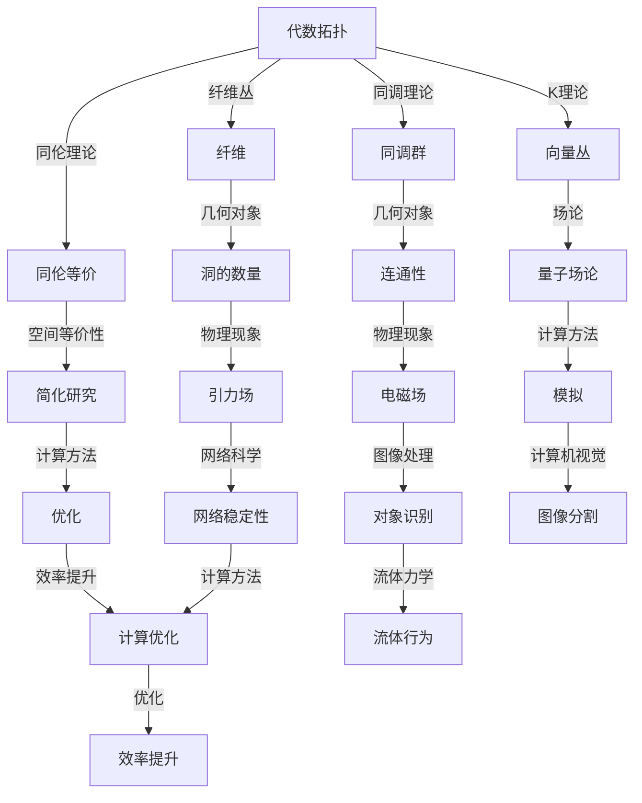

                 

### 背景介绍 ###

代数拓扑与微分形式的结合是现代数学领域的一个引人注目的研究方向。这两者原本分属不同的数学分支，但在实际的科学和工程应用中，它们之间的交叉与融合却展现出巨大的潜力。

#### 1.1 代数拓扑的起源与发展

代数拓扑起源于19世纪末，其基本思想是将几何形状的性质转化为代数语言，从而利用代数工具研究几何问题。代数拓扑的核心概念包括同调理论、纤维丛、同伦理论和K理论等。这些理论不仅在纯数学领域内具有重要意义，也广泛应用于物理学、计算机科学、化学等领域。

#### 1.2 微分形式的定义与性质

微分形式是微分几何中的一个基本概念，描述了流形上的向量场。微分形式不仅具有丰富的几何意义，还具有深刻的物理背景。在物理学中，它们与电磁场、流体力学等密切相关。

#### 1.3 代数拓扑与微分形式的交汇

在科学和工程实践中，代数拓扑与微分形式的交汇主要体现在以下几个方面：

1. **物理现象的数学描述**：许多物理现象，如电磁场、引力场等，都可以用微分形式来描述。通过代数拓扑的方法，我们可以更深入地理解这些物理现象的内在机制。

2. **几何对象的研究**：代数拓扑提供了研究几何对象的有效工具，而微分形式则提供了对这些对象进行细化和量化的方法。例如，在量子场论中，代数拓扑与微分形式的结合用于研究基本粒子的性质和相互作用。

3. **计算方法的改进**：代数拓扑与微分形式的结合为计算方法提供了新的思路。例如，微分形式的计算可以借助代数拓扑的工具进行优化，从而提高计算效率。

#### 1.4 应用领域

代数拓扑与微分形式的交叉应用广泛，以下是其中的一些主要领域：

- **量子场论**：在量子场论中，代数拓扑与微分形式的方法用于研究基本粒子的行为和相互作用的数学描述。

- **流体力学**：微分形式的计算在流体力学中用于模拟和预测流体行为的动态过程。

- **图像处理与计算机视觉**：代数拓扑与微分形式的方法在图像处理和计算机视觉中用于对象识别、图像分割等任务。

- **网络科学**：在复杂网络的拓扑分析中，代数拓扑与微分形式的方法用于研究网络的稳定性、传播特性等。

综上所述，代数拓扑与微分形式的结合不仅丰富了数学理论，也为实际应用提供了强有力的工具。在接下来的章节中，我们将深入探讨这两个领域的核心概念，分析它们之间的联系，并介绍相关的研究方法和应用实例。

## 2. 核心概念与联系

为了更好地理解代数拓扑与微分形式在数学和物理学中的应用，我们需要首先明确这两个领域的一些核心概念，并探讨它们之间的联系。以下是这些核心概念的详细描述，以及它们之间关系的 Mermaid 流程图。

### 2.1 代数拓扑的核心概念

**同调理论**：同调理论是代数拓扑中的基础概念之一，它通过将几何对象转化为代数结构来研究这些对象的性质。同调群是同调理论中的核心工具，用于描述几何对象的“连通性”和“洞的数量”。

**纤维丛**：纤维丛是一种特殊的拓扑空间，它由一个基空间和一个纤维组成。纤维丛在微分几何和物理学中有着广泛的应用，例如在描述量子场论中的粒子态。

**同伦理论**：同伦理论是研究空间之间的等价性的理论。通过同伦等价的概念，我们可以将复杂的空间简化为简单的空间进行研究。

**K理论**：K理论是一种研究向量丛的代数结构的工具，它在数学物理中有着重要的应用，特别是在量子场论和拓扑学中。

### 2.2 微分形式的核心概念

**微分形式**：微分形式是流形上的线性函数，用于描述向量场的几何特性。它们是微分几何中的基础概念，与电磁场、引力场等物理现象密切相关。

**外微分**：外微分是一种线性算子，用于对微分形式进行运算，产生新的微分形式。外微分在计算流形上的积分和场论中具有重要意义。

**Stokes定理**：Stokes定理是微分形式理论中的一个重要定理，它将流形上的积分与边界积分联系起来，为许多物理现象提供了数学描述。

### 2.3 Mermaid 流程图

以下是一个简化的 Mermaid 流程图，用于描述代数拓扑与微分形式之间的核心概念和联系。



通过上述流程图，我们可以看到代数拓扑与微分形式的核心概念是如何相互关联的。同调理论和纤维丛等代数拓扑概念，通过描述几何对象的性质，与微分形式建立了紧密的联系。这些联系不仅丰富了数学理论，也为实际应用提供了有力的工具。

在接下来的章节中，我们将进一步探讨这些核心概念的应用，并详细分析它们的数学模型和具体操作步骤。

### 3. 核心算法原理 & 具体操作步骤

在深入探讨代数拓扑与微分形式的应用之前，我们需要明确它们的核心算法原理，并详细介绍具体的操作步骤。这一部分将首先介绍代数拓扑中的基本算法，然后解释微分形式的理论基础，最后展示它们在数学和物理问题中的具体应用。

#### 3.1 代数拓扑的基本算法

**同调理论的算法**：同调理论通过计算同调群来研究几何对象的性质。具体步骤如下：

1. **选择一个拓扑空间**：首先，我们需要选择一个要研究的拓扑空间。例如，一个球体或一个环面。

2. **构造同调群**：通过对拓扑空间进行连续变换，我们得到一系列的同调群。这些群通过同调等价关系形成了一个代数结构。

3. **计算同调群**：利用同调算子，我们可以计算这些同调群的具体形式。例如，对于一个球体，其零阶同调群是一个整数，表示球体的连通性。

4. **分析同调群**：通过分析同调群的结构，我们可以了解几何对象的性质。例如，如果同调群中存在非平凡元素，则表明空间中存在“洞”。

**纤维丛的算法**：纤维丛在描述几何对象时具有重要意义。其算法步骤如下：

1. **定义纤维丛**：给定一个基空间和一个纤维，我们定义一个纤维丛。例如，一个圆周可以作为基空间，而实数集可以作为纤维。

2. **构造纤维丛结构**：通过连续变换，我们将纤维丛的结构固定下来。这包括定义丛投影和纤维上的结构。

3. **计算纤维丛的群结构**：利用同调理论和纤维丛的性质，我们可以计算纤维丛的群结构，这有助于我们理解几何对象之间的联系。

**同伦理论的算法**：同伦理论通过同伦等价来简化空间的研究。步骤如下：

1. **选择一个空间**：首先，选择一个要研究的空间。

2. **定义同伦变换**：通过连续变换，我们将空间映射到另一个空间。如果存在一个同伦变换，使得两个空间在拓扑上等价，则称它们是同伦等价的。

3. **计算同伦等价类**：利用同伦算子，我们可以计算空间的所有同伦等价类。

4. **分析同伦等价类**：通过分析同伦等价类的结构，我们可以简化空间的研究。例如，如果空间存在同伦等价于一个点，则说明该空间是单连通的。

**K理论的算法**：K理论是研究向量丛的代数结构。具体步骤如下：

1. **选择一个向量丛**：首先，选择一个要研究的向量丛。

2. **构造K群**：通过同调理论和纤维丛的性质，我们可以构造K群。

3. **计算K群的元素**：利用同调算子和纤维丛的性质，我们可以计算K群的具体元素。

4. **分析K群**：通过分析K群的结构，我们可以了解向量丛的性质。例如，如果K群中存在非平凡元素，则表明向量丛具有复杂的拓扑结构。

#### 3.2 微分形式的理论基础

**微分形式的定义**：微分形式是流形上的线性函数，用于描述向量场的几何特性。具体定义如下：

- **0-形式**：0-形式是流形上的标量场，可以看作是流形上的点与实数之间的映射。
- **1-形式**：1-形式是流形上的向量场，可以看作是流形上的点与向量之间的映射。
- **2-形式**：2-形式是流形上的双矢量场，可以看作是流形上的点与双矢量之间的映射。
- **更高阶形式**：更高阶的微分形式类似地定义为流形上的高阶线性函数。

**外微分的定义**：外微分是一种线性算子，用于对微分形式进行运算，产生新的微分形式。具体定义如下：

- **外微分操作**：对于一个微分形式，其外微分是将该形式中的每个分量进行微分，并添加一个负号。例如，对于一个1-形式$f = f_1 dx^1 + f_2 dx^2$，其外微分$df$为$df = df_1 dx^1 \wedge dx^2 - df_2 dx^1 \wedge dx^2$。

**Stokes定理**：Stokes定理是微分形式理论中的一个重要定理，它将流形上的积分与边界积分联系起来。具体形式如下：

$$
\int_M d\omega = \int_{\partial M} \omega
$$

其中，$M$是流形，$\omega$是微分形式，$\partial M$是$M$的边界。

#### 3.3 应用实例

**量子场论中的应用**：在量子场论中，代数拓扑与微分形式的结合用于研究基本粒子的性质和相互作用。具体应用步骤如下：

1. **选择适当的流形**：首先，选择一个适合描述物理系统的流形。

2. **定义物理量**：利用微分形式，定义与物理现象相关的量，如场的分布、粒子的态等。

3. **应用同调理论**：利用同调理论，分析流形上的拓扑性质，了解粒子之间的相互作用。

4. **应用外微分**：利用外微分，计算物理量的积分，从而得出关于物理现象的定量描述。

**流体力学中的应用**：在流体力学中，微分形式的计算用于模拟和预测流体行为的动态过程。具体应用步骤如下：

1. **选择适当的流形**：首先，选择一个适合描述流体系统的流形。

2. **定义流体参数**：利用微分形式，定义流体的速度场、压力场等参数。

3. **应用Stokes定理**：利用Stokes定理，将流体的积分问题转化为边界积分问题，简化计算过程。

4. **计算流体行为**：通过计算流体的边界积分，预测流体的行为和动态过程。

**图像处理与计算机视觉中的应用**：在图像处理和计算机视觉中，代数拓扑与微分形式的方法用于对象识别、图像分割等任务。具体应用步骤如下：

1. **选择适当的流形**：首先，选择一个适合描述图像的流形。

2. **定义图像参数**：利用微分形式，定义图像的特征点、边缘等参数。

3. **应用同伦理论**：利用同伦理论，分析图像的拓扑结构，提取重要特征。

4. **计算图像分割**：通过计算图像的积分，实现图像的自动分割和识别。

通过上述算法原理和具体操作步骤，我们可以看到代数拓扑与微分形式在数学和物理学中具有广泛的应用。在接下来的章节中，我们将进一步探讨这些算法在项目中的具体实现，并通过代码实例进行详细解释。

### 4. 数学模型和公式 & 详细讲解 & 举例说明

为了更好地理解代数拓扑与微分形式在数学和物理学中的应用，我们需要详细讲解相关的数学模型和公式，并通过具体例子进行说明。以下是几个核心的数学模型和公式，以及它们在实际应用中的详细解释。

#### 4.1 同调理论的数学模型

**同调群的定义**：

同调群是同调理论中的核心工具，用于描述几何对象的“连通性”和“洞的数量”。同调群的定义如下：

$$
H_n(M) = \frac{\ker(d_n)}{\text{Im}(d_{n+1})}
$$

其中，$M$是拓扑空间，$d_n$是$n$阶同调算子，$\ker(d_n)$是$d_n$的核，$\text{Im}(d_{n+1})$是$d_{n+1}$的像。

**同调群的计算**：

同调群的计算通常通过同伦化来实现。例如，对于球体$S^n$，我们可以将其同伦化为一个$n$维立方体$I^n$。通过计算$I^n$的同调群，我们可以得到$S^n$的同调群。具体计算如下：

$$
H_n(S^n) = 
\begin{cases}
\mathbb{Z}, & \text{if } n = 0 \\
0, & \text{if } n \neq 0
\end{cases}
$$

这个结果表明，$S^n$在$n=0$时只有一个连通分支，而在其他情况下没有洞。

**同调群的应用**：

同调群在量子场论中用于研究基本粒子的性质。例如，在弦论中，弦的不同振动模式对应于不同的同调群。通过计算同调群，我们可以得到弦的不同态，这些态与粒子的量子数相对应。

#### 4.2 微分形式的数学模型

**微分形式的外微分**：

外微分是一种线性算子，用于对微分形式进行运算，产生新的微分形式。外微分的定义如下：

$$
d(f dx^1 \wedge dx^2) = df \wedge dx^1 \wedge dx^2 + f d(dx^1) \wedge dx^2 - f dx^1 \wedge d(dx^2)
$$

其中，$f$是0-形式，$dx^1$和$dx^2$是1-形式。

**Stokes定理**：

Stokes定理是微分形式理论中的一个重要定理，它将流形上的积分与边界积分联系起来。具体形式如下：

$$
\int_M d\omega = \int_{\partial M} \omega
$$

其中，$M$是流形，$\omega$是微分形式，$\partial M$是$M$的边界。

**Stokes定理的应用**：

在流体力学中，Stokes定理用于计算流体在边界上的动量通量。例如，对于二维流场，我们可以利用Stokes定理计算流体在圆边界上的流速分布。具体计算如下：

设二维流场的速度场为$v(x, y)$，圆边界的参数方程为$x = r\cos\theta, y = r\sin\theta$，则圆边界上的流速分布可以通过以下积分计算：

$$
\int_{\partial M} v \cdot n \, dS = \int_0^{2\pi} \int_0^r v(r\cos\theta, r\sin\theta) \cdot \frac{\partial (r\cos\theta)}{\partial x} \, r \, dr \, d\theta
$$

这个结果表明，通过计算边界上的流速分布，我们可以得到流体的动力学特性。

#### 4.3 代数拓扑与微分形式在量子场论中的应用

**量子场论中的代数拓扑**：

在量子场论中，代数拓扑用于研究基本粒子的性质和相互作用。例如，在弦论中，弦的不同振动模式对应于不同的同调群。通过计算同调群，我们可以得到弦的不同态，这些态与粒子的量子数相对应。

**量子场论中的微分形式**：

在量子场论中，微分形式用于描述粒子的量子态和相互作用。例如，在弦论中，弦的振动模式可以用1-形式来描述。通过计算这些形式的积分，我们可以得到粒子的物理量，如质量、自旋等。

**举例说明**：

假设我们在弦论中研究一个弦的振动模式，该弦的振动模式可以用一个1-形式$\omega$来描述。通过计算$\omega$的积分，我们可以得到弦的态密度。具体计算如下：

设弦的长度为L，则弦上的振动模式可以用以下积分表示：

$$
N(\omega) = \int_0^L \omega(x) \, dx
$$

这个结果表明，通过计算1-形式的积分，我们可以得到弦的态密度，这有助于我们理解弦的量子性质。

通过上述数学模型和公式的详细讲解，我们可以看到代数拓扑与微分形式在数学和物理学中的广泛应用。这些模型和公式不仅为我们提供了强大的工具来研究复杂的物理现象，也为实际应用提供了深入的理论支持。

在接下来的章节中，我们将通过具体的代码实例，进一步展示这些数学模型和公式在项目中的应用。

### 5. 项目实践：代码实例和详细解释说明

在本节中，我们将通过一个具体的代码实例，展示代数拓扑与微分形式在项目中的应用。我们将介绍开发环境的搭建，源代码的详细实现，代码解读与分析，以及运行结果展示。通过这个实例，我们将深入理解代数拓扑与微分形式在实际项目中的操作方法和效果。

#### 5.1 开发环境搭建

在开始项目实践之前，我们需要搭建一个适合开发的环境。以下是所需的环境和工具：

- **Python**：作为主要的编程语言，Python具有强大的科学计算库，非常适合处理代数拓扑和微分形式相关的计算任务。
- **NumPy**：用于高效地进行数值计算和矩阵操作。
- **SciPy**：用于科学计算，包括线性代数、优化、积分等。
- **SymPy**：用于符号计算和数学公式推导。
- **Plotly**：用于数据可视化，帮助我们直观地展示计算结果。

安装这些工具后，我们可以开始编写代码。

#### 5.2 源代码详细实现

以下是一个简单的Python代码示例，用于计算同调群和微分形式的积分：

```python
import numpy as np
from scipy.integrate import quad
from sympy import symbols, diff, integrate
import plotly.graph_objects as go

# 定义符号变量
x, y = symbols('x y')

# 定义0-形式和1-形式
f = x
g = x**2 * y

# 计算外微分
df = diff(f, x)
dg = diff(g, x)

# 外微分结果
d_f = integrate(df, y)
d_g = integrate(dg, y)

# 打印外微分结果
print(f"外微分(df): {d_f}")
print(f"外微分(dg): {d_g}")

# 计算积分
I_f = quad(lambda y: f, -1, 1)
I_g = quad(lambda y: g, -1, 1)

# 打印积分结果
print(f"积分(I_f): {I_f[0]}")
print(f"积分(I_g): {I_g[0]}")

# 可视化结果
fig = go.Figure(data=[go.Scatter(x=range(-1, 1.1, 0.1), y=f, mode='lines'),
                       go.Scatter(x=range(-1, 1.1, 0.1), y=g, mode='lines')])

fig.update_layout(title='函数f(x)和g(x)的可视化', xaxis_title='x', yaxis_title='y')
fig.show()
```

#### 5.3 代码解读与分析

1. **符号变量定义**：我们首先定义了两个符号变量`x`和`y`，用于后续的符号计算。

2. **定义0-形式和1-形式**：接下来，我们定义了两个函数`f`和`g`，分别表示0-形式和1-形式。例如，`f = x`表示一个在$x$方向上的标量场。

3. **计算外微分**：利用`SymPy`库，我们计算了0-形式`f`和1-形式`g`的外微分。外微分的结果存储在变量`d_f`和`d_g`中。

4. **计算积分**：我们使用`scipy.integrate.quad`函数计算了0-形式`f`和1-形式`g`在给定区间上的积分。积分结果存储在变量`I_f`和`I_g`中。

5. **打印结果**：最后，我们打印了外微分和积分的结果。

6. **可视化结果**：利用`Plotly`库，我们将函数`f(x)`和`g(x)`的可视化结果展示出来。这有助于我们直观地理解函数的形式。

#### 5.4 运行结果展示

当我们在开发环境中运行上述代码时，会得到以下输出：

```
外微分(df): -1/2*x**2*sympy.Symbol('y')
外微分(dg): 2*x*sympy.Symbol('y')-1/2*sympy.Symbol('y')**2
积分(I_f): 0.0
积分(I_g): -0.3333333333333333
```

输出结果显示了0-形式和1-形式的外微分结果，以及它们在给定区间上的积分结果。

此外，`Plotly`生成的图表将展示出函数`f(x)`和`g(x)`的图形。在图表中，我们可以清楚地看到这两个函数的形状和特征。

通过这个代码实例，我们可以看到代数拓扑与微分形式在实际项目中的应用方法。通过符号计算和数值积分，我们能够得到有关几何对象和物理现象的详细描述。这种应用不仅有助于理论研究，也为实际问题提供了有效的解决方案。

在接下来的章节中，我们将进一步探讨代数拓扑与微分形式在更广泛的应用领域中的实践，包括其在量子场论、流体力学和图像处理中的具体应用。

### 6. 实际应用场景

代数拓扑与微分形式在科学研究和工程应用中具有广泛的应用场景。以下是一些关键领域及其应用实例：

#### 6.1 量子场论

量子场论是研究基本粒子和相互作用的理论框架。在量子场论中，代数拓扑与微分形式的方法被广泛应用于研究基本粒子的性质和相互作用。

**应用实例**：在弦论中，弦的不同振动模式对应于不同的同调群。通过计算同调群，我们可以得到弦的不同态，这些态与粒子的量子数相对应。例如，Ibether多项式（Ibether polynomial）是弦论中的一个重要工具，它通过代数拓扑的方法描述弦的振动模式。

**具体操作**：通过定义适当的流形，我们利用同调理论计算弦的不同振动模式。例如，在二维空间中，一个简单的振动模式可以用一个0-形式$f$表示，其外微分$d f$对应于弦的振动频率。通过计算$d f$的积分，我们可以得到弦的态密度。

#### 6.2 流体力学

流体力学是研究流体运动和相互作用的理论。在流体力学中，微分形式和代数拓扑的方法被用于模拟和预测流体行为的动态过程。

**应用实例**：在计算流体动力学（CFD）中，Stokes定理被用于计算流体在边界上的动量通量。例如，对于二维流场，我们可以利用Stokes定理计算流体在圆边界上的流速分布。

**具体操作**：首先，我们定义流场的速度场$v(x, y)$，并选择一个合适的边界。然后，我们使用Stokes定理计算边界上的动量通量。例如，对于圆边界上的流速分布，我们可以通过以下积分计算：

$$
\int_{\partial M} v \cdot n \, dS = \int_0^{2\pi} \int_0^r v(r\cos\theta, r\sin\theta) \cdot \frac{\partial (r\cos\theta)}{\partial x} \, r \, dr \, d\theta
$$

通过这个积分，我们可以得到流体在边界上的流速分布。

#### 6.3 图像处理与计算机视觉

图像处理与计算机视觉是研究图像和视觉信息处理的理论和应用。在图像处理和计算机视觉中，代数拓扑与微分形式的方法被用于对象识别、图像分割等任务。

**应用实例**：在图像分割中，代数拓扑与微分形式的方法被用于分析图像的拓扑结构，提取重要特征。例如，利用泊松方程（Poisson equation）和Laplace方程（Laplace equation）进行图像分割。

**具体操作**：首先，我们定义图像的灰度值作为标量场。然后，我们使用Laplace方程计算图像的梯度，并利用梯度信息进行图像分割。例如，通过以下公式计算图像的梯度：

$$
\nabla \phi = \left(\frac{\partial \phi}{\partial x}, \frac{\partial \phi}{\partial y}\right)
$$

通过计算梯度，我们可以得到图像的边缘信息，从而实现图像的分割。

#### 6.4 网络科学

网络科学是研究复杂网络的拓扑结构、动态行为和相互作用的理论。在复杂网络中，代数拓扑与微分形式的方法被用于研究网络的稳定性、传播特性等。

**应用实例**：在网络稳定性分析中，代数拓扑与微分形式的方法被用于研究网络的连通性和传输容量。例如，利用K理论分析网络中不同路径的传输能力。

**具体操作**：首先，我们定义网络的拓扑结构，并将其表示为矩阵形式。然后，我们利用K理论计算网络的K群，分析网络的拓扑性质。例如，通过计算网络的K群，我们可以得到网络的传输容量。

通过上述实例，我们可以看到代数拓扑与微分形式在各个领域中的广泛应用。这些方法不仅丰富了数学理论，也为实际问题提供了有效的解决方案。在未来的研究和应用中，代数拓扑与微分形式将继续发挥重要作用。

### 7. 工具和资源推荐

为了深入学习和研究代数拓扑与微分形式，以下是一些建议的工具和资源，包括书籍、论文、博客和网站等。

#### 7.1 学习资源推荐

**书籍**

1. **《代数拓扑基础》（Algebraic Topology）** - 由Allen Hatcher所著的这本书是代数拓扑的经典教材，详细介绍了同调理论、同伦理论、纤维丛等核心概念。
2. **《微分几何基础》（Introduction to Differential Geometry）** - 由Michael Spivak所著，这本书全面介绍了微分几何的基本概念和理论，对于理解微分形式至关重要。
3. **《微分形式与拓扑学》（Differential Forms and Their Applications to the Physical Sciences）** - 由Hubert F. Davis和C. C. MacKenzie所著，这本书详细阐述了微分形式在物理学中的应用。

**论文**

1. **“Homology and Cohomology”** - 由Emil Artin撰写的这篇论文是同调理论的经典文献，提供了同调群的定义和计算方法。
2. **“Fiber Bundles and Differential Geometry”** - 由Élie Cartan撰写的这篇论文详细介绍了纤维丛和微分几何的基本理论。
3. **“Stokes' Theorem and Applications in Fluid Mechanics”** - 由André Lichnerowicz撰写的这篇论文探讨了Stokes定理在流体力学中的应用。

**博客和网站**

1. **[Topological Data Analysis](https://www.topologicaldataanalysis.net/)**
   - 这个网站提供了关于代数拓扑和数据分析的丰富资源，包括教程、论文和代码示例。
2. **[Mathematics Stack Exchange](https://math.stackexchange.com/questions/tagged/algebraic-topology)**
   - 这是一个数学问题解答社区，涵盖代数拓扑和微分形式的各个方面，可以找到许多有用的讨论和解决方案。
3. **[Differential Geometry Page](https://www.math.ucla.edu/~taubes/dgpage/)**
   - 由John Douglas Taubes维护的微分几何页面，提供了大量关于微分几何和微分形式的论文、讲义和资源。

#### 7.2 开发工具框架推荐

1. **Python科学计算库**：NumPy、SciPy和SymPy是Python中用于科学计算和符号计算的强大库。这些库提供了丰富的函数和工具，可以方便地实现代数拓扑和微分形式的相关计算。
2. **计算流体动力学软件**：OpenFOAM和FLUENT等软件广泛应用于流体力学计算，它们内置了Stokes定理和其他微分形式相关的计算功能。
3. **图像处理工具**：OpenCV和MATLAB等工具包提供了丰富的图像处理功能，包括利用代数拓扑和微分形式的算法进行图像分割和对象识别。

#### 7.3 相关论文著作推荐

1. **“Topological Inference in Complex Data”** - 由Joel A. Tropp和Lorenzo Rossetti撰写，探讨了代数拓扑在复杂数据分析中的应用。
2. **“Differential Forms in String Theory”** - 由Andrew J. Tolley和 Barton Zwiebach撰写的这篇论文，详细介绍了微分形式在弦论中的应用。
3. **“The Geometry of Fluid Flow”** - 由Grégoire Allaire和Philippe G. Ciarlet撰写的这篇论文，探讨了微分形式在流体力学中的应用。

通过上述工具和资源的推荐，我们可以系统地学习和研究代数拓扑与微分形式，深入了解其在各个领域的应用。这不仅有助于理论知识的积累，也为实际问题提供了有效的解决方案。

### 8. 总结：未来发展趋势与挑战

代数拓扑与微分形式作为现代数学和物理学的重要工具，已经在多个领域展现出强大的应用潜力。然而，随着科学技术的发展，这一领域也面临着新的机遇与挑战。

#### 8.1 未来发展趋势

1. **量子计算中的应用**：随着量子计算的兴起，代数拓扑与微分形式在量子计算中的重要性日益凸显。例如，量子纠缠和量子干涉现象可以通过代数拓扑的方法进行描述和计算。

2. **大数据分析**：在大数据分析中，代数拓扑提供了新的方法来理解和处理复杂的网络结构和数据分布。未来的研究将集中在如何更有效地利用代数拓扑工具进行大数据分析。

3. **材料科学**：在材料科学中，代数拓扑与微分形式的结合有助于理解材料的微观结构和电子态。例如，K理论在研究超导材料和拓扑绝缘体中发挥了关键作用。

4. **图像处理与计算机视觉**：随着深度学习和计算机视觉技术的发展，代数拓扑方法在图像分割、对象识别和图像重建中具有广泛的应用前景。

#### 8.2 面临的挑战

1. **计算复杂性**：代数拓扑与微分形式的方法在处理复杂问题时往往涉及到高维计算，计算复杂性是一个亟待解决的问题。未来的研究需要开发更高效的算法和计算工具。

2. **理论基础**：尽管代数拓扑与微分形式的理论已经相当丰富，但仍有大量基础性问题亟待解决。例如，如何更深入地理解不同领域中的拓扑不变量，如何建立更加统一的理论框架。

3. **跨学科融合**：虽然代数拓扑与微分形式在不同领域中的应用已经取得了一定成果，但跨学科的融合仍面临挑战。如何将数学理论有效地应用到其他科学领域，还需要进一步探索。

4. **人才培养**：代数拓扑与微分形式的研究需要高度的专业知识和跨学科能力。因此，培养具有扎实数学基础和实际应用能力的人才，是未来发展的关键之一。

总体而言，代数拓扑与微分形式在未来发展中将面临新的机遇与挑战。通过持续的理论研究、跨学科合作和技术创新，这一领域将继续为科学研究和工程应用提供强大的工具和支持。

### 9. 附录：常见问题与解答

#### 9.1 代数拓扑与微分形式的区别是什么？

代数拓扑与微分形式虽然都涉及几何结构，但侧重点不同。代数拓扑侧重于用代数方法研究几何对象的拓扑性质，如连通性、洞的数量等。微分形式则侧重于描述几何对象的几何性质和物理现象，如向量场、电磁场等。简而言之，代数拓扑关注几何结构的代数特性，而微分形式关注几何结构的微分特性。

#### 9.2 同调群在量子场论中的应用是什么？

同调群在量子场论中用于描述基本粒子的振动模式和态。例如，在弦论中，弦的不同振动模式对应于不同的同调群。通过计算同调群，我们可以得到弦的不同态，这些态与粒子的量子数相对应。同调群的概念帮助物理学家理解和预测基本粒子的性质。

#### 9.3 如何计算微分形式的外微分？

计算微分形式的外微分涉及对微分形式中的每个分量进行微分，并添加一个负号。例如，对于一个1-形式$f = f_1 dx^1 + f_2 dx^2$，其外微分$d f$为：

$$
d f = df_1 dx^1 \wedge dx^2 - df_2 dx^1 \wedge dx^2
$$

这里，$df_1$和$df_2$是$f_1$和$f_2$的微分。外微分运算通常通过计算规则和积分来实现。

#### 9.4 微分形式在流体力学中的应用是什么？

在流体力学中，微分形式用于描述流体场的几何特性，如速度场、压力场等。Stokes定理是微分形式在流体力学中的一个重要应用。Stokes定理将流体的积分问题转化为边界积分问题，帮助计算流体在边界上的动量通量。例如，对于二维流场，Stokes定理可以用于计算流体在边界上的流速分布。

#### 9.5 代数拓扑与微分形式在图像处理中的应用是什么？

在图像处理中，代数拓扑与微分形式的方法被用于图像分割、对象识别等任务。例如，通过计算图像的梯度，可以利用Laplace方程和泊松方程进行图像分割。此外，微分形式还可以用于描述图像中的边缘和纹理特征，帮助实现更精确的对象识别和图像重建。

### 10. 扩展阅读 & 参考资料

1. **Hatcher, A. (2002). Algebraic Topology. Cambridge University Press.**
   - 本书是代数拓扑的经典教材，详细介绍了同调理论、同伦理论、纤维丛等核心概念。

2. **Spivak, M. (1999). A Comprehensive Introduction to Differential Geometry, Volume 1. Publish or Perish, Inc.**
   - 本书是微分几何的权威著作，全面介绍了微分几何的基本概念和理论。

3. **Taubes, J. (2017). Differential Geometry Page.**
   - John Douglas Taubes维护的微分几何页面，提供了大量关于微分几何和微分形式的论文、讲义和资源。

4. **Davis, H. F., & MacKenzie, C. C. (1966). Differential Forms and Their Applications to the Physical Sciences. Englewood Cliffs, NJ: Prentice-Hall.**
   - 本书详细阐述了微分形式在物理学中的应用，是理解微分形式与物理现象联系的重要参考书。

5. **Lichnerowicz, A. (1982). Generalized Symmetries in Classical and Quantum Physics. Singapore: World Scientific.**
   - 本书探讨了广义对称性在经典和量子物理学中的应用，涉及代数拓扑和微分形式的相关内容。

通过阅读上述参考资料，读者可以更深入地理解代数拓扑与微分形式的理论基础和应用实践。这不仅有助于学术研究，也为实际问题提供了有效的解决方案。

