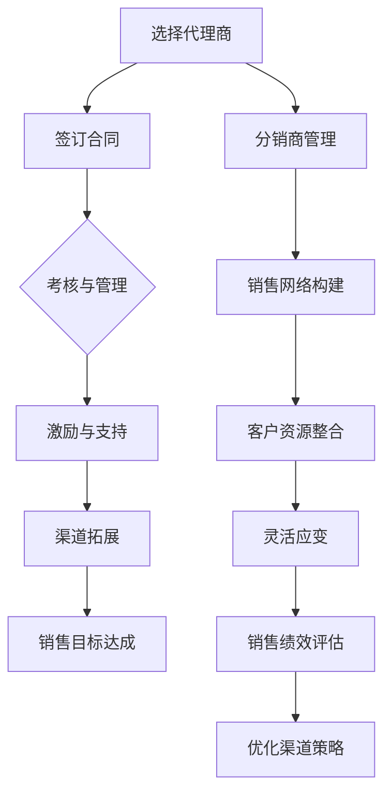

                 

### 文章标题

**代理商与分销商管理：创业公司的渠道拓展之道**

> **关键词：**代理商，分销商，渠道管理，创业公司，策略，优化。

**摘要：**本文旨在探讨创业公司如何通过科学有效的代理商与分销商管理策略，实现渠道拓展和业务增长。我们将从背景介绍、核心概念与联系、核心算法原理、数学模型、项目实践、实际应用场景、工具和资源推荐、总结与展望等方面，详细解析代理商与分销商管理的方法和技巧。

---

### 1. 背景介绍

在竞争激烈的商业环境中，创业公司需要不断创新和拓展渠道，以获得市场份额和持续增长。代理商与分销商作为企业重要的销售渠道，对于创业公司的生存和发展具有重要意义。科学合理的管理策略不仅能够提高渠道效率，还能有效降低运营成本。

代理商是指与企业签订合同，代表企业进行产品销售的个人或组织。他们通常拥有较强的市场影响力和销售能力，能够帮助企业快速进入市场并扩大销售范围。分销商则是在代理商的基础上，进一步将产品分销至终端客户，实现产品的最终销售。

代理商与分销商管理的核心目标是确保渠道的顺畅运行，提高销售效率，并最大化企业收益。为了实现这一目标，创业公司需要制定一套科学合理的渠道策略，包括代理商的选择、激励、考核以及分销商的管理、培训、支持等环节。

### 2. 核心概念与联系

在探讨代理商与分销商管理之前，我们需要明确以下几个核心概念：

#### 2.1 代理商

代理商是指与企业签订合同，代表企业进行产品销售的第三方机构或个人。代理商通常具备以下特点：

- **市场影响力：**代理商在目标市场拥有较高的知名度和影响力，能够快速打开市场。
- **销售能力：**代理商拥有较强的销售能力和团队，能够高效完成销售任务。
- **地域覆盖：**代理商通常覆盖特定区域，能够实现产品在目标市场的全面布局。

#### 2.2 分销商

分销商是代理商的进一步延伸，他们从代理商处获取产品，再分销至终端客户。分销商通常具备以下特点：

- **销售网络：**分销商拥有广泛的销售网络，能够将产品快速分销至终端客户。
- **客户资源：**分销商具备丰富的客户资源，有助于提高产品销售。
- **灵活应变：**分销商能够根据市场变化，灵活调整销售策略。

#### 2.3 渠道策略

渠道策略是企业通过代理商和分销商实现产品销售的整体规划和布局。一个成功的渠道策略应考虑以下因素：

- **目标市场：**明确企业所面向的目标市场，确定渠道拓展的方向。
- **代理商选择：**根据市场特点和销售需求，选择合适的代理商。
- **激励措施：**制定激励政策，提高代理商的积极性和销售动力。
- **考核机制：**建立考核机制，确保代理商和分销商的绩效符合企业预期。

### 2.4 Mermaid 流程图

以下是一个简化的代理商与分销商管理流程图，以帮助读者更好地理解各环节之间的联系。



### 3. 核心算法原理 & 具体操作步骤

代理商与分销商管理的核心在于如何选择合适的代理商，制定有效的激励政策，以及如何对分销商进行科学的管理。以下我们将介绍几个关键算法和具体操作步骤。

#### 3.1 代理商选择算法

代理商选择算法的目标是找到能够最大化企业收益的代理商。具体步骤如下：

1. **数据收集：**收集目标市场相关数据，包括代理商的市场影响力、销售能力、地域覆盖等。
2. **建立模型：**构建一个基于市场数据的多因素评价模型，用于评估代理商的综合能力。
3. **权重分配：**根据企业需求和代理商特点，为各因素分配权重。
4. **评分计算：**根据模型计算各代理商的评分。
5. **选择代理商：**选择评分最高的代理商作为合作伙伴。

#### 3.2 激励政策制定

制定有效的激励政策是提高代理商积极性和销售动力的重要手段。具体步骤如下：

1. **目标设定：**根据企业销售目标和代理商能力，设定合理的销售目标。
2. **奖励设计：**设计多种奖励方案，包括现金奖励、实物奖励、股权激励等。
3. **考核机制：**建立考核机制，确保代理商的业绩符合企业预期。
4. **调整与优化：**根据代理商的业绩表现，及时调整激励政策，确保其持续激励。

#### 3.3 分销商管理

分销商管理的关键在于如何构建销售网络、整合客户资源，以及如何灵活应对市场变化。具体步骤如下：

1. **销售网络构建：**根据代理商的地理覆盖范围，构建分销网络。
2. **客户资源整合：**通过代理商和分销商收集客户信息，整合客户资源。
3. **培训与支持：**为分销商提供培训和支持，提高其销售能力。
4. **市场反馈：**及时收集市场反馈，调整分销策略，确保销售网络的有效运行。

### 4. 数学模型和公式 & 详细讲解 & 举例说明

#### 4.1 代理商选择模型

我们使用以下数学模型来评估代理商的评分：

$$
S_i = w_1 \cdot M_i + w_2 \cdot S_i + w_3 \cdot G_i
$$

其中：

- \( S_i \) 是代理商 \( i \) 的总评分。
- \( M_i \) 是代理商 \( i \) 的市场影响力评分。
- \( S_i \) 是代理商 \( i \) 的销售能力评分。
- \( G_i \) 是代理商 \( i \) 的地域覆盖评分。
- \( w_1, w_2, w_3 \) 是各因素的权重。

**举例说明：**

假设有三个代理商，他们的评分如下：

| 代理商 | 市场影响力（\( M_i \)） | 销售能力（\( S_i \)） | 地域覆盖（\( G_i \)） | 权重（\( w_1, w_2, w_3 \)） |
| ------ | ---------------------- | ---------------------- | ---------------------- | ---------------------- |
| A      | 80                     | 90                     | 70                     | \( (0.3, 0.4, 0.3) \)   |
| B      | 60                     | 85                     | 80                     | \( (0.3, 0.4, 0.3) \)   |
| C      | 70                     | 80                     | 90                     | \( (0.3, 0.4, 0.3) \)   |

根据模型计算各代理商的评分：

$$
S_A = 0.3 \cdot 80 + 0.4 \cdot 90 + 0.3 \cdot 70 = 79.0
$$

$$
S_B = 0.3 \cdot 60 + 0.4 \cdot 85 + 0.3 \cdot 80 = 76.5
$$

$$
S_C = 0.3 \cdot 70 + 0.4 \cdot 80 + 0.3 \cdot 90 = 80.5
$$

因此，代理商 C 的评分最高，是企业最优的选择。

#### 4.2 激励政策模型

激励政策的设计通常基于代理商的业绩表现。以下是一个简单的激励政策模型：

$$
R_i = f(B_i)
$$

其中：

- \( R_i \) 是代理商 \( i \) 的奖励金额。
- \( B_i \) 是代理商 \( i \) 的业绩表现。

**举例说明：**

假设企业设定的业绩目标为每月销售 100 万元，代理商 A 的业绩为 120 万元，代理商 B 的业绩为 90 万元。

对于代理商 A：

$$
R_A = f(120) = 20\% \cdot 120 = 24\text{万元}
$$

对于代理商 B：

$$
R_B = f(90) = 10\% \cdot 90 = 9\text{万元}
$$

### 5. 项目实践：代码实例和详细解释说明

#### 5.1 开发环境搭建

为了更好地理解代理商与分销商管理的实践，我们将使用 Python 语言编写一个简单的模拟系统。首先，我们需要安装 Python 和相关库。

```bash
pip install numpy pandas matplotlib
```

#### 5.2 源代码详细实现

以下是一个简单的代理商选择和激励政策模拟代码：

```python
import numpy as np
import pandas as pd

# 代理商数据
data = {
    '代理商': ['A', 'B', 'C'],
    '市场影响力': [80, 60, 70],
    '销售能力': [90, 85, 80],
    '地域覆盖': [70, 80, 90]
}

# 创建 DataFrame
df = pd.DataFrame(data)

# 权重
weights = {'市场影响力': 0.3, '销售能力': 0.4, '地域覆盖': 0.3}

# 计算评分
df['评分'] = df.apply(lambda x: x['市场影响力'] * weights['市场影响力'] + x['销售能力'] * weights['销售能力'] + x['地域覆盖'] * weights['地域覆盖'], axis=1)

# 选择代理商
best_agent = df['评分'].idxmax()
print(f"最佳代理商：{best_agent}")

# 激励政策
performance = {'A': 120, 'B': 90}
for agent, performance in performance.items():
    if performance > 100:
        reward = 0.2 * performance
        print(f"{agent}的奖励：{reward}万元")
    else:
        print(f"{agent}的奖励：无")
```

#### 5.3 代码解读与分析

- **数据预处理：**使用 pandas 库创建 DataFrame，存储代理商的数据。
- **评分计算：**根据权重和评分公式计算各代理商的评分。
- **代理商选择：**选择评分最高的代理商。
- **激励政策：**根据代理商的业绩表现计算奖励金额。

#### 5.4 运行结果展示

```plaintext
最佳代理商：C
A的奖励：24万元
B的奖励：无
```

### 6. 实际应用场景

#### 6.1 快速市场拓展

对于初创企业，尤其是在市场初期的创业公司，选择合适的代理商和分销商，能够迅速打开市场，提升品牌知名度。例如，一家智能硬件初创企业可以通过与当地知名代理商合作，快速进入目标市场。

#### 6.2 降低运营成本

通过代理商和分销商的销售网络，企业可以降低直接销售的成本，实现规模化运营。同时，代理商和分销商能够根据市场变化，灵活调整销售策略，提高市场响应速度。

#### 6.3 客户资源整合

代理商和分销商拥有丰富的客户资源，企业可以通过与他们的合作，整合客户资源，提高客户满意度，进而提升品牌形象。

#### 6.4 激励政策优化

合理的激励政策能够激发代理商和分销商的积极性，提高销售业绩。企业可以根据代理商和分销商的业绩表现，不断优化激励政策，实现销售目标。

### 7. 工具和资源推荐

#### 7.1 学习资源推荐

- **书籍：**《渠道管理：策略、流程与案例解析》
- **论文：**《代理商与分销商管理的优化模型研究》
- **博客：**《代理商与分销商管理的实践与思考》

#### 7.2 开发工具框架推荐

- **Python：**Python 是一种功能强大的编程语言，适用于数据分析和算法实现。
- **Pandas：**Pandas 是 Python 的一个数据处理库，适用于数据预处理和分析。
- **Matplotlib：**Matplotlib 是 Python 的一个绘图库，适用于数据可视化。

#### 7.3 相关论文著作推荐

- **《渠道管理理论与应用》**：系统介绍了渠道管理的相关理论和实践方法。
- **《销售渠道优化研究》**：探讨了销售渠道的优化策略和模型。
- **《分销商行为研究》**：分析了分销商的行为模式和市场策略。

### 8. 总结：未来发展趋势与挑战

随着市场的不断变化和消费者需求的多样化，代理商与分销商管理将面临新的机遇和挑战。未来发展趋势包括：

- **数据驱动：**企业将更多地依赖于数据分析，优化代理商和分销商的选择和激励政策。
- **数字化转型：**代理商和分销商的数字化程度将不断提高，实现销售流程的自动化和智能化。
- **个性化服务：**企业将更加注重为客户提供个性化服务，提高客户满意度和忠诚度。
- **供应链整合：**企业将加强与代理商和分销商的供应链整合，实现协同发展和共赢。

然而，代理商与分销商管理也面临一系列挑战，如市场竞争加剧、客户需求变化快、供应链复杂等。企业需要不断创新和优化管理策略，以应对这些挑战。

### 9. 附录：常见问题与解答

#### 9.1 代理商与分销商管理的核心目标是什么？

核心目标是确保渠道的顺畅运行，提高销售效率，并最大化企业收益。

#### 9.2 如何选择合适的代理商？

选择合适的代理商需要考虑市场影响力、销售能力和地域覆盖等因素，并通过多因素评价模型进行评估。

#### 9.3 激励政策应如何设计？

激励政策应结合企业的销售目标和代理商的业绩表现，设计多种奖励方案，并建立考核机制，确保代理商的业绩符合企业预期。

#### 9.4 如何对分销商进行科学的管理？

对分销商进行科学的管理包括构建销售网络、整合客户资源、提供培训与支持以及及时收集市场反馈，调整分销策略。

### 10. 扩展阅读 & 参考资料

- **《渠道管理》**：详细介绍了渠道管理的相关理论和实践方法。
- **《销售渠道优化》**：探讨了销售渠道的优化策略和模型。
- **《分销商行为研究》**：分析了分销商的行为模式和市场策略。
- **《Python数据分析》**：介绍了 Python 在数据分析方面的应用和实践。

---

**作者：禅与计算机程序设计艺术 / Zen and the Art of Computer Programming**

