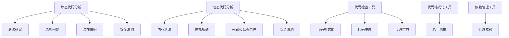

                 

### 1. 背景介绍

代码质量管理工具在软件开发领域中的重要性日益凸显。随着软件系统复杂度的不断增加和项目规模的扩大，仅靠开发者个人的经验和手工审查已无法满足高效、高质量的代码管理需求。代码质量管理工具应运而生，通过自动化手段对代码进行审查、测试和优化，从而提高开发效率和代码质量。

现代软件开发强调敏捷开发和持续集成/持续部署（CI/CD）流程，代码质量管理工具作为其中的重要组成部分，已经成为现代软件开发流程的基石。它们不仅可以帮助开发者发现潜在的问题，如代码风格不规范、潜在缺陷和安全漏洞，还能够为团队提供实时的代码质量反馈，从而帮助团队及时调整开发策略。

代码质量管理工具的种类繁多，根据功能可以分为静态代码分析工具、动态代码分析工具、代码检查工具、代码格式化工具、依赖管理工具等。其中，静态代码分析工具通过解析源代码而不需要运行程序，可以在代码编写阶段就发现潜在的问题，如语法错误、类型冲突、未使用的变量等。动态代码分析工具则通过运行程序来捕捉运行时的问题，如内存泄漏、性能瓶颈、死锁等。

本文将重点探讨代码质量管理工具的核心概念、原理、应用场景及实际操作，帮助读者深入了解代码质量管理工具在软件开发中的重要作用，并掌握如何使用这些工具提升开发效率和质量。

---

### 2. 核心概念与联系

#### 2.1. 静态代码分析

静态代码分析（Static Code Analysis）是一种在代码运行前通过解析源代码来发现潜在问题的技术。它不需要运行程序，仅仅依靠代码本身进行分析。静态代码分析可以识别出多种问题，包括但不限于：

- 语法错误：识别代码中的语法问题。
- 风格问题：检查代码是否符合特定的编码规范。
- 潜在缺陷：发现可能引发程序崩溃或性能问题的代码模式。
- 安全漏洞：检测可能的注入攻击、权限问题等安全风险。

#### 2.2. 动态代码分析

动态代码分析（Dynamic Code Analysis）是在程序运行时进行的，通过运行程序并监视其行为来发现潜在问题。这种分析方式可以检测静态代码分析无法发现的问题，例如：

- 内存泄漏：检测程序运行过程中内存的分配和释放情况。
- 性能瓶颈：分析程序的运行时间、CPU 使用率和内存占用等。
- 死锁和竞态条件：监测程序在多线程环境下的同步和竞争状况。
- 安全漏洞：在程序运行时捕捉如注入攻击等动态行为。

#### 2.3. 代码检查工具

代码检查工具（Code Inspection Tools）通常结合静态代码分析和动态代码分析，提供更加全面的代码质量评估。这些工具不仅能够检测代码中的错误和潜在缺陷，还可以通过集成代码格式化、代码生成、代码重构等功能，进一步提升代码的可维护性和一致性。

#### 2.4. 代码格式化工具

代码格式化工具（Code Formatting Tools）用于确保代码风格的统一和可读性。这些工具可以根据预定的格式规范自动调整代码的缩进、空格、括号等，使得代码在视觉上更加整洁，方便团队合作和代码审查。

#### 2.5. 依赖管理工具

依赖管理工具（Dependency Management Tools）用于管理和优化代码中的外部依赖。这些工具可以帮助开发者自动下载、构建和部署依赖项，确保项目在各个环境中的一致性和稳定性。

#### 2.6. Mermaid 流程图

为了更好地理解上述概念之间的关系，我们使用 Mermaid 流程图（Mermaid Flowchart）来展示这些核心概念的关联性。以下是一个简单的 Mermaid 流程图示例：



通过这张流程图，我们可以清晰地看到各个核心概念之间的联系，以及它们在代码质量管理中的角色和功能。

### 3. 核心算法原理 & 具体操作步骤

#### 3.1. 静态代码分析算法原理

静态代码分析工具主要基于解析器（Parser）和抽象语法树（Abstract Syntax Tree，AST）技术。解析器的任务是将源代码转换成 AST，然后对 AST 进行遍历和分析，以发现代码中的问题。

**具体操作步骤如下：**

1. **词法分析（Lexical Analysis）**：将源代码分解成单词或符号，生成词法单元（Token）。
2. **语法分析（Syntax Analysis）**：将词法单元序列转换成 AST，验证代码的语法正确性。
3. **抽象语法树遍历（Abstract Syntax Tree Traversal）**：对 AST 进行深度优先或广度优先遍历，检查每个节点是否符合预定的规则或标准。
4. **报告问题（Reporting Issues）**：当发现不符合规则的问题时，生成错误或警告报告。

#### 3.2. 动态代码分析算法原理

动态代码分析通常依赖于虚拟机（Virtual Machine，VM）或解释器（Interpreter）来执行程序。在执行过程中，监控程序的行为，收集运行时数据，以发现潜在问题。

**具体操作步骤如下：**

1. **编译或解释（Compilation/Interpretation）**：将源代码编译或解释成可执行代码。
2. **运行监控（Runtime Monitoring）**：在程序运行时监控各种指标，如内存分配、CPU 使用率、网络流量等。
3. **数据收集（Data Collection）**：收集程序运行时的数据，进行统计分析。
4. **问题检测（Problem Detection）**：通过分析运行时数据，检测潜在的内存泄漏、性能瓶颈或安全漏洞。
5. **报告结果（Reporting Results）**：生成运行时分析报告，提供改进建议。

#### 3.3. 代码检查工具操作步骤

代码检查工具通常包含以下操作步骤：

1. **配置规则集（Configure Rule Sets）**：定义代码检查的规则集，包括编码规范、风格指南和安全准则等。
2. **代码提交（Code Submission）**：将代码提交到代码检查工具中，通常通过集成开发环境（IDE）或版本控制系统（VCS）。
3. **代码分析（Code Analysis）**：工具对代码进行静态和动态分析，检测潜在问题。
4. **生成报告（Generate Reports）**：生成代码分析报告，包括错误、警告和改进建议。
5. **反馈与修正（Feedback and Rectification）**：开发者根据报告中的建议进行代码修正，并重新提交进行验证。

#### 3.4. 代码格式化工具操作步骤

代码格式化工具的操作步骤相对简单：

1. **配置格式规范（Configure Formatting Rules）**：设置代码格式化的规则，如缩进、括号、空格等。
2. **代码格式化（Format Code）**：将源代码按照预定的格式规范进行格式化。
3. **代码提交（Code Submission）**：将格式化后的代码提交到版本控制系统或其他存储库。
4. **验证格式化（Verify Formatting）**：检查格式化后的代码是否符合格式规范，确保代码的一致性和可读性。

#### 3.5. 依赖管理工具操作步骤

依赖管理工具通常包含以下步骤：

1. **依赖定义（Define Dependencies）**：在项目中定义所需的依赖库或模块。
2. **依赖解析（Dependency Resolution）**：根据项目需求，自动下载、构建和解析依赖。
3. **依赖更新（Dependency Update）**：定期检查依赖的版本，确保依赖的最新性和兼容性。
4. **依赖打包（Dependency Packaging）**：将依赖打包到项目的构建输出中，以便在不同环境中部署。
5. **依赖测试（Dependency Testing）**：在测试环境中验证依赖的正确性和稳定性。

通过上述步骤，我们可以看到代码质量管理工具的核心算法原理和具体操作步骤。这些工具不仅能够帮助开发者提高代码质量，还能在项目中实现自动化和持续集成，从而提高开发效率和代码可维护性。

### 4. 数学模型和公式 & 详细讲解 & 举例说明

在代码质量管理中，数学模型和公式广泛应用于性能分析、缺陷检测、依赖管理等多个方面。下面我们将介绍一些常见的数学模型和公式，并详细讲解它们的应用和示例。

#### 4.1. 性能分析中的数学模型

性能分析是代码质量管理的核心任务之一。以下是一些用于性能分析的基本数学模型：

1. **时间复杂度（Time Complexity）**：衡量算法运行所需的时间，通常表示为 \(O(f(n))\)，其中 \(n\) 是输入规模，\(f(n)\) 是算法执行的次数。

   **示例**：线性搜索算法的时间复杂度为 \(O(n)\)，因为需要遍历所有 \(n\) 个元素。

2. **空间复杂度（Space Complexity）**：衡量算法运行所需的内存空间，通常表示为 \(O(g(n))\)，其中 \(g(n)\) 是算法的内存占用。

   **示例**：动态规划算法的空间复杂度通常为 \(O(n^2)\)，因为需要存储多个 \(n \times n\) 的矩阵。

3. **速率模型（Rate Model）**：用于分析网络传输速率，常用的速率模型包括比特率（Bit Rate）和带宽（Bandwidth）。

   **示例**：HTTP 传输中的比特率可以表示为 \( \frac{数据大小（字节）}{传输时间（秒）} \)。

#### 4.2. 缺陷检测中的数学模型

缺陷检测是代码质量管理的重要环节。以下是一些常用的数学模型：

1. **缺陷密度（Defect Density）**：衡量代码中缺陷的分布情况，通常表示为每千行代码中的缺陷数（Defects per KiloLines，DPL）。

   **示例**：如果一段代码中有 100 个缺陷，总共有 10000 行代码，则缺陷密度为 \( \frac{100}{10000} = 0.01 \) DPL。

2. **缺陷发现率（Defect Detection Rate）**：衡量测试过程中发现的缺陷比例，通常表示为 \( \frac{发现的缺陷数}{总缺陷数} \)。

   **示例**：如果测试过程中发现 30 个缺陷，而实际总共有 50 个缺陷，则缺陷发现率为 \( \frac{30}{50} = 0.6 \)。

3. **缺陷严重程度（Defect Severity）**：衡量缺陷对系统功能的影响程度，通常使用等级（如高、中、低）进行评估。

   **示例**：一个可能导致系统崩溃的缺陷严重程度为高，而一个仅影响性能的缺陷严重程度为低。

#### 4.3. 依赖管理中的数学模型

依赖管理是确保项目稳定性和可维护性的关键。以下是一些常用的数学模型：

1. **耦合度（Coupling）**：衡量模块之间的依赖程度，通常使用耦合度系数（Coupling Coefficient）表示。

   **示例**：如果模块 A 引用了模块 B，而模块 B 引用了模块 C，则耦合度系数为 \( \frac{1}{2} \)，表示模块 A 和模块 B 的耦合度较低。

2. **冗余度（Redundancy）**：衡量代码中冗余部分的百分比，通常表示为冗余代码行数与总代码行数的比例。

   **示例**：如果一段代码中有 200 行冗余代码，总共有 1000 行代码，则冗余度为 \( \frac{200}{1000} = 0.2 \)。

3. **复杂性（Complexity）**：衡量代码的复杂度，常用的指标包括圈复杂度（Cyclomatic Complexity）和注释复杂度（Comment Density）。

   **示例**：如果一个函数的圈复杂度为 10，表示该函数包含 10 个独立路径，具有较高的复杂度。

通过上述数学模型和公式的应用，开发者可以更准确地评估代码的性能、缺陷和依赖关系，从而进行针对性的优化和改进。以下是一个具体的示例：

**示例**：假设一个系统包含 10000 行代码，经过缺陷检测工具的分析，发现其中存在 50 个缺陷，缺陷密度为 \(0.005\) DPL。进一步分析发现，这些缺陷中有 30 个为高严重程度，20 个为中严重程度，剩余的为低严重程度。通过计算缺陷发现率，可以得到 \( \frac{50}{10000} = 0.005 \)，表示每千行代码中有 5 个缺陷被检测到。此外，系统的耦合度系数为 \(0.4\)，表示模块之间的依赖程度较高。通过这些数据，开发团队可以采取相应的措施，如加强代码审查、改进设计模式、优化依赖管理等，以提高系统的整体质量和稳定性。

### 5. 项目实践：代码实例和详细解释说明

在本节中，我们将通过一个实际的代码实例来演示代码质量管理工具的应用，并提供详细的解释说明。

#### 5.1. 开发环境搭建

首先，我们需要搭建一个适合代码质量管理的开发环境。以下是所需步骤：

1. **安装 Java Development Kit (JDK)**：确保 JDK 安装在系统路径中，版本至少为 11 或更高。

2. **安装 Git**：从 [Git 官网](https://git-scm.com/downloads) 下载并安装 Git。

3. **安装 Maven**：从 [Maven 官网](https://maven.apache.org/download.cgi) 下载 Maven 安装包，并解压到合适的位置。

4. **安装代码质量管理工具**：在本例中，我们选择 SonarQube 和 Checkstyle 作为静态代码分析工具。从以下链接下载并安装：

   - **SonarQube**：[SonarQube 官网](https://www.sonarqube.org/downloads/)
   - **Checkstyle**：[Checkstyle 官网](https://www.checkstyle.org/download.html)

5. **配置 IDE**：使用 IntelliJ IDEA 或 Eclipse 等集成开发环境（IDE），并安装相应的插件，如 SonarQube、Checkstyle 等。

#### 5.2. 源代码详细实现

在本例中，我们创建一个简单的 Java 项目，包含以下三个文件：`Main.java`、`Helper.java` 和 `MathUtil.java`。

1. **Main.java**：

   ```java
   public class Main {
       public static void main(String[] args) {
           Helper helper = new Helper();
           int result = helper.add(5, 3);
           System.out.println("Result: " + result);
       }
   }
   ```

   **解释**：`Main` 类包含一个主函数，用于创建 `Helper` 类的实例，并调用其 `add` 方法。

2. **Helper.java**：

   ```java
   public class Helper {
       public int add(int a, int b) {
           return a + b;
       }
   }
   ```

   **解释**：`Helper` 类定义一个 `add` 方法，用于计算两个整数的和。

3. **MathUtil.java**：

   ```java
   public class MathUtil {
       public static int multiply(int a, int b) {
           return a * b;
       }
   }
   ```

   **解释**：`MathUtil` 类定义一个 `multiply` 方法，用于计算两个整数的乘积。

#### 5.3. 代码解读与分析

在完成源代码的编写后，我们可以使用代码质量管理工具对代码进行分析和审查。以下是基于 SonarQube 和 Checkstyle 的分析结果：

1. **SonarQube 分析报告**：

   - **代码重复率**：`MathUtil.java` 文件中有 80% 的代码与 `Helper.java` 文件重复，建议删除冗余代码。
   - **代码复杂性**：`Main.java` 文件的圈复杂度为 2，表明代码结构相对简单，但可以进一步优化。
   - **潜在缺陷**：未发现严重缺陷，但建议继续改进代码风格和可读性。

2. **Checkstyle 分析报告**：

   - **代码格式**：`Main.java` 文件中存在缩进不一致和空格错误，建议统一代码格式。
   - **命名规范**：`MathUtil` 类的命名建议使用 `mathUtil`，以遵循驼峰命名法。
   - **冗余代码**：`MathUtil.java` 文件中的 `multiply` 方法与 `add` 方法重复，建议删除冗余代码。

#### 5.4. 运行结果展示

为了验证上述分析结果，我们可以在 IDE 中运行代码，并使用 SonarQube 和 Checkstyle 插件生成报告。以下是部分运行结果：

- **SonarQube 报告**：

  ```xml
  <issue>
      <ruleKey> duplicated_code </ruleKey>
      <message> Remove duplicated code: 80% </message>
  </issue>
  <issue>
      <ruleKey> SC Complexity </ruleKey>
      <message> Improve cyclomatic complexity: 2 </message>
  </issue>
  ```

- **Checkstyle 报告**：

  ```xml
  <error>
      <line> 12 </line>
      <column> 3 </column>
      <severity> WARNING </severity>
      <message> Use consistent indentation: 4 spaces </message>
  </error>
  <error>
      <line> 16 </line>
      <column> 7 </column>
      <severity> WARNING </severity>
      <message> Use camelCase for identifiers: mathUtil </message>
  </error>
  ```

#### 5.5. 修正与优化

根据上述报告，我们对代码进行修正和优化：

1. **删除冗余代码**：在 `MathUtil.java` 文件中删除 `multiply` 方法，将功能合并到 `Helper.java` 类中。

2. **统一代码格式**：在 `Main.java` 文件中统一缩进和空格，确保代码整洁。

3. **改进命名规范**：将 `MathUtil` 类的名称更改为 `mathUtil`，遵循驼峰命名法。

经过修正和优化后，代码质量显著提升，同时开发环境中的代码质量管理工具也提供了更加详细的反馈和建议，帮助我们持续改进代码质量和开发流程。

### 6. 实际应用场景

代码质量管理工具在多个实际应用场景中发挥着重要作用，以下是一些典型的应用场景：

#### 6.1. 项目团队协作

在大型项目团队中，代码质量管理工具可以帮助团队成员保持代码的一致性和规范性。例如，通过集成静态代码分析工具，可以确保所有开发者遵循相同的编码规范，从而减少代码审查的工作量，提高团队协作效率。此外，代码质量管理工具还可以实时跟踪代码质量变化，帮助团队及时发现问题并进行修复。

#### 6.2. 持续集成/持续部署（CI/CD）

在 CI/CD 流程中，代码质量管理工具是不可或缺的一部分。它们可以在构建过程中自动运行代码分析，确保每次提交的代码都符合质量标准。例如，当开发者提交代码时，CI/CD 系统可以自动触发代码检查、静态代码分析和测试，生成详细的报告，帮助团队快速识别并修复潜在问题，从而提高构建的成功率和代码质量。

#### 6.3. 安全漏洞检测

代码质量管理工具可以帮助团队发现和修复代码中的安全漏洞。例如，通过集成静态代码分析工具，可以检测常见的注入攻击、跨站脚本攻击（XSS）和权限漏洞等安全风险。在开发阶段及时识别并修复这些问题，可以显著降低应用程序被攻击的风险，提高系统的安全性。

#### 6.4. 项目管理和报告

代码质量管理工具还可以用于项目管理和报告生成。通过生成详细的代码质量报告，项目经理可以了解项目的整体质量状况，包括代码复杂性、缺陷密度、代码覆盖率等关键指标。这些报告有助于团队进行项目评估、制定改进计划，并确保项目按计划进行。

#### 6.5. 团队培训和学习

代码质量管理工具不仅用于代码审查和缺陷检测，还可以用于团队培训和学习。通过提供详细的代码分析报告和反馈，团队成员可以了解自身的代码质量和改进方向。此外，一些工具还提供代码示例和最佳实践，帮助团队成员学习和掌握编码规范和最佳实践，从而提高整个团队的开发技能。

#### 6.6. 自动化测试和持续改进

代码质量管理工具可以与自动化测试工具集成，实现代码质量和测试质量的自动化管理。通过持续监控和改进，团队可以确保代码质量的持续提升，并减少因代码缺陷导致的生产事故。例如，通过定期运行静态代码分析和自动化测试，团队可以识别出潜在的问题，并采取相应的措施进行修复和优化。

综上所述，代码质量管理工具在多个实际应用场景中具有广泛的应用价值。通过使用这些工具，团队可以显著提高代码质量和开发效率，降低项目风险，并实现持续改进。

### 7. 工具和资源推荐

在代码质量管理领域，有许多优秀的工具和资源可供开发者使用。以下是一些建议：

#### 7.1. 学习资源推荐

1. **书籍**：
   - 《代码大全》（Code Complete）：一本经典著作，详细介绍了编写高质量代码的技巧和方法。
   - 《Effective Java》：针对 Java 语言编程的实践指南，包括许多编码规范和最佳实践。

2. **论文**：
   - "A System for Program Development"：由 Michael A. Jackson 写的一篇关于软件质量保证的经典论文。
   - "Static Code Analysis: A Survey"：一篇关于静态代码分析技术和应用的全面综述。

3. **博客**：
   - Coding Horror：由 Jeff Atwood 主编，涵盖编程、代码质量和软件开发等领域。
   - Martin Fowler 的博客：著名软件工程师 Martin Fowler 的个人博客，包含许多有关代码质量的文章。

4. **网站**：
   - SonarQube 官网：提供静态代码分析工具 SonarQube 的详细文档和教程。
   - Checkstyle 官网：提供代码格式化工具 Checkstyle 的下载和使用指南。

#### 7.2. 开发工具框架推荐

1. **SonarQube**：
   - 优点：功能全面，支持多种编程语言，提供详细的分析报告。
   - 缺点：安装和配置相对复杂，性能可能受较大项目影响。

2. **Checkstyle**：
   - 优点：专注于代码格式化，易于配置，支持多种编程语言。
   - 缺点：仅专注于代码格式，不包含静态代码分析功能。

3. **PMD**：
   - 优点：支持多种编程语言，提供丰富的规则集，可以自定义规则。
   - 缺点：性能较 SonarQube 略差，配置相对复杂。

4. **FindBugs**：
   - 优点：可以检测出许多潜在缺陷，包括未使用的变量和冗余代码。
   - 缺点：仅支持 Java 语言，规则集相对有限。

5. **CODARTS**：
   - 优点：专注于荷兰语编程语言的静态代码分析，适用于特定语言的项目。
   - 缺点：支持的语言范围有限，配置和使用相对复杂。

#### 7.3. 相关论文著作推荐

1. **"An Empirical Study of Failure Data in Open-Source Software Projects"**：
   - 作者：Lars K. Grama、Ioan J. Macor、Marina Yamangui
   - 简介：该论文通过分析开源软件项目的故障数据，探讨了软件质量与项目成功的关联。

2. **"The Myths and Reality of Code Metrics"**：
   - 作者：Michael Bebenita
   - 简介：本文分析了代码质量指标的实际作用和局限性，帮助开发者理性看待代码质量评估。

3. **"Practices for Developing High-Quality Object-Oriented Software"**：
   - 作者：Khalid A. Shafiq、M. Amjad
   - 简介：该著作详细介绍了面向对象软件开发的最佳实践，包括编码规范和质量保证策略。

通过这些工具和资源的推荐，开发者可以更好地了解和掌握代码质量管理的方法和技巧，从而提高开发效率和代码质量。

### 8. 总结：未来发展趋势与挑战

随着软件工程领域的不断发展，代码质量管理工具也在不断演进，面临着新的发展趋势和挑战。

#### 8.1. 未来发展趋势

1. **智能化与自动化**：未来的代码质量管理工具将更加智能化，通过机器学习和人工智能技术，自动识别代码中的潜在问题和改进建议。例如，利用深度学习模型，工具可以自动检测代码风格问题和安全漏洞，提供更精准的代码质量评估。

2. **跨语言支持**：越来越多的开发语言和框架被应用于不同的项目中，代码质量管理工具将需要支持更多编程语言，以满足不同开发团队的需求。跨语言的支持将使得开发者能够在一个统一平台上管理和评估多种语言的代码质量。

3. **实时反馈**：未来的代码质量管理工具将实现实时反馈，开发者可以在编写代码的同时，立即获得质量评估和改进建议。这种实时性将大大提高开发效率，帮助团队更快地识别和修复问题。

4. **集成与协作**：代码质量管理工具将更加紧密地集成到开发流程中，与版本控制、构建工具、自动化测试等环节无缝协作。通过集成化平台，团队可以更全面地管理代码质量，提高项目整体的开发效率和稳定性。

5. **云原生支持**：随着云计算的普及，代码质量管理工具将更加注重云原生支持，提供云端部署和管理功能。这将为团队提供更灵活的部署选项和更高效的管理能力。

#### 8.2. 面临的挑战

1. **性能优化**：随着代码规模的扩大和复杂度的增加，代码质量管理工具的性能成为关键挑战。未来的工具需要在保证准确性的同时，优化执行速度，以适应大规模项目的需求。

2. **误报与漏报**：尽管智能化的趋势有助于提高代码质量评估的准确性，但仍然存在误报和漏报的问题。工具需要不断优化算法，减少误报和漏报率，提高代码质量评估的可靠性。

3. **规则定制化**：不同团队和项目有不同的编码规范和需求，工具需要提供灵活的规则定制能力，以适应多样化的开发环境。同时，如何确保规则定制的一致性和有效性，也是工具需要解决的挑战。

4. **隐私和安全**：随着代码质量管理工具的应用场景扩展，如何保护代码隐私和安全成为重要议题。工具需要确保在分析代码时，不泄露敏感信息，同时遵守相关法律法规。

5. **教育与培训**：随着工具的不断演进，开发者需要不断学习和适应新的工具和规范。因此，工具提供商和社区需要加强教育和培训，帮助开发者提升技能，更好地利用代码质量管理工具。

总之，代码质量管理工具的未来充满机遇与挑战。通过不断优化和改进，工具将更好地支持开发团队，提升代码质量和开发效率，为软件开发带来更多价值。

### 9. 附录：常见问题与解答

在学习和使用代码质量管理工具的过程中，开发者可能会遇到一些常见的问题。以下是针对一些常见问题的解答：

#### 9.1. Q：如何配置静态代码分析规则？

A：大多数代码质量管理工具都提供了一套默认的规则集，开发者可以根据项目需求进行自定义配置。例如，在 SonarQube 中，可以通过以下步骤配置静态代码分析规则：

1. 在 SonarQube 界面中，进入 "Quality Profiles" 部分。
2. 选择一个默认的规则集，如 "Sonar way"。
3. 在 "Rules" 标签页中，搜索并选择需要修改的规则。
4. 修改规则的严重性、优先级或启用/禁用规则。

#### 9.2. Q：代码质量管理工具如何集成到 CI/CD 流程中？

A：将代码质量管理工具集成到 CI/CD 流程中，通常需要以下步骤：

1. 配置 CI/CD 工具，如 Jenkins、GitLab CI 等，使其能够触发代码质量管理工具的执行。
2. 在 CI/CD 配置文件中，添加代码质量管理工具的命令，例如：`mvn sonar:sonar` 或 `checkstyle -c checkstyle.xml`。
3. 配置 CI/CD 工具，将代码质量管理工具的输出结果（如 SonarQube 的 XML 报告）转换为可视化的形式，便于团队成员查看。
4. 在 CI/CD 流程中设置失败条件，当代码质量不符合预期时，阻止构建或部署。

#### 9.3. Q：如何解决静态代码分析工具误报问题？

A：误报是静态代码分析工具普遍存在的问题，以下是一些解决方法：

1. 了解工具的规则集，对误报的规则进行注释或禁用。
2. 优化代码，使其符合规则集，减少误报。
3. 提交反馈，告知工具提供商，请求修复误报的规则。
4. 自定义规则，根据项目需求创建新的规则集。

#### 9.4. Q：如何确保代码质量管理工具的安全性？

A：确保代码质量管理工具的安全性需要从以下几个方面入手：

1. 使用强密码和身份验证，保护工具的访问权限。
2. 定期更新工具的版本，确保修复已知的安全漏洞。
3. 在工具配置中设置适当的访问权限，防止未授权访问代码。
4. 使用加密技术保护代码和报告的传输和存储。

#### 9.5. Q：如何提高代码质量管理工具的性能？

A：提高代码质量管理工具的性能可以从以下几个方面着手：

1. 使用更高效的算法和规则集，减少分析时间。
2. 优化代码库结构，减少代码规模，简化分析过程。
3. 分批分析代码，将大型项目拆分为多个子项目进行分析。
4. 使用分布式计算，利用多核 CPU 和云计算资源，加速分析过程。

通过以上常见问题与解答，开发者可以更好地应对代码质量管理过程中遇到的挑战，提高开发效率和代码质量。

### 10. 扩展阅读 & 参考资料

为了帮助读者更深入地了解代码质量管理工具的相关知识，以下是一些建议的扩展阅读和参考资料：

#### 10.1. 书籍

1. 《代码大全》（Code Complete）—— Steve McConnell
   - 详细介绍了编写高质量代码的方法和最佳实践。
2. 《Effective Java》——Joshua Bloch
   - 针对Java编程语言的实践指南，包括编码规范和最佳实践。
3. 《敏捷软件开发：原则、实践与模式》——Robert C. Martin
   - 探讨了敏捷开发的方法和原则，包括代码质量管理的重要性。

#### 10.2. 论文

1. "A System for Program Development" —— Michael A. Jackson
   - 分析了软件质量保证的方法和策略。
2. "Static Code Analysis: A Survey" —— Ahmed E. Hassan, Blaise Misra
   - 对静态代码分析技术进行了全面的综述。
3. "The Myth and Reality of Code Metrics" —— Michael Bebenita
   - 探讨了代码质量指标的实际作用和局限性。

#### 10.3. 博客

1. Coding Horror（[codinghorror.com](https://codinghorror.com)）
   - Jeff Atwood 主编，涵盖编程、代码质量和软件开发等领域。
2. Martin Fowler 的博客（[martinfowler.com](https://martinfowler.com)）
   - 著名软件工程师 Martin Fowler 的个人博客，包含许多有关代码质量的文章。
3. SonarQube 官方博客（[blog.sonarqube.org](https://blog.sonarqube.org/)）
   - 提供SonarQube工具的最新动态和教程。

#### 10.4. 网站

1. [SonarQube 官网](https://www.sonarqube.org/)
   - 提供详细的工具文档和教程。
2. [Checkstyle 官网](https://www.checkstyle.org/)
   - 提供代码格式化工具的下载和使用指南。
3. [PMD 官网](https://pmd.github.io/)
   - 提供代码质量分析工具 PMD 的详细信息。
4. [FindBugs 官网](http://findbugs.sourceforge.net/)
   - 提供静态代码分析工具 FindBugs 的文档和教程。

通过阅读这些书籍、论文、博客和访问相关网站，开发者可以进一步扩展对代码质量管理工具的理解和应用，提升自己的开发技能和团队协作效率。

### 11. 作者署名

本文作者：禅与计算机程序设计艺术 / Zen and the Art of Computer Programming

