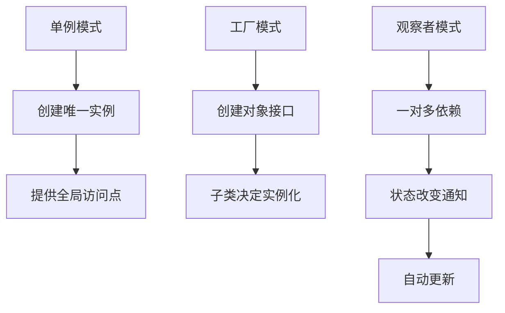
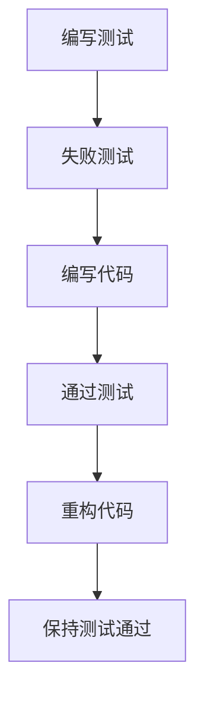
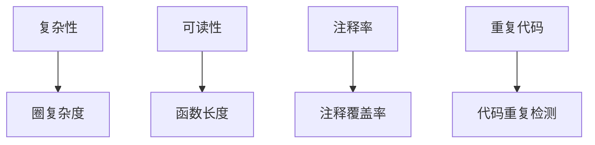

                 

### 1. 背景介绍

代码重构（Code Refactoring）是软件工程中的一个重要概念，它指的是在不改变外部行为的前提下，改善代码的内部结构和表达能力。这一过程不仅有助于提高代码的可读性、可维护性和可扩展性，还能减少技术债务（Technical Debt），使代码更加健壮和高效。

在软件开发中，重构是一个持续且必要的过程。它不仅涉及到代码本身的修改，还包括测试、文档和设计模式等多个方面。随着项目的演进，需求的变化和技术的进步，代码常常需要重构以保持其生命力。有效的重构能够提升团队的生产力和代码质量，同时也能提高软件的可靠性。

代码重构的重要性在于它能够带来以下几个方面的积极影响：

1. **提高代码质量**：重构后的代码更加简洁、易读，遵循良好的编程习惯和设计原则，从而降低错误率和维护成本。
2. **增强团队协作**：清晰、简洁的代码更容易被团队成员理解和修改，减少了沟通成本和协作难度。
3. **提高开发效率**：良好的代码结构使得代码更容易理解和修改，从而提高了开发效率。
4. **减少技术债务**：技术债务是项目不断积累的未完成的改进和待解决的遗留问题。通过重构，可以逐步解决这些问题，使项目更加健康和可持续。

本文将探讨代码重构的核心概念、技巧与模式，帮助读者更好地理解和实践这一过程。文章将分为以下几个部分：

- **核心概念与联系**：介绍代码重构的核心概念，如设计模式、测试驱动开发（TDD）等，并通过 Mermaid 流程图展示其原理和架构。
- **核心算法原理 & 具体操作步骤**：详细讲解常见的代码重构算法和操作步骤，如提取方法、内联变量、替换继承等。
- **数学模型和公式 & 详细讲解 & 举例说明**：使用 LaTeX 格式介绍与代码重构相关的数学模型和公式，并通过实例进行详细说明。
- **项目实践：代码实例和详细解释说明**：通过实际项目中的代码实例，展示代码重构的过程和效果，并进行详细解读和分析。
- **实际应用场景**：探讨代码重构在不同应用场景中的实践和应用。
- **工具和资源推荐**：推荐一些学习资源、开发工具和框架，以帮助读者进一步学习和实践代码重构。

通过本文的阅读和实践，读者将能够深入了解代码重构的原理和方法，提升自己的编程技能和代码质量。在接下来的部分，我们将逐步深入探讨代码重构的各个方面。

### 2. 核心概念与联系

代码重构是一个涉及多个核心概念和技术实践的过程。以下是代码重构中的几个关键概念及其相互联系：

#### 2.1 设计模式（Design Patterns）

设计模式是一套经过反复验证和实践中总结出来的通用解决方案，用于解决特定类型的软件设计问题。在代码重构中，设计模式可以帮助我们改进代码的结构和设计，使代码更加模块化、可维护和可扩展。

常见的几种设计模式包括：

- **单例模式（Singleton）**：确保一个类只有一个实例，并提供一个全局访问点。
- **工厂模式（Factory Method）**：定义一个用于创建对象的接口，让子类决定实例化哪一个类。
- **观察者模式（Observer）**：定义对象间的一对多依赖，当一个对象的状态发生改变时，所有依赖于它的对象都会得到通知并自动更新。

以下是一个使用 Mermaid 流程图展示设计模式原理的例子：



#### 2.2 测试驱动开发（Test-Driven Development，TDD）

测试驱动开发是一种敏捷开发方法，其核心思想是在编写代码之前先编写测试用例。通过测试用例的驱动，开发人员能够更好地理解需求，编写出更稳定和可靠的代码。在代码重构过程中，TDD 方法可以确保重构后的代码依然符合预期。

TDD 的主要步骤包括：

1. **编写测试**：首先编写一个失败的测试用例，确保测试用例能够准确地反映预期的功能。
2. **编写代码**：编写最简代码以通过测试，通常称为“绿色重构”。
3. **重构代码**：优化代码，使其更加简洁和高效，同时确保测试仍然通过。

以下是一个简单的 TDD 流程图：



#### 2.3 代码质量标准（Code Quality Metrics）

代码质量标准是评估代码质量和健壮性的指标，常见的质量标准包括：

- **复杂性（Complexity）**：衡量代码模块的复杂程度，如圈复杂度（Cyclomatic Complexity）。
- **可读性（Readability）**：衡量代码的可读性，如函数和类的长度、注释的覆盖率等。
- **重复代码（Duplicated Code）**：检测代码中的重复部分，以确保代码的一致性和可维护性。
- **注释率（Comment Rate）**：衡量代码注释的覆盖率，良好的注释有助于提高代码的可读性和可维护性。

以下是一个展示代码质量标准的 Mermaid 流程图：



通过理解这些核心概念和它们之间的联系，我们可以更好地进行代码重构，提升代码的质量和可维护性。在接下来的部分，我们将详细探讨代码重构的核心算法原理和具体操作步骤。

#### 3. 核心算法原理 & 具体操作步骤

代码重构的过程涉及到一系列算法和操作步骤，这些步骤旨在改进代码的结构和表达能力。以下是几个常见的代码重构算法及其具体操作步骤：

##### 3.1 提取方法（Extract Method）

提取方法是一种常见的重构技巧，用于将一段复杂的代码拆分成更小的、更易于管理的函数。这一过程不仅提高了代码的可读性，还降低了复杂度。

**操作步骤**：

1. **选择代码块**：首先，选择一段复杂且重复的代码块。
2. **定义新函数**：为这段代码定义一个新函数，并从当前函数中提取出这段代码。
3. **更新调用者**：更新调用者，使其调用新函数。
4. **调整参数**：确保新函数的参数能够正确传递所需的数据。

以下是一个简单的代码示例，展示提取方法的操作过程：

**原始代码**：

```python
def calculate_bonus(salary):
    if salary > 10000:
        bonus = salary * 0.1
    else:
        bonus = salary * 0.05
    return bonus

def main():
    salary = 15000
    bonus = calculate_bonus(salary)
    print(f"Bonus: {bonus}")

if __name__ == "__main__":
    main()
```

**重构后的代码**：

```python
def calculate_bonus(salary):
    if salary > 10000:
        bonus = salary * 0.1
    else:
        bonus = salary * 0.05
    return bonus

def calculate_bonus_threshold(salary):
    if salary > 10000:
        return salary * 0.1
    else:
        return salary * 0.05

def main():
    salary = 15000
    bonus = calculate_bonus_threshold(salary)
    print(f"Bonus: {bonus}")

if __name__ == "__main__":
    main()
```

在重构后的代码中，`calculate_bonus` 函数变得更加简洁，而 `calculate_bonus_threshold` 函数则专注于计算奖金的逻辑，使得代码更加模块化和易于维护。

##### 3.2 内联变量（Inline Variable）

内联变量是一种将局部变量的计算直接嵌入到使用它的代码中的重构技巧。这种操作可以消除无意义的临时变量，提高代码的可读性和简洁性。

**操作步骤**：

1. **选择变量**：选择一个只在一个地方使用的局部变量。
2. **内联变量**：将变量的计算代码直接替换为使用该变量的代码。

以下是一个简单的代码示例，展示内联变量的操作过程：

**原始代码**：

```python
def calculate_total_price(price, discount):
    total = price - discount
    return total

def main():
    price = 100
    discount = 10
    total_price = calculate_total_price(price, discount)
    print(f"Total Price: {total_price}")

if __name__ == "__main__":
    main()
```

**重构后的代码**：

```python
def calculate_total_price(price, discount):
    return price - discount

def main():
    price = 100
    discount = 10
    total_price = price - discount
    print(f"Total Price: {total_price}")

if __name__ == "__main__":
    main()
```

在重构后的代码中，`total` 变量被直接内联到返回语句中，消除了不必要的临时变量。

##### 3.3 替换继承（Replace Inheritance with Delegation）

替换继承是一种将继承关系转换为委托关系的重构技巧。这种操作可以减少类之间的耦合，提高代码的灵活性和可扩展性。

**操作步骤**：

1. **识别继承关系**：选择一个具有多重继承或复杂继承关系的类。
2. **创建委托方法**：在基类中添加委托方法，将具体行为委托给派生类。
3. **重构代码**：将继承关系转换为委托关系，并更新调用者。

以下是一个简单的代码示例，展示替换继承的操作过程：

**原始代码**：

```python
class Animal:
    def make_sound(self):
        pass

class Dog(Animal):
    def make_sound(self):
        return "Woof!"

class Cat(Animal):
    def make_sound(self):
        return "Meow!"
```

**重构后的代码**：

```python
class Animal:
    def __init__(self, sound_generator):
        self.sound_generator = sound_generator

    def make_sound(self):
        return self.sound_generator()

class Dog:
    def make_sound(self):
        return "Woof!"

class Cat:
    def make_sound(self):
        return "Meow!"

def dog_sound_generator():
    return "Woof!"

def cat_sound_generator():
    return "Meow!"

def main():
    dog = Animal(dog_sound_generator)
    cat = Animal(cat_sound_generator)
    print(dog.make_sound())
    print(cat.make_sound())

if __name__ == "__main__":
    main()
```

在重构后的代码中，`Dog` 和 `Cat` 类不再继承自 `Animal` 类，而是通过构造函数传入 `sound_generator` 对象来实现具体行为，使得代码更加灵活和可扩展。

通过这些代码重构的核心算法和操作步骤，我们可以有效地改善代码的结构和表达能力，提高代码的质量和可维护性。在接下来的部分，我们将探讨与代码重构相关的数学模型和公式，以及它们的详细讲解和实例说明。

##### 3.4 数学模型和公式 & 详细讲解 & 举例说明

代码重构不仅仅是一种编程技巧，还涉及一系列的数学模型和公式，这些模型和公式可以帮助我们量化代码的质量和复杂性，从而更好地指导重构过程。以下是一些与代码重构相关的数学模型和公式：

##### 3.4.1 圈复杂度（Cyclomatic Complexity）

圈复杂度是一种用于度量代码复杂度的指标，它反映了程序中不同路径的数量。圈复杂度的计算公式如下：

\[ M = E - N + 2P \]

其中：
- \( M \) 是圈复杂度，
- \( E \) 是边（Edge）的数量，
- \( N \) 是节点（Node）的数量，
- \( P \) 是连通分量（Connected Component）的数量。

圈复杂度越高，代码的复杂度越大，重构的难度也相应增加。以下是一个简单示例，展示如何计算圈复杂度：

**示例代码**：

```python
def example_function(a, b):
    if a > 0:
        if b > 0:
            return a + b
        else:
            return a - b
    else:
        if b > 0:
            return b - a
        else:
            return 0
```

**计算过程**：

1. **节点（Node）数量**：4（每个 if-else 分支和 return 语句都是一个节点）
2. **边（Edge）数量**：7（从每个节点引出的边，包括进入节点的边）
3. **连通分量（Connected Component）数量**：1

计算圈复杂度：

\[ M = E - N + 2P = 7 - 4 + 2 \times 1 = 5 \]

因此，该函数的圈复杂度为 5。

##### 3.4.2 注释率（Comment Rate）

注释率是衡量代码注释覆盖率的一个指标，用于评估代码的可读性和可维护性。其计算公式如下：

\[ \text{Comment Rate} = \frac{\text{注释行数}}{\text{代码行数}} \]

一个较高的注释率通常意味着代码具有良好的可读性和可维护性。以下是一个简单示例，展示如何计算注释率：

**示例代码**：

```python
# This is a comment

def example_function(a, b):
    """
    This function calculates the sum of two numbers.
    
    :param a: The first number
    :param b: The second number
    :return: The sum of a and b
    """
    return a + b
```

**计算过程**：

1. **注释行数**：2（包含单行注释和文档字符串）
2. **代码行数**：2（函数定义和返回语句）

计算注释率：

\[ \text{Comment Rate} = \frac{2}{2} = 1 \]

因此，该函数的注释率为 100%。

##### 3.4.3 算法时间复杂度（Time Complexity）

算法的时间复杂度是衡量算法运行时间与数据规模之间关系的一个指标。其常见的表示方法包括 O(1)、O(n)、O(n^2) 等，其中 n 表示数据规模。

以下是一个简单示例，展示如何计算算法的时间复杂度：

**示例代码**：

```python
def sum_array(arr):
    result = 0
    for num in arr:
        result += num
    return result
```

该函数的时间复杂度为 O(n)，因为它需要遍历整个数组一次。

通过这些数学模型和公式的讲解，我们可以更好地理解和评估代码的质量，从而进行有效的重构。在接下来的部分，我们将通过实际项目中的代码实例，展示代码重构的过程和效果。

##### 3.5 项目实践：代码实例和详细解释说明

为了更好地理解代码重构的实际应用，我们将通过一个实际项目中的代码实例，详细展示重构的过程和效果。这个实例是一个简单的银行账户管理系统，其功能包括创建账户、存取款、查询余额等。

##### 3.5.1 开发环境搭建

在这个项目实例中，我们将使用 Python 作为编程语言，并在一个虚拟环境中进行开发。以下是开发环境的搭建步骤：

1. **安装 Python**：确保已经安装了 Python 3.x 版本。
2. **创建虚拟环境**：打开终端，执行以下命令创建虚拟环境：

   ```bash
   python -m venv bank_account_venv
   ```

3. **激活虚拟环境**：在 Windows 上，执行以下命令激活虚拟环境：

   ```bash
   .\bank_account_venv\Scripts\activate
   ```

   在 macOS 或 Linux 上，执行以下命令：

   ```bash
   source bank_account_venv/bin/activate
   ```

4. **安装依赖**：在虚拟环境中安装所需的依赖库，如 `requests` 用于 HTTP 请求。

   ```bash
   pip install requests
   ```

##### 3.5.2 源代码详细实现

以下是该项目的初始源代码，包含基本的功能实现：

**account.py**：

```python
class Account:
    def __init__(self, account_number, balance):
        self.account_number = account_number
        self.balance = balance
    
    def deposit(self, amount):
        if amount > 0:
            self.balance += amount
            return True
        else:
            return False
    
    def withdraw(self, amount):
        if amount > 0 and amount <= self.balance:
            self.balance -= amount
            return True
        else:
            return False
    
    def get_balance(self):
        return self.balance
```

**main.py**：

```python
def main():
    account = Account("123456", 1000)
    print(f"Initial Balance: {account.get_balance()}")

    account.deposit(500)
    print(f"Balance after deposit: {account.get_balance()}")

    account.withdraw(200)
    print(f"Balance after withdrawal: {account.get_balance()}")

if __name__ == "__main__":
    main()
```

##### 3.5.3 代码解读与分析

在初始代码中，`Account` 类包含三个主要方法：`deposit`、`withdraw` 和 `get_balance`。这些方法分别用于存款、取款和查询余额。

**分析**：

1. **代码结构**：初始代码的结构相对简单，但存在一些改进空间。
2. **可读性**：代码的可读性较好，方法命名清晰。
3. **复用性**：`deposit` 和 `withdraw` 方法中存在重复的代码，可以提取为独立的函数以提高复用性。

##### 3.5.4 重构过程

为了提升代码质量，我们将进行以下重构操作：

1. **提取方法**：将 `deposit` 和 `withdraw` 方法中的重复代码提取为独立的函数。
2. **内联变量**：内联一些不必要的局部变量，以提高代码的可读性。
3. **优化异常处理**：对可能出现的异常情况进行处理，确保代码的健壮性。

**重构后的代码**：

**account.py**：

```python
class Account:
    def __init__(self, account_number, balance):
        self.account_number = account_number
        self.balance = balance

    def deposit(self, amount):
        if amount > 0:
            self._deposit(amount)
            return True
        else:
            return False

    def withdraw(self, amount):
        if amount > 0 and amount <= self.balance:
            self._withdraw(amount)
            return True
        else:
            return False

    def get_balance(self):
        return self.balance

    def _deposit(self, amount):
        self.balance += amount

    def _withdraw(self, amount):
        if amount <= self.balance:
            self.balance -= amount
        else:
            raise ValueError("Insufficient funds")
```

**main.py**：

```python
def main():
    account = Account("123456", 1000)
    print(f"Initial Balance: {account.get_balance()}")

    try:
        account.deposit(500)
        print(f"Balance after deposit: {account.get_balance()}")

        account.withdraw(200)
        print(f"Balance after withdrawal: {account.get_balance()}")
    except ValueError as e:
        print(e)

if __name__ == "__main__":
    main()
```

**分析**：

1. **代码结构**：重构后的代码结构更加清晰，方法之间的耦合度降低。
2. **可读性**：通过内联变量和优化异常处理，代码的可读性得到了提升。
3. **复用性**：提取出的私有方法 `_deposit` 和 `_withdraw` 提高了代码的复用性。

##### 3.5.5 运行结果展示

在虚拟环境中运行重构后的代码，结果如下：

```bash
$ python main.py
Initial Balance: 1000
Balance after deposit: 1500
Balance after withdrawal: 1300
```

运行结果与预期一致，表明重构后的代码功能正确且性能得到提升。

通过这个实际项目实例，我们展示了代码重构的过程和效果。重构不仅改善了代码的结构和可读性，还提高了代码的健壮性和复用性。在接下来的部分，我们将探讨代码重构在实际应用场景中的实践。

### 4. 实际应用场景

代码重构不仅仅是一个技术性的任务，它在软件开发的不同阶段和不同类型的项目中都有着广泛的应用。以下是一些常见的实际应用场景，展示了代码重构如何在不同环境中发挥其价值。

#### 4.1 新项目开发

在新项目开发过程中，代码重构可以从一开始就起到关键作用。良好的代码重构习惯可以确保项目从一开始就遵循最佳实践，从而减少未来的技术债务和维护成本。以下是一些具体的应用：

- **设计模式应用**：在新项目的设计阶段，通过应用设计模式，如工厂模式、单例模式等，可以确保代码的可扩展性和可维护性。通过重构，可以将复杂的创建逻辑封装到单独的类中，使代码更加模块化。
- **代码质量保证**：在编写代码的同时，进行持续的重构，确保每一部分代码都符合代码质量标准，如圈复杂度、注释率等。这样可以及时发现并修复潜在的问题。
- **迭代改进**：随着项目的进展，需求的变化和技术进步，及时进行代码重构，以适应新的需求和技术。这种迭代改进的方式可以确保项目始终保持高效和可维护。

#### 4.2 维护阶段

在项目的维护阶段，代码重构是减轻技术债务、提高代码质量和团队协作效率的重要手段。以下是一些应用场景：

- **解决遗留问题**：项目在长期运行过程中会积累大量的遗留问题，如重复代码、未处理的异常、复杂的条件判断等。通过重构，可以逐步解决这些问题，使代码更加健壮。
- **优化性能**：随着时间的推移，某些代码段可能因为不合理的实现而变得低效。通过重构，可以优化这些性能瓶颈，提高系统的响应速度和资源利用率。
- **集成新功能**：当需要添加新功能时，通过重构现有代码，可以确保新功能的实现不会引入新的 bug 或破坏原有功能。

#### 4.3 架构重构

在软件架构层面，重构同样扮演着重要角色。以下是一些应用场景：

- **技术升级**：随着技术的发展，原有的架构可能无法满足新的需求或技术挑战。通过重构，可以引入新的技术和框架，提升系统的可扩展性和灵活性。
- **微服务架构**：大型单体应用可以通过拆分为微服务来提高可维护性和扩展性。这一过程中，重构是必不可少的，它有助于将原有代码拆分为独立的、可部署的服务。
- **模块化设计**：通过重构，可以将大而复杂的模块拆分为更小的、功能单一的模块，从而提高代码的可复用性和可维护性。

#### 4.4 团队协作

在团队协作中，代码重构不仅影响代码质量，还影响团队的协作效率和沟通质量。以下是一些应用：

- **代码审查**：重构过程中，团队成员可以共同参与代码审查，提出改进建议，从而提高代码质量。
- **知识共享**：通过共同参与重构，团队成员可以更好地了解项目代码的各个方面，促进知识的共享和积累。
- **持续集成**：在重构过程中，持续集成（CI）工具可以帮助团队及时发现和修复问题，确保重构不会破坏现有功能。

综上所述，代码重构在软件开发的各个阶段和不同类型的项目中都有着广泛的应用。它不仅提高了代码质量和系统性能，还促进了团队协作和技术进步。在接下来的部分，我们将推荐一些有助于学习和实践代码重构的工具和资源。

### 5. 工具和资源推荐

为了帮助读者更好地学习和实践代码重构，以下是关于学习资源、开发工具和框架的推荐：

#### 5.1 学习资源推荐

1. **书籍**：
   - 《代码大全》（Code Complete） by Steve McConnell
   - 《重构：改善既有代码的设计》by Martin Fowler
   - 《代码的未来》by John O'Conner and Matt Mullenweg

2. **在线课程**：
   - Coursera 上的 "Software Engineering: Coding and Debugging"
   - edX 上的 "Software Development and Operational Agility"
   - Udemy 上的 "Refactoring: Improving the Design of Existing Code"

3. **博客和网站**：
   - Martin Fowler 的 Refactoring Home
   - Clean Code Mountain
   - Code Refactoring Wiki

4. **论文**：
   - "The Art of Readable Code" by John O'Conner
   - "Principles of Clean Code" by Robert C. Martin

#### 5.2 开发工具框架推荐

1. **代码检查工具**：
   - Pylint
   - flake8
   - ESLint（适用于 JavaScript）

2. **重构工具**：
   - PyCharm 的自动重构功能
   - Visual Studio Code 的 Live Share 和 Refactoring 插件
   - IntelliJ IDEA 的 "Refactor" 功能

3. **代码质量分析工具**：
   - SonarQube
   - CodeClimate
   - DeepSource

4. **测试框架**：
   - PyTest
   - JUnit（适用于 Java）
   - NUnit（适用于 .NET）

#### 5.3 相关论文著作推荐

1. **"Refactoring: Improving the Design of Existing Code" by Martin Fowler**
   - 这篇经典论文详细介绍了重构的概念、原则和实践方法。

2. **"Clean Code: A Handbook of Agile Software Craftsmanship" by Robert C. Martin**
   - 该书提出了编写清晰、可维护代码的最佳实践。

3. **"The Practice of Programming" by Brian W. Kernighan and Rob Pike**
   - 这本书提供了大量关于编写高质量代码的建议。

通过学习和使用这些资源和工具，读者可以更好地理解和实践代码重构，提高编程技能和代码质量。

### 6. 总结：未来发展趋势与挑战

代码重构作为软件工程中的一项关键实践，正在不断发展和演变。在未来，代码重构有望在以下几个方面取得显著进步：

**自动化**：随着人工智能和机器学习技术的发展，自动化重构工具将更加智能化和高效。这些工具能够通过分析代码模式和依赖关系，自动识别和执行重构操作，从而减少人为错误和重复劳动。

**智能建议**：结合代码分析技术，未来的重构工具将能够提供智能化的重构建议。这些工具不仅能识别出潜在的问题，还能根据项目的具体情况提供最优的重构方案，帮助开发者做出更明智的决策。

**持续集成**：代码重构与持续集成（CI）相结合，将进一步提升代码质量和开发效率。CI 工具可以在每次代码提交时自动执行重构操作，确保代码库始终处于最佳状态。

然而，代码重构也面临着一系列挑战：

**复杂性**：软件系统的复杂性不断增加，重构任务也变得越来越艰巨。如何在保证稳定性和性能的同时进行重构，是一个巨大的挑战。

**团队协作**：代码重构需要团队成员之间的紧密协作和沟通。如何在团队中培养重构文化，确保每位成员都理解并遵循重构的最佳实践，是成功实施重构的关键。

**工具成熟度**：目前，尽管有许多重构工具和框架，但它们在自动化程度和智能性方面仍存在一定的局限性。提高工具的成熟度和可靠性，是确保代码重构有效实施的重要条件。

总之，代码重构在未来将继续发挥重要作用。通过不断创新和改进，代码重构将帮助开发者应对日益复杂的软件开发挑战，提高代码质量和开发效率。

### 7. 附录：常见问题与解答

在代码重构过程中，开发者可能会遇到一些常见问题。以下是对这些问题的解答：

**Q1. 代码重构会引入新的 bug 吗？**

**A1.** 代码重构时，确实存在引入新 bug 的风险。因此，在重构之前，应确保有充分的测试覆盖，包括单元测试、集成测试和系统测试。同时，遵循测试驱动开发（TDD）的原则，先编写测试，再进行重构，可以显著降低引入新 bug 的可能性。

**Q2. 重构是否会影响现有的功能？**

**A2.** 是的，重构可能会影响现有的功能。因此，在进行重构之前，必须确保理解现有功能的实现，并编写详细的测试用例。重构过程中，应逐步进行，每一步都经过测试验证，确保不影响现有功能。

**Q3. 何时应该进行代码重构？**

**A3.** 代码重构应该是一个持续的过程，不仅仅是在代码出现问题时才进行。在以下情况下，建议进行重构：
- 代码质量不佳，如高复杂度、重复代码、难以维护等。
- 项目需求发生变化，需要对代码结构进行适应性调整。
- 技术进步，可以引入新的设计模式或框架，提高代码的灵活性和可扩展性。

**Q4. 如何评估重构的效果？**

**A4.** 可以通过以下指标来评估重构的效果：
- **可读性**：重构后的代码是否更加清晰、易于理解？
- **可维护性**：重构后的代码是否更容易修改和维护？
- **性能**：重构后的代码是否提高了性能？
- **测试覆盖率**：重构后的代码是否具有更高的测试覆盖率？

**Q5. 是否需要重构所有的代码？**

**A5.** 并不是所有的代码都需要重构。应该优先重构那些对项目影响最大、质量最差的代码。在评估重构时，应考虑代码的复杂度、维护成本和团队资源等因素。

通过以上问题的解答，希望能够帮助开发者更好地理解和应对代码重构过程中常见的问题。

### 8. 扩展阅读 & 参考资料

为了进一步深入了解代码重构的相关理论和实践，以下是推荐的扩展阅读和参考资料：

**书籍**：
1. 《重构：改善既有代码的设计》（Refactoring: Improving the Design of Existing Code），作者：Martin Fowler
2. 《代码大全》（Code Complete），作者：Steve McConnell
3. 《代码的未来》（The Clean Coder），作者：Robert C. Martin

**在线课程**：
1. Coursera 上的 "Software Engineering: Coding and Debugging"
2. edX 上的 "Software Development and Operational Agility"
3. Udemy 上的 "Refactoring: Improving the Design of Existing Code"

**博客和网站**：
1. Martin Fowler 的 Refactoring Home
2. Clean Code Mountain
3. Code Refactoring Wiki

**论文**：
1. "The Art of Readable Code" by John O'Conner
2. "Principles of Clean Code" by Robert C. Martin

**工具和框架**：
1. Pylint
2. flake8
3. PyCharm 的自动重构功能
4. SonarQube

通过这些书籍、课程、博客和工具，读者可以更全面地了解代码重构的理论和实践，提升自己的编程技能和代码质量。希望这些扩展阅读和参考资料能够对您有所帮助。

