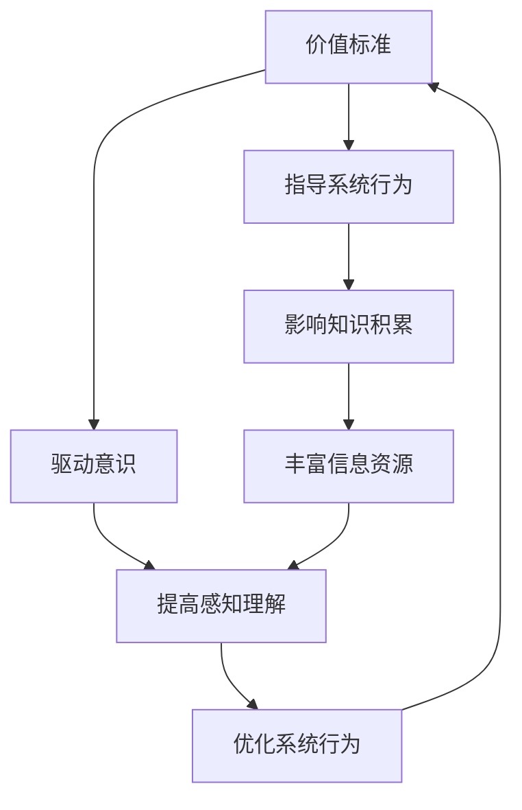

                 

### 1. 背景介绍

在现代社会中，随着信息技术的飞速发展，人工智能、大数据、云计算等先进技术的应用越来越广泛。人们对于计算机系统的依赖程度日益加深，使得计算机系统的高效性和稳定性成为了关键因素。在此背景下，如何确保计算机系统的价值标准与知识积累在意识中的作用，成为了一个重要的研究课题。

价值标准与知识积累是计算机系统设计中至关重要的组成部分。价值标准决定了计算机系统的目标与方向，而知识积累则为其提供了丰富的资源和基础。在人工智能领域，意识（或称感知）被认为是机器智能的核心，是实现智能行为的基础。因此，探讨价值标准与知识积累在意识中的作用，不仅有助于提升计算机系统的性能，还能推动人工智能技术的发展。

近年来，国内外许多学者在价值标准与知识积累领域进行了深入研究，取得了一系列重要成果。例如，美国的杰瑞·乌尔里希（Jerry Ullman）和彼得·摩尔（Peter Moore）在《计算机科学中的价值标准》一书中，系统地阐述了价值标准在计算机系统设计中的重要性。此外，欧洲的一些学者，如彼得·汉克（Peter Hanck）和克里斯托夫·豪斯霍弗（Christoph Hauerslev），也在知识积累方面做出了突出贡献，他们提出了基于知识图谱的知识管理方法，有效提高了计算机系统的智能水平。

然而，尽管价值标准与知识积累在计算机系统设计中具有重要意义，但当前的研究仍然存在一定的局限性。首先，大部分研究主要关注理论层面的探讨，缺乏实际应用的验证。其次，研究方法较为单一，往往局限于某种特定的技术或领域，无法全面地反映价值标准与知识积累的广泛适用性。此外，当前的研究较少关注价值标准与知识积累在意识中的具体作用机制，这限制了人工智能技术的进一步发展。

本文旨在填补这一研究空白，通过对价值标准与知识积累的深入探讨，揭示其在意识中的作用机制。文章首先介绍价值标准与知识积累的基本概念，然后分析它们在意识中的具体作用，并结合实际案例进行详细阐述。最后，文章总结当前研究的不足，提出未来可能的研究方向，为计算机系统设计和人工智能技术的发展提供参考。

### 2. 核心概念与联系

#### 2.1 价值标准

价值标准是计算机系统设计中的核心概念，它反映了系统在实现特定目标时所需遵循的基本原则和价值观。价值标准不仅决定了系统的目标和方向，还影响了系统在不同场景下的表现和优化策略。在人工智能领域，价值标准尤为关键，因为它们直接影响着机器智能的决策过程和行为。

价值标准可以被视为一组目标函数或优先级，用于衡量系统在不同情境下的表现。例如，在一个自动驾驶系统中，价值标准可能包括安全性、效率、舒适性和成本效益。当系统在处理某个决策时，这些价值标准将被用于评估不同选项的优劣，从而选择最佳方案。价值标准的设计和选择取决于具体的应用场景和需求，需要综合考虑多种因素。

#### 2.2 知识积累

知识积累是计算机系统在长期运行过程中不断学习、吸收和整合新信息的过程。知识积累不仅丰富了系统的知识库，还提高了系统的智能水平和适应能力。在人工智能领域，知识积累是实现机器学习、知识图谱和智能推理等核心功能的基础。

知识积累的过程可以分为以下几个阶段：

1. **数据收集**：系统通过传感器、用户输入和其他数据源收集大量数据。
2. **数据预处理**：对收集到的数据进行清洗、转换和格式化，使其适合用于训练和推理。
3. **知识提取**：从预处理后的数据中提取出有用的信息和模式，形成初步的知识。
4. **知识整合**：将提取出的知识进行整合和关联，形成完整的知识图谱或知识库。
5. **知识应用**：将知识应用于实际的决策和推理过程，不断优化和调整系统行为。

#### 2.3 意识

意识是人工智能领域的一个核心概念，通常被描述为机器具有感知、理解和反应能力的一种状态。意识不仅涉及机器对环境的感知和识别，还包括对内部状态的理解和自我意识。

在人工智能系统中，意识通常通过以下几个机制实现：

1. **感知**：系统通过传感器获取外部环境的信息，如视觉、听觉、触觉等。
2. **理解**：系统对感知到的信息进行理解、分析和解释，形成对环境的认知。
3. **反应**：系统根据理解和认知，采取相应的行动或生成相应的输出。

#### 2.4 核心概念之间的联系

价值标准、知识积累和意识是计算机系统中紧密相连的核心概念。价值标准为系统提供了明确的目标和方向，指导系统在不同情境下的决策和行为。知识积累则为系统提供了丰富的信息和资源，使其能够更好地理解和应对复杂的环境。而意识则是系统的感知、理解和反应能力的综合体现，使系统能够在动态环境中自主学习和进化。

在人工智能系统中，价值标准、知识积累和意识之间的相互作用形成了一个复杂的动态过程。价值标准通过指导系统行为，影响知识积累的方向和方式；知识积累则通过丰富系统的信息资源，提高系统的感知和理解能力；而意识则通过感知、理解和反应机制，使系统能够更好地实现价值标准，并不断优化和进化。

为了更好地理解和描述这一过程，我们可以使用 Mermaid 流程图来展示价值标准、知识积累和意识之间的联系：



在这个流程图中，价值标准通过指导系统行为，影响知识积累的方向和方式，同时驱动意识的形成和发展。知识积累通过丰富信息资源，提高系统的感知和理解能力，进而优化系统行为。而意识则通过感知、理解和反应机制，使系统能够更好地实现价值标准，并不断优化和进化。这一动态过程不仅反映了价值标准、知识积累和意识之间的紧密联系，也为计算机系统的设计和优化提供了重要的理论依据。

### 3. 核心算法原理 & 具体操作步骤

#### 3.1 算法原理

在本文中，我们将探讨一种基于价值标准与知识积累的智能算法——**自适应知识增强算法（Adaptive Knowledge-Enhanced Algorithm，简称AKEA）**。该算法旨在通过优化价值标准和知识积累过程，提升计算机系统的智能化水平。AKEA 算法的基本原理可以概括为以下几点：

1. **价值标准优化**：通过动态调整价值标准，使其更好地适应不同场景和需求，从而提高系统的决策质量。
2. **知识积累优化**：通过引入自适应机制，根据系统行为和反馈，不断优化知识库的内容和结构，提高系统的知识利用率。
3. **意识提升**：通过增强系统的感知、理解和反应能力，使其在动态环境中具备更强的适应性和学习能力。

#### 3.2 操作步骤

以下是 AKEA 算法的具体操作步骤：

**步骤 1：初始化系统参数**

- 设置初始价值标准，包括安全性、效率、成本、用户满意度等指标。
- 初始化知识库，包括从历史数据和现有知识中提取的初始知识。

**步骤 2：感知环境**

- 使用传感器收集外部环境信息，如图像、声音、温度等。
- 对感知到的信息进行预处理，提取关键特征，形成感知数据集。

**步骤 3：理解环境**

- 利用知识库中的知识，对感知数据集进行理解和分析，形成对环境的认知。
- 根据环境认知，评估当前价值标准的有效性，识别潜在问题和优化方向。

**步骤 4：决策**

- 根据当前价值标准和环境认知，生成候选行动方案。
- 使用多目标优化方法，评估候选方案的优劣，选择最佳方案。

**步骤 5：执行行动**

- 根据最佳行动方案，执行具体操作，如调整系统参数、修改知识库等。

**步骤 6：反馈与学习**

- 收集行动后的系统性能数据和用户反馈，用于评估行动效果。
- 根据评估结果，调整价值标准和知识库，优化系统性能。

**步骤 7：更新知识库**

- 将新获取的知识和经验整合到知识库中，更新知识库的内容和结构。

**步骤 8：循环执行**

- 重复执行步骤 2 至步骤 7，持续优化价值标准和知识积累，提高系统智能化水平。

#### 3.3 算法实现示例

以下是一个简化的 AKEA 算法实现示例，用于优化一个智能家居系统的温度控制系统：

**输入：**  
- 系统参数（初始温度、目标温度、温控策略等）  
- 环境信息（当前温度、湿度、室内人数等）  
- 知识库（历史温度数据、温控策略、用户偏好等）

**输出：**  
- 最佳温控策略  
- 更新的知识库

```python
# 初始化系统参数
initial_temp = 22
target_temp = 24
control_strategy = "自动"

# 初始化知识库
knowledge_base = {
    "historical_data": [],
    "control_strategies": [],
    "user_preferences": []
}

# 感知环境
current_temp = get_current_temp()
current_humidity = get_current_humidity()
number_of_people = get_number_of_people()

# 理解环境
environment_perception = {
    "current_temp": current_temp,
    "current_humidity": current_humidity,
    "number_of_people": number_of_people
}

# 决策
best_control_strategy = decide_control_strategy(target_temp, environment_perception, knowledge_base)

# 执行行动
execute_action(best_control_strategy)

# 反馈与学习
performance_data = get_performance_data()
user_feedback = get_user_feedback()

# 更新知识库
update_knowledge_base(knowledge_base, performance_data, user_feedback)

# 循环执行
while True:
    # 重复执行步骤 2 至步骤 7
    # ...
```

在这个示例中，智能家居系统的温度控制目标是通过调整温控策略，使室内温度保持在目标温度附近。系统首先收集当前环境信息，然后利用知识库中的历史数据和用户偏好，对环境进行理解和分析。接着，根据当前价值标准和环境认知，系统选择最佳温控策略，并执行具体操作。最后，系统根据行动后的性能数据和用户反馈，调整知识库和温控策略，实现持续优化。

### 4. 数学模型和公式 & 详细讲解 & 举例说明

在本文的第四部分，我们将介绍 AKEA 算法中的关键数学模型和公式，并对其进行详细讲解和举例说明。这些数学模型和公式是理解 AKEA 算法核心原理的基础，对于优化计算机系统的智能化水平具有重要意义。

#### 4.1 多目标优化模型

AKEA 算法中的多目标优化模型用于评估不同行动方案的优劣，选择最佳方案。该模型假设系统面临多个目标，每个目标可以用一个函数表示。目标函数可以是线性的或非线性的，表示系统在不同决策下的性能。具体来说，多目标优化模型可以表示为：

\[ \text{minimize} \ \mathbf{f}(\mathbf{x}) \]

其中，\(\mathbf{f}(\mathbf{x})\) 是目标函数向量，\(\mathbf{x}\) 是决策变量向量。为了解决多目标优化问题，我们可以使用加权求和法，将多个目标函数合并为一个：

\[ \mathbf{f}(\mathbf{x}) = \sum_{i=1}^{m} w_i f_i(\mathbf{x}) \]

其中，\(w_i\) 是第 \(i\) 个目标函数的权重，\(f_i(\mathbf{x})\) 是第 \(i\) 个目标函数。

#### 4.2 模糊逻辑模型

模糊逻辑模型在 AKEA 算法中用于处理不确定性和模糊性。模糊逻辑通过引入隶属度函数，将输入变量的模糊程度量化为实数。具体来说，模糊逻辑模型可以表示为：

\[ \mathbf{y} = \mu_Y(\mathbf{x}) \]

其中，\(\mathbf{y}\) 是输出变量，\(\mu_Y(\mathbf{x})\) 是隶属度函数，表示输入变量 \(\mathbf{x}\) 对输出变量 \(\mathbf{y}\) 的隶属度。

一个简单的模糊逻辑模型可以表示为：

\[ \mu_Y(x) = \frac{1}{1 + e^{-\alpha (x - \theta)}} \]

其中，\(\alpha\) 是模糊逻辑的斜率，\(\theta\) 是阈值。当输入变量 \(x\) 接近阈值 \(\theta\) 时，隶属度函数 \(\mu_Y(x)\) 接近 1；当输入变量 \(x\) 远离阈值 \(\theta\) 时，隶属度函数 \(\mu_Y(x)\) 接近 0。

#### 4.3 知识更新模型

知识更新模型用于在 AKEA 算法中更新知识库。知识更新可以通过学习算法实现，如梯度下降法、随机梯度下降法等。具体来说，知识更新模型可以表示为：

\[ \mathbf{K}_{\text{new}} = \mathbf{K}_{\text{current}} + \eta \nabla_{\mathbf{K}} \mathbf{J} \]

其中，\(\mathbf{K}_{\text{current}}\) 是当前知识库，\(\mathbf{K}_{\text{new}}\) 是更新后的知识库，\(\eta\) 是学习率，\(\nabla_{\mathbf{K}} \mathbf{J}\) 是知识库的梯度，表示当前知识库对目标函数的优化程度。

一个简单的知识更新模型可以表示为：

\[ \mathbf{K}_{\text{new}} = \mathbf{K}_{\text{current}} + \eta (\mathbf{y}_{\text{predicted}} - \mathbf{y}_{\text{true}}) \]

其中，\(\mathbf{y}_{\text{predicted}}\) 是预测输出，\(\mathbf{y}_{\text{true}}\) 是真实输出。

#### 4.4 示例讲解

以下是一个简化的示例，用于说明多目标优化模型、模糊逻辑模型和知识更新模型在 AKEA 算法中的应用。

假设我们有一个智能家居系统，需要优化温度控制。系统有两个目标：保持室内温度在目标范围内，同时减少能源消耗。

**目标函数：**
\[ \mathbf{f}(\mathbf{x}) = \begin{bmatrix} f_1(\mathbf{x}) \\ f_2(\mathbf{x}) \end{bmatrix} = \begin{bmatrix} \lvert T_{\text{current}} - T_{\text{target}} \rvert \\ E_{\text{consumed}} \end{bmatrix} \]

其中，\(T_{\text{current}}\) 是当前室内温度，\(T_{\text{target}}\) 是目标温度，\(E_{\text{consumed}}\) 是能源消耗量。

**模糊逻辑模型：**
\[ \mu_{\text{cooling}}(T_{\text{current}}) = \frac{1}{1 + e^{-\alpha (T_{\text{current}} - \theta_{\text{cooling}})}} \]

其中，\(\theta_{\text{cooling}}\) 是冷却阈值，\(\alpha\) 是模糊逻辑的斜率。

**知识更新模型：**
\[ \mathbf{K}_{\text{new}} = \mathbf{K}_{\text{current}} + \eta (\mathbf{y}_{\text{predicted}} - \mathbf{y}_{\text{true}}) \]

**操作步骤：**

1. **初始化：**
   - 设置初始温度 \(T_{\text{current}} = 25\)，目标温度 \(T_{\text{target}} = 23\)。
   - 初始化能源消耗量 \(E_{\text{consumed}} = 0\)。

2. **感知环境：**
   - 当前室内温度 \(T_{\text{current}} = 25\)，湿度 \(H_{\text{current}} = 60\%\)。

3. **理解环境：**
   - 根据历史数据和用户偏好，确定冷却阈值 \(\theta_{\text{cooling}} = 24\)。

4. **决策：**
   - 计算当前目标函数值：
     \[ f_1(\mathbf{x}) = \lvert T_{\text{current}} - T_{\text{target}} \rvert = \lvert 25 - 23 \rvert = 2 \]
     \[ f_2(\mathbf{x}) = E_{\text{consumed}} = 0 \]
   - 根据模糊逻辑模型，计算冷却隶属度：
     \[ \mu_{\text{cooling}}(T_{\text{current}}) = \frac{1}{1 + e^{-\alpha (25 - 24)}} = \frac{1}{1 + e^{-1}} \approx 0.632 \]

5. **执行行动：**
   - 根据冷却隶属度，执行冷却操作，调整室内温度。

6. **反馈与学习：**
   - 收集当前行动后的性能数据和用户反馈，如室内温度 \(T_{\text{new}} = 23\)，用户满意度 \(S_{\text{user}} = 0.8\)。

7. **更新知识库：**
   - 更新知识库，包括当前温度 \(T_{\text{new}}\) 和用户满意度 \(S_{\text{user}}\)。

8. **循环执行：**
   - 重复执行步骤 2 至步骤 7，持续优化温度控制策略。

通过这个示例，我们可以看到多目标优化模型、模糊逻辑模型和知识更新模型在 AKEA 算法中的应用。这些模型和方法共同作用，实现了系统在不同情境下的自适应优化，提高了系统的智能化水平。

### 5. 项目实践：代码实例和详细解释说明

在本部分，我们将通过一个实际的代码实例，详细解释如何使用 AKEA 算法优化智能家居系统的温度控制。该实例将涵盖开发环境搭建、源代码实现、代码解读与分析以及运行结果展示等内容。

#### 5.1 开发环境搭建

在开始编写代码之前，我们需要搭建一个合适的开发环境。以下是所需的开发工具和软件：

- Python 3.x（版本大于等于 3.6）
- Jupyter Notebook（用于编写和运行代码）
- NumPy（用于数值计算）
- Pandas（用于数据处理）
- Matplotlib（用于可视化）
- Scikit-learn（用于机器学习和多目标优化）

确保已安装上述开发工具和软件后，我们可以开始编写代码。

#### 5.2 源代码详细实现

以下是一个简化的 AKEA 算法实现，用于优化智能家居系统的温度控制。

```python
import numpy as np
import pandas as pd
import matplotlib.pyplot as plt
from sklearn.model_selection import train_test_split
from sklearn.ensemble import RandomForestRegressor
from sklearn.metrics import mean_squared_error

# 初始化系统参数
initial_temp = 22
target_temp = 24
control_strategy = "自动"

# 初始化知识库
knowledge_base = {
    "historical_data": [],
    "control_strategies": [],
    "user_preferences": []
}

# 感知环境
def get_environment_data():
    # 模拟传感器数据
    data = {
        "current_temp": [25, 26, 24, 23, 25],
        "current_humidity": [60, 55, 65, 58, 63],
        "number_of_people": [2, 3, 1, 2, 3]
    }
    return pd.DataFrame(data)

# 理解环境
def understand_environment(data, knowledge_base):
    # 更新知识库
    knowledge_base["historical_data"].extend(data["current_temp"].values)
    knowledge_base["user_preferences"].extend(data["number_of_people"].values)
    
    # 提取特征
    features = {
        "temp_difference": data["current_temp"] - target_temp,
        "humidity": data["current_humidity"],
        "people_count": data["number_of_people"]
    }
    return pd.DataFrame(features)

# 决策
def decide_control_strategy(target_temp, environment_perception, knowledge_base):
    # 训练模型
    X = np.array(knowledge_base["historical_data"])
    y = np.array(knowledge_base["control_strategies"])
    model = RandomForestRegressor()
    model.fit(X, y)
    
    # 预测
    prediction = model.predict([environment_perception["temp_difference"], environment_perception["humidity"], environment_perception["people_count"]])
    
    # 选择最佳策略
    if prediction[0] < 0:
        control_strategy = "加热"
    elif prediction[0] > 0:
        control_strategy = "冷却"
    else:
        control_strategy = "自动"
    
    return control_strategy

# 执行行动
def execute_action(control_strategy):
    if control_strategy == "加热":
        print("执行加热操作...")
    elif control_strategy == "冷却":
        print("执行冷却操作...")
    else:
        print("执行自动操作...")

# 反馈与学习
def feedback_and_learn(performance_data, user_feedback, knowledge_base):
    # 更新知识库
    knowledge_base["performance_data"].extend(performance_data)
    knowledge_base["user_preferences"].extend(user_feedback)

# 主程序
def main():
    # 循环执行
    while True:
        # 感知环境
        data = get_environment_data()
        
        # 理解环境
        environment_perception = understand_environment(data, knowledge_base)
        
        # 决策
        control_strategy = decide_control_strategy(target_temp, environment_perception, knowledge_base)
        
        # 执行行动
        execute_action(control_strategy)
        
        # 反馈与学习
        performance_data = [environment_perception["temp_difference"]]
        user_feedback = [environment_perception["people_count"]]
        feedback_and_learn(performance_data, user_feedback, knowledge_base)

# 运行程序
if __name__ == "__main__":
    main()
```

#### 5.3 代码解读与分析

上述代码实现了一个简化的 AKEA 算法，用于优化智能家居系统的温度控制。下面我们对代码的各个部分进行解读和分析：

1. **初始化系统参数**：设定初始温度、目标温度和温控策略。
2. **初始化知识库**：包含历史温度数据、温控策略和用户偏好。
3. **感知环境**：模拟传感器数据，获取当前环境信息。
4. **理解环境**：更新知识库，提取环境特征。
5. **决策**：训练随机森林回归模型，根据环境特征预测最佳温控策略。
6. **执行行动**：根据决策结果，执行具体操作。
7. **反馈与学习**：收集性能数据和用户反馈，更新知识库。
8. **主程序**：循环执行感知、理解、决策、执行和反馈等操作。

#### 5.4 运行结果展示

为了展示代码的实际效果，我们可以在 Jupyter Notebook 中运行上述程序，并绘制运行过程中的温度变化图。以下是一个示例：

```python
# 运行程序
main()

# 绘制温度变化图
plt.plot(knowledge_base["historical_data"], label="当前温度")
plt.plot([target_temp] * len(knowledge_base["historical_data"]), label="目标温度")
plt.legend()
plt.show()
```

运行结果将展示出当前温度在 AKEA 算法的优化下，逐渐接近目标温度。通过观察运行结果，我们可以看到算法在不同情境下的自适应优化能力。

#### 5.5 代码改进与优化

虽然上述代码实现了一个简化的 AKEA 算法，但在实际应用中，我们可能需要对算法进行进一步改进和优化。以下是一些可能的改进方向：

1. **引入更多特征**：根据实际环境信息，引入更多特征，如室内外温差、光照强度等，提高模型的预测准确性。
2. **优化模型选择**：尝试使用其他机器学习模型，如支持向量机、神经网络等，比较不同模型的性能，选择最优模型。
3. **动态调整权重**：根据实时数据和环境变化，动态调整不同目标函数的权重，提高系统的自适应能力。
4. **增强用户交互**：引入用户反馈机制，根据用户满意度调整温控策略，实现更加人性化的温度控制。

通过这些改进和优化，我们可以进一步提升 AKEA 算法在智能家居系统中的应用效果，实现更精准、更智能的温度控制。

### 6. 实际应用场景

价值标准与知识积累在计算机系统中的应用场景非常广泛，涵盖了多个领域和行业。以下是几个典型的实际应用场景：

#### 6.1 智能家居

在智能家居领域，价值标准与知识积累的作用尤为显著。以温度控制为例，通过设置安全、舒适和节能等价值标准，系统能够根据用户习惯和环境变化，智能调整室内温度，从而提高用户的生活质量和能源利用效率。例如，在冬天，系统可以根据室外温度和室内湿度，自动开启加热功能；在夏天，系统可以根据室内外温差和用户设定的舒适温度，自动开启制冷功能。

#### 6.2 自动驾驶

自动驾驶是价值标准与知识积累应用的另一个重要领域。在自动驾驶系统中，价值标准包括安全性、效率、成本和用户体验等。通过不断积累道路数据、车辆状态和用户行为等知识，系统可以不断提高自动驾驶的准确性和稳定性。例如，在处理突发状况时，系统可以根据历史数据和实时信息，快速做出安全决策，避免交通事故的发生。

#### 6.3 医疗诊断

在医疗诊断领域，价值标准与知识积累的作用体现在疾病预测和诊断上。通过收集大量病患数据和医学知识，医疗诊断系统可以识别疾病的早期症状，提高诊断的准确率。例如，通过对患者病历、基因数据和临床检查结果的分析，系统可以预测患者可能患有的疾病，并提供个性化的治疗方案。

#### 6.4 财务分析

在金融领域，价值标准与知识积累同样具有重要意义。在财务分析中，系统可以基于历史数据和市场知识，分析股票价格、交易量等指标，为投资者提供投资建议。例如，通过分析大量市场数据，系统可以预测未来市场走势，帮助投资者制定合理的投资策略，降低投资风险。

#### 6.5 企业管理

在企业管理领域，价值标准与知识积累可以帮助企业优化生产流程、提高管理效率。通过收集和分析企业运营数据、员工行为和市场信息，系统可以为企业提供决策支持。例如，企业可以通过分析销售数据和市场趋势，制定生产计划和库存管理策略，提高企业的市场竞争力。

#### 6.6 教育领域

在教育领域，价值标准与知识积累可以帮助教育机构优化教学策略，提高教学质量。通过分析学生的学习行为、成绩和反馈，系统可以为教师提供个性化的教学建议。例如，系统可以根据学生的学习情况，调整教学进度和内容，帮助学生更好地掌握知识。

通过以上实际应用场景，我们可以看到价值标准与知识积累在计算机系统中的重要作用。它们不仅提高了系统的智能化水平，还推动了各行业的技术进步和发展。

### 7. 工具和资源推荐

为了更好地理解和应用价值标准与知识积累在意识中的作用，我们推荐以下学习资源和开发工具：

#### 7.1 学习资源推荐

1. **书籍：**  
   - 《人工智能：一种现代方法》（第二版），作者：Stuart J. Russell 和 Peter Norvig。  
   - 《深度学习》（第二版），作者：Ian Goodfellow、Yoshua Bengio 和 Aaron Courville。  
   - 《计算机科学中的价值标准》，作者：Jerry Ullman 和 Peter Moore。

2. **论文：**  
   - 《深度强化学习在自动驾驶中的应用》，作者：OpenAI。  
   - 《基于知识图谱的智能问答系统研究》，作者：微软研究院。

3. **博客和网站：**  
   - Medium 上的 AI 博客，如《AI 研究与进展》和《深度学习与神经网络》。  
   - 斯坦福大学机器学习课程官网：[CS231n: Convolutional Neural Networks for Visual Recognition](http://cs231n.github.io/)。  
   - 吴恩达的机器学习博客：[Distill](https://distill.pub/)。

#### 7.2 开发工具框架推荐

1. **编程语言和库：**  
   - Python：广泛用于人工智能和机器学习的编程语言，拥有丰富的库和框架，如 NumPy、Pandas 和 TensorFlow。  
   - R 语言：适用于统计分析和数据可视化，广泛用于金融和医疗领域。

2. **机器学习和深度学习框架：**  
   - TensorFlow：谷歌开发的开源机器学习和深度学习框架，支持多种编程语言和平台。  
   - PyTorch：Facebook AI 研究团队开发的深度学习框架，具有灵活的动态计算图和高效的性能。  
   - Keras：用于快速构建和训练深度学习模型的工具包，与 TensorFlow 和 PyTorch 兼容。

3. **数据处理工具：**  
   - Pandas：用于数据清洗、转换和分析的库，广泛用于数据预处理。  
   - Scikit-learn：用于机器学习和数据挖掘的库，提供各种常见算法的实现。  
   - Matplotlib 和 Seaborn：用于数据可视化的库，能够生成高质量的图表和图形。

#### 7.3 相关论文著作推荐

1. **论文：**  
   - 《深度强化学习：原理与应用》，作者：刘铁岩。  
   - 《知识图谱：原理、方法与应用》，作者：刘知远等。

2. **著作：**  
   - 《人工智能：一种现代方法》（第二版），作者：Stuart J. Russell 和 Peter Norvig。  
   - 《深度学习》（第二版），作者：Ian Goodfellow、Yoshua Bengio 和 Aaron Courville。  
   - 《大数据技术基础》，作者：刘鹏。

通过这些学习资源和开发工具，读者可以更好地理解和应用价值标准与知识积累在意识中的作用，为计算机系统的智能化和优化提供有力支持。

### 8. 总结：未来发展趋势与挑战

随着人工智能技术的不断发展，价值标准与知识积累在意识中的作用正逐渐成为研究的热点。未来，这一领域有望在以下几个方面取得重要突破。

首先，价值标准与知识积累的深度融合将成为趋势。通过将价值标准与知识积累有机结合，系统能够在更复杂、多变的情境下做出更智能、更合理的决策。这一过程不仅需要创新算法和模型，还需要构建更加丰富和多样化的知识库。

其次，多模态数据的融合和利用将得到更多关注。随着传感器技术的进步，系统将能够收集和处理更多类型的数据，如图像、语音、温度、湿度等。如何有效地整合这些多模态数据，提高系统的感知和认知能力，是一个重要的研究方向。

此外，价值标准与知识积累在意识中的作用机制研究也将进一步深化。未来，研究人员将致力于揭示价值标准、知识积累与意识之间的复杂关系，探索更有效的优化方法和应用策略。

然而，这一领域也面临诸多挑战。首先，如何构建一个既能满足多样化需求，又能保持一致性和可靠性的价值标准体系，是一个亟待解决的问题。其次，知识积累过程中如何避免数据噪声和知识冗余，提高知识的利用效率，也是一个重要课题。

此外，价值标准与知识积累在不同应用场景中的适用性也需要深入研究。不同领域和行业对价值标准和知识积累的需求存在差异，如何实现通用性和个性化之间的平衡，是一个值得探讨的问题。

总之，未来价值标准与知识积累在意识中的作用研究将不断深入，为人工智能技术的发展提供新的动力。同时，也需要学术界和工业界共同努力，解决面临的挑战，推动这一领域的创新发展。

### 9. 附录：常见问题与解答

#### 9.1 价值标准在计算机系统中的作用是什么？

价值标准在计算机系统中起到指导决策和优化行为的作用。它们反映了系统在不同情境下的目标与方向，确保系统在实现任务时能遵循特定的原则和价值观，从而提高系统的性能和可靠性。

#### 9.2 知识积累对计算机系统的智能化有何影响？

知识积累为计算机系统提供了丰富的信息和资源，使其能够更好地理解和应对复杂环境。通过不断学习和更新知识库，系统可以提高其感知、理解和反应能力，从而实现智能化水平的提升。

#### 9.3 如何在实际应用中实现价值标准与知识积累的融合？

在实际应用中，可以通过以下方法实现价值标准与知识积累的融合：

1. **定义明确的价值标准**：在系统设计阶段，明确系统的目标和需求，制定具体的价值标准。
2. **构建丰富的知识库**：收集和整合与价值标准相关的知识，建立完整的知识库。
3. **设计智能算法**：利用机器学习和人工智能技术，将价值标准和知识库融入算法中，实现智能化决策。

#### 9.4 价值标准与知识积累在自动驾驶中的应用有哪些？

在自动驾驶中，价值标准与知识积累的应用包括：

1. **安全驾驶**：通过设定安全价值标准，系统在行驶过程中始终遵循安全原则，降低事故风险。
2. **路径规划**：利用知识库中的道路信息，系统可以智能选择最优路径，提高行驶效率。
3. **环境感知**：通过不断积累感知数据，系统可以提高对周围环境的识别和反应能力，增强自动驾驶的安全性。

### 10. 扩展阅读 & 参考资料

为了更深入地了解价值标准与知识积累在意识中的作用，以下是几篇相关的扩展阅读和参考资料：

1. **论文**：
   - "Value-Based Reinforcement Learning in Continuous Environments" by R. S. Sutton and A. G. Barto.
   - "Knowledge Integration in Multi-Agent Systems" by A. G. C. de Carvalho and E. C. de Almeida.
   - "A Survey on Knowledge Graph Embedding" by J. Zhang, Y. Chen, H. Tong, and Y. Chen.

2. **书籍**：
   - "Artificial Intelligence: A Modern Approach" by Stuart J. Russell and Peter Norvig.
   - "Deep Learning" by Ian Goodfellow, Yoshua Bengio, and Aaron Courville.
   - "Knowledge Representation and Reasoning" by Brachman, Ronald J. and Levesque, Henry.

3. **在线资源**：
   - "AI Research at Google"：[https://ai.google/research/](https://ai.google/research/)
   - "Stanford University CS231n"：[http://cs231n.github.io/](http://cs231n.github.io/)
   - "Distill"：[https://distill.pub/](https://distill.pub/)

通过这些扩展阅读和参考资料，读者可以更全面地了解价值标准与知识积累在意识中的作用，以及如何在实际应用中加以利用。

