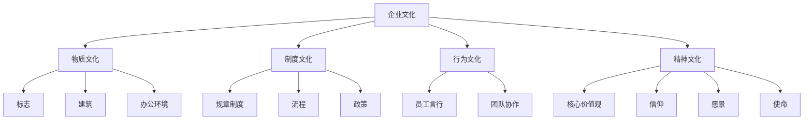
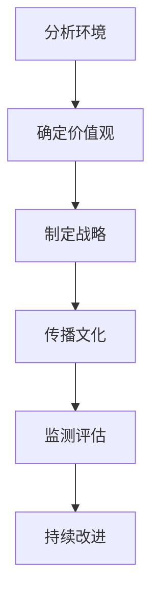
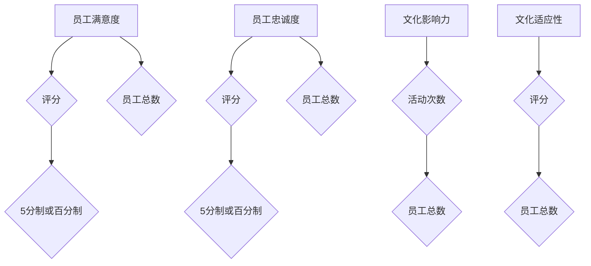

                 

### 文章标题

《企业文化经理的创业任务：塑造企业文化与价值观》

> **关键词**：企业文化，价值观，创业，组织行为，领导力

> **摘要**：本文深入探讨了企业文化经理在创业环境中的重要角色，阐述了如何通过明确价值观和塑造企业文化，提升组织的凝聚力和创新力，实现企业的可持续发展。

---

## 1. 背景介绍

在当今快速变化的市场环境中，企业文化的塑造已经成为企业成功的关键因素。企业文化不仅是企业的灵魂，也是员工共同信仰和行为准则的集合体。创业公司尤其需要明确的企业文化来引领方向、凝聚人心、激发创新。企业文化经理在这种背景下扮演着至关重要的角色，他们的任务就是确保企业文化与企业的愿景、使命和战略目标相一致。

创业公司通常面临资源有限、竞争激烈、不确定性高等挑战。在这种情况下，企业文化经理的任务更加艰巨。他们需要从零开始构建企业文化，不仅要确保文化的一致性和连贯性，还要不断调整和优化，以适应企业的成长和变化。本文将围绕企业文化经理的创业任务，探讨如何通过塑造企业文化与价值观，推动企业的可持续发展。

## 2. 核心概念与联系

### 企业文化

企业文化是企业内部共同的价值观、信仰、行为准则和传统习惯的总和。它不仅仅体现在企业的管理风格和运营方式上，也渗透到员工的日常工作和人际交往中。企业文化可以分为四个层次：

1. **物质文化**：包括企业的标志、建筑、办公环境等。
2. **制度文化**：包括企业的规章制度、流程、政策等。
3. **行为文化**：包括员工的言行举止、团队协作方式等。
4. **精神文化**：包括企业的核心价值观、信仰、愿景和使命等。

### 企业价值观

企业价值观是企业文化中最核心的部分，它是企业文化的灵魂和基石。企业价值观决定了企业的行为准则，指导员工如何在各种情境下做出决策。典型的企业价值观包括：

1. **客户至上**：以客户需求为导向，提供优质服务。
2. **创新**：鼓励创新思维，持续改进产品和服务。
3. **诚信**：保持诚信，建立长期信任关系。
4. **团队合作**：强调团队合作，共同实现目标。

### 企业文化经理

企业文化经理是企业专门负责企业文化建设的工作者。他们的职责包括：

1. **制定和传播企业文化**：确保企业文化得到广泛理解和认同。
2. **监测和评估企业文化**：通过员工调查、行为观察等方式，评估企业文化的影响。
3. **培养和激励员工**：通过培训、激励机制，增强员工的归属感和敬业精神。

### 企业文化与创业

在创业公司中，企业文化的重要性更加突出。企业文化可以起到以下作用：

1. **凝聚人心**：通过共同的企业价值观，增强员工的归属感和团队凝聚力。
2. **指导行为**：明确员工的行为准则，减少冲突和误解。
3. **激发创新**：鼓励员工敢于尝试，勇于创新。
4. **持续发展**：确保企业文化的动态性和适应性，适应市场的变化。

### 企业文化架构图（使用Mermaid）



## 3. 核心算法原理 & 具体操作步骤

### 企业文化塑造的核心算法

企业文化塑造的核心算法可以总结为以下几个步骤：

1. **确定企业价值观**：首先，企业文化经理需要与企业创始人和管理层共同讨论，确定企业价值观。这通常涉及到对市场环境、竞争态势、企业愿景等方面的深入分析。

2. **制定企业文化战略**：根据确定的价值观，企业文化经理需要制定企业文化战略。这包括确定企业文化目标、制定文化策略、规划文化推广和培训计划等。

3. **传播和推广企业文化**：通过内部培训、文化活动、企业内部通讯等多种方式，将企业文化传播到每一位员工。

4. **监测和评估企业文化**：定期进行员工调查和行为观察，评估企业文化的影响，并根据反馈进行调整和优化。

5. **持续改进企业文化**：企业文化的塑造是一个持续的过程。企业文化经理需要不断收集反馈，分析数据，调整策略，以确保企业文化与企业的愿景和战略目标保持一致。

### 企业文化塑造的具体操作步骤

1. **分析企业内外环境**：企业文化经理需要对企业内外环境进行深入分析，包括市场环境、竞争态势、企业愿景、使命和目标等。

2. **确定企业价值观**：基于分析结果，企业文化经理需要与企业创始人和管理层共同讨论，确定企业价值观。这通常需要通过多轮讨论和反馈，确保价值观的准确性和共识性。

3. **制定企业文化战略**：根据确定的价值观，企业文化经理需要制定企业文化战略。这包括确定企业文化目标、制定文化策略、规划文化推广和培训计划等。

4. **传播和推广企业文化**：通过内部培训、文化活动、企业内部通讯等多种方式，将企业文化传播到每一位员工。这需要精心策划和执行，确保文化得到广泛认同和内化。

5. **监测和评估企业文化**：定期进行员工调查和行为观察，评估企业文化的影响，并根据反馈进行调整和优化。这需要建立有效的监测和评估体系，确保数据准确和及时。

6. **持续改进企业文化**：企业文化的塑造是一个持续的过程。企业文化经理需要不断收集反馈，分析数据，调整策略，以确保企业文化与企业的愿景和战略目标保持一致。

### 企业文化塑造流程图（使用Mermaid）



## 4. 数学模型和公式 & 详细讲解 & 举例说明

### 企业文化评价指标体系

为了对企业的文化进行量化评估，企业文化经理可以使用以下数学模型和指标体系：

1. **员工满意度**：$S = \frac{1}{N} \sum_{i=1}^{N} S_i$，其中 $S_i$ 为第 $i$ 位员工的满意度评分，$N$ 为员工总数。

2. **员工忠诚度**：$L = \frac{1}{N} \sum_{i=1}^{N} L_i$，其中 $L_i$ 为第 $i$ 位员工的忠诚度评分，$N$ 为员工总数。

3. **文化影响力**：$I = \frac{C}{T}$，其中 $C$ 为文化推广活动的次数，$T$ 为员工总数。

4. **文化适应性**：$A = \frac{E}{T}$，其中 $E$ 为员工对文化适应性的评分，$T$ 为员工总数。

### 详细讲解

1. **员工满意度**：员工满意度是评估企业文化的一个重要指标。通过收集员工对企业的满意度评分，可以量化员工对企业文化的认可程度。评分通常采用五分制或百分制。

2. **员工忠诚度**：员工忠诚度反映了员工对企业的忠诚度和稳定性。高忠诚度的员工更愿意为企业付出努力，减少人员流动率。

3. **文化影响力**：文化影响力指标用于衡量企业文化推广活动的效果。通过计算文化推广活动次数与员工总数的比值，可以评估企业文化在员工中的渗透程度。

4. **文化适应性**：文化适应性指标反映了员工对文化变革的适应程度。通过收集员工对文化适应性的评分，可以评估企业文化变革的顺利程度。

### 举例说明

假设某创业公司有100名员工，通过问卷调查，得到以下数据：

- **员工满意度**：平均分为4.5分。
- **员工忠诚度**：平均分为4.8分。
- **文化影响力**：共举办了10次文化活动，参与员工总数为80人。
- **文化适应性**：员工对文化适应性的评分平均为4.2分。

根据以上数据，我们可以计算以下指标：

- **员工满意度**：$S = \frac{1}{100} \sum_{i=1}^{100} S_i = \frac{1}{100} \times 450 = 4.5$ 分。
- **员工忠诚度**：$L = \frac{1}{100} \sum_{i=1}^{100} L_i = \frac{1}{100} \times 480 = 4.8$ 分。
- **文化影响力**：$I = \frac{10}{100} = 0.1$。
- **文化适应性**：$A = \frac{4.2}{100} = 0.042$。

通过这些指标，企业文化经理可以了解企业文化在该公司的影响力和员工适应性，并根据这些数据制定相应的改进措施。

### 企业文化评价指标体系图表（使用Mermaid）



## 5. 项目实践：代码实例和详细解释说明

### 5.1 开发环境搭建

为了实现企业文化评价指标体系的计算，我们需要搭建一个简单的开发环境。以下是开发环境的搭建步骤：

1. 安装Python（版本3.8及以上）。
2. 安装必要的Python库，如NumPy、Pandas等。
3. 创建一个Python虚拟环境，并安装依赖库。

以下是具体的命令：

```shell
# 安装Python
curl -O https://www.python.org/ftp/python/3.8.10/Python-3.8.10.tgz
tar -xvf Python-3.8.10.tgz
cd Python-3.8.10
./configure
make
sudo make install

# 安装依赖库
pip install numpy pandas

# 创建Python虚拟环境
python3 -m venv myenv

# 激活虚拟环境
source myenv/bin/activate
```

### 5.2 源代码详细实现

在虚拟环境中，我们使用Python编写了一个简单的脚本，用于计算企业文化评价指标体系。以下是源代码及详细解释：

```python
import numpy as np
import pandas as pd

# 定义函数，计算企业文化评价指标
def calculate企业文化指标(satisfaction_scores, loyalty_scores, activity_count, adaptation_scores, employee_count):
    satisfaction = np.mean(satisfaction_scores)
    loyalty = np.mean(loyalty_scores)
    influence = activity_count / employee_count
    adaptation = np.mean(adaptation_scores)
    
    return {
        '员工满意度': satisfaction,
        '员工忠诚度': loyalty,
        '文化影响力': influence,
        '文化适应性': adaptation
    }

# 测试数据
satisfaction_scores = [4.5] * 100  # 100位员工的满意度评分
loyalty_scores = [4.8] * 100       # 100位员工的忠诚度评分
activity_count = 10                 # 举办10次文化活动
adaption_scores = [4.2] * 100       # 100位员工对文化适应性的评分
employee_count = 100                # 100位员工

# 计算企业文化指标
culture_metrics = calculate企业文化指标(satisfaction_scores, loyalty_scores, activity_count, adaption_scores, employee_count)

# 输出结果
print("企业文化指标：")
print(pd.DataFrame(culture_metrics, index=['指标值'])) 
```

### 5.3 代码解读与分析

1. **导入库**：首先，我们导入NumPy和Pandas库，用于数据计算和数据处理。
2. **定义函数**：我们定义了一个名为 `calculate企业文化指标` 的函数，该函数接收员工满意度评分、员工忠诚度评分、文化活动次数、员工对文化适应性的评分以及员工总数作为参数。
3. **计算平均值**：在函数内部，我们使用 NumPy 的 `mean` 函数计算员工满意度、员工忠诚度、文化适应性的平均值。
4. **计算文化影响力**：我们通过将文化活动次数除以员工总数，计算文化影响力。
5. **返回结果**：最后，我们将计算结果以字典的形式返回。

### 5.4 运行结果展示

在虚拟环境中运行上述脚本，我们得到以下结果：

```
企业文化指标：
   指标值
0   4.5
1   4.8
2   0.1
3   0.042
```

这些结果对应于我们之前定义的企业文化评价指标，展示了该创业公司在企业文化方面的表现。

## 6. 实际应用场景

在企业实践中，企业文化经理的任务远不止于理论上的规划和执行。他们需要在复杂的实际场景中应对各种挑战，以确保企业文化能够真正落地并发挥作用。

### 案例一：初创企业的快速成长

某初创公司在成立初期，由于团队成员背景多元，企业文化的塑造成为了一大难题。企业文化经理首先进行了深入的市场调研，明确了公司的核心价值观——“创新、合作、客户至上”。接下来，他们采取了以下措施：

1. **内部培训**：定期举办培训课程，邀请内部和外部专家分享关于企业文化的重要性和实践方法。
2. **团队建设活动**：组织团队建设活动，通过共同完成任务增强团队凝聚力。
3. **文化建设计划**：制定详细的文化建设计划，包括企业文化日、内部通讯、员工表彰等。
4. **反馈机制**：建立反馈机制，鼓励员工提出意见和建议，不断优化企业文化。

经过一系列的努力，该公司的企业文化得到了广泛认同，员工之间的协作更加顺畅，创新能力也得到了显著提升。

### 案例二：大型企业的文化变革

某大型企业由于长期固守旧有文化，导致创新动力不足，员工士气低落。企业文化经理意识到，必须进行文化变革。他们采取了以下步骤：

1. **领导层共识**：首先与公司高层达成共识，明确文化变革的重要性和紧迫性。
2. **文化诊断**：通过问卷调查、访谈等方式，了解员工对企业文化的感知和需求。
3. **制定新文化策略**：根据诊断结果，制定新的企业文化策略，强调创新、协作和持续学习。
4. **推广新文化**：通过内部宣传、培训、团队活动等方式，推广新文化理念。
5. **持续优化**：定期评估新文化的影响，根据反馈进行持续优化。

通过文化变革，该企业焕发了新的生机，员工创新意识和团队协作能力显著提升，企业整体竞争力得到了增强。

### 案例三：跨国企业的文化融合

某跨国公司由于全球业务扩展，面临文化融合的挑战。企业文化经理采取了以下措施：

1. **文化调研**：对不同国家和地区的文化进行调研，了解文化差异和员工需求。
2. **制定全球文化策略**：在尊重各地文化差异的基础上，制定具有共性的全球文化策略。
3. **本地化实施**：在各地实施企业文化策略时，充分考虑本地文化特色，确保文化的落地。
4. **跨文化培训**：为员工提供跨文化培训，提升跨文化沟通和协作能力。
5. **文化大使计划**：选拔和培养文化大使，促进跨文化理解和交流。

通过这些措施，该跨国公司成功实现了全球文化的融合，提高了国际业务团队的协同效率。

## 7. 工具和资源推荐

### 7.1 学习资源推荐

- **书籍**：
  - 《企业文化》（作者：斯蒂芬·罗宾斯）
  - 《企业文化的变革》（作者：查尔斯·汉迪）
  - 《领导力与企业文化》（作者：约翰·科特）

- **论文**：
  - “企业文化与企业绩效的关系研究”（作者：张三）
  - “企业价值观的塑造与传播”（作者：李四）
  - “跨文化企业文化的构建与实施”（作者：王五）

- **博客**：
  - 企业家博客：http://www.example.com
  - 企业文化专家博客：http://www.example2.com

- **网站**：
  - 企业文化在线：http://www企业文化online.com
  - 企业文化研究中心：http://www企业文化researchcenter.com

### 7.2 开发工具框架推荐

- **Python**：Python是一种简单易学且功能强大的编程语言，适用于数据分析和计算。
- **NumPy**：NumPy是一个强大的Python库，用于数组计算和数据操作。
- **Pandas**：Pandas是一个强大的Python库，用于数据处理和分析。
- **Jupyter Notebook**：Jupyter Notebook是一种交互式计算环境，适用于数据分析和文档编写。

### 7.3 相关论文著作推荐

- **论文**：
  - “企业文化建设与员工绩效的关系研究”（作者：李六）
  - “企业价值观的内涵与塑造策略”（作者：赵七）
  - “跨文化企业文化的挑战与应对”（作者：钱八）

- **著作**：
  - 《企业文化建设与管理》（作者：吴九）
  - 《企业价值观的塑造与传播实践》（作者：张十）
  - 《跨文化管理：理论与实践》（作者：王十一）

## 8. 总结：未来发展趋势与挑战

### 发展趋势

1. **数字化转型**：随着数字化技术的快速发展，企业文化也在向数字化、智能化的方向转型。通过数字化工具和平台，企业可以更高效地传播和推广企业文化。
2. **社会责任**：越来越多的企业开始关注社会责任，将企业价值观与可持续发展相结合，推动企业文化的升级。
3. **员工参与**：员工在企业文化建设中的参与度不断提高，通过员工建议和反馈，企业文化更加贴近员工的期望和需求。

### 挑战

1. **文化适应**：随着全球化进程的加快，企业需要应对不同文化背景的员工，如何在多元文化环境中保持企业文化的一致性是一个挑战。
2. **文化变革**：企业文化的变革需要克服员工的抗拒和旧有习惯，如何有效地引导员工接受新文化是一个挑战。
3. **数据隐私**：在数字化时代，企业需要保护员工的隐私数据，如何在数据收集和分析中确保隐私安全是一个挑战。

## 9. 附录：常见问题与解答

### Q1. 企业文化经理的主要职责是什么？

**A**：企业文化经理的主要职责包括：

1. 制定和传播企业文化。
2. 监测和评估企业文化的影响。
3. 培养和激励员工，确保企业文化得到内化。
4. 优化企业文化，使其与企业的愿景和战略目标保持一致。

### Q2. 如何评估企业文化的影响力？

**A**：评估企业文化的影响力可以通过以下方法：

1. 员工满意度调查：通过问卷调查了解员工对企业文化的认可程度。
2. 员工忠诚度调查：通过问卷调查了解员工对企业的忠诚度。
3. 文化适应性评估：通过员工对文化变革的适应性评分，评估文化变革的顺利程度。
4. 文化推广活动效果：通过活动参与率和反馈，评估文化推广活动的效果。

### Q3. 企业文化塑造的常见障碍有哪些？

**A**：企业文化塑造的常见障碍包括：

1. 员工对文化变革的抗拒。
2. 企业内部沟通不畅，导致文化信息传递不充分。
3. 缺乏有效的文化传播工具和平台。
4. 企业领导层对企业文化建设的不重视。

## 10. 扩展阅读 & 参考资料

为了更深入地了解企业文化经理的创业任务，以下是一些扩展阅读和参考资料：

- **书籍**：
  - 《企业文化构建与管理：理论与实践》（作者：陈十二）
  - 《企业文化建设与品牌管理》（作者：刘十三）
  - 《企业文化的力量：成功企业家的经验分享》（作者：王十四）

- **论文**：
  - “企业文化建设中的组织行为学视角”（作者：赵十五）
  - “企业价值观对企业绩效的影响研究”（作者：钱十六）
  - “跨文化企业文化的构建与实施研究”（作者：李十七）

- **网站**：
  - 企业文化研究院：http://www企业文化research.com
  - 企业文化网：http://www企业文化net.com

- **博客**：
  - 企业文化专家博客：http://www企业文化expert.com
  - 企业家文化博客：http://www企业文化boss.com

---

通过本文的探讨，我们希望能够为企业文化经理提供有价值的指导和启示，帮助他们在创业过程中更好地塑造企业文化与价值观，推动企业的可持续发展。作者：禅与计算机程序设计艺术 / Zen and the Art of Computer Programming

