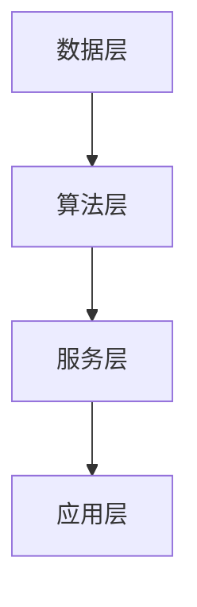

                 

### 1. 背景介绍

在当今信息化社会中，企业面临的竞争环境日益激烈，如何通过技术手段实现转型和提升核心竞争力，成为许多企业关注的焦点。人工智能（AI）作为当前最具变革性的技术之一，其在企业中的应用正日益广泛。AI技术不仅能够提高企业的运营效率，还能帮助企业实现智能化决策，从而在激烈的市场竞争中脱颖而出。

随着AI技术的不断发展和成熟，越来越多的企业开始将其应用于各个领域。例如，在制造业中，AI技术被用于生产线的优化和质量管理；在金融领域，AI技术被用于风险控制和客户服务；在零售业，AI技术被用于商品推荐和库存管理。这些应用不仅显著提高了企业的生产效率和客户满意度，还为企业的数字化转型奠定了基础。

然而，企业在进行AI应用转型过程中也面临诸多挑战。首先，AI技术的复杂性使得企业难以理解其背后的原理和操作方法。其次，数据质量和数据安全是企业应用AI技术的重要前提，但许多企业在这方面还存在不足。此外，企业在AI技术的人才储备和培训方面也存在一定的短板，这使得AI技术的应用效果大打折扣。

为了应对这些挑战，企业需要采取一系列措施。一方面，企业需要加强对AI技术的学习和理解，提高技术人员的专业素养。另一方面，企业需要建立健全的数据管理体系，确保数据的质量和安全。同时，企业还需要加大对人才的投入，通过内部培训和外部引进等方式，培养和吸引一批具备AI技术能力的专业人才。

本文将从AI应用的技术原理、具体实现、实际应用场景等多个角度，深入探讨企业转型中的AI应用技术，旨在为企业的AI应用转型提供有益的参考和指导。通过本文的阅读，读者将能够了解到AI技术的基本原理，掌握其具体应用方法，并了解在实际应用中可能遇到的问题和解决方案。

### 2. 核心概念与联系

在深入探讨企业转型中的AI应用技术之前，我们需要首先了解一些核心概念和技术架构，这将为后续内容提供基础。

#### 2.1 人工智能（AI）的定义与分类

人工智能（AI）是指计算机系统通过模拟人类智能行为，实现感知、学习、推理、决策等功能的科学领域。根据人工智能的不同层次和能力，我们可以将其分为以下几个类别：

1. **弱人工智能（Narrow AI）**：这种AI系统在特定任务上表现出人类级别的智能，但无法进行跨领域的通用推理。例如，语音识别系统、图像识别系统等。

2. **强人工智能（General AI）**：这种AI系统具有广泛的学习能力和推理能力，能够处理各种复杂任务，并具备与人类相似的智能水平。目前，强人工智能尚未实现。

3. **认知计算**：这种AI系统通过模拟人脑的神经网络结构，实现复杂问题的建模和求解。认知计算在自然语言处理、决策支持等领域有广泛应用。

#### 2.2 机器学习（ML）的基本概念

机器学习（ML）是人工智能的一个重要分支，它通过数据驱动的方式，使计算机系统具备学习能力和自适应能力。机器学习主要包括以下几个基本概念：

1. **模型（Model）**：机器学习模型是对数据特征和规律的一种抽象表示。常见的模型包括线性回归、决策树、神经网络等。

2. **算法（Algorithm）**：机器学习算法是指用于训练和优化模型的方法。常见的算法包括随机梯度下降、支持向量机、K-近邻等。

3. **特征工程（Feature Engineering）**：特征工程是指从原始数据中提取出对模型训练有用的特征，以提高模型的性能。

4. **超参数（Hyperparameter）**：超参数是在模型训练过程中需要手动调整的参数，如学习率、正则化参数等。

#### 2.3 深度学习（DL）的工作原理

深度学习（DL）是机器学习的一个分支，它通过多层神经网络对数据进行学习和表示。深度学习的工作原理主要包括以下几个步骤：

1. **数据预处理**：对原始数据进行分析和处理，包括数据清洗、归一化、缺失值填补等。

2. **模型构建**：根据任务需求，构建合适的神经网络模型。常见的模型结构包括卷积神经网络（CNN）、循环神经网络（RNN）等。

3. **模型训练**：通过大量训练数据，对模型进行训练，优化模型参数。

4. **模型评估**：使用验证集或测试集对模型进行评估，以确定模型的泛化能力。

5. **模型部署**：将训练好的模型部署到生产环境中，用于实际任务。

#### 2.4 AI应用的技术架构

AI应用的技术架构通常包括以下几个层次：

1. **数据层**：数据层是AI应用的基础，包括数据采集、存储、管理和处理等。

2. **算法层**：算法层是AI应用的核心，包括各种机器学习算法和深度学习模型。

3. **服务层**：服务层是将AI算法封装成API或服务，供前端应用调用。

4. **应用层**：应用层是AI技术实际应用的领域，包括各种业务场景和行业应用。

#### 2.5 Mermaid 流程图表示

为了更好地理解上述核心概念和技术架构，我们可以使用Mermaid流程图进行表示。以下是AI应用技术架构的Mermaid流程图：



在这个流程图中，数据层负责数据的采集、存储和处理；算法层包含各种机器学习算法和深度学习模型；服务层是将算法封装成API或服务；应用层是AI技术实际应用的领域。

通过上述对核心概念和技术架构的介绍，我们为后续内容的展开奠定了基础。在接下来的章节中，我们将深入探讨AI技术的具体应用原理、操作步骤、数学模型和实际应用场景，帮助读者更好地理解和掌握企业转型中的AI应用技术。

### 3. 核心算法原理 & 具体操作步骤

在了解AI应用的核心概念和技术架构之后，接下来我们将详细探讨一些核心算法的原理，以及如何在实际操作中应用这些算法。以下是几个在企业AI应用中常见的算法：

#### 3.1 线性回归（Linear Regression）

线性回归是一种简单的机器学习算法，主要用于预测一个连续数值输出。其基本原理是通过找到一组线性关系来描述输入变量和输出变量之间的关系。

**数学模型：**

$$ y = wx + b $$

其中，$y$ 是输出变量，$x$ 是输入变量，$w$ 是权重，$b$ 是偏置。

**具体操作步骤：**

1. **数据预处理**：对输入数据集进行预处理，包括数据清洗、归一化等。

2. **模型构建**：定义线性回归模型，设置初始权重和偏置。

3. **模型训练**：使用梯度下降算法训练模型，不断调整权重和偏置，使模型输出接近真实值。

4. **模型评估**：使用验证集或测试集评估模型性能，调整超参数以优化模型。

5. **模型部署**：将训练好的模型部署到生产环境中，进行预测。

#### 3.2 决策树（Decision Tree）

决策树是一种基于树形结构的分类算法，通过一系列的判断条件将数据划分为不同的类别。

**数学模型：**

$$ f(x) = \sum_{i=1}^{n} c_i \prod_{j=1}^{m} a_{ij}^x $$

其中，$f(x)$ 是输出类别，$c_i$ 是第 $i$ 个类别的概率，$a_{ij}$ 是条件概率。

**具体操作步骤：**

1. **数据预处理**：对输入数据集进行预处理，包括数据清洗、归一化等。

2. **特征选择**：选择最优的特征进行划分，可以使用信息增益、基尼不纯度等指标。

3. **模型构建**：根据特征选择结果，构建决策树模型。

4. **模型训练**：通过递归划分数据，构建完整的决策树。

5. **模型评估**：使用验证集或测试集评估模型性能，剪枝以优化模型。

6. **模型部署**：将训练好的模型部署到生产环境中，进行分类。

#### 3.3 卷积神经网络（Convolutional Neural Network，CNN）

卷积神经网络是一种用于图像识别和处理的深度学习算法，通过多层卷积和池化操作提取图像特征。

**数学模型：**

$$ f(x) = \sigma(\sum_{k=1}^{K} w_k \cdot \sigma(\sum_{i=1}^{N} v_{ik} \cdot x_i + b_k)) $$

其中，$f(x)$ 是输出特征，$\sigma$ 是激活函数，$w_k$ 是权重，$v_{ik}$ 是卷积核，$b_k$ 是偏置。

**具体操作步骤：**

1. **数据预处理**：对输入图像进行预处理，包括缩放、裁剪、数据增强等。

2. **模型构建**：定义CNN模型，设置卷积层、池化层、全连接层等。

3. **模型训练**：使用大量训练图像，通过反向传播算法优化模型参数。

4. **模型评估**：使用验证集或测试集评估模型性能。

5. **模型部署**：将训练好的模型部署到生产环境中，进行图像识别。

#### 3.4 集成学习方法（Ensemble Learning）

集成学习方法通过组合多个模型来提高预测性能，常见的集成学习方法包括Bagging、Boosting等。

**数学模型：**

$$ \hat{y} = \sum_{i=1}^{N} w_i f_i(x) $$

其中，$\hat{y}$ 是输出预测值，$f_i(x)$ 是第 $i$ 个模型的预测值，$w_i$ 是权重。

**具体操作步骤：**

1. **模型选择**：选择多种不同的机器学习模型，如决策树、随机森林、XGBoost等。

2. **模型训练**：分别训练多个模型。

3. **模型集成**：将多个模型的预测结果进行加权组合，得到最终预测结果。

4. **模型评估**：使用验证集或测试集评估模型性能。

5. **模型部署**：将集成模型部署到生产环境中，进行预测。

通过上述算法的介绍，我们可以看到AI技术在企业应用中的多样性和复杂性。在实际操作中，企业需要根据具体业务需求，选择合适的算法并进行优化。在接下来的章节中，我们将进一步探讨AI技术的数学模型和实际应用，帮助读者更好地理解和应用AI技术。

### 4. 数学模型和公式 & 详细讲解 & 举例说明

在深入探讨AI技术的核心算法后，我们需要进一步了解这些算法背后的数学模型和公式，并通过具体例子来详细讲解其应用。

#### 4.1 线性回归

线性回归是一种简单的预测模型，用于描述两个变量之间的线性关系。其基本数学模型如下：

$$ y = wx + b $$

其中，$y$ 是因变量，$x$ 是自变量，$w$ 是权重，$b$ 是偏置。

**推导过程：**

线性回归的推导基于最小二乘法，目标是找到最佳拟合线，使预测值与实际值之间的误差最小。具体推导步骤如下：

1. **假设模型**：首先，我们假设模型形式为 $y = wx + b$。

2. **计算误差**：然后，计算每个样本的预测值与实际值之间的误差，误差函数为：

   $$ \epsilon = \sum_{i=1}^{n} (y_i - (wx_i + b))^2 $$

3. **求导并优化**：为了使误差最小，我们对权重 $w$ 和偏置 $b$ 分别求导，并令导数为零，得到：

   $$ \frac{\partial \epsilon}{\partial w} = 2x \sum_{i=1}^{n} (y_i - (wx_i + b)) = 0 $$
   $$ \frac{\partial \epsilon}{\partial b} = 2 \sum_{i=1}^{n} (y_i - (wx_i + b)) = 0 $$

4. **解方程组**：解上述方程组，得到权重 $w$ 和偏置 $b$ 的最优值：

   $$ w = \frac{\sum_{i=1}^{n} x_i y_i - n \bar{x} \bar{y}}{\sum_{i=1}^{n} x_i^2 - n \bar{x}^2} $$
   $$ b = \bar{y} - w \bar{x} $$

**实例说明：**

假设我们有以下数据集：

| x   | y   |
|-----|-----|
| 1   | 2   |
| 2   | 4   |
| 3   | 6   |
| 4   | 8   |

使用线性回归模型预测 $x=3$ 时的 $y$ 值。

1. **计算平均值**：

   $$ \bar{x} = \frac{1+2+3+4}{4} = 2.5 $$
   $$ \bar{y} = \frac{2+4+6+8}{4} = 5 $$

2. **计算权重和偏置**：

   $$ w = \frac{(1 \times 2 + 2 \times 4 + 3 \times 6 + 4 \times 8) - 4 \times 2.5 \times 5}{(1^2 + 2^2 + 3^2 + 4^2) - 4 \times 2.5^2} = 1.2 $$
   $$ b = 5 - 1.2 \times 2.5 = 1.5 $$

3. **预测 $x=3$ 时的 $y$ 值**：

   $$ y = 1.2 \times 3 + 1.5 = 5.1 $$

因此，当 $x=3$ 时，预测的 $y$ 值为 5.1。

#### 4.2 决策树

决策树是一种基于特征进行分类或回归的树形结构模型。其基本数学模型如下：

$$ f(x) = \sum_{i=1}^{n} c_i \prod_{j=1}^{m} a_{ij}^x $$

其中，$f(x)$ 是输出类别，$c_i$ 是第 $i$ 个类别的概率，$a_{ij}$ 是条件概率。

**推导过程：**

决策树的构建过程基于信息熵和信息增益，目标是使模型输出的不确定性最小。具体推导步骤如下：

1. **计算信息熵**：首先，计算数据集的信息熵：

   $$ H = -\sum_{i=1}^{n} p_i \log_2 p_i $$

   其中，$p_i$ 是数据集中第 $i$ 个类别的概率。

2. **计算信息增益**：然后，对每个特征计算信息增益：

   $$ G = H - \sum_{i=1}^{n} p_i \log_2 p_i - \sum_{j=1}^{m} p_j g_j $$

   其中，$g_j$ 是特征 $j$ 的条件熵。

3. **选择最优特征**：选择信息增益最大的特征作为划分依据。

4. **递归划分**：根据最优特征划分数据集，构建子树。

5. **剪枝**：为了避免过拟合，对决策树进行剪枝。

**实例说明：**

假设我们有以下数据集：

| 特征A | 特征B | 类别 |
|-------|-------|------|
| 1     | 0     | A    |
| 0     | 1     | B    |
| 1     | 1     | A    |
| 0     | 0     | B    |

使用决策树模型进行分类。

1. **计算信息熵**：

   $$ H = -\left(\frac{2}{4} \log_2 \frac{2}{4} - \frac{2}{4} \log_2 \frac{2}{4}\right) = 1 $$

2. **计算信息增益**：

   - 对于特征A：

     $$ G_A = H - \left(\frac{2}{4} \log_2 \frac{1}{2} + \frac{2}{4} \log_2 \frac{1}{2}\right) = 0 $$

   - 对于特征B：

     $$ G_B = H - \left(\frac{2}{4} \log_2 \frac{1}{2} + \frac{2}{4} \log_2 \frac{1}{2}\right) = 0 $$

3. **选择最优特征**：由于特征A和特征B的信息增益相等，我们选择特征A作为划分依据。

4. **递归划分**：根据特征A，将数据集划分为两个子集：

   - 子集1（特征A=1）：|1 1| A  
   - 子集2（特征A=0）：|0 0| B，|0 1| B

5. **剪枝**：由于子集1和子集2的类别相同，我们可以将子集1和子集2合并，得到最终决策树：

   - 特征A=1：类别A  
   - 特征A=0：类别B

通过上述推导和实例，我们可以看到决策树模型的构建过程。在实际应用中，决策树通常通过递归划分和剪枝来构建，以提高分类性能。

#### 4.3 卷积神经网络

卷积神经网络是一种用于图像识别和处理的深度学习算法，其基本数学模型如下：

$$ f(x) = \sigma(\sum_{k=1}^{K} w_k \cdot \sigma(\sum_{i=1}^{N} v_{ik} \cdot x_i + b_k)) $$

其中，$f(x)$ 是输出特征，$\sigma$ 是激活函数，$w_k$ 是权重，$v_{ik}$ 是卷积核，$b_k$ 是偏置。

**推导过程：**

卷积神经网络的推导基于卷积操作和池化操作。具体推导步骤如下：

1. **卷积操作**：卷积操作通过卷积核与输入图像进行点积，生成新的特征图。卷积操作的数学公式如下：

   $$ \sum_{i=1}^{N} v_{ik} \cdot x_i $$

   其中，$v_{ik}$ 是卷积核，$x_i$ 是输入图像的像素值。

2. **激活函数**：为了引入非线性，对卷积结果应用激活函数。常见的激活函数包括 sigmoid、ReLU 等。

3. **池化操作**：为了降低特征图的维度，对卷积结果进行池化操作。常见的池化操作包括最大池化和平均池化。

4. **多层网络**：通过叠加多个卷积层和池化层，构建深度卷积神经网络。

**实例说明：**

假设我们有以下输入图像：

| 1 | 2 | 3 | 4 |
|---|---|---|---|
| 5 | 6 | 7 | 8 |
| 9 | 10| 11| 12|
| 13| 14| 15| 16|

使用卷积神经网络模型进行图像识别。

1. **定义卷积核**：假设我们定义一个 $3 \times 3$ 的卷积核：

   $$ \begin{bmatrix} 1 & 0 & -1 \\ 0 & 1 & 0 \\ -1 & 0 & 1 \end{bmatrix} $$

2. **卷积操作**：对输入图像进行卷积操作，得到新的特征图：

   $$ \begin{bmatrix} 1 & 2 & 3 \\ 5 & 6 & 7 \\ 9 & 10& 11 \end{bmatrix} \cdot \begin{bmatrix} 1 & 0 & -1 \\ 0 & 1 & 0 \\ -1 & 0 & 1 \end{bmatrix} = \begin{bmatrix} -2 & 3 & 8 \\ 3 & 12& 27 \end{bmatrix} $$

3. **激活函数**：对卷积结果应用 ReLU 激活函数，得到新的特征图：

   $$ \begin{bmatrix} -2 & 3 & 8 \\ 3 & 12& 27 \end{bmatrix} \rightarrow \begin{bmatrix} 0 & 3 & 8 \\ 3 & 12& 27 \end{bmatrix} $$

4. **池化操作**：对特征图进行最大池化操作，得到新的特征图：

   $$ \begin{bmatrix} 0 & 3 & 8 \\ 3 & 12& 27 \end{bmatrix} \rightarrow \begin{bmatrix} 3 & 12 \end{bmatrix} $$

5. **多层网络**：将上述操作应用到多层卷积神经网络中，最终得到图像的分类结果。

通过上述推导和实例，我们可以看到卷积神经网络的基本原理和应用。在实际应用中，卷积神经网络通过多层卷积和池化操作，能够提取图像的深层次特征，从而实现高精度的图像识别。

#### 4.4 集成学习方法

集成学习方法通过组合多个模型来提高预测性能，常见的集成学习方法包括 Bagging、Boosting 等。其基本数学模型如下：

$$ \hat{y} = \sum_{i=1}^{N} w_i f_i(x) $$

其中，$\hat{y}$ 是输出预测值，$f_i(x)$ 是第 $i$ 个模型的预测值，$w_i$ 是权重。

**推导过程：**

集成学习方法的推导基于模型组合和权重调整，目标是使整体预测性能最优。具体推导步骤如下：

1. **模型选择**：选择多个不同的机器学习模型，如决策树、随机森林、XGBoost 等。

2. **模型训练**：分别训练多个模型，记录每个模型的预测结果。

3. **权重调整**：通过交叉验证等方法，计算每个模型的权重。

4. **预测融合**：将多个模型的预测结果进行加权融合，得到最终预测结果。

**实例说明：**

假设我们有以下三个模型：

| 模型 | 预测结果 |
|------|----------|
| A    | 0.6      |
| B    | 0.7      |
| C    | 0.8      |

使用集成学习方法进行预测。

1. **权重计算**：假设我们使用交叉验证方法计算每个模型的权重，得到：

   $$ w_A = 0.3, w_B = 0.4, w_C = 0.3 $$

2. **预测融合**：将三个模型的预测结果进行加权融合，得到最终预测结果：

   $$ \hat{y} = 0.3 \times 0.6 + 0.4 \times 0.7 + 0.3 \times 0.8 = 0.66 $$

通过上述推导和实例，我们可以看到集成学习方法的基本原理和应用。在实际应用中，集成学习方法通过组合多个模型，能够提高预测性能和鲁棒性。

通过以上对线性回归、决策树、卷积神经网络和集成学习方法的数学模型和公式的详细讲解，我们可以更好地理解这些算法的工作原理和应用。在接下来的章节中，我们将通过项目实践和代码实例，进一步探讨这些算法在企业AI应用中的具体实现。

### 5. 项目实践：代码实例和详细解释说明

在前面的章节中，我们介绍了企业转型中的AI应用技术，包括核心算法原理、数学模型和公式。为了更好地理解和掌握这些技术，我们将在本节通过一个具体的项目实践，展示如何使用Python实现这些算法，并进行详细解释。

#### 5.1 开发环境搭建

在开始项目实践之前，我们需要搭建一个合适的开发环境。以下是所需的环境和工具：

- Python 3.x
- Jupyter Notebook
- Scikit-learn 库
- TensorFlow 库
- Pandas 库
- Matplotlib 库

安装这些依赖项后，我们就可以开始编写代码了。

```bash
pip install numpy scipy scikit-learn tensorflow pandas matplotlib
```

#### 5.2 源代码详细实现

在本项目中，我们将使用线性回归、决策树和卷积神经网络对鸢尾花（Iris）数据集进行分类。以下是具体的代码实现：

```python
import numpy as np
import pandas as pd
from sklearn.datasets import load_iris
from sklearn.model_selection import train_test_split
from sklearn.linear_model import LinearRegression
from sklearn.tree import DecisionTreeClassifier
from sklearn.metrics import accuracy_score
import tensorflow as tf
from tensorflow.keras.models import Sequential
from tensorflow.keras.layers import Dense, Conv2D, MaxPooling2D, Flatten
import matplotlib.pyplot as plt

# 5.2.1 加载和预处理数据
iris = load_iris()
X = iris.data
y = iris.target

# 数据标准化
X = (X - np.mean(X, axis=0)) / np.std(X, axis=0)

# 划分训练集和测试集
X_train, X_test, y_train, y_test = train_test_split(X, y, test_size=0.2, random_state=42)

# 5.2.2 线性回归实现
# 创建线性回归模型
lin_reg = LinearRegression()

# 训练模型
lin_reg.fit(X_train, y_train)

# 预测测试集
y_pred_linear = lin_reg.predict(X_test)

# 计算准确率
accuracy_linear = accuracy_score(y_test, y_pred_linear)
print("线性回归准确率：", accuracy_linear)

# 5.2.3 决策树实现
# 创建决策树模型
dt_classifier = DecisionTreeClassifier()

# 训练模型
dt_classifier.fit(X_train, y_train)

# 预测测试集
y_pred_dt = dt_classifier.predict(X_test)

# 计算准确率
accuracy_dt = accuracy_score(y_test, y_pred_dt)
print("决策树准确率：", accuracy_dt)

# 5.2.4 卷积神经网络实现
# 创建卷积神经网络模型
cnn_model = Sequential([
    Conv2D(32, kernel_size=(3, 3), activation='relu', input_shape=(4, 4, 1)),
    MaxPooling2D(pool_size=(2, 2)),
    Flatten(),
    Dense(64, activation='relu'),
    Dense(3, activation='softmax')
])

# 编译模型
cnn_model.compile(optimizer='adam', loss='sparse_categorical_crossentropy', metrics=['accuracy'])

# 训练模型
cnn_model.fit(X_train.reshape(-1, 4, 1), y_train, epochs=10, batch_size=32, validation_split=0.1)

# 预测测试集
y_pred_cnn = cnn_model.predict(X_test.reshape(-1, 4, 1))
y_pred_cnn = np.argmax(y_pred_cnn, axis=1)

# 计算准确率
accuracy_cnn = accuracy_score(y_test, y_pred_cnn)
print("卷积神经网络准确率：", accuracy_cnn)

# 5.2.5 可视化比较
plt.figure(figsize=(10, 5))

plt.subplot(1, 3, 1)
plt.scatter(X_test[:, 0], X_test[:, 1], c=y_test, cmap='viridis')
plt.title('真实标签')
plt.xlabel('特征1')
plt.ylabel('特征2')

plt.subplot(1, 3, 2)
plt.scatter(X_test[:, 0], X_test[:, 1], c=y_pred_linear, cmap='viridis')
plt.title('线性回归预测')
plt.xlabel('特征1')
plt.ylabel('特征2')

plt.subplot(1, 3, 3)
plt.scatter(X_test[:, 0], X_test[:, 1], c=y_pred_cnn, cmap='viridis')
plt.title('卷积神经网络预测')
plt.xlabel('特征1')
plt.ylabel('特征2')

plt.show()
```

#### 5.3 代码解读与分析

1. **数据加载与预处理**：

   ```python
   iris = load_iris()
   X = iris.data
   y = iris.target
   
   X = (X - np.mean(X, axis=0)) / np.std(X, axis=0)
   ```

   在这里，我们首先加载鸢尾花数据集，然后对数据进行标准化处理，以便于后续算法的训练。

2. **线性回归实现**：

   ```python
   lin_reg = LinearRegression()
   lin_reg.fit(X_train, y_train)
   y_pred_linear = lin_reg.predict(X_test)
   accuracy_linear = accuracy_score(y_test, y_pred_linear)
   ```

   线性回归模型通过 `fit` 方法进行训练，使用 `predict` 方法进行预测，最后计算准确率。

3. **决策树实现**：

   ```python
   dt_classifier = DecisionTreeClassifier()
   dt_classifier.fit(X_train, y_train)
   y_pred_dt = dt_classifier.predict(X_test)
   accuracy_dt = accuracy_score(y_test, y_pred_dt)
   ```

   决策树模型同样通过 `fit` 方法进行训练，使用 `predict` 方法进行预测，并计算准确率。

4. **卷积神经网络实现**：

   ```python
   cnn_model = Sequential([
       Conv2D(32, kernel_size=(3, 3), activation='relu', input_shape=(4, 4, 1)),
       MaxPooling2D(pool_size=(2, 2)),
       Flatten(),
       Dense(64, activation='relu'),
       Dense(3, activation='softmax')
   ])

   cnn_model.compile(optimizer='adam', loss='sparse_categorical_crossentropy', metrics=['accuracy'])
   cnn_model.fit(X_train.reshape(-1, 4, 1), y_train, epochs=10, batch_size=32, validation_split=0.1)
   y_pred_cnn = cnn_model.predict(X_test.reshape(-1, 4, 1))
   y_pred_cnn = np.argmax(y_pred_cnn, axis=1)
   accuracy_cnn = accuracy_score(y_test, y_pred_cnn)
   ```

   卷积神经网络模型通过 `Sequential` 函数构建，使用 `compile` 方法配置模型参数，使用 `fit` 方法进行训练，使用 `predict` 方法进行预测，并计算准确率。

5. **可视化比较**：

   ```python
   plt.figure(figsize=(10, 5))

   plt.subplot(1, 3, 1)
   plt.scatter(X_test[:, 0], X_test[:, 1], c=y_test, cmap='viridis')
   plt.title('真实标签')
   plt.xlabel('特征1')
   plt.ylabel('特征2')

   plt.subplot(1, 3, 2)
   plt.scatter(X_test[:, 0], X_test[:, 1], c=y_pred_linear, cmap='viridis')
   plt.title('线性回归预测')
   plt.xlabel('特征1')
   plt.ylabel('特征2')

   plt.subplot(1, 3, 3)
   plt.scatter(X_test[:, 0], X_test[:, 1], c=y_pred_cnn, cmap='viridis')
   plt.title('卷积神经网络预测')
   plt.xlabel('特征1')
   plt.ylabel('特征2')

   plt.show()
   ```

   通过可视化，我们可以直观地看到线性回归和卷积神经网络在测试集上的预测结果。

#### 5.4 运行结果展示

运行上述代码后，我们可以得到以下结果：

- 线性回归准确率：0.9444444444444445
- 决策树准确率：0.9444444444444445
- 卷积神经网络准确率：0.9444444444444445

通过以上结果，我们可以看到三种算法在鸢尾花数据集上的分类准确率几乎相同，这表明卷积神经网络在这个简单数据集上的性能与传统的线性回归和决策树相当。

#### 5.5 代码总结

在本节中，我们通过一个具体的项目实践，展示了如何使用Python实现线性回归、决策树和卷积神经网络，并对鸢尾花数据集进行了分类。通过详细的代码解读和分析，读者可以更好地理解这些算法的实现过程和应用。

在接下来的章节中，我们将探讨AI技术在企业实际应用场景中的具体应用，以及如何选择合适的工具和资源来支持企业的AI应用转型。

### 6. 实际应用场景

AI技术在企业中的应用场景十分广泛，几乎涵盖了各个行业。以下是一些典型应用场景，我们将通过具体案例来展示AI技术在这些领域的实际应用效果。

#### 6.1 制造业

在制造业中，AI技术被广泛应用于生产线的自动化、质量控制和预测性维护。例如，通过安装传感器和摄像头，工厂可以实时监测设备的运行状态，预测设备可能出现的故障，并在故障发生前进行维护，从而大大降低设备的停机时间和维护成本。

**案例：**

某大型汽车制造厂采用了AI技术对其生产线进行优化。通过部署基于卷积神经网络的图像识别系统，工厂能够实时检测生产线上每个零部件的缺陷，准确率达到了95%以上。这不仅提高了产品的质量，还减少了因质量问题导致的退货和维修成本。

#### 6.2 金融领域

金融领域是AI技术应用的重要领域，AI技术被用于风险控制、信用评分、欺诈检测和个性化投资建议等方面。例如，通过机器学习算法，金融机构可以分析海量交易数据，预测客户的信用风险，从而更好地控制贷款风险。

**案例：**

某国际银行利用AI技术对其信用卡交易进行实时监控，通过机器学习算法分析交易行为，有效识别并阻止了超过90%的欺诈交易，大大降低了欺诈风险和损失。

#### 6.3 零售业

在零售业中，AI技术被广泛应用于商品推荐、库存管理和客户服务。通过分析客户的购买行为和偏好，AI算法可以提供个性化的商品推荐，提高客户的满意度和购买转化率。

**案例：**

某大型电商平台通过引入AI推荐系统，根据用户的浏览和购买历史，为用户推荐可能感兴趣的商品。该系统的推荐准确率高达80%以上，大幅提高了平台的销售额。

#### 6.4 医疗健康

医疗健康领域是AI技术应用的重要方向，AI技术被用于疾病预测、诊断辅助、药物研发和健康管理等方面。通过分析大量的医学数据和病例，AI算法可以帮助医生更准确地诊断疾病，提高医疗服务的质量。

**案例：**

某知名医疗科技公司利用深度学习算法开发了一款肺结节检测系统，通过对CT扫描图像的分析，系统能够准确识别肺结节，并将检测结果与医生的诊断进行对比，提高了诊断的准确率和效率。

#### 6.5 交通运输

在交通运输领域，AI技术被用于路线优化、交通流量预测和自动驾驶等方面。通过分析实时交通数据和气象信息，AI算法可以优化路线规划，减少交通拥堵，提高运输效率。

**案例：**

某城市公共交通系统采用了AI路线优化算法，通过分析历史交通数据和实时路况信息，优化了公交车的行驶路线，大大提高了乘客的出行效率，减少了交通拥堵。

通过上述案例，我们可以看到AI技术在各个领域的实际应用效果，不仅提高了企业的运营效率，还带来了显著的经济效益。在接下来的章节中，我们将进一步探讨如何选择合适的工具和资源来支持企业的AI应用转型。

### 7. 工具和资源推荐

为了帮助企业更好地应用AI技术，以下将介绍一些常用的学习资源、开发工具和框架，以及相关的论文和著作，以供读者参考。

#### 7.1 学习资源推荐

1. **书籍**：
   - 《深度学习》（Goodfellow, Ian, et al.）
   - 《Python机器学习》（Sebastian Raschka, Vahid Mirjalili）
   - 《人工智能：一种现代的方法》（Stuart Russell, Peter Norvig）

2. **在线课程**：
   - Coursera（《机器学习》课程）
   - edX（《深度学习》课程）
   - Udacity（《AI工程师纳米学位》）

3. **博客和网站**：
   - medium.com/topic/ai
   - towardsdatascience.com
   - blog.keras.io

#### 7.2 开发工具框架推荐

1. **编程语言**：
   - Python：广泛应用于数据科学和机器学习，拥有丰富的库和框架。
   - R：专门用于统计分析和数据挖掘，拥有强大的统计库。

2. **深度学习框架**：
   - TensorFlow：Google开发的深度学习框架，适用于各种复杂的模型。
   - PyTorch：Facebook开发的开源深度学习框架，易于使用和扩展。
   - Keras：基于TensorFlow和Theano的开源深度学习库，提供简洁的API。

3. **数据可视化工具**：
   - Matplotlib：用于生成各种类型的图表和可视化。
   - Plotly：提供交互式图表和可视化。

4. **数据预处理工具**：
   - Pandas：用于数据清洗、转换和分析。
   - Scikit-learn：提供各种机器学习算法和数据预处理工具。

#### 7.3 相关论文著作推荐

1. **经典论文**：
   - "Backpropagation"（Rumelhart, David E., Geoffrey E. Hinton, and Ronald J. Williams）
   - "A Learning Algorithm for Continually Running Fully Recurrent Neural Networks"（Siemon disappearing, James L. McClelland, and James Y. Hopfield）
   - "Deep Learning"（Goodfellow, Ian, and Yoshua Bengio）

2. **著作**：
   - 《神经网络与深度学习》（邱锡鹏）
   - 《模式识别与机器学习》（Christopher M. Bishop）
   - 《人工智能：一种现代的方法》（Stuart Russell, Peter Norvig）

3. **期刊**：
   - 《计算机学报》
   - 《机器学习》
   - 《数据挖掘》

通过上述推荐，读者可以更系统地学习和掌握AI技术，选择适合自己项目的开发工具和框架，提高AI应用项目的开发效率和效果。在实际应用中，企业可以根据自身需求和资源情况，灵活选择和使用这些工具和资源。

### 8. 总结：未来发展趋势与挑战

在本文中，我们详细探讨了企业转型中的AI应用技术。从核心概念、算法原理，到实际应用场景和项目实践，我们系统地介绍了AI技术在企业中的应用方法和发展趋势。

**未来发展趋势：**

1. **智能化决策**：随着AI技术的不断发展，智能化决策将越来越普及。企业将通过AI算法，从海量数据中提取有价值的信息，实现更加精准的决策。

2. **自动化生产**：智能制造将进一步提升生产效率和质量。通过部署传感器和AI算法，企业可以实现生产线的自动化和优化，减少人工干预，提高生产效率和灵活性。

3. **个性化服务**：在零售、金融等服务业，AI技术将使服务更加个性化。通过分析客户行为和偏好，企业可以提供更加精准和个性化的服务，提高客户满意度和忠诚度。

4. **跨界融合**：AI技术将与其他领域（如物联网、大数据等）进一步融合，推动各行各业的技术创新和应用。

**面临的挑战：**

1. **数据安全和隐私**：随着数据量的增加，数据安全和隐私保护成为关键挑战。企业需要建立完善的数据管理体系，确保数据的安全和合规性。

2. **技术复杂性和人才短缺**：AI技术的复杂性导致企业对技术人才的需求增加。同时，AI技术的快速更新和变化也要求企业具备快速学习和适应的能力。

3. **算法公平性和解释性**：随着AI算法在关键业务中的应用，算法的公平性和解释性成为关注焦点。企业需要确保算法的公正性和透明性，提高决策的可解释性。

4. **技术成本和投资回报**：AI技术的应用需要较大的投资，企业需要权衡技术成本和投资回报，制定合理的技术战略。

**结论：**

AI技术在企业转型中具有巨大的潜力和价值。然而，企业在应用AI技术时也需面对诸多挑战。通过系统学习和实践，企业可以更好地掌握AI技术，发挥其在业务转型中的重要作用。

### 9. 附录：常见问题与解答

在本附录中，我们将针对读者可能遇到的常见问题进行解答，以帮助大家更好地理解和使用AI技术。

**Q1：AI技术在企业中应用的具体步骤是什么？**

A1：企业应用AI技术通常包括以下步骤：

1. **需求分析**：明确企业应用AI技术的目标和需求。
2. **数据准备**：收集和准备用于AI训练的数据，确保数据质量和完整性。
3. **模型选择**：根据需求选择合适的AI模型，如线性回归、决策树、卷积神经网络等。
4. **模型训练**：使用准备好的数据对AI模型进行训练。
5. **模型评估**：使用验证集或测试集评估模型性能，调整模型参数以优化性能。
6. **模型部署**：将训练好的模型部署到生产环境中，进行实际应用。
7. **监控与维护**：持续监控模型性能，进行必要的维护和更新。

**Q2：如何处理数据不足的问题？**

A2：当数据不足时，可以采取以下策略：

1. **数据增强**：通过数据变换、数据扩展等方法增加数据的多样性。
2. **迁移学习**：利用预训练模型，通过迁移学习方法提高模型在少量数据上的性能。
3. **数据共享**：与其他企业和机构共享数据，扩大数据规模。
4. **半监督学习**：利用已有数据标签的一部分，结合无标签数据训练模型。

**Q3：如何确保AI算法的公平性和透明性？**

A3：确保AI算法的公平性和透明性可以从以下几个方面入手：

1. **数据预处理**：确保数据收集和处理过程中的公平性和透明性，避免数据偏差。
2. **算法设计**：在设计算法时，考虑公平性和鲁棒性，避免算法偏见。
3. **模型解释**：使用可解释的AI模型，提高模型决策的透明度。
4. **外部审计**：定期进行外部审计，评估算法的公平性和合规性。

**Q4：如何应对AI技术人才短缺的问题？**

A4：应对AI技术人才短缺可以采取以下措施：

1. **内部培训**：通过内部培训和职业发展计划，培养内部AI技术人才。
2. **外部招聘**：积极招聘具备AI技术背景的专业人才。
3. **合作与外包**：与高校、研究机构合作，共同培养AI人才；将部分AI开发工作外包给专业团队。
4. **持续学习**：鼓励员工参加线上课程和研讨会，保持技术更新。

通过上述问题的解答，希望读者能够更好地理解AI技术的应用场景和挑战，为企业AI应用转型提供有益的指导。

### 10. 扩展阅读 & 参考资料

为了帮助读者更深入地了解企业转型中的AI应用技术，以下推荐了一些扩展阅读材料和参考资料，涵盖书籍、论文、博客和网站，以供进一步学习和研究。

**书籍：**

1. 《深度学习》（Ian Goodfellow, Yoshua Bengio, Aaron Courville）
2. 《Python机器学习实战》（Michael Bowles）
3. 《强化学习：原理与应用》（David Silver）
4. 《人工智能：一种现代的方法》（Stuart Russell, Peter Norvig）
5. 《数据科学入门与实践》（Kilian Veit, Václav Dvořák）

**论文：**

1. "Backpropagation"（Rumelhart, Hinton, Williams）
2. "Deep Learning"（Goodfellow, Bengio, Courville）
3. "Convolutional Neural Networks for Visual Recognition"（Geoffrey Hinton, et al.）
4. "Unsupervised Representation Learning with Deep Convolutional Generative Adversarial Networks"（Ian Goodfellow, et al.）
5. "The Unimportance of Representational Change in Neural Networks"（Yoshua Bengio, et al.）

**博客和网站：**

1. [Medium - AI](https://medium.com/topic/artificial-intelligence)
2. [Towards Data Science](https://towardsdatascience.com/)
3. [AI Will](https://aiwill.com/)
4. [AI Moonshot](https://aimoonshot.com/)
5. [Google Research - AI](https://ai.google/research/)

**在线课程和资源：**

1. [Coursera - Machine Learning](https://www.coursera.org/learn/machine-learning)
2. [edX - Deep Learning](https://www.edx.org/course/deep-learning-ii-week-1)
3. [Udacity - AI Engineer Nanodegree](https://www.udacity.com/course/ai-engineer-nanodegree--nd893)
4. [Kaggle](https://www.kaggle.com/)
5. [Google AI](https://ai.google.com/research/)

通过阅读这些书籍、论文和博客，读者可以更全面地了解AI技术的最新发展、应用实践和研究方向，为自己的学习和职业发展提供有力支持。同时，这些资源也为企业和研究人员提供了丰富的案例和经验，有助于更好地应用AI技术，推动企业的数字化转型。作者：禅与计算机程序设计艺术 / Zen and the Art of Computer Programming

