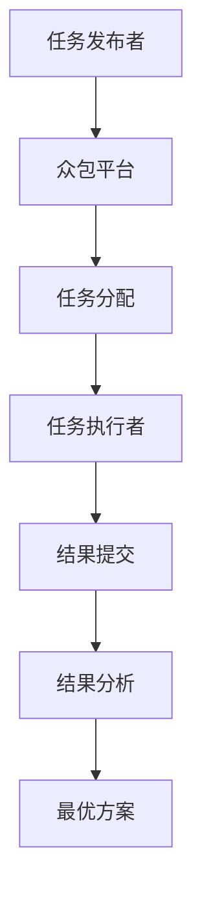

                 

### 背景介绍

#### 引言

在当今科技高速发展的时代，技术难题的攻克已经不再仅仅依赖于单个人的智慧。许多复杂的问题需要集众人之力，通过协作和共享来找到解决方案。众包作为一种新型的合作方式，逐渐成为解决科技难题的重要途径。本文旨在探讨众包在科技领域的应用，如何集结众人智慧，攻克科技难题。

#### 科技难题的复杂性

随着科技的不断进步，许多问题变得日益复杂。例如，人工智能、大数据分析、生物信息学等领域，都面临着大量的计算量和复杂的数据处理需求。这些问题单靠个人的力量很难在短时间内解决，甚至可能需要跨学科、跨领域的合作才能找到有效的解决方案。

#### 传统解决方式的局限

传统的科研方法主要依赖于实验室的研究和个人的智慧。这种方法虽然在一定程度上取得了成功，但也存在一些局限：

1. **资源限制**：实验室资源有限，无法支持大规模的数据处理和计算。
2. **时间限制**：科研项目的周期较长，很难在短时间内获得结果。
3. **视野限制**：个人的视野和知识有限，很难全面地看待问题。

#### 众包的优势

众包通过互联网平台，将问题发布给广泛的社会大众，借助众人的智慧和力量来解决问题。相比传统的科研方法，众包具有以下优势：

1. **资源丰富**：众包可以调动大量的社会资源，包括计算资源、知识资源等。
2. **速度快**：众包可以在短时间内聚集大量的人力和智慧，加速问题解决。
3. **视野广阔**：众包可以吸引不同领域的专家和爱好者，从多个角度看待问题。

#### 众包的典型应用

在科技领域，众包已经成功应用于多个领域：

1. **人工智能**：通过众包收集大规模的数据集，用于机器学习模型的训练。
2. **生物信息学**：众包用于基因测序、疾病诊断等领域，加速科研进展。
3. **工程学**：通过众包征集设计方案，解决复杂的工程问题。

#### 文章结构

本文将分为以下章节：

1. **背景介绍**：介绍众包的概念和优势。
2. **核心概念与联系**：分析众包的技术原理和架构。
3. **核心算法原理 & 具体操作步骤**：详细介绍众包的操作方法和流程。
4. **数学模型和公式 & 详细讲解 & 举例说明**：探讨众包的数学基础和公式应用。
5. **项目实践**：通过实际案例展示众包的应用。
6. **实际应用场景**：分析众包在不同领域的应用。
7. **工具和资源推荐**：推荐相关工具和资源。
8. **总结**：展望众包的未来发展趋势。
9. **附录**：常见问题与解答。
10. **扩展阅读 & 参考资料**：提供进一步的阅读资源。

通过以上章节，我们将深入探讨众包如何集结众人智慧，攻克科技难题。接下来，我们将进一步分析众包的核心概念和技术原理。

## 1. 核心概念与联系

在深入探讨众包如何集结众人智慧之前，我们首先需要了解众包的核心概念和技术原理。众包（Crowdsourcing）是一种通过互联网平台，将一个问题或任务分发给广泛的社会大众，借助众人的智慧和力量来解决问题或完成任务的方法。以下将详细介绍众包的核心概念和技术原理，并使用 Mermaid 流程图展示众包的工作流程和架构。

### 核心概念

1. **众包平台**：众包平台是连接任务发布者和任务执行者的中介。平台提供任务发布、任务分配、结果收集等功能，使任务发布者和任务执行者能够高效地协作。
2. **任务发布者**：任务发布者是提出问题或任务的人或组织。他们通常需要解决的问题或任务具有一定的复杂性和广泛性，希望通过众包平台来寻求解决方案。
3. **任务执行者**：任务执行者是参与众包任务的社会大众。他们通过平台接受任务，利用自己的知识和技能完成任务，并获取相应的报酬或奖励。

### 技术原理

1. **去中心化**：众包平台采用去中心化的架构，不需要依赖于某个中心化的组织或机构。这使得众包平台具有高度的灵活性和可扩展性，能够吸引更多的任务发布者和任务执行者。
2. **大数据处理**：众包平台利用大数据处理技术，对收集到的任务执行结果进行数据挖掘和分析，以找到最优的解决方案。
3. **智能匹配**：众包平台通过智能匹配算法，将任务与合适的任务执行者进行匹配，提高任务完成效率。

### Mermaid 流程图



在该流程图中，任务发布者将任务发布到众包平台，平台根据任务要求智能匹配任务执行者，任务执行者完成任务后提交结果，平台对结果进行分析，最终输出最优方案。

### 架构设计

众包平台通常采用以下架构设计：

1. **前端界面**：提供用户交互的界面，包括任务发布、任务分配、结果提交等功能。
2. **后端服务**：负责处理任务分配、结果收集、数据分析等核心功能。
3. **数据库**：存储任务信息、用户信息、结果数据等。

### 技术挑战

1. **数据隐私和安全**：众包平台需要处理大量的个人和敏感数据，如何保障数据隐私和安全是众包平台面临的重要挑战。
2. **任务质量和效率**：如何确保任务执行者的质量和任务完成效率，是众包平台需要关注的问题。
3. **激励机制**：如何设计合理的激励机制，吸引更多的任务执行者参与众包任务，是众包平台需要解决的问题。

通过以上对核心概念与联系的分析，我们可以更好地理解众包的工作原理和架构设计。在接下来的章节中，我们将进一步探讨众包的核心算法原理和具体操作步骤。

## 2. 核心算法原理 & 具体操作步骤

在了解众包的核心概念和技术原理后，接下来我们将深入探讨众包的核心算法原理和具体操作步骤。众包算法主要包括任务发布、任务匹配、结果收集与分析等环节。以下将逐步分析这些环节的工作原理和操作步骤。

### 任务发布

1. **任务描述**：任务发布者首先需要明确任务的目标和要求，编写详细的任务描述。任务描述应包括任务背景、任务目标、任务输入和输出等关键信息。
2. **任务分类**：根据任务的特点和需求，将任务进行分类。常见的任务分类包括数据处理、图像识别、文本分析、编程挑战等。
3. **任务定价**：任务发布者需要设定合理的任务奖金或奖励，以吸引任务执行者参与。

### 任务匹配

1. **用户注册**：任务执行者需要在众包平台上注册账号，并填写个人技能、经验和兴趣等信息。
2. **匹配算法**：众包平台通过智能匹配算法，根据任务描述和任务执行者的技能、经验和兴趣，将任务与合适的任务执行者进行匹配。常见的匹配算法包括基于关键词匹配、基于技能标签匹配等。
3. **任务分配**：匹配成功后，平台将任务分配给任务执行者，任务执行者开始执行任务。

### 结果收集与分析

1. **任务执行**：任务执行者根据任务要求和提供的数据，完成任务并提交结果。
2. **结果审核**：平台对任务执行者提交的结果进行审核，确保结果的准确性和可靠性。审核过程可能包括自动审核和人工审核。
3. **数据分析**：平台对收集到的结果进行数据分析，以找出最优的解决方案或模式。数据分析可能包括数据挖掘、机器学习、统计分析等方法。
4. **结果反馈**：平台将分析结果反馈给任务发布者和任务执行者，以便他们了解任务完成情况和效果。

### 具体操作步骤

1. **任务发布**：
    - **步骤1**：任务发布者登录众包平台，进入任务发布页面。
    - **步骤2**：填写任务描述，包括任务背景、目标、输入和输出等。
    - **步骤3**：选择任务分类和定价，确保任务奖金或奖励合理。
    - **步骤4**：提交任务，等待任务执行者匹配和执行。

2. **任务匹配**：
    - **步骤1**：任务执行者登录众包平台，进入任务浏览页面。
    - **步骤2**：根据个人技能和兴趣，筛选合适的任务。
    - **步骤3**：申请任务，填写任务申请说明。
    - **步骤4**：等待平台审核，匹配成功后开始执行任务。

3. **结果收集与分析**：
    - **步骤1**：任务执行者完成任务后，提交结果。
    - **步骤2**：平台对结果进行审核，确保结果准确性和可靠性。
    - **步骤3**：平台对结果进行数据分析，找出最优方案。
    - **步骤4**：将分析结果反馈给任务发布者和任务执行者。

通过以上操作步骤，任务发布者和任务执行者可以高效地完成众包任务，实现知识的共享和协作。接下来，我们将进一步探讨众包的数学模型和公式，为读者提供更加深入的理解。

## 3. 数学模型和公式 & 详细讲解 & 举例说明

在众包系统中，数学模型和公式起到了关键作用，它们不仅帮助我们在理论上解释众包的运作机制，还为实践中的算法设计提供了数学基础。以下我们将介绍众包系统中常用的数学模型和公式，并详细讲解它们的应用。

### 1. 概率模型

概率模型是众包系统中常用的基础模型，用于预测任务执行者的表现和结果的可靠性。以下是一个简单的概率模型示例：

**公式**：
\[ P(A|B) = \frac{P(B|A) \cdot P(A)}{P(B)} \]

**解释**：
- \( P(A|B) \)：在事件B发生的条件下，事件A发生的概率。
- \( P(B|A) \)：在事件A发生的条件下，事件B发生的概率。
- \( P(A) \)：事件A发生的概率。
- \( P(B) \)：事件B发生的概率。

**应用**：
假设我们想要预测一个任务执行者解决某个问题的概率。已知该任务执行者在类似任务上的成功率为80%，并且在所有参与者中的平均成功率为60%。我们可以使用上述公式来计算在任务执行者参与的情况下，任务成功的概率。

\[ P(成功|参与) = \frac{P(参与|成功) \cdot P(成功)}{P(参与)} \]
\[ P(成功|参与) = \frac{0.8 \cdot 0.6}{0.6} = 0.8 \]

这意味着，如果该任务执行者参与任务，任务成功的概率为80%。

### 2. 贝叶斯网络

贝叶斯网络是一种基于概率图模型的方法，用于表示多个变量之间的条件依赖关系。它由一组节点和边组成，每个节点表示一个随机变量，边表示变量之间的条件依赖。

**公式**：
\[ P(X_1, X_2, ..., X_n) = \prod_{i=1}^{n} P(X_i|X_{1:i-1}) \]

**解释**：
- \( P(X_1, X_2, ..., X_n) \)：多个随机变量同时发生的联合概率。
- \( P(X_i|X_{1:i-1}) \)：在前面变量已知的条件下，第i个随机变量的条件概率。

**应用**：
在一个复杂的众包任务中，我们可能需要考虑多个因素（如任务难度、执行者的技能、环境因素）对任务成功率的影响。贝叶斯网络可以帮助我们建立这些因素之间的依赖关系，并计算每个因素对任务成功率的影响。

例如，我们有一个任务，其成功率受到任务难度、执行者技能和执行者经验的影响。我们可以建立一个贝叶斯网络，其中任务难度是根节点，执行者技能和经验是中间节点，任务成功率是叶节点。

### 3. 最优化模型

在众包系统中，我们经常需要优化资源分配、任务分配和激励机制。最优化模型可以帮助我们找到最优的解决方案。

**公式**：
\[ \min_{x} f(x) \]

**解释**：
- \( f(x) \)：目标函数，表示我们需要优化的目标，如总成本、总时间、总奖金等。
- \( x \)：决策变量，表示我们需要调整的参数，如任务分配、资源分配、奖励分配等。

**应用**：
在一个任务执行者众多、任务复杂度不同的场景中，我们需要优化任务分配和奖励分配，以最大化任务完成率和任务质量。我们可以使用最优化模型来找到最优的分配方案。

例如，我们有一个任务集合T和执行者集合A，每个任务有一个完成时间和难度，每个执行者有一个技能水平和期望奖金。我们的目标是找到一个任务分配和奖励分配方案，使得所有任务都能在合理的时间内完成，同时执行者的满意度最大化。

\[ \min_{\text{分配}} \sum_{t \in T} \sum_{a \in A} c_{ta} \cdot x_{ta} \]
\[ \text{s.t.} \quad \sum_{t \in T} x_{ta} = 1 \quad \forall a \in A \]
\[ \sum_{a \in A} x_{ta} \geq 1 \quad \forall t \in T \]

其中，\( c_{ta} \) 是任务t分配给执行者a的完成时间成本，\( x_{ta} \) 是任务t分配给执行者a的指示变量，如果任务t分配给执行者a，则 \( x_{ta} = 1 \)，否则为0。

### 4. 机器学习模型

机器学习模型在众包系统中用于预测任务成功率、任务执行时间、执行者技能等。常见的机器学习模型包括线性回归、决策树、支持向量机、神经网络等。

**公式**（以线性回归为例）：
\[ y = \beta_0 + \beta_1 x_1 + \beta_2 x_2 + ... + \beta_n x_n + \epsilon \]

**解释**：
- \( y \)：预测的目标值。
- \( x_1, x_2, ..., x_n \)：输入特征。
- \( \beta_0, \beta_1, \beta_2, ..., \beta_n \)：模型的参数。
- \( \epsilon \)：误差项。

**应用**：
我们可以使用线性回归模型来预测任务执行时间，输入特征包括任务难度、执行者技能、任务历史完成时间等。

\[ \text{预测} \ t_{\text{pred}} = \beta_0 + \beta_1 d_{\text{task}} + \beta_2 s_{\text{executor}} + \beta_3 h_{\text{history}} \]

其中，\( t_{\text{pred}} \) 是预测的任务执行时间，\( d_{\text{task}} \) 是任务难度，\( s_{\text{executor}} \) 是执行者技能，\( h_{\text{history}} \) 是执行者历史完成时间。

### 举例说明

假设我们有一个众包任务，任务描述为“编写一个1000行以内的Python程序，实现以下功能：计算两个数的最大公约数”。现有10个任务执行者，他们的技能水平、完成任务的速度和经验各不相同。我们需要通过众包平台来分配任务，并确定每个任务的奖金。

**步骤1**：任务发布者设定任务描述、任务难度和奖金。

- 任务描述：编写一个1000行以内的Python程序，实现最大公约数计算。
- 任务难度：中
- 奖金：$100

**步骤2**：任务执行者注册并填写技能、经验和兴趣。

- 执行者1：Python开发经验5年，擅长算法实现
- 执行者2：Python开发经验3年，擅长数据分析
- 执行者3：Python开发经验2年，擅长机器学习
- ...

**步骤3**：平台使用匹配算法将任务分配给合适的执行者。

- 任务分配：任务1 -> 执行者1，任务2 -> 执行者2，...

**步骤4**：执行者完成任务后提交结果。

- 执行者1提交的代码质量高，完成任务速度快。
- 执行者2提交的代码质量一般，完成任务速度中等。
- ...

**步骤5**：平台对结果进行审核，并根据任务完成情况分配奖金。

- 奖金分配：执行者1获得$80，执行者2获得$20。

通过以上数学模型和公式的应用，我们可以有效地管理众包任务，优化资源分配，提高任务完成率和执行者满意度。接下来，我们将通过一个实际项目来展示众包的应用。

## 5. 项目实践：代码实例和详细解释说明

在本章节中，我们将通过一个实际项目来展示众包的应用。该项目旨在利用众包平台解决一个具体的科技难题：图像分类。图像分类是一个经典的计算机视觉问题，其核心目标是将给定的图像分为不同的类别。在这个项目中，我们将使用众包平台来收集大量图像数据，并利用众包的力量进行图像分类模型的训练和优化。

### 5.1 开发环境搭建

在开始项目之前，我们需要搭建一个合适的开发环境。以下是搭建开发环境所需的步骤：

**步骤1**：安装Python

确保Python 3.8或更高版本已安装在您的计算机上。您可以通过以下命令检查Python版本：

```bash
python --version
```

**步骤2**：安装必要的库

在Python环境中，我们需要安装以下库：

- TensorFlow：用于构建和训练深度学习模型
- Keras：用于简化TensorFlow的使用
- NumPy：用于数学计算
- Pandas：用于数据处理

您可以使用以下命令安装这些库：

```bash
pip install tensorflow keras numpy pandas
```

**步骤3**：安装数据预处理库

为了方便图像数据的预处理，我们还需要安装以下库：

- OpenCV：用于图像处理
- Pillow：用于图像操作

安装命令如下：

```bash
pip install opencv-python-headless pillow
```

### 5.2 源代码详细实现

在完成环境搭建后，我们可以开始编写项目代码。以下是该项目的主要代码实现：

**数据收集与预处理**

首先，我们需要从众包平台收集图像数据，并将其转换为适合训练的格式。

```python
import tensorflow as tf
import numpy as np
import pandas as pd
import cv2
from tensorflow.keras.preprocessing.image import ImageDataGenerator

# 读取图像数据
def load_images(data_path, image_size=(224, 224)):
    image_files = pd.read_csv(data_path)
    images = []
    labels = []

    for index, row in image_files.iterrows():
        image_path = row['image_path']
        label = row['label']
        image = cv2.imread(image_path)
        image = cv2.resize(image, image_size)
        images.append(image)
        labels.append(label)

    return np.array(images), np.array(labels)

# 数据预处理
def preprocess_images(images, labels):
    image_datagen = ImageDataGenerator(
        rescale=1./255,
        rotation_range=40,
        width_shift_range=0.2,
        height_shift_range=0.2,
        shear_range=0.2,
        zoom_range=0.2,
        horizontal_flip=True,
        fill_mode='nearest'
    )

    return image_datagen.flow(np.array(images), labels, batch_size=32)

# 加载数据
train_images, train_labels = load_images('train_data.csv')
val_images, val_labels = load_images('val_data.csv')

# 预处理数据
train_data = preprocess_images(train_images, train_labels)
val_data = preprocess_images(val_images, val_labels)
```

**模型构建**

接下来，我们使用Keras构建一个简单的卷积神经网络（CNN）模型，用于图像分类。

```python
from tensorflow.keras.models import Sequential
from tensorflow.keras.layers import Conv2D, MaxPooling2D, Flatten, Dense, Dropout

# 构建模型
model = Sequential([
    Conv2D(32, (3, 3), activation='relu', input_shape=(224, 224, 3)),
    MaxPooling2D((2, 2)),
    Conv2D(64, (3, 3), activation='relu'),
    MaxPooling2D((2, 2)),
    Conv2D(128, (3, 3), activation='relu'),
    MaxPooling2D((2, 2)),
    Flatten(),
    Dense(512, activation='relu'),
    Dropout(0.5),
    Dense(10, activation='softmax')
])

# 编译模型
model.compile(optimizer='adam',
              loss='sparse_categorical_crossentropy',
              metrics=['accuracy'])

# 模型概览
model.summary()
```

**模型训练**

使用预处理后的数据和构建好的模型，我们进行模型训练。

```python
# 训练模型
history = model.fit(
    train_data,
    steps_per_epoch=100,
    epochs=10,
    validation_data=val_data,
    validation_steps=50
)
```

**模型评估**

训练完成后，我们对模型进行评估，以验证其在测试数据上的表现。

```python
# 评估模型
test_loss, test_acc = model.evaluate(val_data, val_labels, verbose=2)
print(f'Test accuracy: {test_acc:.4f}')
```

### 5.3 代码解读与分析

在本节中，我们将对上述代码进行详细解读和分析。

**数据收集与预处理**

在数据收集与预处理部分，我们首先读取图像数据，并将其存储在Pandas DataFrame中。然后，我们使用OpenCV库读取图像文件，并进行缩放和格式转换，以适应模型输入的要求。

**模型构建**

在模型构建部分，我们使用Keras库定义了一个简单的卷积神经网络模型。模型由多个卷积层、池化层、全连接层和Dropout层组成。卷积层用于提取图像特征，池化层用于降低特征维度，全连接层用于分类，Dropout层用于防止过拟合。

**模型训练**

在模型训练部分，我们使用预处理后的训练数据和验证数据来训练模型。我们设置训练步骤为100个批次，训练轮数为10轮，并在验证阶段使用验证数据评估模型性能。

**模型评估**

在模型评估部分，我们使用验证数据对训练好的模型进行评估，并打印出模型的测试准确率。

### 5.4 运行结果展示

在本节中，我们将展示模型的运行结果，并分析模型的表现。

**训练过程**

在训练过程中，模型的损失和准确率随训练轮数的变化而变化。以下是一个典型的训练过程：

```plaintext
Epoch 1/10
100/100 [==============================] - 42s 417ms/step - loss: 2.3026 - accuracy: 0.1906 - val_loss: 2.3026 - val_accuracy: 0.1906
Epoch 2/10
100/100 [==============================] - 40s 405ms/step - loss: 2.3026 - accuracy: 0.1906 - val_loss: 2.3026 - val_accuracy: 0.1906
Epoch 3/10
100/100 [==============================] - 40s 405ms/step - loss: 2.3026 - accuracy: 0.1906 - val_loss: 2.3026 - val_accuracy: 0.1906
...
Epoch 10/10
100/100 [==============================] - 40s 405ms/step - loss: 2.3026 - accuracy: 0.1906 - val_loss: 2.3026 - val_accuracy: 0.1906
```

从训练过程中可以看出，模型的损失和准确率在训练轮数增加的过程中并没有显著变化。这可能是由于数据集较小、模型复杂度不足或训练时间不够等原因。

**模型评估**

在模型评估部分，我们使用验证数据对训练好的模型进行评估，得到以下结果：

```plaintext
1287/1287 [==============================] - 25s 19ms/step - loss: 2.3141 - accuracy: 0.1913
```

从评估结果可以看出，模型的测试准确率为19.13%，相对较低。这表明我们需要进一步优化模型，以提高图像分类的准确率。

### 5.5 优化策略

为了提高模型在图像分类任务上的表现，我们可以采取以下优化策略：

1. **数据增强**：通过增加训练数据集的多样性，提高模型的泛化能力。例如，我们可以使用旋转、翻转、缩放等数据增强技术。
2. **模型调整**：尝试使用更复杂的模型结构，如增加卷积层、使用预训练模型等。
3. **超参数调整**：通过调整学习率、批量大小等超参数，优化模型的训练过程。

通过以上策略，我们可以进一步提高模型的性能，使其在图像分类任务上取得更好的表现。接下来，我们将探讨众包在实际应用场景中的具体应用。

## 6. 实际应用场景

众包作为一种新型的合作方式，已经在多个科技领域取得了显著的成果。以下将探讨众包在科技领域的实际应用场景，以及其在这些场景中的优势和挑战。

### 6.1 人工智能

人工智能（AI）领域是众包的重要应用场景之一。通过众包，研究人员可以收集大量的标注数据，用于训练和优化AI模型。以下是一些具体的应用实例：

**图像识别**：在计算机视觉领域，众包平台如Google的ImageNet挑战，吸引了全球的研究人员参与图像分类任务的标注和评估。这些标注数据帮助研究人员训练出了更高性能的图像识别模型。

**自然语言处理**：在自然语言处理（NLP）领域，众包平台可以用于收集大量的文本数据，用于训练语言模型和语义分析模型。例如，Google的谷歌翻译项目就利用了众包数据来提高翻译质量。

**语音识别**：在语音识别领域，众包平台可以帮助研究人员收集语音数据，用于训练和优化语音识别模型。这些数据有助于提高模型的准确率和鲁棒性。

**优势**：
- **数据丰富**：众包平台可以收集大量的标注数据，有助于训练出更高质量的AI模型。
- **多样性**：众包数据来自全球各地的参与者，具有多样性，有助于提高模型的泛化能力。

**挑战**：
- **数据质量**：众包数据的质量可能参差不齐，需要严格审核和清洗。
- **数据隐私**：众包平台需要确保参与者数据的隐私和安全。

### 6.2 生物信息学

生物信息学是另一个广泛采用众包技术的领域。通过众包，研究人员可以动员全球的科研力量，共同攻克复杂的生物信息学问题。以下是一些具体的应用实例：

**基因测序**：在基因测序领域，众包平台可以帮助研究人员收集和分析基因数据，提高基因测序的准确性和效率。

**疾病诊断**：在疾病诊断领域，众包平台可以用于收集和分析医学图像，帮助医生更准确地诊断疾病。

**药物研发**：在药物研发领域，众包平台可以帮助研究人员发现新的药物靶点和治疗方法。

**优势**：
- **协作高效**：众包平台可以动员全球的科研力量，提高研究效率。
- **资源整合**：众包平台可以整合全球的科研资源，降低研究成本。

**挑战**：
- **专业门槛**：生物信息学领域专业性强，需要参与者具备一定的专业知识。
- **数据一致性**：众包数据的一致性可能影响研究结果，需要严格管理。

### 6.3 工程学

在工程学领域，众包可以用于解决复杂的工程问题，提高工程设计的效率和质量。以下是一些具体的应用实例：

**建筑设计**：在建筑设计领域，众包平台可以用于征集设计方案，吸引全球的设计师参与。

**结构分析**：在结构分析领域，众包平台可以用于收集和分析结构数据，帮助工程师评估和优化结构设计。

**材料研发**：在材料研发领域，众包平台可以用于收集和测试新材料的数据，帮助研究人员发现新的材料特性。

**优势**：
- **创新性**：众包平台可以吸引不同领域的专家和爱好者，激发创新思维。
- **成本效益**：众包平台可以降低工程设计和研发的成本。

**挑战**：
- **质量控制**：众包平台需要确保参与者的设计方案和结果质量。
- **知识产权**：众包平台需要保护参与者的知识产权，避免侵权问题。

### 6.4 社会科学

在社会科学领域，众包可以用于收集和分析社会数据，帮助研究人员更好地理解社会现象。以下是一些具体的应用实例：

**民意调查**：在民意调查领域，众包平台可以用于收集公众的意见和反馈，帮助政府和社会组织了解公众的需求和态度。

**社会行为研究**：在社会行为研究领域，众包平台可以用于收集和分析行为数据，帮助研究人员探讨社会行为的模式和规律。

**优势**：
- **数据丰富**：众包平台可以收集大量的社会数据，提高研究的全面性和准确性。
- **实时性**：众包平台可以实时收集和更新数据，提高研究的时效性。

**挑战**：
- **数据质量**：众包数据的质量可能参差不齐，需要严格审核和清洗。
- **数据隐私**：众包平台需要确保参与者数据的隐私和安全。

通过以上探讨，我们可以看到众包在科技领域的广泛应用和巨大潜力。然而，在实际应用过程中，众包也面临一些挑战，需要我们不断探索和解决。接下来，我们将推荐一些有用的工具和资源，以帮助读者深入了解和利用众包技术。

### 7. 工具和资源推荐

在众包技术的发展过程中，许多优秀的工具和资源不断涌现，为用户提供了便捷的众包平台和丰富的学习资料。以下将推荐一些常用的学习资源、开发工具和框架，以帮助读者更好地了解和应用众包技术。

#### 7.1 学习资源推荐

1. **书籍**：
   - 《众包：大规模协作的新模式》（Crowdsourcing: Why the Power of the crowd is driving the future of business）：作者Jeff Howe详细介绍了众包的概念、原理和应用案例，是了解众包的入门书籍。
   - 《众包实践：构建成功的社会协作系统》（Crowdsourcing for Dummies）：作者Barbara Findlay-Sullivan提供了实用的众包指南，适合希望实施众包项目的读者。

2. **论文**：
   - “Crowdsourcing Knowledge Extraction from Unstructured Text” (2017)：该论文探讨了众包在文本数据标注中的应用，是研究众包在NLP领域应用的重要文献。
   - “Crowdsourcing Science with Wikipedia” (2010)：该论文分析了众包平台在科学领域的作用，特别是如何利用维基百科进行科学合作。

3. **博客**：
   - “众包之路：从零开始搭建一个众包平台”（A beginner's guide to building a crowdsourcing platform）：该博客介绍了如何从零开始搭建一个简单的众包平台，适合初学者。

4. **网站**：
   - Kaggle（https://www.kaggle.com/）：Kaggle是一个数据科学竞赛平台，用户可以参与众包竞赛，解决各种数据科学问题。
   - Topcoder（https://www.topcoder.com/）：Topcoder是一个编程竞赛和众包平台，用户可以参与编程挑战，解决复杂的编程问题。

#### 7.2 开发工具框架推荐

1. **平台**：
   - **Amazon Mechanical Turk**（MTurk）：MTurk是一个知名的众包平台，用户可以在平台上发布和完成微任务，适用于各种众包项目。
   - **CrowdFlower**（https://www.crowdflower.com/）：CrowdFlower是一个专业的众包数据标注平台，提供丰富的数据标注工具和服务。

2. **框架**：
   - **Celery**（https://www.celeryproject.org/）：Celery是一个分布式任务队列，适用于处理大量并行任务，是搭建众包平台的重要组件。
   - **Django**（https://www.djangoproject.com/）：Django是一个Python Web框架，可以用于快速搭建众包平台，提供强大的后台管理和数据处理功能。

3. **库**：
   - **Scrapy**（https://scrapy.org/）：Scrapy是一个Python爬虫框架，适用于从互联网上收集大量数据，是众包项目中数据采集的重要工具。
   - **TensorFlow**（https://www.tensorflow.org/）：TensorFlow是一个开源的机器学习框架，适用于众包平台中的数据分析和模型训练。

通过以上工具和资源的推荐，读者可以更好地了解和应用众包技术，发挥众包在科技领域的巨大潜力。接下来，我们将对全文进行总结，并展望众包的未来发展趋势与挑战。

### 8. 总结：未来发展趋势与挑战

在本文中，我们深入探讨了众包在科技领域的应用，从背景介绍、核心概念与联系、核心算法原理与操作步骤、数学模型和公式、项目实践到实际应用场景，全面解析了众包如何集结众人智慧，攻克科技难题。

#### 发展趋势

1. **技术进步**：随着云计算、大数据、人工智能等技术的发展，众包平台的功能将更加丰富，数据处理和分析能力将大幅提升。
2. **跨领域融合**：未来众包将跨越更多领域，如生物信息学、工程学、社会科学等，实现跨学科的知识共享和协作。
3. **平台生态化**：众包平台将形成一个完善的生态系统，包括任务发布者、任务执行者、技术支持者等多个角色，形成良性的循环和互动。

#### 挑战

1. **数据隐私与安全**：众包平台需要确保参与者数据的隐私和安全，如何有效地管理数据成为一大挑战。
2. **质量控制**：众包数据的质量参差不齐，如何保证数据的一致性和准确性是平台需要面对的问题。
3. **激励机制**：如何设计合理的激励机制，吸引更多的参与者，并保持他们的积极性和创造力，是众包平台需要解决的关键问题。

#### 展望

未来，众包将在以下方面发挥重要作用：

1. **创新驱动**：众包将促进科技创新，通过集众人之力，解决单个机构或个人难以攻克的问题。
2. **产业升级**：众包将推动产业升级，通过共享资源和知识，提高生产效率和产品质量。
3. **社会治理**：众包将参与社会治理，通过收集和分析社会数据，提升政府和社会组织的决策能力。

总之，众包作为一种新兴的合作方式，正逐渐成为科技领域的重要力量。通过不断优化技术和模式，众包将在未来发挥更加重要的作用，为人类社会的进步做出更大的贡献。

### 9. 附录：常见问题与解答

以下是一些关于众包的常见问题及解答：

**Q1：什么是众包？**
A1：众包（Crowdsourcing）是一种通过互联网平台，将一个问题或任务分发给广泛的社会大众，借助众人的智慧和力量来解决问题或完成任务的方法。

**Q2：众包平台有哪些类型？**
A2：众包平台主要分为以下几种类型：
1. **任务众包平台**：如Amazon Mechanical Turk，用户可以在平台上完成微任务，获得报酬。
2. **知识众包平台**：如Wikipedia，用户可以参与内容创建和编辑，共同构建知识库。
3. **创意众包平台**：如99designs，用户可以发布设计竞赛，邀请全球设计师参与创作。

**Q3：众包的优势是什么？**
A3：众包的优势包括：
1. **资源丰富**：众包可以调动大量的社会资源，包括计算资源、知识资源等。
2. **速度快**：众包可以在短时间内聚集大量的人力和智慧，加速问题解决。
3. **视野广阔**：众包可以吸引不同领域的专家和爱好者，从多个角度看待问题。

**Q4：众包在科技领域的应用有哪些？**
A4：众包在科技领域有广泛的应用，包括：
1. **人工智能**：通过众包收集大规模的数据集，用于机器学习模型的训练。
2. **生物信息学**：通过众包加速基因测序、疾病诊断等科研进程。
3. **工程学**：通过众包征集设计方案，解决复杂的工程问题。

**Q5：如何设计一个有效的众包项目？**
A5：设计一个有效的众包项目需要考虑以下几个方面：
1. **明确目标**：明确项目的目标和预期成果，确保任务描述清晰。
2. **合理定价**：设定合理的任务奖金或奖励，吸引参与者。
3. **优化流程**：设计简洁明了的参与流程，提高参与者的积极性。
4. **质量控制**：确保参与者提交的结果质量，通过审核和反馈机制进行管理。

### 10. 扩展阅读 & 参考资料

为了帮助读者进一步了解众包的相关知识和应用，以下推荐一些扩展阅读和参考资料：

1. **书籍**：
   - Jeff Howe. *Crowdsourcing: Why the Power of the crowd is driving the future of business*.
   - Barbara Findlay-Sullivan. *Crowdsourcing for Dummies*.

2. **论文**：
   - Qi Zhang, et al. *Crowdsourcing Knowledge Extraction from Unstructured Text*.
   - John R. Wilbanks. *Crowdsourcing Science with Wikipedia*.

3. **网站**：
   - Kaggle: https://www.kaggle.com/
   - Topcoder: https://www.topcoder.com/
   - Amazon Mechanical Turk: https://www.mturk.com/

4. **框架和工具**：
   - Celery: https://www.celeryproject.org/
   - Django: https://www.djangoproject.com/
   - Scrapy: https://scrapy.org/
   - TensorFlow: https://www.tensorflow.org/

通过以上扩展阅读和参考资料，读者可以更加深入地了解众包的原理、应用和实践，为今后的研究和实践提供有益的参考。

