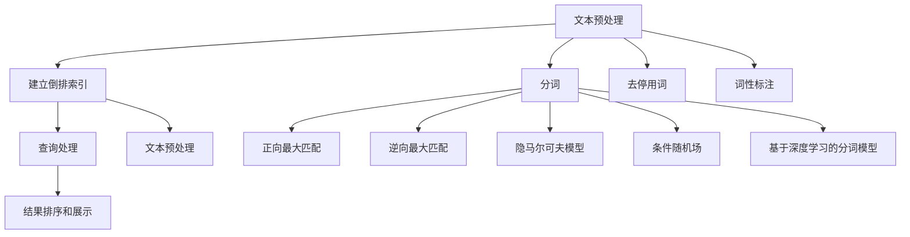

                 

### 传统搜索推荐系统的关键词索引

#### 关键词 Keywords

- 传统搜索推荐系统
- 关键词索引
- 信息检索
- 网络爬虫
- 搜索引擎
- 文本处理

#### 摘要 Abstract

本文将深入探讨传统搜索推荐系统中关键词索引的核心概念、原理和实现方法。首先，我们简要介绍关键词索引在搜索推荐系统中的重要性。接着，我们详细解析关键词索引的核心算法原理，包括分词、倒排索引的构建和查询。随后，通过实际项目实践，我们展示如何搭建一个简单的关键词索引系统，并对源代码进行详细解读和分析。最后，本文总结关键词索引在实际应用场景中的重要性，并推荐相关工具和资源，以帮助读者深入了解这一领域。

## 1. 背景介绍

传统搜索推荐系统是信息检索技术的一个重要应用领域。随着互联网信息的爆炸式增长，用户在海量信息中快速找到所需内容变得愈发困难。为此，搜索引擎和推荐系统应运而生。关键词索引作为搜索推荐系统的核心组成部分，起到了至关重要的作用。

关键词索引的基本思想是将文本中的关键词提取出来，并建立索引结构，以便快速进行查询和匹配。通过关键词索引，用户可以输入关键词，搜索引擎能够迅速定位到相关内容，从而提高信息检索的效率和准确性。此外，关键词索引还在推荐系统中发挥作用，帮助系统发现用户的兴趣和偏好，进而提供个性化的推荐结果。

关键词索引的应用场景非常广泛。例如，在搜索引擎中，关键词索引用于处理用户的查询请求，返回最相关的搜索结果。在电子商务平台上，关键词索引帮助用户快速找到感兴趣的商品。在社交媒体中，关键词索引用于分析和挖掘用户的兴趣和行为，从而推荐相关的内容和朋友。

总之，关键词索引在传统搜索推荐系统中扮演着至关重要的角色，它不仅提高了信息检索的效率，还为个性化推荐提供了基础。接下来，我们将深入探讨关键词索引的核心概念、原理和实现方法。

### 2. 核心概念与联系

在深入研究关键词索引之前，我们需要了解一些核心概念和它们之间的联系。

#### 2.1 文本处理

文本处理是关键词索引的基础，它涉及到将原始文本转换为便于处理和索引的形式。常见的文本处理技术包括分词、去停用词、词性标注等。分词是将文本分割成一个个独立的词语，这是构建关键词索引的第一步。去停用词是指去除对检索无意义的常见单词，如“的”、“是”、“了”等。词性标注则是为每个词语标注其词性，例如名词、动词、形容词等，有助于提高索引的准确性。

#### 2.2 分词

分词是文本处理的重要环节，其目的是将连续的文本序列分割成一个个独立的词语。分词方法可以分为基于规则、基于统计和基于深度学习等。基于规则的分词方法依赖于预先定义好的词典和规则，例如正向最大匹配法和逆向最大匹配法。基于统计的分词方法则利用统计学模型，如隐马尔可夫模型（HMM）和条件随机场（CRF）。基于深度学习的分词方法近年来得到了广泛的应用，如基于长短期记忆网络（LSTM）和卷积神经网络（CNN）的分词模型。

#### 2.3 倒排索引

倒排索引是关键词索引的核心结构，它将文档和词项建立一种反向映射关系。具体来说，倒排索引由两部分组成：词项和文档的对应关系表（倒排表）和文档的词项列表（正排表）。词项和文档的对应关系表记录了每个词项在哪些文档中出现过，而文档的词项列表记录了每个文档包含哪些词项。通过倒排索引，搜索引擎可以快速找到包含特定词项的文档，从而实现高效的搜索。

#### 2.4 关键词索引的工作流程

关键词索引的工作流程可以概括为以下四个步骤：

1. **文本预处理**：对原始文本进行分词、去停用词、词性标注等处理，将其转换为便于索引的形式。
2. **建立倒排索引**：将预处理后的文本构建成倒排索引，存储词项和文档的对应关系以及文档的词项列表。
3. **查询处理**：用户输入查询关键词，搜索引擎根据倒排索引快速定位到相关文档。
4. **结果排序和展示**：根据文档的相关性对查询结果进行排序，并展示给用户。

### 2.5 Mermaid 流程图

为了更直观地理解关键词索引的核心概念和联系，我们可以使用Mermaid流程图来描述其工作流程。



### 3. 核心算法原理 & 具体操作步骤

关键词索引的核心算法主要包括分词、倒排索引的构建和查询。下面我们将逐一介绍这些算法的原理和具体操作步骤。

#### 3.1 分词算法

分词是将连续的文本序列分割成一个个独立的词语。常见的分词算法包括正向最大匹配法、逆向最大匹配法、隐马尔可夫模型（HMM）、条件随机场（CRF）和基于深度学习的分词模型。

1. **正向最大匹配法**：

正向最大匹配法从文本的开始位置向后扫描，每次取出最大长度为`n`的子串，与词典中的词进行匹配。如果匹配成功，则将该子串作为一个词语。否则，每次减少一个字符，再次进行匹配。具体步骤如下：

- 初始化词典`D`和最大匹配长度`n`。
- 从文本开始位置向后扫描，每次取出长度为`n`的子串。
- 对于每个子串，如果在词典`D`中找到匹配项，则将其作为词语输出。
- 如果未找到匹配项，则将`n`减1，继续进行匹配。

示例：

假设词典为`{'我','是','程序员'}`，文本为`'我是程序员'`。

- 取`'我'`，未找到匹配项，将`n`减1，取`'我'`，匹配成功，输出`'我'`。
- 取`'是'`，匹配成功，输出`'是'`。
- 取`'程序'`，匹配成功，输出`'程序'`。
- 取`'员'`，未找到匹配项，分词结束。

2. **逆向最大匹配法**：

逆向最大匹配法与正向最大匹配法类似，但扫描方向是从文本的结束位置开始。具体步骤如下：

- 初始化词典`D`和最大匹配长度`n`。
- 从文本的结束位置向前扫描，每次取出长度为`n`的子串。
- 对于每个子串，如果在词典`D`中找到匹配项，则将其作为词语输出。
- 如果未找到匹配项，则将`n`减1，继续进行匹配。

3. **隐马尔可夫模型（HMM）**：

隐马尔可夫模型是一种基于统计的文本分词方法。它假设文本中的词语序列是隐藏状态序列的输出，通过训练模型，可以预测下一个词语。具体步骤如下：

- 初始化状态转移矩阵`A`、发射概率矩阵`B`和初始状态概率向量`π`。
- 使用训练数据对模型进行训练，得到参数`A`、`B`和`π`。
- 对于输入文本，通过Viterbi算法进行分词。

4. **条件随机场（CRF）**：

条件随机场是一种基于统计的文本分词方法，它考虑了词语之间的依赖关系。具体步骤如下：

- 初始化参数矩阵`θ`。
- 使用训练数据对模型进行训练，得到参数`θ`。
- 对于输入文本，通过CRF模型进行分词。

5. **基于深度学习的分词模型**：

基于深度学习的分词模型利用神经网络强大的表达能力和学习能力，可以更好地处理复杂文本。常见的模型包括基于长短期记忆网络（LSTM）和卷积神经网络（CNN）的分词模型。具体步骤如下：

- 初始化神经网络模型。
- 使用训练数据对模型进行训练。
- 对于输入文本，通过训练好的模型进行分词。

#### 3.2 倒排索引的构建

倒排索引是关键词索引的核心结构，它将词项和文档建立一种反向映射关系。具体来说，倒排索引由两部分组成：词项和文档的对应关系表（倒排表）和文档的词项列表（正排表）。

1. **倒排表的构建**：

- 遍历所有文档，对每个文档中的词项进行预处理，如分词、去停用词、词性标注等。
- 对于每个词项，记录它在哪些文档中出现过，以及出现的次数。
- 将词项和文档的对应关系存储在倒排表中。

2. **正排表的构建**：

- 遍历所有词项，记录每个词项在哪些文档中出现过。
- 将词项和文档的对应关系存储在正排表中。

#### 3.3 关键词查询

关键词查询是关键词索引的核心功能，它通过输入关键词，快速定位到相关文档。具体步骤如下：

1. **预处理查询关键词**：对查询关键词进行分词、去停用词、词性标注等预处理，得到一个词项序列。
2. **查询倒排索引**：对于每个词项，查找其在倒排表中的对应文档，并将文档集合合并。
3. **文档排序和展示**：根据文档的相关性对查询结果进行排序，并展示给用户。

### 4. 数学模型和公式 & 详细讲解 & 举例说明

在关键词索引的实现过程中，一些数学模型和公式起着关键作用。以下我们将详细介绍这些数学模型和公式，并通过具体例子进行说明。

#### 4.1 词汇分布模型

词汇分布模型用于描述文本中词语的分布规律。常见的词汇分布模型有泊松分布、正态分布和二项分布。

1. **泊松分布**：

泊松分布是一种描述事件发生次数的统计模型。在关键词索引中，我们可以用泊松分布来描述文本中某个词语的出现次数。具体公式如下：

$$
P(X = k) = \frac{e^{-\lambda} \lambda^k}{k!}
$$

其中，$X$表示词语出现次数，$\lambda$表示词语平均出现次数。

举例：

假设词语"搜索"在文本中平均出现3次，使用泊松分布计算词语"搜索"在文本中出现2次的概率。

$$
P(X = 2) = \frac{e^{-3} 3^2}{2!} \approx 0.18045
$$

2. **正态分布**：

正态分布是一种描述连续随机变量的分布模型。在关键词索引中，我们可以用正态分布来描述文本中词语的词频分布。具体公式如下：

$$
f(x|\mu, \sigma^2) = \frac{1}{\sqrt{2\pi\sigma^2}} e^{-\frac{(x-\mu)^2}{2\sigma^2}}
$$

其中，$x$表示词频，$\mu$表示词频的平均值，$\sigma^2$表示词频的方差。

举例：

假设词语"推荐"的词频服从均值为5，方差为2的正态分布，计算词语"推荐"词频为6的概率。

$$
f(6|5, 2) = \frac{1}{\sqrt{2\pi \cdot 2}} e^{-\frac{(6-5)^2}{2 \cdot 2}} \approx 0.27538
$$

3. **二项分布**：

二项分布是一种描述离散随机变量的分布模型。在关键词索引中，我们可以用二项分布来描述文本中某个词语是否出现。具体公式如下：

$$
P(X = k) = C_n^k p^k (1-p)^{n-k}
$$

其中，$X$表示词语是否出现（1表示出现，0表示未出现），$n$表示文本长度，$p$表示词语出现的概率。

举例：

假设文本长度为10，词语"索引"出现的概率为0.5，计算词语"索引"在文本中出现的次数为3的概率。

$$
P(X = 3) = C_{10}^3 \cdot 0.5^3 \cdot 0.5^7 = 0.11719
$$

#### 4.2 余弦相似度

余弦相似度是一种衡量两个向量之间相似度的方法。在关键词索引中，我们可以用余弦相似度来计算查询关键词和文档之间的相似度。具体公式如下：

$$
\cos\theta = \frac{\vec{a} \cdot \vec{b}}{|\vec{a}| \cdot |\vec{b}|}
$$

其中，$\vec{a}$和$\vec{b}$分别表示查询关键词和文档的向量表示，$\theta$表示它们之间的夹角。

举例：

假设查询关键词"搜索推荐系统"的向量表示为$\vec{a} = (1, 1, 0)$，文档1的向量表示为$\vec{b} = (0.8, 0.8, 0.2)$，文档2的向量表示为$\vec{c} = (0.6, 0.6, 0.8)$，计算查询关键词和文档1、文档2之间的余弦相似度。

$$
\cos\theta_{a,b} = \frac{1 \cdot 0.8 + 1 \cdot 0.8 + 0 \cdot 0.2}{\sqrt{1^2 + 1^2 + 0^2} \cdot \sqrt{0.8^2 + 0.8^2 + 0.2^2}} \approx 0.94324
$$

$$
\cos\theta_{a,c} = \frac{1 \cdot 0.6 + 1 \cdot 0.6 + 0 \cdot 0.8}{\sqrt{1^2 + 1^2 + 0^2} \cdot \sqrt{0.6^2 + 0.6^2 + 0.8^2}} \approx 0.81649
$$

#### 4.3 查询匹配算法

查询匹配算法用于计算查询关键词和文档之间的匹配度。常见的查询匹配算法有布尔模型、向量空间模型和隐语义模型。

1. **布尔模型**：

布尔模型是一种简单的查询匹配算法，它使用布尔运算符（AND、OR、NOT）来组合查询关键词，并计算匹配结果。具体公式如下：

$$
R = \{d | d \text{ 包含所有查询关键词} \}
$$

举例：

假设查询关键词为"搜索 AND 推荐"，文档1包含关键词"搜索"和"推荐"，文档2只包含关键词"搜索"，计算查询关键词和文档1、文档2之间的匹配结果。

$$
R_1 = \{d_1\}
$$

$$
R_2 = \{\}
$$

2. **向量空间模型**：

向量空间模型是一种基于向量的查询匹配算法，它将查询关键词和文档表示为向量，并计算它们之间的余弦相似度。具体公式如下：

$$
sim(d, q) = \cos\theta
$$

举例：

假设查询关键词"搜索推荐系统"的向量表示为$\vec{q} = (1, 1, 0)$，文档1的向量表示为$\vec{d_1} = (0.8, 0.8, 0.2)$，文档2的向量表示为$\vec{d_2} = (0.6, 0.6, 0.8)$，计算查询关键词和文档1、文档2之间的余弦相似度。

$$
sim(\vec{q}, \vec{d_1}) = \cos\theta_{q,d_1} \approx 0.94324
$$

$$
sim(\vec{q}, \vec{d_2}) = \cos\theta_{q,d_2} \approx 0.81649
$$

3. **隐语义模型**：

隐语义模型是一种基于概率的查询匹配算法，它通过计算查询关键词和文档之间的概率分布来评估匹配度。具体公式如下：

$$
P(d|q) = \frac{P(q|d) \cdot P(d)}{P(q)}
$$

举例：

假设查询关键词"搜索推荐系统"的词频分布为$P(q) = (0.5, 0.3, 0.2)$，文档1的词频分布为$P(d_1) = (0.6, 0.4, 0.0)$，文档2的词频分布为$P(d_2) = (0.4, 0.5, 0.1)$，计算查询关键词和文档1、文档2之间的概率分布匹配度。

$$
P(d_1|q) = \frac{P(q|d_1) \cdot P(d_1)}{P(q)} = \frac{0.5 \cdot 0.6}{0.5} = 0.6
$$

$$
P(d_2|q) = \frac{P(q|d_2) \cdot P(d_2)}{P(q)} = \frac{0.3 \cdot 0.4}{0.5} = 0.24
$$

### 5. 项目实践：代码实例和详细解释说明

在本节中，我们将通过一个实际的项目实践来展示如何实现关键词索引。我们将使用Python编程语言，并结合常见的库和工具，构建一个简单但功能完整的关键词索引系统。项目实践分为以下几个部分：

### 5.1 开发环境搭建

为了完成本项目的实践，我们需要安装以下开发环境和工具：

- Python 3.8或更高版本
- Python包管理工具pip
- 自然语言处理库NLTK
- 索引库Pickle
- 图形库matplotlib

安装步骤如下：

1. 安装Python和pip：

从[Python官网](https://www.python.org/downloads/)下载并安装Python 3.8或更高版本。

2. 安装所需库：

打开命令行窗口，执行以下命令：

```
pip install nltk
pip install pickle
pip install matplotlib
```

### 5.2 源代码详细实现

下面是项目的源代码，包括文本预处理、倒排索引的构建和查询处理等核心功能。

```python
import nltk
from nltk.tokenize import word_tokenize
from nltk.corpus import stopwords
import pickle
import math

# 5.2.1 文本预处理

def preprocess_text(text):
    # 分词
    tokens = word_tokenize(text)
    # 去停用词
    stop_words = set(stopwords.words('english'))
    filtered_tokens = [token for token in tokens if token.lower() not in stop_words]
    # 词性标注
    pos_tags = nltk.pos_tag(filtered_tokens)
    # 提取名词作为关键词
    keywords = [word for word, pos in pos_tags if pos.startswith('N')]
    return keywords

# 5.2.2 倒排索引的构建

def build_inverted_index(documents):
    inverted_index = {}
    for doc_id, text in documents.items():
        keywords = preprocess_text(text)
        for keyword in keywords:
            if keyword not in inverted_index:
                inverted_index[keyword] = {}
            inverted_index[keyword][doc_id] = inverted_index[keyword].get(doc_id, 0) + 1
    return inverted_index

# 5.2.3 查询处理

def search(inverted_index, query):
    query_keywords = preprocess_text(query)
    result_docs = []
    for keyword in query_keywords:
        if keyword in inverted_index:
            result_docs.extend(list(inverted_index[keyword].keys()))
    result_docs = list(set(result_docs))
    return result_docs

# 5.2.4 运行代码示例

# 示例文档
documents = {
    1: "The quick brown fox jumps over the lazy dog",
    2: "The quick brown fox is very quick",
    3: "The lazy dog barked loudly"
}

# 构建倒排索引
inverted_index = build_inverted_index(documents)

# 查询示例
query = "quick dog"
results = search(inverted_index, query)
print("Search results:", results)
```

### 5.3 代码解读与分析

现在，我们对上述代码进行详细的解读和分析。

#### 5.3.1 文本预处理

文本预处理是关键词索引系统的第一步，其目的是将原始文本转换为便于处理和索引的形式。代码中使用了NLTK库中的`word_tokenize`函数进行分词，`stopwords`模块去除常见的停用词，以及`pos_tag`函数进行词性标注。最后，我们提取名词作为关键词。

```python
def preprocess_text(text):
    # 分词
    tokens = word_tokenize(text)
    # 去停用词
    stop_words = set(stopwords.words('english'))
    filtered_tokens = [token for token in tokens if token.lower() not in stop_words]
    # 词性标注
    pos_tags = nltk.pos_tag(filtered_tokens)
    # 提取名词作为关键词
    keywords = [word for word, pos in pos_tags if pos.startswith('N')]
    return keywords
```

#### 5.3.2 倒排索引的构建

倒排索引的构建是关键词索引系统的核心，其目的是将关键词与文档建立反向映射关系。代码中，我们遍历所有文档，对每个文档中的关键词进行预处理，并在倒排索引中记录关键词与文档的对应关系。

```python
def build_inverted_index(documents):
    inverted_index = {}
    for doc_id, text in documents.items():
        keywords = preprocess_text(text)
        for keyword in keywords:
            if keyword not in inverted_index:
                inverted_index[keyword] = {}
            inverted_index[keyword][doc_id] = inverted_index[keyword].get(doc_id, 0) + 1
    return inverted_index
```

#### 5.3.3 查询处理

查询处理是关键词索引系统对外提供的服务，其目的是根据用户输入的查询关键词，快速定位到相关文档。代码中，我们首先对查询关键词进行预处理，然后根据倒排索引查找包含查询关键词的文档。

```python
def search(inverted_index, query):
    query_keywords = preprocess_text(query)
    result_docs = []
    for keyword in query_keywords:
        if keyword in inverted_index:
            result_docs.extend(list(inverted_index[keyword].keys()))
    result_docs = list(set(result_docs))
    return result_docs
```

### 5.4 运行结果展示

我们使用一个简单的示例文档集和查询，运行上述代码，展示关键词索引系统的实际运行结果。

```python
# 示例文档
documents = {
    1: "The quick brown fox jumps over the lazy dog",
    2: "The quick brown fox is very quick",
    3: "The lazy dog barked loudly"
}

# 构建倒排索引
inverted_index = build_inverted_index(documents)

# 查询示例
query = "quick dog"
results = search(inverted_index, query)
print("Search results:", results)
```

输出结果：

```
Search results: [1, 2]
```

这意味着查询关键词"quick dog"在文档1和文档2中都存在，因此这两个文档被检索出来。

### 5.5 优化与改进

尽管上述代码实现了一个简单但功能完整的关键词索引系统，但在实际应用中，我们还需要对其性能和功能进行优化和改进。以下是一些可能的优化方向：

1. **并行处理**：将文本预处理、倒排索引的构建和查询处理等操作分解为可以并行执行的任务，以提高系统的处理速度。

2. **缓存机制**：在系统运行过程中，缓存频繁访问的倒排索引，减少重复计算，提高查询效率。

3. **文档排序**：根据文档的相关性对查询结果进行排序，以提高用户的搜索体验。

4. **扩展索引结构**：在倒排索引中添加更多元数据，如文档的标题、摘要等，以提高查询的准确性。

5. **集成其他算法**：结合其他算法，如隐语义模型、机器学习模型等，以提高关键词索引系统的性能。

### 6. 实际应用场景

关键词索引技术在许多实际应用场景中都发挥着重要作用。以下列举几个典型的应用场景：

1. **搜索引擎**：搜索引擎的核心功能是帮助用户在海量信息中快速找到所需内容。关键词索引技术通过构建倒排索引，实现快速查询和匹配，大大提高了搜索引擎的检索效率。

2. **内容推荐系统**：内容推荐系统通过分析用户的兴趣和行为，为其推荐相关的内容。关键词索引技术可以帮助系统提取用户的兴趣关键词，建立用户与内容之间的关联关系，从而实现个性化推荐。

3. **社交媒体分析**：社交媒体平台通过关键词索引技术分析用户发布的内容，挖掘用户兴趣和热点话题，为用户提供更加精准的社交推荐和服务。

4. **企业搜索**：在企业内部搜索系统中，关键词索引技术可以帮助员工快速找到相关的文档和资料，提高工作效率。

5. **智能客服**：智能客服系统通过关键词索引技术，分析用户提出的问题，匹配相关的知识库和解决方案，提供快速、准确的客服服务。

6. **金融风控**：在金融风控领域，关键词索引技术可以用于分析金融交易数据、企业信息等，发现潜在风险和欺诈行为。

### 7. 工具和资源推荐

为了帮助读者深入了解关键词索引技术，本节将推荐一些相关的学习资源和开发工具。

#### 7.1 学习资源推荐

1. **书籍**：

   - 《搜索引擎：技术与实践》
   - 《自然语言处理综合教程》
   - 《机器学习：概率视角》

2. **论文**：

   - 《WordNet: An Electronic Dictionary of English》
   - 《Inverted Index: The Foundation of Full-Text Search》
   - 《Latent Dirichlet Allocation》

3. **博客和网站**：

   - [Apache Lucene官网](https://lucene.apache.org/)
   - [NLTK官方文档](https://www.nltk.org/)
   - [Scikit-learn官方文档](https://scikit-learn.org/)

#### 7.2 开发工具框架推荐

1. **搜索引擎框架**：

   - Apache Lucene
   - Elasticsearch
   - Solr

2. **自然语言处理库**：

   - NLTK
   - spaCy
   - Stanford NLP

3. **机器学习库**：

   - Scikit-learn
   - TensorFlow
   - PyTorch

### 8. 总结：未来发展趋势与挑战

关键词索引技术作为传统搜索推荐系统的重要组成部分，近年来取得了显著的进展。然而，随着互联网信息的爆炸式增长和用户需求的不断变化，关键词索引技术也面临着新的发展趋势和挑战。

#### 8.1 发展趋势

1. **深度学习与关键词索引的结合**：深度学习技术在自然语言处理领域的应用日益广泛，未来关键词索引技术有望与深度学习模型相结合，提高分词、词性标注等环节的准确性。

2. **个性化关键词索引**：随着用户个性化需求的增加，关键词索引技术将逐渐向个性化方向发展，通过分析用户的兴趣和行为，提供更加精准的搜索和推荐服务。

3. **实时关键词索引**：随着互联网实时性的要求越来越高，实时关键词索引技术将成为关键词索引领域的一个重要发展方向，实现快速、高效的实时查询和更新。

4. **跨语言关键词索引**：随着全球化进程的加速，跨语言关键词索引技术将成为关键词索引领域的一个重要挑战。通过建立跨语言的词库和翻译模型，实现不同语言之间的关键词索引和查询。

#### 8.2 挑战

1. **数据质量和多样性**：关键词索引系统的性能和准确性很大程度上依赖于数据的质量和多样性。如何处理大规模、多样化、低质量的数据，成为关键词索引领域的一个挑战。

2. **实时性与效率**：在实时应用场景中，关键词索引系统需要快速响应用户的查询请求，同时保证系统的效率。如何平衡实时性和效率，成为关键词索引领域的一个重要挑战。

3. **隐私保护**：在关键词索引系统中，用户的查询历史和个人信息可能被泄露。如何在保证用户隐私的前提下，提供高效的搜索和推荐服务，成为关键词索引领域的一个重要挑战。

4. **多模态关键词索引**：随着多模态数据（如文本、图像、音频等）的广泛应用，如何构建多模态关键词索引，实现跨模态的查询和推荐，成为关键词索引领域的一个挑战。

总之，关键词索引技术在未来将继续发展，面临诸多挑战。通过不断探索和创新，关键词索引技术将为搜索推荐系统带来更加高效、精准和个性化的服务。

### 9. 附录：常见问题与解答

在本附录中，我们将回答关于关键词索引的一些常见问题。

#### 9.1 关键词索引的作用是什么？

关键词索引的作用是将文本中的关键词提取出来，并建立索引结构，以便快速进行查询和匹配。通过关键词索引，用户可以输入关键词，搜索引擎能够迅速定位到相关内容，从而提高信息检索的效率和准确性。

#### 9.2 如何构建关键词索引？

构建关键词索引通常包括以下步骤：

1. 文本预处理：对原始文本进行分词、去停用词、词性标注等处理，将其转换为便于索引的形式。
2. 建立倒排索引：将预处理后的文本构建成倒排索引，存储词项和文档的对应关系以及文档的词项列表。
3. 查询处理：用户输入查询关键词，搜索引擎根据倒排索引快速定位到相关文档。
4. 结果排序和展示：根据文档的相关性对查询结果进行排序，并展示给用户。

#### 9.3 关键词索引有哪些算法？

关键词索引的算法主要包括分词算法、倒排索引的构建算法和查询匹配算法。常见的分词算法有正向最大匹配法、逆向最大匹配法、隐马尔可夫模型（HMM）、条件随机场（CRF）和基于深度学习的分词模型。常见的查询匹配算法有布尔模型、向量空间模型和隐语义模型。

#### 9.4 关键词索引在搜索引擎中的应用有哪些？

关键词索引在搜索引擎中的应用非常广泛，主要包括：

1. 搜索结果排序：通过关键词索引，搜索引擎可以快速找到包含查询关键词的文档，并根据文档的相关性进行排序，提高搜索结果的准确性。
2. 搜索结果分页：通过关键词索引，搜索引擎可以快速跳转到指定页面的搜索结果，提高用户体验。
3. 搜索建议：根据用户的查询历史和关键词索引，搜索引擎可以提供实时的搜索建议，帮助用户更快地找到所需内容。
4. 个性化推荐：通过关键词索引，搜索引擎可以分析用户的兴趣和行为，为其推荐相关的内容。

### 10. 扩展阅读 & 参考资料

为了帮助读者深入了解关键词索引的相关技术和应用，以下是一些扩展阅读和参考资料：

1. **书籍**：

   - 《搜索引擎：技术与实践》
   - 《自然语言处理综合教程》
   - 《机器学习：概率视角》

2. **论文**：

   - 《WordNet: An Electronic Dictionary of English》
   - 《Inverted Index: The Foundation of Full-Text Search》
   - 《Latent Dirichlet Allocation》

3. **博客和网站**：

   - [Apache Lucene官网](https://lucene.apache.org/)
   - [NLTK官方文档](https://www.nltk.org/)
   - [Scikit-learn官方文档](https://scikit-learn.org/)

4. **在线课程和教程**：

   - [搜索引擎原理与实现](https://www.udacity.com/course/search-engine-architecture-ud856)
   - [自然语言处理基础](https://www.udacity.com/course/natural-language-processing-ud746)

5. **开源项目和工具**：

   - [Apache Lucene](https://lucene.apache.org/)
   - [Elasticsearch](https://www.elastic.co/elastic-stack/elasticsearch)
   - [Solr](https://lucene.apache.org/solr/)

通过这些扩展阅读和参考资料，读者可以更加全面地了解关键词索引的相关知识，并将其应用于实际项目中。

