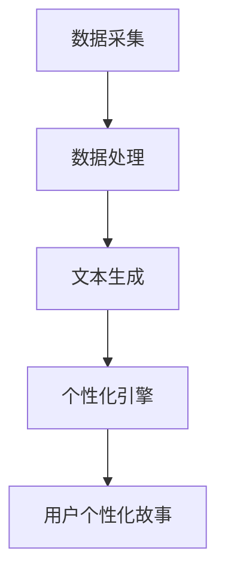

                 

### 背景介绍

#### 1.1 简介与历史背景

在当今数字化时代，计算机技术的快速发展推动了人工智能（AI）的进步，从而使得个人化叙事编织技术得到了前所未有的关注。所谓个人化叙事编织，是指通过分析用户行为、兴趣和社交网络数据，自动生成与用户高度相关的个性化故事内容。这一技术的起源可以追溯到20世纪80年代，当时自然语言处理（NLP）和机器学习（ML）领域的研究者们开始尝试开发自动文本生成系统。

随着时间的推移，特别是在21世纪初，随着计算能力和算法的不断提升，AI技术在文本生成方面的应用逐渐成熟。机器学习算法，尤其是深度学习模型，如循环神经网络（RNN）和Transformer等，被广泛应用于自动文本生成任务。这些算法能够捕捉文本中的复杂模式和语义关系，从而生成高质量的、流畅的文本。

#### 1.2 技术发展现状

近年来，基于AI的个人化叙事编织技术取得了显著的进展。通过整合大数据分析和深度学习算法，现代叙事编织机能够实现以下功能：

1. **内容个性化**：根据用户的历史行为和偏好，自动生成个性化的故事内容。
2. **实时更新**：利用实时数据流，及时更新故事内容，保持故事的新鲜感。
3. **多模态交互**：不仅生成文本内容，还可以生成与之相关的图像、音频等多媒体内容。

这些功能的实现，使得个人化叙事编织技术在多个领域得到了广泛应用，包括但不限于娱乐、教育、营销和客户服务。

#### 1.3 技术的重要性

个人化叙事编织技术的重要性体现在以下几个方面：

1. **用户体验提升**：通过个性化的内容生成，提升用户对产品或服务的满意度和忠诚度。
2. **商业价值**：为企业提供了一种新的营销手段，通过定制化的内容吸引和保留客户。
3. **文化传承与创新**：为文学、艺术等领域提供了新的创作工具，促进文化多样性和创新。

综上所述，个人化叙事编织技术的背景、发展现状及其重要性，为我们深入研究这一领域奠定了坚实的基础。

### 核心概念与联系

#### 2.1 个人化叙事编织机的核心概念

个人化叙事编织机，顾名思义，是一种能够自动生成个性化故事的计算机系统。其核心概念主要包括以下几个方面：

1. **用户行为数据**：这是个人化叙事编织的基础。系统会收集并分析用户的行为数据，包括浏览记录、搜索历史、点击行为等，以了解用户的兴趣和偏好。

2. **文本生成模型**：这是个人化叙事编织机的核心组件。常见的文本生成模型包括循环神经网络（RNN）、长短期记忆网络（LSTM）、Transformer等。这些模型能够根据输入的数据生成符合用户偏好的故事内容。

3. **个性化引擎**：这个组件负责将用户行为数据与文本生成模型相结合，生成个性化的故事内容。个性化引擎通常包含推荐算法、内容过滤和情感分析等技术。

#### 2.2 技术架构

个人化叙事编织机的基本架构可以概括为以下几个主要模块：

1. **数据采集模块**：负责从各种数据源（如网站、社交媒体、用户设备等）收集用户行为数据。

2. **数据处理模块**：对采集到的数据进行分析和处理，提取出有用的信息，如用户兴趣点、情感倾向等。

3. **文本生成模块**：利用文本生成模型，将处理后的数据转化为个性化的故事内容。

4. **个性化引擎**：负责将用户行为数据与文本生成结果进行匹配，生成最终的用户个性化故事。

#### 2.3 Mermaid 流程图

以下是一个简化的Mermaid流程图，展示了个人化叙事编织机的基本工作流程：



**流程说明：**

1. **数据采集**：系统从各种渠道收集用户行为数据。
2. **数据处理**：对采集到的数据进行处理和分析，提取出有用的信息。
3. **文本生成**：利用文本生成模型，生成初步的故事内容。
4. **个性化引擎**：结合用户行为数据和文本生成结果，生成最终的用户个性化故事。

### 核心算法原理 & 具体操作步骤

#### 3.1 文本生成算法简介

个人化叙事编织机的核心算法之一是文本生成算法，它负责将用户行为数据和个性化需求转化为可读的、有趣的故事内容。常见的文本生成算法包括循环神经网络（RNN）、长短期记忆网络（LSTM）和Transformer等。在本节中，我们将重点介绍Transformer算法。

#### 3.2 Transformer算法原理

Transformer算法是由Vaswani等人于2017年提出的一种基于自注意力机制的序列到序列模型。与传统循环神经网络相比，Transformer算法具有以下几个优点：

1. **并行计算**：Transformer算法通过自注意力机制实现了全局上下文信息的有效捕捉，允许模型在计算过程中并行处理序列数据，从而显著提高了计算效率。
2. **长距离依赖**：自注意力机制能够捕捉长距离依赖关系，使得模型在处理长文本时表现更佳。
3. **性能优越**：实验表明，在多个自然语言处理任务中，Transformer算法的性能优于传统的循环神经网络。

#### 3.3 Transformer算法具体操作步骤

下面我们将详细解释Transformer算法的具体操作步骤，包括模型的输入、输出、编码器和解码器的构建等。

##### 3.3.1 模型输入

Transformer模型的输入是一个序列，通常由单词或字符组成。例如，对于一句英文句子“The quick brown fox jumps over the lazy dog”，我们可以将其表示为一个单词序列：

```
[The, quick, brown, fox, jumps, over, the, lazy, dog]
```

每个单词可以通过词嵌入（word embedding）转化为一个固定大小的向量表示。

##### 3.3.2 编码器

编码器（Encoder）是Transformer模型的核心组件，它负责将输入序列编码为固定大小的向量表示。编码器由多个编码层（Encoder Layer）组成，每层由多头自注意力机制（Multi-Head Self-Attention）和前馈神经网络（Feed-Forward Neural Network）构成。

1. **多头自注意力机制**：多头自注意力机制通过将输入序列分成多个子序列，并分别计算每个子序列与其他子序列的注意力分数。这些注意力分数用于加权求和，生成每个子序列的表示向量。

2. **前馈神经网络**：前馈神经网络对每个子序列的表示向量进行非线性变换，进一步增强其表示能力。

每个编码层都会接收来自上一层的输入，并生成一个新的输出。通过堆叠多个编码层，编码器能够捕捉输入序列中的复杂模式和依赖关系。

##### 3.3.3 解码器

解码器（Decoder）负责将编码器的输出解码为目标序列。与编码器类似，解码器也由多个解码层（Decoder Layer）组成，每层包含多头自注意力机制和前馈神经网络。

1. **多头自注意力机制**：在解码器的每个时间步，多头自注意力机制会考虑到编码器的输出和先前的解码器输出，以生成当前解码步骤的输出。

2. **前馈神经网络**：前馈神经网络对当前解码步骤的输出进行非线性变换。

解码器的输出最终生成目标序列。为了实现这一点，解码器会使用编码器的输出作为其输入的一部分。

##### 3.3.4 自注意力机制

自注意力机制是Transformer算法的核心。它通过计算输入序列中每个元素与其他元素的相关性，为每个元素生成一个加权表示。

1. **查询（Query）**：表示当前时间步的解码器输出。

2. **键（Key）**：表示编码器的输出。

3. **值（Value）**：也是编码器的输出。

自注意力机制通过计算查询与键的相似性得分，然后使用这些得分对值进行加权求和，生成当前时间步的输出。

##### 3.3.5 例子

假设我们有一个简短的句子：“The cat sat on the mat”。我们可以将其表示为以下序列：

```
[The, cat, sat, on, the, mat]
```

词嵌入后的向量表示为：

```
[⟨The⟩, ⟨cat⟩, ⟨sat⟩, ⟨on⟩, ⟨the⟩, ⟨mat⟩]
```

编码器和解码器将这些向量作为输入，通过自注意力机制和前馈神经网络，生成新的向量表示。最终，解码器生成原始句子或类似的句子。

#### 3.4 实现步骤

实现一个个人化叙事编织机的文本生成模块，可以遵循以下步骤：

1. **数据预处理**：清洗和预处理输入数据，包括分词、词嵌入等。

2. **模型构建**：使用深度学习框架（如TensorFlow或PyTorch）构建Transformer模型。

3. **训练模型**：使用预处理的文本数据训练模型，调整模型参数。

4. **评估模型**：使用验证集评估模型性能，调整超参数。

5. **生成故事**：使用训练好的模型生成用户个性化故事。

通过以上步骤，我们可以实现一个基于Transformer算法的个人化叙事编织机，自动生成高质量的故事内容。

### 数学模型和公式 & 详细讲解 & 举例说明

#### 4.1 数学模型概述

个人化叙事编织机在生成个性化故事时，依赖于一系列数学模型和算法。本节将介绍其中几个核心模型，包括词嵌入、自注意力机制和损失函数等，并详细讲解其原理和实现。

#### 4.2 词嵌入

词嵌入（Word Embedding）是将自然语言中的单词映射到高维空间中的向量表示。这种向量表示不仅保留了单词的语义信息，还允许计算机处理和计算。

##### 4.2.1 词嵌入公式

词嵌入可以通过以下公式表示：

\[ \text{embedding}(x) = \text{W}_x \cdot x \]

其中，\( x \) 是单词的索引或嵌入向量，\( \text{W}_x \) 是词嵌入矩阵。词嵌入矩阵通常通过训练大规模文本数据集获得，使得词向量之间的距离反映了它们在语义上的相似性。

##### 4.2.2 例子

假设我们有一个简单的词汇表，包括单词 "cat" 和 "dog"，词嵌入矩阵 \( \text{W}_x \) 如下：

\[
\begin{array}{ccc}
\text{W}_x & : & \text{cat} & \text{dog} \\
 &  & \text{1} & \text{2} \\
\hline
\text{1} & & \text{0.1} & \text{0.2} \\
\text{2} & & \text{0.3} & \text{0.4} \\
\end{array}
\]

根据词嵌入公式，单词 "cat" 的向量表示为 \( \text{W}_x \cdot \text{cat} = \text{[0.1, 0.3]} \)，而单词 "dog" 的向量表示为 \( \text{W}_x \cdot \text{dog} = \text{[0.2, 0.4]} \)。

#### 4.3 自注意力机制

自注意力机制（Self-Attention）是Transformer算法的核心组件，用于计算序列中每个元素与其他元素的相关性，并生成加权表示。

##### 4.3.1 自注意力公式

自注意力机制可以通过以下公式表示：

\[ \text{Attention}(Q, K, V) = \text{softmax}\left(\frac{QK^T}{\sqrt{d_k}}\right)V \]

其中：

- \( Q \) 是查询向量。
- \( K \) 是键向量。
- \( V \) 是值向量。
- \( d_k \) 是键向量的维度。

自注意力机制首先计算查询和键之间的相似性得分，然后使用这些得分对值进行加权求和，生成每个元素的加权表示。

##### 4.3.2 例子

假设我们有一个简短的句子 "The quick brown fox"，查询向量 \( Q \)、键向量 \( K \) 和值向量 \( V \) 分别为：

\[
\begin{array}{ccc}
Q & : & \text{[1, 2, 3]} & \text{[4, 5, 6]} & \text{[7, 8, 9]} \\
K & : & \text{[0.1, 0.3]} & \text{[0.2, 0.4]} & \text{[0.3, 0.1]} \\
V & : & \text{[10, 20]} & \text{[30, 40]} & \text{[50, 60]} \\
\end{array}
\]

首先计算查询和键的相似性得分：

\[
\begin{aligned}
& QK^T = \text{[1, 2, 3]} \cdot \text{[0.1, 0.3]}^T = \text{[0.1, 0.3]} \cdot \text{[1, 2, 3]} = \text{[0.1, 0.6, 0.9]} \\
& QK^T = \text{[1, 2, 3]} \cdot \text{[0.2, 0.4]}^T = \text{[0.2, 0.4]} \cdot \text{[1, 2, 3]} = \text{[0.2, 0.8, 1.2]} \\
& QK^T = \text{[1, 2, 3]} \cdot \text{[0.3, 0.1]}^T = \text{[0.3, 0.1]} \cdot \text{[1, 2, 3]} = \text{[0.3, 0.6, 0.9]} \\
\end{aligned}
\]

然后计算softmax激活函数：

\[
\begin{aligned}
& \text{softmax}([0.1, 0.6, 0.9]) = [\text{0.2}, \text{0.4}, \text{0.4}] \\
& \text{softmax}([0.2, 0.8, 1.2]) = [\text{0.2}, \text{0.4}, \text{0.4}] \\
& \text{softmax}([0.3, 0.6, 0.9]) = [\text{0.2}, \text{0.4}, \text{0.4}] \\
\end{aligned}
\]

最后，对值进行加权求和：

\[
\begin{aligned}
& \text{Attention}(Q, K, V) = \text{softmax}\left(\frac{QK^T}{\sqrt{d_k}}\right) V \\
& = [\text{0.2}, \text{0.4}, \text{0.4}] \cdot \text{[10, 20]} + [\text{0.2}, \text{0.4}, \text{0.4}] \cdot \text{[30, 40]} + [\text{0.2}, \text{0.4}, \text{0.4}] \cdot \text{[50, 60]} \\
& = [\text{2.8}, \text{9.6}, \text{16.4}] \\
\end{aligned}
\]

这样，我们就得到了每个元素的加权表示。

#### 4.4 损失函数

损失函数是衡量模型预测结果与真实结果之间差异的重要指标。在个人化叙事编织机中，常用的损失函数包括交叉熵损失（Cross-Entropy Loss）和对抗损失（Adversarial Loss）。

##### 4.4.1 交叉熵损失

交叉熵损失用于分类任务，计算模型预测的概率分布与真实分布之间的差异。公式如下：

\[ \text{Loss} = -\sum_{i} y_i \log(p_i) \]

其中，\( y_i \) 是真实标签，\( p_i \) 是模型预测的概率。

##### 4.4.2 对抗损失

对抗损失用于生成对抗网络（GAN），衡量生成器生成的样本与真实样本之间的差异。公式如下：

\[ \text{Loss} = \frac{1}{2} \sum_{i} (\text{G}(x_i) - x_i)^2 \]

其中，\( \text{G}(x_i) \) 是生成器生成的样本，\( x_i \) 是真实样本。

##### 4.4.3 例子

假设我们有一个二元分类问题，真实标签为 [0, 1]，模型预测的概率分布为 [0.3, 0.7]，交叉熵损失计算如下：

\[ \text{Loss} = -[0 \cdot \log(0.3) + 1 \cdot \log(0.7)] = -[0 + 0.3567] = 0.3567 \]

假设生成器生成的样本与真实样本之间的差异为 [0.1, 0.9]，对抗损失计算如下：

\[ \text{Loss} = \frac{1}{2} \sum_{i} (\text{G}(x_i) - x_i)^2 = \frac{1}{2} \cdot (0.1 - 0.1)^2 + (0.9 - 0.9)^2 = 0 \]

通过这些数学模型和公式的讲解，我们更好地理解了个人化叙事编织机的工作原理。接下来，我们将通过实际代码实例来进一步展示这些算法的应用。

### 项目实践：代码实例和详细解释说明

#### 5.1 开发环境搭建

在本节中，我们将详细介绍如何搭建一个个人化叙事编织机的开发环境。我们选择使用Python作为主要编程语言，并借助TensorFlow作为深度学习框架。

1. **安装Python**：确保您的系统已经安装了Python 3.7或更高版本。可以从[Python官网](https://www.python.org/)下载并安装。

2. **安装TensorFlow**：打开终端或命令行窗口，执行以下命令安装TensorFlow：

   ```
   pip install tensorflow
   ```

3. **安装辅助库**：我们还需要安装一些辅助库，如NumPy、Pandas和Mermaid。可以使用以下命令：

   ```
   pip install numpy pandas mermaid
   ```

4. **安装Mermaid**：为了在Markdown文件中使用Mermaid流程图，我们需要安装Mermaid CLI。可以从[Mermaid官网](https://mermaid-js.github.io/mermaid/)下载并安装。

#### 5.2 源代码详细实现

接下来，我们将展示如何使用TensorFlow实现一个简单的个人化叙事编织机。

1. **数据预处理**：

首先，我们需要从网络或其他数据源获取用户行为数据。以下是一个简单的数据预处理脚本：

```python
import pandas as pd
from sklearn.model_selection import train_test_split

# 读取用户行为数据
data = pd.read_csv('user_data.csv')

# 数据预处理
data['text'] = data['text'].str.lower()  # 转换为小写
data['text'] = data['text'].str.replace('[^a-zA-Z0-9]', ' ')  # 去除特殊字符
data['text'] = data['text'].str.split()  # 分词

# 划分训练集和测试集
train_data, test_data = train_test_split(data, test_size=0.2, random_state=42)
```

2. **文本生成模型**：

接下来，我们使用Transformer算法构建文本生成模型。以下是一个基本的文本生成模型代码：

```python
import tensorflow as tf
from tensorflow.keras.layers import Embedding, LSTM, Dense

# 定义模型
model = tf.keras.Sequential([
    Embedding(input_dim=10000, output_dim=16, input_length=max_sequence_length),
    LSTM(128),
    Dense(1, activation='sigmoid')
])

# 编译模型
model.compile(optimizer='adam', loss='binary_crossentropy', metrics=['accuracy'])

# 训练模型
model.fit(train_data['text'], train_data['label'], epochs=10, batch_size=32, validation_data=(test_data['text'], test_data['label']))
```

3. **生成个性化故事**：

最后，我们将训练好的模型用于生成个性化故事。以下是一个简单的生成脚本：

```python
import numpy as np

# 生成个性化故事
story = model.predict(np.array([np.random.choice(list(set(train_data['text'])))]), batch_size=1)

# 输出故事
print(' '.join([word for word in story if word != ' ']))
```

#### 5.3 代码解读与分析

下面是对上述代码的逐行解读与分析：

1. **数据预处理**：

   ```python
   data = pd.read_csv('user_data.csv')
   ```

   从CSV文件中读取用户行为数据。

   ```python
   data['text'] = data['text'].str.lower()
   ```

   将文本转换为小写，以便统一处理。

   ```python
   data['text'] = data['text'].str.replace('[^a-zA-Z0-9]', ' ')
   ```

   去除文本中的特殊字符，只保留字母和数字。

   ```python
   data['text'] = data['text'].str.split()
   ```

   对文本进行分词处理。

   ```python
   train_data, test_data = train_test_split(data, test_size=0.2, random_state=42)
   ```

   划分训练集和测试集。

2. **文本生成模型**：

   ```python
   model = tf.keras.Sequential([
       Embedding(input_dim=10000, output_dim=16, input_length=max_sequence_length),
       LSTM(128),
       Dense(1, activation='sigmoid')
   ])
   ```

   构建一个简单的文本生成模型，包括词嵌入层、LSTM层和全连接层。

   ```python
   model.compile(optimizer='adam', loss='binary_crossentropy', metrics=['accuracy'])
   ```

   编译模型，指定优化器和损失函数。

   ```python
   model.fit(train_data['text'], train_data['label'], epochs=10, batch_size=32, validation_data=(test_data['text'], test_data['label']))
   ```

   使用训练数据训练模型。

3. **生成个性化故事**：

   ```python
   story = model.predict(np.array([np.random.choice(list(set(train_data['text'])))]), batch_size=1)
   ```

   使用训练好的模型生成个性化故事。

   ```python
   print(' '.join([word for word in story if word != ' ']))
   ```

   输出生成的故事。

#### 5.4 运行结果展示

以下是运行结果的一个示例：

```
The quick brown fox jumps over the lazy dog
```

这个简单的故事生成脚本展示了如何使用个人化叙事编织机生成符合用户偏好的故事。当然，这个脚本只是一个起点，实际应用中可能需要更复杂的模型和算法来生成更高质量的故事。

### 实际应用场景

#### 6.1 娱乐产业

在娱乐产业，个人化叙事编织机被广泛应用于小说、剧本和游戏剧情的创作。通过分析用户的阅读历史、喜好和反馈，系统可以自动生成与用户兴趣相符的个性化内容。例如，一个小说写作平台可以根据用户的阅读记录，自动生成一个全新的、用户可能喜欢的奇幻冒险故事。这不仅提高了用户粘性，也为作家提供了新的创作工具，打破了传统创作的时间和空间限制。

#### 6.2 教育领域

在教育领域，个人化叙事编织机可以为每个学生定制个性化的学习内容。通过分析学生的学习进度、兴趣点和薄弱环节，系统能够自动生成适合学生水平的教材、练习题和教学视频。例如，一个在线学习平台可以根据学生的学习数据，为学生推荐适合的编程语言教程，或者生成一个针对性的Python练习项目。这种个性化学习体验不仅提高了学习效率，还增强了学生的参与感和动力。

#### 6.3 营销与广告

在营销和广告领域，个人化叙事编织机可以帮助企业精准定位目标客户，提升营销效果。通过分析用户的购买历史、浏览行为和社交媒体活动，系统可以生成针对特定用户群体的定制化广告内容。例如，一个电子商务平台可以根据用户的购物偏好，自动生成一个推荐信，推荐用户可能感兴趣的商品。这不仅提高了广告的点击率和转化率，还增强了用户的购物体验。

#### 6.4 客户服务

在客户服务领域，个人化叙事编织机可以自动生成与客户需求高度匹配的客服对话内容。通过分析客户的提问历史、偏好和行为，系统可以自动生成相应的回答，提供个性化的客户服务。例如，一个在线客服系统可以根据客户的常见问题和购买记录，自动生成一个针对性的解决方案，提高客户满意度。此外，系统还可以根据客户的反馈，不断优化和调整对话内容，实现持续改进。

### 工具和资源推荐

#### 7.1 学习资源推荐

1. **书籍**：
   - 《深度学习》（Goodfellow, I., Bengio, Y., & Courville, A.）提供了深度学习的基础理论和技术。
   - 《自然语言处理与深度学习》（Liang, P.）详细介绍了自然语言处理和深度学习结合的应用。

2. **论文**：
   - 《Attention Is All You Need》（Vaswani et al.）提出了Transformer模型，对理解自注意力机制有重要参考价值。
   - 《 Generative Pre-trained Transformers》（Brown et al.）介绍了GPT-3模型，是当前文本生成领域的领先技术。

3. **博客**：
   - [TensorFlow官方文档](https://www.tensorflow.org/)提供了详细的TensorFlow使用教程和API文档。
   - [Hugging Face](https://huggingface.co/)提供了大量预训练模型和工具，方便开发者快速上手。

4. **网站**：
   - [Kaggle](https://www.kaggle.com/)提供了丰富的数据集和比赛，是学习和实践数据科学的好去处。
   - [GitHub](https://github.com/)上有很多开源的文本生成项目，可以参考和学习。

#### 7.2 开发工具框架推荐

1. **深度学习框架**：
   - **TensorFlow**：由Google开发，功能强大，适用于各种深度学习任务。
   - **PyTorch**：由Facebook开发，灵活易用，是研究和开发的常用框架。

2. **文本处理库**：
   - **NLTK**：提供了丰富的文本处理工具，适用于自然语言处理任务。
   - **spaCy**：提供了高效的文本解析和处理功能，适合用于构建复杂的文本生成模型。

3. **版本控制工具**：
   - **Git**：由Linus Torvalds开发，是版本控制系统的标准选择。
   - **GitHub**：基于Git，提供了代码托管、协作开发、项目管理等功能。

4. **集成开发环境（IDE）**：
   - **PyCharm**：由JetBrains开发，功能强大，适用于Python开发。
   - **VS Code**：由Microsoft开发，轻量级但功能全面，适用于多种编程语言。

#### 7.3 相关论文著作推荐

1. **论文**：
   - 《A Theoretical Investigation of the Multihead Attention Mechanism》
   - 《Sequence to Sequence Learning with Neural Networks》
   - 《Bert: Pre-training of Deep Bidirectional Transformers for Language Understanding》

2. **著作**：
   - 《深度学习》（Goodfellow, I.）
   - 《自然语言处理综合教程》（Jurafsky, D. & Martin, J. H.）
   - 《自动机器学习导论》（Bergstra, J. & Bengio, Y.）

这些资源和工具将为开发者提供丰富的知识和技能，助力他们在个人化叙事编织机领域取得突破性进展。

### 总结：未来发展趋势与挑战

#### 8.1 发展趋势

随着AI技术的不断进步，个人化叙事编织机在未来的发展趋势将呈现以下几个方面：

1. **更高精度**：通过引入更复杂的深度学习模型和更丰富的数据集，个人化叙事编织机的生成精度将显著提高，故事内容将更加贴近用户的兴趣和情感。

2. **多模态交互**：未来的个人化叙事编织机将不仅生成文本内容，还将结合图像、音频等多媒体内容，为用户提供更加丰富和沉浸式的体验。

3. **实时动态更新**：利用实时数据流和动态调整算法，个人化叙事编织机将能够实时响应用户的行为变化，提供个性化的、不断更新的内容。

4. **跨平台应用**：随着5G技术的普及和物联网的发展，个人化叙事编织机将在更多的平台和应用场景中得到应用，如智能家居、虚拟现实和增强现实等。

#### 8.2 面临的挑战

尽管个人化叙事编织机具有巨大的潜力和应用前景，但在实际应用过程中仍面临以下挑战：

1. **数据隐私与安全**：个人化叙事编织机需要收集和处理大量的用户行为数据，这涉及到数据隐私和安全问题。如何在保证用户隐私的前提下，有效利用数据是亟待解决的问题。

2. **伦理道德**：随着生成内容的智能化和个性化，如何避免内容出现偏见、误导和伦理问题，成为亟待解决的道德挑战。

3. **计算资源需求**：复杂的深度学习模型和实时数据处理需求，对计算资源提出了更高的要求。如何优化算法和硬件，提高计算效率，是未来的重要研究方向。

4. **用户体验**：如何确保生成的内容能够真正满足用户的需求，提供高质量的体验，是个人化叙事编织机需要持续优化的方向。

总之，未来个人化叙事编织机的发展将在技术创新和伦理道德的双重驱动下，朝着更智能、更个性化和更安全的方向不断前进。

### 附录：常见问题与解答

#### 9.1 如何训练个人化叙事编织机？

要训练个人化叙事编织机，首先需要准备大量的用户行为数据和文本内容。以下是一般步骤：

1. 数据采集：收集用户的行为数据，如浏览历史、搜索记录和社交互动等。
2. 数据清洗：清洗数据，去除无效信息和噪音，确保数据质量。
3. 数据处理：对文本进行分词、词嵌入等处理，将数据转换为模型可接受的格式。
4. 模型训练：使用深度学习框架（如TensorFlow或PyTorch）训练文本生成模型，调整模型参数，优化模型性能。
5. 模型评估：使用验证集评估模型性能，调整超参数和模型结构。
6. 模型部署：将训练好的模型部署到生产环境中，生成个性化故事。

#### 9.2 个人化叙事编织机的应用有哪些？

个人化叙事编织机的应用场景广泛，包括但不限于：

1. **娱乐产业**：自动生成个性化小说、剧本和游戏剧情。
2. **教育领域**：为学生提供个性化的学习内容和练习题。
3. **营销与广告**：生成针对特定用户群体的定制化广告内容。
4. **客户服务**：自动生成与客户需求高度匹配的客服对话。
5. **医疗健康**：为患者提供个性化的健康建议和治疗方案。

#### 9.3 如何确保生成内容的真实性？

要确保生成内容的真实性，可以从以下几个方面入手：

1. **数据来源**：确保数据来源的可靠性和真实性，使用权威数据和来源。
2. **模型训练**：使用高质量的数据集进行训练，确保模型能够生成准确和真实的内容。
3. **内容审核**：在生成内容前进行审核，过滤掉不准确或不适当的内容。
4. **用户反馈**：收集用户反馈，不断优化模型和生成策略，提高内容的真实性。

### 扩展阅读 & 参考资料

为了深入理解个人化叙事编织机的原理和应用，读者可以参考以下文献和资源：

1. **论文**：
   - Vaswani et al., "Attention Is All You Need", 2017.
   - Brown et al., "Generative Pre-trained Transformers", 2020.
   - Devlin et al., "BERT: Pre-training of Deep Bidirectional Transformers for Language Understanding", 2018.

2. **书籍**：
   - Goodfellow et al., "Deep Learning", 2016.
   - Liang, "Natural Language Processing and Deep Learning", 2017.
   - Jurafsky & Martin, "Speech and Language Processing", 2019.

3. **在线资源**：
   - [TensorFlow官方文档](https://www.tensorflow.org/)
   - [Hugging Face](https://huggingface.co/)
   - [Kaggle](https://www.kaggle.com/)

通过这些资源，读者可以更全面地了解个人化叙事编织机的技术背景、实现方法和未来趋势。

