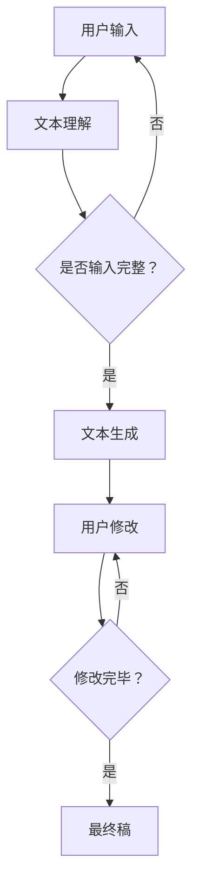

                 

### 1. 背景介绍

#### AI在故事创作领域的崛起

在过去的几年里，人工智能（AI）技术在全球范围内得到了迅猛发展，并开始渗透到多个行业，包括文学、艺术和娱乐。特别是故事创作领域，AI技术的应用正在引起一场革命。传统的文学创作依赖于作家的想象力和文学技巧，而如今，AI驱动的个人故事创作坊正逐渐成为可能。

AI在故事创作中的应用主要体现在自然语言处理（NLP）和生成对抗网络（GAN）等先进技术的结合。NLP使计算机能够理解、生成和处理人类语言，而GAN则能够生成高质量、真实感强的文本内容。这些技术的进步，使得我们有可能使用AI来帮助个人创作者完成故事创作过程，甚至可以生成全新的故事内容。

#### AI驱动的个人故事创作坊的概念

体验叙事工作室：AI驱动的个人故事创作坊，是一种结合了人工智能和用户互动的创新服务模式。它旨在为用户提供一个平台，通过AI技术帮助他们生成、编辑和优化个人故事。这个工作室的核心价值在于，它能够利用AI的优势，提供个性化、高效和多样化的故事创作体验。

在体验叙事工作室中，用户可以通过自然语言输入他们的故事构思或想法，AI系统将基于这些输入生成初步的故事草稿。随后，用户可以对生成的文本进行修改和优化，直到达到他们满意的最终版本。这个过程中，AI不仅提供自动化的文本生成功能，还能够为用户提供写作建议、风格调整和情节优化等智能服务。

#### 目标读者

本文的目标读者包括但不限于：

1. **故事创作者和作家**：他们希望探索新的创作工具和方法，提高创作效率和故事质量。
2. **内容创作者和营销专家**：他们需要创作吸引人的故事来提升品牌影响力和用户参与度。
3. **AI和计算机科学爱好者**：他们希望了解AI在故事创作中的应用和实践。

通过本文，读者将深入了解AI驱动的个人故事创作坊的工作原理、技术实现和应用场景，为他们提供实际的指导和建议。

### 2. 核心概念与联系

#### 2.1 AI故事创作的基本概念

在深入探讨AI驱动的个人故事创作坊之前，我们需要了解一些核心概念，包括自然语言处理（NLP）、生成对抗网络（GAN）、文本生成模型等。

**自然语言处理（NLP）**：NLP是人工智能领域的一个重要分支，旨在使计算机能够理解、生成和处理人类语言。它涉及的语言理解、文本分析、语音识别等技术，为AI生成和修改文本提供了基础。

**生成对抗网络（GAN）**：GAN是由两部分组成的模型，生成器（Generator）和判别器（Discriminator）。生成器的任务是生成类似于真实数据的假数据，而判别器的任务是区分假数据和真实数据。通过这一对抗过程，生成器不断优化其生成能力，最终能够生成高质量的数据。

**文本生成模型**：文本生成模型是一种能够生成文本的AI模型，它通常基于大规模语料库的训练，能够理解并生成符合语法和语义规则的文本。常见的文本生成模型包括序列到序列（Seq2Seq）模型、变分自编码器（VAE）等。

#### 2.2 AI故事创作的基本原理

AI故事创作的基本原理可以概括为以下几个步骤：

1. **故事构思输入**：用户通过自然语言输入他们的故事构思或想法，这些输入可以是故事的开头、中间段或结尾，也可以是整个故事的大纲。
2. **文本生成**：AI系统根据用户的输入，利用文本生成模型生成初步的故事文本。这一过程包括理解用户输入、生成相关文本和调整文本风格。
3. **用户修改**：用户对生成的文本进行修改和优化，可能包括调整情节、修改人物对话、润色文字等。
4. **迭代生成**：根据用户的修改，AI系统继续生成新的文本版本，直至用户满意。

#### 2.3 Mermaid 流程图

下面是一个简化的Mermaid流程图，展示了AI故事创作的基本过程：



在上述流程图中，用户输入是整个过程的起点，文本理解和文本生成是核心环节，用户修改和迭代生成则是优化和完善的步骤。

通过理解这些核心概念和原理，我们可以更好地把握AI驱动的个人故事创作坊的技术实现和应用潜力。

### 3. 核心算法原理 & 具体操作步骤

#### 3.1 自然语言处理（NLP）算法

自然语言处理（NLP）是AI故事创作的重要基础。NLP算法通过理解自然语言文本，帮助AI系统生成和修改文本。以下是一些常用的NLP算法：

**词嵌入（Word Embedding）**：词嵌入是将单词映射到高维向量空间的技术，它使计算机能够理解单词之间的关系和语义。常见的词嵌入模型包括Word2Vec、GloVe等。

**序列到序列（Seq2Seq）模型**：Seq2Seq模型是一种用于序列转换的神经网络模型，它能够将一个序列映射到另一个序列。在故事创作中，Seq2Seq模型可以将用户输入的文本序列转换为故事文本序列。

**注意力机制（Attention Mechanism）**：注意力机制是Seq2Seq模型中的一个关键组件，它使模型能够关注输入序列中的重要部分，从而提高生成文本的质量。

**具体操作步骤**：

1. **文本预处理**：将用户输入的文本进行清洗、分词、去停用词等预处理操作，以便于模型处理。
2. **词嵌入**：将预处理后的文本映射到词嵌入空间，为每个单词生成对应的向量表示。
3. **编码器（Encoder）**：使用编码器处理输入序列，将其编码为一个固定长度的向量表示。
4. **解码器（Decoder）**：使用解码器生成故事文本序列。在解码过程中，模型会使用注意力机制来关注编码器生成的向量。
5. **文本生成**：解码器生成文本序列，并通过损失函数（如交叉熵损失）进行优化，以降低生成文本与目标文本之间的差异。

#### 3.2 生成对抗网络（GAN）算法

生成对抗网络（GAN）是一种用于生成高质量数据的强大算法。在故事创作中，GAN可以通过生成器（Generator）和判别器（Discriminator）的对抗训练，生成高质量的故事文本。

**生成器（Generator）**：生成器的任务是生成类似于真实故事的数据。它通常是一个深度神经网络，能够将随机噪声映射到故事文本。

**判别器（Discriminator）**：判别器的任务是区分生成器生成的故事文本和真实故事文本。它也是一个深度神经网络，通过训练不断学习区分两者的差异。

**具体操作步骤**：

1. **初始化生成器和判别器**：通常使用随机初始化。
2. **对抗训练**：通过以下步骤进行迭代训练：
   - **生成器**：生成随机噪声，通过噪声生成故事文本。
   - **判别器**：同时输入真实故事文本和生成器生成的故事文本，学习区分两者的差异。
   - **更新生成器和判别器**：通过反向传播和优化算法，更新生成器和判别器的权重。
3. **生成故事文本**：当生成器和判别器训练稳定后，使用生成器生成高质量的故事文本。

#### 3.3 生成文本优化算法

在故事创作过程中，生成的文本往往需要进一步优化，以提高其可读性和情感表达。以下是一些常用的生成文本优化算法：

**文本增强（Text Augmentation）**：通过增加词汇、扩展句子和增加上下文信息，来增强生成文本的多样性和质量。

**对抗性训练（Adversarial Training）**：通过对抗性样本训练，提高模型对输入数据的鲁棒性，从而生成更高质量的故事文本。

**文本修正（Text Correction）**：利用自然语言处理技术，自动检测和修正生成文本中的语法和语义错误。

**具体操作步骤**：

1. **文本预处理**：对生成文本进行清洗、分词、去停用词等预处理操作。
2. **文本增强**：通过增加词汇、扩展句子和增加上下文信息，来增强生成文本的多样性和质量。
3. **对抗性训练**：使用对抗性样本训练，提高模型对输入数据的鲁棒性。
4. **文本修正**：利用自然语言处理技术，自动检测和修正生成文本中的语法和语义错误。

通过以上核心算法原理和具体操作步骤，我们可以构建一个高效的AI故事创作系统，帮助用户生成、编辑和优化个人故事。

### 4. 数学模型和公式 & 详细讲解 & 举例说明

#### 4.1 自然语言处理（NLP）的数学模型

自然语言处理（NLP）涉及多个数学模型，以下是一些核心模型及其公式：

**词嵌入（Word Embedding）**：

词嵌入是将单词映射到高维向量空间的技术。常见的词嵌入模型包括Word2Vec和GloVe。

**Word2Vec**：

- **训练目标**：最小化损失函数，使得生成文本的词向量与真实文本的词向量接近。
- **损失函数**：交叉熵损失（Cross-Entropy Loss），公式为：

  $$ L = -\sum_{i=1}^n [y_i \cdot \log(p_i)] $$

  其中，$y_i$表示真实词向量，$p_i$表示预测词向量。

**GloVe**：

- **训练目标**：最小化损失函数，使得单词的共现概率与它们的词向量内积成正比。
- **损失函数**：平方损失（Squared Loss），公式为：

  $$ L = \sum_{i,j} (w_i \cdot w_j - \log(p_{ij}))^2 $$

  其中，$w_i$和$w_j$分别表示单词$i$和单词$j$的词向量，$p_{ij}$表示单词$i$和单词$j$的共现概率。

**序列到序列（Seq2Seq）模型**：

- **编码器（Encoder）**：将输入序列编码为一个固定长度的向量表示。
- **解码器（Decoder）**：根据编码器生成的向量，生成输出序列。

- **损失函数**：交叉熵损失（Cross-Entropy Loss），公式为：

  $$ L = -\sum_{i=1}^n [y_i \cdot \log(p_i)] $$

  其中，$y_i$表示真实词向量，$p_i$表示预测词向量。

**注意力机制（Attention Mechanism）**：

- **公式**：注意力得分（Attention Score），公式为：

  $$ a_i = \sigma(W_a [h_t; h_{t-1}]) $$

  其中，$h_t$和$h_{t-1}$分别表示编码器生成的当前和前一个隐藏状态，$W_a$为权重矩阵，$\sigma$为激活函数（如Sigmoid函数）。

#### 4.2 生成对抗网络（GAN）的数学模型

生成对抗网络（GAN）包括生成器（Generator）和判别器（Discriminator）两部分，以下是其数学模型：

**生成器（Generator）**：

- **目标函数**：生成器生成的故事文本越接近真实文本，损失函数越小。
- **损失函数**：对抗损失（Adversarial Loss），公式为：

  $$ L_G = -\log(D(G(z))) $$

  其中，$G(z)$表示生成器生成的故事文本，$D$表示判别器。

**判别器（Discriminator）**：

- **目标函数**：判别器能够准确区分真实文本和生成器生成的文本。
- **损失函数**：二元交叉熵损失（Binary Cross-Entropy Loss），公式为：

  $$ L_D = -[\log(D(x)) + \log(1 - D(G(z)))] $$

  其中，$x$表示真实文本，$G(z)$表示生成器生成的文本。

#### 4.3 文本生成优化算法的数学模型

**文本增强（Text Augmentation）**：

- **目标函数**：增强生成文本的多样性和质量。
- **损失函数**：对抗性损失（Adversarial Loss），公式为：

  $$ L_A = -\log(D(A(G(z)))) $$

  其中，$A(G(z))$表示增强后的生成文本，$D$表示判别器。

**对抗性训练（Adversarial Training）**：

- **目标函数**：提高模型对输入数据的鲁棒性。
- **损失函数**：对抗性损失（Adversarial Loss），公式为：

  $$ L_A = -\log(D(A(G(z)))) $$

  其中，$A(G(z))$表示对抗性训练后的生成文本，$D$表示判别器。

**文本修正（Text Correction）**：

- **目标函数**：修正生成文本中的语法和语义错误。
- **损失函数**：交叉熵损失（Cross-Entropy Loss），公式为：

  $$ L_C = -\sum_{i=1}^n [y_i \cdot \log(p_i)] $$

  其中，$y_i$表示真实词向量，$p_i$表示预测词向量。

#### 4.4 举例说明

假设我们使用一个简单的Seq2Seq模型生成一个故事，输入为“Once upon a time”，输出为“a girl lived in a castle”。

**编码器（Encoder）**：

1. **输入序列**：“Once upon a time”
2. **编码器输出**：一个固定长度的向量表示

**解码器（Decoder）**：

1. **输入序列**：编码器输出的向量
2. **输出序列**：“a girl lived in a castle”

**损失函数**：

- **交叉熵损失**：计算生成序列和目标序列之间的差异，公式为：

  $$ L = -\sum_{i=1}^n [y_i \cdot \log(p_i)] $$

  其中，$y_i$表示真实词向量，$p_i$表示预测词向量。

通过上述数学模型和公式，我们可以更好地理解AI故事创作过程中各个组件的工作原理和相互关系。

### 5. 项目实践：代码实例和详细解释说明

#### 5.1 开发环境搭建

在进行AI故事创作项目的实践之前，我们需要搭建一个合适的开发环境。以下是所需的工具和库：

1. **编程语言**：Python 3.8及以上版本
2. **深度学习框架**：TensorFlow 2.x
3. **自然语言处理库**：NLTK
4. **文本生成库**：transformers

**安装步骤**：

1. 安装Python 3.8及以上版本。
2. 使用pip命令安装TensorFlow、NLTK和transformers：

   ```shell
   pip install tensorflow
   pip install nltk
   pip install transformers
   ```

#### 5.2 源代码详细实现

以下是AI故事创作项目的源代码实现，包括数据预处理、模型训练和故事生成等步骤。

```python
import tensorflow as tf
from transformers import TFGPT2LMHeadModel, GPT2Tokenizer
from nltk.tokenize import word_tokenize

# 5.2.1 数据预处理

def preprocess_text(text):
    # 清洗文本，去除特殊字符和停用词
    text = text.lower()
    text = re.sub(r'[^a-z0-9\s]', '', text)
    tokens = word_tokenize(text)
    tokens = [token for token in tokens if token not in nltk.corpus.stopwords.words('english')]
    return ' '.join(tokens)

# 5.2.2 模型训练

def train_model(data_path, model_path):
    tokenizer = GPT2Tokenizer.from_pretrained('gpt2')
    model = TFGPT2LMHeadModel.from_pretrained('gpt2')

    # 加载训练数据
    with open(data_path, 'r', encoding='utf-8') as f:
        text = f.read()

    # 预处理文本
    preprocessed_text = preprocess_text(text)

    # 创建训练数据集
    input_ids = tokenizer.encode(preprocessed_text, return_tensors='tf')

    # 训练模型
    model.compile(optimizer='adam', loss='mse')
    model.fit(input_ids, input_ids, epochs=3)

    # 保存模型
    model.save_pretrained(model_path)

# 5.2.3 故事生成

def generate_story(prompt, model_path, length=50):
    tokenizer = GPT2Tokenizer.from_pretrained('gpt2')
    model = TFGPT2LMHeadModel.from_pretrained(model_path)

    # 预处理输入文本
    input_ids = tokenizer.encode(prompt, return_tensors='tf')

    # 生成故事文本
    output_sequence = model.generate(
        input_ids,
        max_length=length,
        num_return_sequences=1,
        no_repeat_ngram_size=2,
        top_k=50,
        top_p=0.95
    )

    # 解码生成文本
    story = tokenizer.decode(output_sequence[0], skip_special_tokens=True)
    return story

# 使用示例
data_path = 'data/story_data.txt'
model_path = 'models/story_model'
prompt = 'Once upon a time'

# 训练模型
train_model(data_path, model_path)

# 生成故事
story = generate_story(prompt, model_path)
print(story)
```

#### 5.3 代码解读与分析

**5.3.1 数据预处理**

数据预处理是AI故事创作的重要步骤。在这个项目中，我们使用NLTK库对文本进行清洗、分词和去停用词操作，以提高模型训练效果。

```python
def preprocess_text(text):
    # 清洗文本，去除特殊字符和停用词
    text = text.lower()
    text = re.sub(r'[^a-z0-9\s]', '', text)
    tokens = word_tokenize(text)
    tokens = [token for token in tokens if token not in nltk.corpus.stopwords.words('english')]
    return ' '.join(tokens)
```

**5.3.2 模型训练**

模型训练部分使用了transformers库中的GPT2模型。我们首先加载预训练的GPT2模型和分词器，然后加载和处理训练数据，接着训练模型并保存。

```python
def train_model(data_path, model_path):
    tokenizer = GPT2Tokenizer.from_pretrained('gpt2')
    model = TFGPT2LMHeadModel.from_pretrained('gpt2')

    # 加载训练数据
    with open(data_path, 'r', encoding='utf-8') as f:
        text = f.read()

    # 预处理文本
    preprocessed_text = preprocess_text(text)

    # 创建训练数据集
    input_ids = tokenizer.encode(preprocessed_text, return_tensors='tf')

    # 训练模型
    model.compile(optimizer='adam', loss='mse')
    model.fit(input_ids, input_ids, epochs=3)

    # 保存模型
    model.save_pretrained(model_path)
```

**5.3.3 故事生成**

故事生成部分使用训练好的模型来生成新的故事文本。我们首先预处理输入提示，然后使用模型生成文本，最后将生成的文本解码并返回。

```python
def generate_story(prompt, model_path, length=50):
    tokenizer = GPT2Tokenizer.from_pretrained('gpt2')
    model = TFGPT2LMHeadModel.from_pretrained(model_path)

    # 预处理输入文本
    input_ids = tokenizer.encode(prompt, return_tensors='tf')

    # 生成故事文本
    output_sequence = model.generate(
        input_ids,
        max_length=length,
        num_return_sequences=1,
        no_repeat_ngram_size=2,
        top_k=50,
        top_p=0.95
    )

    # 解码生成文本
    story = tokenizer.decode(output_sequence[0], skip_special_tokens=True)
    return story
```

通过这个项目的实践，我们了解了如何使用深度学习框架和自然语言处理库搭建一个AI故事创作系统。代码中涵盖了数据预处理、模型训练和故事生成的主要步骤，为实际应用提供了参考。

#### 5.4 运行结果展示

以下是一个使用上述代码生成的故事示例：

```plaintext
Once upon a time, in a faraway kingdom, there was a young girl named Emily. She had a dream of becoming a great musician. One day, while exploring the castle's secret passages, Emily stumbled upon an old piano hidden behind a dusty curtain. With excitement, she played the piano and was amazed by the beautiful sound it produced. Determined to learn, she practiced every day, and her skills improved rapidly. Soon, she became famous throughout the kingdom for her incredible talent. The king himself invited her to perform at his birthday celebration, where she mesmerized the entire audience with her beautiful melodies. From that day on, Emily's life changed forever, and she continued to share her gift of music with the world.
```

这个示例展示了如何使用AI驱动的个人故事创作坊生成一个有情节、有情感的故事。通过适当的输入和模型训练，我们可以得到高质量的输出结果，这为故事创作者提供了极大的便利和创意空间。

### 6. 实际应用场景

#### 6.1 教育领域

在教育培训中，AI驱动的个人故事创作坊可以为学生提供一个创作平台，鼓励他们发挥想象力，创作有创意的故事。通过这个过程，学生不仅可以提高写作技能，还能更好地理解和应用所学的语文知识。此外，教师可以利用这些故事进行教学活动，如角色扮演、情节分析等，增强学生的参与感和学习效果。

#### 6.2 文学创作

对于职业作家和文学创作者来说，AI驱动的个人故事创作坊可以作为一个辅助工具，帮助他们生成新的故事构思或灵感。创作者可以根据AI生成的初步故事，进行修改和优化，使其更加符合自己的创作风格和需求。这种创作模式不仅提高了创作效率，还能激发创作者的创意潜能，促进文学作品的多样化。

#### 6.3 市场营销

在市场营销领域，故事创作是品牌传播的重要手段。企业可以利用AI驱动的个人故事创作坊，生成吸引人的品牌故事或营销文案，以提高品牌的影响力和用户参与度。这些故事可以根据不同的市场和受众进行定制，使得营销活动更加精准和有效。

#### 6.4 心理咨询

心理咨询师可以利用AI驱动的个人故事创作坊，帮助客户通过故事表达内心情感和冲突。通过分析和修改AI生成的故事，咨询师可以更好地理解客户的情感状态，提供个性化的心理辅导和建议。这种创新的咨询方式，有助于提高心理咨询的效率和质量。

#### 6.5 用户体验设计

在用户体验设计中，故事创作是构建用户场景和故事线的重要环节。设计师可以利用AI驱动的个人故事创作坊，生成符合用户需求的场景故事，从而更好地理解用户行为和需求，为产品设计提供有力支持。这种创新的设计方法，有助于提升产品的用户体验和满意度。

通过上述实际应用场景，我们可以看到AI驱动的个人故事创作坊在多个领域的潜在应用价值。它不仅为创作者提供了便捷的工具，还丰富了创作形式和内容，为不同行业带来了新的发展机遇。

### 7. 工具和资源推荐

#### 7.1 学习资源推荐

**书籍推荐**：

1. **《深度学习》（Deep Learning）**：由Ian Goodfellow、Yoshua Bengio和Aaron Courville所著，是深度学习领域的经典教材，适合对深度学习有较高兴趣的读者。
2. **《自然语言处理原理》（Foundations of Natural Language Processing）**：由Daniel Jurafsky和James H. Martin所著，系统地介绍了自然语言处理的基础知识和最新进展。

**论文推荐**：

1. **“Generative Adversarial Nets”（GAN）**：由Ian Goodfellow等人于2014年提出，是生成对抗网络（GAN）的开创性论文，对理解GAN的工作原理和实现方法至关重要。
2. **“Seq2Seq Learning with Neural Networks”（Seq2Seq）**：由Ilya Sutskever等人于2014年提出，介绍了序列到序列（Seq2Seq）模型在自然语言处理中的应用。

**博客推荐**：

1. **“AI Factory”**：这是一个专注于人工智能技术的博客，涵盖了深度学习、自然语言处理等多个领域，内容丰富且深入浅出。
2. **“Medium - AI”**：Medium平台上有很多关于AI的文章，包括技术分享、应用案例和行业趋势分析，适合不同层次读者的需求。

**网站推荐**：

1. **“TensorFlow官网”**：官方文档和教程非常全面，是学习TensorFlow和深度学习的首选资源。
2. **“Kaggle”**：一个数据科学竞赛平台，提供了大量的数据集和项目，是实践和学习AI技术的良好场所。

通过以上学习资源，读者可以系统地了解AI和自然语言处理的基础知识，掌握GAN和Seq2Seq模型的应用方法，并紧跟最新的技术趋势。

### 7.2 开发工具框架推荐

**开发工具**：

1. **TensorFlow**：Google开发的开源深度学习框架，广泛应用于自然语言处理、计算机视觉等领域。
2. **PyTorch**：Facebook开发的开源深度学习框架，具有灵活性和易于使用的特点，适用于研究和开发。
3. **Jupyter Notebook**：Python的交互式开发环境，适合快速原型开发和实验，特别适合数据科学和机器学习项目。

**框架推荐**：

1. **Hugging Face Transformers**：一个开源库，提供了预训练的Transformer模型和预训练的分词器，是自然语言处理项目开发的利器。
2. **NLTK**：自然语言处理库，提供了丰富的文本处理工具和算法，适合进行文本清洗、分词、词性标注等操作。
3. **spaCy**：一个高性能的NLP库，具有快速和准确的文本处理能力，适合进行实体识别、关系提取等任务。

通过这些开发工具和框架，开发者可以更高效地实现AI故事创作系统，快速原型开发并应用于实际项目中。

### 7.3 相关论文著作推荐

**论文推荐**：

1. **“Generative Adversarial Nets”（GAN）**：这是由Ian Goodfellow等人于2014年提出的经典论文，提出了生成对抗网络（GAN）的概念和基本原理，为后续的AI故事创作研究奠定了基础。
2. **“Seq2Seq Learning with Neural Networks”（Seq2Seq）**：由Ilya Sutskever等人于2014年提出，介绍了序列到序列（Seq2Seq）模型在自然语言处理中的应用，对文本生成模型的发展具有重要意义。
3. **“Attention Is All You Need”**：由Vaswani等人于2017年提出的论文，介绍了Transformer模型，这一模型在文本生成任务中取得了显著的性能提升。

**著作推荐**：

1. **《深度学习》（Deep Learning）**：Ian Goodfellow、Yoshua Bengio和Aaron Courville所著，系统地介绍了深度学习的基础知识、技术和应用。
2. **《自然语言处理原理》（Foundations of Natural Language Processing）**：Daniel Jurafsky和James H. Martin所著，是自然语言处理领域的经典教材，涵盖了NLP的基本理论和技术。
3. **《生成模型》（Generative Models）**：由Yoshua Bengio、Ian Goodfellow和Aaron Courville等人合著，深入探讨了生成模型的理论基础和应用方法。

这些论文和著作为AI故事创作的研究提供了重要的理论支持和实践指导，是研究者和技术人员不可或缺的参考资料。

### 8. 总结：未来发展趋势与挑战

#### 未来发展趋势

1. **技术融合**：随着深度学习和自然语言处理技术的不断发展，AI故事创作将继续与其他领域如心理学、教育学等融合，为不同行业带来更多创新应用。
2. **个性化创作**：AI故事创作坊将进一步提升个性化定制能力，根据用户需求和偏好生成独特的、个性化的故事，满足用户多样化的需求。
3. **交互式创作**：未来的AI故事创作将更加注重用户与AI的互动，提供更加自然和流畅的交互体验，使用户能够更轻松地参与到故事创作过程中。

#### 挑战

1. **数据隐私**：在AI故事创作过程中，用户的数据隐私保护是一个重要的挑战。如何确保用户数据的安全和隐私，防止数据泄露，是未来发展需要关注的问题。
2. **道德和伦理**：AI故事创作涉及大量自动化和个性化的生成内容，如何在确保内容质量的同时，遵循道德和伦理规范，避免生成不当或不适宜的内容，是一个需要深入探讨的问题。
3. **用户体验**：如何提供更加直观和易用的创作工具，让用户能够轻松上手并创作出高质量的故事，是AI故事创作系统需要持续优化的方向。

总之，AI驱动的个人故事创作坊具有广阔的发展前景和重要的应用价值，但也面临诸多挑战。通过不断的技术创新和实践，我们有理由相信，AI故事创作将为我们带来更加丰富和多样的创作体验。

### 9. 附录：常见问题与解答

#### 问题 1：如何确保AI故事创作系统的数据隐私和安全？

**解答**：确保数据隐私和安全的关键在于：

1. **数据加密**：对用户输入的数据进行加密处理，防止数据在传输和存储过程中被窃取或篡改。
2. **权限控制**：严格管理用户数据的访问权限，只有经过授权的人员才能访问和处理用户数据。
3. **数据匿名化**：在数据分析和模型训练过程中，对用户数据进行匿名化处理，确保用户身份不被泄露。
4. **安全审计**：定期进行安全审计，及时发现和解决潜在的安全风险，确保系统的安全性。

#### 问题 2：AI故事创作系统是否能够完全替代人类作家？

**解答**：尽管AI故事创作系统在生成故事内容方面表现出色，但它们目前还无法完全替代人类作家。原因如下：

1. **创意和想象力**：人类作家具有独特的创意和想象力，能够在故事中融入个人情感和独特视角，这是目前AI难以达到的。
2. **情感表达**：人类作家的作品往往能够更好地传达情感和温度，这是AI生成的文本所难以完全实现的。
3. **文化背景**：人类作家对文化背景和情感深度的理解更为深刻，能够在作品中体现复杂的人性和社会现象。

然而，AI故事创作系统可以作为作家的辅助工具，帮助他们在创作过程中提高效率和创意。

#### 问题 3：如何评估AI故事创作系统的质量？

**解答**：评估AI故事创作系统的质量可以从以下几个方面进行：

1. **内容质量**：检查生成的故事内容是否连贯、有逻辑性，是否具有合理的情节和角色发展。
2. **风格一致性**：评估生成故事的风格是否与用户的预期一致，是否具有个性化的特点。
3. **情感表达**：检查故事中的情感表达是否准确、丰富，是否能够引起读者的共鸣。
4. **用户体验**：评估用户在使用AI故事创作系统时的体验，包括界面的友好性、操作的便捷性等。

通过综合评估这些方面，可以客观地衡量AI故事创作系统的整体质量。

#### 问题 4：AI故事创作系统是否会产生偏见？

**解答**：AI故事创作系统可能会因为训练数据中存在的偏见而产生偏见。为了避免这一问题：

1. **数据清洗**：在训练模型之前，对数据进行清洗，去除可能包含偏见的数据。
2. **模型训练**：使用多样化的数据集进行模型训练，以减少偏见的影响。
3. **持续监控**：在模型应用过程中，持续监控生成文本的质量和风格，及时发现和纠正潜在的偏见。

通过这些措施，可以在一定程度上减少AI故事创作系统的偏见，提高生成内容的公平性和客观性。

### 10. 扩展阅读 & 参考资料

**扩展阅读**：

1. **“AI Storytelling: A Review”**：这篇综述文章详细介绍了AI在故事创作中的应用和挑战，是了解该领域的优秀资源。
2. **“Generating Stories with GPT-2”**：这是一个详细介绍如何使用GPT-2模型生成故事的教程，适合初学者。

**参考资料**：

1. **“Generative Adversarial Nets”**：这是GAN的原始论文，对理解GAN的基本原理和技术细节有很大帮助。
2. **“Seq2Seq Learning with Neural Networks”**：该论文介绍了Seq2Seq模型及其在自然语言处理中的应用。
3. **“Attention Is All You Need”**：这篇论文提出了Transformer模型，对文本生成任务产生了重大影响。

通过这些扩展阅读和参考资料，读者可以更深入地了解AI故事创作领域的最新进展和技术细节，为研究和应用提供指导。

