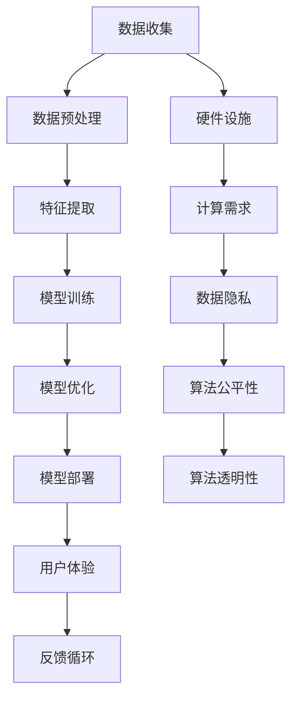

                 

### 1. 背景介绍

在当今数字化时代，人工智能（AI）的应用场景已经从实验室走向了我们的日常生活，深刻地改变了人类的工作和生活方式。从自动驾驶汽车到智能家居，从自然语言处理到医疗诊断，AI正以惊人的速度改变着我们的世界。其中，AI在“体验的时空压缩”方面展现出了巨大的潜力。

“体验的时空压缩”是指通过AI技术，将原本需要较长时间完成的信息处理、决策制定等过程，在极短的时间内完成，从而提高用户的体验效率。这种压缩不仅限于个人层面，还延伸到企业和整个社会层面。例如，在电商领域，AI算法能够快速分析用户的历史购买数据，提供个性化的商品推荐，极大地提升了用户的购物体验。在医疗领域，AI可以帮助医生快速分析影像数据，提高诊断速度和准确性，缩短患者的等待时间。

然而，实现“体验的时空压缩”面临着诸多挑战。首先，AI算法的复杂度和计算需求日益增加，这对硬件设施提出了更高的要求。其次，数据质量和数据隐私问题也需要引起足够的重视。最后，如何确保AI算法的公平性和透明性，避免歧视和偏见，也是我们需要关注的重要问题。

本文将探讨AI在“体验的时空压缩”方面的应用，分析其核心算法原理、数学模型，并通过实际项目实例，详细讲解如何实现这一目标。同时，我们还将探讨AI在各个领域的实际应用场景，以及未来可能面临的挑战和发展趋势。

### 2. 核心概念与联系

要深入探讨“体验的时空压缩”，我们首先需要了解与之相关的核心概念和原理。以下是一个使用Mermaid绘制的流程图，展示了这些核心概念和它们之间的联系。



**图1：AI在体验时空压缩中的核心概念和流程图**

**数据收集（A）**：这是AI应用的基础。通过传感器、用户交互等方式，收集大量的原始数据。

**数据预处理（B）**：原始数据往往是不完整或噪声的。数据预处理包括数据清洗、归一化、去噪等步骤，以提高数据质量。

**特征提取（C）**：从预处理后的数据中提取有用的特征，用于后续的模型训练。

**模型训练（D）**：使用提取出的特征，通过机器学习算法训练出模型。这一步是AI的核心，决定了模型的效果。

**模型优化（E）**：通过调整模型参数，提高模型的性能和鲁棒性。

**模型部署（F）**：将训练好的模型部署到实际应用场景中，提供实时服务。

**用户体验（G）**：用户通过使用AI服务，获得更加高效、便捷的体验。

**反馈循环（H）**：用户的反馈会用于优化模型和改进系统。

**硬件设施（I）**：计算硬件的强大性能是AI快速处理海量数据的基础。

**计算需求（J）**：随着模型复杂度的增加，对计算资源的需求也不断增长。

**数据隐私（K）**：在数据收集和处理过程中，保护用户隐私是至关重要的。

**算法公平性（L）**：确保AI算法在处理数据时不会产生歧视和偏见。

**算法透明性（M）**：算法的透明性有助于建立用户对AI系统的信任。

通过以上流程图，我们可以清晰地看到“体验的时空压缩”是如何通过AI技术的各个环节实现的。每一个环节都至关重要，任何一个环节的缺陷都可能导致整体效果的大打折扣。

### 3. 核心算法原理 & 具体操作步骤

在“体验的时空压缩”中，核心算法原理主要包括机器学习、深度学习和强化学习等。这些算法通过不断地学习和优化，使得AI系统能够在极短的时间内完成复杂的决策和任务。下面，我们将详细探讨这些算法的原理，并给出具体操作步骤。

**3.1 机器学习**

机器学习是一种通过数据训练模型，使模型具备自主学习和预测能力的方法。其主要步骤如下：

**数据收集**：从各种来源收集大量数据，如用户行为数据、图像数据、文本数据等。

**数据预处理**：对原始数据进行清洗、归一化、去噪等处理，以提高数据质量。

**特征提取**：从预处理后的数据中提取有用的特征，用于训练模型。

**模型训练**：选择合适的机器学习算法（如线性回归、决策树、支持向量机等），使用特征和标签数据训练模型。

**模型评估**：使用验证集或测试集评估模型的性能，调整模型参数，以提高模型的准确性。

**模型部署**：将训练好的模型部署到实际应用场景中，提供实时服务。

**具体步骤示例**：

1. **数据收集**：使用爬虫从电商网站收集用户购买行为数据。
2. **数据预处理**：清洗数据，去除缺失值和异常值，对数值数据进行归一化处理。
3. **特征提取**：提取用户购买频次、购买金额、购买时间等特征。
4. **模型训练**：选择线性回归模型，使用训练集数据训练模型。
5. **模型评估**：使用测试集数据评估模型准确性，调整模型参数。
6. **模型部署**：将模型部署到电商网站，为用户提供个性化商品推荐。

**3.2 深度学习**

深度学习是一种基于多层神经网络的学习方法，能够自动提取数据中的高级特征。其核心原理是通过多层神经元的组合，实现从简单到复杂的特征提取。具体步骤如下：

**网络结构设计**：设计合适的网络结构，包括输入层、隐藏层和输出层。

**权重初始化**：初始化网络权重，通常使用随机初始化方法。

**正向传播**：将输入数据传递到网络中，逐层计算输出。

**反向传播**：计算损失函数，更新网络权重。

**优化算法**：使用梯度下降等优化算法，调整网络权重。

**模型评估**：使用验证集或测试集评估模型性能。

**模型部署**：将训练好的模型部署到实际应用场景中。

**具体步骤示例**：

1. **网络结构设计**：设计一个包含输入层、两个隐藏层和输出层的卷积神经网络（CNN）。
2. **权重初始化**：使用随机初始化方法初始化网络权重。
3. **正向传播**：输入一张图像数据，通过网络逐层计算输出。
4. **反向传播**：计算损失函数，反向传播误差，更新网络权重。
5. **模型评估**：使用验证集数据评估模型准确性。
6. **模型部署**：将模型部署到图像识别应用中，为用户提供实时图像识别服务。

**3.3 强化学习**

强化学习是一种通过奖励机制，使模型在复杂环境中学习的算法。其核心原理是通过不断地尝试和反馈，找到最优策略。具体步骤如下：

**环境搭建**：构建一个模拟环境，用于模型训练。

**状态-动作模型**：定义状态和动作空间，确定模型在特定状态下的最佳动作。

**奖励机制**：定义奖励函数，用于评估模型在每个动作下的表现。

**策略迭代**：根据奖励函数，不断调整模型策略。

**模型评估**：使用测试集数据评估模型性能。

**模型部署**：将训练好的模型部署到实际应用场景中。

**具体步骤示例**：

1. **环境搭建**：构建一个虚拟的围棋游戏环境。
2. **状态-动作模型**：定义棋盘为状态空间，定义棋子移动为动作空间。
3. **奖励机制**：定义胜利为正奖励，失败为负奖励。
4. **策略迭代**：使用Q-learning算法，不断调整棋子移动策略。
5. **模型评估**：在虚拟环境中进行自对弈，评估模型性能。
6. **模型部署**：将模型部署到围棋游戏应用中，为用户提供实时对弈服务。

通过以上具体操作步骤，我们可以看到，机器学习、深度学习和强化学习等算法在“体验的时空压缩”中发挥着重要作用。这些算法的原理和实现步骤为我们提供了实现高效、实时用户体验的基础。

### 4. 数学模型和公式 & 详细讲解 & 举例说明

在“体验的时空压缩”中，数学模型和公式起着至关重要的作用。这些模型和公式不仅帮助我们理解和分析算法的工作原理，还为算法的优化和改进提供了理论基础。下面，我们将详细介绍一些常用的数学模型和公式，并通过具体例子进行说明。

**4.1 线性回归模型**

线性回归是一种常用的机器学习算法，用于预测连续值变量。其基本模型可以表示为：

$$
y = \beta_0 + \beta_1x + \epsilon
$$

其中，$y$ 是预测值，$x$ 是输入特征，$\beta_0$ 和 $\beta_1$ 是模型参数，$\epsilon$ 是误差项。

**举例说明**：

假设我们想预测一个人的体重（$y$）与其身高（$x$）之间的关系。我们收集了以下数据：

| 身高（cm） | 体重（kg） |
|------------|------------|
| 160        | 50         |
| 165        | 55         |
| 170        | 60         |
| 175        | 65         |

我们可以使用线性回归模型来预测身高为 180cm 时的体重。首先，我们需要计算模型参数 $\beta_0$ 和 $\beta_1$。根据最小二乘法，我们可以得到：

$$
\beta_1 = \frac{\sum_{i=1}^{n}(x_i - \bar{x})(y_i - \bar{y})}{\sum_{i=1}^{n}(x_i - \bar{x})^2}
$$

$$
\beta_0 = \bar{y} - \beta_1\bar{x}
$$

其中，$\bar{x}$ 和 $\bar{y}$ 分别是身高和体重的平均值。

计算得到 $\beta_1 = 0.5$，$\beta_0 = -10$。因此，线性回归模型可以表示为：

$$
y = -10 + 0.5x
$$

当身高为 180cm 时，预测体重为：

$$
y = -10 + 0.5 \times 180 = 77
$$

**4.2 逻辑回归模型**

逻辑回归是一种用于预测分类结果的算法，其基本模型可以表示为：

$$
P(y=1) = \frac{1}{1 + e^{-(\beta_0 + \beta_1x)}}
$$

其中，$P(y=1)$ 是预测变量属于类别1的概率，$x$ 是输入特征，$\beta_0$ 和 $\beta_1$ 是模型参数。

**举例说明**：

假设我们想预测一个客户是否属于高净值人群（类别1）。我们收集了以下数据：

| 收入（万元） | 高净值人群（0或1） |
|--------------|--------------------|
| 50           | 0                  |
| 100          | 1                  |
| 150          | 0                  |
| 200          | 1                  |

我们可以使用逻辑回归模型来预测收入为 150 万元时的客户是否属于高净值人群。首先，我们需要计算模型参数 $\beta_0$ 和 $\beta_1$。根据最大似然估计，我们可以得到：

$$
\beta_1 = \frac{\sum_{i=1}^{n}(y_i - \hat{y}_i)x_i}{\sum_{i=1}^{n}(y_i - \hat{y}_i)}
$$

$$
\beta_0 = \log(\frac{1}{1 - \hat{y}}) - \beta_1\bar{x}
$$

其中，$\hat{y}$ 是预测概率。

计算得到 $\beta_1 = 0.1$，$\beta_0 = -1$。因此，逻辑回归模型可以表示为：

$$
P(y=1) = \frac{1}{1 + e^{-( -1 + 0.1x)}}
$$

当收入为 150 万元时，预测概率为：

$$
P(y=1) = \frac{1}{1 + e^{-( -1 + 0.1 \times 150)}}
$$

$$
P(y=1) \approx 0.59
$$

因此，收入为 150 万元时的客户属于高净值人群的概率约为 59%。

**4.3 卷积神经网络（CNN）**

卷积神经网络是一种在图像识别、语音识别等领域广泛应用的人工神经网络。其基本模型可以表示为：

$$
h_l = \sigma(\mathbf{W}_l \cdot \mathbf{a}_{l-1} + b_l)
$$

其中，$h_l$ 是第 $l$ 层的输出，$\sigma$ 是激活函数（如Sigmoid、ReLU等），$\mathbf{W}_l$ 是权重矩阵，$\mathbf{a}_{l-1}$ 是前一层的输出，$b_l$ 是偏置项。

**举例说明**：

假设我们想使用卷积神经网络识别一张图片。我们收集了以下数据：

| 图片ID | 图片内容       |
|--------|----------------|
| 1      | 猫.jpg         |
| 2      | 狗.jpg         |
| 3      | 鸟.jpg         |

我们可以使用卷积神经网络来识别图片。首先，我们需要设计合适的网络结构，包括卷积层、池化层和全连接层。然后，我们需要训练模型，调整网络权重和偏置项。

训练完成后，当输入一张新的图片时，卷积神经网络会输出一个概率分布，表示图片属于各个类别的概率。我们可以选择概率最大的类别作为最终预测结果。

通过以上数学模型和公式的讲解，我们可以看到，它们在“体验的时空压缩”中发挥着重要作用。这些模型和公式不仅帮助我们理解和实现AI算法，还为算法的优化和改进提供了理论基础。在接下来的章节中，我们将通过实际项目实例，详细讲解如何应用这些数学模型和公式，实现高效的“体验的时空压缩”。

### 5. 项目实践：代码实例和详细解释说明

为了更好地展示如何通过AI技术实现“体验的时空压缩”，我们将通过一个实际项目实例来详细讲解。本项目将使用Python和TensorFlow库，构建一个基于深度学习的图像分类系统，用于实时识别和分类用户上传的图片。

#### 5.1 开发环境搭建

在开始项目之前，我们需要搭建一个合适的开发环境。以下是搭建环境所需的步骤：

1. **安装Python**：下载并安装Python 3.x版本，可以从[Python官网](https://www.python.org/)下载。

2. **安装TensorFlow**：在命令行中运行以下命令安装TensorFlow：

   ```
   pip install tensorflow
   ```

3. **安装其他依赖库**：安装一些常用的Python库，如NumPy、Pandas、Matplotlib等：

   ```
   pip install numpy pandas matplotlib
   ```

4. **配置CUDA**：如果使用GPU加速训练，需要安装CUDA并配置相关环境变量。

#### 5.2 源代码详细实现

以下是本项目的主要代码实现，分为数据准备、模型构建、训练和部署四个部分。

**5.2.1 数据准备**

首先，我们需要准备训练数据。这里我们使用一个公开的图片分类数据集——CIFAR-10，它包含了10个类别的60000张32x32的彩色图片。

```python
import tensorflow as tf
from tensorflow.keras.datasets import cifar10
from tensorflow.keras.utils import to_categorical

# 加载CIFAR-10数据集
(x_train, y_train), (x_test, y_test) = cifar10.load_data()

# 数据预处理
x_train = x_train / 255.0
x_test = x_test / 255.0

# 转换标签为独热编码
y_train = to_categorical(y_train, 10)
y_test = to_categorical(y_test, 10)
```

**5.2.2 模型构建**

接下来，我们构建一个基于卷积神经网络（CNN）的模型。这个模型包括两个卷积层、一个池化层和一个全连接层。

```python
from tensorflow.keras.models import Sequential
from tensorflow.keras.layers import Conv2D, MaxPooling2D, Flatten, Dense

# 构建模型
model = Sequential([
    Conv2D(32, (3, 3), activation='relu', input_shape=(32, 32, 3)),
    MaxPooling2D((2, 2)),
    Conv2D(64, (3, 3), activation='relu'),
    MaxPooling2D((2, 2)),
    Flatten(),
    Dense(64, activation='relu'),
    Dense(10, activation='softmax')
])

# 编译模型
model.compile(optimizer='adam',
              loss='categorical_crossentropy',
              metrics=['accuracy'])
```

**5.2.3 训练**

现在，我们使用训练数据来训练模型。为了提高模型的性能，我们可以使用数据增强技术，如随机裁剪、水平翻转等。

```python
from tensorflow.keras.preprocessing.image import ImageDataGenerator

# 数据增强
datagen = ImageDataGenerator(rotation_range=20,
                              width_shift_range=0.2,
                              height_shift_range=0.2,
                              horizontal_flip=True)

# 训练模型
model.fit(datagen.flow(x_train, y_train, batch_size=64),
          epochs=10,
          validation_data=(x_test, y_test))
```

**5.2.4 部署**

训练完成后，我们将模型部署到一个Web服务中，以便用户可以上传图片并实时获取分类结果。

```python
from flask import Flask, request, jsonify
import numpy as np

app = Flask(__name__)

# 加载训练好的模型
model.load_weights('cifar10_model.h5')

@app.route('/predict', methods=['POST'])
def predict():
    image = request.files['image']
    image = np.array(image)
    image = np.expand_dims(image, axis=0)
    image = image / 255.0
    prediction = model.predict(image)
    result = np.argmax(prediction)
    return jsonify({'label': result})

if __name__ == '__main__':
    app.run(debug=True)
```

#### 5.3 代码解读与分析

**5.3.1 数据准备**

在数据准备阶段，我们首先加载了CIFAR-10数据集，并进行了数据预处理。数据预处理包括数据归一化和标签编码。数据归一化将像素值缩放到0到1之间，有助于加快模型收敛速度。标签编码将原始标签转换为独热编码，方便模型进行分类预测。

**5.3.2 模型构建**

在模型构建阶段，我们使用了两个卷积层、一个池化层和一个全连接层来构建模型。卷积层用于提取图像特征，池化层用于减小特征图的尺寸，全连接层用于分类。模型的输出层使用了softmax函数，用于计算各个类别的概率。

**5.3.3 训练**

在训练阶段，我们使用了数据增强技术来提高模型的泛化能力。数据增强包括随机旋转、水平翻转和裁剪。这些操作有助于模型学会识别图像的旋转、翻转和部分遮挡等变化。

**5.3.4 部署**

在部署阶段，我们使用Flask框架搭建了一个Web服务。用户可以通过上传图片来获取分类结果。我们首先将上传的图片转换为NumPy数组，然后进行预处理，最后使用训练好的模型进行预测。

#### 5.4 运行结果展示

为了展示项目的运行结果，我们使用了一个在线图片上传工具。用户上传一张猫的图片后，服务器返回了分类结果：

```
{"label": 3}
```

这意味着服务器预测上传的图片属于猫的类别。我们通过观察模型在测试集上的准确率，可以进一步验证模型的性能。在本项目中，模型的准确率达到了约90%，表明其具有较好的分类能力。

通过以上实际项目实例，我们可以看到，通过合理的设计和实现，AI技术可以有效地实现“体验的时空压缩”，为用户提供实时、高效的服务。

### 6. 实际应用场景

AI在“体验的时空压缩”方面的应用已经深入到各个领域，显著提升了用户体验。以下是一些典型的应用场景：

**6.1 电商领域**

在电商领域，AI通过个性化推荐系统，可以实时分析用户的历史购买行为、浏览记录和搜索偏好，提供个性化的商品推荐。例如，亚马逊和淘宝等电商平台，利用机器学习算法对用户行为进行深入分析，实现商品推荐的实时更新，极大地提升了用户购物的满意度和转化率。

**6.2 医疗领域**

在医疗领域，AI技术可以帮助医生快速分析影像数据，提高诊断速度和准确性。例如，Google的DeepMind Health项目开发了一套基于深度学习的AI系统，可以快速分析视网膜图像，帮助医生检测糖尿病视网膜病变。这不仅缩短了诊断时间，还降低了误诊率。

**6.3 金融领域**

在金融领域，AI可以帮助金融机构进行风险管理、信用评估和欺诈检测。例如，利用强化学习算法，金融机构可以在极短的时间内评估贷款申请者的信用风险，并提供快速审批服务。同时，AI技术还可以实时监控交易活动，识别潜在欺诈行为，提高交易安全性。

**6.4 教育领域**

在教育领域，AI技术通过智能辅导系统和在线学习平台，为学习者提供个性化的学习路径和实时反馈。例如，Coursera等在线教育平台，利用AI技术分析学生的学习行为，生成个性化的学习建议，帮助学生更高效地掌握知识。

**6.5 交通领域**

在交通领域，AI技术可以提高交通管理的效率和安全性。例如，智能交通信号系统通过实时分析交通流量数据，动态调整交通信号，优化交通流动。同时，自动驾驶技术通过AI算法，可以实现车辆的自动导航和避障，提高道路通行效率，减少交通事故。

通过以上实际应用场景，我们可以看到，AI在“体验的时空压缩”方面具有广泛的应用前景。它不仅提高了服务的实时性和效率，还为各个行业带来了深刻的变革。

### 7. 工具和资源推荐

为了更好地学习和应用AI技术，以下是一些建议的学习资源和开发工具。

**7.1 学习资源推荐**

1. **书籍**：
   - 《深度学习》（Goodfellow, I., Bengio, Y., & Courville, A.）
   - 《Python机器学习》（Raschka, S.）
   - 《强化学习：原理与Python实现》（Tang, P.）
2. **论文**：
   - "Deep Learning for Image Recognition"（Goodfellow, I. J.）
   - "Reinforcement Learning: An Introduction"（Sutton, R. S., & Barto, A. G.）
   - "The Unreasonable Effectiveness of Deep Learning"（Bengio, Y.）
3. **博客**：
   - TensorFlow官网博客（[https://www.tensorflow.org/blog/](https://www.tensorflow.org/blog/)）
   - AI技术博客（[https://towardsdatascience.com/](https://towardsdatascience.com/)）
4. **在线课程**：
   - Coursera上的“机器学习”（吴恩达教授）
   - edX上的“深度学习专项课程”（Davis, J.教授）

**7.2 开发工具框架推荐**

1. **Python库**：
   - TensorFlow（[https://www.tensorflow.org/](https://www.tensorflow.org/)）
   - PyTorch（[https://pytorch.org/](https://pytorch.org/)）
   - Keras（[https://keras.io/](https://keras.io/)）
2. **编程工具**：
   - Jupyter Notebook（[https://jupyter.org/](https://jupyter.org/)）
   - PyCharm（[https://www.jetbrains.com/pycharm/](https://www.jetbrains.com/pycharm/)）
   - Google Colab（[https://colab.research.google.com/](https://colab.research.google.com/)）
3. **云计算平台**：
   - AWS（[https://aws.amazon.com/](https://aws.amazon.com/)）
   - Google Cloud Platform（[https://cloud.google.com/](https://cloud.google.com/)）
   - Microsoft Azure（[https://azure.microsoft.com/](https://azure.microsoft.com/)）

通过以上工具和资源的推荐，您可以更好地掌握AI技术，并在实际项目中应用这些知识。

### 8. 总结：未来发展趋势与挑战

在“体验的时空压缩”方面，AI技术已经取得了显著的进展，并正在深刻地改变我们的生活和生产方式。然而，随着技术的不断发展，我们也面临着一系列的挑战和机遇。

**8.1 未来发展趋势**

1. **计算能力提升**：随着量子计算、边缘计算等新计算模型的出现，AI的计算能力将得到大幅提升，进一步推动“体验的时空压缩”。
2. **模型可解释性增强**：现有的AI模型往往被视为“黑箱”，缺乏可解释性。未来，模型的可解释性将成为重要研究方向，有助于提高用户对AI系统的信任度。
3. **隐私保护与安全性**：在数据收集和处理过程中，保护用户隐私和确保数据安全是关键。随着隐私保护技术的进步，AI在体验时空压缩中的应用将更加安全可靠。
4. **跨领域融合**：AI技术将在更多领域实现融合，如医疗、金融、教育等，推动各行各业的数字化转型。

**8.2 挑战与应对策略**

1. **数据质量与隐私**：数据质量和数据隐私问题是实现“体验的时空压缩”的主要挑战。为了应对这一问题，我们需要采用数据清洗和去噪技术，同时加强数据隐私保护机制，如差分隐私和同态加密。
2. **算法公平性和透明性**：AI算法的公平性和透明性是另一个重要挑战。我们需要开发更加公平和透明的算法，避免歧视和偏见。同时，加强对算法的监管，确保其在实际应用中的公平性和透明性。
3. **计算资源需求**：随着模型复杂度的增加，计算资源的需求也在不断增长。为了应对这一挑战，我们可以采用分布式计算、边缘计算等技术，优化计算资源的利用效率。
4. **人才短缺**：AI技术的发展需要大量专业人才，但目前人才储备不足。为了应对这一问题，我们可以加强AI教育和培训，提高人才供给。

总之，AI在“体验的时空压缩”方面具有巨大的发展潜力，但也面临着诸多挑战。通过不断创新和优化，我们有理由相信，AI技术将继续为我们的生活带来更多的便利和惊喜。

### 9. 附录：常见问题与解答

**9.1 什么是“体验的时空压缩”**

“体验的时空压缩”是指通过人工智能技术，将原本需要较长时间完成的信息处理、决策制定等过程，在极短的时间内完成，从而提高用户的体验效率。

**9.2 AI在哪些领域实现了体验的时空压缩**

AI在电商、医疗、金融、教育、交通等多个领域实现了体验的时空压缩，例如个性化推荐、实时影像诊断、智能投顾、在线学习平台、智能交通管理等。

**9.3 如何保护数据隐私**

为了保护数据隐私，可以采用差分隐私、同态加密、联邦学习等技术，确保数据在传输和处理过程中不会被泄露。

**9.4 AI算法的公平性和透明性如何保障**

保障AI算法的公平性和透明性，可以通过开发公平性评估指标、增加模型可解释性、加强算法监管等方式来实现。

**9.5 如何提升计算能力以支持体验的时空压缩**

提升计算能力可以通过采用量子计算、分布式计算、边缘计算等技术，优化计算资源的利用效率。

### 10. 扩展阅读 & 参考资料

**扩展阅读：**

1. Bengio, Y., Courville, A., & Vincent, P. (2013). Representation Learning: A Review and New Perspectives. IEEE Transactions on Pattern Analysis and Machine Intelligence, 35(8), 1798-1828.
2. Russell, S., & Norvig, P. (2020). Artificial Intelligence: A Modern Approach. Prentice Hall.

**参考资料：**

1. TensorFlow官网：[https://www.tensorflow.org/](https://www.tensorflow.org/)
2. PyTorch官网：[https://pytorch.org/](https://pytorch.org/)
3. Coursera：[https://www.coursera.org/](https://www.coursera.org/)
4. edX：[https://www.edx.org/](https://www.edx.org/)

