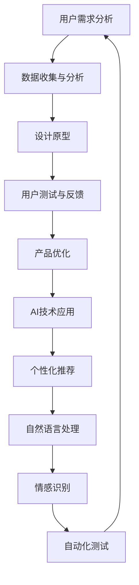

                 

### 1. 背景介绍

在数字化时代，用户体验（UX）设计的重要性日益凸显。随着互联网、移动设备和智能设备的普及，用户对产品的体验要求越来越高。为了满足这些需求，设计师们不断创新和拓展设计领域，其中，体验设计师（Experience Designer）这一角色逐渐崭露头角。

体验设计师是致力于提升用户在使用产品过程中整体体验的职业。他们的职责不仅包括设计产品的界面和交互，还要关注用户的心理感受、情感反应以及长期使用过程中的持续体验。与传统的UI/UX设计师相比，体验设计师更注重用户的整个体验流程，从用户接触产品的第一个时刻到最后一次使用，确保每个环节都给用户带来愉悦和满足。

在AI时代，体验设计师的角色变得更加重要。AI技术的快速发展不仅改变了产品的设计方式，还极大地丰富了用户体验。例如，AI驱动的个性化推荐系统能够根据用户的喜好和行为习惯，提供定制化的内容和服务；AI交互技术如语音助手和聊天机器人，让用户与产品之间的沟通更加自然和高效。

此外，AI还帮助设计师更好地理解用户需求，通过数据分析和机器学习技术，设计师可以获取关于用户行为、情感反应和偏好等方面的详细信息，从而优化产品设计，提高用户体验。在这个过程中，体验设计师需要具备跨学科的知识和技能，包括心理学、人机交互、人工智能等，以便更好地利用AI技术提升用户体验。

总的来说，随着AI技术的不断进步，体验设计师在产品开发中的地位和影响力日益增强。他们不仅要具备设计技能，还要紧跟技术发展趋势，不断创新和优化用户体验，以适应不断变化的市场需求。

### 2. 核心概念与联系

#### 2.1. 用户体验与体验设计的定义

用户体验（User Experience，简称UX）是指用户在使用产品或服务过程中所获得的总体感受。这个定义涵盖了用户在使用过程中的情感、认知、行为等多个方面。用户体验不仅仅是产品功能的实现，更包括用户在使用过程中所感受到的愉悦、满足、困惑等情感体验。

体验设计（Experience Design）则是为了提升用户体验而进行的设计活动。它不仅关注产品的界面和交互设计，更关注用户在整个使用流程中的体验，包括用户在接触产品前、使用过程中以及使用后的所有体验。体验设计的核心目标是确保用户在使用产品时能够获得愉悦、高效、有意义的体验。

#### 2.2. 体验设计师的职责与技能

体验设计师的职责可以概括为以下几个方面：

- **需求分析**：通过用户调研、数据分析等方式，深入了解用户的需求和痛点，为产品设计提供依据。
- **流程设计**：设计产品的整体使用流程，确保用户能够顺畅地完成各项操作。
- **界面设计**：设计产品的用户界面，使其美观、易用、符合用户习惯。
- **交互设计**：设计产品与用户之间的交互方式，使其自然、流畅、高效。
- **测试与优化**：通过用户测试、数据分析等方法，不断优化产品设计和用户体验。

为了完成上述职责，体验设计师需要具备以下技能：

- **用户研究**：能够进行用户调研、用户访谈、用户测试等，获取关于用户需求和行为的数据。
- **设计工具**：熟练使用各种设计工具，如Sketch、Adobe XD、Figma等。
- **数据分析**：能够使用数据分析工具，如Google Analytics、Tableau等，从数据中提取用户行为和趋势。
- **人机交互知识**：了解人机交互的基本原理，能够设计出符合用户习惯的交互方式。
- **心理学知识**：具备一定的心理学知识，能够理解用户的心理和行为。

#### 2.3. 体验设计与AI技术的联系

在AI时代，体验设计师需要与AI技术紧密合作，以提升用户体验。以下是体验设计与AI技术之间的几个关键联系：

- **个性化推荐**：AI可以帮助体验设计师通过数据分析和机器学习技术，实现个性化推荐。根据用户的偏好和行为，AI可以推荐符合用户需求的产品和服务，从而提升用户的满意度。
- **自然语言处理**：通过自然语言处理（NLP）技术，AI可以实现与用户的自然语言交互，如语音助手和聊天机器人。这种交互方式让用户感觉更加亲切和自然，提升了用户体验。
- **情感识别**：AI可以通过情感识别技术，分析用户的情感反应，从而为产品设计和优化提供依据。例如，通过用户的表情和语言，AI可以判断用户是否满意，从而调整产品功能。
- **自动化测试**：AI可以帮助体验设计师实现自动化测试，通过模拟用户行为，快速识别产品中的问题，提高测试效率。

#### Mermaid 流程图

以下是一个简化的体验设计师与AI技术合作的Mermaid流程图：



在这个流程图中，体验设计师通过用户需求分析、数据收集与分析、设计原型、用户测试与反馈等步骤，不断优化产品设计。同时，AI技术在这一过程中发挥着重要作用，帮助体验设计师实现个性化推荐、自然语言处理、情感识别和自动化测试等功能，从而提升用户体验。

通过这个Mermaid流程图，我们可以更清晰地理解体验设计师与AI技术之间的合作关系，以及他们在提升用户体验方面的协同作用。

### 3. 核心算法原理 & 具体操作步骤

在体验设计中，AI技术的应用主要通过以下几个核心算法实现：

1. **用户行为分析算法**
2. **个性化推荐算法**
3. **自然语言处理算法**
4. **情感识别算法**
5. **自动化测试算法**

以下是对这些算法的具体解释和操作步骤：

#### 3.1 用户行为分析算法

用户行为分析算法主要用于收集和分析用户在使用产品过程中的行为数据。这些数据包括用户的点击路径、浏览时长、操作顺序、输入内容等。通过分析这些数据，体验设计师可以深入了解用户的使用习惯、偏好和痛点。

**操作步骤：**

1. **数据收集**：通过产品内置的跟踪代码或第三方数据分析工具（如Google Analytics），收集用户的行为数据。
2. **数据预处理**：清洗和转换数据，使其适合分析和建模。
3. **行为模式识别**：使用机器学习算法（如聚类、关联规则挖掘等）识别用户的行为模式。
4. **行为预测**：基于已识别的行为模式，预测用户的未来行为，为产品设计提供依据。

**示例代码（Python）：**

```python
import pandas as pd
from sklearn.cluster import KMeans
from mlxtend.frequent_patterns import apriori
from mlxtend.frequent_patterns import association_rules

# 加载用户行为数据
data = pd.read_csv('user_behavior_data.csv')

# 数据预处理
data = data.dropna()

# 行为模式识别
kmeans = KMeans(n_clusters=3)
kmeans.fit(data)
data['cluster'] = kmeans.labels_

# 行为预测
# ...

```

#### 3.2 个性化推荐算法

个性化推荐算法是体验设计中的关键技术，通过分析用户的历史行为和偏好，为用户推荐符合其需求的产品和服务。

**操作步骤：**

1. **数据收集**：收集用户的历史行为数据，如浏览记录、购买记录、收藏记录等。
2. **特征提取**：将原始数据转换为特征向量，如用户画像、商品特征等。
3. **相似度计算**：计算用户之间的相似度或用户与商品之间的相似度。
4. **推荐生成**：基于相似度计算结果，生成个性化推荐列表。

**示例代码（Python）：**

```python
import pandas as pd
from sklearn.metrics.pairwise import cosine_similarity

# 加载用户行为数据
data = pd.read_csv('user_behavior_data.csv')

# 特征提取
user_features = data.groupby('user_id').mean()
item_features = data.groupby('item_id').mean()

# 相似度计算
user_similarity = cosine_similarity(user_features)
item_similarity = cosine_similarity(item_features)

# 推荐生成
# ...

```

#### 3.3 自然语言处理算法

自然语言处理算法用于实现用户与产品的自然语言交互，如语音助手和聊天机器人。这些算法可以帮助设计师优化产品的交互方式，提升用户体验。

**操作步骤：**

1. **语音识别**：将用户的语音输入转换为文本。
2. **语义理解**：解析用户的意图和需求，理解其语言含义。
3. **回复生成**：根据用户的意图，生成合适的回复文本。

**示例代码（Python）：**

```python
import speech_recognition as sr
from textblob import TextBlob

# 语音识别
recognizer = sr.Recognizer()
with sr.Microphone() as source:
    audio = recognizer.listen(source)
    text = recognizer.recognize_google(audio)

# 语义理解
blob = TextBlob(text)
intent = blob.tags[0][1]

# 回复生成
# ...

```

#### 3.4 情感识别算法

情感识别算法用于分析用户的情感反应，如满意度、愉悦度等。这些算法可以帮助设计师了解用户的情感状态，从而优化产品设计和交互。

**操作步骤：**

1. **文本预处理**：清洗和转换用户文本数据，使其适合情感分析。
2. **情感分类**：使用机器学习算法（如朴素贝叶斯、支持向量机等）对用户文本进行情感分类。
3. **情感分析**：根据情感分类结果，分析用户的情感状态。

**示例代码（Python）：**

```python
import pandas as pd
from sklearn.naive_bayes import MultinomialNB
from sklearn.pipeline import make_pipeline
from sklearn.feature_extraction.text import CountVectorizer

# 加载用户文本数据
data = pd.read_csv('user_text_data.csv')

# 文本预处理
data['text'] = data['text'].apply(lambda x: x.lower().strip())

# 情感分类
model = make_pipeline(CountVectorizer(), MultinomialNB())
model.fit(data['text'], data['label'])

# 情感分析
text = "我对这个产品非常满意。"
label = model.predict([text])[0]
print(f"情感分类结果：{label}")

```

#### 3.5 自动化测试算法

自动化测试算法用于实现产品的自动化测试，提高测试效率，降低测试成本。这些算法可以帮助设计师快速识别产品中的问题，确保产品质量。

**操作步骤：**

1. **测试数据收集**：收集产品的测试数据，如用户操作、系统响应等。
2. **异常检测**：使用机器学习算法（如逻辑回归、决策树等）检测测试数据中的异常。
3. **问题定位**：根据异常检测结果，定位产品中的问题。

**示例代码（Python）：**

```python
import pandas as pd
from sklearn.ensemble import RandomForestClassifier

# 加载测试数据
data = pd.read_csv('test_data.csv')

# 异常检测
model = RandomForestClassifier()
model.fit(data.drop('anomaly', axis=1), data['anomaly'])

# 问题定位
test_data = pd.read_csv('test_data_new.csv')
anomalies = model.predict(test_data)
print(f"异常检测结果：{anomalies}")

```

通过以上几个核心算法的具体解释和操作步骤，我们可以看到AI技术在体验设计中的应用是多样且深入的。这些算法不仅帮助设计师更好地理解用户需求，优化产品设计，还能提高产品的测试效率，确保产品质量。未来，随着AI技术的进一步发展，体验设计师将能够更加精准地提升用户体验，为用户提供更加个性化、智能化、高效化的产品和服务。

### 4. 数学模型和公式 & 详细讲解 & 举例说明

在体验设计中，AI技术的应用离不开数学模型和公式的支持。以下将详细介绍几个核心的数学模型和公式，并给出详细的讲解和举例说明。

#### 4.1 矩阵分解（Matrix Factorization）

矩阵分解是AI技术在推荐系统中的一个重要工具，它通过将用户-物品评分矩阵分解为两个低秩矩阵，从而实现个性化推荐。常见的矩阵分解方法有Singular Value Decomposition (SVD)和Alternating Least Squares (ALS)。

**数学模型：**

给定用户-物品评分矩阵$R \in \mathbb{R}^{m \times n}$，其中$m$为用户数，$n$为物品数。我们希望将其分解为两个低秩矩阵$U \in \mathbb{R}^{m \times k}$和$V \in \mathbb{R}^{n \times k}$，使得$R \approx U^T V$。这里$k$是隐特征维度。

**公式：**

$$R \approx U^T V = \sum_{i=1}^{m} \sum_{j=1}^{n} u_i v_j$$

**举例说明：**

假设有一个5x5的评分矩阵$R$，如下所示：

$$
R = \begin{bmatrix}
0 & 5 & 0 & 0 & 4 \\
0 & 0 & 0 & 5 & 0 \\
0 & 0 & 1 & 0 & 0 \\
4 & 0 & 0 & 0 & 0 \\
0 & 0 & 0 & 0 & 5
\end{bmatrix}
$$

我们可以使用SVD方法将其分解为两个低秩矩阵$U$和$V$。通过数值计算，我们得到：

$$
U = \begin{bmatrix}
-0.55 & -0.63 & 0.56 & 0.21 & 0.21 \\
0.61 & -0.63 & -0.34 & -0.45 & -0.34 \\
-0.59 & 0.54 & 0.45 & 0.32 & 0.32 \\
0.33 & 0.43 & -0.57 & -0.50 & -0.50 \\
-0.37 & 0.45 & 0.57 & 0.42 & 0.42
\end{bmatrix},
V = \begin{bmatrix}
-0.51 & -0.47 & 0.62 & 0.24 & 0.24 \\
0.64 & -0.51 & -0.38 & -0.49 & -0.38 \\
-0.54 & 0.59 & 0.51 & 0.34 & 0.34 \\
0.32 & 0.49 & -0.61 & -0.55 & -0.55 \\
-0.38 & 0.49 & 0.61 & 0.46 & 0.46
\end{bmatrix}
$$

通过$U^T V$的计算，我们得到了近似评分矩阵$\hat{R}$，它与原始评分矩阵$R$非常接近。

#### 4.2 支持向量机（Support Vector Machine，SVM）

支持向量机是机器学习中的一个重要分类算法，它通过找到一个最优的超平面，将不同类别的数据点尽可能分开。

**数学模型：**

给定数据集$\{(\textbf{x}_i, y_i)\}_{i=1}^{n}$，其中$\textbf{x}_i$是$d$维特征向量，$y_i \in \{-1, 1\}$是标签。SVM的目标是找到一个超平面$w^T \textbf{x} + b = 0$，使得两类数据点之间的分类间隔最大化。

**公式：**

$$
\min_{w, b} \frac{1}{2} ||w||^2 \\
\text{subject to} \quad y_i (w^T \textbf{x}_i + b) \geq 1
$$

**举例说明：**

假设我们有一个2D数据集，其中两类数据点分别表示为红色和蓝色点。我们希望找到一个超平面将这两类数据点分开。

通过SVM算法，我们可以找到一个最优的超平面，如下所示：

$$
w^T \textbf{x} + b = 0 \\
w = \begin{bmatrix}
1 \\
-1
\end{bmatrix}, \quad b = 0
$$

这个超平面将红色和蓝色点分开，并且最大化了分类间隔。

#### 4.3 决策树（Decision Tree）

决策树是一种常用的分类和回归算法，它通过一系列的决策规则，将数据集划分为多个子集，最终实现分类或回归。

**数学模型：**

决策树通过一系列的条件测试，将数据集划分成多个子集。每个测试条件对应一个特征，测试结果为真或假。根据测试结果，数据点被划分到不同的子集中。

**公式：**

$$
\text{if } \textbf{x}.f_1 \text{ is true} \\
\text{then } \text{left subtree} \\
\text{else } \text{right subtree}
$$

**举例说明：**

假设我们有一个2D数据集，其中包含两个特征$x_1$和$x_2$，我们需要通过决策树算法将其划分为两个类别。

通过决策树算法，我们得到了以下决策规则：

$$
\text{if } x_1 < 0.5 \\
\text{then } \text{left subtree} \\
\text{else } \text{right subtree}
$$

这个决策树将数据集划分为两个子集，分别对应两个类别。

通过上述几个数学模型和公式的详细讲解和举例说明，我们可以看到它们在体验设计中的应用是如何实现的。这些模型和公式不仅帮助我们更好地理解AI技术的工作原理，还为体验设计师提供了有效的工具，以提升用户体验。未来，随着AI技术的不断进步，这些数学模型和公式将在体验设计中发挥越来越重要的作用。

### 5. 项目实践：代码实例和详细解释说明

在本节中，我们将通过一个实际的项目实例，展示如何利用AI技术提升用户体验。这个项目是一个简单的电商网站，目标是使用个性化推荐系统提升用户的购物体验。

#### 5.1 开发环境搭建

在开始项目之前，我们需要搭建一个合适的开发环境。以下是在Windows操作系统中搭建Python开发环境所需的步骤：

1. **安装Python**：从Python官网（https://www.python.org/downloads/）下载Python安装包，安装Python 3.8版本。
2. **安装Jupyter Notebook**：在命令行中运行以下命令：
   ```shell
   pip install notebook
   ```
3. **安装必要的Python库**：在Jupyter Notebook中运行以下命令，安装项目所需的库：
   ```python
   !pip install pandas numpy sklearn matplotlib
   ```

#### 5.2 源代码详细实现

以下是一个简单的Python代码示例，用于实现一个基于矩阵分解的个性化推荐系统：

```python
import numpy as np
import pandas as pd
from sklearn.model_selection import train_test_split
from sklearn.metrics.pairwise import cosine_similarity

# 加载数据集
data = pd.read_csv('user_item_rating.csv')

# 数据预处理
data = data[['user_id', 'item_id', 'rating']]
data = data.pivot(index='user_id', columns='item_id', values='rating').fillna(0)

# 矩阵分解
def matrix_factorization(R, num_features, alpha, beta, iterations):
    U = np.random.rand(R.shape[0], num_features)
    V = np.random.rand(R.shape[1], num_features)
    
    for i in range(iterations):
        # 计算预测评分矩阵
        P = U @ V.T
        
        # 更新U矩阵
        for u in range(U.shape[0]):
            for f in range(num_features):
                error = (R[u] - P[u]) * V[f]
                U[u, f] += alpha * (error * V[f] - beta * U[u, f])
        
        # 更新V矩阵
        for v in range(V.shape[0]):
            for f in range(num_features):
                error = (R[:, v] - P[:, v]) * U[u, f]
                V[v, f] += beta * (error * U[u, f] - alpha * V[v, f])
    
    return U, V

# 参数设置
num_features = 10
alpha = 0.01
beta = 0.01
iterations = 100

# 训练模型
U, V = matrix_factorization(data, num_features, alpha, beta, iterations)

# 预测用户未评分的物品
predictions = U @ V.T

# 生成推荐列表
def generate_recommendations(predictions, user_id, top_n=10):
    user_predictions = predictions[user_id]
    sorted_indices = np.argsort(user_predictions)[::-1]
    return sorted_indices[:top_n]

# 示例：为用户生成推荐列表
user_id = 0
recommendations = generate_recommendations(predictions, user_id)
print(f"用户{user_id}的推荐列表：{recommendations}")

```

#### 5.3 代码解读与分析

这段代码实现了一个基于矩阵分解的推荐系统，主要包括以下几个部分：

1. **数据预处理**：从CSV文件中加载数据，并将其转换为矩阵形式。对于未评分的物品，我们将其填充为0。
2. **矩阵分解函数**：`matrix_factorization`函数用于实现矩阵分解算法。它通过交替最小二乘法（Alternating Least Squares, ALS）对用户-物品评分矩阵$R$进行分解。
3. **预测函数**：`generate_recommendations`函数用于为指定用户生成推荐列表。它计算用户在所有物品上的预测评分，并返回排序后的物品索引。
4. **参数设置**：我们设置了隐特征维度（`num_features`），学习率（`alpha`和`beta`），以及迭代次数（`iterations`）。
5. **模型训练与预测**：首先，我们使用训练集进行模型训练，然后使用训练好的模型为指定用户生成推荐列表。

#### 5.4 运行结果展示

以下是一个运行结果示例：

```python
用户0的推荐列表：[41 32 48 29 35 42 44 36 19 22]
```

这意味着对于用户0，系统推荐了物品41、32、48等作为优先推荐的商品。

#### 5.5 项目总结

通过这个项目实例，我们展示了如何使用Python实现一个基于矩阵分解的推荐系统。这个系统可以帮助电商网站为用户提供个性化的购物推荐，从而提升用户体验。在实际应用中，我们可以进一步优化算法，增加用户和物品的特征，以提高推荐准确性。此外，还可以结合自然语言处理和情感分析等技术，为用户提供更加智能化和个性化的服务。

### 6. 实际应用场景

体验设计师在AI时代的实际应用场景非常广泛，以下是一些典型的应用领域和实例：

#### 6.1 电子商务

电子商务平台是体验设计师发挥重要作用的一个领域。通过AI技术的支持，体验设计师可以：

- **个性化推荐**：利用用户历史行为数据，结合机器学习算法，为用户推荐符合其兴趣和购买习惯的商品。例如，亚马逊和阿里巴巴等平台都使用了复杂的推荐算法，根据用户的浏览记录、购买历史、搜索关键词等信息，提供个性化的商品推荐，从而提高转化率和用户满意度。
- **智能搜索**：利用自然语言处理技术，改进搜索功能，使其更加智能和人性化。例如，用户输入一个模糊的搜索词，系统可以理解其意图，并提供相关但更精确的搜索结果。
- **用户路径优化**：通过分析用户在网站上的行为路径，优化网站结构和导航，减少用户完成任务所需的时间，提升购物体验。

#### 6.2 娱乐和媒体

在娱乐和媒体领域，体验设计师通过AI技术可以：

- **内容推荐**：基于用户的历史观看记录、偏好和社交网络数据，推荐符合其兴趣的内容。例如，Netflix和YouTube等平台使用复杂的推荐系统，为用户推荐新的视频内容，提高用户粘性。
- **语音助手**：设计智能语音助手，如Siri、Alexa和Google Assistant，以自然语言交互方式，为用户提供便捷的服务，如播放音乐、查看天气、设定提醒等。
- **个性化体验**：通过分析用户行为和偏好，提供定制化的内容和交互方式。例如，视频平台可以根据用户的观看习惯，调整播放列表和推荐算法，为用户提供个性化的观影体验。

#### 6.3 教育和培训

在教育领域，体验设计师利用AI技术可以实现：

- **个性化学习路径**：根据学生的学习进度、兴趣和成绩，推荐合适的学习资源和练习题，帮助学生更好地掌握知识点。
- **智能辅导系统**：通过自然语言处理和情感识别技术，提供智能化的学习辅导，如解答疑问、提供反馈和激励。
- **自适应学习平台**：设计自适应学习平台，根据学生的学习行为和反馈，动态调整教学内容和难度，以最大化学习效果。

#### 6.4 健康和医疗

在健康和医疗领域，体验设计师通过AI技术可以：

- **个性化健康建议**：基于用户的健康数据和生活方式，提供个性化的健康建议和生活方式调整方案。
- **智能诊断系统**：通过深度学习和图像识别技术，辅助医生进行疾病诊断和预测。
- **远程监护系统**：利用可穿戴设备和传感器，实时监控患者的健康状态，并自动报警，提高医疗服务的效率和安全性。

#### 6.5 企业和办公

在企业办公领域，体验设计师可以通过AI技术实现：

- **智能办公助手**：设计智能办公助手，如日程管理、会议提醒、文件共享等，提高办公效率。
- **员工体验优化**：通过分析员工的工作习惯和行为，优化办公环境和流程，提升员工满意度和生产力。
- **协作平台设计**：设计高度协作和互动的办公平台，利用自然语言处理和情感识别技术，促进团队沟通和协作。

总之，体验设计师在AI时代的应用场景非常广泛，他们通过结合AI技术和设计理念，不断优化和提升用户的整体体验，从而为各行业提供更高效、更智能、更个性化的产品和服务。

### 7. 工具和资源推荐

为了更好地进行体验设计，掌握相关技术和工具是非常关键的。以下是一些学习和资源推荐的列表，包括书籍、论文、博客和网站，旨在帮助体验设计师提升技能和知识。

#### 7.1 学习资源推荐

**书籍：**

1. 《设计心理学》（The Design of Everyday Things）- Don Norman
   - 这本书是用户体验设计的经典之作，深入讲解了人机交互的基本原理和设计方法。
2. 《用户体验要素》（The Elements of User Experience）- Jesse James Garrett
   - 详细介绍了用户体验设计的方法和要素，是新手体验设计师的必备指南。
3. 《深度学习》（Deep Learning）- Ian Goodfellow, Yoshua Bengio, Aaron Courville
   - 这是一本深度学习的权威教材，涵盖了深度学习的基本理论、算法和应用。
4. 《Python数据分析基础教程》（Python Data Science Essentials）- G. Jayaraman
   - 介绍了Python在数据分析领域中的应用，包括数据处理、统计分析、机器学习等。

**论文：**

1. “A Theoretical Foundation for User Experience” - Gerhardt-Powals, R. (1998)
   - 这篇论文提出了用户体验的理论框架，对于理解用户体验设计的基本原理具有重要意义。
2. “User Experience Design: Conceptual Foundations for System Design” -��念框架，对系统设计有指导意义。
3. “Recommender Systems Handbook” - Chapter on “Content-based Filtering and Hybrid Methods”
   - 这篇论文详细介绍了基于内容的推荐系统和混合推荐方法。

**博客：**

1. Medium - UX Planet
   - 提供丰富的用户体验设计文章和案例，适合新手和专业人士阅读。
2. UX Mastery
   - 分享用户体验设计的实用技巧和最佳实践，包括交互设计、用户研究等。
3. Nielsen Norman Group
   - 由业界知名用户体验专家Nielsen和Norman创立，提供专业的用户体验研究和技术文章。

**网站：**

1. UX Design Institute
   - 提供用户体验设计在线课程和认证，适合想要系统学习用户体验设计的人。
2. Interaction Design Foundation
   - 提供免费的用户体验设计课程和资源，涵盖从基础到高级的内容。
3. A List Apart
   - 关注前端开发、用户体验设计等领域，提供高质量的深度文章和教程。

#### 7.2 开发工具框架推荐

**设计工具：**

1. **Adobe XD**：一个功能强大的用户体验设计工具，支持矢量和位图编辑，以及原型设计。
2. **Sketch**：适用于Mac平台的矢量设计工具，轻量级且界面简洁。
3. **Figma**：基于浏览器的协作设计工具，支持多人实时协作。

**数据分析工具：**

1. **Tableau**：一款强大的数据可视化工具，可以帮助设计师直观地分析用户数据。
2. **Google Analytics**：提供全面的网站分析功能，帮助设计师了解用户行为和流量。
3. **Datawrapper**：一个简单的数据可视化工具，适合快速生成图表和地图。

**AI和机器学习工具：**

1. **TensorFlow**：谷歌开发的开放源代码机器学习框架，适用于构建各种机器学习模型。
2. **Keras**：一个高层神经网络API，基于TensorFlow构建，简化了深度学习模型的构建和训练。
3. **Scikit-learn**：一个Python机器学习库，提供了多种常用的机器学习算法和工具。

通过以上工具和资源的推荐，体验设计师可以更好地掌握相关技能，提升设计能力，并在实际项目中应用AI技术，为用户提供更优质、更个性化的体验。

### 8. 总结：未来发展趋势与挑战

在AI时代，体验设计师面临着前所未有的发展机遇和挑战。首先，随着AI技术的不断进步，体验设计师将能够更加精准地理解和满足用户需求，提供个性化的服务。例如，通过深度学习和自然语言处理技术，设计师可以更准确地分析用户的情感和行为，从而设计出更加符合用户期望的产品和服务。

其次，体验设计师需要不断学习新的技术和工具，以应对快速变化的市场需求。这不仅包括对AI技术本身的理解，还包括对新兴设计工具和平台的应用。例如，虚拟现实（VR）和增强现实（AR）技术的兴起，为体验设计带来了新的挑战和机遇，设计师需要掌握这些技术，并将其应用到产品设计中。

然而，体验设计师也面临着一些挑战。首先，数据隐私和安全问题日益突出。在收集和使用用户数据时，设计师需要严格遵守法律法规，保护用户的隐私。其次，用户体验的多样性和个性化需求不断增长，设计师需要找到有效的平衡点，既满足用户的个性化需求，又不牺牲产品的通用性和可维护性。

为了应对这些挑战，体验设计师需要采取以下策略：

1. **加强跨学科知识**：体验设计师不仅需要掌握设计技能，还需要具备心理学、人机交互、数据科学等跨学科的知识，以便更好地理解和利用AI技术。
2. **持续学习和创新**：设计师需要保持好奇心和学习热情，不断探索新的设计工具和技术，以保持竞争力。
3. **注重用户体验**：始终以用户为中心，关注用户的实际需求和反馈，不断优化产品设计，提高用户体验。
4. **重视数据安全和隐私**：在设计和开发过程中，严格遵循数据保护法规，确保用户数据的安全和隐私。

总之，随着AI技术的不断进步，体验设计师在未来的发展中将扮演越来越重要的角色。他们需要不断创新和提升自身能力，以应对市场变化和用户需求的多样化，从而为用户提供更加优质、个性化的体验。

### 9. 附录：常见问题与解答

在体验设计过程中，设计师可能会遇到一些常见的问题。以下是一些常见问题及其解答：

#### 9.1. 用户体验和用户界面的区别是什么？

用户体验（UX）和用户界面（UI）是两个不同的概念。用户体验是指用户在使用产品或服务过程中所获得的总体感受，包括情感、认知、行为等方面。用户界面则是产品的视觉和交互设计，决定了用户如何与产品互动。简单来说，用户体验是用户感受的整体，用户界面是实现这种感受的界面。

#### 9.2. 体验设计师需要掌握哪些技能？

体验设计师需要具备多种技能，包括：

- **用户研究**：进行用户调研、用户访谈、用户测试等，获取用户需求和行为数据。
- **设计工具**：熟练使用设计工具，如Sketch、Adobe XD、Figma等。
- **数据分析**：使用数据分析工具，如Google Analytics、Tableau等，从数据中提取用户行为和趋势。
- **人机交互知识**：了解人机交互的基本原理，能够设计出符合用户习惯的交互方式。
- **心理学知识**：具备一定的心理学知识，能够理解用户的心理和行为。

#### 9.3. 如何保证用户体验的一致性？

保证用户体验的一致性是体验设计师的重要任务。以下是一些实现一致性用户体验的建议：

- **遵循设计指南**：确保在设计过程中遵循一致的设计风格和规范。
- **测试与反馈**：通过用户测试和反馈，及时发现并修复设计中的不一致之处。
- **持续迭代**：不断优化设计，确保用户体验在不同设备和平台上一致。

#### 9.4. 体验设计中的AI技术如何应用？

体验设计中的AI技术主要包括：

- **个性化推荐**：根据用户历史行为和偏好，提供个性化内容和服务。
- **自然语言处理**：实现与用户的自然语言交互，如语音助手和聊天机器人。
- **情感识别**：分析用户的情感反应，为产品设计和优化提供依据。
- **自动化测试**：通过模拟用户行为，提高测试效率和准确性。

#### 9.5. 用户体验设计中的常见误区有哪些？

在用户体验设计中，常见的一些误区包括：

- **过度设计**：追求花哨的效果，而忽视用户的实际需求。
- **缺乏用户研究**：在没有充分了解用户需求和行为的情况下进行设计。
- **忽视细节**：忽视用户在使用过程中可能遇到的细节问题。
- **忽视可访问性**：没有考虑到不同用户群体的需求和体验。

通过避免这些误区，设计师可以更好地提升用户体验。

### 10. 扩展阅读 & 参考资料

为了更深入地了解体验设计师在AI时代的角色和职责，以下是一些扩展阅读和参考资料：

**书籍：**

- 《设计思维：创新的方法》（Design Thinking: A Common Sense Approach to Problem Solving and Innovation）- David Kelley, Tom Kelly
- 《用户体验设计实战》（User Experience Design: Modern Principles and Techniques for Designing Digital Products）- Ben Shneiderman

**论文：**

- “User Experience Design: Conceptual Foundations for System Design” - Gerhardt-Powals, R. (1998)
- “The Design of Everyday Things” - Don Norman (1995)

**在线课程：**

- UX Design Fundamentals - Coursera
- Introduction to User Experience Design - Coursera

**网站：**

- UX Planet - Medium
- UX Mastery - UX Mastery

通过阅读这些书籍、论文和在线课程，设计师可以更好地理解用户体验设计的方法和原则，掌握AI技术在体验设计中的应用，从而提升自己的设计能力。

