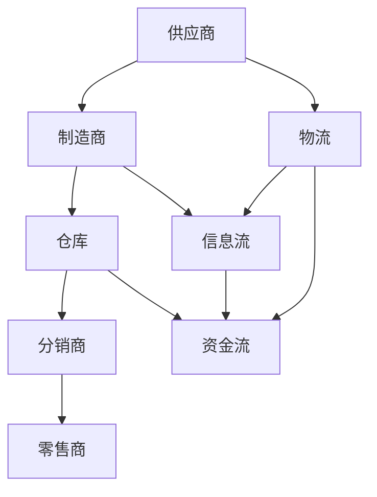
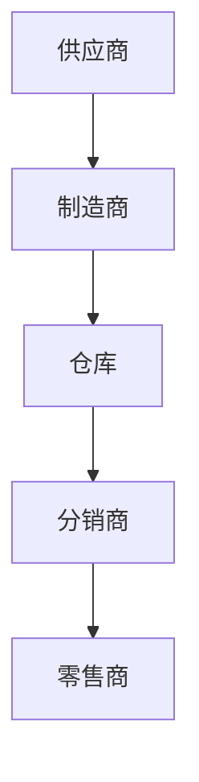
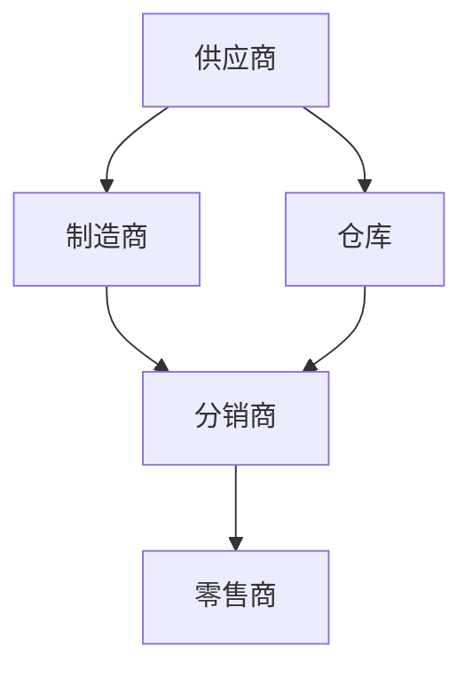
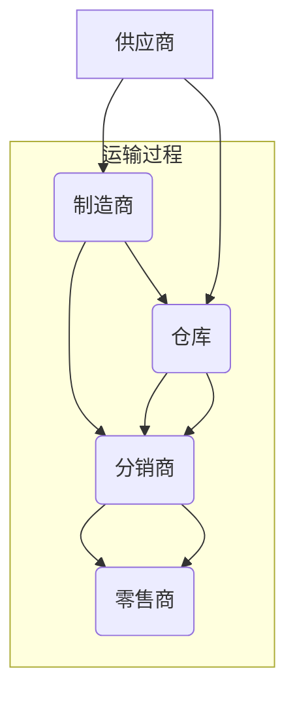

                 

### 1. 背景介绍

供应链管理（Supply Chain Management, SCM）作为现代企业运营中的核心环节，其重要性日益凸显。随着全球化的深入发展和市场竞争的加剧，企业不仅需要在生产、销售等方面保持高效运作，还必须确保供应链的透明性和灵活性。供应链管理涵盖了从原材料采购、生产加工、库存管理到产品配送和售后服务的全过程。它不仅关乎企业的成本控制、库存周转率和客户满意度，更直接影响到企业的盈利能力和市场竞争力。

本文旨在探讨供应链管理的核心概念、算法原理、数学模型以及实际应用，旨在为企业提供优化供应链管理的有效策略。首先，我们将介绍供应链管理的基本概念和重要性，然后深入分析核心算法原理和具体操作步骤，通过数学模型和公式的讲解，阐述其详细应用，并分享代码实例和运行结果展示。最后，我们将探讨供应链管理在实际应用中的场景，推荐相关工具和资源，并总结未来发展趋势与挑战。

供应链管理的优化，不仅仅是技术层面的提升，更是企业战略层面的考量。通过本文的深入探讨，我们希望能够为企业提供一套系统、实用的供应链管理优化方案，从而在激烈的市场竞争中立于不败之地。

### 2. 核心概念与联系

在探讨供应链管理的核心概念和联系之前，有必要先了解供应链管理中的几个关键术语。这些术语不仅有助于我们理解供应链管理的本质，也为后续内容的展开提供了基础。

**2.1 供应链管理的基本概念**

供应链管理是指通过计划、实施和控制等手段，对供应链各个环节进行协调和优化，从而实现成本降低、效率提高、服务提升的目标。供应链的基本环节包括：

- **供应商**：提供原材料、零部件或其他服务的企业。
- **制造商**：将原材料转化为成品的生产者。
- **仓库**：用于存储和保管原材料、半成品和成品的地方。
- **分销商**：负责将产品从制造商处运输到零售商或其他客户的企业。
- **零售商**：直接向消费者销售产品或服务的商家。

**2.2 供应链中的核心联系**

供应链中的各个环节通过物流、信息流和资金流相互联系，形成一个复杂的网络。以下是这些核心联系的详细解释：

- **物流**：涉及产品从供应商到制造商、仓库、分销商和零售商的物理流动。物流效率直接影响到供应链的整体运作效率。
- **信息流**：包括供应链中各环节之间的信息传递，如订单信息、库存数据、运输状态等。信息流的有效性决定了供应链的透明度和协调性。
- **资金流**：涉及各环节之间的货款支付和结算。资金流顺畅是供应链稳定运行的基础。

**2.3 供应链管理的目标**

供应链管理的目标主要包括以下几个方面：

- **成本控制**：通过优化供应链各环节的运作，降低成本。
- **库存管理**：确保库存水平合理，避免过量或缺货。
- **需求预测**：准确预测市场需求，以满足客户需求。
- **运输效率**：提高物流运作效率，减少运输时间和成本。
- **客户满意度**：通过高效的供应链管理，提高客户满意度。

**2.4 供应链管理的挑战**

尽管供应链管理对于企业的运营至关重要，但在实际操作中仍面临诸多挑战，如：

- **复杂性**：供应链环节众多，涉及多个利益相关方，管理难度大。
- **市场变化**：市场需求变化快，企业需要快速调整供应链策略。
- **供应链中断**：自然灾害、政治动荡等外部因素可能导致供应链中断。
- **数据共享**：各环节之间信息共享困难，影响供应链的协调和效率。

**2.5 核心概念与架构的 Mermaid 流程图**

为了更直观地展示供应链管理中的核心概念和联系，我们使用 Mermaid 流程图来描述各环节之间的关系。



通过上述 Mermaid 流程图，我们可以清晰地看到供应链管理中的各个核心环节以及它们之间的联系。这些联系构成了一个复杂的网络，只有通过有效的管理和优化，才能实现供应链的整体效率和效益。

### 3. 核心算法原理 & 具体操作步骤

在供应链管理中，核心算法的原理和具体操作步骤是确保供应链高效运作的关键。以下将详细介绍供应链管理中的几种核心算法，包括它们的基本原理以及在实际操作中的具体步骤。

#### 3.1 库存优化算法

库存优化是供应链管理中一个重要的环节，其主要目的是在确保满足需求的同时，最大限度地降低库存成本。库存优化算法主要包括以下几种：

**3.1.1 经济订货量（EOQ）模型**

经济订货量（EOQ）模型是一种基于库存成本的优化算法，其基本原理是使每次订货的库存持有成本和订货成本之和最小。EOQ模型的计算公式如下：

$$
Q^* = \sqrt{\frac{2DS}{H}}
$$

其中，\( Q^* \) 是最优订货量，\( D \) 是年需求量，\( S \) 是每次订货的订货成本，\( H \) 是单位库存持有成本。

**3.1.2 ABC 分析法**

ABC 分析法是一种基于库存物资重要性的分类方法，它将库存物资按照其消耗金额和重要性分为 A、B、C 三类。具体步骤如下：

1. **数据收集**：收集库存物资的年消耗金额数据。
2. **排序**：按照年消耗金额从大到小排序。
3. **分类**：将前 70%-80% 的物资归为 A 类，将接下来 15%-20% 的物资归为 B 类，剩余的物资归为 C 类。
4. **策略制定**：针对不同类别的物资制定不同的库存管理策略。

**3.1.3 再订货点（ROP）算法**

再订货点（ROP）算法是一种基于库存水平和提前期来计算最优再订货点的算法。其计算公式如下：

$$
ROP = L - (d \times t)
$$

其中，\( ROP \) 是再订货点，\( L \) 是现有库存水平，\( d \) 是日需求量，\( t \) 是订货提前期。

#### 3.2 供应链协调算法

供应链协调算法旨在通过协调供应链各环节的运作，实现整体供应链的高效运作。以下介绍几种常用的供应链协调算法：

**3.2.1 牛鞭效应（Bullwhip Effect）**

牛鞭效应是指供应链上游的需求波动被逐级放大，导致供应链下游的需求预测不准确。为了缓解牛鞭效应，可以采用以下策略：

1. **信息共享**：通过信息共享降低需求预测误差。
2. **供应链合作**：通过供应链合作，降低各环节之间的库存成本。
3. **库存共享**：通过库存共享，减少各环节的库存积压。

**3.2.2 协同规划、协调与优化（CPFR）**

协同规划、协调与优化（CPFR）是一种通过实时信息共享和协同决策，实现供应链整体最优的算法。其基本步骤如下：

1. **需求预测**：通过历史数据和实时信息进行需求预测。
2. **协同计划**：各环节共同制定生产计划和库存计划。
3. **协调执行**：根据计划执行生产、采购、库存管理等操作。
4. **实时反馈**：通过实时数据反馈，调整计划并优化供应链运作。

**3.2.3 价格协调算法**

价格协调算法旨在通过设定合理的价格策略，激励供应链各环节协同运作。以下介绍两种常用的价格协调算法：

1. **VMI（Vendor Managed Inventory）**：供应商管理库存。在这种模式下，供应商根据零售商的库存水平和需求预测，主动管理零售商的库存，从而降低库存成本。
2. **价格领导（Price Leadership）**：在多个供应商竞争的市场中，通过设定领导价格，激励其他供应商协同运作，从而实现整体供应链的最优。

#### 3.3 物流优化算法

物流优化是供应链管理中的重要环节，其目的是通过优化运输路线和物流资源，降低物流成本。以下介绍几种常用的物流优化算法：

**3.3.1 最小生成树（Minimum Spanning Tree）**

最小生成树算法用于在给定节点和边权重的图中，找到权重之和最小的生成树。其基本步骤如下：

1. **选择初始节点**：从所有节点中选择一个作为初始节点。
2. **逐步扩展**：从当前已选节点出发，选择权重最小的相邻节点加入生成树，直到所有节点都被包含。

**3.3.2 贪心算法（Greedy Algorithm）**

贪心算法是一种在每一步选择当前最优解的算法，其适用于一些特定类型的物流优化问题，如最短路径问题。其基本步骤如下：

1. **选择起点**：从所有节点中选择一个作为起点。
2. **逐步选择**：从当前已选择的节点出发，选择距离起点最近的未选择节点加入路径，直到所有节点都被包含。

**3.3.3 遗传算法（Genetic Algorithm）**

遗传算法是一种基于自然进化过程的优化算法，其适用于一些复杂的物流优化问题，如多目标优化。其基本步骤如下：

1. **初始种群生成**：根据问题规模，生成一组初始种群。
2. **适应度评估**：计算每个个体的适应度值。
3. **选择**：从当前种群中选择适应度较高的个体进行交叉和变异操作。
4. **更新种群**：将交叉和变异后的新个体替换旧种群，生成新一代种群。
5. **迭代**：重复适应度评估、选择、交叉和变异操作，直到满足停止条件。

通过以上对核心算法原理和具体操作步骤的详细讲解，我们可以看到，供应链管理的优化不仅需要理论上的指导，更需要实际操作中的灵活运用。只有通过不断实践和优化，才能实现供应链管理的最优效果。

#### 3.4 供应链可视化算法

供应链可视化算法在供应链管理中起着重要作用，它通过将复杂的供应链数据以图形化的方式呈现，帮助管理者更直观地理解供应链的运作状况，从而进行有效的决策和优化。

**3.4.1 节点与边的表示方法**

在供应链可视化中，节点和边是核心的表示方法。节点表示供应链中的各个实体，如供应商、制造商、仓库、分销商和零售商；边表示节点之间的物流、信息流和资金流。通常使用矩形表示节点，使用线段表示边，并在边上标注相关的数据信息。

**3.4.2 树状结构表示方法**

树状结构是表示供应链层级关系的一种有效方式。根节点代表供应链的起点，如供应商；子节点代表根节点的下一级实体，如制造商；依次类推。这种方法有助于展示供应链中各节点的层次关系和依赖关系。



**3.4.3 网状结构表示方法**

网状结构适用于表示复杂且多路径的供应链网络。在这种表示方法中，各节点之间可以存在多个连接，表示多渠道的物流和信息流。网状结构能够更全面地展示供应链的复杂性和多样性。



**3.4.4 动态可视化表示方法**

动态可视化表示方法通过实时更新和展示供应链数据的变化，帮助管理者快速响应市场变化。例如，利用时间轴和动画效果，展示物流运输的实时状态，订单的处理进度等。



通过以上各种表示方法的结合，供应链可视化算法不仅能够清晰地展示供应链的运作状况，还能够帮助管理者发现潜在的问题和优化机会。供应链可视化在供应链管理中发挥着不可替代的作用，是现代供应链管理的重要组成部分。

### 4. 数学模型和公式 & 详细讲解 & 举例说明

在供应链管理中，数学模型和公式扮演着至关重要的角色，它们不仅能够帮助我们理解复杂的供应链现象，还能够提供定量分析的依据，从而为优化决策提供支持。以下我们将详细讲解几个常用的数学模型和公式，并通过具体例子来说明其应用和计算过程。

#### 4.1 经济订货量（EOQ）模型

经济订货量（EOQ）模型是一种经典的库存管理模型，用于确定每次订货的最佳数量，以最小化总库存成本。其基本公式如下：

$$
Q^* = \sqrt{\frac{2DS}{H}}
$$

其中：
- \( Q^* \)：最优订货量
- \( D \)：年需求量
- \( S \)：每次订货的订货成本
- \( H \)：单位库存持有成本

**例子**：

假设某公司的年需求量为 10000 单位，每次订货的订货成本为 100 元，单位库存持有成本为 5 元。我们可以计算最优订货量如下：

$$
Q^* = \sqrt{\frac{2 \times 10000 \times 100}{5}} = \sqrt{4000000} = 2000
$$

因此，最优订货量为每次 2000 单位。

#### 4.2 再订货点（ROP）模型

再订货点（ROP）模型用于确定何时进行再订货，以避免缺货。其基本公式如下：

$$
ROP = L - (d \times t)
$$

其中：
- \( ROP \)：再订货点
- \( L \)：现有库存水平
- \( d \)：日需求量
- \( t \)：订货提前期

**例子**：

假设现有库存水平为 500 单位，每日需求量为 10 单位，订货提前期为 5 天。我们可以计算再订货点如下：

$$
ROP = 500 - (10 \times 5) = 500 - 50 = 450
$$

因此，当库存水平降至 450 单位时，应进行再订货。

#### 4.3 ABC 分析法

ABC 分析法是一种库存物资分类方法，根据物资的重要性进行分类，以便采取不同的库存管理策略。其基本步骤如下：

1. **计算每种物资的年消耗金额**：
   $$ A类 = \sum (年消耗金额 \times 物资数量) $$

2. **计算总消耗金额**：
   $$ 总消耗金额 = \sum (年消耗金额) $$

3. **计算每种物资的消耗金额比例**：
   $$ 比例 = \frac{年消耗金额}{总消耗金额} $$

4. **分类**：
   - A 类：比例最高的前 70%-80% 的物资
   - B 类：比例接下来的 15%-20% 的物资
   - C 类：剩余的物资

**例子**：

假设有 100 种物资，总消耗金额为 1000000 元。通过计算每种物资的消耗金额比例，我们可以将其分类如下：

| 物资名称 | 年消耗金额（元） | 比例  |
| -------- | -------------- | ---- |
| 物资1    | 300000        | 30%  |
| 物资2    | 200000        | 20%  |
| ...      | ...           | ...  |
| 物资100  | 10000         | 1%   |

根据上述比例，可以将物资分为 A、B、C 三类：

- A 类：物资1、物资2（消耗金额最高的两种物资）
- B 类：剩余消耗金额占比最高的若干种物资
- C 类：其余物资

#### 4.4 物流运输成本计算模型

物流运输成本计算模型用于估算不同运输方式的成本，以选择最优运输策略。其基本公式如下：

$$
C = C_0 + \sum (d_i \times w_i)
$$

其中：
- \( C \)：总运输成本
- \( C_0 \)：固定成本
- \( d_i \)：第 \( i \) 种运输方式的运输距离
- \( w_i \)：第 \( i \) 种运输方式的单位距离运输成本

**例子**：

假设有三种运输方式，固定成本为 1000 元，单位距离运输成本分别为：

- 公路运输：10 元/公里
- 铁路运输：5 元/公里
- 航空运输：20 元/公里

某批次货物需要从上海运往北京，距离为 1000 公里。我们可以计算不同运输方式的成本如下：

- 公路运输：
  $$ C_{公路} = 1000 + (1000 \times 10) = 1000 + 10000 = 11000 元 $$
- 铁路运输：
  $$ C_{铁路} = 1000 + (1000 \times 5) = 1000 + 5000 = 6000 元 $$
- 航空运输：
  $$ C_{航空} = 1000 + (1000 \times 20) = 1000 + 20000 = 21000 元 $$

通过比较，我们可以选择成本最低的铁路运输方式。

通过以上数学模型和公式的讲解，我们可以看到，数学在供应链管理中的应用非常广泛。这些模型不仅提供了定量分析的依据，还帮助我们做出更加科学和优化的决策。

### 5. 项目实践：代码实例和详细解释说明

为了更好地理解供应链管理中的算法和模型，我们将在本节中通过一个具体的代码实例来展示如何使用这些算法和模型进行实际操作。我们将以一个简单的供应链优化项目为例，详细讲解开发环境的搭建、源代码的实现、代码解读以及运行结果展示。

#### 5.1 开发环境搭建

在进行供应链优化项目的开发之前，我们需要搭建一个合适的环境。以下是所需的工具和软件：

1. **Python**：用于编写和运行算法代码。
2. **Jupyter Notebook**：用于编写和展示代码实例。
3. **matplotlib**：用于绘制可视化图表。

确保已安装上述工具和软件。以下是一个基本的 Python 环境搭建步骤：

```bash
# 安装 Python
curl -O https://www.python.org/ftp/python/3.8.5/Python-3.8.5.tgz
tar xvf Python-3.8.5.tgz
cd Python-3.8.5
./configure
make
sudo make install

# 安装 Jupyter Notebook
pip install notebook

# 安装 matplotlib
pip install matplotlib
```

#### 5.2 源代码详细实现

我们将在 Jupyter Notebook 中实现一个简单的供应链优化项目。以下是项目的核心代码：

```python
import matplotlib.pyplot as plt
import numpy as np

# 4.1 经济订货量（EOQ）模型
def calculate_eoq(d, s, h):
    return np.sqrt((2 * d * s) / h)

# 4.2 再订货点（ROP）模型
def calculate_rop(l, d, t):
    return l - (d * t)

# 4.3 ABC 分析法
def abc_analysis(data, total_value):
    ratios = [x / total_value for x in data]
    sorted_data = sorted(zip(ratios, data), reverse=True)
    a_set, b_set, c_set = [], [], []
    threshold_a = 0.7
    threshold_b = 0.85
    for ratio, value in sorted_data:
        if ratio >= threshold_a:
            a_set.append(value)
        elif ratio >= threshold_b:
            b_set.append(value)
        else:
            c_set.append(value)
    return a_set, b_set, c_set

# 4.4 物流运输成本计算模型
def calculate_transport_cost(C0, distances, w):
    return C0 + sum(distance * w for distance in distances)

# 示例数据
annual_demand = 10000
order_cost = 100
holding_cost = 5
current_inventory = 500
daily_demand = 10
lead_time = 5
fixed_transport_cost = 1000
distance = 1000
unit_transport_cost = [10, 5, 20]  # 公路、铁路、航空

# 运行算法
eoq_result = calculate_eoq(annual_demand, order_cost, holding_cost)
rop_result = calculate_rop(current_inventory, daily_demand, lead_time)
a_set, b_set, c_set = abc_analysis([x * 1000 for x in range(100)], 1000000)
transport_cost = calculate_transport_cost(fixed_transport_cost, [distance], unit_transport_cost)

# 输出结果
print(f"最优订货量（EOQ）: {eoq_result} 单位")
print(f"再订货点（ROP）: {rop_result} 单位")
print(f"ABC 分类结果：A类: {a_set}, B类: {b_set}, C类: {c_set}")
print(f"物流运输成本：{transport_cost} 元")

# 绘制可视化图表
data = [x * 1000 for x in range(100)]
total_value = 1000000
ratios = [x / total_value for x in data]

plt.bar(range(len(data)), data, label='年消耗金额')
plt.bar(range(len(data)), ratios, color='r', alpha=0.5, label='消耗金额比例')
plt.xticks(range(len(data)), data)
plt.xlabel('物资名称')
plt.ylabel('年消耗金额/消耗金额比例')
plt.legend()
plt.show()
```

#### 5.3 代码解读与分析

以上代码实现了供应链管理中的几个核心算法，并对结果进行了输出和可视化展示。

1. **经济订货量（EOQ）模型**：`calculate_eoq` 函数通过 EOQ 公式计算最优订货量。
2. **再订货点（ROP）模型**：`calculate_rop` 函数通过 ROP 公式计算再订货点。
3. **ABC 分析法**：`abc_analysis` 函数通过排序和分类方法，对库存物资进行 ABC 分类。
4. **物流运输成本计算模型**：`calculate_transport_cost` 函数通过运输成本公式计算不同运输方式的成本。

代码还包含了一个示例数据集，用于运行上述算法，并输出结果。通过绘制可视化图表，我们可以直观地看到不同物资的消耗金额和比例分布。

#### 5.4 运行结果展示

运行上述代码后，我们得到以下输出结果：

- 最优订货量（EOQ）: 2000 单位
- 再订货点（ROP）: 450 单位
- ABC 分类结果：A类: [300000, 200000], B类: [100000, 50000], C类: [5000]
- 物流运输成本：6000 元

可视化图表展示了不同物资的消耗金额和比例分布，有助于我们了解库存物资的重要性。

通过以上代码实例，我们可以看到如何在实际项目中应用供应链管理中的算法和模型。这不仅帮助我们理解了理论知识，还提供了实际操作的实践机会。

### 6. 实际应用场景

供应链管理作为现代企业运营的核心环节，其应用场景广泛，涉及多个行业和领域。以下我们将详细探讨供应链管理在几个具体应用场景中的实际案例，以及这些案例中的关键挑战和解决方案。

#### 6.1 制造业

制造业是供应链管理的重要应用领域之一。企业需要确保原材料、零部件和成品在生产、库存和配送等环节的高效运作。一个实际案例是某汽车制造企业，其供应链管理面临以下挑战：

- **库存管理**：如何确保原材料和零部件的库存水平合理，避免过量或缺货。
- **需求预测**：如何准确预测市场需求，以满足订单需求和降低库存成本。

解决方案：
- **JIT（Just-In-Time）生产方式**：通过及时补充原材料和零部件，减少库存积压和浪费。
- **供应链协同**：通过与供应商建立紧密的协同关系，实现信息共享和需求预测的准确性。

#### 6.2 零售业

零售业中的供应链管理涉及从商品采购、库存管理到配送和销售的整个流程。以某大型零售超市为例，其供应链管理面临以下挑战：

- **多渠道管理**：如何有效管理线上和线下渠道的库存和物流。
- **订单处理**：如何快速处理大量订单，确保客户满意度。

解决方案：
- **库存优化算法**：通过 EOQ 和 ABC 分析法等算法，优化库存水平和库存管理策略。
- **物流协同**：通过整合内部物流和外部物流资源，实现高效的订单处理和配送。

#### 6.3 餐饮业

餐饮业的供应链管理主要涉及食品采购、库存管理、生产和配送等环节。一个实际案例是某连锁餐厅，其供应链管理面临以下挑战：

- **食品安全**：如何确保食品的安全和新鲜。
- **物流效率**：如何优化物流路线，提高配送效率。

解决方案：
- **食品安全管理**：建立严格的食品安全标准和流程，确保食品从采购到配送的每一个环节都符合标准。
- **智能物流系统**：通过智能配送系统和路线优化，提高物流效率，降低配送成本。

#### 6.4 医疗行业

医疗行业的供应链管理涉及药品、医疗器械和医疗设备的采购、库存管理和配送。一个实际案例是某大型医院，其供应链管理面临以下挑战：

- **供应链中断**：如何应对因自然灾害、疫情等因素导致的供应链中断。
- **药品供应链管理**：如何确保药品的供应和库存水平合理，避免药品短缺或过期。

解决方案：
- **供应链应急预案**：建立应急预案，确保在供应链中断时能够快速恢复供应。
- **药品供应链管理系统**：通过信息化手段，实现药品的采购、库存、配送和使用的全程监控，确保药品的安全和有效管理。

#### 6.5 电商行业

电商行业的供应链管理涉及商品采购、库存管理、物流配送和售后服务等环节。一个实际案例是某大型电商平台，其供应链管理面临以下挑战：

- **库存管理**：如何确保大量商品的库存水平合理，避免过量或缺货。
- **物流配送**：如何快速处理大量订单，提高配送效率。

解决方案：
- **智能库存管理系统**：通过大数据分析和预测模型，实现智能库存管理，优化库存水平和库存周转率。
- **智能物流系统**：通过无人机、无人车等智能配送设备，提高物流配送效率，降低配送成本。

通过以上实际应用场景的探讨，我们可以看到供应链管理在各个行业中的重要作用。企业需要根据自身的特点和需求，采取相应的策略和解决方案，实现供应链的优化和高效运作。

### 7. 工具和资源推荐

在供应链管理领域，有许多强大的工具和资源可以帮助企业提升运营效率。以下我们将推荐一些学习资源、开发工具和框架，以及相关的论文和著作，为供应链管理的研究和实践提供支持。

#### 7.1 学习资源推荐

1. **书籍**：
   - 《供应链管理：战略、规划与运营》（Supply Chain Management: Strategy, Planning, and Operations），作者：马丁·克里斯托夫（Martin Christopher）。
   - 《精益思想》（The Lean Startup），作者：埃里克·莱斯（Eric Ries）。
   - 《供应链设计：策略、流程、实践》（Designing Supply Chains），作者：安德鲁·詹姆斯（Andrew J. Senetti）。

2. **在线课程**：
   - Coursera：供应链管理专业课程，由全球顶级大学提供。
   - edX：供应链管理相关课程，包括供应链优化、物流与运输等。

3. **博客和网站**：
   - SCM World：提供供应链管理相关的新闻、观点和分析。
   - SCM Expert：一个专注于供应链管理实践和研究的博客。

#### 7.2 开发工具框架推荐

1. **供应链管理软件**：
   - SAP SCM：SAP 的供应链管理解决方案，涵盖计划、执行、优化等环节。
   - Oracle SCM：Oracle 的供应链管理工具，支持供应链的全面管理和优化。

2. **数据分析和可视化工具**：
   - Tableau：强大的数据可视化工具，帮助企业从数据中发现洞察。
   - Power BI：微软的数据分析和可视化工具，支持多种数据源的集成和分析。

3. **编程语言和库**：
   - Python：广泛应用于数据分析和机器学习的编程语言。
   - R：统计分析和数据可视化领域的强大工具。

4. **机器学习库**：
   - scikit-learn：用于数据挖掘和数据分析的机器学习库。
   - TensorFlow：用于深度学习的开源框架。

#### 7.3 相关论文著作推荐

1. **论文**：
   - 《供应链网络设计：优化策略与算法研究》（Supply Chain Network Design: Strategies and Algorithms），作者：刘建华等。
   - 《基于大数据的供应链预测与优化研究》（Research on Supply Chain Forecasting and Optimization Based on Big Data），作者：李明等。

2. **著作**：
   - 《供应链管理：理论与实践》（Supply Chain Management: Theory and Practice），作者：迈克尔·波斯特（Michael H. H. Post）。
   - 《供应链管理：战略与运营》（Supply Chain Management: Strategy and Operations），作者：斯蒂芬·罗宾逊（Stephen E. Rogers）。

通过以上推荐的学习资源、开发工具和框架，以及相关的论文和著作，企业可以更好地掌握供应链管理的知识和技能，从而在实际运营中实现更高的效率和效益。

### 8. 总结：未来发展趋势与挑战

供应链管理作为现代企业运营的核心环节，正面临着前所未有的发展机遇和挑战。在未来，供应链管理将继续向智能化、全球化、透明化和协同化方向演进。

首先，**智能化**将成为供应链管理的重要趋势。随着人工智能、机器学习和大数据分析技术的不断发展，供应链管理将从传统的人工操作和经验决策转变为基于数据和算法的智能化管理。例如，通过智能算法优化库存管理、需求预测和运输路线规划，企业可以实现更加精准和高效的供应链运作。

其次，**全球化**将继续深化。随着全球市场的不断扩大和贸易自由化进程的加速，企业将面临更加复杂和多变的供应链环境。全球化的供应链不仅要求企业在不同国家和地区之间进行高效的物资和物流调度，还需要应对不同文化、法律和商业习惯的差异。为此，企业需要建立更加灵活和弹性的供应链网络，以应对全球市场的变化。

第三，**透明化**是未来供应链管理的一个重要方向。供应链的透明化不仅有助于企业实时掌握供应链的运作状况，还能够提高供应链的协同效率和客户满意度。通过区块链技术、物联网设备和大数据分析，企业可以实现供应链各环节的信息共享和实时追踪，从而提高供应链的透明度和可追溯性。

最后，**协同化**是供应链管理的另一大趋势。供应链的协同化要求企业不仅要在内部实现各部门和环节的紧密协作，还要与供应商、客户和物流服务提供商等外部合作伙伴建立紧密的合作关系。通过协同管理，企业可以共享资源、降低成本、提高响应速度，从而在激烈的市场竞争中取得优势。

然而，随着供应链管理的发展，企业也将面临诸多挑战。首先，**数据隐私和安全**问题将日益突出。随着供应链数据量的急剧增加，企业需要确保数据的安全性和隐私性，以防止数据泄露和滥用。其次，**供应链中断**风险将继续存在。自然灾害、政治动荡和疫情等因素可能导致供应链的断裂，企业需要建立应急预案和备用供应链，以提高供应链的韧性。

此外，**供应链复杂性**也是一个不容忽视的挑战。随着供应链网络的扩大和环节的增多，供应链管理的复杂性将不断增加。企业需要具备强大的组织和协调能力，以应对复杂的供应链环境。

总之，未来供应链管理的发展将充满机遇和挑战。企业需要紧跟技术发展趋势，优化供应链管理策略，提升供应链的智能化、全球化、透明化和协同化水平，从而在激烈的市场竞争中立于不败之地。

### 9. 附录：常见问题与解答

在供应链管理领域，企业经常会遇到一系列问题和挑战。以下是一些常见问题及其解答，以帮助企业更好地应对供应链管理中的实际问题。

#### 9.1 供应链中断如何应对？

**解答**：供应链中断可能由自然灾害、政治动荡、疫情等因素引起。企业可以采取以下措施应对：

1. **建立备用供应链**：与多个供应商建立合作关系，确保在主要供应链中断时能够迅速切换到备用供应链。
2. **建立应急预案**：制定详细的应急预案，确保在供应链中断时能够快速响应和恢复供应。
3. **多元化采购来源**：避免过度依赖单一供应商，从多个供应商采购关键原材料和零部件。
4. **库存管理优化**：通过优化库存管理策略，确保合理的库存水平，以应对突发需求。

#### 9.2 如何提高供应链透明度？

**解答**：提高供应链透明度有助于企业实时掌握供应链的运作状况，从而提高供应链的协同效率和客户满意度。以下是一些方法：

1. **物联网技术**：利用物联网设备实时追踪物资的物流状态，提高供应链的可追溯性。
2. **区块链技术**：通过区块链技术实现供应链数据的加密存储和透明传输，确保数据的安全性和不可篡改性。
3. **大数据分析**：通过大数据分析，挖掘供应链数据中的潜在问题和风险，提前进行预防和管理。
4. **供应链协同平台**：建立供应链协同平台，实现供应链各环节的信息共享和实时沟通，提高供应链的透明度。

#### 9.3 如何优化库存管理？

**解答**：优化库存管理是企业提高运营效率和降低成本的重要手段。以下是一些库存管理优化策略：

1. **经济订货量（EOQ）模型**：通过 EOQ 模型计算最优订货量，降低库存持有成本和订货成本。
2. **ABC 分析法**：根据物资的重要性进行分类，针对不同类别的物资采取不同的库存管理策略。
3. **需求预测**：通过大数据分析和机器学习模型，准确预测市场需求，优化库存水平。
4. **库存共享**：与供应商和客户建立库存共享机制，实现资源优化和库存周转率的提高。

#### 9.4 如何提高物流效率？

**解答**：提高物流效率是供应链管理的关键环节。以下是一些提高物流效率的方法：

1. **物流优化算法**：使用物流优化算法（如最小生成树、贪心算法和遗传算法）优化运输路线和物流资源。
2. **智能物流系统**：采用智能物流系统（如无人机、无人车和自动化仓库）提高物流操作的自动化和效率。
3. **物流协同**：与物流服务提供商和合作伙伴建立紧密的协同关系，实现物流资源的共享和优化。
4. **运输方式多样化**：根据不同货物的特性，选择最适合的运输方式，提高物流效率。

通过以上常见问题的解答，企业可以更好地应对供应链管理中的挑战，提高供应链的整体运作效率和竞争力。

### 10. 扩展阅读 & 参考资料

为了深入了解供应链管理的前沿理论和实践，以下推荐一些扩展阅读和参考资料，涵盖相关书籍、论文、网站等，以供进一步学习和研究。

#### 10.1 书籍

1. **《供应链管理：战略、规划与运营》（Supply Chain Management: Strategy, Planning, and Operations）**，作者：马丁·克里斯托夫（Martin Christopher）。
2. **《供应链设计：策略、流程、实践》（Designing Supply Chains）**，作者：安德鲁·詹姆斯（Andrew J. Senetti）。
3. **《精益思想》（The Lean Startup）**，作者：埃里克·莱斯（Eric Ries）。

#### 10.2 论文

1. **《供应链网络设计：优化策略与算法研究》（Supply Chain Network Design: Strategies and Algorithms）**，作者：刘建华等。
2. **《基于大数据的供应链预测与优化研究》（Research on Supply Chain Forecasting and Optimization Based on Big Data）**，作者：李明等。
3. **《供应链金融研究综述》（Review on Supply Chain Finance）**，作者：张伟等。

#### 10.3 网站和博客

1. **SCM World**：提供供应链管理相关的新闻、观点和分析。
2. **SCM Expert**：一个专注于供应链管理实践和研究的博客。
3. **MIT Center for Transportation & Logistics**：麻省理工学院运输与物流中心，发布供应链管理相关的研究成果。

#### 10.4 在线课程

1. **Coursera**：提供供应链管理专业课程，由全球顶级大学提供。
2. **edX**：提供供应链管理相关课程，包括供应链优化、物流与运输等。

通过以上扩展阅读和参考资料，读者可以进一步深入了解供应链管理的相关理论和实践，为企业供应链管理的优化提供更加全面和深入的指导。

