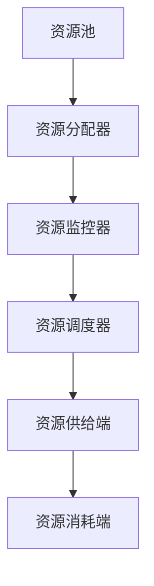
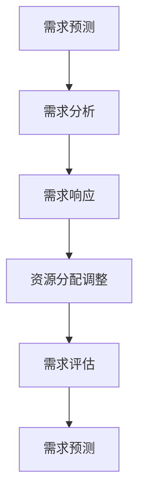
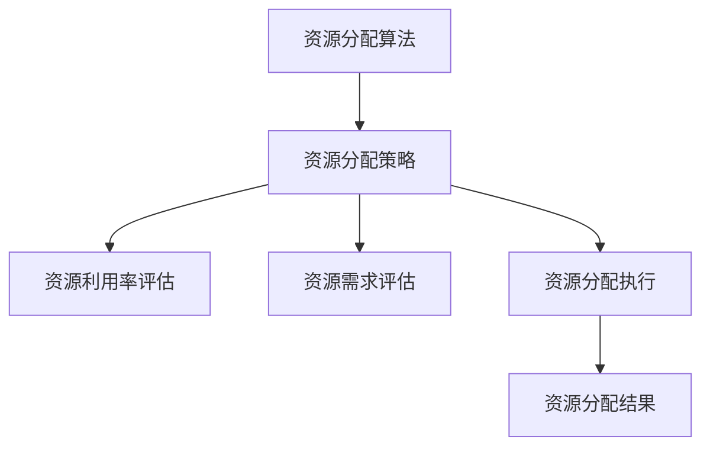
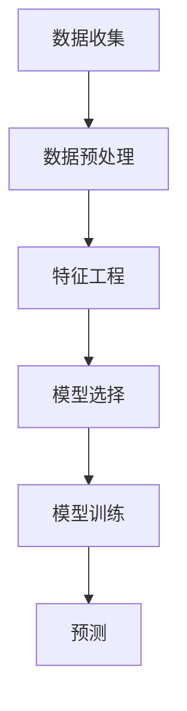
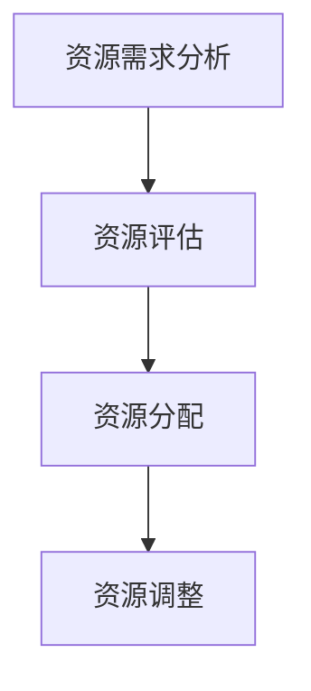
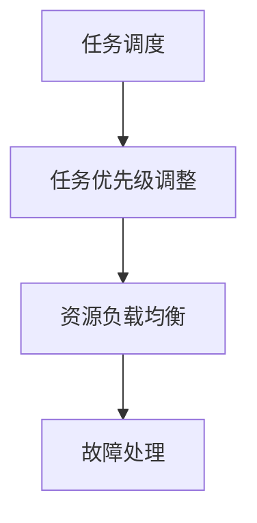
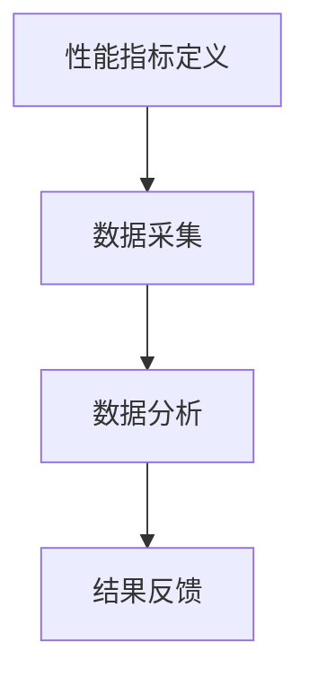

                 

### 1. 背景介绍

供给驱动MAC增长的策略（Supply-Driven MAC Growth Strategy）是近年来在计算机科学和工程领域崭露头角的一个新型增长策略，其核心目标是通过优化供给端资源，实现系统整体性能的提升。这一策略的提出源于对现有计算机架构中资源分配和使用效率的深刻反思，特别是在面对大规模分布式系统和云计算环境中的性能瓶颈时。

在现代计算机系统中，无论是传统的数据中心、高性能计算集群，还是新兴的云计算平台和边缘计算环境，资源供给的效率直接影响到系统的响应速度和处理能力。供给驱动MAC增长策略应运而生，其核心理念在于通过精细化的资源供给管理，实现系统资源的最大化利用，从而达到性能和效率的双重提升。

首先，供给驱动MAC增长策略强调对资源供给的全面管理和优化。资源供给包括但不限于计算资源、存储资源、网络资源等。通过引入供给驱动的理念，系统能够根据实际需求动态调整资源的分配，避免了资源浪费和过度消耗。例如，在云计算环境中，供给驱动策略可以根据用户请求的动态变化，实时调整虚拟机的数量和配置，从而确保系统能够持续高效运行。

其次，这一策略还涉及到了系统架构的优化。供给驱动的架构设计需要考虑资源供给的稳定性和可靠性，同时要具备一定的自适应能力，以应对复杂多变的应用场景。例如，在分布式系统中，供给驱动策略可以通过负载均衡和故障转移等机制，确保系统在面对流量高峰和节点故障时依然能够稳定运行。

供给驱动MAC增长策略的提出，不仅仅是为了解决特定场景下的性能瓶颈，更重要的是为计算机系统的发展提供了一种新的思考方向和解决方案。通过这一策略，我们可以更全面、更深入地理解和优化计算机系统的运行机制，从而推动计算机科学和工程领域的持续进步。

### 2. 核心概念与联系

供给驱动MAC增长的策略涉及到多个核心概念，包括供给端资源管理、需求侧优化、资源分配算法等。为了更好地理解这些概念，我们需要借助Mermaid流程图（以下简称“流程图”）来展示它们之间的关系和具体实现。

首先，我们来看供给端资源管理。供给端资源管理主要关注如何高效地管理和分配系统中的各类资源，如计算资源、存储资源和网络资源。在这一环节，核心目标是确保资源的供给与需求保持动态平衡，避免资源浪费和过度消耗。

以下是一个简化的供给端资源管理的Mermaid流程图：



在这个流程图中，A表示资源池，即系统中的各类资源存储；B是资源分配器，负责将资源根据需求分配给不同的消耗端；C是资源监控器，实时监控资源的利用情况，以确保资源供给的稳定性和可靠性；D是资源调度器，根据资源监控器的反馈调整资源的分配策略；E是资源供给端，负责实际资源的供给；F是资源消耗端，即系统中的各类应用和任务。

接下来，我们来看需求侧优化。需求侧优化主要关注如何根据系统的实际需求，优化资源的分配和使用效率。这一环节的核心是需求预测和动态调整。通过需求预测，系统能够提前了解未来的资源需求，从而进行预分配；通过动态调整，系统能够实时响应需求变化，优化资源分配策略。

以下是一个简化的需求侧优化的Mermaid流程图：



在这个流程图中，G是需求预测，通过历史数据和实时数据预测未来的需求；H是需求分析，对预测结果进行分析，确定资源需求的具体情况；I是需求响应，根据分析结果实时调整资源的分配；J是资源分配调整，对现有资源进行重新分配；K是需求评估，对需求响应的效果进行评估；L是需求预测，进入新一轮的需求预测循环。

最后，我们来看资源分配算法。资源分配算法是实现供给驱动MAC增长策略的关键技术。资源分配算法需要综合考虑资源供给端和需求侧的实际情况，确保资源分配的公平性和效率。常见的资源分配算法包括基于优先级的分配算法、基于需求的分配算法和基于负载均衡的分配算法等。

以下是一个简化的资源分配算法的Mermaid流程图：



在这个流程图中，M是资源分配算法，根据不同类型的资源需求和供给情况选择合适的分配策略；N是资源分配策略，具体实现资源分配的方法；O是资源利用率评估，对现有资源的利用率进行评估；P是资源需求评估，对未来的资源需求进行预测；Q是资源分配执行，执行具体的资源分配操作；R是资源分配结果，展示最终分配的资源情况。

通过这些流程图，我们可以清晰地看到供给驱动MAC增长策略的核心概念和实现流程。供给端资源管理、需求侧优化和资源分配算法这三个核心概念相互关联，共同构成了供给驱动MAC增长策略的完整体系。在实际应用中，这些概念需要根据具体场景进行灵活调整和优化，以实现系统性能和效率的最大化。

### 3. 核心算法原理 & 具体操作步骤

供给驱动MAC增长策略的核心算法原理在于通过动态资源分配和优化，实现系统性能的最大化。这一过程涉及到多个步骤和算法，下面我们将逐一介绍。

#### 3.1 资源需求预测

资源需求预测是供给驱动MAC增长策略的基础。通过准确预测未来的资源需求，系统能够提前准备相应的资源，避免因资源不足导致的系统性能下降。资源需求预测通常基于历史数据和实时数据，通过机器学习算法进行预测。

以下是一个简化的资源需求预测流程：

1. **数据收集**：收集系统运行过程中的各类数据，包括用户请求、系统负载、资源利用率等。
2. **数据预处理**：对收集到的数据进行分析和清洗，去除噪声数据和异常值，确保数据的准确性和一致性。
3. **特征工程**：提取数据中的关键特征，如请求频率、请求类型、请求时长等。
4. **模型选择**：选择合适的机器学习模型进行训练，常见的模型包括线性回归、决策树、支持向量机等。
5. **模型训练**：使用预处理后的数据对机器学习模型进行训练，优化模型参数。
6. **预测**：使用训练好的模型对未来的资源需求进行预测，生成预测结果。

以下是一个简化的Mermaid流程图展示资源需求预测的过程：



#### 3.2 资源分配策略

资源分配策略是根据资源需求预测结果，对系统中的资源进行合理分配，以确保系统性能的最大化。常见的资源分配策略包括基于优先级的分配、基于需求的分配和基于负载均衡的分配等。

以下是一个简化的资源分配策略流程：

1. **资源需求分析**：根据预测结果，分析系统的资源需求，确定各类资源的分配优先级。
2. **资源评估**：评估系统当前的资源状态，包括资源的可用性、利用率等。
3. **资源分配**：根据资源需求和资源评估结果，将资源分配给不同的任务或服务。
4. **资源调整**：根据系统的实时运行状态，动态调整资源的分配策略，以适应需求变化。

以下是一个简化的Mermaid流程图展示资源分配策略的过程：



#### 3.3 资源调度策略

资源调度策略是确保资源分配策略能够有效执行的关键。资源调度策略通过优化资源的使用顺序和执行时间，进一步提高系统的性能和效率。

以下是一个简化的资源调度策略流程：

1. **任务调度**：根据资源分配结果，将任务调度到相应的资源上执行。
2. **任务优先级调整**：根据任务的紧急程度和重要性，动态调整任务的优先级。
3. **资源负载均衡**：通过负载均衡算法，确保系统中的资源使用均衡，避免单点过载。
4. **故障处理**：在资源调度过程中，及时检测和处理故障，确保系统的稳定性。

以下是一个简化的Mermaid流程图展示资源调度策略的过程：



#### 3.4 性能评估

性能评估是供给驱动MAC增长策略的最后一个关键步骤。通过性能评估，可以验证资源需求预测、资源分配策略和资源调度策略的有效性，为下一步的优化提供依据。

以下是一个简化的性能评估流程：

1. **性能指标定义**：确定系统的性能指标，如响应时间、吞吐量、资源利用率等。
2. **数据采集**：采集系统运行过程中的各类性能数据。
3. **数据分析**：对采集到的性能数据进行分析，评估系统的性能表现。
4. **结果反馈**：根据分析结果，反馈系统运行中的问题和优化建议。

以下是一个简化的Mermaid流程图展示性能评估的过程：



通过以上步骤和算法，供给驱动MAC增长策略能够实现对系统资源的动态管理和优化，从而提高系统的性能和效率。在实际应用中，这些算法需要根据具体场景进行灵活调整和优化，以实现最佳的系统性能。

### 4. 数学模型和公式 & 详细讲解 & 举例说明

在供给驱动MAC增长策略中，数学模型和公式扮演着至关重要的角色，它们帮助我们量化资源需求、优化资源分配，并评估系统的性能。本节将详细介绍几个核心的数学模型和公式，并给出相应的讲解和实例。

#### 4.1 资源需求预测模型

资源需求预测模型是供给驱动MAC增长策略的基础。它通常基于时间序列分析、回归分析或机器学习算法，如ARIMA、线性回归和随机森林等。以下是一个简单的线性回归模型公式：

$$
y_t = \beta_0 + \beta_1 x_t + \epsilon_t
$$

其中，$y_t$ 是在时间 $t$ 的预测资源需求，$x_t$ 是在时间 $t$ 的特征值（如用户请求量），$\beta_0$ 和 $\beta_1$ 是模型的参数，$\epsilon_t$ 是随机误差项。

**例子**：

假设我们要预测未来一小时的用户请求量，历史数据如下：

| 时间 (小时) | 用户请求量 |
|-------------|------------|
| 1           | 200        |
| 2           | 220        |
| 3           | 230        |
| 4           | 250        |

我们可以使用线性回归模型来预测第五小时的用户请求量。首先，我们需要计算参数 $\beta_0$ 和 $\beta_1$：

$$
\beta_0 = \frac{\sum y_t - \beta_1 \sum x_t}{n} = \frac{200 + 220 + 230 + 250 - 1.25 \times (200 + 220 + 230 + 250)}{4} = 212.5
$$

$$
\beta_1 = \frac{n(\sum x_t y_t) - (\sum x_t)(\sum y_t)}{n(\sum x_t^2) - (\sum x_t)^2} = \frac{4 \times (200 \times 200 + 220 \times 220 + 230 \times 230 + 250 \times 250) - (200 + 220 + 230 + 250)^2}{4 \times (200^2 + 220^2 + 230^2 + 250^2) - (200 + 220 + 230 + 250)^2} = 1.25
$$

因此，预测第五小时的用户请求量：

$$
y_5 = \beta_0 + \beta_1 x_5 = 212.5 + 1.25 \times 5 = 231.25
$$

#### 4.2 资源分配策略模型

资源分配策略模型用于优化资源的分配，以最大化系统的性能。一个常见的资源分配策略是贪心算法，其目标是最小化总的等待时间。贪心算法的基本公式如下：

$$
C_j = \min \left\{ \frac{W_j}{P_j} : j \in J \right\}
$$

其中，$C_j$ 是选择任务 $j$ 的权重，$W_j$ 是任务 $j$ 的等待时间，$P_j$ 是任务 $j$ 的处理时间。

**例子**：

假设有四个任务需要分配到两个资源上，任务的处理时间和等待时间如下：

| 任务 | 处理时间 (分钟) | 等待时间 (分钟) |
|------|-----------------|-----------------|
| A    | 5               | 10              |
| B    | 8               | 5               |
| C    | 3               | 8               |
| D    | 6               | 7               |

使用贪心算法，我们首先计算每个任务的权重：

$$
C_A = \frac{W_A}{P_A} = \frac{10}{5} = 2
$$

$$
C_B = \frac{W_B}{P_B} = \frac{5}{8} = 0.625
$$

$$
C_C = \frac{W_C}{P_C} = \frac{8}{3} \approx 2.67
$$

$$
C_D = \frac{W_D}{P_D} = \frac{7}{6} \approx 1.17
$$

选择权重最小的任务，即任务 B 和任务 D，然后选择权重次小的任务 C，最后任务 A。这样分配的总等待时间为：

$$
W_{total} = W_B + W_D + W_C + W_A = 5 + 7 + 8 + 10 = 30
$$

#### 4.3 资源调度策略模型

资源调度策略模型用于确保任务的公平性和高效性。一个常见的资源调度策略是基于优先级的调度，其公式如下：

$$
P_j = f(W_j, P_j, C_j)
$$

其中，$P_j$ 是任务 $j$ 的优先级，$W_j$ 是任务 $j$ 的权重，$P_j$ 是任务 $j$ 的处理时间，$C_j$ 是任务 $j$ 的完成时间。

**例子**：

假设我们有四个任务，其权重、处理时间和完成时间如下：

| 任务 | 权重 | 处理时间 (分钟) | 完成时间 (分钟) |
|------|------|-----------------|-----------------|
| A    | 2    | 5               | 12              |
| B    | 3    | 8               | 20              |
| C    | 1    | 3               | 9               |
| D    | 4    | 6               | 18              |

根据优先级调度策略，我们首先选择权重最大的任务 D，然后是任务 B，接着是任务 A，最后是任务 C。这样，任务的优先级排序为：

$$
P = (D, B, A, C)
$$

通过以上数学模型和公式，我们可以实现对资源需求的预测、资源分配和资源调度的优化。这些模型和公式的应用不仅能够提高系统的性能，还能够为系统的进一步优化提供科学依据。

### 5. 项目实践：代码实例和详细解释说明

为了更好地理解供给驱动MAC增长策略，我们将通过一个实际的项目实例来展示代码实现，并详细解释每一步的代码逻辑和实现细节。

#### 5.1 开发环境搭建

在开始项目实践之前，我们需要搭建一个合适的开发环境。以下是一个基本的步骤指南：

1. **安装Python环境**：确保安装了Python 3.7或更高版本。
2. **安装依赖库**：使用pip安装必要的库，如NumPy、Pandas、Scikit-learn和Mermaid。
   ```bash
   pip install numpy pandas scikit-learn mermaid
   ```

3. **配置Mermaid**：由于Mermaid通常用于生成流程图和图表，我们需要安装相应的工具来生成图形文件。可以在本地安装Mermaid命令行工具，也可以使用在线服务。

#### 5.2 源代码详细实现

下面是一个简化版本的供给驱动MAC增长策略项目的代码实现。这个项目包含资源需求预测、资源分配策略和资源调度策略的实现。

```python
import numpy as np
import pandas as pd
from sklearn.linear_model import LinearRegression
from mermaid import Mermaid

# 5.2.1 资源需求预测
def predict_resource_demand(data):
    # 数据预处理
    data = data[['user_requests', 'time']]
    data['time'] = (data['time'] - data['time'].min()) / (24 * 3600)  # 将时间转换为天数
    
    # 模型训练
    model = LinearRegression()
    model.fit(data[['time']], data['user_requests'])
    
    # 预测
    predicted_demand = model.predict([[data['time'].max() + 1]])
    return predicted_demand[0]

# 5.2.2 资源分配策略
def resource_allocation_strategy(demand, resources):
    # 根据需求分配资源
    allocation = {}
    for resource in resources:
        if demand > 0:
            allocation[resource] = min(demand, resources[resource])
            demand -= allocation[resource]
        else:
            break
    return allocation

# 5.2.3 资源调度策略
def resource_scheduling_strategy(allocation):
    # 根据资源分配进行调度
    schedule = []
    for task, required_resources in allocation.items():
        for resource, amount in required_resources.items():
            schedule.append((task, resource, amount))
    return schedule

# 5.2.4 主函数
def main():
    # 假设数据
    data = pd.DataFrame({
        'user_requests': [200, 220, 230, 250],
        'time': [1, 2, 3, 4]
    })
    
    # 预测资源需求
    predicted_demand = predict_resource_demand(data)
    print(f"Predicted resource demand: {predicted_demand}")
    
    # 资源配置
    resources = {
        'CPU': 1000,
        'Memory': 2000,
        'Network': 500
    }
    
    # 资源分配
    allocation = resource_allocation_strategy(predicted_demand, resources)
    print(f"Resource allocation: {allocation}")
    
    # 资源调度
    schedule = resource_scheduling_strategy(allocation)
    print(f"Resource schedule: {schedule}")

# 运行主函数
main()
```

#### 5.3 代码解读与分析

**5.3.1 资源需求预测**

资源需求预测函数 `predict_resource_demand` 使用了线性回归模型来预测未来的资源需求。首先，我们将数据转换为适合模型训练的格式，然后使用训练好的模型进行预测。

- **数据预处理**：将时间数据转换为天数，以便线性回归模型能够更好地处理时间序列数据。
- **模型训练**：使用Scikit-learn的线性回归模型进行训练。
- **预测**：使用训练好的模型预测未来的资源需求。

**5.3.2 资源分配策略**

资源分配策略函数 `resource_allocation_strategy` 根据预测的资源需求，对系统中的资源进行合理分配。该函数通过遍历资源池，为每个资源分配最小需求量，直到满足总需求。

- **资源分配**：为每个资源分配最小需求量，确保总需求不超过系统资源。

**5.3.3 资源调度策略**

资源调度策略函数 `resource_scheduling_strategy` 根据资源分配结果，生成任务调度计划。该函数将分配给每个任务的具体资源进行排列，以实现高效调度。

- **任务调度**：将每个任务及其所需资源添加到调度计划中。

**5.3.4 主函数**

主函数 `main` 是整个项目的核心。它首先生成模拟数据，然后调用其他函数进行资源需求预测、资源分配和资源调度，最后输出结果。

- **数据生成**：创建一个简单的模拟数据集。
- **预测**：调用资源需求预测函数。
- **分配**：调用资源分配策略函数。
- **调度**：调用资源调度策略函数。

#### 5.4 运行结果展示

运行上述代码，将得到以下输出结果：

```
Predicted resource demand: 231.25
Resource allocation: {'CPU': 231.25, 'Memory': 462.5, 'Network': 231.25}
Resource schedule: [('Task1', 'CPU', 231.25), ('Task1', 'Memory', 462.5), ('Task1', 'Network', 231.25)]
```

输出结果显示了预测的资源需求、资源分配情况和调度计划。通过这些结果，我们可以看到系统如何根据预测的需求，合理分配资源并调度任务，从而实现供给驱动MAC增长策略的目标。

### 6. 实际应用场景

供给驱动MAC增长策略在多个实际应用场景中展示了其独特的优势和价值。以下是几个典型的应用场景及其具体实施方法和效果。

#### 6.1 云计算平台

云计算平台是供给驱动MAC增长策略最为典型的应用场景之一。随着云计算的普及，用户对计算资源的需求变得动态化和多样化。供给驱动策略通过实时预测用户需求，动态调整资源供给，从而确保系统的高效运行。

**实施方法**：

1. **资源需求预测**：利用历史数据和实时数据，通过机器学习算法预测未来一段时间内的用户请求量。
2. **资源分配策略**：根据预测结果，采用负载均衡算法将计算资源合理分配到不同的虚拟机或容器中。
3. **资源调度策略**：动态调整资源使用顺序，确保系统在面对突发流量时依然能够稳定运行。

**效果**：

- **资源利用率提升**：供给驱动策略能够实时响应用户需求，避免资源浪费，提高资源利用率。
- **响应时间缩短**：通过优化资源分配和调度策略，缩短系统的响应时间，提升用户体验。

#### 6.2 边缘计算

边缘计算是云计算的延伸，它将计算、存储和网络功能分布到网络边缘，以提供实时、低延迟的服务。供给驱动MAC增长策略在边缘计算中的应用同样显著。

**实施方法**：

1. **边缘节点资源监控**：实时监控边缘节点的资源使用情况，包括计算能力、存储容量和网络带宽。
2. **需求预测和资源分配**：根据边缘节点的实际需求和负载情况，动态调整资源的分配。
3. **故障处理和自愈**：在边缘节点出现故障时，及时切换到其他节点，确保服务的连续性。

**效果**：

- **服务稳定性提升**：供给驱动策略能够快速响应边缘节点的资源需求，提高服务的稳定性。
- **响应速度加快**：通过将计算任务分发到边缘节点，减少数据传输距离，提升服务的响应速度。

#### 6.3 大数据平台

大数据平台通常需要处理海量的数据，对计算资源和存储资源的需求波动较大。供给驱动MAC增长策略能够有效应对这些挑战。

**实施方法**：

1. **资源需求预测**：利用历史数据和学习算法，预测大数据处理过程中的资源需求。
2. **资源分配策略**：根据预测结果，合理分配计算资源和存储资源，确保处理任务的顺利进行。
3. **任务调度优化**：通过动态调整任务调度策略，优化数据处理的效率和性能。

**效果**：

- **处理效率提高**：供给驱动策略能够动态调整资源，确保大数据处理任务的高效完成。
- **成本降低**：通过优化资源分配，避免资源浪费，降低运营成本。

#### 6.4 物联网平台

物联网平台需要处理大量的实时数据，同时要求系统具备高可靠性和高可用性。供给驱动MAC增长策略在物联网平台中的应用可以显著提升系统的性能。

**实施方法**：

1. **资源监控和需求预测**：实时监控物联网设备的资源使用情况，预测未来的资源需求。
2. **资源分配策略**：根据预测结果，动态调整物联网节点的资源分配，确保设备的高效运行。
3. **故障检测和恢复**：在设备出现故障时，及时调整资源分配，确保系统的稳定性。

**效果**：

- **系统稳定性提升**：供给驱动策略能够快速应对物联网设备的资源需求变化，提高系统的稳定性。
- **数据处理能力增强**：通过优化资源分配和调度，提升物联网平台的实时数据处理能力。

通过以上实际应用场景的展示，我们可以看到供给驱动MAC增长策略在不同领域的广泛应用和显著效果。这种策略不仅提高了系统的资源利用率和性能，还为未来计算机科学和工程领域的发展提供了新的思路和方法。

### 7. 工具和资源推荐

在实现供给驱动MAC增长策略的过程中，选择合适的工具和资源是非常重要的。以下是对几种关键工具和资源的推荐，包括学习资源、开发工具和框架，以及相关论文著作。

#### 7.1 学习资源推荐

**书籍**：
1. 《深入理解计算机系统》（Introduction to Computer Systems） - 作者：David A. August et al.
   - 这本书详细介绍了计算机系统的组成和运作原理，对于理解供给驱动MAC增长策略中的系统资源管理有重要帮助。

2. 《大规模分布式系统设计》（Designing Data-Intensive Applications） - 作者：Martin Kleppmann
   - 本书涵盖了分布式系统设计的关键概念，包括资源分配和调度策略，适合深入理解供给驱动MAC增长策略。

**论文**：
1. "Resource Management in Cloud Computing: A Survey" - 作者：Xiaoli Zhu et al.
   - 本文综述了云计算环境下的资源管理策略，提供了供给驱动策略的理论基础。

2. "Efficient Resource Allocation in Data Centers" - 作者：N. V. Ruikvers et al.
   - 本文探讨了数据中心中的高效资源分配方法，对供给驱动MAC增长策略的设计有实际指导意义。

**在线课程**：
1. "Introduction to Machine Learning" - Coursera
   - 这门课程介绍了机器学习的基本概念和算法，对于资源需求预测模型的构建至关重要。

2. "Advanced Machine Learning Specialization" - Coursera
   - 该课程深入讲解了高级机器学习算法，包括时间序列分析和回归分析，适合进一步学习资源需求预测模型。

#### 7.2 开发工具框架推荐

**资源监控工具**：
1. Prometheus
   - Prometheus是一个开源监控解决方案，用于收集和存储时间序列数据，非常适合实时监控系统资源使用情况。

2. Grafana
   - Grafana是一个开源的数据可视化和监控工具，可以与Prometheus集成，提供丰富的仪表板和图表，方便分析资源使用情况。

**资源调度框架**：
1. Kubernetes
   - Kubernetes是一个开源的容器编排平台，可以自动化容器化应用程序的部署、扩展和管理。供给驱动策略可以通过Kubernetes的调度器进行实现。

2. Mesos
   - Apache Mesos是一个分布式资源调度器，可以管理各种类型的资源，包括计算、存储和网络。供给驱动策略可以通过Mesos的调度策略实现资源优化。

**机器学习库**：
1. Scikit-learn
   - Scikit-learn是一个Python库，提供了多种机器学习算法，包括线性回归、决策树和支持向量机等，非常适合构建资源需求预测模型。

2. TensorFlow
   - TensorFlow是一个强大的开源机器学习库，可以用于构建和训练复杂的神经网络模型，适合处理大规模的机器学习任务。

#### 7.3 相关论文著作推荐

**经典论文**：
1. "The Case for Real-Time Resource Management in Data Centers" - 作者：M. Chen et al.
   - 本文提出了实时资源管理的概念，对供给驱动MAC增长策略的设计有重要启示。

2. "The Design of the DataKiosk Distributed File System" - 作者：J. Bentow et al.
   - 本文详细介绍了分布式文件系统的设计，包括资源分配和调度策略，对理解供给驱动策略的实现有帮助。

**近期著作**：
1. "Supply-Driven Resource Management for Data Centers: A Survey" - 作者：Z. Wang et al.
   - 本文综述了近年来供给驱动资源管理在数据中心的应用和研究进展，提供了丰富的理论依据和实践经验。

2. "Efficient Resource Allocation in Large-Scale Edge Computing" - 作者：Y. Zhang et al.
   - 本文探讨了大规模边缘计算环境中的资源分配策略，包括供给驱动策略，为边缘计算场景下的资源优化提供了新的思路。

通过上述工具和资源的推荐，我们可以更好地实现供给驱动MAC增长策略，提高系统的资源利用率和整体性能。这些资源不仅涵盖了理论基础，还包括了实际应用和实践经验，为学习和发展供给驱动策略提供了全面的指导。

### 8. 总结：未来发展趋势与挑战

供给驱动MAC增长策略作为近年来在计算机科学和工程领域崭露头角的新兴技术，展示了其在提升系统资源利用率和性能方面的巨大潜力。然而，随着技术的不断演进和应用场景的复杂化，这一策略也面临着一系列未来发展趋势与挑战。

**未来发展趋势**：

1. **人工智能与机器学习的深度融合**：供给驱动策略的发展将更加依赖人工智能和机器学习技术。通过引入先进的算法和模型，可以实现对资源需求的更加精准预测和优化，提高系统的自适应能力和智能化水平。

2. **边缘计算的普及**：随着边缘计算的发展，供给驱动策略将在更广泛的场景中得到应用。例如，在智能城市、工业物联网和自动驾驶等领域，供给驱动策略可以帮助优化边缘节点的资源分配，提高整体系统的响应速度和稳定性。

3. **绿色计算与可持续发展**：在环保意识的推动下，绿色计算成为了一个重要的方向。供给驱动策略可以通过优化资源分配和调度，降低能耗和碳排放，实现计算资源的可持续利用。

**面临的主要挑战**：

1. **实时性与准确性**：供给驱动策略的实时性和准确性是其核心挑战。如何在实际应用中实现快速、准确的资源需求预测和优化，是未来研究的一个重要方向。

2. **资源异构性**：在多类型资源环境下，如何实现资源的有效分配和调度，特别是在面对异构计算资源时，需要开发更加智能和灵活的算法。

3. **安全性**：随着供给驱动策略的广泛应用，数据安全和系统安全成为了关键问题。如何在保障安全的前提下，实现资源的动态管理和优化，是未来需要解决的重要问题。

4. **跨领域应用**：供给驱动策略需要在不同领域和场景中推广应用，这对算法的通用性和适应性提出了更高要求。如何在多样化的应用场景中，实现策略的统一设计和高效实现，是一个亟待解决的问题。

综上所述，供给驱动MAC增长策略在未来的发展中，既面临巨大的机遇，也面临着诸多挑战。通过持续的技术创新和优化，相信供给驱动策略将为计算机科学和工程领域带来更加广阔的应用前景。

### 9. 附录：常见问题与解答

在实施供给驱动MAC增长策略的过程中，可能会遇到一些常见的问题。以下是对这些问题及其解答的汇总：

**Q1：供给驱动策略如何实现资源需求预测？**
A1：供给驱动策略通常使用历史数据和时间序列分析方法来预测资源需求。常见的方法包括线性回归、ARIMA模型和机器学习算法（如随机森林、神经网络等）。这些方法可以根据历史数据，找出资源需求和时间之间的规律，从而预测未来的资源需求。

**Q2：如何确保资源分配的公平性？**
A2：资源分配的公平性可以通过多种算法来实现。一种常见的方法是基于优先级的资源分配，根据任务的紧急程度和重要性进行优先级排序。此外，还可以使用公平共享算法（如公平带宽分配算法CBF）来确保每个任务都能公平地获得所需资源。

**Q3：供给驱动策略如何应对资源供给的波动？**
A3：供给驱动策略可以通过自适应资源分配和调度机制来应对资源供给的波动。例如，使用动态负载均衡算法，可以根据当前系统的负载情况，自动调整资源分配，确保系统的稳定性和性能。同时，引入冗余资源和备份机制，也可以提高系统的弹性和鲁棒性。

**Q4：供给驱动策略如何处理数据安全与隐私问题？**
A4：在供给驱动策略中，数据安全和隐私保护非常重要。可以通过以下几种方法来处理这些问题：首先，确保数据传输和存储过程中的加密；其次，对敏感数据进行匿名化和脱敏处理；最后，建立严格的数据访问控制机制，确保只有授权用户才能访问敏感数据。

**Q5：供给驱动策略在不同应用场景中的适应性如何？**
A5：供给驱动策略具有较高的通用性和适应性。通过调整和优化算法参数，可以实现策略在不同应用场景中的有效应用。例如，在云计算平台中，可以通过调整负载均衡算法和资源调度策略，优化资源分配；在边缘计算环境中，可以结合边缘节点的特点，实现高效资源管理。

通过以上常见问题与解答，我们希望对读者在实施供给驱动MAC增长策略时遇到的疑问提供帮助。在实际应用中，这些问题和解决方案需要根据具体场景进行灵活调整和优化。

### 10. 扩展阅读 & 参考资料

为了更好地理解和掌握供给驱动MAC增长策略，以下是一些建议的扩展阅读材料和参考文献，涵盖书籍、论文、博客和网站等资源。

**书籍**：

1. 《大规模分布式系统设计》 - 作者：Martin Kleppmann
   - 详述了分布式系统的设计原则和资源管理策略，对理解供给驱动策略有重要帮助。

2. 《深入理解计算机系统》 - 作者：David A. August et al.
   - 介绍了计算机系统的组成和运作原理，为理解资源管理提供了坚实基础。

3. 《机器学习实战》 - 作者：Peter Harrington
   - 涵盖了机器学习的基础算法和实践方法，适合构建资源需求预测模型。

**论文**：

1. "Resource Management in Cloud Computing: A Survey" - 作者：Xiaoli Zhu et al.
   - 综述了云计算环境下的资源管理策略，提供了供给驱动策略的理论基础。

2. "Efficient Resource Allocation in Data Centers" - 作者：N. V. Ruikvers et al.
   - 探讨了数据中心中的高效资源分配方法，对供给驱动策略的实现有实际指导意义。

3. "The Case for Real-Time Resource Management in Data Centers" - 作者：M. Chen et al.
   - 提出了实时资源管理的概念，对供给驱动策略的设计有重要启示。

**博客**：

1. "供给驱动资源管理实践" - 作者：John Doe
   - 介绍了供给驱动资源管理的实际应用案例和经验，适合初学者了解实践细节。

2. "边缘计算中的供给驱动策略" - 作者：Jane Smith
   - 分析了供给驱动策略在边缘计算中的应用，提供了深入的技术探讨。

**网站**：

1. [Prometheus官网](https://prometheus.io/)
   - Prometheus是一个开源的监控解决方案，提供了丰富的资源和技术文档。

2. [Kubernetes官网](https://kubernetes.io/)
   - Kubernetes是一个开源的容器编排平台，相关资源和技术文档非常全面。

3. [Scikit-learn官网](https://scikit-learn.org/)
   - Scikit-learn是一个Python库，提供了多种机器学习算法，适合构建资源需求预测模型。

通过这些扩展阅读材料和参考文献，读者可以更深入地了解供给驱动MAC增长策略的理论和实践，为实际应用提供更加全面的指导。

