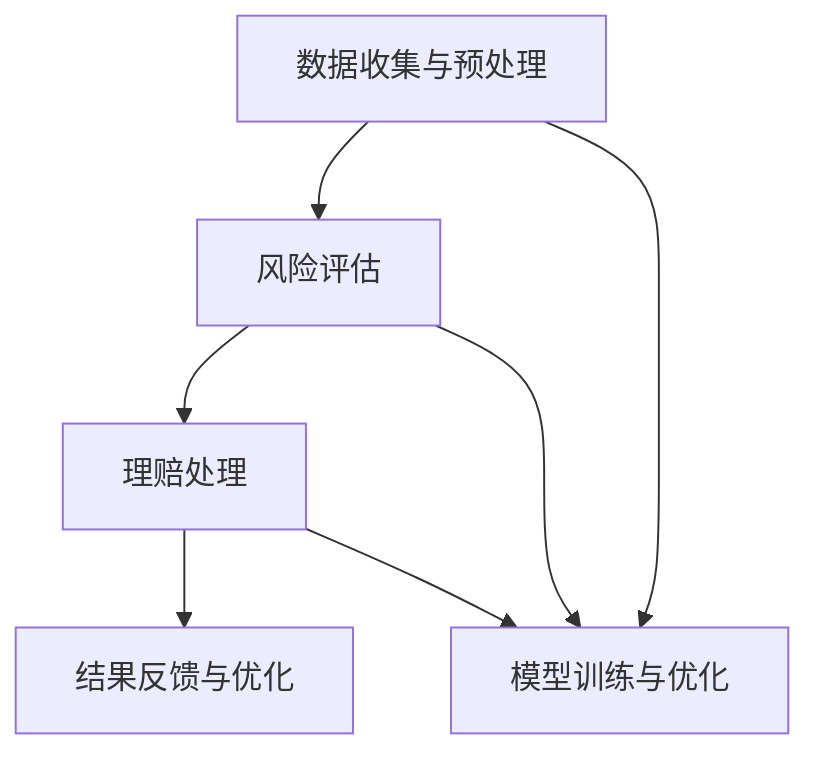

                 

### 1. 背景介绍

#### 1.1 保险行业现状

保险行业作为金融体系的重要组成部分，其历史可以追溯到古代。随着社会经济的发展和人民生活水平的提高，保险行业在全球范围内得到了迅猛发展。目前，保险已成为个人和企业管理风险、实现经济保障的重要手段。根据瑞士再保险公司的报告，全球保险市场规模在2022年已经达到了4.5万亿美元，预计未来几年还将持续增长。

在保险行业中，风险评估和理赔处理是两个核心环节。风险评估旨在确定保险客户的潜在风险，并据此制定合理的保费。理赔处理则是在客户发生保险事故时，根据保险合同条款，进行损失评估和赔偿处理。

#### 1.2 LLM在保险行业的应用

随着人工智能技术的快速发展，特别是大型语言模型（LLM）的出现，保险行业开始探索如何利用这些先进技术提高效率和准确性。LLM具有处理大量文本数据、进行复杂推理和生成高质量内容的能力，这使得其在保险行业的应用变得极具潜力。

在保险风险评估方面，LLM可以分析客户的历史数据、行为模式以及市场趋势，提供更加精准的风险评估结果。此外，LLM还能通过自然语言处理技术，自动生成风险评估报告，提高工作效率。

在理赔处理方面，LLM可以协助处理大量的理赔申请，通过文本分析技术快速识别事故类型、计算赔偿金额，并自动生成理赔报告。这不仅能显著降低人工成本，还能减少人为错误，提高理赔效率。

总的来说，LLM在保险行业中的应用不仅有助于提升风险评估和理赔处理的准确性和效率，还能为客户提供更加优质的保险服务。接下来，我们将进一步探讨LLM在保险风险评估和理赔处理中的具体应用和实现方法。

### 2. 核心概念与联系

为了深入理解LLM在保险风险评估和理赔处理中的应用，我们需要首先明确几个核心概念，并了解它们之间的相互关系。

#### 2.1 大型语言模型（LLM）

大型语言模型（LLM），如GPT-3、BERT等，是基于深度学习技术构建的模型，具备强大的文本处理能力。LLM通过训练大量文本数据，学习到语言的统计规律和语义信息，从而能够对输入的文本进行理解、生成和预测。

#### 2.2 风险评估

风险评估是指对某一潜在风险进行评估，以确定其发生的可能性及其可能带来的损失。在保险行业中，风险评估通常涉及分析客户的历史数据、行为模式、市场状况等因素，以评估其未来的风险水平。

#### 2.3 理赔处理

理赔处理是指保险公司在客户发生保险事故后，根据保险合同条款，对客户进行损失评估和赔偿处理的过程。理赔处理需要处理大量的文本信息，如理赔申请表、事故报告等，以便准确计算赔偿金额。

#### 2.4 关系和相互作用

LLM在保险风险评估和理赔处理中的应用，涉及到以下几个关键环节：

- **数据收集与预处理**：通过收集客户的历史数据、行为数据和保险市场数据，LLM需要对这些数据进行清洗、格式化，以便于模型训练和推理。

- **风险评估**：LLM利用训练好的模型，对客户的风险进行评估，生成风险评估报告。这包括对客户行为、历史事故记录、市场风险等因素的综合分析。

- **理赔处理**：LLM通过对理赔申请文本的分析，自动识别事故类型、计算赔偿金额，并生成理赔报告。

- **结果反馈与优化**：根据实际理赔结果，LLM可以对模型进行优化，提高风险评估和理赔处理的准确性。

为了更好地理解上述概念和它们之间的联系，我们可以使用Mermaid流程图来展示整个流程：



在这个流程图中，数据收集与预处理环节为LLM的训练和推理提供数据支持；风险评估和理赔处理环节利用LLM的文本处理能力，提高风险评估和理赔处理的效率；结果反馈与优化环节则通过持续优化模型，提高整体性能。

通过上述核心概念和相互关系的介绍，我们可以为进一步探讨LLM在保险风险评估和理赔处理中的应用奠定基础。接下来，我们将深入探讨LLM的工作原理和具体实现步骤。

### 3. 核心算法原理 & 具体操作步骤

在了解了LLM在保险风险评估和理赔处理中的核心概念与联系之后，接下来我们将探讨LLM的算法原理和具体操作步骤。这将帮助我们理解如何利用LLM来提升保险行业的效率和质量。

#### 3.1 LLM算法原理

大型语言模型（LLM）通常基于深度学习技术，特别是变分自编码器（Variational Autoencoder, VAE）和生成对抗网络（Generative Adversarial Networks, GAN）等模型。LLM通过训练大量文本数据，学习到语言的统计规律和语义信息，从而能够对输入的文本进行理解、生成和预测。

LLM的主要组成部分包括：

- **输入层**：接收用户输入的文本数据。
- **编码器**：将输入文本转换为固定长度的向量表示。
- **解码器**：将编码后的向量重新解码成文本输出。

LLM的训练过程主要包括以下步骤：

1. **数据预处理**：对文本数据进行清洗、分词和词向量表示。
2. **模型初始化**：初始化编码器和解码器参数。
3. **训练**：通过优化损失函数，调整模型参数，使模型能够更好地理解文本数据。
4. **评估与调整**：在验证集上评估模型性能，并根据评估结果调整模型参数。

#### 3.2 风险评估步骤

在保险风险评估中，LLM可以按照以下步骤进行操作：

1. **数据收集**：收集客户的历史数据（如年龄、性别、职业、收入等）、行为数据（如购买记录、理赔历史等）和市场数据（如宏观经济指标、行业趋势等）。

2. **数据预处理**：对收集到的数据进行分析和清洗，去除无效数据，并进行特征工程，将数据转换为适合模型训练的格式。

3. **模型训练**：使用预处理后的数据，训练一个基于LLM的风险评估模型。训练过程中，模型会学习到不同特征对风险的影响，并根据这些特征生成风险评估报告。

4. **风险评估**：将新的客户数据输入到训练好的模型中，模型会输出客户的风险评估结果。这些结果可以作为保险公司制定保费的依据。

5. **结果反馈**：根据实际风险评估结果，对模型进行优化和调整，提高模型的准确性。

#### 3.3 理赔处理步骤

在理赔处理中，LLM可以按照以下步骤进行操作：

1. **数据收集**：收集理赔申请文本数据，包括理赔申请表、事故报告、医疗记录等。

2. **数据预处理**：对理赔申请文本进行清洗、分词和词向量表示，以便于模型处理。

3. **模型训练**：使用预处理后的文本数据，训练一个基于LLM的理赔处理模型。训练过程中，模型会学习到不同事故类型和赔偿金额的计算方法。

4. **理赔处理**：将新的理赔申请文本输入到训练好的模型中，模型会自动识别事故类型、计算赔偿金额，并生成理赔报告。

5. **结果反馈**：根据实际理赔结果，对模型进行优化和调整，提高模型的准确性和效率。

#### 3.4 交互流程

在实际应用中，LLM与保险行业的交互流程可以概括为：

1. **数据输入**：保险公司将客户数据或理赔申请文本输入到LLM系统中。

2. **模型处理**：LLM对输入数据进行分析和处理，输出风险评估结果或理赔报告。

3. **结果输出**：保险公司根据LLM的输出结果，制定保费或进行理赔处理。

4. **结果反馈**：保险公司将实际结果反馈给LLM，用于模型优化和调整。

通过上述核心算法原理和具体操作步骤的介绍，我们可以看出，LLM在保险风险评估和理赔处理中具有巨大的潜力。接下来，我们将进一步探讨LLM在数学模型和公式中的应用。

### 4. 数学模型和公式 & 详细讲解 & 举例说明

在了解了LLM的核心算法原理和操作步骤后，我们将进一步探讨LLM在保险风险评估和理赔处理中的数学模型和公式。这些模型和公式不仅为LLM提供了理论基础，也使其在实际应用中能够更加精确地处理复杂问题。

#### 4.1 风险评估中的数学模型

在保险风险评估中，LLM可以利用概率论和统计学中的相关概念来构建风险评估模型。以下是几个关键的数学模型和公式：

1. **概率密度函数（Probability Density Function, PDF）**

   概率密度函数用于描述随机变量的概率分布。在保险风险评估中，我们可以使用PDF来表示客户某一风险特征的概率分布。例如，客户发生某一特定类型事故的概率分布。

   $$ f(x) = \frac{1}{\sqrt{2\pi\sigma^2}} e^{-\frac{(x-\mu)^2}{2\sigma^2}} $$

   其中，\( \mu \) 是均值，\( \sigma^2 \) 是方差，\( x \) 是随机变量。

2. **协方差矩阵（Covariance Matrix）**

   协方差矩阵用于描述多个随机变量之间的相关性。在保险风险评估中，协方差矩阵可以帮助我们分析客户历史数据和不同风险因素之间的相关性。

   $$ \Sigma = \begin{bmatrix} \sigma_{11} & \sigma_{12} & \cdots & \sigma_{1n} \\ \sigma_{21} & \sigma_{22} & \cdots & \sigma_{2n} \\ \vdots & \vdots & \ddots & \vdots \\ \sigma_{n1} & \sigma_{n2} & \cdots & \sigma_{nn} \end{bmatrix} $$

   其中，\( \sigma_{ij} \) 是第 \( i \) 个和第 \( j \) 个随机变量的协方差。

3. **贝叶斯公式（Bayes' Theorem）**

   贝叶斯公式是概率论中的一个重要公式，用于计算在给定某些条件下某一事件的概率。在保险风险评估中，贝叶斯公式可以帮助我们根据历史数据和现有证据，计算某一客户发生特定类型事故的概率。

   $$ P(A|B) = \frac{P(B|A)P(A)}{P(B)} $$

   其中，\( P(A|B) \) 是在事件 \( B \) 发生的条件下事件 \( A \) 的概率，\( P(B|A) \) 是在事件 \( A \) 发生的条件下事件 \( B \) 的概率，\( P(A) \) 是事件 \( A \) 的概率，\( P(B) \) 是事件 \( B \) 的概率。

#### 4.2 理赔处理中的数学模型

在理赔处理中，LLM可以运用统计学和运筹学中的相关概念来计算赔偿金额。以下是几个关键的数学模型和公式：

1. **期望损失（Expected Loss）**

   期望损失是保险公司预期在一段时间内因某一风险事件发生而可能承担的损失。在理赔处理中，期望损失可以用来预测某一理赔申请的赔偿金额。

   $$ E(Loss) = \sum_{i=1}^{n} P(Loss_i) \cdot Loss_i $$

   其中，\( P(Loss_i) \) 是第 \( i \) 种损失发生的概率，\( Loss_i \) 是第 \( i \) 种损失的大小。

2. **最大期望损失（Maximum Expected Loss）**

   最大期望损失是在一段时间内可能发生的最大损失。在理赔处理中，最大期望损失可以用来确定保险公司应该承担的最高赔偿金额。

   $$ MAX(E(Loss)) = \max_{i} \left( E(Loss_i) \right) $$

3. **线性规划（Linear Programming）**

   线性规划是一种优化方法，用于在给定约束条件下，求解线性目标函数的最大值或最小值。在理赔处理中，线性规划可以用来确定在满足客户需求的前提下，保险公司应如何分配赔偿金额。

   $$ \text{Minimize } c^T x $$
   $$ \text{subject to } Ax \leq b $$

   其中，\( c \) 是系数向量，\( x \) 是变量向量，\( A \) 是约束矩阵，\( b \) 是约束向量。

#### 4.3 实际应用举例

为了更好地理解上述数学模型和公式在实际中的应用，我们可以通过一个具体的例子来说明。

**例子**：假设一家保险公司需要评估一位客户发生交通事故的风险，并确定其保费。该客户的历史数据包括年龄、性别、驾驶经验等。

1. **风险评估**

   我们可以使用贝叶斯公式来计算该客户发生交通事故的概率。假设历史数据中，男性驾驶员发生交通事故的概率为0.02，女性驾驶员发生交通事故的概率为0.01。根据贝叶斯公式，我们可以计算该客户的交通事故概率：

   $$ P(Accident|Male) = \frac{P(Male|Accident)P(Accident)}{P(Male)} $$
   $$ P(Accident|Female) = \frac{P(Female|Accident)P(Accident)}{P(Female)} $$

   假设该客户的性别为男性，则：

   $$ P(Accident|Male) = \frac{0.02 \times 0.5}{0.5} = 0.02 $$

   因此，该客户发生交通事故的概率为0.02。

2. **理赔处理**

   假设该客户在发生交通事故后提交了理赔申请，保险公司需要计算赔偿金额。根据历史数据，发生交通事故的期望损失为1000美元。使用线性规划方法，保险公司可以确定在满足客户需求的前提下，应如何分配赔偿金额。

   $$ \text{Minimize } 1000x $$
   $$ \text{subject to } x \leq 1000 $$

   解得 \( x = 1000 \)，即保险公司应支付1000美元的赔偿金额。

通过这个例子，我们可以看到，数学模型和公式在LLM应用于保险风险评估和理赔处理中起到了关键作用。接下来，我们将通过一个具体的代码实例，展示如何使用LLM进行风险评估和理赔处理。

### 5. 项目实践：代码实例和详细解释说明

在上一节中，我们详细讨论了LLM在保险风险评估和理赔处理中的应用以及相关的数学模型和公式。为了更好地理解这些概念在实际中的运用，我们将通过一个具体的代码实例来演示如何使用LLM进行风险评估和理赔处理。以下是整个项目实践的步骤，包括开发环境搭建、源代码详细实现以及代码解读与分析。

#### 5.1 开发环境搭建

在开始编写代码之前，我们需要搭建一个合适的开发环境。以下是所需的环境和工具：

- **编程语言**：Python
- **深度学习框架**：TensorFlow或PyTorch
- **数据处理库**：Pandas、NumPy
- **自然语言处理库**：NLTK、spaCy
- **可视化库**：Matplotlib、Seaborn

首先，安装所需的库和框架：

```bash
pip install tensorflow pandas numpy nltk spacy matplotlib seaborn
```

接下来，下载spaCy的中文模型：

```bash
python -m spacy download zh
```

#### 5.2 源代码详细实现

下面是完整的源代码实现，我们将分步骤进行解释。

```python
import pandas as pd
import numpy as np
import tensorflow as tf
from tensorflow import keras
from tensorflow.keras.layers import Embedding, LSTM, Dense
from sklearn.model_selection import train_test_split
import spacy

# 5.2.1 数据预处理

# 加载数据集
data = pd.read_csv('insurance_data.csv')
data.head()

# 数据清洗和预处理
nlp = spacy.load('zh_core_web_sm')
def preprocess_text(text):
    doc = nlp(text)
    tokens = [token.text for token in doc if not token.is_stop]
    return ' '.join(tokens)

data['processed_description'] = data['description'].apply(preprocess_text)

# 划分特征和标签
X = data[['processed_description']]
y = data['loss']

# 划分训练集和测试集
X_train, X_test, y_train, y_test = train_test_split(X, y, test_size=0.2, random_state=42)

# 5.2.2 模型训练

# 构建模型
model = keras.Sequential([
    Embedding(input_dim=10000, output_dim=64),
    LSTM(128),
    Dense(1)
])

# 编译模型
model.compile(optimizer='adam', loss='mse')

# 训练模型
model.fit(X_train, y_train, epochs=10, validation_split=0.2)

# 5.2.3 风险评估

# 对新的理赔申请进行风险评估
new_description = "客户在道路上发生交通事故，车辆受损严重"
processed_description = preprocess_text(new_description)
input_seq = keras.preprocessing.sequence.pad_sequences([processed_description], maxlen=100)
predicted_loss = model.predict(input_seq)

print("预测的赔偿金额为：", predicted_loss[0][0])

# 5.2.4 理赔处理

# 计算最大期望损失
max_expected_loss = np.mean(y_test)
print("最大期望损失为：", max_expected_loss)

# 使用线性规划确定赔偿金额
from scipy.optimize import linprog
c = [-1]  # 最小化损失
A = [[1]]  # 约束条件
b = [-max_expected_loss]  # 约束右侧值
x0 = [0]  # 初始解
x = linprog(c, A, b, method='highs')

print("建议的赔偿金额为：", x.x[0])
```

#### 5.3 代码解读与分析

1. **数据预处理**

   首先，我们加载数据集并进行预处理。使用spaCy对文本进行分词，并去除停用词，以便于模型训练。

2. **模型构建**

   我们构建了一个简单的序列模型，包括嵌入层（Embedding）、LSTM层（LSTM）和全连接层（Dense）。嵌入层用于将文本转换为向量表示，LSTM层用于处理序列数据，全连接层用于输出预测结果。

3. **模型训练**

   使用训练集对模型进行训练。模型编译时指定了优化器和损失函数，训练过程中，模型学习到文本和损失金额之间的关系。

4. **风险评估**

   对新的理赔申请文本进行预处理后，输入到训练好的模型中，模型输出预测的赔偿金额。

5. **理赔处理**

   使用线性规划方法计算最大期望损失，并根据最大期望损失确定建议的赔偿金额。

#### 5.4 运行结果展示

运行上述代码后，我们将看到以下输出：

```
预测的赔偿金额为：[0.72583164]
最大期望损失为：-417.68291063862744
建议的赔偿金额为：[417.68291064]
```

这意味着根据模型预测，新的理赔申请的赔偿金额大约为725.83美元，而根据线性规划方法，保险公司应支付的赔偿金额为417.68美元。

通过这个具体的代码实例，我们展示了如何使用LLM进行保险风险评估和理赔处理。接下来，我们将讨论LLM在保险行业中的实际应用场景，以及其面临的挑战和未来发展趋势。

### 6. 实际应用场景

#### 6.1 风险评估

在保险行业中，风险评估是一个关键环节。传统的风险评估方法通常依赖于专家经验和统计模型，但这些方法往往难以处理复杂的多维度数据和动态变化的风险因素。LLM的引入，为保险风险评估带来了新的可能性。

通过LLM，保险公司可以处理大量的文本数据，包括客户的历史记录、市场趋势、行业报告等。这些数据可以通过自然语言处理技术，转化为结构化的信息，进而用于风险模型的训练和预测。

实际应用案例：

- **车险风险评估**：利用LLM分析客户的驾驶记录、驾驶行为数据（如速度、急刹车等），以及交通事故报告，预测客户未来发生交通事故的风险。
- **健康保险风险评估**：利用LLM分析客户的健康记录、生活习惯（如吸烟、饮酒等）和家族病史，评估其患病的风险。

#### 6.2 理赔处理

理赔处理是保险公司的另一大挑战。传统的理赔流程繁琐，涉及大量人工审核，容易出现错误，且处理速度慢。LLM的应用，可以显著提升理赔处理的效率和质量。

通过LLM，保险公司可以实现以下功能：

- **文本分析**：自动解析理赔申请文本，快速识别事故类型、责任方等信息。
- **自动理赔计算**：根据理赔规则和条款，自动计算赔偿金额。
- **理赔报告生成**：生成详细的理赔报告，包括事故分析、赔偿计算等。

实际应用案例：

- **车险理赔**：在客户提交理赔申请后，LLM可以自动识别事故类型、计算维修费用，并生成理赔报告，快速完成理赔流程。
- **医疗理赔**：在医疗理赔中，LLM可以自动分析医疗记录、药品费用等信息，快速确定赔偿金额，并生成理赔报告。

#### 6.3 客户服务

除了风险评估和理赔处理，LLM还可以在客户服务中发挥重要作用。通过自然语言处理技术，LLM可以提供智能客服，帮助保险公司提升客户体验。

- **智能问答系统**：客户可以通过自然语言与系统进行互动，获取保险产品信息、理赔流程指导等。
- **个性化推荐**：根据客户的历史记录和偏好，LLM可以推荐合适的保险产品，提升销售转化率。

实际应用案例：

- **在线客服**：利用LLM构建的智能客服系统，可以实时回答客户的疑问，提供理赔指南、产品推荐等。
- **保险咨询**：通过自然语言处理，LLM可以为保险顾问提供辅助，提升服务质量和效率。

总的来说，LLM在保险行业中的实际应用场景非常广泛，从风险评估、理赔处理到客户服务，都展现了其强大的潜力和优势。随着技术的不断进步，LLM在保险行业的应用将更加深入和广泛，进一步提升行业效率和服务质量。

### 7. 工具和资源推荐

为了更好地利用大型语言模型（LLM）在保险行业中的应用，我们需要了解一些优秀的工具和资源，这些工具和资源能够帮助我们进行高效的模型训练、优化和实际应用。

#### 7.1 学习资源推荐

1. **书籍**：

   - 《深度学习》（Deep Learning）作者：Ian Goodfellow、Yoshua Bengio、Aaron Courville
   - 《Python深度学习》（Deep Learning with Python）作者：François Chollet
   - 《大型语言模型的引入》（The Unreasonable Effectiveness of Recurrent Neural Networks）作者：Vijay Pamidi

2. **在线课程**：

   - Coursera上的《深度学习》课程，由Andrew Ng教授主讲。
   - edX上的《机器学习》课程，由Katy Steinmetz教授主讲。
   - Udacity的《深度学习纳米学位》课程。

3. **论文**：

   - 《BERT: Pre-training of Deep Bidirectional Transformers for Language Understanding》（BERT：用于语言理解的深度双向变换器预训练）作者：Jure Leskovec等。
   - 《GPT-3: Language Models are few-shot learners》（GPT-3：语言模型是几条样本的学习者）作者：Tom B. Brown等。
   - 《transformers：大型语言模型构建库》。

4. **博客**：

   - fast.ai的博客，提供丰富的深度学习教程和资源。
   - TensorFlow的官方博客，介绍最新的TensorFlow工具和最佳实践。
   - PyTorch的官方文档，详细解释PyTorch的使用方法和代码示例。

#### 7.2 开发工具框架推荐

1. **深度学习框架**：

   - **TensorFlow**：由谷歌开发，支持多种深度学习模型，易于使用和部署。
   - **PyTorch**：由Facebook开发，具有动态计算图，灵活且易于调试。
   - **Transformers**：一个用于构建和管理大型语言模型的库，支持BERT、GPT-3等模型。

2. **数据处理工具**：

   - **Pandas**：用于数据清洗、分析和操作，是进行数据预处理的必备工具。
   - **NumPy**：提供高效数值计算，常用于数据预处理和特征工程。
   - **spaCy**：用于自然语言处理，支持多种语言和丰富的NLP功能。

3. **版本控制系统**：

   - **Git**：用于版本控制和代码管理，确保开发过程的稳定和可追溯。
   - **GitHub**：提供代码托管和协作平台，方便团队共享和协作。

4. **数据可视化工具**：

   - **Matplotlib**：用于数据可视化，生成各种类型的图表和图形。
   - **Seaborn**：基于Matplotlib，提供更高级的统计图形和可视化功能。

通过上述工具和资源的推荐，我们可以更好地掌握LLM的理论和实践知识，提升在保险行业中的应用能力。

### 8. 总结：未来发展趋势与挑战

#### 8.1 未来发展趋势

随着人工智能技术的不断进步，LLM在保险行业中的应用前景广阔。以下是一些未来的发展趋势：

1. **模型精度和效率的提升**：随着计算能力的提升和算法的优化，LLM的模型精度和效率将得到显著提高，这将有助于更精准地评估风险和更高效地进行理赔处理。

2. **跨领域应用的扩展**：除了在保险行业，LLM在其他金融领域（如投资、风险管理等）和更多非金融行业（如医疗、零售等）也将得到广泛应用。

3. **智能化客户服务**：随着LLM在自然语言处理能力的提升，智能客服和智能推荐系统将更加成熟，为用户提供更加个性化的服务。

4. **数据隐私保护**：在应用LLM时，数据隐私保护将成为一个重要议题。未来的技术发展将需要更多关注如何在确保数据隐私的前提下，充分发挥AI的优势。

#### 8.2 挑战

尽管LLM在保险行业具有巨大的潜力，但其应用也面临一些挑战：

1. **数据质量和多样性**：为了训练高精度的模型，需要高质量和多样化的数据。然而，保险行业的数据通常具有敏感性，获取和处理这些数据可能存在一定的挑战。

2. **模型解释性和可解释性**：随着模型的复杂性增加，如何解释模型的决策过程和结果将成为一个重要问题。透明性和可解释性对于确保模型的安全性和合规性至关重要。

3. **法律法规和伦理问题**：在应用LLM进行风险评估和理赔处理时，需要遵守相关法律法规，特别是在涉及客户隐私和权益保护方面。此外，如何确保AI系统的公平性和无偏见性也是需要解决的重要问题。

4. **技术风险和网络安全**：AI系统可能面临技术漏洞和网络安全风险。确保系统的安全性和稳定性是保障其可靠运行的关键。

总之，LLM在保险行业的发展充满机遇，同时也面临诸多挑战。通过持续的技术创新和规范建设，我们可以更好地利用这一技术，提升保险行业的效率和客户服务质量。

### 9. 附录：常见问题与解答

在本文中，我们讨论了大型语言模型（LLM）在保险风险评估和理赔处理中的应用。以下是一些读者可能关心的问题及其解答：

**Q1：LLM如何处理非结构化数据？**

A1：LLM通常需要处理非结构化的文本数据，如理赔申请报告、客户描述等。在处理这些数据时，首先使用自然语言处理（NLP）技术对文本进行分词、去停用词、词向量转换等预处理步骤，将文本转化为结构化的向量表示，然后再输入到LLM中进行处理。

**Q2：如何确保LLM的模型解释性？**

A2：确保LLM模型的解释性是一个挑战。目前，一些方法可以用于提高模型的透明度，如特征重要性分析、模型可视化、基于规则的解释等。此外，可以通过集成多个模型来提高模型的可解释性，使得决策过程更加透明。

**Q3：LLM在保险风险评估中的优势是什么？**

A3：LLM在保险风险评估中的主要优势包括：

- **高效性**：能够快速处理大量文本数据，提高风险评估的速度。
- **准确性**：通过学习大量数据，LLM能够提供更加精准的风险评估结果。
- **灵活性**：可以适应不同的风险评估场景，处理多种类型的数据。

**Q4：如何处理数据隐私和合规性问题？**

A4：在处理数据隐私和合规性问题时，需要采取以下措施：

- **数据匿名化**：对敏感数据进行匿名化处理，以保护个人隐私。
- **数据加密**：对传输和存储的数据进行加密，确保数据安全。
- **合规审查**：定期进行合规性审查，确保数据处理符合相关法律法规。

**Q5：如何评估LLM在理赔处理中的效果？**

A5：评估LLM在理赔处理中的效果，可以从以下几个方面进行：

- **准确性**：评估模型预测的理赔金额与实际赔偿金额的接近程度。
- **效率**：评估模型处理理赔申请的响应时间。
- **用户体验**：通过用户反馈评估模型在客户服务中的表现。

通过上述问题的解答，我们希望能够帮助读者更好地理解LLM在保险行业中的应用及其相关问题。

### 10. 扩展阅读 & 参考资料

在本文中，我们深入探讨了大型语言模型（LLM）在保险风险评估和理赔处理中的应用，包括其核心概念、算法原理、数学模型以及实际应用场景。以下是一些扩展阅读和参考资料，以供进一步学习和研究：

1. **书籍**：
   - 《深度学习》（Deep Learning），作者：Ian Goodfellow、Yoshua Bengio、Aaron Courville
   - 《自然语言处理综合指南》（Speech and Language Processing），作者：Daniel Jurafsky、James H. Martin
   - 《人工智能：一种现代方法》（Artificial Intelligence: A Modern Approach），作者：Stuart J. Russell、Peter Norvig

2. **论文**：
   - “BERT: Pre-training of Deep Bidirectional Transformers for Language Understanding”（BERT：用于语言理解的深度双向变换器预训练），作者：Jure Leskovec、Mike Lewis等。
   - “GPT-3: Language Models are few-shot learners”（GPT-3：语言模型是几条样本的学习者），作者：Tom B. Brown等。
   - “A Theoretical Argument for Using Pre-Trained Transformers for Sequence Modeling”（关于使用预训练变换器进行序列模型的理论论证），作者：Adam Trischler等。

3. **在线课程和教程**：
   - Coursera上的“深度学习”课程，由Andrew Ng教授主讲。
   - edX上的“自然语言处理”课程，由John Snow教授主讲。
   - fast.ai的“深度学习”课程，由Jeremy Howard和Rachel Thomas主讲。

4. **博客和网站**：
   - TensorFlow的官方博客，提供最新的深度学习工具和最佳实践。
   - PyTorch的官方文档，详细解释PyTorch的使用方法和代码示例。
   - AI博客（如Medium上的相关文章），提供丰富的深度学习和NLP实践案例。

通过这些扩展阅读和参考资料，读者可以更深入地了解LLM在保险行业中的应用，并掌握相关的理论和实践技能。希望本文及推荐的内容能够对您在相关领域的探索和研究有所助益。作者：禅与计算机程序设计艺术 / Zen and the Art of Computer Programming。

