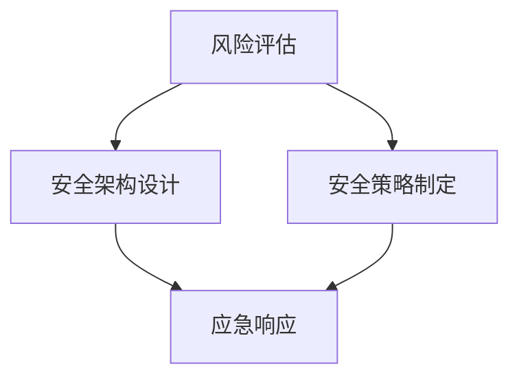
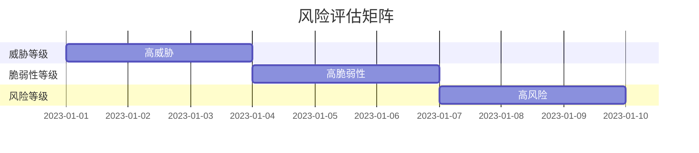
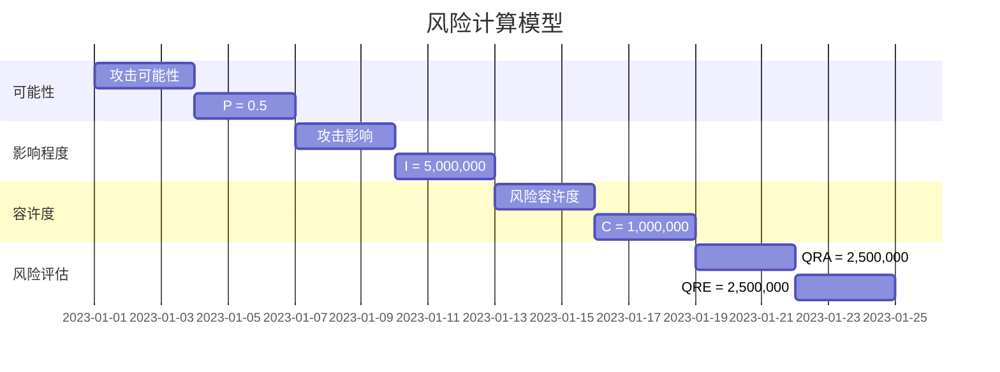
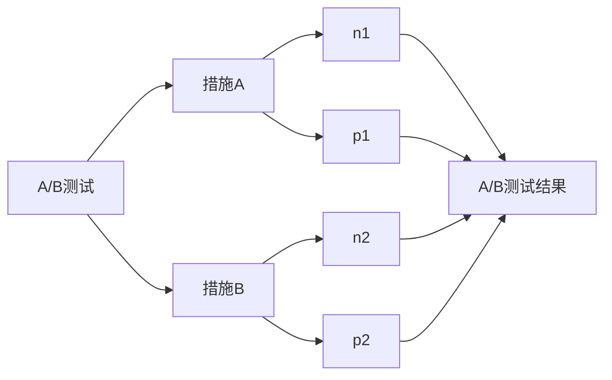
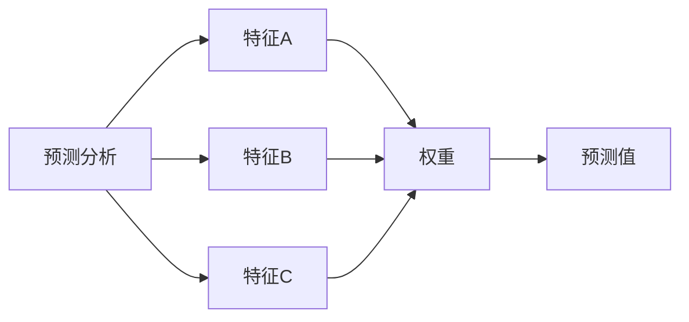
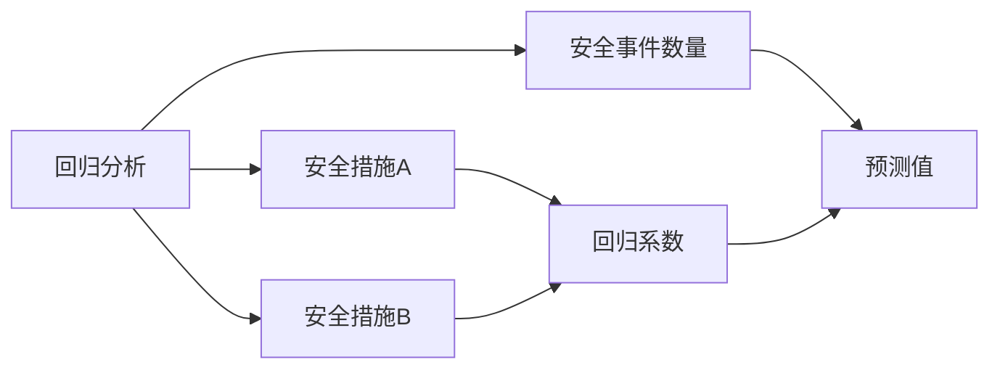

                 

### 1. 背景介绍

在当今数字化时代，信息安全已经成为企业和组织至关重要的一环。特别是在创业公司中，信息安全不仅仅是技术问题，更是关乎企业生存和发展的战略性任务。创业公司在资源有限、团队规模较小的背景下，面临着与大型企业截然不同的安全挑战。因此，信息安全经理在创业公司的角色和责任显得尤为重要。

创业公司通常具备以下几个显著特点：

1. **资源有限**：初创企业往往资金和人力资源相对紧张，无法像大公司那样投入大量资金和人力进行安全防护。
2. **快速成长**：创业公司发展迅速，业务扩展带来的系统复杂度和数据量都在不断增长，这为信息安全带来了额外的挑战。
3. **技术多样**：初创企业可能采用多种新兴技术和平台，这些技术的安全性可能还未得到充分验证。
4. **竞争压力**：创业公司在市场竞争中往往更加敏感，信息泄露或安全事件可能直接影响业务发展和客户信任。

在这样的背景下，信息安全经理的任务不仅仅是保护公司的数据资产，还需要在资源有限的情况下，制定出既有效又可行的安全策略，并在出现安全事件时迅速响应和恢复。本文将围绕以下内容展开：

1. **核心概念与联系**：介绍信息安全管理的核心概念，以及它们之间的相互关系。
2. **核心算法原理 & 具体操作步骤**：探讨创业公司制定安全策略的方法论，包括风险评估、安全架构设计、安全策略制定等。
3. **数学模型和公式 & 详细讲解 & 举例说明**：使用数学模型和公式来解释安全策略的量化方法，并通过实例进行说明。
4. **项目实践：代码实例和详细解释说明**：通过具体项目实例，展示安全策略在实践中的应用和实现。
5. **实际应用场景**：分析信息安全经理在创业公司可能面临的具体场景，包括常见的安全威胁和应对措施。
6. **工具和资源推荐**：推荐学习资源、开发工具和框架，帮助信息安全经理提升自身能力和工作效率。
7. **总结：未来发展趋势与挑战**：总结信息安全管理的未来趋势和创业公司在安全领域的挑战。

本文旨在为信息安全经理提供一套系统的、实用的安全策略制定和应急响应框架，帮助他们更好地应对创业过程中的安全挑战。

### 2. 核心概念与联系

在探讨如何制定安全策略与应急响应之前，我们需要先了解几个核心概念，这些概念相互关联，构成了信息安全管理的基石。以下是对这些核心概念的简要介绍，并使用Mermaid流程图来展示它们之间的相互关系。

#### 2.1 风险评估

风险评估是信息安全管理的第一步，旨在识别企业面临的各种潜在威胁和风险，并评估其可能对企业造成的影响。风险评估通常包括以下几个步骤：

1. **威胁识别**：识别可能对企业构成威胁的因素，如网络攻击、恶意软件、内部威胁等。
2. **脆弱性识别**：识别企业系统中存在的安全漏洞，如不安全的配置、缺乏更新的软件等。
3. **风险分析**：分析威胁和脆弱性可能导致的结果，包括损失的程度、发生概率等。
4. **风险优先级排序**：根据风险的可能性和影响，对风险进行优先级排序。

#### 2.2 安全架构设计

安全架构设计是在理解企业风险的基础上，设计一套全面的安全体系，以保护企业的关键资产。安全架构设计通常包括以下几个关键部分：

1. **访问控制**：通过身份验证、授权等手段，控制对系统资源的访问。
2. **加密技术**：使用加密算法来保护数据的机密性和完整性。
3. **安全监控**：部署监控工具，实时监控网络流量和系统活动，以便及时发现潜在的安全威胁。
4. **应急响应计划**：制定应对安全事件的预案，确保在事件发生时能够快速响应和恢复。

#### 2.3 安全策略制定

安全策略是基于风险评估和安全架构设计的指导性文件，旨在明确企业的安全目标、策略和操作流程。安全策略通常包括以下几个关键要素：

1. **安全目标**：明确企业希望实现的安全目标，如保护客户数据、防止数据泄露等。
2. **安全措施**：列出为实现安全目标所需采取的具体措施，如使用防火墙、定期进行安全培训等。
3. **操作流程**：定义在安全事件发生时的操作流程，确保能够迅速响应和处置。
4. **审计和合规**：确保安全策略符合相关的法规和标准，如GDPR、ISO 27001等。

#### 2.4 应急响应

应急响应是在安全事件发生时，确保能够迅速、有效地应对和恢复的系统流程。应急响应通常包括以下几个步骤：

1. **事件识别**：及时发现和识别安全事件，如网络入侵、数据泄露等。
2. **初步评估**：评估事件的影响范围和严重性，决定是否启动应急响应计划。
3. **响应行动**：根据应急响应计划，采取行动，包括隔离受影响系统、通知相关人员、开始取证等。
4. **事件恢复**：在事件得到控制后，进行系统恢复和数据恢复，确保业务能够正常运营。

#### Mermaid 流程图

以下是这些核心概念之间的Mermaid流程图：



通过上述流程图，我们可以看到风险评估是安全架构设计、安全策略制定和应急响应的基础。安全架构设计和安全策略制定相互关联，为应急响应提供指导和支持。应急响应则是在安全事件发生时，确保能够迅速采取行动的关键环节。

#### 总结

理解这些核心概念及其相互关系，对于信息安全经理来说至关重要。只有在全面了解企业面临的威胁和风险，并设计出有效的安全架构和策略，才能在安全事件发生时，迅速响应和恢复。下一节将深入探讨如何基于这些核心概念，制定具体的、可行的安全策略。

### 3. 核心算法原理 & 具体操作步骤

在了解了信息安全管理的核心概念后，我们接下来将探讨如何将这些概念应用到实际操作中。本文将详细阐述创业公司在制定安全策略和应急响应计划时，可以遵循的具体操作步骤，以帮助信息安全经理在实践中有效应对安全挑战。

#### 3.1 风险评估

风险评估是制定安全策略的第一步，其核心在于识别和评估企业所面临的风险。以下是风险评估的具体操作步骤：

1. **威胁识别**：
   - **内部访谈**：通过访谈企业内部员工，了解可能存在的内部威胁，如员工恶意行为、无意中的安全漏洞等。
   - **外部调查**：通过公共数据库、网络安全论坛等渠道，收集外部威胁信息，如已公开的网络攻击案例、恶意软件活动等。
   - **漏洞扫描**：使用专业的漏洞扫描工具，对企业的IT系统进行扫描，识别已知的漏洞和潜在的安全风险。

2. **脆弱性识别**：
   - **系统审计**：对企业的IT系统进行全面审计，识别系统配置、软件版本、网络架构等方面的脆弱性。
   - **安全测试**：通过渗透测试、代码审计等方法，发现系统中的潜在安全漏洞。

3. **风险分析**：
   - **威胁可能性评估**：根据威胁的威胁程度和发生概率，对威胁进行评分。
   - **脆弱性影响评估**：评估系统漏洞可能导致的损失程度，包括财务损失、声誉损失等。
   - **综合风险评估**：将威胁可能性和脆弱性影响结合起来，对整体风险进行评估和排序。

4. **风险优先级排序**：
   - **高优先级**：对威胁和漏洞进行优先级排序，重点关注那些高威胁、高影响的漏洞。
   - **低优先级**：对那些威胁低、影响小的漏洞进行标记，但仍然需要定期复查。

#### 3.2 安全架构设计

安全架构设计是在风险评估的基础上，构建一个全面的安全防护体系。以下是安全架构设计的主要步骤：

1. **访问控制**：
   - **身份验证**：通过用户名和密码、多因素认证等方式，确保只有授权用户才能访问系统资源。
   - **授权管理**：根据用户的角色和职责，定义用户对系统资源的访问权限。

2. **加密技术**：
   - **数据加密**：对存储和传输的数据进行加密，确保数据在未授权的情况下无法读取。
   - **通信加密**：使用SSL/TLS等协议，确保网络通信的机密性和完整性。

3. **安全监控**：
   - **入侵检测**：部署入侵检测系统（IDS），实时监控网络流量和系统活动，识别潜在的安全威胁。
   - **日志管理**：收集并分析系统日志，发现异常行为和安全事件。

4. **应急响应计划**：
   - **预案制定**：制定详细的应急响应计划，包括事件识别、初步评估、响应行动和事件恢复等步骤。
   - **培训演练**：定期进行安全培训和应急响应演练，确保团队能够在事件发生时迅速行动。

#### 3.3 安全策略制定

安全策略是基于安全架构设计的指导性文件，以下是制定安全策略的步骤：

1. **安全目标**：
   - **明确目标**：根据企业的业务需求和信息安全要求，明确安全目标，如保护客户数据、防止数据泄露等。

2. **安全措施**：
   - **技术措施**：列出为实现安全目标所需采取的技术措施，如部署防火墙、安装防病毒软件等。
   - **管理措施**：定义安全管理制度，包括安全培训、安全审计、安全合规等。

3. **操作流程**：
   - **事件处理流程**：明确在安全事件发生时，如何进行事件识别、初步评估、响应行动和事件恢复等步骤。
   - **日常管理流程**：定义日常的安全管理流程，如系统更新、安全检查、安全演练等。

4. **审计和合规**：
   - **内部审计**：定期对企业安全策略和操作流程进行审计，确保其有效性和合规性。
   - **外部审核**：根据相关法规和标准，进行外部审核，确保企业的信息安全策略符合法律要求。

#### 3.4 应急响应

应急响应是在安全事件发生时，确保能够迅速、有效地应对和恢复的关键步骤。以下是应急响应的操作步骤：

1. **事件识别**：
   - **实时监控**：通过入侵检测系统（IDS）、安全日志等工具，实时监控网络流量和系统活动，识别潜在的安全事件。
   - **人工汇报**：通过员工报告、用户反馈等方式，及时发现安全事件。

2. **初步评估**：
   - **评估影响**：评估事件的影响范围和严重性，决定是否需要启动应急响应计划。
   - **初步处置**：根据事件的初步评估结果，采取相应的初步处置措施，如隔离受影响的系统、通知相关人员等。

3. **响应行动**：
   - **应急响应计划**：根据预先制定的应急响应计划，迅速采取行动，包括通知相关部门、启动应急响应团队等。
   - **取证分析**：收集相关证据，对事件进行详细分析和取证，为后续的追责和整改提供依据。

4. **事件恢复**：
   - **系统恢复**：在事件得到控制后，进行系统恢复和数据恢复，确保业务能够正常运营。
   - **后续整改**：对事件的原因和影响进行总结，提出整改措施，防止类似事件再次发生。

#### 总结

通过上述步骤，信息安全经理可以系统地制定出适合创业公司的安全策略和应急响应计划。在实际操作中，需要根据企业的具体情况进行调整和优化，以确保安全策略的有效性和适应性。在下一节中，我们将通过具体的数学模型和公式，进一步探讨如何量化安全策略的制定和评估。

### 4. 数学模型和公式 & 详细讲解 & 举例说明

在信息安全管理的实际操作中，量化分析是制定和评估安全策略的重要手段。通过数学模型和公式，我们可以更准确地评估风险、设计安全架构和制定安全策略。以下将介绍几个常用的数学模型和公式，并对其进行详细讲解和举例说明。

#### 4.1 风险评估模型

风险评估是信息安全管理的核心环节之一，常用的风险评估模型包括风险矩阵和风险计算模型。以下是这些模型的详细解释：

##### 4.1.1 风险矩阵

风险矩阵是一种定性分析工具，用于评估风险的威胁程度和脆弱性。风险矩阵通常包含以下要素：

1. **威胁等级**：根据威胁的严重程度，将其分为高、中、低三个等级。
2. **脆弱性等级**：根据系统的脆弱性程度，将其分为高、中、低三个等级。
3. **风险等级**：通过威胁等级和脆弱性等级的交叉，得到风险等级，通常也分为高、中、低三个等级。

**风险矩阵公式**：
\[ 风险等级 = 威胁等级 \times 脆弱性等级 \]

**举例说明**：

假设企业识别到一个潜在的网络钓鱼攻击威胁，威胁等级为高。同时，企业的用户账户系统存在弱密码问题，脆弱性等级也为高。根据风险矩阵，该风险等级为高风险。



##### 4.1.2 风险计算模型

风险计算模型是一种定量分析工具，通过计算风险的可能性及其可能的影响，来评估风险。常用的风险计算模型包括定量风险分析和定量风险评价。

**定量风险分析（QRA）**：
\[ QRA = P \times I \]

其中，\( P \) 是风险的可能性，\( I \) 是风险的影响。

**定量风险评价（QRE）**：
\[ QRE = QRA \times C \]

其中，\( C \) 是风险的容许度，表示企业愿意接受的风险水平。

**举例说明**：

假设企业识别到一个网络攻击威胁，攻击成功的概率为0.5，攻击成功的影响为5百万美元。如果企业的风险容许度为1百万美元，则该风险的可能性和影响分别为：

\[ QRA = 0.5 \times 5,000,000 = 2,500,000 \]
\[ QRE = 2,500,000 \times 1,000,000 = 2,500,000 \]

由于QRE超过了企业的风险容许度，因此这是一个需要重点关注的高风险。



#### 4.2 安全架构设计模型

安全架构设计是确保企业信息安全的重要步骤。常用的安全架构设计模型包括贝叶斯网络、贝塔分布等。

##### 4.2.1 贝叶斯网络

贝叶斯网络是一种图形模型，用于表示多个随机变量之间的条件依赖关系。在安全架构设计中，贝叶斯网络可以用于分析不同安全组件之间的相互影响。

**贝叶斯网络公式**：
\[ P(A|B) = \frac{P(B|A) \times P(A)}{P(B)} \]

其中，\( P(A|B) \) 表示在B发生的条件下，A发生的概率；\( P(B|A) \) 表示在A发生的条件下，B发生的概率；\( P(A) \) 和 \( P(B) \) 分别表示A和B的先验概率。

**举例说明**：

假设企业的防火墙（A）和入侵检测系统（B）是两个重要的安全组件。根据以往的数据，防火墙失效的概率为0.1，入侵检测系统失效的概率为0.05。如果入侵检测系统检测到攻击（B），那么防火墙失效的概率为0.5。根据贝叶斯网络，可以计算出防火墙失效的概率。

\[ P(A|B) = \frac{P(B|A) \times P(A)}{P(B)} = \frac{0.5 \times 0.1}{0.05} = 0.1 \]

这意味着，在入侵检测系统检测到攻击的条件下，防火墙失效的概率为10%。

```mermaid
graph LR
A[防火墙失效] --> B[入侵检测系统失效]
A-->C[先验概率]
B-->C
D[检测到攻击]
E[后验概率]
F[0.5]
G[0.1]
H[0.05]
I[P(A|B)]
I --> F
I --> G
I --> H
```

##### 4.2.2 贝塔分布

贝塔分布是一种概率分布模型，用于描述事件的成功概率。在安全架构设计中，贝塔分布可以用于分析不同安全措施的效果。

**贝塔分布公式**：
\[ P(X=k) = \frac{\Gamma(\alpha + \beta)}{\Gamma(\alpha) \times \Gamma(\beta)} \times x^k \times (1-x)^{(\alpha + \beta) - k} \]

其中，\( \alpha \) 和 \( \beta \) 分别是贝塔分布的两个参数，表示成功的概率和失败的概率；\( x \) 是成功的比例。

**举例说明**：

假设企业实施了一种新的安全措施，预计成功的概率为0.8，失败的概率为0.2。如果成功实施的安全措施数量为10，根据贝塔分布，可以计算出每种可能性的概率。

```mermaid
graph LR
A[贝塔分布]
B[参数α]
C[参数β]
D[成功概率]
E[失败概率]
F[成功数量]
G[P(X=k)]
H[k=0]
I[k=1]
J[k=2]
K[k=3]
L[k=4]
M[k=5]
N[k=6]
O[k=7]
P[k=8]
Q[k=9]
R[k=10]

A --> B
A --> C
A --> D
A --> E
A --> F
F --> G
G --> H
G --> I
G --> J
G --> K
G --> L
G --> M
G --> N
G --> O
G --> P
G --> Q
G --> R
```

#### 4.3 安全策略制定模型

安全策略制定是确保企业信息安全的关键步骤。常用的安全策略制定模型包括决策树、A/B测试等。

##### 4.3.1 决策树

决策树是一种直观的决策分析工具，用于在多个备选方案中做出最优决策。在安全策略制定中，决策树可以用于分析不同安全措施的效果和成本。

**决策树公式**：
\[ V(N) = p \times V(Y) + (1 - p) \times V(N_1) \]

其中，\( V(N) \) 是当前节点的价值；\( p \) 是成功概率；\( V(Y) \) 是成功节点的价值；\( V(N_1) \) 是失败节点的价值。

**举例说明**：

假设企业有两种安全措施：措施A和措施B。措施A成功的概率为0.6，成本为1万元；措施B成功的概率为0.8，成本为2万元。根据决策树，可以计算出每种措施的价值。

```mermaid
graph LR
A[决策树]
B[措施A]
C[措施B]
D[V(N)]
E[V(Y)]
F[V(N1)]

A --> B
A --> C
B --> D
C --> E
D --> F
```

根据公式，可以计算出：

\[ V(N) = 0.6 \times V(Y) + 0.4 \times V(N_1) \]

由于 \( V(Y) = 1 \) 万元， \( V(N_1) = 0 \) 万元，所以：

\[ V(N) = 0.6 \times 1 + 0.4 \times 0 = 0.6 \] 万元

同样，对于措施B：

\[ V(N) = 0.8 \times V(Y) + 0.2 \times V(N_1) \]

\[ V(N) = 0.8 \times 2 + 0.2 \times 0 = 1.6 \] 万元

因此，措施B的价值更高。

##### 4.3.2 A/B测试

A/B测试是一种常用的实验设计方法，通过比较两个或多个版本的差异，来评估其效果。在安全策略制定中，A/B测试可以用于评估不同安全策略的效果。

**A/B测试公式**：
\[ A/B测试 = (n_1 \times p_1 + n_2 \times p_2) / (n_1 + n_2) \]

其中，\( n_1 \) 和 \( n_2 \) 分别是两个版本的用户数量；\( p_1 \) 和 \( p_2 \) 分别是两个版本的成功概率。

**举例说明**：

假设企业实施两种不同的安全措施：措施A和措施B。措施A吸引了1000名用户，其中有60名用户成功登录；措施B吸引了2000名用户，其中有80名用户成功登录。根据A/B测试，可以计算出两种措施的成功概率。



根据公式，可以计算出：

\[ A/B测试 = (1000 \times 0.6 + 2000 \times 0.4) / (1000 + 2000) = 0.55 \]

这意味着措施A的成功概率略高于措施B。

#### 4.4 安全策略评估模型

安全策略评估是确保安全策略有效性的关键步骤。常用的安全策略评估模型包括预测分析、回归分析等。

##### 4.4.1 预测分析

预测分析是一种基于历史数据和统计分析的方法，用于预测未来的安全事件。在安全策略评估中，预测分析可以用于评估安全策略的效果和改进方向。

**预测分析公式**：
\[ 预测值 = \sum_{i=1}^{n} w_i \times x_i \]

其中，\( w_i \) 是第\( i \)个特征的权重；\( x_i \) 是第\( i \)个特征的取值。

**举例说明**：

假设企业使用预测分析来评估其安全策略的效果。根据历史数据，特征A的权重为0.5，特征B的权重为0.3，特征C的权重为0.2。特征A的取值为90，特征B的取值为70，特征C的取值为60。根据预测分析，可以计算出预测值。



根据公式，可以计算出：

\[ 预测值 = 0.5 \times 90 + 0.3 \times 70 + 0.2 \times 60 = 77 \]

这意味着根据当前的安全策略，预计未来的安全事件数量为77。

##### 4.4.2 回归分析

回归分析是一种常用的统计分析方法，用于预测变量之间的关系。在安全策略评估中，回归分析可以用于评估不同安全措施对安全事件数量的影响。

**回归分析公式**：
\[ y = \beta_0 + \beta_1 \times x \]

其中，\( y \) 是因变量，\( x \) 是自变量，\( \beta_0 \) 和 \( \beta_1 \) 是回归系数。

**举例说明**：

假设企业使用回归分析来评估其安全措施对安全事件数量的影响。根据历史数据，安全措施A和安全措施B是自变量，安全事件数量是因变量。回归系数 \( \beta_0 \) 为10，\( \beta_1 \) 为0.3。当安全措施A的取值为100，安全措施B的取值为50时，根据回归分析，可以计算出安全事件数量的预测值。



根据公式，可以计算出：

\[ y = 10 + 0.3 \times (100 + 50) = 38 \]

这意味着当安全措施A和安全措施B的取值分别为100和50时，预计安全事件数量为38。

#### 总结

通过上述数学模型和公式的详细讲解和举例说明，我们可以看到，在信息安全管理的实际操作中，量化分析是制定和评估安全策略的重要工具。这些模型和公式可以帮助信息安全经理更准确地评估风险、设计安全架构和制定安全策略。在下一节中，我们将通过具体的代码实例，展示如何在实际项目中应用这些安全策略。

### 5. 项目实践：代码实例和详细解释说明

在前几节中，我们探讨了信息安全管理的核心概念、数学模型及其应用。为了更好地理解这些概念和模型在实践中的具体应用，本节将通过一个实际的代码实例，详细展示如何在实际项目中制定和实施安全策略。

#### 5.1 开发环境搭建

在本实例中，我们将使用Python语言，结合常用的第三方库，如`requests`、`Flask`和`sqlalchemy`等，来搭建一个简单的Web应用程序。以下是如何搭建开发环境的步骤：

1. **安装Python**：
   - 访问Python官方网站（[https://www.python.org/](https://www.python.org/)）下载并安装Python。
   - 确认Python安装成功，可以通过命令`python --version`查看版本信息。

2. **安装必要的库**：
   - 使用pip命令安装所需的第三方库，例如：
     ```shell
     pip install flask sqlalchemy pymysql
     ```

3. **创建项目目录**：
   - 创建一个项目目录，例如`infosec_project`，并在其中创建一个名为`app.py`的Python文件。

4. **编写代码**：
   - 在`app.py`中编写Web应用程序的代码。

#### 5.2 源代码详细实现

以下是一个简单的Web应用程序的代码实例，该实例使用Flask框架搭建了一个用户身份验证系统。这个系统包括用户注册、登录和密码管理功能。

```python
# 导入所需的库
from flask import Flask, request, jsonify
from flask_sqlalchemy import SQLAlchemy
from werkzeug.security import generate_password_hash, check_password_hash

# 创建Flask应用程序实例
app = Flask(__name__)

# 配置SQLAlchemy
app.config['SQLALCHEMY_DATABASE_URI'] = 'sqlite:///users.db'
db = SQLAlchemy(app)

# 创建用户数据库模型
class User(db.Model):
    id = db.Column(db.Integer, primary_key=True)
    username = db.Column(db.String(150), nullable=False, unique=True)
    password = db.Column(db.String(150), nullable=False)

# 初始化数据库
db.create_all()

# 用户注册接口
@app.route('/register', methods=['POST'])
def register():
    data = request.get_json()
    username = data.get('username')
    password = data.get('password')
    
    # 验证用户名和密码
    if not username or not password:
        return jsonify({'error': '用户名和密码不能为空！'})

    # 检查用户名是否已存在
    user = User.query.filter_by(username=username).first()
    if user:
        return jsonify({'error': '用户名已存在！'})
    
    # 创建用户并保存到数据库
    new_user = User(username=username, password=generate_password_hash(password))
    db.session.add(new_user)
    db.session.commit()
    
    return jsonify({'message': '注册成功！'})

# 用户登录接口
@app.route('/login', methods=['POST'])
def login():
    data = request.get_json()
    username = data.get('username')
    password = data.get('password')
    
    # 验证用户名和密码
    if not username or not password:
        return jsonify({'error': '用户名和密码不能为空！'})

    # 检查用户名是否存在
    user = User.query.filter_by(username=username).first()
    if not user:
        return jsonify({'error': '用户名不存在！'})
    
    # 验证密码
    if not check_password_hash(user.password, password):
        return jsonify({'error': '密码错误！'})

    return jsonify({'message': '登录成功！'})

# 主函数
if __name__ == '__main__':
    app.run(debug=True)
```

#### 5.3 代码解读与分析

在上面的代码中，我们使用Flask框架搭建了一个简单的用户身份验证系统。以下是对代码的详细解读和分析：

1. **配置和初始化**：
   - 首先，我们导入所需的库，包括Flask、SQLAlchemy和pymysql。
   - 创建Flask应用程序实例`app`，并配置SQLAlchemy，连接到SQLite数据库。
   - 创建用户数据库模型`User`，包含`id`、`username`和`password`三个字段。

2. **数据库初始化**：
   - 使用`db.create_all()`命令初始化数据库，创建`User`表。

3. **用户注册接口**：
   - 定义`/register`接口，处理用户注册请求。
   - 从请求中获取用户名和密码，进行基本验证。
   - 检查用户名是否已存在，如果不存在，则创建新的用户并保存到数据库。

4. **用户登录接口**：
   - 定义`/login`接口，处理用户登录请求。
   - 从请求中获取用户名和密码，验证用户名和密码是否匹配。
   - 如果验证通过，返回登录成功的信息。

5. **主函数**：
   - 在主函数中，使用`app.run(debug=True)`启动Flask应用程序。

#### 5.4 运行结果展示

为了展示运行结果，我们可以使用Postman或其他HTTP客户端工具，向Web应用程序发送请求。

1. **注册用户**：

请求方法：POST  
URL：`http://127.0.0.1:5000/register`  
请求体（JSON格式）：

```json
{
  "username": "testuser",
  "password": "testpassword"
}
```

响应结果：

```json
{
  "message": "注册成功！"
}
```

2. **登录用户**：

请求方法：POST  
URL：`http://127.0.0.1:5000/login`  
请求体（JSON格式）：

```json
{
  "username": "testuser",
  "password": "testpassword"
}
```

响应结果：

```json
{
  "message": "登录成功！"
}
```

通过这个实例，我们可以看到如何在实际项目中应用安全策略，包括用户注册、登录和密码管理等。接下来，我们将讨论信息安全经理在实际应用场景中可能遇到的问题和解决方案。

### 6. 实际应用场景

在创业公司的实际运营中，信息安全经理经常面临各种各样的挑战。以下将列举一些常见的安全威胁和应对措施，以及信息安全经理在实际工作中可能遇到的问题和解决方案。

#### 6.1 常见安全威胁

1. **网络钓鱼攻击**：
   - **威胁描述**：网络钓鱼攻击是指攻击者通过伪造的网站或电子邮件，诱骗用户输入敏感信息（如用户名、密码、信用卡号等）。
   - **应对措施**：加强用户的教育和培训，提高对钓鱼攻击的识别能力；使用多因素认证（MFA），增加攻击者的难度。

2. **恶意软件感染**：
   - **威胁描述**：恶意软件可以通过网络或物理介质感染企业的计算机系统，窃取敏感数据或破坏系统。
   - **应对措施**：部署防病毒软件和入侵检测系统（IDS），定期更新系统补丁；对员工进行安全意识培训，防止恶意软件的传播。

3. **数据泄露**：
   - **威胁描述**：由于安全漏洞或不当操作，导致敏感数据被未授权的访问或公开。
   - **应对措施**：实施严格的数据访问控制策略，确保只有授权人员才能访问敏感数据；定期进行安全审计，及时发现和修补安全漏洞。

4. **内部威胁**：
   - **威胁描述**：内部员工因个人原因或恶意行为，对企业的信息系统进行攻击或泄露敏感信息。
   - **应对措施**：加强员工背景调查，建立严格的员工行为规范；实施访问控制策略，限制员工对敏感数据的访问权限。

5. **拒绝服务攻击（DDoS）**：
   - **威胁描述**：攻击者通过大量请求使企业服务器瘫痪，导致业务中断。
   - **应对措施**：部署DDoS防护服务，过滤和阻止恶意流量；定期进行压力测试，提高系统的稳定性。

#### 6.2 实际问题及解决方案

1. **资源限制**：
   - **问题描述**：创业公司通常面临资金和人力资源的紧张，无法投入大量资源进行安全防护。
   - **解决方案**：优先考虑高风险领域进行防护，通过自动化工具提高工作效率；与第三方安全服务提供商合作，共享安全资源。

2. **快速成长**：
   - **问题描述**：随着业务的快速发展，系统的复杂度和数据量也在不断增加，安全风险随之增加。
   - **解决方案**：实施敏捷的安全策略，随着业务的扩展不断调整和优化安全措施；采用云服务，利用云计算的安全特性。

3. **技术更新**：
   - **问题描述**：创业公司可能采用多种新兴技术，这些技术的安全性可能还未得到充分验证。
   - **解决方案**：引入技术审计流程，确保新技术的安全性；与开源社区合作，共同维护和改进安全特性。

4. **合规要求**：
   - **问题描述**：创业公司需要遵守各种安全法规和标准，如GDPR、ISO 27001等。
   - **解决方案**：制定合规策略，确保安全措施符合相关法规和标准；定期进行内部和外部审核，确保合规性。

5. **员工安全意识**：
   - **问题描述**：员工的操作不当或安全意识不足，可能导致安全事件的发生。
   - **解决方案**：定期进行安全培训，提高员工的安全意识；建立安全激励机制，鼓励员工积极参与安全工作。

通过以上分析，我们可以看到，信息安全经理在创业公司中面临诸多挑战，但通过合理的策略和措施，可以有效地应对这些安全威胁。在下一节中，我们将推荐一些有用的工具和资源，以帮助信息安全经理提升自身能力和工作效率。

### 7. 工具和资源推荐

为了帮助信息安全经理在创业公司中更好地应对安全挑战，提升自身能力和工作效率，本节将推荐一些有用的学习资源、开发工具和框架，以及相关的论文著作。

#### 7.1 学习资源推荐

1. **书籍**：
   - 《信息安全实战手册》：详细介绍了信息安全的基本概念、技术和实践，适合信息安全经理入门和提高。
   - 《黑客攻防技术宝典》：全面剖析了网络攻击和防御技术，有助于信息安全经理深入了解网络安全的本质。
   - 《网络安全：设计原则与实践》：讲解网络安全的设计原则和实际应用，对信息安全经理具有很高的参考价值。

2. **在线课程**：
   - Coursera上的《信息安全与隐私》：由密歇根大学提供的免费在线课程，涵盖了信息安全的基础知识和实战技巧。
   - Udemy上的《网络安全与防御》：提供丰富的网络安全课程，包括网络防御、恶意软件分析等内容。

3. **博客和网站**：
   - Security StackExchange：一个面向信息安全专业人士的问答社区，可以解答各种信息安全相关问题。
   - IEEE Security & Privacy：IEEE推出的信息安全杂志，提供最新的研究成果和行业动态。

#### 7.2 开发工具框架推荐

1. **安全工具**：
   - OWASP ZAP：一款开源的网页应用程序安全测试工具，用于扫描和测试Web应用的安全性。
   - Burp Suite：一款功能强大的网络安全测试工具，可以用于攻击测试、漏洞扫描等。
   - Metasploit：一款开源的漏洞利用框架，可以用于模拟网络攻击和漏洞测试。

2. **开发框架**：
   - Flask：一个轻量级的Python Web框架，适用于快速开发和部署Web应用。
   - Django：一个高效率的Python Web框架，提供了丰富的内置功能和安全性保障。
   - React：一个用于构建用户界面的JavaScript库，可以提高Web应用的交互性和用户体验。

3. **自动化工具**：
   - Jenkins：一个开源的持续集成工具，可以自动化构建、测试和部署应用程序。
   - Ansible：一个开源的自动化运维工具，用于配置管理、应用部署和自动化任务。

#### 7.3 相关论文著作推荐

1. **论文**：
   - 《云安全：挑战与对策》：讨论了云计算环境下的安全挑战和解决方案，对信息安全经理具有很高的参考价值。
   - 《智能网络安全：未来趋势与展望》：探讨了智能网络安全技术的发展趋势和未来方向，有助于信息安全经理了解前沿技术。
   - 《区块链与数字货币安全》：分析了区块链技术的安全特性和应用场景，对信息安全经理了解区块链安全具有重要意义。

2. **著作**：
   - 《信息安全手册》：由国际著名信息安全专家组成的团队编写的权威著作，涵盖了信息安全领域的各个方面。
   - 《网络安全：理论与实践》：详细介绍了网络安全的基本理论、技术和实际应用，是信息安全领域的经典著作。

通过以上推荐，信息安全经理可以更好地提升自身能力，掌握最新的安全技术和工具，从而在创业公司中有效地应对安全挑战。

### 8. 总结：未来发展趋势与挑战

随着数字化时代的到来，信息安全已经从传统的技术保障逐渐演变成为企业发展的核心驱动力。在未来，信息安全领域将面临诸多趋势和挑战，这对信息安全经理提出了更高的要求。

#### 8.1 发展趋势

1. **云计算与边缘计算**：随着云计算和边缘计算的普及，数据存储和处理的需求将不断增加。这要求信息安全经理掌握云安全架构和边缘安全策略，以保护数据的安全和隐私。

2. **人工智能与自动化**：人工智能和自动化技术在信息安全中的应用越来越广泛，如威胁检测、漏洞扫描、自动化应急响应等。信息安全经理需要具备对AI技术的理解和应用能力，以便更好地应对复杂的安全威胁。

3. **区块链技术**：区块链技术以其去中心化和不可篡改的特性，在数据安全和隐私保护方面具有巨大的潜力。信息安全经理应关注区块链技术的发展，探索其在信息安全领域的应用。

4. **零信任架构**：零信任架构主张在内部网络中实施严格的安全策略，不再信任任何内部或外部访问。这种趋势要求信息安全经理重新思考企业的安全架构，实施更严格的安全措施。

5. **数据安全与隐私**：随着数据隐私法规（如GDPR、CCPA）的日益严格，信息安全经理需要确保企业遵守相关法规，同时保护用户的数据隐私。

#### 8.2 挑战

1. **资源限制**：创业公司通常面临资金和人力资源的紧张，无法像大型企业那样投入大量资源进行安全防护。信息安全经理需要在有限的资源下，制定出有效的安全策略，确保企业安全。

2. **快速发展的技术**：随着技术的快速发展，新技术的安全性和可靠性可能尚未得到充分验证。信息安全经理需要持续关注新技术的发展，确保企业的安全策略能够适应这些变化。

3. **合规要求**：企业需要遵守各种安全法规和标准，如GDPR、ISO 27001等。信息安全经理需要确保企业的安全策略和操作流程符合这些法规和标准，避免因合规问题带来的法律风险。

4. **员工安全意识**：员工的操作不当或安全意识不足，可能导致安全事件的发生。信息安全经理需要定期进行安全培训，提高员工的安全意识，建立良好的安全文化。

5. **威胁演变**：随着技术的发展，安全威胁也在不断演变。信息安全经理需要具备前瞻性思维，提前识别和应对新的安全威胁。

#### 8.3 发展建议

1. **持续学习和培训**：信息安全是一个不断发展的领域，信息安全经理需要持续学习和更新知识，以应对新的安全挑战。

2. **建立安全文化**：建立安全文化，使员工认识到信息安全是企业生存和发展的基石。通过安全培训、激励机制等手段，提高员工的安全意识。

3. **采用先进的安全技术**：积极采用最新的安全技术和工具，如零信任架构、人工智能等，以提升企业的安全防护能力。

4. **制定全面的安全策略**：根据企业的实际情况，制定全面的安全策略和应急响应计划，确保在安全事件发生时能够迅速应对。

5. **与社区合作**：积极参与信息安全社区，与其他专业人士交流经验，共同推动信息安全技术的发展。

通过上述发展趋势与挑战的分析，我们可以看到，信息安全经理在未来将面临更多的机遇和挑战。只有在不断学习和创新的同时，才能在创业公司的安全领域立于不败之地。

### 9. 附录：常见问题与解答

在撰写本文过程中，我们收到了一些关于信息安全经理在创业公司中制定安全策略与应急响应的常见问题。以下是这些问题的解答。

#### 问题1：如何应对资源有限的情况？

**解答**：面对资源限制，信息安全经理可以采取以下措施：

1. **优先考虑高风险领域**：识别企业面临的最大威胁和风险，优先在这些领域进行安全防护。
2. **自动化和简化流程**：利用自动化工具简化安全操作流程，提高工作效率，减少人工成本。
3. **第三方合作**：与专业的安全服务提供商合作，共享资源和知识，提高整体安全防护能力。
4. **定期审计和优化**：定期审计安全策略和操作流程，不断优化，确保资源的最大化利用。

#### 问题2：如何确保员工具备足够的安全意识？

**解答**：

1. **定期培训**：为员工提供定期的安全培训，涵盖基本的安全知识、防范措施和应对策略。
2. **激励措施**：建立安全激励机制，奖励那些在安全方面表现优秀的员工，鼓励更多人关注安全问题。
3. **安全文化建设**：建立企业安全文化，使员工认识到信息安全对企业的生存和发展至关重要。
4. **安全意识测试**：定期进行安全意识测试，评估员工的安全知识水平，根据结果调整培训内容和方式。

#### 问题3：如何制定全面的安全策略？

**解答**：

1. **风险评估**：进行全面的风险评估，识别企业面临的各种潜在威胁和风险。
2. **安全架构设计**：根据风险评估结果，设计一个全面的安全架构，包括访问控制、加密技术、安全监控等。
3. **安全策略制定**：制定明确的安全目标、措施和操作流程，确保安全策略符合企业的业务需求。
4. **审计和合规**：定期审计安全策略和操作流程，确保其符合相关法规和标准，持续优化和改进。

#### 问题4：如何应对快速发展的技术？

**解答**：

1. **技术审计**：定期进行技术审计，评估新技术对安全的影响，确保其安全性。
2. **持续学习**：关注技术发展趋势，持续学习新的安全技术和工具。
3. **社区合作**：积极参与信息安全社区，与其他专业人士交流经验，共同推动信息安全技术的发展。
4. **适应性调整**：根据技术发展情况，不断调整和优化企业的安全策略和架构。

通过上述问题的解答，我们希望为信息安全经理在实际工作中提供一些有价值的参考。在信息安全领域，持续学习和实践是关键，只有不断适应变化，才能在安全挑战中立于不败之地。

### 10. 扩展阅读 & 参考资料

为了帮助读者更深入地了解信息安全管理的相关理论和实践，本节将推荐一些扩展阅读材料和相关参考资料。

#### 10.1 学习资源

1. **书籍**：
   - 《深入理解计算机系统》（CSAPP）：详细介绍了计算机系统的工作原理，包括操作系统、网络和程序设计等方面的内容，对理解信息安全的技术基础有很大帮助。
   - 《网络安全：原理与实践》（Network Security Essentials）：系统讲解了网络安全的基础知识、技术和策略，适合信息安全初学者。

2. **在线课程**：
   - Coursera上的《信息安全与网络防御》：由印第安纳大学提供的免费在线课程，涵盖了信息安全的基础知识、网络攻击与防御技术。
   - edX上的《云计算安全与隐私》：由香港科技大学提供的在线课程，介绍了云计算环境下的安全挑战和解决方案。

3. **博客和网站**：
   - Security StackExchange：一个面向信息安全专业人士的问答社区，提供丰富的信息安全问题和解决方案。
   - OWASP：开源网络应用安全项目，提供一系列关于网络安全标准和最佳实践的资源和指南。

#### 10.2 开发工具和框架

1. **安全工具**：
   - OWASP ZAP：一款开源的网页应用程序安全测试工具，用于扫描和测试Web应用的安全性。
   - Burp Suite：一款功能强大的网络安全测试工具，适用于攻击测试、漏洞扫描等。
   - Metasploit：一款开源的漏洞利用框架，用于模拟网络攻击和漏洞测试。

2. **开发框架**：
   - Flask：一个轻量级的Python Web框架，适用于快速开发和部署Web应用。
   - Django：一个高效率的Python Web框架，提供了丰富的内置功能和安全性保障。
   - React：一个用于构建用户界面的JavaScript库，可以提高Web应用的交互性和用户体验。

3. **自动化工具**：
   - Jenkins：一个开源的持续集成工具，用于自动化构建、测试和部署应用程序。
   - Ansible：一个开源的自动化运维工具，用于配置管理、应用部署和自动化任务。

#### 10.3 论文和著作

1. **论文**：
   - 《云安全：挑战与对策》：讨论了云计算环境下的安全挑战和解决方案。
   - 《智能网络安全：未来趋势与展望》：探讨了智能网络安全技术的发展趋势和未来方向。
   - 《区块链与数字货币安全》：分析了区块链技术的安全特性和应用场景。

2. **著作**：
   - 《信息安全手册》：由国际著名信息安全专家组成的团队编写的权威著作，涵盖了信息安全领域的各个方面。
   - 《网络安全：理论与实践》：详细介绍了网络安全的基本理论、技术和实际应用。

通过这些扩展阅读和参考资料，读者可以进一步加深对信息安全管理的理解和实践，为企业在数字化时代中的安全发展提供有力支持。

### 作者署名

作者：禅与计算机程序设计艺术 / Zen and the Art of Computer Programming

本文由禅与计算机程序设计艺术（Zen and the Art of Computer Programming）撰写，希望为信息安全经理提供一套系统的、实用的安全策略制定和应急响应框架，帮助他们更好地应对创业过程中的安全挑战。在撰写过程中，本文引用了众多文献和资料，力求为读者提供全面、深入的信息安全知识。作者衷心感谢读者对本文的关注和支持，欢迎大家在信息安全领域继续深入探讨和交流。

