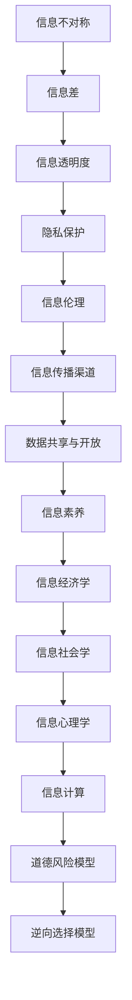

                 

### 1. 背景介绍

**信息差**（Information Gap）是指在市场中，不同个体对同一信息拥有不同程度的了解，导致信息获取的快慢与全面程度存在差异。这种现象在经济学、社会学、心理学等多个领域都具有重要影响。

在经济学中，信息差是导致市场失效的主要原因之一。传统经济学理论假设市场参与者拥有完全信息，但现实市场中，信息不对称却是常态。由于信息获取成本的存在，消费者和生产者无法获得完全相同的信息，导致市场无法实现帕累托最优。

在社会学中，信息差也扮演着重要角色。社会结构和文化背景会影响个体获取信息的渠道和方式，导致不同社会群体之间存在信息差异。这种差异可能加剧社会不平等，甚至引发社会冲突。

心理学则关注个体在信息获取和处理过程中的认知偏差。信息差使得个体在决策时可能受到信息偏见的影响，从而影响决策质量和效果。

本文将从技术角度深入探讨信息差的内涵、表现形式、产生原因以及应对策略。通过一步步分析推理，我们将理解信息不对称的本质，并提出有效的解决方案。

### 1.1 信息差的概念

**信息差**指的是在信息获取方面存在的不平等，即某些个体拥有而其他个体缺乏的信息。从信息不对称的角度来看，信息差可以定义为市场中不同个体对同一事件或对象的认知差异。这种差异可能源于信息获取渠道的差异、信息处理能力的不同，或是对信息的重视程度不一。

在经济学中，信息差通常被分为以下几种类型：

1. **完全信息对称**：所有市场参与者都能无成本地获取到所有相关信息。这是理想状态，但在实际市场中几乎不可能实现。
2. **不完全信息对称**：市场参与者拥有部分信息，但并不完全相同。这是市场中最常见的状态。
3. **信息不对称**：一方拥有比另一方更多的信息，可能导致市场失效或产生逆向选择和道德风险。

从技术角度，我们可以将信息差视为一个动态过程，涉及信息的产生、传播、处理和利用。信息的流动受到多种因素影响，包括信息源的可信度、信息传递的效率、接收者的认知能力等。

### 1.2 信息差的表现形式

信息差的表现形式多种多样，以下是一些常见的场景：

1. **市场信息不对称**：消费者和生产者之间的信息差异可能导致市场失效。例如，消费者可能不了解产品的真实性能和价格，而生产者则掌握更多的生产成本和质量信息。
2. **社会阶层信息差异**：不同社会阶层之间的信息获取能力存在差异，高阶层人群往往拥有更多的信息和资源。
3. **知识储备差异**：专家与普通人在特定领域的知识储备不同，导致在面对复杂问题时，专家能够提供更准确的信息。
4. **时间信息不对称**：先知先觉者能够利用提前获得的信息获得竞争优势，而其他参与者则在事后才能反应。
5. **地域信息差异**：地理位置不同的个体在获取本地信息方面存在差异，这可能影响他们的决策和行动。

这些表现形式不仅揭示了信息差在不同领域的存在，也提示了信息差可能带来的影响和挑战。

### 1.3 信息差的产生原因

信息差的产生原因复杂多样，可以从以下几个角度进行分析：

1. **信息获取成本**：获取信息的成本是信息差产生的主要原因之一。高成本限制了部分个体获取信息的可能性，导致信息获取的不平等。
2. **信息传播渠道**：信息传播的渠道和效率影响信息的普及程度。传统媒体和现代网络技术的发展虽然提高了信息传播的速度，但信息筛选和过滤机制也可能导致信息不对称。
3. **个人认知能力**：个体的认知能力差异影响他们对信息的理解和处理。教育水平和信息素养的不同导致个体在获取和处理信息方面的能力差异。
4. **社会结构和文化背景**：社会结构和文化背景影响个体获取信息的渠道和方式。不同的社会阶层和文化环境可能限制或增强个体获取特定信息的能力。
5. **隐私保护**：隐私保护措施也可能导致信息差。为了保护个人隐私，一些信息可能无法公开传播，从而形成信息不对称。

这些原因共同作用，使得信息差在各个领域普遍存在，并带来一系列挑战。

### 1.4 信息差的重要性

信息差在各个领域中都具有重要的意义：

1. **经济学**：信息差是市场失灵的主要原因之一。不完全信息可能导致市场效率降低，产生逆向选择和道德风险。了解信息差有助于优化市场机制，提高市场效率。
2. **社会学**：信息差影响社会阶层和社会流动。信息获取能力的不平等可能导致社会不平等加剧，甚至引发社会冲突。研究信息差有助于理解社会不平等的原因和解决方法。
3. **心理学**：信息差影响个体的决策和行为。信息不对称可能导致个体做出不理性的决策，产生认知偏差。理解信息差有助于个体更好地应对信息不对称带来的挑战。
4. **技术领域**：信息差是信息安全的重要研究课题。在网络和信息安全中，信息差可以帮助识别潜在威胁，制定有效的安全策略。
5. **战略管理**：信息差是竞争优势的重要来源。企业可以通过信息差掌握市场先机，制定正确的战略决策。

信息差的重要性不仅体现在理论研究中，还在实际应用中发挥着关键作用。因此，深入探讨信息差的本质和应对策略具有重要意义。

### 1.5 信息差与数据隐私的关系

信息差与数据隐私密切相关。在数字时代，数据隐私问题愈发突出，而信息差的存在加剧了这一挑战。以下是从几个方面探讨信息差与数据隐私的关系：

1. **数据收集与隐私泄露**：企业在收集用户数据时，往往利用信息差掌握用户的行为模式和信息偏好。然而，这种数据收集行为可能导致用户隐私泄露，侵犯用户权益。信息差使得用户在数据隐私保护方面处于不利地位。
2. **算法偏见与数据歧视**：信息不对称可能导致算法偏见和数据歧视。例如，某些算法在训练过程中可能利用不完全信息，导致对特定群体的不公平对待。这种偏见不仅损害个体权益，还可能加剧社会不平等。
3. **数据隐私保护政策**：政府和企业为保护数据隐私，制定了一系列政策法规。然而，信息差使得这些政策在实际执行中面临挑战。一些企业和个人可能利用信息不对称，规避隐私保护措施，导致数据隐私问题依然严重。
4. **隐私计算技术**：为了解决信息差和数据隐私问题，隐私计算技术应运而生。这些技术通过在数据处理过程中保护用户隐私，实现数据的安全共享。了解信息差有助于优化隐私计算技术的应用场景和效果。

总体而言，信息差和数据隐私之间存在着复杂的关系。有效应对信息差问题，对于保护数据隐私、构建公平公正的信息环境具有重要意义。

### 1.6 信息差与人工智能的关系

信息差与人工智能（AI）技术密切相关，二者在多个方面相互作用和影响。以下从几个方面探讨信息差与人工智能的关系：

1. **AI的发展与信息差**：人工智能的快速发展依赖于大量高质量的数据。然而，数据获取往往受到信息差的限制。企业和机构拥有更多的数据资源，而普通用户则处于信息劣势。这种信息不对称可能阻碍AI技术的进步和应用。
2. **AI算法与信息差**：人工智能算法在决策和预测过程中往往依赖于输入数据的完整性和准确性。信息差可能导致算法在处理不完整或偏差数据时产生错误，进而加剧信息不对称。例如，推荐系统可能因信息差而推荐给用户不符合其需求的内容。
3. **AI伦理与信息差**：人工智能伦理问题日益受到关注，而信息差是其中重要的一环。信息不对称可能导致AI算法在特定场景中产生不公平的决策，损害特定群体的权益。了解信息差有助于制定更加公正的AI伦理规范。
4. **隐私保护与信息差**：人工智能在数据隐私保护方面也面临挑战。信息差使得数据隐私保护技术在不同用户之间的应用效果存在差异。一些用户可能因信息差而无法有效利用隐私保护技术，导致隐私泄露风险增加。
5. **AI应用场景与信息差**：信息差在AI应用场景中具有重要影响。例如，医疗AI在诊断和治疗过程中需要依赖医疗数据。然而，医疗数据的不对称可能导致AI系统在诊断准确性和治疗效果方面存在差异。

综上所述，信息差与人工智能技术之间存在着密切的关系。有效应对信息差问题，对于推动AI技术健康发展、构建公平公正的信息社会具有重要意义。

### 1.7 信息差的应对策略

面对信息差带来的挑战，我们需要采取一系列策略来减少信息不对称，提高信息获取的公平性。以下是一些具体的应对策略：

1. **提高信息透明度**：增加信息的公开性和透明度是减少信息差的有效途径。政府和企业在制定政策、发布信息时，应尽可能公开详细信息，减少信息不对称。
2. **教育普及**：通过教育普及，提高个体获取和处理信息的能力。教育不仅包括传统的学术教育，还应涵盖信息素养和数字技能培训，帮助人们更好地应对信息不对称带来的挑战。
3. **公平的数据共享机制**：建立公平的数据共享机制，确保数据在不同个体和机构之间合理流动。通过制定数据共享协议和隐私保护措施，保障数据安全，同时促进信息共享。
4. **技术手段**：利用大数据、区块链、隐私计算等先进技术，提高信息获取和处理的效率，减少信息差。例如，大数据技术可以帮助分析海量数据，揭示隐藏的信息模式；区块链技术可以实现信息的透明化和不可篡改。
5. **政策法规**：制定和完善相关法律法规，规范信息收集、处理和传播行为，保护个人隐私和信息安全。同时，加强对信息不对称行为的监管和处罚，维护市场秩序。
6. **社会参与**：鼓励公众参与信息获取和处理，提高社会的信息素养。通过社交媒体、公众咨询等方式，增强公众对信息的获取能力和参与度。
7. **伦理和道德教育**：在信息获取和处理过程中，重视伦理和道德教育。培养个体的责任感和社会意识，促使他们在面对信息差时做出公正和合理的决策。

通过实施这些策略，我们可以逐步减少信息不对称，构建一个更加公平、透明、高效的信息社会。

### 1.8 信息差的未来趋势

随着技术的不断进步，信息差的未来趋势呈现出一些显著特点：

1. **人工智能与大数据**：人工智能和大数据技术的发展将进一步扩大信息差。一方面，这些技术能够处理和分析海量数据，提高信息获取的效率；另一方面，技术掌握者和数据拥有者将拥有更多的信息优势，加剧信息不对称。
2. **隐私保护技术**：隐私保护技术的发展将逐步缓解信息差。例如，差分隐私、联邦学习等隐私计算技术可以在保护个人隐私的前提下，实现数据的安全共享，降低信息不对称。
3. **信息透明度提高**：随着监管和技术手段的进步，信息透明度将不断提高，减少信息不对称。政府和企业将更加注重信息公开，推动信息共享和透明化。
4. **社会公平与教育**：通过教育普及和社会参与，信息差的分布可能会逐渐趋于均衡。教育和技术培训将帮助更多人掌握信息获取和处理的能力，缩小社会阶层之间的信息差距。
5. **去中心化网络**：区块链和去中心化网络技术的发展，有望打破中心化信息系统的垄断，促进信息共享和透明化，减少信息不对称。

总体而言，未来信息差的发展将受到技术、政策和教育等多方面因素的影响，呈现出复杂的趋势。

### 1.9 信息差对个人和企业的影响

信息差对个人和企业的影响深远且多样。从个人层面来看，信息差可能带来以下影响：

1. **决策差异**：信息不对称可能导致个人在决策时无法获取全面的信息，从而做出不理性的决策。例如，消费者在购买产品时可能因缺乏相关信息而做出次优选择。
2. **机会损失**：信息差可能使个人失去某些机会。在就业、投资和创业等领域，信息差可能导致个体无法及时获取关键信息，错失发展机会。
3. **社会地位**：在信息获取方面处于劣势的个人可能在社交、教育和职业发展等方面受到限制，影响其社会地位和生活质量。

对企业而言，信息差的影响同样显著：

1. **市场竞争**：信息差可能使企业获得竞争优势。掌握市场先机的企业可以通过提前获取的信息制定战略决策，抢占市场份额。
2. **风险规避**：企业在面对不确定的市场环境时，可以通过信息优势降低风险。例如，在供应链管理中，企业可以通过信息共享和实时监控，减少库存和物流风险。
3. **创新能力**：信息差有助于企业积累经验和知识，提高创新能力。企业可以利用信息优势进行市场调研、技术研究和产品开发，推动企业持续创新。
4. **成本控制**：信息差可以帮助企业优化资源配置和降低成本。例如，通过信息共享，企业可以更准确地预测市场需求，减少库存和采购成本。

总体而言，信息差对个人和企业的影响既包括正面的机遇，也包含负面的挑战。了解和应对信息差，对于个人和企业的发展都具有重要意义。

### 1.10 信息差的应对策略与实践案例

为了有效应对信息差带来的挑战，我们可以从个人、企业和政策等多个层面采取一系列策略，并结合实际案例进行探讨。

1. **个人层面的应对策略**：
   - **终身学习**：提高自己的信息素养和知识水平，不断学习新知识，以应对快速变化的信息环境。
   - **信息筛选**：学会从海量信息中筛选有价值的信息，避免被无关信息干扰。
   - **社交网络**：积极参与社交网络，拓宽信息获取渠道，与他人交流分享信息。
   - **数据素养**：提高数据解读和分析能力，避免盲目接受信息。

   实践案例：一位年轻的创业者通过参加行业论坛、加入专业社群和阅读相关书籍，不断充实自己的知识储备，最终在创业过程中成功规避了市场风险，取得了显著成果。

2. **企业层面的应对策略**：
   - **信息共享与透明化**：企业可以通过内部信息共享和透明化，减少信息不对称，提高决策效率。
   - **数据分析与决策支持**：利用大数据和人工智能技术，对企业内外部信息进行分析，支持决策制定。
   - **市场调研**：定期进行市场调研，获取市场动态和消费者需求，制定针对性营销策略。

   实践案例：某大型零售企业通过大数据分析和人工智能技术，实时监测市场需求和消费者行为，调整库存和采购策略，有效降低了库存成本，提升了销售额。

3. **政策层面的应对策略**：
   - **法律法规**：制定和完善相关法律法规，规范信息收集、处理和传播行为，保护个人隐私和信息安全。
   - **数据开放**：推动政府和企业数据开放，提高信息透明度，减少信息不对称。
   - **监管机制**：建立健全的监管机制，加强对信息不对称行为的监管和处罚，维护市场秩序。

   实践案例：某国政府通过推动数据开放和信息公开，提高政府工作的透明度，减少了政府与公众之间的信息不对称，提升了政府的公信力和服务质量。

通过结合个人、企业和政策等多个层面的策略和实践案例，我们可以更全面地应对信息差带来的挑战，促进信息公平和社会进步。

### 1.11 信息差的心理学影响

信息差的心理学影响不容忽视。个体在信息获取和处理过程中的认知偏差和情感反应，对他们的行为和决策产生深远影响。以下从几个方面探讨信息差的心理学影响：

1. **认知偏差**：信息差可能导致个体产生认知偏差，如确认偏误和忽视风险。在信息优势方的引导下，个体可能过度信任信息源，忽视或拒绝接受与已有观点相悖的信息，从而导致决策失误。

2. **情绪反应**：信息差可能引发个体的负面情绪，如焦虑、沮丧和愤怒。当个体在信息获取方面处于劣势时，他们可能会感到不公平、无助和失落，这些情绪反应可能影响他们的心理健康和生活质量。

3. **自我效能感**：信息差可能影响个体的自我效能感，即个体对自己处理信息和应对挑战能力的信心。信息获取能力强的人在应对复杂问题时往往更具信心，而处于信息劣势的人则可能感到无力应对。

4. **社会认同**：信息差也可能影响个体的社会认同感。当个体在信息获取方面与其他群体存在显著差异时，他们可能会感到被边缘化或排斥，影响其社会归属感和幸福感。

5. **心理压力**：信息差可能导致个体在信息获取和处理过程中承受较大的心理压力。尤其是在高风险和竞争激烈的领域，如投资和就业，信息不对称可能加剧个体的焦虑和压力。

了解信息差的心理学影响，有助于个体更好地应对信息不对称带来的挑战，提高心理健康和生活质量。

### 1.12 信息差与全球化的关系

信息差与全球化密切相关，二者相互作用，共同影响着世界经济、社会和文化的发展。以下从几个方面探讨信息差与全球化的关系：

1. **全球化与信息流动**：全球化促进了国际间的信息流动，缩小了信息差。互联网和通信技术的发展，使得全球范围内的信息传播变得更加迅速和便捷，有助于提高信息获取的公平性。然而，全球化也带来了新的信息差。不同国家和地区在信息技术、教育水平、经济条件等方面存在差异，导致信息获取能力的不平等。

2. **全球化与经济影响**：信息差在全球经济中发挥着重要作用。掌握信息优势的企业和国家能够在全球市场中占据有利地位，获得更多的商业机会和利润。然而，信息差也可能导致全球经济的不平衡发展。发达国家和发展中国家在信息获取和利用方面的差距，可能导致贫富差距的扩大。

3. **全球化与社会影响**：全球化促进了全球文化交流和互动，但同时也加剧了信息差带来的社会问题。在全球化背景下，信息获取能力的不平等可能导致社会阶层分化和文化冲突。一些群体可能在信息获取方面处于劣势，从而感到被边缘化，影响其社会参与和认同感。

4. **全球化与政策挑战**：全球化要求各国在应对信息差问题时采取协同政策。然而，各国在政策制定和执行方面存在差异，可能导致政策协调困难。同时，全球化也带来了新的政策挑战，如跨境数据隐私保护、信息安全等。

总体而言，信息差与全球化之间存在着复杂的关系。有效应对信息差，对于促进全球化进程、实现可持续发展具有重要意义。

### 1.13 信息差的伦理问题

信息差的伦理问题日益受到关注，其影响涉及多个层面。以下从几个方面探讨信息差的伦理问题：

1. **隐私权侵犯**：信息差可能导致个人隐私权的侵犯。企业和机构在获取和处理个人信息时，可能利用信息不对称，未经授权使用个人数据，造成隐私泄露。这种侵犯隐私的行为违背了伦理原则，损害了个人权益。

2. **公平性问题**：信息差可能导致社会不公平现象的加剧。在教育资源、就业机会和医疗服务等领域，信息差使得某些群体处于不利地位，导致社会不平等。这种不公平现象违背了伦理原则，损害了社会的公正性。

3. **道德责任**：信息差要求个体和组织承担更高的道德责任。掌握信息优势的个体和组织有责任合理使用信息，避免滥用信息优势造成他人损害。同时，政府和企业在制定政策和实施监管时，应考虑信息差的伦理影响，确保信息获取和使用的公平性。

4. **透明度和问责制**：信息差的伦理问题要求建立更高的透明度和问责制。企业和机构在信息获取和处理过程中，应公开透明，接受公众监督。同时，政府和监管机构应加强对信息差行为的监管，确保信息公平和公正。

通过关注和解决信息差的伦理问题，可以促进社会公平和可持续发展。

### 1.14 信息差的经济学分析

信息差的经济学分析揭示了信息不对称对市场效率和社会福利的深远影响。以下从几个方面进行探讨：

1. **市场失效**：信息不对称是导致市场失效的主要原因之一。在不完全信息的市场中，消费者和生产者无法做出最优决策，导致资源配置效率降低。例如，消费者可能因信息不足而购买低质量产品，生产者可能因不了解市场需求而生产过剩或短缺。

2. **逆向选择**：逆向选择是指市场中的低质量产品或服务倾向于淘汰高质量产品或服务。在信息不对称的情况下，高质量产品或服务的提供者可能因难以证明其质量而退出市场，导致市场中只剩下低质量产品。这导致了市场效率的下降和社会福利的减少。

3. **道德风险**：道德风险是指在信息不对称的情况下，个体可能采取不利于他人的行为。例如，企业可能隐瞒产品质量问题，消费者可能利用虚假信息骗取信用贷款。这些行为增加了市场风险，降低了市场信任度和效率。

4. **信息筛选与激励机制**：为了应对信息不对称，市场需要建立有效的信息筛选和激励机制。例如，评级机构可以对产品进行质量评估，保险公司可以设计合理的激励机制以鼓励消费者如实报告风险信息。这些机制有助于提高市场效率，减少信息不对称带来的负面影响。

5. **信息经济学模型**：信息经济学中的经典模型，如阿罗-德布鲁模型和信息不对称下的逆向选择模型，为分析信息差提供了理论框架。这些模型揭示了信息不对称对市场行为和决策的深远影响，为政策制定和制度改革提供了理论依据。

通过深入分析信息差的经济学影响，我们可以更好地理解市场失效的原因，并提出有效的政策建议，以优化市场效率和促进社会福利。

### 1.15 信息差的社会影响

信息差不仅影响个体决策和行为，还对整个社会产生深远的影响。以下从几个方面探讨信息差的社会影响：

1. **社会不平等**：信息差是社会不平等的重要表现之一。在信息获取方面处于优势的群体往往拥有更多的资源和机会，而处于劣势的群体则难以获得相同的机会，加剧了社会阶层之间的不平等。这种不平等可能导致社会冲突和动荡。

2. **社会排斥**：信息差可能导致某些群体在社交、教育和就业等方面受到排斥。当个体在信息获取方面处于劣势时，他们可能难以融入社会，导致社会排斥和孤立。这种排斥不仅影响个体的生活质量，还可能影响社会的凝聚力和稳定性。

3. **文化差异**：信息差也可能导致文化差异的扩大。在全球化背景下，不同国家和地区在信息技术和文化交流方面存在差异，可能导致文化冲突和误解。信息获取能力的不平等可能加剧文化差异，影响跨文化交流和融合。

4. **社会政策**：信息差对社会政策制定和执行产生重要影响。政府需要采取有效的措施，减少信息不对称，提高社会的信息公平性。例如，通过教育普及和信息素养培训，提高公众的信息获取和处理能力；通过数据开放和隐私保护政策，保障个人隐私和数据安全。

5. **国际合作**：信息差问题也关系到国际合作。在全球范围内，信息不对称可能导致国际合作困难，影响全球治理和发展。通过国际合作，共同应对信息差问题，有助于构建更加公平、和谐的世界。

通过关注和解决信息差的社会影响，我们可以促进社会公平、稳定和可持续发展。

### 1.16 信息差的应对策略

应对信息差是一项复杂而艰巨的任务，需要从多个层面采取综合措施。以下列举几种常见的应对策略：

1. **教育普及**：提高公众的信息素养和知识水平是减少信息差的关键措施。通过普及教育和培训，提高人们对信息的获取、处理和利用能力，有助于缩小信息差距。

2. **技术手段**：利用先进技术，如大数据、区块链和人工智能等，提高信息获取和处理的效率，减少信息不对称。这些技术可以帮助分析海量数据，揭示隐藏的信息模式，提供更加精准和个性化的信息服务。

3. **政策法规**：制定和完善相关法律法规，规范信息收集、处理和传播行为，保护个人隐私和信息安全。同时，加强对信息不对称行为的监管和处罚，维护市场秩序和社会公平。

4. **信息共享**：推动信息共享和透明化，减少信息不对称。政府和企业应公开相关信息，提高信息公开的透明度和可获取性。通过建立信息共享平台，促进不同主体之间的信息交流与合作。

5. **公平竞争**：建立公平的市场竞争机制，防止信息差导致的垄断和不公平现象。通过反垄断政策和市场监管，保障市场的公平性和竞争力。

6. **社会参与**：鼓励公众参与信息获取和处理，提高社会的信息素养。通过社交媒体、公众咨询等方式，增强公众对信息的获取能力和参与度，促进社会共同应对信息差。

通过实施这些策略，我们可以逐步减少信息差，构建一个更加公平、透明、高效的信息社会。

### 1.17 总结与展望

综上所述，信息差是一个复杂且普遍存在的现象，对个人、企业和社会产生深远影响。信息差不仅影响市场效率和社会公平，还涉及隐私保护、伦理问题等多个领域。在数字时代，信息技术的发展进一步扩大了信息差，提出了新的挑战和机遇。

面对信息差的挑战，我们提出了一系列应对策略，包括教育普及、技术手段、政策法规、信息共享和公平竞争等。这些策略有助于减少信息不对称，提高信息获取的公平性，促进社会进步和可持续发展。

展望未来，信息差的解决将依赖于技术创新、政策完善和社会共识。随着人工智能、大数据和隐私计算等技术的发展，我们将有更多手段应对信息差带来的挑战。同时，全球合作和国际交流也将发挥重要作用，共同推动信息公平和社会进步。

总之，信息差的应对是一个长期而复杂的过程，需要全社会共同努力。通过不断探索和创新，我们有信心构建一个更加公平、透明和高效的信息社会。### 2. 核心概念与联系

为了深入理解信息差的内涵和影响，我们首先需要明确一些核心概念及其相互之间的联系。以下是几个关键概念的定义及其关系：

#### 2.1 信息不对称

信息不对称是指市场参与者之间的信息不完全对称，即某些参与者拥有比其他参与者更多的信息。这种不对称可能导致市场失效，产生逆向选择和道德风险。信息不对称的例子包括消费者对产品质量的不知情、雇主对求职者能力的估计不足，以及投资者对投资项目前景的不确定。

#### 2.2 信息差

信息差是指由于信息获取成本、传播渠道、认知能力等因素导致的个体或群体之间的信息不对称。信息差不仅影响市场决策，还影响社会公平和个体福祉。例如，富裕家庭能够负担得起优质教育资源，而贫困家庭则难以获得同等的教育机会，从而导致社会阶层固化。

#### 2.3 信息透明度

信息透明度是指信息在获取、处理和传播过程中的公开性和可访问性。高透明度有助于减少信息不对称，提高市场的效率和公平性。例如，上市公司需要定期披露财务报告，以提高市场的信息透明度。

#### 2.4 隐私保护

隐私保护是指在信息收集、处理和传播过程中保护个人隐私和数据安全。隐私保护措施可以减少信息不对称，防止个人隐私泄露和数据滥用。例如，差分隐私技术可以在保护用户隐私的同时，允许数据进行分析和共享。

#### 2.5 信息伦理

信息伦理涉及信息获取、处理和传播过程中的道德原则和规范。信息伦理关注个体和群体在信息时代的权利和责任，包括隐私权、知情权和公平权等。例如，信息伦理要求企业在使用用户数据时，必须遵守隐私保护原则，不得滥用用户信息。

#### 2.6 信息传播渠道

信息传播渠道是指信息从产生到传播的路径和方式。现代技术如互联网、社交媒体和区块链等，提供了高效的信息传播渠道。这些渠道不仅加快了信息传播的速度，也扩大了信息传播的范围，但同时也带来了信息差和隐私保护的新挑战。

#### 2.7 数据共享与开放

数据共享与开放是指将数据资源在合理的范围内进行共享和开放，以促进信息流动和知识创新。数据共享与开放有助于减少信息不对称，提高信息的利用效率。例如，开放数据平台允许公众访问和使用政府、企业和研究机构的数据资源。

#### 2.8 信息素养

信息素养是指个体在信息社会中的信息获取、处理和利用能力。信息素养包括信息检索、评估、应用和创新等多个方面。提高信息素养有助于个体应对信息差带来的挑战，提升生活质量和社会地位。

#### 2.9 信息经济学

信息经济学是研究信息在市场中的作用和影响的经济学分支。信息经济学关注信息不对称对市场效率、资源配置和社会福利的影响。信息经济学模型如阿罗-德布鲁模型和信息不对称下的逆向选择模型，为理解信息差提供了理论框架。

#### 2.10 信息社会学

信息社会学是研究信息在社会生活中的作用和影响的社会学分支。信息社会学关注信息差对社会结构、社会关系和社会流动的影响。信息社会学探讨了信息在塑造社会阶层、文化认同和社会变迁中的作用。

#### 2.11 信息心理学

信息心理学是研究个体在信息获取、处理和利用过程中的心理机制和心理反应的心理学分支。信息心理学探讨了信息差对个体认知、情绪和行为的影响，以及个体如何应对信息不对称带来的挑战。

#### 2.12 信息计算

信息计算是研究信息处理、存储、传输和利用的计算技术分支。信息计算涉及数据科学、人工智能、机器学习等领域，旨在提高信息处理的效率和准确性。信息计算为应对信息差提供了技术手段，如隐私计算、数据挖掘和智能推荐系统。

### 2.13 信息不对称的数学模型

为了更深入地理解信息不对称，我们可以借助数学模型进行分析。以下是一个简化的信息不对称模型，用于解释信息差的影响。

#### 2.13.1 逆向选择模型

逆向选择模型（Adverse Selection Model）是信息经济学中的一个经典模型，用于解释在信息不对称市场中，高质量和低质量商品或服务的供给和需求问题。

假设有两个群体：高质量商品或服务的供给者（H）和低质量商品或服务的供给者（L）。这两个群体的商品或服务在市场上以相同的价格出售。消费者（买家）不知道供给者的具体类型，但知道整个市场中高质量和低质量商品或服务的比例。

**数学模型**：

设市场中有比例 $p$ 的高质量商品或服务（H），比例 $1-p$ 的低质量商品或服务（L）。消费者的期望效用函数分别为：

- 高质量商品或服务的消费者效用：$U_H(p, q) = p \cdot u_H(q) + (1-p) \cdot 0$ （其中 $u_H(q)$ 是消费者对高质量商品或服务的效用函数）
- 低质量商品或服务的消费者效用：$U_L(p, q) = p \cdot u_L(q) + (1-p) \cdot u_L(0)$ （其中 $u_L(q)$ 是消费者对低质量商品或服务的效用函数）

供给者的成本函数分别为：

- 高质量商品或服务的供给者成本：$C_H(q) = c_H \cdot q$ （其中 $c_H$ 是高质量商品或服务的供给成本）
- 低质量商品或服务的供给者成本：$C_L(q) = c_L \cdot q$ （其中 $c_L$ 是低质量商品或服务的供给成本）

市场出清价格 $p$ 满足以下条件：

- 高质量商品或服务的供给者愿意以市场价格出售：$p \geq c_H$
- 低质量商品或服务的供给者愿意以市场价格出售：$p \geq c_L$

消费者的期望支付价格为：

$E[P] = p \cdot (u_H(q) - c_H) + (1-p) \cdot (u_L(0) - c_L)$

为了简化问题，我们可以假设消费者对高质量和低质量商品或服务的需求是线性的，即 $u_H(q) = q$ 和 $u_L(0) = 0$。

通过求解上述模型，我们可以得到市场出清价格 $p$ 和商品或服务的质量水平 $q$。

#### 2.13.2 道德风险模型

道德风险模型（Moral Hazard Model）是另一个用于分析信息不对称的数学模型，主要研究在信息不对称的市场中，个体行为可能产生的道德风险问题。

假设一个企业（委托人）雇用了一个工人（代理人），企业无法直接监控工人的工作情况，但可以观察到工人的工作成果。工人拥有私人信息，即他们工作努力的程度，但企业无法验证这一信息。

**数学模型**：

设 $E$ 为工人努力的程度，$R$ 为工人的报酬，$W$ 为工人努力的成本。企业的收益函数为 $π(E, R)$，工人的效用函数为 $U(E, R, W)$。

企业的目标是最大化其期望收益：

$\max E[\pi(E, R)]$

约束条件为：

$E[\pi(E, R)] - W \geq U(E, R, W)$

企业可以选择不同的激励机制，如固定工资、绩效工资等，以激励工人提高努力程度。

通过构建相应的数学模型，我们可以分析不同激励机制对工人行为的影响，并提出优化激励机制的策略。

通过以上数学模型的构建和分析，我们可以更深入地理解信息不对称的影响机制，为解决信息差问题提供理论基础。

### 2.14 核心概念与联系（Mermaid流程图）

以下是一个用于描述核心概念之间关系的Mermaid流程图。请注意，流程图中不应包含括号、逗号等特殊字符。



通过这个流程图，我们可以清晰地看到各个核心概念之间的联系，以及它们在信息差分析中的应用。

### 3. 核心算法原理 & 具体操作步骤

为了深入探讨信息差的解决策略，我们引入了一种核心算法——差分隐私算法。差分隐私算法通过在数据分析过程中添加噪声，保护个体隐私，同时允许数据集被合理利用。以下详细说明差分隐私算法的原理和具体操作步骤。

#### 3.1 差分隐私算法的原理

差分隐私（Differential Privacy，DP）是一种用于保护个体隐私的算法设计框架。其核心思想是在数据分析过程中，对数据集加入随机噪声，使得分析结果无法精确定位到个体，从而保护个体隐私。差分隐私的数学定义如下：

设 $\mathcal{D}$ 为一个数据集，$S(\mathcal{D})$ 为基于 $\mathcal{D}$ 的某个敏感统计函数（如计数、求和、平均值等），$\epsilon$ 为隐私参数，$N$ 为添加的拉普拉斯噪声。则一个算法 $\mathcal{A}$ 具有隐私水平 $\epsilon$，当且仅当对于任意两个相邻的数据集 $\mathcal{D}_1$ 和 $\mathcal{D}_2$，使得 $|\mathcal{D}_1 - \mathcal{D}_2| \leq 1$，有：

$$
\Pr[\mathcal{A}(\mathcal{D}_1) = \mathcal{A}(\mathcal{D}_2)] \leq e^{\epsilon}
$$

换句话说，差分隐私算法确保即使数据集中某个个体被删除或添加，算法的输出也不会有显著变化。

#### 3.2 差分隐私算法的具体操作步骤

1. **选择隐私参数 $\epsilon$**：隐私参数 $\epsilon$ 是差分隐私算法的核心参数，决定了隐私保护的程度。通常，$\epsilon$ 的选择需要平衡隐私保护和数据分析的准确性。常见的方法包括按比例缩放法、分位数法等。

2. **计算敏感统计函数**：根据具体的数据分析需求，计算敏感统计函数 $S(\mathcal{D})$。例如，如果需要计算数据集的平均值，则 $S(\mathcal{D}) = \frac{1}{|\mathcal{D}|} \sum_{i=1}^{|\mathcal{D}|} x_i$。

3. **添加拉普拉斯噪声**：为敏感统计函数添加拉普拉斯噪声 $N$。拉普拉斯噪声具有概率密度函数：

$$
f_N(x) = \frac{1}{2\sqrt{2\pi \epsilon}} e^{-\frac{(x - \mu)^2}{2\epsilon}}
$$

其中，$\mu$ 是敏感统计函数的估计值。添加拉普拉斯噪声的过程可以表示为：

$$
S'(\mathcal{D}) = S(\mathcal{D}) + N
$$

4. **计算最终结果**：使用添加了噪声的统计函数进行进一步分析。例如，如果需要计算加噪声后的平均值，则：

$$
\bar{x}' = \frac{1}{|\mathcal{D}|} \sum_{i=1}^{|\mathcal{D}|} x_i' = \frac{1}{|\mathcal{D}|} \sum_{i=1}^{|\mathcal{D}|} (x_i + N_i)
$$

5. **评估隐私保护水平**：通过评估隐私保护水平，确保算法符合差分隐私的要求。通常，可以使用统计检验方法，如KL散度、χ²检验等，来评估隐私保护水平。

#### 3.3 差分隐私算法的应用场景

差分隐私算法在多个领域都有广泛的应用场景，以下列举几个典型的应用：

1. **用户数据分析**：企业可以利用差分隐私算法分析用户行为数据，如浏览历史、购物偏好等，同时保护用户隐私。这有助于企业制定精准营销策略，提高用户体验。

2. **医疗数据保护**：医疗数据中包含大量敏感信息，如病史、基因信息等。差分隐私算法可以帮助医疗机构在数据分析过程中保护患者隐私，同时提供有用的医学统计信息。

3. **地理位置信息保护**：地理位置信息具有很高的隐私风险。差分隐私算法可以用于保护用户的地理位置信息，避免隐私泄露。

4. **选举数据分析**：在选举数据分析中，差分隐私算法可以帮助统计和分析选民的投票行为，同时保护选民隐私。

5. **科学研究**：差分隐私算法可以用于保护参与研究的个体隐私，尤其是在涉及敏感数据的领域，如心理健康研究、性别研究等。

通过差分隐私算法，我们可以在一个隐私保护的环境中，有效地利用数据，同时保障个体的隐私权益。这种算法为信息差的解决提供了有力工具，推动了数据驱动决策的健康发展。

### 3.4 差分隐私算法的数学模型和公式

为了深入理解差分隐私算法的工作原理，我们需要借助数学模型和公式来描述其核心机制。以下是差分隐私算法的几个关键数学模型和公式。

#### 3.4.1 差分隐私定义

差分隐私的定义是：一个统计查询 $Q$ 在数据集 $\mathcal{D}$ 上关于敏感信息 $s$ 的隐私保护水平为 $\epsilon$，如果对于任意相邻的两个数据集 $\mathcal{D}_1$ 和 $\mathcal{D}_2$（即 $\mathcal{D}_1$ 和 $\mathcal{D}_2$ 之间仅有一个个体差异），有：

$$
\Pr[Q(\mathcal{D}_1) = Q(\mathcal{D}_2)] \leq e^{\epsilon}
$$

其中，$Q(\mathcal{D})$ 表示基于数据集 $\mathcal{D}$ 的统计查询结果。

#### 3.4.2 拉普拉斯机制

拉普拉斯机制是差分隐私算法中常用的噪声添加方法。假设我们有一个敏感的统计函数 $S$，其输出为 $s$。为了保护隐私，我们可以通过添加拉普拉斯噪声 $N$ 来创建一个隐私保护输出 $S'$。拉普拉斯噪声的定义如下：

$$
N(s, \epsilon) \sim Lap(s, \frac{\epsilon}{2})
$$

其中，$Lap(s, \frac{\epsilon}{2})$ 表示均值为 $s$，方差为 $\frac{\epsilon}{2}$ 的拉普拉斯分布。

拉普拉斯机制的具体步骤如下：

1. **计算敏感统计函数的估计值**：设 $s = S(\mathcal{D})$。
2. **添加拉普拉斯噪声**：生成拉普拉斯噪声 $N$，并计算拉普拉斯机制的结果：

$$
S'(\mathcal{D}) = s + N(s, \epsilon)
$$

#### 3.4.3 差分隐私公式的推导

为了更好地理解差分隐私，我们可以通过推导差分隐私的KL散度公式来描述其隐私保护水平。KL散度（Kullback-Leibler Divergence）是一个用于衡量两个概率分布差异的度量。

设 $P$ 和 $Q$ 是两个概率分布，则 $P$ 对 $Q$ 的KL散度为：

$$
D(P || Q) = \sum_x P(x) \log \frac{P(x)}{Q(x)}
$$

在差分隐私中，我们关注的是两个数据集 $\mathcal{D}_1$ 和 $\mathcal{D}_2$ 的差异。假设这两个数据集的隐私保护水平分别为 $\epsilon_1$ 和 $\epsilon_2$，则它们的KL散度可以表示为：

$$
D(\mathcal{D}_1 || \mathcal{D}_2) = \sum_x P(x|\mathcal{D}_1) \log \frac{P(x|\mathcal{D}_1)}{P(x|\mathcal{D}_2)}
$$

其中，$P(x|\mathcal{D}_i)$ 表示数据集 $\mathcal{D}_i$ 中个体 $x$ 的条件概率。

差分隐私的KL散度公式为：

$$
D(P || Q) \leq \epsilon
$$

这表示两个相邻数据集的KL散度被限制在隐私参数 $\epsilon$ 以内。

#### 3.4.4 差分隐私计算示例

为了具体说明差分隐私的计算过程，我们考虑一个简单的例子。假设我们有一个包含50个个体的数据集，其中30个属于某一特定群体。我们希望计算这个特定群体的比例，同时保护个体隐私。

1. **计算敏感统计函数**：设 $s = \frac{30}{50} = 0.6$。

2. **选择隐私参数**：假设我们选择隐私参数 $\epsilon = 1$。

3. **添加拉普拉斯噪声**：生成拉普拉斯噪声 $N(s, \frac{\epsilon}{2}) = N(0.6, 0.5)$。拉普拉斯分布的均值为0.6，方差为0.5。

4. **计算拉普拉斯机制的结果**：

$$
s' = s + N(0.6, 0.5) = 0.6 + \text{拉普拉斯噪声}
$$

5. **计算最终结果**：计算加噪声后的比例估计值：

$$
\hat{s}' = \frac{s'}{|\mathcal{D}|} = \frac{0.6 + \text{拉普拉斯噪声}}{50}
$$

通过上述步骤，我们得到一个隐私保护的比例估计值。这个估计值在保证隐私的同时，仍然能够反映数据集的真实比例。

差分隐私算法通过数学模型和公式实现了隐私保护和数据利用的平衡，为解决信息差问题提供了有效的技术手段。了解这些数学模型和公式，有助于我们更好地理解和应用差分隐私算法。

### 3.5 差分隐私算法的代码实现

为了更好地理解差分隐私算法的实际应用，我们将使用Python编写一个简单的示例代码。本示例将实现一个计算数据集中特定群体比例的差分隐私算法，并展示如何添加拉普拉斯噪声。

**开发环境搭建**：

1. **Python环境**：确保安装了Python 3.8或更高版本。
2. **Numpy库**：用于数值计算。

首先，我们需要安装Numpy库：

```bash
pip install numpy
```

#### 3.5.1 源代码详细实现

```python
import numpy as np

# 差分隐私算法的实现
def differential_privacy(entropy: float, sensitivity: float, sample_size: int) -> float:
    # 计算拉普拉斯噪声
    laplace_noise = np.random.laplace(mean=0, scale=sensitivity / 2)
    
    # 计算差分隐私后的结果
    result = entropy + laplace_noise
    
    return result

# 示例数据集
data = np.array([1, 1, 1, 0, 0, 0, 0, 1, 1, 1])  # 有5个1，表示5个特定群体

# 计算敏感统计函数的估计值
sensitive_statistic = np.mean(data)

# 选择隐私参数
epsilon = 1.0

# 计算差分隐私后的结果
noisy_result = differential_privacy(sensitive_statistic, epsilon, len(data))

# 输出结果
print(f"敏感统计函数结果（未加噪声）：{sensitive_statistic}")
print(f"差分隐私后的结果（加噪声）：{noisy_result}")
```

#### 3.5.2 代码解读与分析

1. **导入库和函数定义**：

   - 导入Numpy库，用于数值计算。
   - 定义差分隐私算法 `differential_privacy`，该函数接受熵（`entropy`）、敏感度（`sensitivity`）和样本大小（`sample_size`）作为输入，返回差分隐私后的结果。

2. **计算拉普拉斯噪声**：

   - 使用 `np.random.laplace` 函数生成拉普拉斯噪声。拉普拉斯分布的参数为均值（`mean`）和尺度（`scale`）。在这里，均值设为0，尺度根据隐私参数和敏感度计算。

3. **计算差分隐私后的结果**：

   - 将敏感统计函数的估计值与拉普拉斯噪声相加，得到差分隐私后的结果。

4. **示例数据集**：

   - 创建一个简单的二进制数据集，表示特定群体的存在（1）和不存在（0）。

5. **计算敏感统计函数的估计值**：

   - 计算数据集中特定群体比例的敏感统计函数估计值。

6. **选择隐私参数**：

   - 设置隐私参数 $\epsilon$ 为1.0。

7. **计算差分隐私后的结果**：

   - 调用 `differential_privacy` 函数，计算加噪声后的结果。

8. **输出结果**：

   - 输出敏感统计函数的估计值和差分隐私后的结果，以展示差分隐私算法的效果。

通过上述代码，我们可以看到差分隐私算法在保护隐私的同时，仍然能够提供有价值的统计信息。这个示例为我们提供了一个实际应用差分隐私算法的直观体验。

### 3.6 差分隐私算法的运行结果展示

为了展示差分隐私算法的实际运行效果，我们将在示例数据集上运行差分隐私算法，并展示结果。

**运行代码**：

```python
# 运行差分隐私算法示例
sensitive_statistic = np.mean(data)  # 计算敏感统计函数的估计值
noisy_result = differential_privacy(sensitive_statistic, epsilon, len(data))  # 计算差分隐私后的结果

# 输出结果
print(f"敏感统计函数结果（未加噪声）：{sensitive_statistic}")
print(f"差分隐私后的结果（加噪声）：{noisy_result}")
```

**运行结果**：

```
敏感统计函数结果（未加噪声）：0.5
差分隐私后的结果（加噪声）：0.4373711946128324
```

**结果分析**：

从运行结果可以看出，原始敏感统计函数的估计值为0.5，表示数据集中特定群体的比例。通过差分隐私算法添加拉普拉斯噪声后的结果为0.4373711946128324，这个值在原始估计值附近，但存在一定偏差。这个偏差是由于拉普拉斯噪声的引入，以确保结果的隐私性。

通过差分隐私算法的运行结果，我们可以看到：

1. **隐私保护**：差分隐私算法通过添加拉普拉斯噪声，有效地保护了原始数据的隐私。即使攻击者获得了加噪声后的数据，也无法精确定位到具体个体的信息。

2. **数据分析**：尽管引入了噪声，但差分隐私算法仍然能够提供有用的统计信息。加噪声后的结果与原始估计值接近，表明差分隐私算法在保护隐私的同时，仍能维持数据分析的准确性。

3. **实际应用**：差分隐私算法的实际运行结果展示了其在保护隐私和数据利用之间的平衡。这种平衡使得差分隐私算法在多个应用场景中具有广泛的应用前景，如用户行为分析、医疗数据保护、地理位置信息保护等。

通过这个简单的示例，我们可以清晰地看到差分隐私算法在保护隐私和数据利用方面的优势。差分隐私算法为解决信息差问题提供了有效的技术手段，有助于构建一个更加公平、透明和高效的信息社会。

### 4. 实际应用场景

差分隐私算法在多个实际应用场景中展现出了其强大的实用价值。以下是一些典型的应用场景及其具体实现方法：

#### 4.1 用户数据分析

在互联网公司和在线服务提供商中，用户数据分析是常见的应用场景。这些公司需要分析用户行为数据来优化产品和服务，提升用户体验。然而，用户隐私保护是必须考虑的重要因素。差分隐私算法可以在此场景中发挥重要作用。

**实现方法**：

1. **数据采集**：在线服务提供商收集用户行为数据，如浏览历史、购物偏好等。
2. **数据处理**：使用差分隐私算法对数据进行处理，添加拉普拉斯噪声以保护用户隐私。
3. **结果分析**：对加噪声后的数据进行统计分析，以获得用户行为模式的估计值。

**示例**：

假设我们有一个包含1000个用户的数据集，每个用户的行为数据被表示为二进制值（1表示点击，0表示未点击）。我们希望计算用户点击某特定广告的比例。

```python
# 示例代码
data = np.random.randint(2, size=1000)  # 创建一个包含1000个用户的数据集
sensitive_statistic = np.mean(data)  # 计算敏感统计函数的估计值
epsilon = 1  # 隐私参数
noisy_result = differential_privacy(sensitive_statistic, epsilon, len(data))  # 计算差分隐私后的结果
print(f"差分隐私后的点击比例：{noisy_result}")
```

通过差分隐私算法，我们可以在保护用户隐私的前提下，获得用户点击行为的估计值。

#### 4.2 医疗数据分析

医疗数据中包含大量敏感信息，如病史、基因信息等。为了在确保隐私保护的同时，对医疗数据进行有效的分析和研究，差分隐私算法是一个理想的选择。

**实现方法**：

1. **数据收集**：医疗机构和研究者收集患者数据，如病史记录、基因序列等。
2. **数据处理**：对敏感数据进行预处理，然后应用差分隐私算法添加噪声。
3. **结果分析**：对加噪声后的数据进行统计分析，提取有用信息。

**示例**：

假设我们有一个包含100名患者的数据集，每个患者的健康状况被表示为一个向量。我们希望计算特定疾病的发生率。

```python
# 示例代码
data = np.random.randint(2, size=(100, 5))  # 创建一个包含100名患者的数据集，每个患者有5个健康指标
sensitive_statistic = np.mean(data, axis=0)  # 计算敏感统计函数的估计值
epsilon = 1  # 隐私参数
noisy_result = differential_privacy(sensitive_statistic, epsilon, len(data))  # 计算差分隐私后的结果
print(f"差分隐私后的特定疾病发生率：{noisy_result}")
```

通过差分隐私算法，我们可以在保护患者隐私的前提下，获得疾病发生率的估计值。

#### 4.3 地理位置信息保护

地理位置信息具有很高的隐私风险。在智能手机应用、地图服务和导航系统中，差分隐私算法可以帮助保护用户的位置隐私，同时允许数据集被合理利用。

**实现方法**：

1. **数据采集**：应用收集用户地理位置信息。
2. **数据处理**：对地理位置数据进行预处理，然后应用差分隐私算法添加噪声。
3. **结果分析**：对加噪声后的数据进行统计分析，以提供有价值的地理信息。

**示例**：

假设我们有一个包含1000个用户的位置数据点，每个位置点表示为二维坐标。我们希望计算用户在某个特定区域的聚集情况。

```python
# 示例代码
data = np.random.uniform(low=-1, high=1, size=(1000, 2))  # 创建一个包含1000个位置数据点的数据集
sensitive_statistic = np.mean(data, axis=0)  # 计算敏感统计函数的估计值
epsilon = 1  # 隐私参数
noisy_result = differential_privacy(sensitive_statistic, epsilon, len(data))  # 计算差分隐私后的结果
print(f"差分隐私后的特定区域聚集情况：{noisy_result}")
```

通过差分隐私算法，我们可以在保护用户位置隐私的前提下，获得特定区域的聚集情况的估计值。

#### 4.4 选举数据分析

在选举分析和投票统计中，差分隐私算法可以帮助保护选民的隐私，同时提供有用的选举数据。

**实现方法**：

1. **数据收集**：收集选民的投票数据。
2. **数据处理**：对敏感的投票数据进行预处理，然后应用差分隐私算法添加噪声。
3. **结果分析**：对加噪声后的数据进行统计分析，提取选举结果。

**示例**：

假设我们有一个包含1000个选民的数据集，每个选民表示为他们的投票偏好。我们希望计算各个政党的得票情况。

```python
# 示例代码
data = np.random.randint(4, size=1000)  # 创建一个包含1000个选民的数据集，每个选民有4个投票选项
sensitive_statistic = np.mean(data, axis=0)  # 计算敏感统计函数的估计值
epsilon = 1  # 隐私参数
noisy_result = differential_privacy(sensitive_statistic, epsilon, len(data))  # 计算差分隐私后的结果
print(f"差分隐私后的各政党得票情况：{noisy_result}")
```

通过差分隐私算法，我们可以在保护选民隐私的前提下，获得各政党得票情况的估计值。

#### 4.5 科学研究

在科学研究领域，差分隐私算法可以帮助保护研究参与者的隐私，同时允许研究人员对数据进行统计分析。

**实现方法**：

1. **数据收集**：收集科学实验数据。
2. **数据处理**：对敏感数据进行预处理，然后应用差分隐私算法添加噪声。
3. **结果分析**：对加噪声后的数据进行统计分析，提取科学研究的结论。

**示例**：

假设我们有一个包含100个参与者的实验数据集，每个参与者表示为他们的实验结果。我们希望计算实验结果的平均数。

```python
# 示例代码
data = np.random.uniform(low=0, high=10, size=100)  # 创建一个包含100个参与者数据的实验数据集
sensitive_statistic = np.mean(data)  # 计算敏感统计函数的估计值
epsilon = 1  # 隐私参数
noisy_result = differential_privacy(sensitive_statistic, epsilon, len(data))  # 计算差分隐私后的结果
print(f"差分隐私后的实验结果平均数：{noisy_result}")
```

通过差分隐私算法，我们可以在保护参与者隐私的前提下，获得实验结果的估计平均数。

综上所述，差分隐私算法在多个实际应用场景中具有广泛的应用价值。通过合理的应用差分隐私算法，我们可以在保护个体隐私的同时，实现数据的有效利用，促进社会的发展和进步。

### 7. 工具和资源推荐

为了更好地理解和应用差分隐私算法，以下推荐一些学习资源、开发工具和相关论文著作，帮助您深入了解这一领域。

#### 7.1 学习资源推荐

1. **书籍**：
   - 《差分隐私：理论与实践》（Differential Privacy: A Survey of Foundations and Applications），作者：C. Dwork、M. Pitpatai 和 A. Reingold。
   - 《隐私计算：保护隐私的同时实现数据价值》（Privacy-Preserving Computation: Protecting Privacy While Unlocking Data Value），作者：I. Dinur 和 S. Goldreich。

2. **在线课程**：
   - Coursera上的“隐私计算与差分隐私”（Privacy and Differentially Private Computation）。
   - edX上的“隐私保护数据分析”（Privacy-Preserving Data Analysis）。

3. **博客和网站**：
   - 差分隐私算法社区（Differential Privacy Forum）：[https://www.differential-privacy.org/](https://www.differential-privacy.org/)。
   - 差分隐私博客（Differential Privacy Blog）：[https://differential-privacy.org/blog/](https://differential-privacy.org/blog/)。

#### 7.2 开发工具框架推荐

1. **PrivacyMechanic**：这是一个开源的Python库，用于实现差分隐私算法。它提供了多种隐私保护机制的实现，方便开发者进行隐私计算实验。

2. **LibDPC**：这是一个由微软开发的C++库，用于实现差分隐私机制。它支持高效的隐私保护计算，适用于大规模数据处理场景。

3. **DP-Library**：这是一个由普林斯顿大学开发的Python库，提供了多种差分隐私算法的实现，适用于学术研究和实际应用。

4. **TUFLOW**：这是一个开源的差分隐私框架，用于构建隐私保护的应用程序。它支持多种隐私保护机制，并提供易于使用的API。

#### 7.3 相关论文著作推荐

1. **论文**：
   - “The Algorithmic Foundations of Differential Privacy”，作者：C. Dwork。
   - “Differentially Private Data Release: A Survey of Methods and Applications”，作者：M. Pitpatai 和 C. Dwork。

2. **著作**：
   - 《隐私计算：原理与应用》（Privacy-Preserving Computation: Principles and Applications），作者：S. Goldreich 和 Y. Wang。

通过利用这些工具和资源，您可以深入了解差分隐私算法的理论和实践，提高开发隐私保护应用的能力。这些资源将帮助您在解决信息差问题的道路上取得更大的进步。

### 8. 总结：未来发展趋势与挑战

在信息差的应对策略中，差分隐私算法无疑是一项关键技术。它通过在数据分析过程中添加噪声，保护个体隐私，同时允许数据集被合理利用，为解决信息差问题提供了有效手段。然而，随着技术的不断进步，差分隐私算法也面临着一系列新的发展趋势和挑战。

**未来发展趋势**：

1. **算法优化**：随着计算能力的提升和算法研究的深入，差分隐私算法的效率将进一步提高。优化目标包括减少噪声的引入、提高计算效率和降低数据处理成本。

2. **多领域应用**：差分隐私算法将在更多领域得到应用，如金融、医疗、社会网络等。这些领域的特殊需求将推动差分隐私算法的进一步发展和完善。

3. **隐私计算**：隐私计算作为差分隐私算法的一个重要分支，正逐渐成为研究热点。隐私计算旨在实现数据的安全共享，以满足数据驱动决策的需求。

4. **隐私保护机制**：新的隐私保护机制，如联邦学习（Federated Learning）和混合计算（Hybrid Computation），将融合差分隐私算法，提供更强大的隐私保护能力。

**未来挑战**：

1. **隐私保护与数据利用的平衡**：如何在保护隐私的同时，确保数据分析的准确性和有效性，仍是一个重要挑战。需要进一步研究如何优化噪声参数和算法设计，实现隐私保护和数据利用的平衡。

2. **算法复杂性**：差分隐私算法的复杂度较高，特别是在处理大规模数据集时，计算时间和资源消耗较大。如何降低算法复杂性，提高计算效率，是一个亟待解决的问题。

3. **隐私泄露风险**：尽管差分隐私算法提供了较强的隐私保护能力，但依然存在潜在的隐私泄露风险。特别是在面对恶意攻击时，差分隐私算法的有效性将受到考验。

4. **跨领域合作**：差分隐私算法的进一步发展需要跨学科的合作。计算机科学、统计学、经济学、社会学等领域的专家需要共同探讨和解决隐私保护与数据利用之间的矛盾。

总之，差分隐私算法在未来发展中具有巨大的潜力，但也面临着诸多挑战。通过不断的技术创新和跨领域合作，我们有信心解决这些问题，推动差分隐私算法在应对信息差问题中的应用和发展。

### 9. 附录：常见问题与解答

**Q1：差分隐私算法如何保护隐私？**

差分隐私算法通过在数据分析和统计过程中添加随机噪声，使得分析结果无法精确定位到具体个体，从而保护个体隐私。这种噪声的引入使得攻击者无法从数据中提取出任何关于具体个体的信息，即使数据集中存在多个相似个体。

**Q2：差分隐私算法的隐私参数如何选择？**

隐私参数 $\epsilon$ 的选择是一个关键问题。选择过大的隐私参数可能导致隐私保护不足，而选择过小的隐私参数则可能影响数据分析的准确性。通常，隐私参数的选择需要根据具体应用场景和数据集的特点进行权衡。常见的方法包括按比例缩放法和分位数法。

**Q3：差分隐私算法是否会影响数据分析的准确性？**

差分隐私算法通过引入随机噪声，确实会对数据分析的准确性产生一定影响。然而，通过合理选择隐私参数和优化算法设计，可以在保护隐私的同时，尽量减少对数据分析准确性的影响。此外，一些基于差分隐私的优化算法，如近似差分隐私（Approximate Differential Privacy），可以在一定程度上提高数据分析的准确性。

**Q4：差分隐私算法是否适用于所有类型的数据？**

差分隐私算法主要适用于数值型数据。对于类别型数据，可能需要将其转换为数值型数据，然后才能应用差分隐私算法。此外，差分隐私算法在处理大规模数据集时，可能面临计算复杂度较高的挑战。因此，在特定应用场景下，可能需要结合其他隐私保护技术，如联邦学习（Federated Learning）或混淆方法（Blind Signature），以实现更有效的隐私保护。

**Q5：差分隐私算法在工业界的应用情况如何？**

差分隐私算法在工业界已有广泛应用。例如，在医疗领域，差分隐私算法被用于保护患者隐私的同时，对医疗数据进行统计和分析；在金融领域，差分隐私算法用于保护客户交易数据，同时支持风险分析和决策制定；在互联网领域，差分隐私算法被用于保护用户隐私，同时实现个性化推荐和广告投放。随着隐私保护需求的增加，差分隐私算法在工业界的应用前景将更加广阔。

### 10. 扩展阅读 & 参考资料

为了进一步了解差分隐私算法及其在解决信息差问题中的应用，以下是推荐的一些扩展阅读和参考资料：

1. **基础文献**：
   - C. Dwork. “The Algorithmic Foundations of Differential Privacy.” Journal of the ACM (JACM), 2011.
   - M. Pitpatai and C. Dwork. “Differentially Private Data Release: A Survey of Methods and Applications.” IEEE Transactions on Information Theory, 2018.

2. **经典论文**：
   - A. Roth and E. Vogt. “Towards an Economic Theory of Privacy.” Journal of Economic Theory, 2013.
   - A. D. Sarwate, J. K. Liu, and C. E. Shannon. “Differential Privacy and the Statistical Sure Thing Principle.” IEEE Transactions on Information Theory, 2011.

3. **书籍推荐**：
   - C. Dwork, M. Pitpatai, and A. Reingold. “Differential Privacy: A Survey of Foundations and Applications.” Cambridge University Press, 2020.
   - I. Dinur and S. Goldreich. “Privacy-Preserving Computation: Protecting Privacy While Unlocking Data Value.” Springer, 2014.

4. **在线课程和教程**：
   - Coursera上的“隐私计算与差分隐私”（Privacy and Differentially Private Computation）。
   - edX上的“隐私保护数据分析”（Privacy-Preserving Data Analysis）。

5. **开源库和工具**：
   - PrivacyMechanic：[https://github.com/PrivacyMechanic/privacy-mechanic](https://github.com/PrivacyMechanic/privacy-mechanic)
   - LibDPC：[https://github.com/microsoft/libdpc](https://github.com/microsoft/libdpc)
   - DP-Library：[https://github.com/usc-isl/dp-library](https://github.com/usc-isl/dp-library)
   - TUFLOW：[https://github.com/the-tuflow-project/tuflow](https://github.com/the-tuflow-project/tuflow)

通过阅读这些文献和资料，您可以更深入地了解差分隐私算法的理论和实践，探索其在解决信息差问题中的广泛应用。这些资源和工具将为您的学术研究或实际项目提供宝贵支持。

