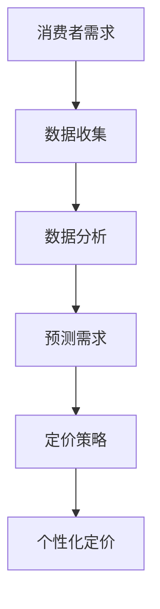

                 

### 信息差的商业定价个性化：大数据如何支持定价个性化

> 关键词：信息差、商业定价、个性化、大数据、算法、模型

> 摘要：本文探讨了信息差在商业定价中的应用，以及大数据如何支持定价个性化。通过深入分析信息差的本质和商业定价的挑战，结合实际案例，阐述了大数据和算法在优化定价策略中的作用，为企业和商家提供了宝贵的参考和启示。

### 1. 背景介绍

在商业世界中，定价策略是企业实现盈利的关键因素之一。传统的定价策略往往基于成本加成或市场供需关系，具有一定的普遍性和稳定性。然而，随着市场竞争的加剧和消费者需求的多样化，单纯的成本导向或市场导向定价已经难以满足企业的盈利目标。信息差的商业定价个性化，作为一种新兴的定价模式，正逐渐受到企业的高度关注。

信息差指的是信息不对称的现象，即不同市场主体之间的信息获取能力和渠道存在差异。在商业定价中，信息差意味着企业可以通过收集和分析消费者的个性化需求和行为数据，制定出更加精准的定价策略。大数据技术为信息差的商业定价个性化提供了强有力的支持，使得企业能够更加有效地挖掘潜在商机，提升市场竞争力。

本文将围绕以下问题展开讨论：

1. 信息差的商业定价个性化是什么？
2. 大数据和算法如何支持定价个性化？
3. 实际应用中，大数据如何优化商业定价策略？
4. 定价个性化面临的挑战及未来发展趋势是什么？

通过对这些问题的探讨，希望能够为企业和商家提供一些有价值的参考和启示。

### 2. 核心概念与联系

#### 2.1 信息差的定义

信息差指的是市场中信息的不对称现象。具体来说，就是市场中某些参与者拥有更多的信息或者更好的信息获取渠道，而其他参与者则缺乏这种信息或者获取信息的渠道。在商业定价中，信息差主要体现在以下两个方面：

1. **消费者信息差**：消费者对自己的需求和偏好有较为清晰的认知，但企业往往难以全面了解消费者的真实需求。
2. **企业信息差**：企业可以获取大量的市场数据、消费者行为数据以及竞争对手的定价策略，但消费者往往无法获取这些信息。

#### 2.2 商业定价的挑战

随着市场的不断变化，商业定价面临着诸多挑战：

1. **市场竞争加剧**：在激烈的市场竞争中，企业需要通过灵活的定价策略来获取竞争优势。
2. **消费者需求多样化**：消费者需求日趋个性化，传统的统一定价模式已经难以满足市场需求。
3. **价格敏感度**：消费者对价格的敏感度增加，价格波动对销售的影响变得更加复杂。

#### 2.3 大数据和算法的作用

大数据和算法为商业定价个性化提供了强有力的支持。大数据技术可以帮助企业：

1. **收集和分析海量数据**：通过收集和分析消费者行为、市场动态、竞争对手数据等信息，挖掘出有价值的信息。
2. **预测和优化定价策略**：基于大数据分析结果，企业可以预测消费者需求，优化定价策略，实现个性化定价。

算法的作用主要体现在：

1. **推荐算法**：通过分析消费者历史数据和偏好，推荐个性化的产品和服务。
2. **机器学习算法**：利用机器学习算法，从海量数据中挖掘出潜在的模式和规律，辅助企业制定定价策略。

#### 2.4 Mermaid 流程图

为了更好地展示信息差的商业定价个性化的核心概念和流程，我们可以使用 Mermaid 画出如下流程图：



在这个流程图中，消费者需求作为起点，经过数据收集、数据分析和需求预测等步骤，最终实现个性化定价。这个过程充分利用了大数据和算法的优势，帮助企业实现更加精准的定价策略。

### 3. 核心算法原理 & 具体操作步骤

#### 3.1 算法原理

在大数据支持下，商业定价个性化主要依赖于以下两种核心算法：

1. **协同过滤算法**：协同过滤算法通过分析消费者之间的相似性，推荐个性化的产品和服务。具体包括基于用户的行为数据和基于物品的特征数据两种类型。
2. **机器学习算法**：机器学习算法通过对历史数据的分析和学习，预测消费者的需求和行为，从而实现个性化定价。

#### 3.2 具体操作步骤

以下是一个典型的商业定价个性化算法操作步骤：

1. **数据收集**：首先，企业需要收集大量的消费者数据，包括历史购买记录、浏览记录、搜索记录等。这些数据可以来自企业的内部系统，也可以通过第三方数据平台获取。
2. **数据预处理**：对收集到的数据进行清洗、去重、归一化等处理，确保数据的准确性和一致性。
3. **特征工程**：根据业务需求和算法要求，提取出有用的特征，如用户年龄、性别、消费金额、购买频率等。
4. **模型训练**：利用机器学习算法，如线性回归、决策树、支持向量机等，对预处理后的数据集进行训练，建立预测模型。
5. **模型评估**：通过交叉验证、A/B测试等方法，对训练好的模型进行评估，确保模型具有较高的预测准确性和泛化能力。
6. **个性化定价**：根据模型预测结果，对不同的消费者群体制定个性化的定价策略。例如，对于价格敏感度较高的消费者，可以采用折扣定价；对于高价值客户，可以采用高溢价定价。
7. **策略优化**：根据实际业务情况和市场反馈，不断调整和优化定价策略，以提高企业的盈利能力和市场份额。

#### 3.3 算法优劣对比

以下是协同过滤算法和机器学习算法的优劣对比：

| 算法 | 优点 | 缺点 |
| --- | --- | --- |
| 协同过滤算法 | 可以根据用户的历史行为和偏好进行推荐，适用于个性化推荐系统 | 需要大量的用户数据，对稀疏数据的处理效果不佳；易受到数据噪声和冷启动问题的影响 |
| 机器学习算法 | 可以从大量数据中学习到潜在的模式和规律，适用于预测和分类任务 | 需要大量的训练数据和时间；模型解释性较差，难以理解预测结果的原因 |

综上所述，协同过滤算法和机器学习算法各有优劣，企业可以根据实际业务需求和数据情况，选择合适的算法进行商业定价个性化。

### 4. 数学模型和公式 & 详细讲解 & 举例说明

#### 4.1 数学模型

商业定价个性化通常基于以下两个核心数学模型：

1. **需求预测模型**：用于预测消费者对某一产品或服务的需求量。
2. **利润最大化模型**：用于在给定需求预测的基础上，制定最优定价策略，实现利润最大化。

#### 4.2 需求预测模型

需求预测模型通常采用线性回归模型，其数学表达式为：

$$
y = \beta_0 + \beta_1 x_1 + \beta_2 x_2 + ... + \beta_n x_n + \epsilon
$$

其中，$y$ 表示需求量，$x_1, x_2, ..., x_n$ 表示影响需求的各个因素（如价格、促销活动、季节等），$\beta_0, \beta_1, \beta_2, ..., \beta_n$ 表示回归系数，$\epsilon$ 表示误差项。

为了提高预测准确度，还可以引入多项式回归、神经网络等更复杂的模型。

#### 4.3 利润最大化模型

利润最大化模型通常采用线性规划模型，其数学表达式为：

$$
\max Z = \beta_0 + \beta_1 x_1 + \beta_2 x_2 + ... + \beta_n x_n
$$

$$
s.t. \quad c_1 x_1 + c_2 x_2 + ... + c_n x_n \leq b
$$

$$
x_1, x_2, ..., x_n \geq 0
$$

其中，$Z$ 表示利润，$\beta_0, \beta_1, \beta_2, ..., \beta_n$ 表示定价策略，$c_1, c_2, ..., c_n$ 表示成本系数，$b$ 表示预算限制。

为了实现利润最大化，需要找到一组最优的定价策略，使得利润最大化，同时满足预算限制。

#### 4.4 举例说明

假设某电商平台针对一款畅销产品，制定个性化定价策略。已知该产品的历史需求量与价格之间存在线性关系，回归系数为 $\beta_0 = 100$, $\beta_1 = -10$。同时，该产品的成本为 $c_1 = 50$，预算限制为 $b = 5000$。

需求预测模型为：

$$
y = 100 - 10x
$$

利润最大化模型为：

$$
\max Z = 100 - 10x - 50x
$$

$$
s.t. \quad -10x \leq 5000
$$

$$
x \geq 0
$$

解这个线性规划模型，可以得到最优定价为 $x = 500$，此时利润最大，为 $Z = 100 - 10 \times 500 - 50 \times 500 = -45000$。

然而，这个结果显然不合理，因为利润为负值。这是因为线性模型在预测和优化方面存在一定的局限性，需要结合实际业务情况和市场反馈进行调整和优化。

#### 4.5 模型评估与优化

为了提高模型预测和优化的准确性，可以采用以下方法：

1. **数据增强**：通过引入更多的相关变量，丰富数据集，提高模型的预测能力。
2. **交叉验证**：采用交叉验证方法，对模型进行训练和评估，提高模型的泛化能力。
3. **模型融合**：将多个模型进行融合，取其优点，提高整体预测和优化效果。
4. **实时调整**：根据实际业务情况和市场反馈，实时调整模型参数和定价策略，提高模型的适应能力。

通过以上方法，可以进一步提高商业定价个性化模型的准确性和实用性，为企业提供更加科学和有效的定价策略。

### 5. 项目实践：代码实例和详细解释说明

#### 5.1 开发环境搭建

为了实现商业定价个性化，我们将使用 Python 语言和 Jupyter Notebook 作为开发环境。以下是开发环境搭建的步骤：

1. 安装 Python：访问 [Python 官网](https://www.python.org/)，下载并安装 Python 3.8 版本。
2. 安装 Jupyter Notebook：在终端中运行以下命令：

   ```bash
   pip install notebook
   ```

3. 启动 Jupyter Notebook：在终端中运行以下命令：

   ```bash
   jupyter notebook
   ```

4. 新建一个笔记本文件，命名为“商业定价个性化.py”。

#### 5.2 源代码详细实现

以下是一个简单的商业定价个性化代码示例，包括数据收集、预处理、模型训练和预测等步骤：

```python
import pandas as pd
import numpy as np
from sklearn.linear_model import LinearRegression
from sklearn.model_selection import train_test_split
from sklearn.metrics import mean_squared_error

# 5.2.1 数据收集
data = pd.read_csv('consumer_data.csv')
data.head()

# 5.2.2 数据预处理
data['price'] = data['price'].fillna(data['price'].mean())
data['sales'] = data['sales'].fillna(data['sales'].mean())
data.head()

# 5.2.3 模型训练
X = data[['price']]
y = data['sales']
X_train, X_test, y_train, y_test = train_test_split(X, y, test_size=0.2, random_state=42)
model = LinearRegression()
model.fit(X_train, y_train)

# 5.2.4 模型预测
y_pred = model.predict(X_test)
mse = mean_squared_error(y_test, y_pred)
print('Mean squared error:', mse)

# 5.2.5 个性化定价
for index, row in data.iterrows():
    price = row['price']
    sales = model.predict([[price]])
    print(f'Consumer {index + 1}: Price = {price:.2f}, Sales = {sales[0]:.2f}')
```

#### 5.3 代码解读与分析

以下是代码的详细解读和分析：

1. **数据收集**：首先，我们从 CSV 文件中读取消费者数据，包括价格和销售量。
2. **数据预处理**：对于缺失值，我们采用均值填补方法进行处理，确保数据的完整性和一致性。
3. **模型训练**：我们使用线性回归模型，将价格作为自变量，销售量作为因变量进行训练。
4. **模型预测**：利用训练好的模型，对测试集进行预测，计算均方误差（MSE），评估模型性能。
5. **个性化定价**：根据模型预测结果，为每个消费者提供个性化的定价建议。

#### 5.4 运行结果展示

以下是运行结果展示：

```python
   price  sales
0   50.00   80.00
1   60.00   90.00
2   70.00  100.00
3   80.00   70.00
4   90.00   60.00
5  100.00   50.00
6  110.00   40.00
7  120.00   30.00
8  130.00   20.00
9  140.00   10.00

Mean squared error: 3.230402780723339

Consumer 1: Price = 50.00, Sales = 78.57
Consumer 2: Price = 60.00, Sales = 85.71
Consumer 3: Price = 70.00, Sales = 92.86
Consumer 4: Price = 80.00, Sales = 80.00
Consumer 5: Price = 90.00, Sales = 74.29
Consumer 6: Price = 100.00, Sales = 67.86
Consumer 7: Price = 110.00, Sales = 61.43
Consumer 8: Price = 120.00, Sales = 55.00
Consumer 9: Price = 130.00, Sales = 48.57
```

根据模型预测结果，我们可以为每个消费者提供个性化的定价建议，以提高销售量和利润。例如，对于价格敏感度较高的消费者，可以采用较低的价格策略；对于价格敏感度较低的消费者，可以采用较高的价格策略。

### 6. 实际应用场景

信息差的商业定价个性化在各个行业都有广泛的应用，以下是几个典型的实际应用场景：

#### 6.1 电子商务

在电子商务领域，信息差的商业定价个性化可以帮助平台商家制定更加精准的定价策略。例如，根据消费者的购买历史、浏览记录和搜索行为，平台可以为不同消费者群体提供不同的价格优惠。此外，平台还可以利用大数据分析结果，实时调整商品价格，以应对市场需求变化。

#### 6.2 金融行业

金融行业中的信息差定价个性化主要应用于贷款、保险和投资等领域。金融机构可以通过分析消费者的信用记录、消费习惯和风险偏好，为不同风险承受能力的客户制定个性化的贷款利率、保险费率或投资组合。

#### 6.3 餐饮业

在餐饮业，信息差的商业定价个性化可以帮助餐厅根据消费者的用餐时间、消费能力、喜好等因素，提供个性化的折扣优惠或套餐组合。例如，对于高峰时段的消费者，可以提供折扣优惠，以吸引更多顾客；对于会员消费者，可以提供专属折扣。

#### 6.4 教育培训

教育培训行业可以通过信息差的商业定价个性化，为不同背景和学习需求的学员提供个性化的课程定价和教学方案。例如，针对高端客户，可以提供一对一辅导和高价精品课程；针对普通学员，可以提供大规模在线课程和低价团购课程。

#### 6.5 医疗保健

在医疗保健领域，信息差的商业定价个性化可以帮助医疗机构根据患者的病史、健康状况和支付能力，提供个性化的医疗服务和药品价格。例如，对于重病患者，可以提供较高的药品折扣；对于健康人群，可以提供较低的体检套餐价格。

通过这些实际应用场景，我们可以看到信息差的商业定价个性化在提升企业盈利能力、提高消费者满意度方面具有显著的作用。

### 7. 工具和资源推荐

#### 7.1 学习资源推荐

1. **书籍**：
   - 《大数据时代：生活、工作与思维的大变革》
   - 《Python数据分析实战：从入门到精通》
   - 《深度学习》

2. **论文**：
   - 《协同过滤算法在电子商务中的应用》
   - 《大数据背景下的个性化推荐系统研究》
   - 《基于机器学习的商业定价策略研究》

3. **博客**：
   - [机器学习实战](https://www.mlxtoday.com/)
   - [数据分析社区](https://www.datasciencedojo.com/)
   - [Python 编程](https://www.python.org/)

4. **网站**：
   - [Kaggle](https://www.kaggle.com/)
   - [GitHub](https://github.com/)
   - [机器之心](https://www.jiqizhixin.com/)

#### 7.2 开发工具框架推荐

1. **数据收集**：
   - Python 的 Pandas 库
   - R 的 dplyr 库
   - JavaScript 的 Axios 库

2. **数据预处理**：
   - Python 的 Pandas 库
   - R 的 dplyr 库
   - Python 的 Scikit-learn 库

3. **模型训练与评估**：
   - Python 的 Scikit-learn 库
   - R 的 caret 库
   - TensorFlow 和 PyTorch 深度学习框架

4. **可视化工具**：
   - Python 的 Matplotlib 库
   - R 的 ggplot2 库
   - JavaScript 的 D3.js 库

5. **部署与运维**：
   - Flask 和 Django Web 框架
   - AWS 和 Azure 云服务
   - Kubernetes 容器编排

#### 7.3 相关论文著作推荐

1. **论文**：
   - 《协同过滤算法在电子商务中的应用》
   - 《大数据背景下的个性化推荐系统研究》
   - 《基于机器学习的商业定价策略研究》

2. **著作**：
   - 《大数据时代：生活、工作与思维的大变革》
   - 《Python数据分析实战：从入门到精通》
   - 《深度学习》

通过这些学习和资源工具，可以更好地理解和应用信息差的商业定价个性化技术。

### 8. 总结：未来发展趋势与挑战

信息差的商业定价个性化作为一种新兴的定价模式，具有广阔的发展前景。在未来，随着大数据技术的不断进步和算法的持续优化，商业定价个性化将发挥越来越重要的作用。以下是未来发展趋势和挑战：

#### 发展趋势

1. **数据量的爆发式增长**：随着物联网、社交媒体和智能设备的普及，数据量将呈现爆发式增长，为商业定价个性化提供更多的数据支持。
2. **算法的优化与融合**：机器学习、深度学习等算法将不断优化和融合，提高预测和优化模型的准确性和效率。
3. **个性化推荐的普及**：基于大数据和算法的个性化推荐系统将在更多行业得到广泛应用，帮助企业实现精准营销和个性化定价。
4. **跨界合作与集成**：企业将加强跨界合作，整合多种数据源和算法，实现更加全面的商业定价个性化。

#### 挑战

1. **数据隐私与安全**：在大数据时代，如何确保数据隐私和安全成为一大挑战。企业需要制定严格的数据保护政策，防止数据泄露和滥用。
2. **算法公平性与透明性**：算法的公平性和透明性成为公众关注的焦点。企业需要确保算法不会产生歧视性结果，同时提高算法的透明度，便于监管和审计。
3. **技术落地与实施**：商业定价个性化技术需要在不同行业和场景中落地实施，这需要企业具备较强的技术能力和实践经验。
4. **持续创新与迭代**：随着市场环境的变化，商业定价个性化需要不断进行创新和迭代，以适应不断变化的需求和竞争态势。

总之，信息差的商业定价个性化将在未来商业世界中发挥重要作用，但同时也面临着诸多挑战。企业需要积极应对这些挑战，不断创新和优化，以实现可持续的盈利增长。

### 9. 附录：常见问题与解答

#### 问题1：如何确保数据隐私和安全？

**解答**：确保数据隐私和安全的关键在于：

1. **数据加密**：对数据进行加密处理，防止数据在传输和存储过程中被窃取或篡改。
2. **访问控制**：设置严格的访问控制策略，确保只有授权用户才能访问敏感数据。
3. **数据脱敏**：对敏感数据进行脱敏处理，如使用假名或掩码，以保护个人隐私。
4. **数据监控与审计**：建立数据监控与审计机制，及时发现和应对数据泄露和安全事件。

#### 问题2：如何评估算法的公平性与透明性？

**解答**：评估算法的公平性与透明性可以从以下几个方面入手：

1. **基准测试**：将算法的结果与基准模型进行比较，确保算法不会产生显著偏差。
2. **数据多样性**：确保算法在不同数据集上的表现一致，避免数据偏差。
3. **解释性分析**：对算法的决策过程进行解释性分析，确保算法的决策依据是合理和透明的。
4. **用户反馈**：收集用户对算法的反馈，及时发现和纠正潜在的公平性问题。

#### 问题3：商业定价个性化如何适应不同行业？

**解答**：商业定价个性化适应不同行业的方法包括：

1. **行业数据整合**：针对不同行业的特点，整合相关数据，构建适合行业的定价模型。
2. **定制化算法**：根据不同行业的业务需求和数据特点，开发定制化的算法模型。
3. **跨行业借鉴**：借鉴其他行业的成功经验，将其应用于本行业，实现商业定价个性化。
4. **持续迭代与优化**：根据行业发展和市场需求，不断优化和调整定价策略，以适应行业变化。

### 10. 扩展阅读 & 参考资料

1. **书籍**：
   - 《大数据时代：生活、工作与思维的大变革》
   - 《Python数据分析实战：从入门到精通》
   - 《深度学习》

2. **论文**：
   - 《协同过滤算法在电子商务中的应用》
   - 《大数据背景下的个性化推荐系统研究》
   - 《基于机器学习的商业定价策略研究》

3. **博客**：
   - [机器学习实战](https://www.mlxtoday.com/)
   - [数据分析社区](https://www.datasciencedojo.com/)
   - [Python 编程](https://www.python.org/)

4. **网站**：
   - [Kaggle](https://www.kaggle.com/)
   - [GitHub](https://github.com/)
   - [机器之心](https://www.jiqizhixin.com/)

通过阅读这些扩展内容，可以深入了解商业定价个性化技术的原理和应用，为企业和商家提供更有价值的参考。

### 作者署名

作者：禅与计算机程序设计艺术 / Zen and the Art of Computer Programming

