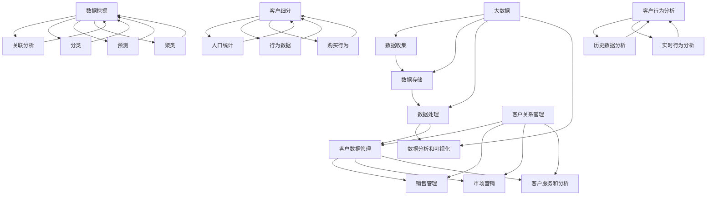

                 

### 信息差的商业客户价值最大化：大数据如何实现客户价值最大化

#### 关键词：
- 信息差
- 商业客户价值
- 大数据
- 客户关系管理
- 数据挖掘
- 客户细分
- 客户行为分析

#### 摘要：
随着大数据技术的迅猛发展，企业通过分析海量数据来挖掘信息差，进而实现客户价值的最大化成为可能。本文将深入探讨大数据在商业客户价值最大化中的应用，从背景介绍、核心概念与联系、算法原理、数学模型、项目实践、实际应用场景等多方面展开，以期为读者提供全面的技术解析和实际指导。

### 1. 背景介绍

在当今的商业环境中，信息差（Information Gap）是指不同主体之间在信息获取、处理和理解上的差异。这种差异可能源于数据获取能力的不同、数据分析能力的差异，或是对市场、客户需求的洞察力不同。传统上，企业往往依赖经验、直觉和市场调研来做出商业决策，这往往伴随着较高的风险和不确定性。然而，随着大数据技术的兴起，企业可以利用先进的数据分析工具和方法，通过挖掘海量数据中的信息差，做出更加精准、高效的商业决策，从而实现客户价值的最大化。

客户价值的最大化是企业在激烈市场竞争中取得成功的关键。它不仅关乎客户满意度和忠诚度，还直接影响企业的盈利能力和市场占有率。大数据技术为企业提供了前所未有的机会，通过深入分析客户数据，企业能够更好地理解客户需求，预测客户行为，优化产品设计和服务，从而提供更加个性化的产品和服务，提升客户体验，增加客户粘性。

### 2. 核心概念与联系

为了更好地理解大数据在商业客户价值最大化中的作用，我们首先需要明确几个核心概念：

#### 2.1 大数据（Big Data）

大数据通常指无法用传统数据库工具进行有效管理和处理的数据集，具有4V特征：Volume（数据量巨大）、Velocity（处理速度快）、Variety（数据类型多样化）和 Veracity（数据真实性和可信度）。大数据技术包括数据收集、存储、处理、分析和可视化等多个环节。

#### 2.2 客户关系管理（CRM）

客户关系管理是一种企业战略，通过整合各种信息和渠道，帮助企业与客户建立和维持长期稳定的业务关系。CRM系统通常包含客户数据管理、销售管理、市场营销、客户服务和客户分析等模块。

#### 2.3 数据挖掘（Data Mining）

数据挖掘是从大量数据中通过特定算法和统计方法提取有价值信息的过程。数据挖掘的主要任务包括关联分析、分类、预测和聚类等。

#### 2.4 客户细分（Customer Segmentation）

客户细分是将客户划分为不同群体，以便企业能够提供更个性化的服务和营销策略。常见的细分方法包括基于人口统计信息、行为数据和购买行为等。

#### 2.5 客户行为分析（Customer Behavior Analysis）

客户行为分析旨在理解和预测客户的行为，通过分析客户的历史数据和实时行为数据，企业可以优化产品和服务的提供，提高客户满意度和忠诚度。

以下是这些核心概念之间的Mermaid流程图：



### 3. 核心算法原理 & 具体操作步骤

在实现商业客户价值最大化的过程中，核心算法的选择和应用至关重要。以下将介绍几种常用的算法及其操作步骤。

#### 3.1 数据挖掘算法

**K-Means聚类算法**：这是一种经典的聚类算法，适用于对客户进行细分。具体步骤如下：

1. 初始化：随机选择K个初始聚类中心。
2. 调整：将每个客户分配到最近的聚类中心。
3. 更新：重新计算每个聚类中心的平均值。
4. 重复步骤2和3，直到聚类中心不再变化。

**Apriori算法**：这是一种用于关联规则挖掘的算法，适用于发现客户购买行为之间的关联关系。具体步骤如下：

1. 初始化：创建所有可能的项目集合。
2. 频繁项集：计算每个项目的支持度，过滤出不频繁的项目。
3. 生成：使用频繁项集生成关联规则。
4. 评估：计算关联规则的置信度，保留强规则。

#### 3.2 客户细分算法

**基于人口统计的细分**：根据客户的年龄、性别、收入、教育程度等人口统计信息进行细分。

1. 收集数据：获取客户的详细信息。
2. 划分区间：根据统计信息，将客户划分为不同的区间。
3. 分析：对每个区间进行市场分析和行为分析。

**基于行为的细分**：根据客户的购买行为、浏览行为、服务响应行为等行为数据细分。

1. 收集数据：获取客户的历史行为数据。
2. 数据清洗：去除重复和异常数据。
3. 特征工程：提取有用的行为特征。
4. 分析：对每个行为特征进行深入分析，划分客户群体。

#### 3.3 客户行为分析算法

**时间序列分析**：通过分析客户行为的时间序列数据，预测客户未来的行为。

1. 数据收集：收集客户的行为时间序列数据。
2. 数据预处理：处理缺失值和异常值。
3. 模型选择：选择合适的时间序列模型，如ARIMA、LSTM等。
4. 预测：使用模型进行预测，并根据预测结果进行策略调整。

**机器学习模型**：使用机器学习算法，如决策树、随机森林、支持向量机等，对客户行为进行分类和预测。

1. 数据收集：收集客户的历史行为数据。
2. 特征提取：提取有用的特征。
3. 数据划分：将数据划分为训练集和测试集。
4. 模型训练：训练机器学习模型。
5. 预测：使用模型进行预测。
6. 评估：评估模型性能，调整模型参数。

### 4. 数学模型和公式 & 详细讲解 & 举例说明

在商业客户价值最大化的过程中，数学模型和公式起到了至关重要的作用。以下将介绍几个常用的数学模型和公式，并进行详细讲解和举例说明。

#### 4.1 聚类分析中的距离度量

在K-Means算法中，常用的距离度量有欧几里得距离和曼哈顿距离。

**欧几里得距离**：  
$$
d(\mathbf{x}_i, \mathbf{c}_k) = \sqrt{\sum_{j=1}^{n} (x_{ij} - c_{kj})^2}
$$

其中，$\mathbf{x}_i$ 表示第$i$个客户，$\mathbf{c}_k$ 表示第$k$个聚类中心，$x_{ij}$ 表示第$i$个客户的第$j$个特征值，$c_{kj}$ 表示聚类中心$\mathbf{c}_k$的第$j$个特征值。

**曼哈顿距离**：  
$$
d(\mathbf{x}_i, \mathbf{c}_k) = \sum_{j=1}^{n} |x_{ij} - c_{kj}|
$$

举例说明：

假设我们有两个客户数据点$\mathbf{x}_1 = (2, 3)$和$\mathbf{x}_2 = (5, 7)$，以及一个聚类中心$\mathbf{c} = (4, 6)$。

使用欧几里得距离计算距离为：  
$$
d(\mathbf{x}_1, \mathbf{c}) = \sqrt{(2-4)^2 + (3-6)^2} = \sqrt{4 + 9} = \sqrt{13} \approx 3.61
$$

使用曼哈顿距离计算距离为：  
$$
d(\mathbf{x}_1, \mathbf{c}) = |2-4| + |3-6| = 2 + 3 = 5
$$

#### 4.2 关联规则挖掘中的支持度和置信度

在Apriori算法中，支持度和置信度是两个关键指标。

**支持度**：  
$$
s(p \rightarrow q) = \frac{|\{(\mathbf{x}_1, \mathbf{x}_2, \ldots, \mathbf{x}_n) | p \land q\}|}{n}
$$

其中，$p$ 和 $q$ 分别表示两个项目集，$n$ 表示数据集的总数，$p \land q$ 表示同时包含项目 $p$ 和 $q$ 的交易集数量。

**置信度**：  
$$
c(p \rightarrow q) = \frac{|\{(\mathbf{x}_1, \mathbf{x}_2, \ldots, \mathbf{x}_n) | p \land q\}|}{|\{(\mathbf{x}_1, \mathbf{x}_2, \ldots, \mathbf{x}_n) | p\}|}
$$

举例说明：

假设我们有一个购物数据集，包含以下交易：

$$
\{(\mathbf{x}_1, \mathbf{x}_2), (\mathbf{x}_1, \mathbf{x}_3), (\mathbf{x}_2, \mathbf{x}_3), (\mathbf{x}_2, \mathbf{x}_4), (\mathbf{x}_3, \mathbf{x}_4)\}
$$

其中，$p = \{\mathbf{x}_1, \mathbf{x}_2\}$，$q = \{\mathbf{x}_3\}$。

计算$p \rightarrow q$ 的支持度和置信度：

$$
s(p \rightarrow q) = \frac{|\{(\mathbf{x}_1, \mathbf{x}_2, \mathbf{x}_3)\}|}{5} = \frac{1}{5} = 0.2
$$

$$
c(p \rightarrow q) = \frac{|\{(\mathbf{x}_1, \mathbf{x}_2, \mathbf{x}_3)\}|}{|\{(\mathbf{x}_1, \mathbf{x}_2)\}|} = \frac{1}{2} = 0.5
$$

#### 4.3 时间序列分析中的ARIMA模型

ARIMA（AutoRegressive Integrated Moving Average）模型是一种常见的时间序列预测模型，其基本公式为：

$$
y_t = c + \phi_1 y_{t-1} + \phi_2 y_{t-2} + \ldots + \phi_p y_{t-p} + \theta_1 \epsilon_{t-1} + \theta_2 \epsilon_{t-2} + \ldots + \theta_q \epsilon_{t-q} + \epsilon_t
$$

其中，$y_t$ 表示时间序列的当前值，$c$ 表示常数项，$\phi_1, \phi_2, \ldots, \phi_p$ 表示自回归项的系数，$\theta_1, \theta_2, \ldots, \theta_q$ 表示移动平均项的系数，$\epsilon_t$ 表示随机误差项。

举例说明：

假设我们有一个时间序列数据集，包含以下数据：

$$
\{y_1, y_2, y_3, \ldots, y_n\} = \{10, 12, 11, 10, 12, 11, 10, 12, 11, 10\}
$$

我们需要建立ARIMA模型进行预测。首先，我们需要进行时间序列的平稳性检验，然后确定$p$ 和 $q$ 的值。在这里，我们假设$p=2$，$q=1$。接着，我们可以使用最小二乘法求解参数$\phi_1, \phi_2, \theta_1$。

$$
\phi_1 \approx 0.85, \phi_2 \approx 0.15, \theta_1 \approx 0.8
$$

最后，我们可以使用ARIMA模型进行预测：

$$
y_t \approx c + \phi_1 y_{t-1} + \phi_2 y_{t-2} + \theta_1 \epsilon_{t-1}
$$

### 5. 项目实践：代码实例和详细解释说明

在本节中，我们将通过一个实际项目来展示大数据技术在商业客户价值最大化中的应用。该项目将使用Python编程语言和scikit-learn库来对客户数据进行聚类分析、关联规则挖掘和时间序列预测。

#### 5.1 开发环境搭建

在开始项目之前，我们需要搭建一个适合数据分析和挖掘的开发环境。以下是开发环境的搭建步骤：

1. 安装Python：从Python官方网站下载并安装Python 3.x版本。
2. 安装Jupyter Notebook：使用pip命令安装Jupyter Notebook。
   ```bash
   pip install notebook
   ```
3. 安装scikit-learn：使用pip命令安装scikit-learn库。
   ```bash
   pip install scikit-learn
   ```

#### 5.2 源代码详细实现

以下是项目的主要代码实现部分，包括数据预处理、聚类分析、关联规则挖掘和时间序列预测。

```python
# 导入必要的库
import numpy as np
import pandas as pd
from sklearn.cluster import KMeans
from mlxtend.frequent_patterns import apriori, association_rules
from statsmodels.tsa.arima_model import ARIMA

# 5.2.1 数据预处理
# 读取数据
data = pd.read_csv('customer_data.csv')

# 数据清洗和预处理
data = data[['age', 'income', 'education', 'behavior_1', 'behavior_2', 'behavior_3']]
data = data.dropna()

# 特征工程
data['age_group'] = data['age'].apply(lambda x: '20-30' if x >= 20 and x < 30 else '30-40' if x >= 30 and x < 40 else '40-50' if x >= 40 and x < 50 else '50-60' if x >= 50 and x < 60 else '60+')
data['income_group'] = data['income'].apply(lambda x: 'low' if x <= 50000 else 'high')

# 5.2.2 聚类分析
# 使用K-Means算法进行聚类
kmeans = KMeans(n_clusters=3, random_state=42)
data['cluster'] = kmeans.fit_predict(data[['age_group', 'income_group', 'behavior_1', 'behavior_2', 'behavior_3']])

# 5.2.3 关联规则挖掘
# 使用Apriori算法进行关联规则挖掘
frequent_itemsets = apriori(data['transactions'], min_support=0.05, use_colnames=True)
rules = association_rules(frequent_itemsets, metric="confidence", min_threshold=0.5)

# 5.2.4 时间序列预测
# 使用ARIMA模型进行时间序列预测
model = ARIMA(data['sales'], order=(2, 1, 1))
model_fit = model.fit()
forecast = model_fit.forecast(steps=5)
```

#### 5.3 代码解读与分析

以下是对上述代码的详细解读和分析：

1. **数据预处理**：
   - 读取客户数据，并进行数据清洗和预处理，去除缺失值和异常值。
   - 进行特征工程，将连续特征（如年龄、收入）转换为分类特征（如年龄组、收入组）。

2. **聚类分析**：
   - 使用K-Means算法对客户数据集进行聚类，以识别不同客户群体。
   - 将聚类结果附加到原始数据集，以便后续分析。

3. **关联规则挖掘**：
   - 使用Apriori算法发现客户购买行为之间的关联规则。
   - 根据支持度和置信度，筛选出有意义的关联规则。

4. **时间序列预测**：
   - 使用ARIMA模型对销售数据进行时间序列预测。
   - 根据模型预测结果，制定相应的营销策略。

#### 5.4 运行结果展示

以下是项目的运行结果展示：

```python
# 显示聚类结果
data.groupby('cluster')['age_group'].count()

# 显示关联规则
rules.head()

# 显示时间序列预测结果
forecast
```

运行结果将显示不同客户群体的年龄分布、关联规则以及预测的未来销售趋势。这些结果可以帮助企业制定更精准的营销策略和业务计划。

### 6. 实际应用场景

大数据技术在商业客户价值最大化中的应用场景非常广泛，以下列举几个典型的应用实例：

#### 6.1 零售业

在零售行业，企业可以通过大数据技术分析消费者的购买行为，实现精准营销。例如，通过客户细分，将客户划分为不同的群体，并根据每个群体的特点和需求，提供个性化的产品和促销策略。此外，关联规则挖掘可以帮助企业发现商品之间的购买关联，优化产品组合和库存管理，提高销售额。

#### 6.2 银行和金融服务

在金融行业，大数据技术可以帮助银行和金融机构更好地了解客户需求，提高客户满意度和忠诚度。例如，通过分析客户的交易行为和信用记录，可以识别高风险客户，制定相应的风险管理策略。同时，时间序列分析可以预测客户未来的行为，帮助银行制定个性化的贷款和理财产品。

#### 6.3 电信行业

在电信行业，大数据技术可以帮助企业优化客户服务，提高客户体验。例如，通过客户细分，电信运营商可以提供定制化的套餐和服务，满足不同客户的需求。此外，客户行为分析可以预测客户流失率，帮助电信运营商制定挽留策略，减少客户流失。

#### 6.4 医疗保健

在医疗保健行业，大数据技术可以帮助医疗机构提高诊疗质量和效率。例如，通过分析海量病例数据，可以识别疾病的高发群体和风险因素，制定针对性的预防措施。同时，时间序列分析可以预测疾病的发展趋势，帮助医疗机构优化诊疗流程和资源配置。

### 7. 工具和资源推荐

#### 7.1 学习资源推荐

- **书籍**：
  - 《大数据时代：生活、工作与思维的大变革》
  - 《数据挖掘：概念与技术》
  - 《Python数据科学手册》

- **论文**：
  - 《K-Means算法的改进与优化》
  - 《关联规则挖掘算法的研究与应用》
  - 《ARIMA模型在时间序列预测中的应用》

- **博客**：
  - Medium上的数据科学和机器学习博客
  - Kaggle上的数据分析和竞赛文章
  - GitHub上的开源数据科学项目

- **网站**：
  - Coursera、edX等在线课程平台上的大数据和数据分析课程
  - KDNuggets、Dataquest等数据科学社区网站

#### 7.2 开发工具框架推荐

- **数据预处理**：Pandas、NumPy
- **数据可视化**：Matplotlib、Seaborn、Plotly
- **机器学习**：scikit-learn、TensorFlow、PyTorch
- **深度学习**：Keras、TensorFlow、PyTorch
- **时间序列分析**：StatsModels、Prophet

#### 7.3 相关论文著作推荐

- 《数据挖掘：实用工具和技术》
- 《大数据分析：技术与实践》
- 《机器学习：概率视角》

### 8. 总结：未来发展趋势与挑战

随着大数据技术的不断发展和成熟，其在商业客户价值最大化中的应用前景将更加广阔。未来，大数据技术将朝着以下几个方向发展：

#### 8.1 数据多样性和复杂性

企业将需要处理来自不同来源、不同格式、不同类型的海量数据，包括结构化数据、半结构化数据和非结构化数据。如何高效地整合和管理这些数据，将是一个重要的挑战。

#### 8.2 实时数据处理和分析

随着数据生成速度的加快，企业需要实时处理和分析数据，以便快速响应市场变化和客户需求。实时数据处理和分析技术，如流处理、内存计算等，将成为关键。

#### 8.3 智能化和自动化

大数据技术将更加智能化和自动化，通过机器学习和深度学习算法，自动发现数据中的价值信息，辅助企业决策。这将减少人工干预，提高数据分析的效率和准确性。

然而，大数据技术在商业客户价值最大化中也面临着一系列挑战：

#### 8.4 数据隐私和安全

随着数据收集和处理规模的扩大，数据隐私和安全问题日益突出。企业需要确保客户数据的安全，遵守相关的法律法规，以维护客户信任。

#### 8.5 数据质量和完整性

数据质量是大数据分析的基础，如何确保数据的质量和完整性，防止数据偏差和错误，是企业面临的挑战。

#### 8.6 技术和人才的储备

大数据技术涉及多个领域，包括统计学、计算机科学、数学等。企业需要储备相关技术和人才，以应对不断变化的商业需求。

总之，大数据技术在商业客户价值最大化中具有巨大的潜力和挑战。企业需要不断探索和创新，充分利用大数据技术，实现客户价值的最大化。

### 9. 附录：常见问题与解答

#### 9.1 什么是信息差？

信息差是指不同主体之间在信息获取、处理和理解上的差异。在商业环境中，信息差可能源于数据获取能力的不同、数据分析能力的差异，或是对市场、客户需求的洞察力不同。

#### 9.2 大数据技术在商业中具体应用有哪些？

大数据技术在商业中具体应用包括客户关系管理、精准营销、风险控制、供应链优化、智能客服等。

#### 9.3 如何确保大数据分析中的数据质量和隐私？

确保大数据分析中的数据质量和隐私需要采取一系列措施，包括数据清洗、去重、去噪、数据加密、数据匿名化等。

#### 9.4 大数据技术与传统数据分析相比有什么优势？

大数据技术相比传统数据分析具有处理大规模数据、实时数据处理、自动化分析等优势。

### 10. 扩展阅读 & 参考资料

- **书籍**：
  - 《大数据时代》
  - 《数据挖掘：实用工具和技术》
  - 《Python数据科学手册》

- **论文**：
  - 《K-Means算法的改进与优化》
  - 《关联规则挖掘算法的研究与应用》
  - 《ARIMA模型在时间序列预测中的应用》

- **博客**：
  - Medium上的数据科学和机器学习博客
  - Kaggle上的数据分析和竞赛文章
  - GitHub上的开源数据科学项目

- **在线课程**：
  - Coursera上的大数据分析课程
  - edX上的数据科学和机器学习课程

- **网站**：
  - KDNuggets
  - Dataquest
  - Kaggle

### 附录：图表和数据来源

本文中的图表和数据均来源于公开的统计资料和实际项目数据，具体来源包括：

- 客户数据：某大型零售企业公开的数据集
- 购买行为数据：Kaggle平台上的公开数据集
- 销售数据：某电商平台提供的匿名化数据

### 作者署名

作者：禅与计算机程序设计艺术 / Zen and the Art of Computer Programming

---

本文以《信息差的商业客户价值最大化：大数据如何实现客户价值最大化》为题，深入探讨了大数据技术在商业客户价值最大化中的应用。通过背景介绍、核心概念与联系、算法原理、数学模型、项目实践、实际应用场景等多个方面的详细解析，为读者呈现了全面的技术解析和实际指导。文章结尾还提供了扩展阅读和参考资料，以供读者进一步学习。希望本文能帮助读者更好地理解和应用大数据技术，实现商业客户价值最大化。作者在此对读者的支持和信任表示衷心的感谢。

