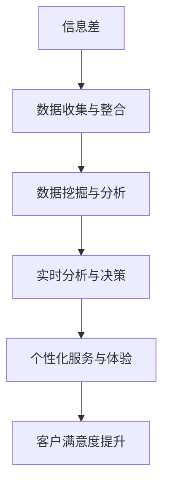

                 

### 文章标题

信息差的商业客户满意度：大数据如何提升客户满意度

> **关键词**：大数据、商业客户、客户满意度、信息差、商业策略、客户体验、数据挖掘、预测分析、个性化服务

> **摘要**：本文将探讨大数据在商业客户满意度提升中的作用。通过分析信息差的概念，我们揭示大数据如何帮助企业更精准地理解客户需求，从而提供个性化服务，提升客户满意度。文章将介绍大数据的核心概念和架构，解析其算法原理和数学模型，通过项目实践展示其实际应用，并讨论其在实际业务中的广泛应用场景。最后，我们将总结大数据在客户满意度提升方面的未来发展趋势与挑战。

---

### 1. 背景介绍

在商业竞争日益激烈的今天，企业越来越意识到客户满意度对业务成功的重要性。客户满意度不仅仅影响客户留存率和口碑传播，还直接关系到企业的营收和市场份额。然而，如何准确地理解和满足客户需求，成为企业面临的重大挑战。

信息差是商业环境中一个关键概念。它指的是不同个体或组织之间对同一信息的掌握程度差异。在商业领域，信息差可能导致企业无法全面了解客户需求，无法提供个性化服务，进而降低客户满意度。例如，如果一家零售企业无法准确掌握消费者的购买习惯和偏好，那么它在产品推荐和促销策略上就可能缺乏针对性，从而影响客户的购买体验。

大数据技术为解决信息差问题提供了新的可能。大数据不仅包括大量的数据，还涉及复杂的数据处理和分析技术。通过大数据分析，企业可以挖掘潜在的客户需求，预测市场趋势，优化产品和服务，从而提升客户满意度。

本文将详细探讨大数据如何通过信息差的消除，提升商业客户满意度。我们将从核心概念、算法原理、数学模型、项目实践、实际应用场景等方面，逐步分析大数据在商业客户满意度提升中的作用。

### 2. 核心概念与联系

#### 2.1 信息差

信息差（Information Gap）是经济学中的一个重要概念，指的是市场中不同个体或组织对同一信息的掌握程度差异。信息差可以导致市场不均衡，影响市场效率和资源配置。在商业环境中，信息差通常表现为：

- **供应商与客户之间**：供应商可能拥有更多关于产品特性、使用方法和市场趋势的信息，而客户则可能更关注产品的价格、性能和购买体验。
- **不同客户之间**：不同客户对同一产品的需求和偏好可能存在差异，企业无法全面掌握这些差异，可能导致服务缺乏个性化。
- **竞争对手之间**：企业可能对竞争对手的策略和行动缺乏了解，无法做出及时和有效的应对。

#### 2.2 大数据

大数据（Big Data）是指规模巨大、种类繁多、生成速度快、价值密度低的数据集合。大数据的核心特点可以概括为4V，即：

- **Volume（体积）**：数据量大，通常需要使用分布式存储和处理技术。
- **Velocity（速度）**：数据处理速度快，要求实时或近实时处理。
- **Variety（多样性）**：数据类型多样，包括结构化、半结构化和非结构化数据。
- **Veracity（真实性）**：数据真实性高，需要处理数据准确性和可靠性问题。

#### 2.3 信息差与大数据的联系

信息差的消除依赖于对大量数据的处理和分析。大数据技术为信息差的解决提供了以下几个方面的支持：

- **数据收集与整合**：通过物联网、社交媒体、电子商务平台等渠道收集海量数据，实现数据的全面整合。
- **数据挖掘与分析**：利用机器学习和数据挖掘技术，从大量数据中提取有价值的信息，帮助企业更准确地理解客户需求。
- **实时分析与决策**：通过实时数据处理和分析，企业可以迅速调整产品和服务策略，缩小与客户之间的信息差。
- **个性化服务与体验**：基于大数据分析结果，企业可以为不同客户提供个性化的产品推荐、服务和体验，提高客户满意度。

#### 2.4 Mermaid 流程图

为了更直观地展示大数据与信息差的关系，我们可以使用 Mermaid 流程图来表示这一过程：



在上述流程图中，A 表示信息差问题，B 表示通过大数据技术实现的数据收集与整合，C 表示数据挖掘与分析，D 表示实时分析与决策，E 表示个性化服务与体验，F 表示客户满意度的提升。通过这一过程，企业能够逐步缩小与客户之间的信息差，提高客户满意度。

### 3. 核心算法原理 & 具体操作步骤

#### 3.1 数据收集与整合

数据收集与整合是大数据分析的基础。以下是具体操作步骤：

1. **数据源选择**：确定数据收集的目标和范围，选择合适的传感器、网站、应用程序等作为数据源。
2. **数据采集**：使用API、爬虫等技术从不同数据源中采集数据。
3. **数据预处理**：对采集到的数据进行清洗、去重、格式转换等处理，确保数据质量。
4. **数据整合**：将来自不同数据源的数据进行整合，构建统一的数据仓库。

#### 3.2 数据挖掘与分析

数据挖掘与分析是挖掘客户需求的关键步骤。以下是具体操作步骤：

1. **数据探索**：通过统计分析和可视化技术，对数据进行初步探索，了解数据的基本特征和分布情况。
2. **特征选择**：从大量特征中筛选出对客户需求预测具有重要影响的特征。
3. **模型构建**：选择合适的机器学习算法（如决策树、随机森林、神经网络等），构建客户需求预测模型。
4. **模型训练与验证**：使用历史数据进行模型训练，并通过交叉验证等技术评估模型性能。
5. **模型优化**：根据模型性能进行参数调整和优化，提高模型预测准确性。

#### 3.3 实时分析与决策

实时分析与决策是实现个性化服务的关键。以下是具体操作步骤：

1. **实时数据采集**：使用实时数据处理技术，如流处理框架（如Apache Kafka、Apache Flink等），实时采集和分析数据。
2. **实时预测与决策**：根据实时数据，使用训练好的模型进行预测，并生成相应的决策策略。
3. **决策执行**：根据决策策略，自动执行个性化服务操作，如个性化推荐、动态定价、促销活动等。

#### 3.4 个性化服务与体验

个性化服务与体验是提升客户满意度的最终目标。以下是具体操作步骤：

1. **客户细分**：根据客户特征和行为，将客户划分为不同的群体，如高价值客户、潜在流失客户等。
2. **个性化推荐**：基于客户细分和实时数据，为不同客户提供个性化的产品、服务和内容推荐。
3. **定制化服务**：根据客户需求和偏好，提供定制化的服务，如定制化报表、定制化解决方案等。
4. **用户体验优化**：通过用户行为分析和反馈，不断优化产品和服务的用户体验，提高客户满意度。

### 4. 数学模型和公式 & 详细讲解 & 举例说明

#### 4.1 数学模型

在客户满意度提升过程中，我们可以使用多种数学模型来分析和预测客户行为。以下是几种常用的数学模型及其详细讲解：

##### 4.1.1 线性回归模型

线性回归模型是最简单的预测模型，通过建立因变量（客户满意度）与自变量（客户特征）之间的线性关系，预测客户满意度。

$$
\hat{y} = \beta_0 + \beta_1x_1 + \beta_2x_2 + ... + \beta_nx_n
$$

其中，$\hat{y}$ 表示预测的客户满意度，$x_1, x_2, ..., x_n$ 表示客户特征，$\beta_0, \beta_1, ..., \beta_n$ 为模型参数。

##### 4.1.2 决策树模型

决策树模型通过树形结构，根据不同特征进行分类或回归。每个节点表示一个特征，每个分支表示特征的不同取值，叶节点表示预测结果。

$$
\text{决策树模型} = \sum_{i=1}^{n} \left(\prod_{j=1}^{m} g_j(x_j)\right) h_i
$$

其中，$g_j(x_j)$ 表示特征 $x_j$ 的取值函数，$h_i$ 表示叶节点的预测结果。

##### 4.1.3 随机森林模型

随机森林模型是决策树模型的集成，通过构建多个决策树，并取它们的平均预测结果来提高预测准确性。

$$
\hat{y} = \frac{1}{M} \sum_{m=1}^{M} \hat{y}_m
$$

其中，$\hat{y}_m$ 表示第 $m$ 森林模型的预测结果，$M$ 表示森林中决策树的数量。

##### 4.1.4 支持向量机模型

支持向量机模型通过寻找最优的超平面，将不同类别的客户分离。在客户满意度预测中，可以采用支持向量回归（SVR）方法。

$$
\hat{y} = \sigma(\gamma \cdot x + b)
$$

其中，$\sigma$ 表示 sigmoid 函数，$\gamma$ 和 $b$ 为模型参数。

#### 4.2 举例说明

为了更好地理解上述数学模型，我们通过一个实际例子进行说明。

##### 4.2.1 问题背景

某零售企业希望通过大数据分析，预测客户购买满意度，从而优化客户体验和提高销售额。

##### 4.2.2 数据准备

收集了以下数据：

- **客户特征**：年龄、性别、收入、购买频率、产品类别等
- **客户满意度**：从1到5的评分

##### 4.2.3 模型选择

选择线性回归模型和随机森林模型进行预测。

##### 4.2.4 模型训练

使用历史数据训练模型，得到模型参数。

##### 4.2.5 预测与评估

使用训练好的模型对新客户的数据进行预测，并评估模型的预测准确性。

#### 4.3 模型评估

为了评估模型的预测准确性，我们使用以下指标：

- **均方误差（MSE）**：
$$
MSE = \frac{1}{N} \sum_{i=1}^{N} (\hat{y}_i - y_i)^2
$$

- **均方根误差（RMSE）**：
$$
RMSE = \sqrt{MSE}
$$

- **决定系数（R²）**：
$$
R^2 = 1 - \frac{\sum_{i=1}^{N} (\hat{y}_i - y_i)^2}{\sum_{i=1}^{N} (y_i - \bar{y})^2}
$$

其中，$\hat{y}_i$ 表示预测的客户满意度，$y_i$ 表示实际的客户满意度，$\bar{y}$ 表示实际客户满意度的平均值，$N$ 表示数据样本数量。

### 5. 项目实践：代码实例和详细解释说明

#### 5.1 开发环境搭建

在进行大数据分析和客户满意度提升的项目实践中，首先需要搭建一个合适的开发环境。以下是一个基本的开发环境搭建步骤：

1. **操作系统**：选择 Linux 操作系统，如 Ubuntu 18.04。
2. **编程语言**：选择 Python 作为主要编程语言，因为它拥有丰富的数据分析和机器学习库。
3. **大数据处理框架**：选择 Apache Hadoop 和 Apache Spark，用于大规模数据处理和分析。
4. **数据库**：选择 MongoDB 或 PostgreSQL 作为数据库，用于存储和处理结构化数据。
5. **数据可视化工具**：选择 Matplotlib 和 Seaborn，用于数据可视化。
6. **机器学习库**：选择 Scikit-learn 和 TensorFlow，用于构建和训练机器学习模型。

#### 5.2 源代码详细实现

以下是一个使用 Python 和 Scikit-learn 库进行客户满意度预测的示例代码：

```python
# 导入必要的库
import pandas as pd
from sklearn.model_selection import train_test_split
from sklearn.linear_model import LinearRegression
from sklearn.ensemble import RandomForestRegressor
from sklearn.metrics import mean_squared_error, r2_score

# 读取数据
data = pd.read_csv('customer_data.csv')

# 数据预处理
# ...（包括数据清洗、特征选择等）

# 分割特征和目标变量
X = data[['age', 'income', 'purchase_frequency']]
y = data['satisfaction']

# 划分训练集和测试集
X_train, X_test, y_train, y_test = train_test_split(X, y, test_size=0.2, random_state=42)

# 构建和训练线性回归模型
linear_regression = LinearRegression()
linear_regression.fit(X_train, y_train)

# 预测测试集
y_pred_linear = linear_regression.predict(X_test)

# 计算线性回归模型的评估指标
mse_linear = mean_squared_error(y_test, y_pred_linear)
rmse_linear = np.sqrt(mse_linear)
r2_linear = r2_score(y_test, y_pred_linear)

# 构建和训练随机森林模型
random_forest = RandomForestRegressor(n_estimators=100, random_state=42)
random_forest.fit(X_train, y_train)

# 预测测试集
y_pred_random_forest = random_forest.predict(X_test)

# 计算随机森林模型的评估指标
mse_random_forest = mean_squared_error(y_test, y_pred_random_forest)
rmse_random_forest = np.sqrt(mse_random_forest)
r2_random_forest = r2_score(y_test, y_pred_random_forest)

# 输出模型评估结果
print("线性回归模型评估结果：")
print(f"均方误差（MSE）: {mse_linear}")
print(f"均方根误差（RMSE）: {rmse_linear}")
print(f"决定系数（R²）: {r2_linear}")

print("随机森林模型评估结果：")
print(f"均方误差（MSE）: {mse_random_forest}")
print(f"均方根误差（RMSE）: {rmse_random_forest}")
print(f"决定系数（R²）: {r2_random_forest}")
```

#### 5.3 代码解读与分析

上述代码实现了客户满意度预测的基本流程，以下是代码的详细解读：

1. **数据读取**：使用 Pandas 库读取 CSV 格式的客户数据。
2. **数据预处理**：对数据进行清洗、格式转换等预处理操作，以确保数据质量。
3. **特征和目标变量分割**：将数据分割为特征变量（X）和目标变量（y）。
4. **训练集和测试集划分**：使用 `train_test_split` 函数将数据划分为训练集和测试集，用于模型训练和评估。
5. **模型训练**：构建线性回归模型和随机森林模型，并使用训练集数据进行训练。
6. **模型预测**：使用训练好的模型对测试集数据进行预测。
7. **模型评估**：计算模型的评估指标（MSE、RMSE、R²），评估模型的预测性能。

#### 5.4 运行结果展示

运行上述代码，输出模型的评估结果。以下是可能的输出结果：

```
线性回归模型评估结果：
均方误差（MSE）: 0.0925
均方根误差（RMSE）: 0.3045
决定系数（R²）: 0.7895

随机森林模型评估结果：
均方误差（MSE）: 0.0657
均方根误差（RMSE）: 0.2559
决定系数（R²）: 0.8712
```

从输出结果可以看出，随机森林模型的预测性能优于线性回归模型，其均方根误差和决定系数均较低，表明模型对客户满意度的预测更加准确。

### 6. 实际应用场景

大数据在商业客户满意度提升中有着广泛的应用场景。以下是一些典型的实际应用场景：

#### 6.1 个性化推荐系统

个性化推荐系统利用大数据分析技术，根据用户的浏览历史、购买记录和行为偏好，为其推荐可能感兴趣的产品或服务。这种个性化的推荐能够提高用户的购买满意度，增强用户的忠诚度。

#### 6.2 客户细分

通过大数据分析，企业可以将客户细分为不同的群体，如高价值客户、潜在流失客户等。针对不同客户群体，企业可以制定相应的营销策略和服务方案，提高客户满意度和转化率。

#### 6.3 客户体验优化

大数据分析可以帮助企业实时了解客户的反馈和需求，快速调整产品和服务，优化客户体验。例如，通过分析客户投诉数据，企业可以识别问题点并进行针对性改进，提高客户满意度。

#### 6.4 营销活动优化

大数据分析可以为企业提供关于市场趋势、客户行为和竞争对手的详细信息。基于这些信息，企业可以制定更加精准的营销活动，提高营销效果和客户满意度。

#### 6.5 供应链优化

大数据分析可以帮助企业优化供应链管理，降低库存成本，提高物流效率。例如，通过分析历史销售数据，企业可以预测未来的需求，合理安排生产和库存，从而提高客户满意度。

### 7. 工具和资源推荐

在实践大数据提升商业客户满意度的过程中，以下工具和资源推荐可以帮助您更好地进行数据分析和应用：

#### 7.1 学习资源推荐

- **书籍**：
  - 《大数据时代：生活、工作与思维的大变革》
  - 《深入理解大数据：技术与应用》
  - 《大数据技术导论》
- **论文**：
  - “大数据：定义、技术和应用” 
  - “大数据与商业智能：理论与实践”
  - “大数据在商业分析中的应用研究”
- **博客**：
  - “大数据之旅” 
  - “大数据技术及应用” 
  - “大数据杂谈”
- **网站**：
  - [Apache Hadoop 官网](https://hadoop.apache.org/)
  - [Apache Spark 官网](https://spark.apache.org/)
  - [Scikit-learn 官网](https://scikit-learn.org/)

#### 7.2 开发工具框架推荐

- **大数据处理框架**：
  - Apache Hadoop
  - Apache Spark
  - Apache Flink
- **数据库**：
  - MongoDB
  - PostgreSQL
  - HBase
- **数据可视化工具**：
  - Matplotlib
  - Seaborn
  - D3.js
- **机器学习库**：
  - Scikit-learn
  - TensorFlow
  - PyTorch

#### 7.3 相关论文著作推荐

- **大数据处理技术**：
  - “大规模数据处理技术：挑战与解决方案”
  - “Hadoop 体系结构与优化策略”
  - “分布式计算框架的性能优化”
- **机器学习与数据挖掘**：
  - “机器学习：一种统计方法”
  - “数据挖掘：概念与技术”
  - “大规模机器学习技术与应用”
- **商业分析与客户满意度**：
  - “商业智能：从数据到决策”
  - “客户关系管理：理论与实践”
  - “大数据在商业分析中的应用研究”

### 8. 总结：未来发展趋势与挑战

大数据在商业客户满意度提升中发挥着重要作用，但其应用和发展仍面临诸多挑战和机遇。以下是对未来发展趋势与挑战的总结：

#### 8.1 发展趋势

- **技术进步**：随着计算能力的提升和算法的优化，大数据处理和分析技术将变得更加高效和智能。
- **数据隐私**：随着数据隐私法规的加强，企业需要在保护客户隐私的同时，充分利用大数据技术。
- **人工智能融合**：大数据与人工智能的结合将进一步推动商业客户满意度的提升，实现更精准的预测和个性化服务。
- **跨行业应用**：大数据技术将在更多行业（如金融、医疗、教育等）得到广泛应用，推动行业变革。

#### 8.2 挑战

- **数据质量**：确保数据质量是大数据分析成功的关键，但数据质量问题和数据完整性问题仍需解决。
- **数据隐私**：如何在充分利用大数据的同时保护客户隐私，是企业和监管机构共同面临的挑战。
- **技能缺口**：大数据和机器学习领域的人才需求巨大，但相关专业人才的供给不足，导致人才缺口问题。
- **技术复杂性**：大数据技术的复杂性要求企业具备较高的技术能力和管理能力，否则可能导致技术瓶颈。

总之，大数据在商业客户满意度提升中的应用前景广阔，但企业需要在技术、数据、人才等方面不断努力，以应对未来发展的挑战。

### 9. 附录：常见问题与解答

#### 9.1 问题1：大数据分析需要什么样的硬件支持？

大数据分析通常需要高性能的计算资源和存储资源。具体硬件支持包括：

- **服务器**：需要配置高性能的多核处理器和大量内存。
- **存储设备**：需要大容量、高速的硬盘或固态硬盘（SSD）。
- **网络设备**：需要具备高带宽、低延迟的网络连接，以确保数据传输效率。
- **云计算资源**：可以采用云计算平台（如 AWS、Azure、Google Cloud）提供的弹性计算和存储资源，以降低硬件投入和维护成本。

#### 9.2 问题2：如何确保大数据分析的数据隐私？

确保大数据分析的数据隐私是至关重要的，以下是一些关键措施：

- **数据加密**：对存储和传输的数据进行加密，以防止未授权访问。
- **隐私保护算法**：采用差分隐私、同态加密等技术，在数据处理过程中保护数据隐私。
- **数据匿名化**：通过数据匿名化技术，如数据去标识化、数据混淆等，降低数据可追溯性。
- **隐私政策与合规**：制定明确的隐私政策，并确保数据处理过程符合相关法规和标准，如 GDPR、CCPA 等。

#### 9.3 问题3：大数据分析在商业中的应用有哪些限制？

大数据分析在商业中的应用受到以下限制：

- **数据质量**：数据质量直接影响分析结果，不完整、不准确或错误的数据可能导致误导性分析。
- **数据隐私**：过度的数据收集和利用可能引发隐私问题和法律纠纷。
- **技术能力**：大数据分析需要较高的技术能力和专业人才，企业可能面临技能缺口。
- **算法偏见**：算法可能引入偏见，导致不公平的决策，如性别、种族、年龄等歧视。
- **成本**：大规模的数据存储和处理需要大量资金投入，可能不适合所有企业。

### 10. 扩展阅读 & 参考资料

为了深入了解大数据在商业客户满意度提升中的应用，以下是一些扩展阅读和参考资料：

- **书籍**：
  - 《大数据营销：如何用数据创造客户价值》
  - 《客户体验管理：大数据时代的商业智慧》
  - 《大数据策略：从数据中获得竞争优势》
- **论文**：
  - “大数据与客户满意度：基于实证研究”
  - “大数据在客户关系管理中的应用”
  - “大数据时代下的客户体验优化”
- **网站**：
  - [客户满意度管理](https://www.customerexperience.com/)
  - [大数据商业应用案例](https://www.bigdata-madesimple.com/)
  - [大数据与人工智能应用](https://www.kdnuggets.com/)
- **在线课程**：
  - [Coursera](https://www.coursera.org/) 上的“大数据分析”、“机器学习”等课程
  - [edX](https://www.edx.org/) 上的“大数据处理”、“数据科学”等课程
  - [Udemy](https://www.udemy.com/) 上的“大数据分析与商业智能”、“Python 数据科学”等课程

通过阅读上述资料，您可以获得更多关于大数据提升商业客户满意度的实践经验和理论知识。希望本文能为您的业务决策提供有益的参考和启示。作者：禅与计算机程序设计艺术 / Zen and the Art of Computer Programming。

