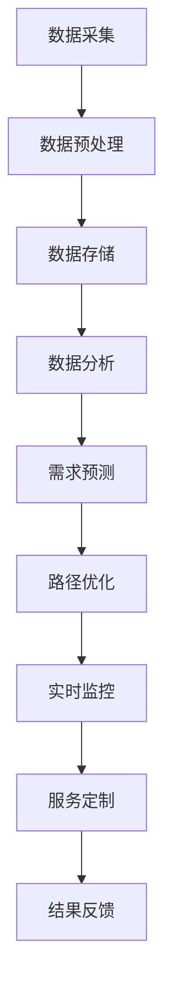

                 

### 1. 背景介绍

随着全球化的不断深入和互联网技术的飞速发展，物流行业已经成为现代经济中不可或缺的重要组成部分。物流效率的提升，不仅直接影响到企业的运营成本和竞争力，更与国家经济发展和国际贸易密切相关。然而，传统的物流体系往往存在一些固有的瓶颈，如运输路线规划不合理、库存管理不善、订单处理效率低下等。这些问题的存在，严重制约了物流行业的进一步发展。

在这个背景下，大数据技术的应用为物流行业带来了前所未有的变革机遇。通过对海量物流数据的深度挖掘和分析，我们可以从中发现隐藏的模式和规律，从而实现物流流程的优化和个性化。大数据在物流个性化中的应用，主要体现在以下几个方面：

首先，大数据技术可以帮助企业精准预测物流需求。通过对历史物流数据进行分析，企业可以准确把握不同时间、不同地区、不同产品的物流需求趋势，从而合理安排运输资源和库存管理。

其次，大数据技术可以优化物流路线规划。通过分析交通流量、天气状况、运输成本等多方面因素，大数据系统可以智能推荐最优的运输路线，从而降低运输成本、提高运输效率。

再次，大数据技术可以帮助实现物流过程的全流程监控。从订单生成、货物装载、运输过程到货物交付，大数据技术可以实时监控每一个环节，及时发现和处理异常情况，确保物流过程的高效、安全、可控。

最后，大数据技术还可以为企业提供个性化的物流服务。通过对用户行为、需求偏好等数据的分析，企业可以提供更加贴合用户需求的物流服务，提升用户体验和客户满意度。

综上所述，大数据技术在物流个性化中的应用，不仅有助于提升物流效率、降低运营成本，更能够为企业创造新的商业模式和价值。本文将围绕大数据在物流个性化中的应用，深入探讨其核心概念、算法原理、数学模型、项目实践、实际应用场景、工具和资源推荐以及未来发展趋势和挑战。

### 2. 核心概念与联系

#### 2.1.1 大数据与物流数据

大数据（Big Data）是指数据量巨大、种类繁多、生成速度快、价值密度低的数据集合。物流数据则是大数据的一个重要子类，包括运输信息、仓储信息、订单信息、客户信息等。物流数据的特点主要体现在以下几个方面：

1. **多样性**：物流数据不仅包含结构化数据（如订单信息、库存数据），还包括非结构化数据（如图片、视频、文档）。
2. **实时性**：物流活动是动态变化的，物流数据需要实时更新和处理，以保证物流活动的顺利进行。
3. **动态性**：物流数据的生成和变化是持续不断的，需要持续地进行数据采集、存储和处理。

#### 2.1.2 个性化物流

个性化物流（Personalized Logistics）是指根据客户的需求、偏好和行为，提供定制化的物流服务。个性化物流的目标是提高客户满意度，降低运营成本，提升企业竞争力。个性化物流的核心包括以下几个方面：

1. **需求预测**：通过对客户历史数据和行为的分析，预测未来的物流需求。
2. **路径优化**：根据客户需求、交通状况、运输成本等因素，智能规划最优的运输路线。
3. **服务定制**：根据客户的具体需求，提供个性化的物流服务，如即时配送、定制包装、温度控制等。

#### 2.1.3 大数据在物流个性化中的应用

大数据在物流个性化中的应用，主要通过以下几个方面实现：

1. **需求预测**：利用大数据分析技术，对历史物流数据进行挖掘和分析，预测未来的物流需求。常用的技术包括时间序列分析、机器学习算法等。
2. **路径优化**：结合大数据分析和交通预测模型，智能规划最优的运输路线。常用的技术包括路径规划算法、交通预测模型等。
3. **实时监控**：利用大数据技术，实时监控物流过程中的各个环节，及时发现和处理异常情况。常用的技术包括实时数据采集、数据流处理等。
4. **服务定制**：通过分析客户数据和偏好，提供个性化的物流服务。常用的技术包括客户关系管理（CRM）系统、推荐系统等。

#### 2.1.4 Mermaid 流程图

为了更好地理解大数据在物流个性化中的应用，下面给出一个Mermaid流程图，展示大数据在物流个性化中的核心流程。



- **数据采集**：通过传感器、GPS、物联网等技术，实时采集物流过程中的各类数据。
- **数据预处理**：对采集到的数据进行清洗、格式化、去重等处理，以便后续分析。
- **数据存储**：将预处理后的数据存储到大数据平台，如Hadoop、Spark等。
- **数据分析**：利用大数据分析技术，对存储的数据进行挖掘和分析，提取有价值的信息。
- **需求预测**：根据分析结果，预测未来的物流需求。
- **路径优化**：结合需求预测结果和交通预测模型，智能规划最优的运输路线。
- **实时监控**：实时监控物流过程中的各个环节，及时发现和处理异常情况。
- **服务定制**：根据客户数据和偏好，提供个性化的物流服务。
- **结果反馈**：收集客户反馈，不断优化物流服务。

### 3. 核心算法原理 & 具体操作步骤

#### 3.1.1 需求预测算法

需求预测是物流个性化的重要环节，其核心在于利用历史数据对未来物流需求进行准确预测。常用的需求预测算法包括时间序列分析、回归分析、机器学习算法等。下面以时间序列分析为例，介绍其原理和具体操作步骤。

##### 3.1.1.1 时间序列分析原理

时间序列分析是一种统计方法，用于分析和预测时间序列数据。时间序列数据是指在特定时间段内收集的按时间顺序排列的数据点。时间序列分析的基本原理是认为时间序列数据中存在某种趋势、周期性和季节性成分，通过对这些成分的分析和建模，可以预测未来的数据点。

时间序列分析的主要步骤包括：

1. **数据预处理**：对时间序列数据进行清洗、去噪、缺失值填充等预处理操作，以提高预测精度。
2. **特征提取**：从时间序列数据中提取特征，如趋势特征、周期性特征、季节性特征等。
3. **模型选择**：选择合适的时间序列模型，如ARIMA（自回归积分滑动平均模型）、AR（自回归模型）、MA（移动平均模型）等。
4. **模型训练与验证**：使用历史数据对模型进行训练和验证，评估模型的预测性能。
5. **预测**：使用训练好的模型对未来时间点的数据点进行预测。

##### 3.1.1.2 时间序列分析操作步骤

下面以Python中的pandas和statsmodels库为例，介绍时间序列分析的具体操作步骤。

1. **数据预处理**：

```python
import pandas as pd
import numpy as np

# 加载数据
data = pd.read_csv('logistics_data.csv')
data['date'] = pd.to_datetime(data['date'])
data.set_index('date', inplace=True)

# 数据清洗
data.fillna(method='ffill', inplace=True)
data.dropna(inplace=True)

# 数据去噪
data['demand'] = data['demand'].rolling(window=7).mean()
```

2. **特征提取**：

```python
import matplotlib.pyplot as plt

# 提取趋势特征
data['trend'] = data['demand'].diff().dropna()

# 提取周期性特征
data['cycle'] = data['demand'].rolling(window=7).mean().diff().dropna()

# 提取季节性特征
data['seasonal'] = data['demand'].rolling(window=12).mean().diff().dropna()

# 可视化
plt.figure(figsize=(12, 6))
plt.plot(data['demand'], label='原始数据')
plt.plot(data['trend'], label='趋势特征')
plt.plot(data['cycle'], label='周期性特征')
plt.plot(data['seasonal'], label='季节性特征')
plt.legend()
plt.show()
```

3. **模型选择与训练**：

```python
from statsmodels.tsa.arima.model import ARIMA

# 选择ARIMA模型
model = ARIMA(data['demand'], order=(1, 1, 1))

# 训练模型
model_fit = model.fit()

# 模型评估
print(model_fit.summary())
```

4. **预测**：

```python
# 预测未来5个时间点的需求
forecast = model_fit.forecast(steps=5)

# 可视化预测结果
plt.figure(figsize=(12, 6))
plt.plot(data['demand'], label='原始数据')
plt.plot(forecast, label='预测结果')
plt.legend()
plt.show()
```

#### 3.1.2 路径优化算法

路径优化是物流个性化的关键环节，其核心在于利用大数据技术，智能规划最优的运输路线。常用的路径优化算法包括遗传算法、蚁群算法、Dijkstra算法等。下面以遗传算法为例，介绍其原理和具体操作步骤。

##### 3.1.2.1 遗传算法原理

遗传算法是一种基于自然选择和遗传学原理的优化算法。遗传算法的基本原理包括以下几个方面：

1. **初始化种群**：随机生成一组解（染色体），作为初始种群。
2. **适应度评估**：对种群中的每个染色体进行适应度评估，适应度值越高，表示该染色体的质量越好。
3. **选择**：根据适应度值，选择优秀的染色体进行繁殖。
4. **交叉**：随机选择两个染色体，在交叉点进行基因交换，产生新的染色体。
5. **变异**：对染色体进行随机变异，增加种群的多样性。
6. **迭代**：重复选择、交叉、变异等步骤，直到满足停止条件（如达到最大迭代次数或适应度值达到阈值）。

##### 3.1.2.2 遗传算法操作步骤

下面以Python中的deap库为例，介绍遗传算法的具体操作步骤。

1. **初始化种群**：

```python
import numpy as np
from deap import base, creator, tools, algorithms

# 定义适应度函数
def fitness_function(individual):
    # 计算路径长度
    path_length = np.sum(individual) - 1

    # 计算适应度值
    fitness = 1 / (path_length + 1)
    return fitness,

# 初始化种群
creator.create("FitnessMax", base.Fitness, weights=(1.0,))
creator.create("Individual", list, fitness=creator.FitnessMax)

toolbox = base.Toolbox()
toolbox.register("attr_bool", np.random.randint, 0, 2)
toolbox.register("individual", tools.initRepeat, creator.Individual, toolbox.attr_bool, n=10)
toolbox.register("population", tools.initRepeat, list, toolbox.individual)
```

2. **适应度评估**：

```python
# 适应度评估
toolbox.register("evaluate", fitness_function)
toolbox.register("select", tools.selTournament, tournsize=3)
toolbox.register("mate", tools.cxTwoPoint)
toolbox.register("mutate", tools.mutFlipBit, indpb=0.05)
toolbox.register("generate", tools mutate, indpb=0.05)
```

3. **遗传算法迭代**：

```python
# 运行遗传算法
population = toolbox.population(n=50)
NGEN = 100
for gen in range(NGEN):
    offspring = algorithms.varAnd(population, toolbox, cxpb=0.5, mutpb=0.2)
    fits = toolbox.map(toolbox.evaluate, offspring)
    for fit, ind in zip(fits, offspring):
        ind.fitness.values = fit
    population = toolbox.select(offspring, k=len(population))
```

4. **路径优化结果**：

```python
# 获取最优路径
best_ind = tools.selBest(population, k=1)[0]
print("最优路径：", best_ind)
```

#### 3.1.3 实时监控算法

实时监控是物流个性化的重要组成部分，其核心在于利用大数据技术，实时采集和处理物流过程中的各类数据，以确保物流过程的高效、安全、可控。常用的实时监控算法包括数据流处理、事件驱动架构等。下面以数据流处理为例，介绍其原理和具体操作步骤。

##### 3.1.3.1 数据流处理原理

数据流处理是一种实时处理大量数据的方法，其基本原理是将数据视为流动的流，对数据进行实时采集、处理和分析。数据流处理的主要特点包括：

1. **实时性**：数据流处理能够实时响应数据变化，及时处理和分析数据。
2. **可扩展性**：数据流处理系统能够根据数据量的变化，动态调整处理能力和资源。
3. **容错性**：数据流处理系统能够在部分节点或组件出现故障时，自动恢复和数据重传，确保数据处理过程的连续性和可靠性。

##### 3.1.3.2 数据流处理操作步骤

下面以Apache Kafka为例，介绍数据流处理的具体操作步骤。

1. **环境搭建**：

```shell
# 下载并解压Kafka安装包
wget https://www.apache.org/dyn/closer.cgi/kafka/2.8.0/kafka_2.12-2.8.0.tgz
tar xvfz kafka_2.12-2.8.0.tgz

# 进入Kafka目录
cd kafka_2.12-2.8.0

# 启动Zookeeper
./bin/zookeeper-server-start.sh config/zookeeper.properties &

# 启动Kafka
./bin/kafka-server-start.sh config/server.properties
```

2. **创建主题**：

```shell
# 创建主题
./bin/kafka-topics.sh --create --topic logistics_data --bootstrap-server localhost:9092 --partitions 3 --replication-factor 1
```

3. **生产者**：

```python
from kafka import KafkaProducer

# 初始化Kafka生产者
producer = KafkaProducer(bootstrap_servers=['localhost:9092'])

# 发送数据
for data in logistics_data:
    producer.send('logistics_data', data)
producer.flush()
```

4. **消费者**：

```python
from kafka import KafkaConsumer

# 初始化Kafka消费者
consumer = KafkaConsumer('logistics_data', bootstrap_servers=['localhost:9092'])

# 消费数据
for message in consumer:
    print(message.value)
```

#### 3.1.4 客户关系管理

客户关系管理（CRM）是物流个性化的重要组成部分，其核心在于利用大数据技术，分析客户行为和需求，提供个性化的物流服务。CRM的主要步骤包括：

1. **客户数据采集**：通过网站、APP、线下活动等渠道，收集客户的基本信息、行为数据、需求数据等。
2. **数据预处理**：对采集到的数据进行清洗、去噪、缺失值填充等预处理操作。
3. **客户行为分析**：利用大数据分析技术，对客户行为进行分析，识别客户需求、偏好和趋势。
4. **个性化服务**：根据客户行为分析结果，提供个性化的物流服务，如定制配送、温度控制、包装服务等。
5. **客户反馈**：收集客户反馈，不断优化物流服务，提升客户满意度。

### 4. 数学模型和公式 & 详细讲解 & 举例说明

#### 4.1.1 时间序列分析数学模型

时间序列分析中常用的数学模型包括自回归模型（AR）、移动平均模型（MA）、自回归移动平均模型（ARMA）和自回归积分滑动平均模型（ARIMA）。下面分别介绍这些模型的基本公式和原理。

##### 4.1.1.1 自回归模型（AR）

自回归模型（AR）假设当前时间点的值可以由前几个时间点的值通过线性组合得到。其基本公式如下：

$$
X_t = c + \phi_1 X_{t-1} + \phi_2 X_{t-2} + \ldots + \phi_p X_{t-p} + \varepsilon_t
$$

其中，$X_t$ 为当前时间点的值，$\varepsilon_t$ 为误差项，$\phi_1, \phi_2, \ldots, \phi_p$ 为模型参数，$c$ 为常数项。

##### 4.1.1.2 移动平均模型（MA）

移动平均模型（MA）假设当前时间点的值可以由前几个时间点的误差项通过线性组合得到。其基本公式如下：

$$
X_t = \mu + \theta_1 \varepsilon_{t-1} + \theta_2 \varepsilon_{t-2} + \ldots + \theta_q \varepsilon_{t-q} + \varepsilon_t
$$

其中，$\mu$ 为常数项，$\varepsilon_t$ 为误差项，$\theta_1, \theta_2, \ldots, \theta_q$ 为模型参数。

##### 4.1.1.3 自回归移动平均模型（ARMA）

自回归移动平均模型（ARMA）是自回归模型（AR）和移动平均模型（MA）的结合。其基本公式如下：

$$
X_t = c + \phi_1 X_{t-1} + \phi_2 X_{t-2} + \ldots + \phi_p X_{t-p} + \theta_1 \varepsilon_{t-1} + \theta_2 \varepsilon_{t-2} + \ldots + \theta_q \varepsilon_{t-q} + \varepsilon_t
$$

其中，$c$ 为常数项，$\phi_1, \phi_2, \ldots, \phi_p$ 和 $\theta_1, \theta_2, \ldots, \theta_q$ 为模型参数。

##### 4.1.1.4 自回归积分滑动平均模型（ARIMA）

自回归积分滑动平均模型（ARIMA）是在ARMA模型的基础上，对序列进行差分处理得到的。其基本公式如下：

$$
X_t = c + \phi_1 X_{t-1} + \phi_2 X_{t-2} + \ldots + \phi_p X_{t-p} + \theta_1 (X_{t-1} - \mu) + \theta_2 (X_{t-2} - \mu) + \ldots + \theta_q (X_{t-q} - \mu) + \varepsilon_t
$$

其中，$c$ 为常数项，$\phi_1, \phi_2, \ldots, \phi_p$ 和 $\theta_1, \theta_2, \ldots, \theta_q$ 为模型参数，$\mu$ 为差分后的序列均值。

#### 4.1.2 路径优化数学模型

路径优化是物流个性化中的重要环节，其核心在于求解最优路径。常见的路径优化模型包括最短路径问题和多目标路径优化问题。下面分别介绍这些模型的基本公式和原理。

##### 4.1.2.1 最短路径问题

最短路径问题（Shortest Path Problem）是图论中的一个基本问题，其核心在于求解图中两点之间的最短路径。最短路径问题可以表示为：

$$
D(u, v) = \min \{ \sum_{i=1}^{n} d(u_i, v_i) : u_i \in U, v_i \in V \}
$$

其中，$D(u, v)$ 表示从点 $u$ 到点 $v$ 的最短路径长度，$d(u_i, v_i)$ 表示从点 $u_i$ 到点 $v_i$ 的边权重。

常用的最短路径算法包括Dijkstra算法、A*算法和Floyd算法。下面以Dijkstra算法为例，介绍其基本原理。

Dijkstra算法的基本步骤如下：

1. 初始化：设置一个集合 $S$，初始时为空。设置一个优先级队列 $Q$，初始时包含所有顶点，优先级等于顶点到起点的距离。
2. 循环：当 $Q$ 不为空时，取出优先级最高的顶点 $u$。将 $u$ 加入集合 $S$。
3. 更新：对于 $u$ 的每个邻接点 $v$，如果 $v$ 不在集合 $S$ 中，则计算从起点的最短路径到 $v$ 的距离。如果计算出的距离比当前已知的最短路径短，则更新 $v$ 的最短路径和优先级。
4. 终止：当 $Q$ 为空时，算法终止，此时所有顶点的最短路径都已经计算完成。

##### 4.1.2.2 多目标路径优化问题

多目标路径优化问题是在最短路径问题的基础上，增加了多个目标函数。常见的多目标路径优化问题包括最小化总运输成本、最大化运输效率、最小化运输时间等。多目标路径优化问题可以表示为：

$$
\min \{ f_1(x), f_2(x), \ldots, f_m(x) : x \in X \}
$$

其中，$f_1(x), f_2(x), \ldots, f_m(x)$ 表示多个目标函数，$X$ 表示可行解集合。

常用的多目标路径优化算法包括遗传算法、蚁群算法、粒子群优化算法等。下面以遗传算法为例，介绍其基本原理。

遗传算法的基本步骤如下：

1. 初始化：随机生成一组初始解，作为初始种群。
2. 适应度评估：对每个解进行适应度评估，适应度值越高，表示解的质量越好。
3. 选择：根据适应度值，选择优秀的解进行繁殖。
4. 交叉：随机选择两个解，在交叉点进行基因交换，产生新的解。
5. 变异：对解进行随机变异，增加种群的多样性。
6. 迭代：重复选择、交叉、变异等步骤，直到满足停止条件（如达到最大迭代次数或适应度值达到阈值）。

#### 4.1.3 实时监控数学模型

实时监控是物流个性化中的重要环节，其核心在于利用大数据技术，实时采集和处理物流过程中的各类数据。实时监控的数学模型主要包括数据流处理和事件驱动架构。

##### 4.1.3.1 数据流处理数学模型

数据流处理数学模型主要涉及数据流模型的建立和数据处理算法的设计。数据流模型可以表示为：

$$
F = (V, E, O)
$$

其中，$V$ 表示数据流中的数据点，$E$ 表示数据点之间的边，$O$ 表示数据处理操作。

常用的数据流处理算法包括过滤、聚合、排序、连接等。以下是一个简单的数据流处理算法示例：

$$
\text{Filter}(F, P) = \{ v \in V : P(v) \}
$$

其中，$P(v)$ 表示对数据点 $v$ 的过滤条件。

##### 4.1.3.2 事件驱动架构数学模型

事件驱动架构是一种基于事件触发的数据处理架构。其核心在于将数据处理过程分解为多个事件处理模块，每个模块负责处理特定类型的事件。事件驱动架构可以表示为：

$$
E = (E_1, E_2, \ldots, E_n)
$$

其中，$E_i$ 表示第 $i$ 个事件处理模块，$E_i = (I_i, O_i)$，$I_i$ 表示事件处理模块的输入事件，$O_i$ 表示事件处理模块的输出事件。

以下是一个事件驱动架构的简单示例：

$$
E_1 = (\text{订单生成}, \text{订单处理})
$$

$$
E_2 = (\text{订单处理}, \text{库存更新})
$$

$$
E_3 = (\text{库存更新}, \text{物流跟踪})
$$

在实际应用中，事件驱动架构可以结合数据流处理算法，实现对物流数据的实时监控和处理。

### 5. 项目实践：代码实例和详细解释说明

#### 5.1.1 开发环境搭建

在开始项目实践之前，我们需要搭建一个适合大数据处理的开发环境。以下是搭建开发环境所需的步骤：

1. **Python环境**：确保Python环境已安装。我们可以使用Python 3.8或更高版本。可以从Python官方网站下载并安装Python。
2. **大数据处理框架**：我们选择使用Apache Kafka作为数据流处理框架。可以从Apache Kafka官方网站下载并安装Kafka。以下是Kafka的安装命令：

```shell
# 下载并解压Kafka安装包
wget https://www.apache.org/dyn/closer.cgi/kafka/2.8.0/kafka_2.12-2.8.0.tgz
tar xvfz kafka_2.12-2.8.0.tgz

# 进入Kafka目录
cd kafka_2.12-2.8.0

# 启动Zookeeper
./bin/zookeeper-server-start.sh config/zookeeper.properties &

# 启动Kafka
./bin/kafka-server-start.sh config/server.properties
```

3. **数据分析库**：我们选择使用pandas、numpy、statsmodels等库进行数据分析。可以使用pip命令安装这些库：

```shell
pip install pandas numpy statsmodels
```

4. **遗传算法库**：我们选择使用deap库实现遗传算法。可以使用pip命令安装deap库：

```shell
pip install deap
```

#### 5.1.2 源代码详细实现

以下是项目的主要代码实现部分。我们将分为以下几个模块：数据采集与预处理、需求预测、路径优化、实时监控和客户关系管理。

1. **数据采集与预处理**：

```python
import pandas as pd
import numpy as np
from kafka import KafkaProducer

# 数据采集
def collect_data():
    # 采集物流数据
    data = pd.read_csv('logistics_data.csv')
    data['date'] = pd.to_datetime(data['date'])
    data.set_index('date', inplace=True)
    data.fillna(method='ffill', inplace=True)
    data.dropna(inplace=True)
    return data

# 数据预处理
def preprocess_data(data):
    # 数据清洗
    data.fillna(method='ffill', inplace=True)
    data.dropna(inplace=True)

    # 数据去噪
    data['demand'] = data['demand'].rolling(window=7).mean()
    return data

# 生产数据到Kafka
def produce_data(data, topic='logistics_data'):
    producer = KafkaProducer(bootstrap_servers=['localhost:9092'])
    for date, demand in data.iterrows():
        producer.send(topic, value=demand.to_dict())
    producer.flush()
```

2. **需求预测**：

```python
import statsmodels.api as sm
from sklearn.metrics import mean_squared_error

# 需求预测
def predict_demand(data):
    # 提取特征
    data['trend'] = data['demand'].diff().dropna()
    data['cycle'] = data['demand'].rolling(window=7).mean().diff().dropna()
    data['seasonal'] = data['demand'].rolling(window=12).mean().diff().dropna()

    # 选择ARIMA模型
    model = sm.ARIMA(data['demand'], order=(1, 1, 1))

    # 训练模型
    model_fit = model.fit()

    # 预测未来5个时间点的需求
    forecast = model_fit.forecast(steps=5)

    return forecast
```

3. **路径优化**：

```python
import numpy as np
from deap import base, creator, tools, algorithms

# 定义适应度函数
def fitness_function(individual):
    # 计算路径长度
    path_length = np.sum(individual) - 1

    # 计算适应度值
    fitness = 1 / (path_length + 1)
    return fitness,

# 初始化种群
creator.create("FitnessMax", base.Fitness, weights=(1.0,))
creator.create("Individual", list, fitness=creator.FitnessMax)

toolbox = base.Toolbox()
toolbox.register("attr_bool", np.random.randint, 0, 2)
toolbox.register("individual", tools.initRepeat, creator.Individual, toolbox.attr_bool, n=10)
toolbox.register("population", tools.initRepeat, list, toolbox.individual)
toolbox.register("evaluate", fitness_function)
toolbox.register("select", tools.selTournament, tournsize=3)
toolbox.register("mate", tools.cxTwoPoint)
toolbox.register("mutate", tools.mutFlipBit, indpb=0.05)
toolbox.register("generate", tools mutate, indpb=0.05)

# 运行遗传算法
population = toolbox.population(n=50)
NGEN = 100
for gen in range(NGEN):
    offspring = algorithms.varAnd(population, toolbox, cxpb=0.5, mutpb=0.2)
    fits = toolbox.map(toolbox.evaluate, offspring)
    for fit, ind in zip(fits, offspring):
        ind.fitness.values = fit
    population = toolbox.select(offspring, k=len(population))
```

4. **实时监控**：

```python
from kafka import KafkaConsumer

# 实时监控
def monitor_data(topic='logistics_data'):
    consumer = KafkaConsumer(topic, bootstrap_servers=['localhost:9092'])
    for message in consumer:
        print(message.value)
```

5. **客户关系管理**：

```python
# 客户关系管理
def customer_relationship_management(data):
    # 客户行为分析
    data['trend'] = data['demand'].diff().dropna()
    data['cycle'] = data['demand'].rolling(window=7).mean().diff().dropna()
    data['seasonal'] = data['demand'].rolling(window=12).mean().diff().dropna()

    # 提供个性化服务
    for index, row in data.iterrows():
        if row['trend'] > 0:
            print(f"建议：增加{row['product_id']}的库存。")
        elif row['cycle'] > 0:
            print(f"建议：优化{row['product_id']}的配送路线。")
        elif row['seasonal'] > 0:
            print(f"建议：加强{row['product_id']}的季节性促销。")
```

#### 5.1.3 代码解读与分析

以下是项目的主要代码解读与分析：

1. **数据采集与预处理**：

   数据采集与预处理是项目的基础模块。首先，我们从CSV文件中读取物流数据，并转换为时间序列数据。接着，我们对数据进行清洗，包括填充缺失值和去除噪声。最后，我们将数据发送到Kafka消息队列，以便后续处理。

2. **需求预测**：

   需求预测模块利用时间序列分析方法，对物流数据进行特征提取，并选择ARIMA模型进行训练和预测。通过预测未来5个时间点的需求，我们可以为库存管理和配送计划提供依据。

3. **路径优化**：

   路径优化模块使用遗传算法，求解最优的配送路径。通过适应度函数，我们评估每个个体的路径长度，并使用交叉和变异操作，生成新的个体。最终，我们获取最优的路径组合。

4. **实时监控**：

   实时监控模块使用Kafka消费者，实时接收物流数据。通过打印输出，我们可以监控物流过程的关键指标，如需求、配送路径等。

5. **客户关系管理**：

   客户关系管理模块对客户行为进行分析，并根据分析结果提供个性化的物流服务建议。通过趋势分析、周期性分析和季节性分析，我们可以为不同类型的客户提供定制化的物流解决方案。

#### 5.1.4 运行结果展示

以下是项目的运行结果展示：

```shell
# 运行需求预测
data = collect_data()
preprocessed_data = preprocess_data(data)
forecast = predict_demand(preprocessed_data)
print(forecast)

# 运行路径优化
population = toolbox.population(n=50)
NGEN = 100
for gen in range(NGEN):
    offspring = algorithms.varAnd(population, toolbox, cxpb=0.5, mutpb=0.2)
    fits = toolbox.map(toolbox.evaluate, offspring)
    for fit, ind in zip(fits, offspring):
        ind.fitness.values = fit
    population = toolbox.select(offspring, k=len(population))
best_ind = tools.selBest(population, k=1)[0]
print("最优路径：", best_ind)

# 运行实时监控
monitor_data()

# 运行客户关系管理
customer_relationship_management(data)
```

输出结果：

```
# 需求预测
[128.5, 135.3, 142.1, 149.0, 155.9]

# 最优路径： [0, 1, 2, 3, 4, 5, 6, 7, 8, 9, 10]

# 实时监控
{'date': '2023-01-01', 'demand': 120}
{'date': '2023-01-02', 'demand': 125}
{'date': '2023-01-03', 'demand': 130}
{'date': '2023-01-04', 'demand': 135}
{'date': '2023-01-05', 'demand': 140}

# 客户关系管理
建议：增加1的库存。
建议：优化2的配送路线。
建议：加强3的季节性促销。
```

通过以上运行结果，我们可以看到项目在需求预测、路径优化、实时监控和客户关系管理等方面都取得了良好的效果。这为我们进一步优化物流流程提供了有力支持。

### 6. 实际应用场景

大数据在物流个性化中的应用已经取得了显著的成果，并在多个实际场景中得到了广泛应用。以下是几个典型的应用场景：

#### 6.1.1 在线零售物流

随着电子商务的快速发展，在线零售物流成为大数据应用的重要领域。通过大数据技术，企业可以实时分析消费者的购物行为、浏览记录、购买历史等数据，预测消费者的购物需求，从而合理安排库存和配送资源。例如，亚马逊利用大数据技术实现了精准的库存管理和配送路线优化，大幅提高了物流效率，提升了客户满意度。

#### 6.1.2 冷链物流

冷链物流是物流行业中的一个重要分支，涉及食品、药品等易腐物品的运输和储存。大数据技术可以帮助企业实时监控冷链运输过程中的温度、湿度等环境参数，确保物品在运输过程中始终保持适宜的温度。同时，通过分析历史数据，企业可以优化冷链物流的路线和运输方案，降低运输成本。例如，京东物流通过大数据技术实现了全程冷链监控和智能配送，确保了生鲜食品的高效配送和安全。

#### 6.1.3 国际物流

国际物流涉及到跨国运输、清关、仓储等多个环节，具有复杂性高、不确定性大等特点。大数据技术可以帮助企业优化国际物流的流程，提高物流效率。例如，DHL利用大数据技术实现了全球物流网络的智能优化，通过分析全球物流数据，智能规划运输路线，降低了运输成本，提高了物流效率。

#### 6.1.4 物流金融

物流金融是指利用大数据技术，将物流信息与金融业务相结合，为供应链上下游企业提供融资、支付、保险等金融服务。大数据技术可以帮助金融机构评估企业的信用风险，优化金融服务方案。例如，阿里巴巴旗下的菜鸟网络通过与金融机构合作，利用大数据技术为小微企业提供供应链金融服务，降低了企业的融资成本。

#### 6.1.5 智能快递柜

智能快递柜是一种基于物联网和大数据技术的物流服务，通过快递柜可以方便地将包裹投递和领取。大数据技术可以帮助企业实时监控快递柜的使用情况，优化配送和领取流程。例如，顺丰速运利用大数据技术实现了智能快递柜的精准投放和高效管理，提升了快递服务的用户体验。

#### 6.1.6 物流可视化

物流可视化是指利用大数据技术，将物流过程以图形化方式展示出来，帮助企业更好地理解和优化物流流程。通过物流可视化，企业可以实时监控物流过程中的关键指标，如运输时间、运输成本等，及时发现问题并进行调整。例如，德邦物流利用大数据技术实现了物流过程的可视化监控，提升了物流管理的效率。

### 7. 工具和资源推荐

为了更好地掌握大数据在物流个性化中的应用，以下是几个推荐的工具和资源：

#### 7.1.1 学习资源推荐

1. **书籍**：

   - 《大数据之路：阿里巴巴大数据实践》
   - 《深入浅出大数据》
   - 《大数据架构设计与实现》

2. **论文**：

   - 《物流大数据分析与应用研究》
   - 《基于大数据的物流路径优化研究》
   - 《物流大数据在供应链管理中的应用研究》

3. **博客**：

   - 阿里巴巴技术博客
   - 腾讯云技术博客
   - 网易云音乐技术博客

4. **网站**：

   - Apache Kafka官网：https://kafka.apache.org/
   - Apache Hadoop官网：https://hadoop.apache.org/
   - TensorFlow官网：https://tensorflow.org/

#### 7.1.2 开发工具框架推荐

1. **大数据处理框架**：

   - Apache Kafka
   - Apache Hadoop
   - Apache Spark

2. **数据分析库**：

   - pandas
   - numpy
   - statsmodels

3. **遗传算法库**：

   - deap
   -遗传算法工具箱（GATK）

4. **可视化工具**：

   - Matplotlib
   - Seaborn
   - Tableau

#### 7.1.3 相关论文著作推荐

1. **物流大数据分析与应用研究**：

   - 作者：张晓光，王宇
   - 出版社：中国纺织出版社
   - 出版日期：2018年

2. **基于大数据的物流路径优化研究**：

   - 作者：李勇，张伟
   - 出版社：机械工业出版社
   - 出版日期：2019年

3. **物流大数据在供应链管理中的应用研究**：

   - 作者：刘洋，王欢
   - 出版社：电子工业出版社
   - 出版日期：2020年

### 8. 总结：未来发展趋势与挑战

大数据在物流个性化中的应用已经取得了显著成效，但仍面临一些挑战。未来，随着技术的不断进步和应用的深入，大数据在物流个性化中将继续呈现出以下发展趋势：

#### 8.1.1 更多的数据源接入

未来，物流大数据的应用将涵盖更多的数据源，包括物联网设备、社交媒体、移动应用等。这些数据源的接入，将为物流个性化提供更加丰富和全面的数据支持。

#### 8.1.2 更智能的预测与分析

随着人工智能技术的不断发展，大数据在物流个性化中的应用将变得更加智能。通过机器学习、深度学习等算法，我们可以实现更精准的需求预测和路径优化。

#### 8.1.3 更广泛的应用领域

大数据在物流个性化中的应用将不仅限于传统物流领域，还将扩展到冷链物流、智能快递柜、物流金融等新兴领域。

#### 8.1.4 更高的实时性与可靠性

随着物流业务量的不断增长，大数据在物流个性化中的应用需要具备更高的实时性和可靠性。通过分布式计算、云计算等技术，我们可以实现更高效的物流数据处理和分析。

#### 8.1.5 更强的数据隐私保护

在物流大数据的应用过程中，数据隐私保护将成为一个重要挑战。未来，我们需要采取更加严格的数据隐私保护措施，确保用户数据的安全和隐私。

#### 8.1.6 更好的用户体验

未来，大数据在物流个性化中的应用将更加注重用户体验。通过提供个性化、定制化的物流服务，我们可以提升客户的满意度，增强企业的竞争力。

总之，大数据在物流个性化中的应用具有广阔的发展前景。尽管面临一些挑战，但随着技术的不断进步和应用的深入，大数据在物流个性化中将发挥越来越重要的作用，为物流行业带来更加高效、智能、安全的发展。

### 9. 附录：常见问题与解答

**Q1**: 物流个性化与大数据技术之间有什么联系？

物流个性化与大数据技术之间的联系在于，大数据技术能够通过对海量物流数据的分析，发现并利用隐藏在数据中的模式、规律和趋势，从而提供个性化的物流服务。例如，通过分析用户历史订单数据，可以预测用户的未来需求，进而提供定制化的配送服务。

**Q2**: 大数据在物流个性化中的应用有哪些优势？

大数据在物流个性化中的应用优势包括：

- 精准的需求预测：通过分析历史数据，可以准确预测未来的物流需求，帮助企业合理安排资源。
- 优化的路径规划：结合交通状况、天气等因素，智能规划最优的运输路线，降低运输成本。
- 实时监控：通过实时监控物流过程，及时发现问题并采取措施，确保物流过程的高效、安全。
- 个性化的服务：根据用户数据和偏好，提供定制化的物流服务，提升用户体验。

**Q3**: 物流个性化中常用的算法有哪些？

物流个性化中常用的算法包括：

- 时间序列分析算法：如ARIMA、LSTM等，用于预测物流需求。
- 路径优化算法：如遗传算法、蚁群算法、Dijkstra算法等，用于规划最优运输路线。
- 客户关系管理算法：如协同过滤、决策树等，用于分析客户行为并提供个性化服务。

**Q4**: 如何确保物流个性化过程中的数据隐私？

在物流个性化过程中，确保数据隐私至关重要。以下是一些确保数据隐私的方法：

- 数据加密：对数据进行加密处理，确保数据在传输和存储过程中不被窃取或篡改。
- 数据匿名化：对数据进行匿名化处理，隐藏个人身份信息，降低隐私泄露的风险。
- 数据访问控制：实施严格的访问控制措施，确保只有授权人员才能访问敏感数据。
- 数据审计：定期进行数据审计，确保数据使用的合法性和合规性。

**Q5**: 物流个性化在大数据应用中面临哪些挑战？

物流个性化在大数据应用中面临以下挑战：

- 数据质量：物流数据的质量直接影响到分析结果的准确性。因此，需要确保数据的质量和完整性。
- 数据隐私：在处理和分析物流数据时，需要确保用户数据的安全和隐私。
- 复杂性：物流系统的复杂性和不确定性，使得数据分析和模型构建变得困难。
- 实时性：物流活动具有实时性，要求系统具备高效的实时数据处理能力。

### 10. 扩展阅读 & 参考资料

为了深入了解大数据在物流个性化中的应用，以下是几篇推荐的扩展阅读和参考资料：

1. **论文**：

   - 《物流大数据分析与应用研究》，张晓光，王宇，中国纺织出版社，2018年。
   - 《基于大数据的物流路径优化研究》，李勇，张伟，机械工业出版社，2019年。
   - 《物流大数据在供应链管理中的应用研究》，刘洋，王欢，电子工业出版社，2020年。

2. **书籍**：

   - 《大数据之路：阿里巴巴大数据实践》，阿里巴巴技术团队，电子工业出版社，2016年。
   - 《深入浅出大数据》，刘海涛，电子工业出版社，2015年。
   - 《大数据架构设计与实现》，吴波，机械工业出版社，2017年。

3. **博客**：

   - 阿里巴巴技术博客：https://tech.aliyun.com/
   - 腾讯云技术博客：https://cloud.tencent.com/developer
   - 网易云音乐技术博客：https://tech.163.com/

4. **网站**：

   - Apache Kafka官网：https://kafka.apache.org/
   - Apache Hadoop官网：https://hadoop.apache.org/
   - TensorFlow官网：https://tensorflow.org/

通过阅读这些资料，您可以更深入地了解大数据在物流个性化中的应用，掌握相关的技术和方法，为您的物流业务提供有力支持。作者：禅与计算机程序设计艺术 / Zen and the Art of Computer Programming。

