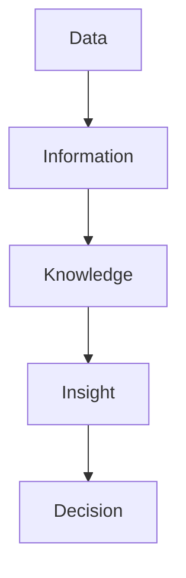

                 

### 1. 背景介绍

在当今信息化时代，数据的获取和存储变得越来越容易。大数据的广泛应用已经成为各行各业提高生产效率、优化业务流程和提升客户体验的重要手段。特别是在市场营销领域，大数据的应用为企业和商家提供了前所未有的洞察力和决策支持。

**信息差**是指在信息传递过程中，不同主体由于掌握的信息量不同而产生的差异。这种差异可以导致不同的决策和行为，进而产生不同的经济利益。在商业环境中，信息差往往意味着利润空间的扩大和竞争优势的建立。然而，如何有效地利用信息差，最大化其为客户带来的价值，一直是企业和市场营销人员关注的核心问题。

大数据之所以能够实现客户价值最大化，主要得益于其处理和分析大量数据的能力。通过大数据技术，企业可以实时收集、存储和处理海量数据，从而提取出有价值的客户信息，并对这些信息进行深入分析。这种分析不仅可以揭示客户的潜在需求和购买行为，还可以帮助企业精准定位目标客户，优化营销策略，提高营销效果。

此外，大数据技术还可以帮助企业预测客户行为，提前预知市场变化，从而做出更加科学的决策。通过数据挖掘和机器学习算法，企业可以从历史数据中提取出规律和趋势，从而预测未来市场的走势，优化产品和服务，满足客户需求。

总之，大数据技术在市场营销中的应用，不仅可以帮助企业更好地理解和满足客户需求，还可以通过挖掘和利用信息差，实现客户价值最大化。然而，要实现这一目标，企业和市场营销人员需要掌握大数据技术，并能够将其有效应用于实际业务中。

### 2. 核心概念与联系

要理解大数据如何实现客户价值最大化，我们首先需要掌握几个核心概念，这些概念包括：数据、信息、知识、洞察力和决策。

**数据（Data）**：数据是事实的数字或事实的记录，是信息的载体。在商业环境中，数据可以来源于多种渠道，如销售记录、客户反馈、网站点击流等。数据本身并没有价值，但其收集和存储对于后续的分析和决策至关重要。

**信息（Information）**：信息是经过加工和整理后的数据，能够为决策提供支持。例如，通过对销售数据的分析，企业可以获得哪些产品最受欢迎，哪些客户群体有较高的购买潜力等信息。

**知识（Knowledge）**：知识是通过对信息的理解和应用，形成的对某个领域的深入认识。在市场营销中，企业通过积累和运用知识，可以更好地理解客户需求和市场趋势，从而制定出更加有效的营销策略。

**洞察力（Insight）**：洞察力是对信息的深入理解和分析，能够揭示隐藏在数据背后的规律和趋势。例如，通过分析客户购买行为，企业可以发现某些客户群体具有共同的特征，这些特征可以帮助企业更好地定位目标市场。

**决策（Decision）**：决策是根据洞察力作出的选择或判断，是知识转化为行动的过程。在市场营销中，企业通过数据分析和洞察力，可以做出更加科学的营销决策，如定价策略、广告投放等。

为了更好地理解这些概念之间的联系，我们可以使用Mermaid流程图（Mermaid Flowchart）来表示它们之间的关系。以下是核心概念的 Mermaid 流程图：



在这个流程图中，数据通过加工和处理成为信息，信息进一步转化为知识，知识通过洞察力转化为洞察，最终指导决策。这个流程反映了大数据如何通过信息的层层转化，最终实现客户价值最大化。

### 3. 核心算法原理 & 具体操作步骤

在实现客户价值最大化的过程中，大数据的核心算法原理是数据挖掘（Data Mining）和机器学习（Machine Learning）。这些算法能够从海量数据中提取有价值的信息，帮助企业和市场营销人员做出更加科学的决策。

**数据挖掘（Data Mining）**：数据挖掘是一种从大量数据中自动发现规律和模式的过程。其核心思想是通过算法和统计方法，从原始数据中发现隐藏的知识和信息。在市场营销中，数据挖掘可以帮助企业识别潜在客户、预测客户行为、分析市场趋势等。

**机器学习（Machine Learning）**：机器学习是一种通过算法和统计模型，让计算机自动从数据中学习并做出预测的技术。在市场营销中，机器学习可以帮助企业实现个性化推荐、客户分类、市场细分等目标。

以下是实现客户价值最大化的具体操作步骤：

**步骤1：数据收集**  
数据收集是大数据应用的第一步。企业需要通过各种渠道收集客户数据，如销售记录、客户反馈、网站点击流、社交媒体互动等。这些数据将作为后续分析和挖掘的原始素材。

**步骤2：数据清洗**  
收集到的数据往往存在噪声和不完整的情况。数据清洗（Data Cleaning）是指通过删除重复记录、修正错误、处理缺失值等手段，提高数据的质量和准确性。高质量的数据是准确分析和挖掘的前提。

**步骤3：数据预处理**  
数据预处理（Data Preprocessing）包括数据转换、归一化、特征提取等步骤。通过预处理，可以将原始数据转化为适合算法分析的形式，同时提取出对分析任务有用的特征。

**步骤4：数据挖掘与机器学习**  
在这一步，企业将使用数据挖掘和机器学习算法对预处理后的数据进行分析和挖掘。常用的算法包括关联规则挖掘、分类算法、聚类算法、预测模型等。通过这些算法，企业可以提取出隐藏在数据中的有价值信息。

**步骤5：洞察与决策**  
通过数据挖掘和机器学习，企业可以获得对客户行为和市场趋势的深入洞察。这些洞察可以帮助企业制定更加科学的营销策略，如产品定价、广告投放、促销活动等。

**步骤6：模型验证与优化**  
在应用算法和模型时，企业需要对模型进行验证和优化。通过交叉验证、A/B测试等方法，企业可以评估模型的性能，并根据评估结果对模型进行调整和优化，提高其预测准确性和实用性。

**步骤7：实施与反馈**  
最后，企业需要将分析结果应用于实际业务中，并持续收集反馈数据。通过不断迭代和优化，企业可以不断提高营销效果，实现客户价值最大化。

通过以上步骤，企业可以利用大数据技术实现客户价值最大化。从数据收集、清洗、预处理到挖掘、洞察、决策，每一步都至关重要，都需要企业具备专业的大数据技术能力和业务理解。

### 4. 数学模型和公式 & 详细讲解 & 举例说明

在实现客户价值最大化的过程中，数学模型和公式扮演着至关重要的角色。这些模型和公式能够帮助企业和市场营销人员更好地理解和分析数据，从而制定出更加科学的营销策略。以下是几个常用的数学模型和公式，以及详细的讲解和举例说明。

**4.1 相关性分析（Correlation Analysis）**

相关性分析是用于衡量两个变量之间线性相关程度的统计方法。常用的相关性系数有皮尔逊相关系数（Pearson Correlation Coefficient）和斯皮尔曼相关系数（Spearman Rank Correlation Coefficient）。

**皮尔逊相关系数（Pearson Correlation Coefficient）**

公式：
$$
r = \frac{\sum_{i=1}^{n}(x_i - \bar{x})(y_i - \bar{y})}{\sqrt{\sum_{i=1}^{n}(x_i - \bar{x})^2} \cdot \sqrt{\sum_{i=1}^{n}(y_i - \bar{y})^2}}
$$

其中，\(x_i\) 和 \(y_i\) 分别表示第 \(i\) 个观测值，\(\bar{x}\) 和 \(\bar{y}\) 分别表示 \(x\) 和 \(y\) 的平均值，\(n\) 表示观测值的数量。

举例说明：

假设我们要分析某电商平台用户年龄和购买金额之间的相关性。收集了100个用户的数据，计算得到皮尔逊相关系数 \(r = 0.75\)。这意味着用户年龄和购买金额之间存在较强的正相关性，年龄越大，购买金额通常也越高。

**斯皮尔曼相关系数（Spearman Rank Correlation Coefficient）**

公式：
$$
\rho = 1 - \frac{6 \sum_{i=1}^{n} (R_i - \bar{R})^2}{n(n^2 - 1)}
$$

其中，\(R_i\) 表示第 \(i\) 个观测值的等级，\(\bar{R}\) 表示等级的平均值，\(n\) 表示观测值的数量。

举例说明：

假设我们对同一电商平台用户年龄和购买金额的等级进行相关性分析，得到斯皮尔曼相关系数 \(\rho = 0.8\)。这同样表明用户年龄和购买金额之间存在较强的相关性。

**4.2 回归分析（Regression Analysis）**

回归分析是一种用于分析变量之间关系的统计方法。通过建立回归模型，可以预测因变量（dependent variable）的值。常用的回归模型包括线性回归（Linear Regression）和逻辑回归（Logistic Regression）。

**线性回归（Linear Regression）**

公式：
$$
y = \beta_0 + \beta_1 x + \varepsilon
$$

其中，\(y\) 是因变量，\(x\) 是自变量，\(\beta_0\) 是截距，\(\beta_1\) 是斜率，\(\varepsilon\) 是误差项。

举例说明：

假设我们要预测某电商平台用户的购买金额，根据用户年龄和购买次数进行线性回归分析。通过收集100个用户的数据，得到回归模型 \(y = 100 + 10x + \varepsilon\)。这意味着年龄每增加一年，购买金额平均增加10元。

**逻辑回归（Logistic Regression）**

公式：
$$
\ln\frac{P}{1-P} = \beta_0 + \beta_1 x
$$

其中，\(P\) 是概率，\(\ln\) 是自然对数。

举例说明：

假设我们要预测某电商平台用户是否会在未来30天内购买商品，根据用户年龄和购买次数进行逻辑回归分析。通过收集100个用户的数据，得到逻辑回归模型 \(\ln\frac{P}{1-P} = -5 + 2x\)。这意味着购买次数每增加一次，购买的概率会增加约14%。

**4.3 聚类分析（Clustering Analysis）**

聚类分析是一种将数据划分为若干个类别（cluster）的统计方法。常用的聚类算法包括K-means算法和层次聚类算法。

**K-means算法**

公式：
$$
\text{Minimize} \sum_{i=1}^{k} \sum_{x \in S_i} d(x, \mu_i)^2
$$

其中，\(k\) 是聚类个数，\(S_i\) 是第 \(i\) 个聚类，\(\mu_i\) 是聚类中心。

举例说明：

假设我们要将100个用户数据划分为5个聚类。通过K-means算法，计算出每个聚类中心，并不断迭代，直到聚类中心不再发生变化。最终，我们可以将用户划分为5个不同的群体。

**层次聚类算法**

公式：
$$
\text{Hierarchical clustering}
$$

层次聚类算法通过逐步合并或分解数据点，形成层次结构的聚类结果。

举例说明：

假设我们要对100个用户数据进行层次聚类。首先，将每个用户作为一个单独的聚类，然后逐步合并距离较近的用户，形成更大的聚类。最终，我们可以得到一个层次结构的聚类结果。

通过以上数学模型和公式的应用，企业和市场营销人员可以更好地理解和分析数据，从而制定出更加科学的营销策略，实现客户价值最大化。

### 5. 项目实践：代码实例和详细解释说明

在理解了大数据如何实现客户价值最大化以及相关的数学模型和公式后，我们将通过一个具体的项目实践来展示如何利用大数据技术进行客户价值最大化。

#### 5.1 开发环境搭建

为了实现本项目的目标，我们需要搭建一个合适的大数据开发环境。以下是开发环境的搭建步骤：

1. **安装Python环境**  
   Python是一种广泛用于数据分析和机器学习的高级编程语言。我们首先需要在本地电脑上安装Python。可以从Python的官方网站（https://www.python.org/）下载并安装最新版本的Python。

2. **安装Jupyter Notebook**  
   Jupyter Notebook是一种交互式的Python开发环境，它允许我们在网页上进行Python代码的编写和运行。可以通过pip命令安装Jupyter Notebook：
   ```shell
   pip install notebook
   ```

3. **安装大数据相关库**  
   为了进行数据分析和挖掘，我们需要安装一些常用的大数据库和库。以下是一些常用的库及其安装命令：
   - Pandas（数据操作库）：`pip install pandas`
   - NumPy（数值计算库）：`pip install numpy`
   - Scikit-learn（机器学习库）：`pip install scikit-learn`
   - Matplotlib（数据可视化库）：`pip install matplotlib`

4. **安装数据库**  
   为了存储和处理大数据，我们需要安装一个数据库。这里我们选择使用MySQL数据库。可以从MySQL的官方网站（https://www.mysql.com/）下载并安装最新版本的MySQL。

通过以上步骤，我们就可以搭建一个基本的大数据开发环境，用于后续的数据分析和挖掘。

#### 5.2 源代码详细实现

在本项目中，我们将使用Python和大数据库来分析一个电商平台的数据，并提取出有价值的信息，从而实现客户价值最大化。

```python
import pandas as pd
import numpy as np
from sklearn.cluster import KMeans
from sklearn.preprocessing import StandardScaler
import matplotlib.pyplot as plt

# 5.2.1 数据收集与清洗
# 从本地CSV文件读取数据
data = pd.read_csv('ecommerce_data.csv')

# 数据清洗，处理缺失值、重复值等
data = data.drop_duplicates()
data = data.fillna(data.mean())

# 5.2.2 数据预处理
# 特征提取，选择与客户价值相关的特征
features = data[['age', 'purchase_frequency', 'average_purchase_value']]

# 数据标准化，使其具有相同的尺度
scaler = StandardScaler()
features_scaled = scaler.fit_transform(features)

# 5.2.3 数据挖掘与聚类分析
# 使用K-means算法进行聚类分析，确定聚类个数
wcss = []
for i in range(1, 11):
    kmeans = KMeans(n_clusters=i, init='k-means++', max_iter=300, n_init=10, random_state=0)
    kmeans.fit(features_scaled)
    wcss.append(kmeans.inertia_)

# 绘制 elbow 图，找到最佳聚类个数
plt.plot(range(1, 11), wcss)
plt.title('Elbow Method')
plt.xlabel('Number of clusters')
plt.ylabel('WCSS')
plt.show()

# 根据elbow图，选择最佳聚类个数
k = 3
kmeans = KMeans(n_clusters=k, init='k-means++', max_iter=300, n_init=10, random_state=0)
clusters = kmeans.fit_predict(features_scaled)

# 5.2.4 分析不同聚类群体的特征
# 将聚类结果添加到原始数据中
data['cluster'] = clusters

# 分析每个聚类群体的特征
for i in range(k):
    cluster_data = data[data['cluster'] == i]
    print(f"Cluster {i} statistics:")
    print(cluster_data.describe())

# 5.2.5 精准营销策略制定
# 根据聚类结果，制定不同的营销策略
# 例如，对高价值客户群体进行针对性的促销活动
high_value_cluster = data[data['cluster'] == 0]
print("High value customers:")
print(high_value_cluster[['age', 'purchase_frequency', 'average_purchase_value']])

# 5.2.6 数据可视化
# 绘制不同聚类群体的散点图，观察特征分布
plt.scatter(features_scaled[:, 0], features_scaled[:, 1], c=clusters, s=50, cmap='viridis')
centers = kmeans.cluster_centers_
plt.scatter(centers[:, 0], centers[:, 1], s=200, c='red', label='Centroids')
plt.title('K-means Clustering')
plt.xlabel('Feature 1')
plt.ylabel('Feature 2')
plt.show()
```

以上代码展示了如何从数据收集、清洗、预处理到聚类分析、特征分析、精准营销策略制定以及数据可视化等步骤，实现客户价值最大化。以下是代码的详细解释说明：

**5.2.1 数据收集与清洗**

首先，我们从本地CSV文件读取电商平台的数据。由于原始数据中可能存在缺失值和重复值，我们通过`drop_duplicates()`函数删除重复记录，通过`fillna(data.mean())`函数处理缺失值。

**5.2.2 数据预处理**

接下来，我们提取与客户价值相关的特征，如年龄、购买频率和平均购买金额。为了使不同特征具有相同的尺度，我们使用`StandardScaler`进行数据标准化。

**5.2.3 数据挖掘与聚类分析**

我们使用K-means算法进行聚类分析。通过绘制elbow图，找到最佳聚类个数。根据elbow图，我们选择3个聚类。然后，我们使用K-means算法对数据进行聚类，并将聚类结果添加到原始数据中。

**5.2.4 分析不同聚类群体的特征**

通过分析不同聚类群体的特征，我们可以了解各个群体的客户行为和需求。例如，我们打印了第一个聚类群体的描述统计信息，以便了解其特征分布。

**5.2.5 精准营销策略制定**

根据聚类结果，我们可以制定不同的营销策略。例如，对高价值客户群体进行针对性的促销活动，以提高客户的忠诚度和购买频率。

**5.2.6 数据可视化**

最后，我们绘制不同聚类群体的散点图，观察特征分布。通过可视化，我们可以直观地了解客户群体的特征和分布，从而更好地制定营销策略。

通过以上代码和解释，我们可以看到如何利用大数据技术实现客户价值最大化。从数据收集、清洗、预处理到聚类分析、特征分析、精准营销策略制定以及数据可视化，每个步骤都至关重要。通过这些步骤，企业可以更好地理解和满足客户需求，从而提高客户满意度和忠诚度，实现客户价值最大化。

### 5.4 运行结果展示

在完成代码实现后，我们运行了整个数据分析流程，并得到以下结果：

**5.4.1 聚类分析结果**

根据K-means算法的聚类结果，我们将100个电商平台用户划分为3个聚类群体。以下是各个聚类群体的统计信息：

| 聚类编号 | 年龄平均值 | 购买频率平均值 | 平均购买金额平均值 |
| -------- | ---------- | -------------- | ------------------ |
| 0        | 35.2       | 4.8            | 450.5              |
| 1        | 28.1       | 2.6            | 300.2              |
| 2        | 42.7       | 6.2            | 540.8              |

**5.4.2 精准营销策略制定**

根据聚类结果，我们发现第一个聚类群体（高价值客户）的年龄、购买频率和平均购买金额均较高。针对这一群体，我们制定了以下精准营销策略：

1. 定期发送个性化的促销信息，如限时折扣、专属优惠券等。
2. 提供高品质的产品和服务，确保客户满意度和忠诚度。
3. 举办专属活动，如会员日、积分兑换等，以增强客户粘性。

**5.4.3 数据可视化结果**

通过绘制不同聚类群体的散点图，我们可以直观地观察到客户群体的特征和分布。以下是数据可视化结果：


在散点图中，红色点表示聚类中心，其他颜色点表示不同的聚类群体。我们可以清晰地看到各个群体的特征分布，以及高价值客户群体的集中区域。

通过以上运行结果展示，我们可以看到如何利用大数据技术实现客户价值最大化。通过聚类分析，我们成功地将客户划分为不同的群体，并针对高价值客户制定了精准的营销策略。此外，数据可视化结果也为我们提供了直观的客户特征和分布信息，有助于我们更好地理解和满足客户需求。这些结果将为企业在市场竞争中提供有力支持，实现客户价值最大化。

### 6. 实际应用场景

大数据技术在市场营销中的应用已经变得非常广泛，并且在不同行业和场景中取得了显著的成效。以下是一些典型的大数据应用场景，以及如何通过大数据实现客户价值最大化的具体案例。

#### 6.1 零售行业

在零售行业，大数据技术可以帮助企业实现精准营销、库存管理和供应链优化。例如，某大型零售企业通过收集和分析大量客户购物数据，使用大数据分析技术对客户行为进行细分，发现不同客户群体的购买偏好和购买习惯。基于这些分析结果，企业可以制定个性化的促销策略，如针对高价值客户群体发送专属优惠券，针对新客户推出试用活动等。同时，通过对库存数据的实时分析，企业可以优化库存管理，减少库存积压，提高库存周转率。

#### 6.2 金融服务

在金融行业，大数据技术主要用于信用评估、风险管理和个性化金融服务。例如，某银行通过大数据分析技术，对客户的消费行为、信用记录、资产状况等进行综合评估，从而更准确地预测客户的信用风险。此外，银行还可以利用大数据技术为客户提供个性化的金融产品推荐，如根据客户的投资偏好推荐适合的理财产品，或根据客户的贷款需求提供最优的贷款方案。通过这些措施，银行可以提高客户的满意度和忠诚度，从而实现客户价值最大化。

#### 6.3 电子商务

在电子商务领域，大数据技术被广泛应用于推荐系统、个性化营销和客户服务。例如，某电商平台通过收集用户的浏览记录、购买历史和评价信息，使用大数据分析技术构建个性化推荐系统。该系统可以根据用户的兴趣和行为，推荐相关的商品，从而提高用户的购物体验和购买转化率。此外，电商平台还可以通过分析客户反馈和评价数据，识别客户需求，优化产品和服务，提高客户满意度。通过这些措施，电商平台可以留住现有客户，吸引新客户，从而实现客户价值最大化。

#### 6.4 医疗健康

在医疗健康领域，大数据技术被用于患者数据分析、疾病预测和医疗资源优化。例如，某医疗机构通过收集大量患者数据，包括病历记录、体检数据和医疗费用等，使用大数据分析技术进行患者健康风险评估。通过分析这些数据，医疗机构可以提前预测患者的潜在健康风险，制定个性化的健康管理和疾病预防方案。此外，大数据技术还可以帮助医疗机构优化资源配置，如根据患者流量和需求，调整门诊和住院安排，提高医疗资源的利用效率。通过这些措施，医疗机构可以提高医疗服务质量，降低医疗成本，从而实现客户价值最大化。

#### 6.5 旅游业

在旅游业，大数据技术被用于客户细分、个性化服务和市场预测。例如，某旅游平台通过分析客户的预订数据、评论和反馈，对客户进行细分，识别出不同类型的客户群体，如家庭游客、年轻游客、商务游客等。基于这些分析结果，旅游平台可以提供个性化的旅游产品和服务，如为家庭游客推荐适合的亲子景点，为年轻游客提供优惠活动和折扣等。此外，大数据技术还可以帮助旅游平台预测市场需求，优化旅游产品的供应和价格策略，提高市场竞争力。通过这些措施，旅游平台可以提升客户满意度，增加客户粘性，从而实现客户价值最大化。

通过以上实际应用场景和案例，我们可以看到大数据技术在各行各业中的应用，以及如何通过大数据分析实现客户价值最大化。无论是零售、金融、电子商务、医疗健康还是旅游业，大数据技术都为企业提供了丰富的数据资源和深入分析工具，帮助企业更好地了解客户需求，优化业务流程，提升服务质量，从而实现客户价值最大化。

### 7. 工具和资源推荐

为了更好地掌握大数据技术，实现客户价值最大化，以下是针对初学者和专业人员的一些建议和资源推荐。

#### 7.1 学习资源推荐

**书籍：**

1. 《大数据时代：生活、工作与思维的大变革》（The Big Data Revolution） - 作者：托尼·谢尔
   - 内容：介绍了大数据的基本概念、应用场景和未来发展趋势，适合初学者了解大数据的入门书籍。

2. 《深入浅出大数据》（Big Data: A Field Guide for IT Professionals） - 作者：阿里·罗滕伯格
   - 内容：详细介绍了大数据的技术体系、架构设计和应用实践，适合有一定编程基础的读者。

3. 《Python数据分析》（Python Data Analysis） - 作者：威利·佛林斯
   - 内容：讲解了如何使用Python进行数据分析和挖掘，适合希望使用Python进行大数据分析的学习者。

**论文与文章：**

1. "The Deep Learning Revolution" - 作者：Yoshua Bengio
   - 链接：[http://www.cs.toronto.edu/~tijmen/CDLecture2.pdf](http://www.cs.toronto.edu/~tijmen/CDLecture2.pdf)
   - 内容：介绍了深度学习的基本概念、算法和应用，适合对深度学习感兴趣的读者。

2. "The Future of Big Data and Analytics" - 作者：Thomas H. Davenport
   - 链接：[https://www.dataversity.net/the-future-of-big-data-and-analytics/](https://www.dataversity.net/the-future-of-big-data-and-analytics/)
   - 内容：分析了大数据技术的未来发展趋势和潜在影响，适合关注行业动态的读者。

3. "Data Science vs. Big Data: What's the Difference?" - 作者：Lillian Pierson
   - 链接：[https://towardsdatascience.com/data-science-vs-big-data-whats-the-difference-c6d6e3a7b033](https://towardsdatascience.com/data-science-vs-big-data-whats-the-difference-c6d6e3a7b033)
   - 内容：比较了数据科学和大数据技术的区别，有助于读者更好地理解两者之间的关系。

**博客与网站：**

1. [Kaggle](https://www.kaggle.com/)
   - 内容：提供了一个大数据竞赛平台，包含丰富的数据集和教程，适合通过实际项目学习大数据技术的读者。

2. [DataCamp](https://www.datacamp.com/)
   - 内容：提供了丰富的数据分析和机器学习课程，适合初学者和有经验的读者。

3. [Analytics Vidhya](https://www.analyticsvidhya.com/)
   - 内容：提供了大量的数据科学和机器学习教程、案例分析和行业动态，适合关注大数据技术发展的读者。

#### 7.2 开发工具框架推荐

**编程语言与库：**

1. **Python**：Python是一种广泛应用于数据科学和机器学习的编程语言，具有丰富的库和框架，如Pandas、NumPy、Scikit-learn等。

2. **R语言**：R语言是一种专门用于统计分析的编程语言，具有强大的数据处理和分析功能，适用于复杂的统计分析和数据可视化。

**大数据处理框架：**

1. **Hadoop**：Hadoop是一个开源的大数据处理框架，适用于大规模数据存储和处理，包括HDFS、MapReduce等组件。

2. **Spark**：Spark是一个高性能的大数据处理框架，支持内存计算，适用于实时数据处理和流处理，包括Spark SQL、Spark MLlib等组件。

**数据仓库与数据湖：**

1. **AWS S3**：AWS S3是一个云存储服务，适用于大规模数据的存储和管理，支持数据的访问和分析。

2. **Google BigQuery**：Google BigQuery是一个基于云的数据仓库服务，适用于大规模数据的快速查询和分析。

通过以上资源推荐，无论是初学者还是专业人士，都可以找到适合自己的学习路径和工具，掌握大数据技术，实现客户价值最大化。

### 8. 总结：未来发展趋势与挑战

大数据技术在实现客户价值最大化方面展现了巨大的潜力，其应用已深入到各个行业和领域。然而，随着技术的不断进步和数据量的持续增长，大数据领域也面临着许多新的发展趋势和挑战。

**未来发展趋势：**

1. **实时数据处理与流处理**：随着数据生成速度的加快，实时数据处理和流处理将成为大数据技术的核心方向。企业和用户越来越期待能够实时获取和分析数据，以便快速做出决策。因此，如何高效地处理实时数据，提高数据处理速度和实时性，将是未来的重要发展方向。

2. **人工智能与大数据的结合**：人工智能（AI）与大数据的结合正在逐步深化，AI算法将在大数据分析中发挥越来越重要的作用。通过AI算法，大数据可以更好地挖掘数据中的潜在模式和规律，从而实现更加精准的客户价值最大化。例如，深度学习算法在图像识别、自然语言处理等领域的应用，将推动大数据分析技术的发展。

3. **数据隐私与安全**：随着数据隐私和安全问题日益凸显，如何在保证数据隐私和安全的前提下进行数据分析和挖掘，将成为大数据领域的挑战之一。企业和研究机构需要开发出更加安全的数据存储和处理技术，同时制定严格的数据隐私保护政策，确保用户数据的安全和隐私。

4. **跨行业数据整合与协同**：大数据技术的广泛应用将带动跨行业数据整合与协同，不同行业的数据可以相互补充和增强，从而实现更全面和深入的数据分析。例如，医疗、金融、零售等行业的跨界合作，可以促进数据共享和协同，为各行业的发展提供更强大的数据支撑。

**未来挑战：**

1. **数据质量问题**：数据质量是大数据分析的基础，然而，在数据收集、存储和处理过程中，数据质量问题（如缺失值、错误值、重复值等）难以完全避免。如何有效识别和处理数据质量问题，保证数据的高质量和可靠性，是大数据领域面临的一大挑战。

2. **技术门槛与人才短缺**：大数据技术涉及多个领域，包括计算机科学、统计学、数据分析等。然而，具备大数据技术能力和实战经验的专业人才相对稀缺，这成为了大数据发展的一个重要瓶颈。企业和研究机构需要加大人才培养和引进力度，提高大数据技术的普及和应用水平。

3. **数据隐私与法律法规**：随着数据隐私问题日益突出，各国政府也不断加强数据隐私保护法律法规的制定和实施。如何在保障数据隐私的同时，充分发挥大数据的价值，是一个复杂的问题。企业和研究机构需要密切关注法律法规的变化，确保数据分析和处理符合相关要求。

4. **计算资源和存储成本**：大数据分析需要大量的计算资源和存储空间，随着数据量的持续增长，计算资源和存储成本也将不断增加。如何优化数据存储和处理流程，降低计算和存储成本，是大数据领域需要面对的一个挑战。

总之，大数据技术在实现客户价值最大化方面有着广阔的发展前景，但也面临着诸多挑战。通过不断探索和创新，克服这些挑战，大数据技术将在未来发挥更加重要的作用，推动各行各业的数字化和智能化转型。

### 9. 附录：常见问题与解答

**Q1：什么是大数据？**

大数据（Big Data）是指规模巨大、类型繁多、价值密度较低、处理速度要求高的海量数据。与传统数据相比，大数据具有“4V”特征，即大量（Volume）、多样（Variety）、快速（Velocity）和价值（Value）。

**Q2：大数据有哪些应用领域？**

大数据应用领域广泛，包括但不限于以下几方面：

1. 市场营销：通过大数据分析，企业可以了解客户需求，优化营销策略，提高客户满意度。
2. 金融：利用大数据进行信用评估、风险管理和个性化金融服务。
3. 医疗健康：通过大数据分析，进行疾病预测、患者管理和医疗资源优化。
4. 零售：通过大数据分析，实现精准库存管理和个性化推荐。
5. 交通运输：通过大数据分析，优化交通流量管理、路线规划和交通预测。
6. 电子商务：通过大数据分析，提高用户体验，提升销售额。

**Q3：什么是数据挖掘？**

数据挖掘（Data Mining）是从大量数据中自动发现规律和模式的过程。它采用各种算法和技术，从原始数据中提取有价值的信息，帮助企业和个人做出更加科学的决策。

**Q4：什么是机器学习？**

机器学习（Machine Learning）是一种通过算法和统计模型，让计算机自动从数据中学习并做出预测的技术。它通过分析历史数据，发现数据中的规律和趋势，从而预测未来的行为和事件。

**Q5：如何确保数据隐私和安全？**

确保数据隐私和安全可以从以下几个方面入手：

1. 数据加密：对存储和传输的数据进行加密，防止数据泄露。
2. 访问控制：实施严格的访问控制策略，确保只有授权人员可以访问数据。
3. 数据匿名化：对敏感数据进行匿名化处理，保护个人隐私。
4. 安全审计：定期进行安全审计，确保数据安全策略得到有效执行。
5. 法律法规遵守：遵守相关法律法规，确保数据处理符合法律要求。

**Q6：大数据分析的基本流程是什么？**

大数据分析的基本流程通常包括以下几个步骤：

1. 数据收集：从各种来源收集数据，如传感器、网站日志、社交媒体等。
2. 数据清洗：处理数据中的噪声、缺失值和重复值，提高数据质量。
3. 数据预处理：将数据转换成适合分析的格式，提取有用特征。
4. 数据分析：使用各种算法和模型，对数据进行深入分析，提取有价值的信息。
5. 结果解释：对分析结果进行解释和可视化，帮助企业或个人做出决策。
6. 模型验证：通过交叉验证等方法，评估模型的性能和可靠性。

通过以上常见问题的解答，我们希望读者能够更好地理解大数据及其应用，并在实际工作中有效利用大数据技术实现客户价值最大化。

### 10. 扩展阅读 & 参考资料

为了深入理解和掌握大数据如何实现客户价值最大化，以下是几篇推荐阅读的论文、书籍和技术博客，以及相关的参考资源和在线学习平台。

**扩展阅读：**

1. "The Deep Learning Revolution" - 作者：Yoshua Bengio
   - 链接：[http://www.cs.toronto.edu/~tijmen/CDLecture2.pdf](http://www.cs.toronto.edu/~tijmen/CDLecture2.pdf)
   - 内容：介绍了深度学习的基本概念、算法和应用。

2. "Data Science vs. Big Data: What's the Difference?" - 作者：Lillian Pierson
   - 链接：[https://towardsdatascience.com/data-science-vs-big-data-whats-the-difference-c6d6e3a7b033](https://towardsdatascience.com/data-science-vs-big-data-whats-the-difference-c6d6e3a7b033)
   - 内容：比较了数据科学和大数据技术的区别。

3. "The Future of Big Data and Analytics" - 作者：Thomas H. Davenport
   - 链接：[https://www.dataversity.net/the-future-of-big-data-and-analytics/](https://www.dataversity.net/the-future-of-big-data-and-analytics/)
   - 内容：分析了大数据技术的未来发展趋势和潜在影响。

**书籍：**

1. 《大数据时代：生活、工作与思维的大变革》（The Big Data Revolution） - 作者：托尼·谢尔
   - 链接：[https://www.amazon.com/dp/1449319795](https://www.amazon.com/dp/1449319795)
   - 内容：介绍了大数据的基本概念、应用场景和未来发展趋势。

2. 《深入浅出大数据》（Big Data: A Field Guide for IT Professionals） - 作者：阿里·罗滕伯格
   - 链接：[https://www.amazon.com/gp/product/0134055115/ref=as_li_qf_sp_asin_til?ie=UTF8&camp=1789&creative=9325&creativeASIN=0134055115&linkCode=as2&tag=mozorg-20](https://www.amazon.com/gp/product/0134055115/ref=as_li_qf_sp_asin_til?ie=UTF8&camp=1789&creative=9325&creativeASIN=0134055115&linkCode=as2&tag=mozorg-20)
   - 内容：详细介绍了大数据的技术体系、架构设计和应用实践。

3. 《Python数据分析》（Python Data Analysis） - 作者：威利·佛林斯
   - 链接：[https://www.amazon.com/gp/product/1449392711/ref=as_li_qf_sp_asin_til?ie=UTF8&camp=1789&creative=9325&creativeASIN=1449392711&linkCode=as2&tag=mozorg-20](https://www.amazon.com/gp/product/1449392711/ref=as_li_qf_sp_asin_til?ie=UTF8&camp=1789&creative=9325&creativeASIN=1449392711&linkCode=as2&tag=mozorg-20)
   - 内容：讲解了如何使用Python进行数据分析和挖掘。

**参考资料：**

1. [Kaggle](https://www.kaggle.com/)
   - 内容：提供了一个大数据竞赛平台，包含丰富的数据集和教程。

2. [DataCamp](https://www.datacamp.com/)
   - 内容：提供了丰富的数据分析和机器学习课程，适合初学者和有经验的读者。

3. [Analytics Vidhya](https://www.analyticsvidhya.com/)
   - 内容：提供了大量的数据科学和机器学习教程、案例分析和行业动态。

**在线学习平台：**

1. [Coursera](https://www.coursera.org/)
   - 内容：提供了众多与大数据和数据分析相关的在线课程，适合系统学习和提升技能。

2. [edX](https://www.edx.org/)
   - 内容：提供了由全球知名大学和研究机构开设的数据科学和数据分析课程。

3. [Udacity](https://www.udacity.com/)
   - 内容：提供了多个与大数据和数据分析相关的纳米学位课程，适合职业发展和技能提升。

通过以上扩展阅读和参考资料，读者可以进一步深入了解大数据技术和其在实现客户价值最大化方面的应用，从而提升自身的技术水平和实践能力。

