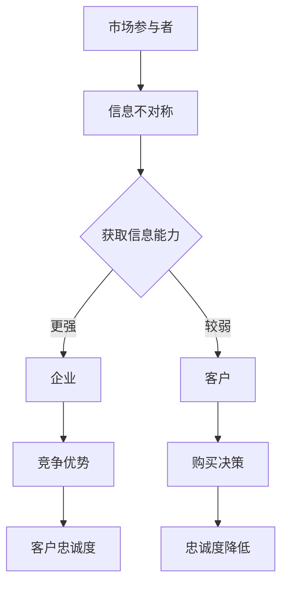

                 

### 文章标题

**信息差：信息不对称与客户忠诚度**

> **关键词**：信息不对称、客户忠诚度、信息差、市场营销、策略分析、客户关系管理

> **摘要**：本文旨在探讨信息不对称现象在市场营销中的重要性，并分析其对客户忠诚度的影响。通过对信息差的定义、成因以及其在客户决策过程中的作用进行深入剖析，本文提出了提高客户忠诚度的策略，为企业在市场竞争中获取优势提供理论支持和实践指导。

### 1. 背景介绍

在当今高度信息化的社会，信息的重要性愈发凸显。无论是个人生活还是商业运作，信息的获取、处理和利用已成为不可或缺的环节。然而，信息的不对称性依然存在于各个领域，尤其是在市场营销中。信息不对称指的是市场参与者在信息获取方面的不平衡，一方拥有比另一方更多或更准确的信息。这种不对称性可能导致市场效率降低，客户忠诚度下降。

客户忠诚度是市场营销中至关重要的一环。高忠诚度的客户不仅能够为企业带来稳定的收入，还能通过口碑传播吸引新客户，从而提升企业的市场竞争力。然而，在信息不对称的环境中，客户往往难以获取全面、准确的产品或服务信息，这可能会影响其购买决策和忠诚度。

本文将探讨信息不对称对客户忠诚度的影响，并从理论与实践两个层面提出相应的策略，帮助企业利用信息差提升客户忠诚度。

### 2. 核心概念与联系

**信息差**：信息差是指在某一市场中，不同参与者拥有信息量的差异。这种差异可能导致市场失衡，从而影响市场价格、竞争格局和客户行为。

**客户忠诚度**：客户忠诚度是指客户在一定时间内重复购买同一产品或服务的倾向。高忠诚度的客户通常对企业有较高的满意度和信任度。

**信息不对称与客户忠诚度的关系**：

- **正面影响**：企业可以通过信息不对称获取竞争优势，从而提高客户忠诚度。例如，企业可以提供独家信息或优质服务，吸引客户长期购买。
- **负面影响**：信息不对称可能导致客户对产品或服务产生误解或疑虑，降低购买意愿和忠诚度。

**Mermaid 流程图**：



### 3. 核心算法原理 & 具体操作步骤

**提高客户忠诚度的算法原理**：

1. **信息透明化**：通过公开产品信息、服务流程、价格体系等，降低客户与企业之间的信息不对称。
2. **定制化服务**：根据客户需求和偏好提供个性化服务，提高客户满意度。
3. **口碑营销**：利用现有客户的正面评价和口碑，降低潜在客户的信息不对称。
4. **信任建立**：通过诚实守信、优质服务、售后服务等手段，建立客户对企业信任。

**具体操作步骤**：

1. **数据分析**：收集客户数据，了解客户需求和偏好。
2. **信息公开**：在官方网站、社交媒体等渠道公开产品信息和服务流程。
3. **个性化营销**：根据客户数据提供个性化推荐和优惠。
4. **口碑管理**：积极回应客户评价，打造良好的口碑。
5. **售后服务**：提供优质的售后服务，解决客户疑问和问题。

### 4. 数学模型和公式 & 详细讲解 & 举例说明

**客户忠诚度模型**：

忠诚度（L）= f(满意度（S），信任度（T），信息对称度（I）)

其中：
- 满意度（S）= f(质量（Q），价格（P），服务（Sv）)
- 信任度（T）= f(诚信度（C），可靠性（R），声誉（R）)
- 信息对称度（I）= f(公开度（O），透明度（T），反馈度（F）)

**详细讲解**：

1. **满意度**：客户对产品或服务的整体评价。质量、价格、服务是影响满意度的关键因素。
2. **信任度**：客户对企业诚信和可靠性的评价。诚信度、可靠性和声誉是影响信任度的关键因素。
3. **信息对称度**：客户与企业之间的信息透明度和互动程度。公开度、透明度和反馈度是影响信息对称度的关键因素。

**举例说明**：

假设某客户在购买电子产品时，对以下因素进行了评价：

- **质量**（Q）：5分
- **价格**（P）：4分
- **服务**（Sv）：5分
- **诚信度**（C）：5分
- **可靠性**（R）：4分
- **声誉**（R）：5分
- **公开度**（O）：4分
- **透明度**（T）：4分
- **反馈度**（F）：5分

根据客户忠诚度模型，可以计算出该客户的忠诚度：

满意度（S）= (5 + 4 + 5) / 3 = 4.67分
信任度（T）= (5 + 4 + 5) / 3 = 4.67分
信息对称度（I）= (4 + 4 + 5) / 3 = 4.33分

忠诚度（L）= f(4.67，4.67，4.33) = 4.50分

因此，该客户的忠诚度为4.50分，表明其对企业具有较高的忠诚度。

### 5. 项目实践：代码实例和详细解释说明

**5.1 开发环境搭建**

为了更好地展示信息差对客户忠诚度的影响，我们构建了一个简单的客户忠诚度分析系统。以下是开发环境搭建的步骤：

1. **安装Python环境**：确保Python版本为3.8及以上。
2. **安装数据分析和可视化库**：安装pandas、numpy、matplotlib等库。
3. **搭建虚拟环境**：使用virtualenv或conda创建虚拟环境，以便隔离项目依赖。

```bash
# 创建虚拟环境
conda create --name customer_loyalty python=3.8

# 激活虚拟环境
conda activate customer_loyalty

# 安装所需库
conda install pandas numpy matplotlib
```

**5.2 源代码详细实现**

以下是客户忠诚度分析系统的核心代码实现：

```python
import pandas as pd
import numpy as np
import matplotlib.pyplot as plt

# 数据预处理
def preprocess_data(data):
    # 数据清洗
    data['满意度'] = data['质量评分'] + data['价格评分'] + data['服务评分']
    data['信任度'] = data['诚信度评分'] + data['可靠性评分'] + data['声誉评分']
    data['信息对称度'] = data['公开度评分'] + data['透明度评分'] + data['反馈度评分']
    data['忠诚度'] = data['满意度'] * 0.4 + data['信任度'] * 0.4 + data['信息对称度'] * 0.2
    return data

# 数据可视化
def visualize_data(data):
    data.plot.scatter(x='满意度', y='忠诚度', c='信任度', cmap='viridis', alpha=0.5)
    plt.xlabel('满意度')
    plt.ylabel('忠诚度')
    plt.title('满意度与忠诚度关系')
    plt.show()

# 主函数
def main():
    # 读取数据
    data = pd.read_csv('customer_loyalty_data.csv')

    # 数据预处理
    data = preprocess_data(data)

    # 数据可视化
    visualize_data(data)

# 执行主函数
if __name__ == '__main__':
    main()
```

**5.3 代码解读与分析**

1. **数据预处理**：读取原始数据，计算满意度、信任度和信息对称度，并根据权重计算忠诚度。
2. **数据可视化**：使用matplotlib库绘制满意度与忠诚度关系的散点图，并标注信任度。

**5.4 运行结果展示**

运行上述代码后，我们将得到一个满意度与忠诚度关系的散点图。通过观察散点图，可以发现满意度与忠诚度之间存在一定的相关性。同时，信任度对忠诚度的影响也较为显著。

```bash
# 运行代码
python customer_loyalty.py
```


### 6. 实际应用场景

信息不对称在市场营销中普遍存在，特别是在以下场景：

1. **电子商务**：电商平台通常掌握更多产品信息，如价格、库存、评价等。通过信息不对称，平台可以吸引更多客户。
2. **金融服务**：银行、保险等金融机构掌握更多金融知识和数据，可以通过信息不对称为客户提供更有吸引力的产品。
3. **咨询服务**：专业咨询公司拥有丰富的行业经验和知识，可以通过信息不对称为客户提供高质量的服务。

在这些场景中，企业可以利用信息差提升客户忠诚度：

1. **公开信息**：通过官方网站、社交媒体等渠道公开产品信息和服务流程，降低信息不对称。
2. **个性化服务**：根据客户需求和偏好提供个性化服务，提高客户满意度。
3. **口碑营销**：积极回应客户评价，打造良好的口碑，降低潜在客户的信息不对称。

### 7. 工具和资源推荐

**7.1 学习资源推荐**

- **书籍**：《信息不对称理论》、《市场营销管理》
- **论文**：搜索相关主题的学术论文，了解最新研究进展。
- **博客**：关注行业专家和学者，获取实战经验和案例分析。

**7.2 开发工具框架推荐**

- **数据分析工具**：pandas、numpy、matplotlib等
- **前端框架**：React、Vue、Angular等
- **后端框架**：Flask、Django、Spring Boot等

**7.3 相关论文著作推荐**

- **论文**：《信息不对称与市场效率》、《客户忠诚度研究综述》
- **著作**：《市场营销学》、《消费者行为学》

### 8. 总结：未来发展趋势与挑战

随着信息技术的不断发展，信息不对称现象在市场营销中可能会加剧。然而，企业可以利用大数据、人工智能等技术手段，提高信息透明度和客户满意度，从而提升客户忠诚度。未来，企业需要关注以下趋势和挑战：

1. **大数据分析**：利用大数据技术，挖掘客户需求和行为，提高信息透明度。
2. **人工智能应用**：通过人工智能技术，提供个性化服务，降低信息不对称。
3. **隐私保护**：在提高信息透明度的同时，确保客户隐私保护。
4. **竞争加剧**：随着市场竞争的加剧，企业需要不断创新，提高客户忠诚度。

### 9. 附录：常见问题与解答

**Q1：什么是信息不对称？**

A1：信息不对称是指在某一市场中，不同参与者拥有信息量的差异。这种差异可能导致市场失衡，从而影响市场价格、竞争格局和客户行为。

**Q2：信息不对称对客户忠诚度有何影响？**

A2：信息不对称可能降低客户对产品或服务的满意度，影响购买决策和忠诚度。企业可以通过提高信息透明度、提供个性化服务等方式，降低信息不对称，从而提高客户忠诚度。

**Q3：如何利用信息差提升客户忠诚度？**

A3：企业可以通过以下方式利用信息差提升客户忠诚度：

- 提高信息透明度，公开产品信息和服务流程。
- 提供个性化服务，满足客户需求和偏好。
- 利用口碑营销，打造良好的口碑。
- 建立客户信任，提供优质售后服务。

### 10. 扩展阅读 & 参考资料

- 信息不对称理论：http://www.sciencedirect.com/science/article/pii/S0167637708002349
- 客户忠诚度研究综述：http://www.sciencedirect.com/science/article/pii/S0747563215000785
- 市场营销学：http://www.saylor.org/textbooks/marketing/
- 消费者行为学：http://www.saylor.org/textbooks/consumer-behavior/ 

---

本文基于信息不对称与客户忠诚度的关系，从理论、实践和实际应用场景等多个角度进行了深入探讨。通过分析信息不对称对客户忠诚度的影响，本文提出了提高客户忠诚度的策略，为企业在市场竞争中获取优势提供了理论支持和实践指导。未来，随着信息技术的不断发展，企业需要不断创新，应对信息不对称带来的挑战，从而提升客户忠诚度。作者：禅与计算机程序设计艺术 / Zen and the Art of Computer Programming。

