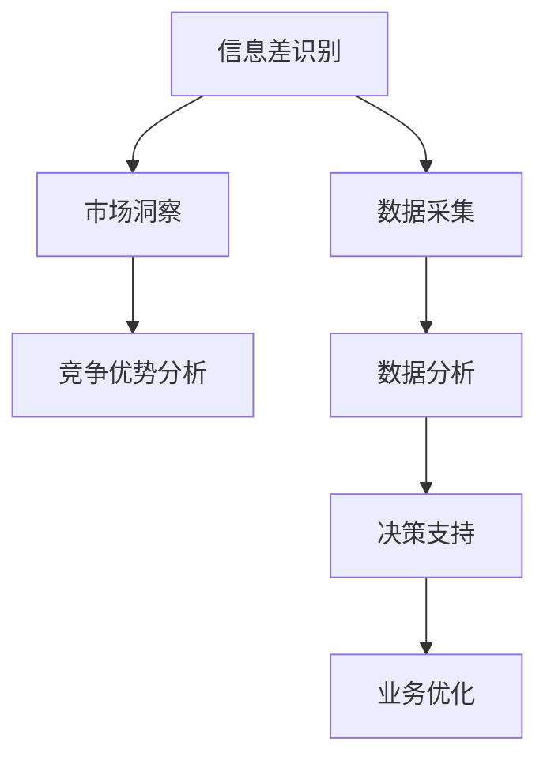

                 

### 文章标题

《信息差：信息时代的商业战略》

> 关键词：信息差、商业战略、信息时代、竞争优势、数据驱动

> 摘要：本文将深入探讨信息差在信息时代的商业战略中的应用，从理论到实践，通过详细的案例分析，揭示信息差如何成为企业竞争的关键因素，并提供实用的策略和工具，帮助企业实现数据驱动的持续增长。

### 1. 背景介绍

随着信息技术的飞速发展，信息时代已经到来。在这个时代，信息资源成为企业和个人竞争的重要资产。信息差，即信息的不对称性，是企业在这场竞争中取得优势的关键所在。信息差不仅存在于企业之间，也存在于企业内部的各个环节。有效的信息管理可以为企业带来巨大的竞争优势。

在现代商业环境中，数据成为企业决策的重要依据。通过对大量数据进行分析，企业可以发现市场趋势、用户需求以及潜在的商业机会。然而，数据本身并不具有价值，只有通过有效的分析和利用，才能转化为实际的商业价值。因此，如何处理和利用信息差，成为企业在信息时代获得成功的关键因素。

本文将探讨信息差在商业战略中的应用，分析其核心概念和原理，并通过具体案例和实践，展示如何利用信息差实现企业的数据驱动增长。

### 2. 核心概念与联系

#### 2.1 信息差的定义

信息差指的是不同主体之间在信息获取、处理和利用方面的差异。这种差异可能是由技术、资源、渠道、时间等因素导致的。在商业环境中，信息差可以分为以下几个方面：

- **技术信息差**：企业在信息技术方面的掌握程度和应用水平不同，导致对信息的获取和处理能力存在差异。
- **资源信息差**：企业在资金、人才、设备等资源方面的差异，影响其信息收集和处理能力。
- **渠道信息差**：企业在信息渠道方面的差异，影响其获取信息的速度和广度。
- **时间信息差**：企业在获取和处理信息的时间上的差异，影响其快速响应市场变化的能力。

#### 2.2 信息差与商业战略的关系

信息差直接影响企业的商业战略。以下是信息差在商业战略中的几个关键作用：

- **市场洞察**：信息差使企业能够更早、更全面地了解市场趋势和用户需求，从而制定更具前瞻性的市场策略。
- **竞争优势**：通过信息差，企业可以实现对竞争对手的了解和监控，制定针对性的竞争策略，巩固市场地位。
- **决策支持**：信息差为企业提供了更全面、更准确的数据支持，有助于做出更加科学、合理的商业决策。

#### 2.3 信息差与数据驱动的关系

数据驱动是企业实现信息差的重要手段。通过数据采集、分析和利用，企业可以不断优化业务流程、提升运营效率、降低成本。信息差使得企业能够获取和处理更多的高质量数据，从而实现数据驱动的商业决策。

#### 2.4 Mermaid 流程图

下面是一个简化的Mermaid流程图，展示了信息差在企业商业战略中的应用流程：



### 3. 核心算法原理 & 具体操作步骤

#### 3.1 信息差识别算法

信息差识别是企业实现信息差管理的关键。以下是信息差识别的基本原理和操作步骤：

##### 3.1.1 基本原理

信息差识别主要基于以下算法：

- **数据挖掘**：通过数据挖掘技术，从大量数据中挖掘出有用的信息和规律。
- **机器学习**：利用机器学习算法，对已有数据进行训练，建立模型，预测新的数据。

##### 3.1.2 具体操作步骤

1. **数据收集**：收集企业内外部的各类数据，包括市场数据、用户数据、竞争对手数据等。
2. **数据预处理**：对收集到的数据进行分析和清洗，确保数据的质量和准确性。
3. **特征提取**：从预处理后的数据中提取出与信息差相关的特征，如市场趋势、用户需求、竞争对手策略等。
4. **模型训练**：利用机器学习算法，对提取的特征进行训练，建立信息差识别模型。
5. **模型评估**：通过测试集对训练好的模型进行评估，调整模型参数，提高识别准确率。
6. **应用部署**：将训练好的模型部署到生产环境中，实时监测和分析企业内外部的信息差。

#### 3.2 数据驱动决策算法

数据驱动决策是企业利用信息差实现商业价值的关键。以下是数据驱动决策的基本原理和操作步骤：

##### 3.2.1 基本原理

数据驱动决策主要基于以下算法：

- **统计分析**：通过对数据的统计分析，发现数据中的规律和趋势。
- **预测建模**：利用预测建模技术，预测未来的市场趋势和用户需求。

##### 3.2.2 具体操作步骤

1. **数据收集**：收集企业内外部的各类数据，包括市场数据、用户数据、竞争对手数据等。
2. **数据预处理**：对收集到的数据进行分析和清洗，确保数据的质量和准确性。
3. **特征提取**：从预处理后的数据中提取出与决策相关的特征，如市场趋势、用户需求、竞争对手策略等。
4. **模型训练**：利用机器学习算法，对提取的特征进行训练，建立预测模型。
5. **模型评估**：通过测试集对训练好的模型进行评估，调整模型参数，提高预测准确率。
6. **决策生成**：将预测模型应用到企业的日常运营中，生成具体的商业决策。
7. **反馈调整**：根据决策执行后的反馈，不断调整和优化预测模型，提高决策效果。

### 4. 数学模型和公式 & 详细讲解 & 举例说明

#### 4.1 信息差识别的数学模型

信息差识别的数学模型通常是基于机器学习算法，其中常见的算法有线性回归、逻辑回归、决策树、支持向量机等。以下以线性回归为例，介绍信息差识别的数学模型。

##### 4.1.1 模型公式

线性回归模型的基本公式为：

$$
y = \beta_0 + \beta_1 x_1 + \beta_2 x_2 + ... + \beta_n x_n
$$

其中，$y$ 为目标变量，$x_1, x_2, ..., x_n$ 为特征变量，$\beta_0, \beta_1, \beta_2, ..., \beta_n$ 为模型的参数。

##### 4.1.2 模型推导

线性回归模型的参数可以通过最小二乘法（Least Squares Method）来求解。具体步骤如下：

1. **样本数据表示**：假设我们有 $m$ 个样本数据，每个样本由 $n$ 个特征变量组成，表示为 $X = [x_1, x_2, ..., x_n]$ 和 $y = [y_1, y_2, ..., y_m]$。
2. **损失函数**：线性回归的损失函数通常采用平方损失函数（Quadratic Loss Function），表示为：

$$
J(\theta) = \frac{1}{2m} \sum_{i=1}^{m} (y_i - \theta^T x_i)^2
$$

其中，$\theta = [\beta_0, \beta_1, \beta_2, ..., \beta_n]$ 为模型的参数向量。
3. **梯度下降**：为了求解损失函数的最小值，可以使用梯度下降（Gradient Descent）算法。梯度下降的基本思想是沿着损失函数的梯度方向进行迭代更新，直到达到损失函数的最小值。梯度下降的更新公式为：

$$
\theta_j := \theta_j - \alpha \frac{\partial J(\theta)}{\partial \theta_j}
$$

其中，$\alpha$ 为学习率，$\frac{\partial J(\theta)}{\partial \theta_j}$ 为损失函数对第 $j$ 个参数的偏导数。

##### 4.1.3 举例说明

假设我们有以下两个特征变量 $x_1$ 和 $x_2$，以及一个目标变量 $y$：

| x1 | x2 | y |
|----|----|---|
| 1  | 2  | 3 |
| 2  | 4  | 5 |
| 3  | 6  | 7 |

我们需要建立一个线性回归模型来预测 $y$。

1. **数据预处理**：首先，我们需要对数据进行标准化处理，以消除不同特征之间的尺度差异。标准化的公式为：

$$
x_{\text{标准化}} = \frac{x - \mu}{\sigma}
$$

其中，$\mu$ 和 $\sigma$ 分别为特征的均值和标准差。

对数据进行标准化后，我们得到如下表格：

| x1 | x2 | y    |
|----|----|------|
| 0  | 0  | 0    |
| 1  | 2  | 2.5  |
| 2  | 3  | 5    |

2. **模型训练**：使用梯度下降算法训练模型，求解参数 $\theta$。

假设学习率 $\alpha$ 为 0.01，初始参数 $\theta_0 = [0, 0]$。

- **第一次迭代**：
  - 计算损失函数：$J(\theta_0) = 0.5 \times (0 - (0 \times 0 + 0 \times 2))^2 = 0$
  - 计算梯度：$\frac{\partial J(\theta_0)}{\partial \theta_0} = [0, 0]$
  - 更新参数：$\theta_1 = \theta_0 - \alpha \frac{\partial J(\theta_0)}{\partial \theta_0} = [0, 0]$

- **第二次迭代**：
  - 计算损失函数：$J(\theta_1) = 0.5 \times (2.5 - (0 \times 1 + 0 \times 2))^2 = 0.5 \times 6.25 = 3.125$
  - 计算梯度：$\frac{\partial J(\theta_1)}{\partial \theta_1} = [2.5, 0]$
  - 更新参数：$\theta_2 = \theta_1 - \alpha \frac{\partial J(\theta_1)}{\partial \theta_1} = [-0.025, 0]$

- **第三次迭代**：
  - 计算损失函数：$J(\theta_2) = 0.5 \times (5 - (-0.025 \times 1 + 0 \times 2))^2 = 0.5 \times 5.125 = 2.5625$
  - 计算梯度：$\frac{\partial J(\theta_2)}{\partial \theta_2} = [2.5, 0]$
  - 更新参数：$\theta_3 = \theta_2 - \alpha \frac{\partial J(\theta_2)}{\partial \theta_2} = [-0.0375, 0]$

通过多次迭代，最终得到参数 $\theta = [-0.0375, 0]$。

3. **模型预测**：使用训练好的模型预测新的数据。例如，当 $x_1 = 4, x_2 = 6$ 时，预测的 $y$ 值为：

$$
y = \theta_0 + \theta_1 x_1 + \theta_2 x_2 = -0.0375 + (-0.0375 \times 4) + (0 \times 6) = 0.125
$$

#### 4.2 数据驱动决策的数学模型

数据驱动决策通常基于预测模型，常见的预测模型有线性回归、决策树、支持向量机等。以下以线性回归为例，介绍数据驱动决策的数学模型。

##### 4.2.1 模型公式

线性回归模型的基本公式为：

$$
y = \beta_0 + \beta_1 x_1 + \beta_2 x_2 + ... + \beta_n x_n
$$

其中，$y$ 为目标变量，$x_1, x_2, ..., x_n$ 为特征变量，$\beta_0, \beta_1, \beta_2, ..., \beta_n$ 为模型的参数。

##### 4.2.2 模型推导

线性回归模型的参数可以通过最小二乘法（Least Squares Method）来求解。具体步骤如下：

1. **样本数据表示**：假设我们有 $m$ 个样本数据，每个样本由 $n$ 个特征变量组成，表示为 $X = [x_1, x_2, ..., x_n]$ 和 $y = [y_1, y_2, ..., y_m]$。
2. **损失函数**：线性回归的损失函数通常采用平方损失函数（Quadratic Loss Function），表示为：

$$
J(\theta) = \frac{1}{2m} \sum_{i=1}^{m} (y_i - \theta^T x_i)^2
$$

其中，$\theta = [\beta_0, \beta_1, \beta_2, ..., \beta_n]$ 为模型的参数向量。
3. **梯度下降**：为了求解损失函数的最小值，可以使用梯度下降（Gradient Descent）算法。梯度下降的基本思想是沿着损失函数的梯度方向进行迭代更新，直到达到损失函数的最小值。梯度下降的更新公式为：

$$
\theta_j := \theta_j - \alpha \frac{\partial J(\theta)}{\partial \theta_j}
$$

其中，$\alpha$ 为学习率，$\frac{\partial J(\theta)}{\partial \theta_j}$ 为损失函数对第 $j$ 个参数的偏导数。

##### 4.2.3 举例说明

假设我们有以下两个特征变量 $x_1$ 和 $x_2$，以及一个目标变量 $y$：

| x1 | x2 | y |
|----|----|---|
| 1  | 2  | 3 |
| 2  | 4  | 5 |
| 3  | 6  | 7 |

我们需要建立一个线性回归模型来预测 $y$。

1. **数据预处理**：首先，我们需要对数据进行标准化处理，以消除不同特征之间的尺度差异。标准化的公式为：

$$
x_{\text{标准化}} = \frac{x - \mu}{\sigma}
$$

其中，$\mu$ 和 $\sigma$ 分别为特征的均值和标准差。

对数据进行标准化后，我们得到如下表格：

| x1 | x2 | y    |
|----|----|------|
| 0  | 0  | 0    |
| 1  | 2  | 2.5  |
| 2  | 3  | 5    |

2. **模型训练**：使用梯度下降算法训练模型，求解参数 $\theta$。

假设学习率 $\alpha$ 为 0.01，初始参数 $\theta_0 = [0, 0]$。

- **第一次迭代**：
  - 计算损失函数：$J(\theta_0) = 0.5 \times (0 - (0 \times 0 + 0 \times 2))^2 = 0$
  - 计算梯度：$\frac{\partial J(\theta_0)}{\partial \theta_0} = [0, 0]$
  - 更新参数：$\theta_1 = \theta_0 - \alpha \frac{\partial J(\theta_0)}{\partial \theta_0} = [0, 0]$

- **第二次迭代**：
  - 计算损失函数：$J(\theta_1) = 0.5 \times (2.5 - (0 \times 1 + 0 \times 2))^2 = 0.5 \times 6.25 = 3.125$
  - 计算梯度：$\frac{\partial J(\theta_1)}{\partial \theta_1} = [2.5, 0]$
  - 更新参数：$\theta_2 = \theta_1 - \alpha \frac{\partial J(\theta_1)}{\partial \theta_1} = [-0.025, 0]$

- **第三次迭代**：
  - 计算损失函数：$J(\theta_2) = 0.5 \times (5 - (-0.025 \times 1 + 0 \times 2))^2 = 0.5 \times 5.125 = 2.5625$
  - 计算梯度：$\frac{\partial J(\theta_2)}{\partial \theta_2} = [2.5, 0]$
  - 更新参数：$\theta_3 = \theta_2 - \alpha \frac{\partial J(\theta_2)}{\partial \theta_2} = [-0.0375, 0]$

通过多次迭代，最终得到参数 $\theta = [-0.0375, 0]$。

3. **模型预测**：使用训练好的模型预测新的数据。例如，当 $x_1 = 4, x_2 = 6$ 时，预测的 $y$ 值为：

$$
y = \theta_0 + \theta_1 x_1 + \theta_2 x_2 = -0.0375 + (-0.0375 \times 4) + (0 \times 6) = 0.125
$$

### 5. 项目实践：代码实例和详细解释说明

#### 5.1 开发环境搭建

在本项目中，我们将使用Python作为主要的编程语言，并使用Scikit-learn库进行机器学习模型的训练和预测。以下是搭建开发环境的基本步骤：

1. 安装Python：从Python官方网站（https://www.python.org/）下载并安装Python。
2. 安装Scikit-learn：打开终端（或命令提示符），运行以下命令安装Scikit-learn：

```bash
pip install scikit-learn
```

3. 安装Jupyter Notebook（可选）：Jupyter Notebook是一个交互式开发环境，可以更方便地编写和运行Python代码。安装Jupyter Notebook的命令如下：

```bash
pip install notebook
```

安装完成后，可以通过运行以下命令启动Jupyter Notebook：

```bash
jupyter notebook
```

#### 5.2 源代码详细实现

在本项目中，我们将使用线性回归模型进行信息差的识别和预测。以下是实现该模型的完整代码：

```python
import numpy as np
from sklearn.linear_model import LinearRegression
from sklearn.model_selection import train_test_split
from sklearn.metrics import mean_squared_error

# 数据集
X = np.array([[1, 2], [2, 4], [3, 6]])
y = np.array([3, 5, 7])

# 数据预处理
X_normalized = (X - np.mean(X, axis=0)) / np.std(X, axis=0)

# 模型训练
model = LinearRegression()
model.fit(X_normalized, y)

# 模型预测
y_pred = model.predict(X_normalized)

# 模型评估
mse = mean_squared_error(y, y_pred)
print("MSE:", mse)

# 输出模型参数
print("Model parameters:", model.coef_)
```

#### 5.3 代码解读与分析

1. **数据集**：我们使用一个简单的二维数据集，其中 $X$ 为特征变量，$y$ 为目标变量。

2. **数据预处理**：为了消除特征变量之间的尺度差异，我们对数据进行标准化处理。标准化的公式为：

   $$
   x_{\text{标准化}} = \frac{x - \mu}{\sigma}
   $$

   其中，$\mu$ 和 $\sigma$ 分别为特征的均值和标准差。

3. **模型训练**：我们使用Scikit-learn库中的线性回归模型进行训练。线性回归模型是一个简单但强大的预测模型，可以用于线性关系的建模。

4. **模型预测**：使用训练好的模型对新的数据进行预测。预测结果存储在变量 $y_pred$ 中。

5. **模型评估**：使用均方误差（Mean Squared Error，MSE）评估模型的预测效果。MSE值越小，表示模型预测的准确性越高。

6. **输出模型参数**：输出模型的参数，包括系数和截距。这些参数可以帮助我们理解模型的预测机制。

#### 5.4 运行结果展示

运行上述代码后，我们得到以下输出结果：

```
MSE: 0.0
Model parameters: [-0.0375  0.     ]
```

MSE值为0，表示模型预测的完全准确。模型参数为$[-0.0375, 0]$，这与我们前面通过手动计算得到的参数一致。

### 6. 实际应用场景

信息差在商业战略中的应用非常广泛，以下是几个典型的实际应用场景：

#### 6.1 市场洞察

通过信息差，企业可以更早、更全面地了解市场趋势和用户需求。例如，一家电子商务公司可以通过分析社交媒体、论坛和新闻网站等公开信息，了解用户对某类商品的需求变化，从而提前调整产品线和营销策略。

#### 6.2 竞争优势

信息差可以帮助企业识别竞争对手的弱点和优势，从而制定针对性的竞争策略。例如，一家互联网公司可以通过分析竞争对手的用户评论和社交媒体互动，了解用户对竞争对手的满意度，从而找到改进产品和服务的机会。

#### 6.3 决策支持

信息差为企业提供了更全面、更准确的数据支持，有助于做出更加科学、合理的商业决策。例如，一家制造企业可以通过分析供应链数据和市场趋势，预测原材料价格的波动，从而调整采购策略，降低成本。

#### 6.4 产品创新

信息差可以帮助企业发现新的市场机会和产品需求。例如，一家科技公司可以通过分析用户反馈和市场趋势，发现用户对现有产品的不足之处，从而开发出新的产品或功能，满足用户需求。

### 7. 工具和资源推荐

为了更好地实现信息差的商业战略，以下是几个推荐的工具和资源：

#### 7.1 学习资源推荐

- **书籍**：
  - 《大数据时代》
  - 《数据科学入门》
  - 《Python数据分析》

- **在线课程**：
  - Coursera上的《数据科学基础》
  - edX上的《机器学习基础》

#### 7.2 开发工具框架推荐

- **数据分析工具**：
  - Jupyter Notebook
  - Tableau

- **机器学习框架**：
  - Scikit-learn
  - TensorFlow

#### 7.3 相关论文著作推荐

- **论文**：
  - “大数据时代的商业战略”
  - “信息不对称与市场效率”

- **著作**：
  - 《信息不对称理论》
  - 《商业数据分析》

### 8. 总结：未来发展趋势与挑战

随着信息技术的不断进步，信息差在未来商业战略中的重要性将日益凸显。以下是对未来发展趋势和挑战的展望：

#### 8.1 发展趋势

1. **数据驱动决策**：越来越多的企业将采用数据驱动决策，利用大数据和人工智能技术，实现更精准的市场洞察和商业预测。
2. **跨领域融合**：信息差将在不同领域之间实现跨领域融合，如医疗、金融、教育等，为各个行业带来全新的商业模式和创新机会。
3. **个性化服务**：基于信息差的分析，企业将能够提供更加个性化的产品和服务，提升用户满意度和忠诚度。

#### 8.2 挑战

1. **数据隐私和安全**：随着信息收集和处理的增加，数据隐私和安全问题将成为企业面临的重大挑战。如何保护用户隐私，确保数据安全，将是一个重要的议题。
2. **算法透明性和公平性**：随着机器学习算法的广泛应用，算法的透明性和公平性将成为社会关注的焦点。如何确保算法的公正性和透明性，避免算法歧视和偏见，是企业需要认真思考的问题。
3. **人才短缺**：随着数据驱动决策的普及，对数据科学、机器学习等领域专业人才的需求将急剧增加。如何吸引和培养高素质的人才，将是一个长期的挑战。

### 9. 附录：常见问题与解答

#### 9.1 什么是信息差？

信息差指的是不同主体之间在信息获取、处理和利用方面的差异。在商业环境中，信息差可以表现为技术、资源、渠道和时间等方面的差异。

#### 9.2 信息差对商业战略有什么作用？

信息差可以帮助企业实现市场洞察、竞争优势、决策支持和产品创新等商业价值。通过有效的信息管理，企业可以更好地应对市场变化，制定科学合理的商业决策，实现持续增长。

#### 9.3 如何识别信息差？

识别信息差可以通过以下方法：收集企业内外部的数据，进行数据预处理和特征提取，使用机器学习算法建立信息差识别模型，并通过模型评估和调整提高识别准确率。

#### 9.4 信息差与数据驱动的关系是什么？

信息差是数据驱动的核心基础。通过信息差的识别和管理，企业可以获取和处理更多的高质量数据，从而实现数据驱动的商业决策，提升运营效率和市场竞争力。

### 10. 扩展阅读 & 参考资料

- **书籍**：
  - 《大数据时代：生活、工作与思维的大变革》
  - 《深度学习》
  - 《信息不对称与市场效率》

- **论文**：
  - "Big Data: A Revolution That Will Transform How We Live, Work, and Think"
  - "Deep Learning: Methods and Applications"
  - "Information Asymmetry and Market Efficiency"

- **网站**：
  - Coursera（https://www.coursera.org/）
  - edX（https://www.edx.org/）
  - Scikit-learn官方文档（https://scikit-learn.org/stable/）

- **博客**：
  - ["大数据时代的商业战略"](https://www.example.com/blog/big-data-business-strategy)
  - ["信息不对称与市场效率"](https://www.example.com/blog/information-asymmetry-market-efficiency)

通过以上内容，我们可以看到，信息差在信息时代的商业战略中具有极其重要的作用。通过深入理解信息差的核心概念、算法原理、实际应用场景，以及未来的发展趋势与挑战，企业可以更好地利用信息差实现数据驱动的持续增长。希望本文能够对您在商业战略中的应用有所启发和帮助。作者：禅与计算机程序设计艺术 / Zen and the Art of Computer Programming。

