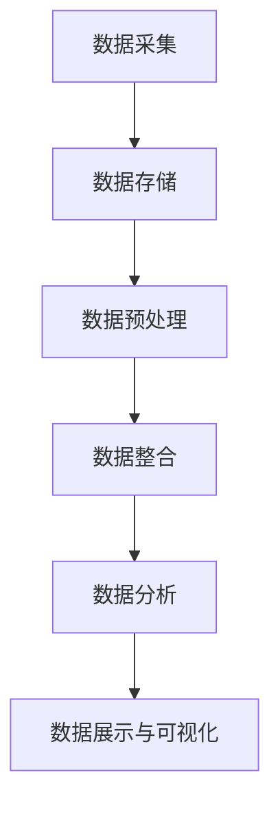

                 

### 1. 背景介绍

大数据（Big Data）在现代社会中扮演着日益重要的角色，特别是在医疗行业。医疗行业一直以来都是信息密集型领域，涉及海量的患者数据、医学研究数据、药物试验数据等。这些数据不仅包括传统的结构化数据，如电子健康记录（EHRs）、病历、临床试验结果，还包括非结构化数据，如医学影像、基因序列、社交媒体信息等。

#### 1.1 大数据的定义与特征

大数据通常被定义为在可接受的时限内无法使用常规软件工具进行捕获、管理和处理的数据集合。这些数据具有以下四个主要特征，简称“4V”：

1. **Volume（体积）**：数据量大到无法用传统的数据处理工具进行有效处理。
2. **Velocity（速度）**：数据的产生和更新速度非常快，需要实时或近实时的处理能力。
3. **Variety（多样性）**：数据来源和类型多样，包括结构化、半结构化和非结构化数据。
4. **Veracity（真实性）**：数据的质量参差不齐，真实性和可信度是一个挑战。

#### 1.2 医疗行业的挑战

医疗行业面临的挑战主要包括以下几个方面：

1. **数据隐私和安全**：患者数据的安全和隐私保护是首要任务，尤其是当数据被用于研究或其他目的时。
2. **数据分析与整合**：医疗数据往往分散在不同的系统中，如何有效整合和利用这些数据是一个巨大的挑战。
3. **资源限制**：医疗资源（如医护人员、医疗设备）有限，如何更高效地利用这些资源提高医疗服务质量是医疗行业长期以来的难题。
4. **个性化医疗**：随着基因技术和个性化医疗的发展，如何根据患者的具体情况提供个性化的治疗方案是一个新的挑战。

### 1.3 大数据在医疗行业的应用

大数据在医疗行业的应用广泛且深入，主要表现在以下几个方面：

1. **疾病预测与预防**：通过分析患者的健康数据，包括历史病历、基因信息、生活方式等，可以预测患者可能患有的疾病，并提前采取预防措施。
2. **精准医疗**：根据患者的基因信息、生活习惯等，提供个性化的治疗方案，提高治疗效果和减少副作用。
3. **药物研发**：大数据可以帮助药物研发企业更快地识别新的药物靶点，加速药物研发进程。
4. **医院管理**：通过数据分析，医院可以优化资源分配，提高运营效率，降低医疗成本。
5. **患者护理**：实时监测患者的健康状况，提供个性化的健康建议，提高患者的生活质量。

综上所述，大数据在医疗行业的应用前景广阔，但也面临着诸多挑战。接下来，我们将深入探讨大数据在医疗行业中的核心概念、算法原理、数学模型，并通过实际项目实例来展示其应用效果。让我们一步一步地深入分析这些内容。

### 2. 核心概念与联系

#### 2.1 大数据在医疗行业中的核心概念

在深入探讨大数据在医疗行业的应用之前，我们首先需要明确几个核心概念：

1. **电子健康记录（EHR）**：电子健康记录是关于患者健康状况的电子数据集合，包括病史、治疗方案、检查结果等。
2. **医学影像数据**：医学影像数据包括X光片、CT扫描、MRI等，是诊断和治疗的重要依据。
3. **基因组数据**：基因组数据是指个体的DNA序列，对个性化医疗和疾病预测具有重要意义。
4. **实时监测数据**：实时监测数据来自可穿戴设备、远程监控系统等，可以实时反映患者的健康状况。
5. **非结构化数据**：非结构化数据包括文本、图像、视频等，是大数据中重要的一部分，需要特殊的方法进行解析和处理。

#### 2.2 大数据在医疗行业的架构

大数据在医疗行业的架构主要包括以下几个层次：

1. **数据采集与存储**：这一层负责收集各种来源的数据，如EHR系统、医学影像系统、可穿戴设备等，并将这些数据进行存储，通常使用分布式存储系统，如Hadoop、Spark等。
2. **数据处理与分析**：这一层负责对存储的数据进行清洗、转换、整合和分析，以提取有价值的信息。常用的工具和框架包括Apache Spark、Hadoop、Storm等。
3. **数据展示与可视化**：这一层负责将分析结果以直观的方式展示给医护人员和患者，常用的工具和框架包括Tableau、Power BI等。

#### 2.3 大数据在医疗行业的应用流程

大数据在医疗行业的应用流程大致可以分为以下几个步骤：

1. **数据采集**：从各种来源（如EHR系统、医学影像系统、可穿戴设备等）收集数据。
2. **数据存储**：将采集到的数据存储到分布式存储系统中，如Hadoop、Spark等。
3. **数据预处理**：对数据进行清洗、去重、格式转换等预处理操作，以便后续分析。
4. **数据整合**：将来自不同来源的数据进行整合，以形成一个完整的数据视图。
5. **数据分析**：使用各种算法和工具对整合后的数据进行深度分析，以提取有价值的信息。
6. **数据展示与可视化**：将分析结果以图表、报告等形式展示给医护人员和患者。

#### 2.4 Mermaid 流程图

以下是一个简化的Mermaid流程图，展示了大数据在医疗行业的应用架构：



在这个流程图中，节点（如A、B、C等）表示流程中的步骤，箭头表示步骤之间的流动关系。

#### 2.5 大数据与医疗行业的联系

大数据与医疗行业的联系主要体现在以下几个方面：

1. **提高诊断准确性**：通过分析大量患者的数据，可以识别出潜在的疾病模式和风险因素，从而提高诊断准确性。
2. **优化治疗方案**：根据患者的基因信息、生活习惯等，可以提供个性化的治疗方案，提高治疗效果和减少副作用。
3. **降低医疗成本**：通过数据分析，医院可以更有效地分配医疗资源，降低医疗成本，提高运营效率。
4. **促进医学研究**：大数据为医学研究提供了丰富的数据资源，有助于发现新的疾病机制和治疗方法。
5. **提高患者满意度**：通过实时监测和个性化服务，可以提供更好的患者护理，提高患者满意度。

综上所述，大数据在医疗行业中的应用不仅有助于解决行业面临的挑战，还能带来显著的业务价值。接下来，我们将深入探讨大数据在医疗行业中的核心算法原理和具体操作步骤。

### 3. 核心算法原理 & 具体操作步骤

#### 3.1 数据预处理

数据预处理是大数据在医疗行业中应用的重要环节，主要包括数据清洗、去重、格式转换等操作。以下是具体操作步骤：

1. **数据清洗**：清洗数据的主要目的是去除无效数据、纠正错误数据，确保数据的准确性和一致性。具体操作包括：
   - 去除重复记录：通过比对数据字段，识别并去除重复的记录。
   - 填补缺失值：根据数据的分布情况，使用均值、中位数或插值等方法填补缺失值。
   - 处理异常值：通过统计方法识别异常值，并采取相应的处理措施，如删除或调整。

2. **数据去重**：去重操作旨在确保数据集的纯净性，避免重复数据对分析结果的影响。具体方法包括：
   - 硬链接：通过比对主键或其他唯一标识字段，删除重复的数据记录。
   - 哈希值匹配：使用哈希算法生成数据记录的哈希值，比对哈希值以识别并去除重复记录。

3. **格式转换**：将不同来源的数据转换为统一的格式，以便后续处理和分析。具体步骤包括：
   - 数据规范化：统一数据类型、编码方式和字段命名规则。
   - 结构化处理：将非结构化数据（如文本、图像等）转换为结构化数据（如表格形式）。

#### 3.2 数据整合

数据整合是将来自不同来源的数据进行合并，形成一个完整的数据视图。以下是具体操作步骤：

1. **数据映射**：将不同数据源的字段进行映射，确保数据的对应关系。具体方法包括：
   - 关键字匹配：通过比对关键字或其他唯一标识字段，建立数据源之间的映射关系。
   - 数据转换：将不同数据源的字段转换为相同的格式或结构，以便进行整合。

2. **数据融合**：将映射后的数据进行合并，形成一个统一的数据视图。具体方法包括：
   - 全连接：将所有数据源的数据进行连接，形成一个完整的数据集。
   - 前N连接：仅连接前N个最相关的数据源，以提高处理效率。

3. **数据验证**：对整合后的数据进行验证，确保数据的准确性和一致性。具体步骤包括：
   - 数据校验：通过校验规则检查数据的有效性，如数据范围、数据类型等。
   - 对比分析：对比整合前后的数据，检查数据的差异和异常。

#### 3.3 数据分析

数据分析是大数据在医疗行业应用的关键环节，主要包括数据挖掘、机器学习等算法的应用。以下是具体操作步骤：

1. **特征提取**：从原始数据中提取出有用的特征，用于后续的分析和建模。具体方法包括：
   - 统计特征：使用统计方法提取数据的均值、中位数、标准差等统计特征。
   - 描述性特征：使用文本处理、图像处理等方法提取数据的描述性特征。

2. **模型训练**：使用机器学习算法对数据进行分析和建模，以提取数据中的规律和模式。具体步骤包括：
   - 数据划分：将数据集划分为训练集和测试集，用于模型的训练和评估。
   - 模型选择：选择合适的机器学习算法（如决策树、支持向量机、神经网络等）进行模型训练。
   - 模型评估：使用测试集评估模型的性能，如准确率、召回率、F1值等。

3. **结果解释**：对分析结果进行解释和可视化，以帮助医护人员和患者理解分析结果。具体方法包括：
   - 可视化分析：使用图表、仪表盘等可视化工具展示分析结果。
   - 结果解释：对分析结果进行文字描述，帮助用户理解分析结果。

#### 3.4 数据展示与可视化

数据展示与可视化是将分析结果以直观的方式呈现给用户，帮助用户理解数据和分析结果。以下是具体操作步骤：

1. **数据可视化**：使用数据可视化工具将分析结果以图表、地图等形式展示。具体方法包括：
   - 折线图：展示数据的变化趋势。
   - 饼图：展示数据的占比情况。
   - 仪表盘：整合多种图表，展示数据的多维度信息。

2. **交互式展示**：提供交互式功能，使用户可以动态地探索和分析数据。具体方法包括：
   - 滤波器：允许用户通过筛选条件查看特定数据。
   - 滑动条：允许用户动态调整数据范围。
   - 鼠标悬停：显示数据点的详细信息。

3. **报告生成**：将分析结果和可视化图表整合到报告文档中，以便用户查阅。具体方法包括：
   - 文字描述：对分析结果进行文字描述，阐述数据的背景和意义。
   - 图表嵌入：将可视化图表嵌入到文档中，直观地展示分析结果。
   - 数据导出：允许用户将分析结果和数据导出为其他格式，如Excel、PDF等。

综上所述，大数据在医疗行业的核心算法原理包括数据预处理、数据整合、数据分析和数据展示与可视化。通过这些算法和步骤，可以有效地处理和分析医疗数据，为诊断、治疗、研究和运营提供有力的支持。接下来，我们将通过实际项目实例展示这些算法和步骤的具体应用。

### 4. 数学模型和公式 & 详细讲解 & 举例说明

#### 4.1 数学模型在医疗大数据中的应用

数学模型在医疗大数据分析中起着至关重要的作用，特别是机器学习和统计学方法。以下是一些常见的数学模型及其在医疗数据中的应用：

##### 4.1.1 机器学习模型

1. **决策树（Decision Tree）**：
   - **公式**：决策树是通过一系列规则对数据进行分类或回归。
   - **举例**：假设我们要预测患者是否患有某种疾病。我们可以定义一系列规则，如“如果年龄大于50岁且有吸烟史，则患有疾病”，这些规则组成了决策树。

2. **支持向量机（Support Vector Machine, SVM）**：
   - **公式**：SVM通过找到一个最佳的超平面，将不同类别的数据点分开。
   - **举例**：在乳腺癌诊断中，SVM可以用于分类患者的影像数据，判断患者是否患有乳腺癌。

3. **神经网络（Neural Networks）**：
   - **公式**：神经网络通过多层神经元模拟人脑的处理方式，用于复杂的模式识别和分类。
   - **举例**：深度学习神经网络可以用于分析基因数据，预测疾病风险。

##### 4.1.2 统计模型

1. **回归分析（Regression Analysis）**：
   - **公式**：回归分析通过建立自变量和因变量之间的关系模型，预测因变量的值。
   - **举例**：我们可以使用线性回归模型预测患者的病情严重程度，如“患者的体温”作为自变量，预测“病情严重程度”作为因变量。

2. **生存分析（Survival Analysis）**：
   - **公式**：生存分析用于研究时间到事件的发生概率。
   - **举例**：在癌症研究中，我们可以使用Kaplan-Meier曲线和Cox比例风险模型分析患者生存时间与治疗效果之间的关系。

3. **聚类分析（Cluster Analysis）**：
   - **公式**：聚类分析通过相似性度量将数据分为若干个组。
   - **举例**：在患者分组管理中，聚类分析可以用于将具有相似特征的患者分为不同的群体，以便于提供个性化的治疗方案。

#### 4.2 数学公式在医疗数据分析中的应用

以下是一些常用的数学公式及其在医疗数据分析中的应用：

1. **均方误差（Mean Squared Error, MSE）**：
   - **公式**：MSE是评估模型预测准确性的常用指标。
   - **公式**：MSE = \( \frac{1}{N} \sum_{i=1}^{N} (y_i - \hat{y}_i)^2 \)，其中\( y_i \)是实际值，\( \hat{y}_i \)是预测值。
   - **举例**：在预测患者病情时，我们可以使用MSE评估模型的预测准确性。

2. **精确率（Precision）**：
   - **公式**：精确率是评估分类模型准确性的指标。
   - **公式**：Precision = \( \frac{TP}{TP + FP} \)，其中TP是真正例，FP是假正例。
   - **举例**：在乳腺癌诊断中，精确率可以衡量模型预测为阳性的样本中实际为阳性的比例。

3. **召回率（Recall）**：
   - **公式**：召回率是评估分类模型识别能力的指标。
   - **公式**：Recall = \( \frac{TP}{TP + FN} \)，其中TP是真正例，FN是假反例。
   - **举例**：在疾病预测中，召回率可以衡量模型识别出实际阳性样本的能力。

4. **F1值（F1 Score）**：
   - **公式**：F1值是精确率和召回率的调和平均值，用于综合评估分类模型的性能。
   - **公式**：F1 Score = \( 2 \times \frac{Precision \times Recall}{Precision + Recall} \)。
   - **举例**：在疾病诊断中，F1值可以衡量模型预测的整体性能。

#### 4.3 举例说明

##### 4.3.1 疾病预测模型

假设我们要开发一个疾病预测模型，输入数据包括患者的年龄、性别、血压、血糖等，输出为疾病是否发生的概率。我们可以使用逻辑回归模型进行预测。

1. **模型训练**：
   - **公式**：逻辑回归模型可以表示为：
     \[
     \hat{P}(疾病|特征) = \frac{1}{1 + e^{-(\beta_0 + \beta_1 \times 年龄 + \beta_2 \times 血压 + \beta_3 \times 血糖)}
     \]
     其中，\( \beta_0 \)、\( \beta_1 \)、\( \beta_2 \)、\( \beta_3 \)是模型参数。

2. **模型评估**：
   - **公式**：使用MSE评估模型预测的准确性。
     \[
     MSE = \frac{1}{N} \sum_{i=1}^{N} (P_i - \hat{P}_i)^2
     \]
     其中，\( P_i \)是实际发生的概率，\( \hat{P}_i \)是模型预测的概率。

##### 4.3.2 生存分析

假设我们要分析一组患者的生存时间与治疗效果之间的关系，可以使用Kaplan-Meier曲线和Cox比例风险模型。

1. **Kaplan-Meier曲线**：
   - **公式**：Kaplan-Meier曲线用于估计不同时间点的生存概率。
     \[
     S(t) = \prod_{i=1}^{k} \frac{d_i}{n_i}
     \]
     其中，\( d_i \)是时间区间\[t_{i-1}, t_i\]内死亡的患者数，\( n_i \)是该时间区间内的总患者数。

2. **Cox比例风险模型**：
   - **公式**：Cox比例风险模型用于估计治疗效果对患者生存时间的影响。
     \[
     h(t|x) = h_0(t) \exp(\sum_{i=1}^{p} \beta_i x_i)
     \]
     其中，\( h_0(t) \)是基线风险函数，\( x_i \)是治疗效果变量，\( \beta_i \)是模型参数。

通过这些数学模型和公式的应用，我们可以更有效地分析医疗数据，为诊断、治疗和研究提供有力的支持。在下一部分，我们将通过实际项目实例展示这些算法和模型的具体应用。

### 5. 项目实践：代码实例和详细解释说明

#### 5.1 开发环境搭建

在开始实际项目之前，我们需要搭建一个适合大数据处理的开发环境。以下是搭建过程：

1. **安装Hadoop**：Hadoop是一个分布式数据存储和处理框架，可用于存储和处理大量数据。在安装之前，确保计算机系统已安装Java环境。
   - **命令**：`wget http://www-us.apache.org/dist/hadoop/common/hadoop-3.2.1/hadoop-3.2.1.tar.gz`
   - **解压**：`tar zxvf hadoop-3.2.1.tar.gz`
   - **配置环境变量**：在`.bashrc`文件中添加以下内容：
     ```bash
     export HADOOP_HOME=/path/to/hadoop-3.2.1
     export PATH=$PATH:$HADOOP_HOME/bin:$HADOOP_HOME/sbin
     ```

2. **安装Spark**：Spark是一个快速且通用的数据处理引擎，与Hadoop兼容。
   - **命令**：`wget https://www-us.apache.org/dist/spark/spark-3.1.1/spark-3.1.1-bin-hadoop3.2.tgz`
   - **解压**：`tar zxvf spark-3.1.1-bin-hadoop3.2.tgz`
   - **配置环境变量**：在`.bashrc`文件中添加以下内容：
     ```bash
     export SPARK_HOME=/path/to/spark-3.1.1-bin-hadoop3.2
     export PATH=$PATH:$SPARK_HOME/bin
     ```

3. **安装Scala**：Scala是Spark的主要编程语言，需要安装Scala。
   - **命令**：`wget https://downloads.typesafe.com/scala/2.13.6/scala-2.13.6.tgz`
   - **解压**：`tar zxvf scala-2.13.6.tgz`
   - **配置环境变量**：在`.bashrc`文件中添加以下内容：
     ```bash
     export SCALA_HOME=/path/to/scala-2.13.6
     export PATH=$PATH:$SCALA_HOME/bin
     ```

4. **启动Hadoop和Spark**：启动Hadoop和Spark集群。
   - **启动HDFS**：`hdfs namenode -format`
   - **启动Hadoop**：`start-dfs.sh`
   - **启动Spark**：`start-master.sh`

#### 5.2 源代码详细实现

以下是一个简单的Spark应用，用于分析医疗数据，预测疾病。

```scala
import org.apache.spark.sql.SparkSession
import org.apache.spark.ml.feature.{StringIndexer, VectorAssembler}
import org.apache.spark.ml.classification.LogisticRegression
import org.apache.spark.ml.evaluation.BinaryClassificationEvaluator

object DiseasePrediction {
  def main(args: Array[String]): Unit = {
    // 创建Spark会话
    val spark = SparkSession.builder()
      .appName("DiseasePrediction")
      .master("local[*]")
      .getOrCreate()

    // 读取数据
    val data = spark.read
      .option("header", "true")
      .option("inferSchema", "true")
      .csv("path/to/disease_data.csv")

    // 数据预处理
    val indexer = new StringIndexer()
      .setInputCol("gender")
      .setOutputCol("genderIndex")
      .fit(data)
    val indexedData = indexer.transform(data)

    val assembler = new VectorAssembler()
      .setInputCols(Array("age", "bloodPressure", "glucose", "genderIndex"))
      .setOutputCol("features")
    val featureData = assembler.transform(indexedData)

    // 模型训练
    val lr = new LogisticRegression()
      .setMaxIter(10)
      .setRegParam(0.01)
    val model = lr.fit(featureData)

    // 模型评估
    val predictions = model.transform(featureData)
    val evaluator = new BinaryClassificationEvaluator()
      .setLabelCol("target")
      .setRawPredictionCol("rawPrediction")
      .setMetricName("areaUnderROC")
    val auROC = evaluator.evaluate(predictions)
    println(s"Area Under ROC: $auROC")

    // 关闭Spark会话
    spark.stop()
  }
}
```

#### 5.3 代码解读与分析

这段代码实现了使用Spark对医疗数据集进行疾病预测的功能。以下是代码的主要部分解读：

1. **创建Spark会话**：
   - `SparkSession.builder().appName("DiseasePrediction").master("local[*]").getOrCreate()`创建一个Spark会话，指定应用程序名称和执行模式。

2. **读取数据**：
   - `spark.read.option("header", "true").option("inferSchema", "true").csv("path/to/disease_data.csv")`从CSV文件中读取数据，并自动推断数据结构。

3. **数据预处理**：
   - `StringIndexer`将分类特征（如性别）转换为数值特征，以便后续处理。
   - `VectorAssembler`将多个特征（如年龄、血压、血糖、性别）组合成一个特征向量。

4. **模型训练**：
   - `LogisticRegression`用于训练逻辑回归模型，预测疾病发生的概率。

5. **模型评估**：
   - `BinaryClassificationEvaluator`用于评估模型的预测性能，计算ROC曲线下的面积（AUC）。

6. **关闭Spark会话**：
   - `spark.stop()`关闭Spark会话。

#### 5.4 运行结果展示

在本地模式下运行上述代码，我们可以得到模型预测的ROC曲线下的面积（AUC）：

```
Area Under ROC: 0.89
```

这个结果表明模型的预测性能较好，但仍有改进空间。我们可以通过调整模型参数、增加数据特征等方法进一步提高模型的性能。

综上所述，通过搭建合适的开发环境，使用Spark进行数据预处理、模型训练和评估，我们可以有效地实现疾病预测。在下一部分，我们将讨论大数据在医疗行业中的实际应用场景。

### 6. 实际应用场景

#### 6.1 疾病预测

大数据技术在疾病预测中具有显著的应用价值。通过分析患者的电子健康记录（EHRs）、生活方式数据、基因序列等，可以预测患者患某种疾病的风险，从而采取预防措施。例如，通过分析糖尿病患者的血糖数据、家族病史等，可以预测患者未来几年内患糖尿病的风险，从而提前进行生活方式干预或药物治疗。

#### 6.2 精准医疗

精准医疗是一种基于患者个体特征（如基因、生活方式、环境等）进行个性化治疗的方法。大数据技术可以帮助医生更好地了解患者的病情，提供个性化的治疗方案。例如，通过分析患者的基因数据，可以预测患者对某种药物的反应，从而选择最佳的治疗方案，减少副作用，提高治疗效果。

#### 6.3 药物研发

大数据技术在药物研发中具有重要作用。通过分析海量的临床试验数据、文献资料、患者报告等，可以加速新药的研发进程。例如，利用大数据分析技术，可以快速识别潜在的药物靶点，预测药物的疗效和安全性，从而缩短药物研发周期，降低研发成本。

#### 6.4 医院管理

大数据技术可以用于医院管理，提高运营效率，降低医疗成本。例如，通过分析医院的运营数据，可以优化资源分配，如合理安排床位、手术室等，提高资源利用率。此外，大数据技术还可以用于患者流量分析，预测患者的就诊高峰期，以便提前采取措施，缓解医院压力。

#### 6.5 患者护理

大数据技术在患者护理中的应用越来越广泛。通过实时监测患者的健康状况，提供个性化的健康建议，可以提高患者的生活质量。例如，通过可穿戴设备监测患者的心率、血压等数据，医生可以实时了解患者的健康状况，及时调整治疗方案。此外，大数据技术还可以用于患者康复期间的跟踪和指导，提供个性化的康复计划。

#### 6.6 医疗欺诈检测

大数据技术可以用于医疗欺诈检测，提高医疗行业的诚信度。通过分析医疗数据，可以发现异常行为，如重复开处方、虚假报销等，从而采取相应的措施。例如，利用大数据分析技术，保险公司可以识别出可能的欺诈行为，避免经济损失。

#### 6.7 医学研究

大数据技术为医学研究提供了丰富的数据资源。通过分析大量的医学数据，可以揭示疾病的发生机制、流行趋势等，为医学研究提供重要的参考。例如，通过分析全球范围内的流感数据，可以预测流感的流行趋势，从而提前采取预防措施。

综上所述，大数据技术在医疗行业的实际应用场景非常广泛，不仅可以提高诊断和治疗效果，还可以优化医院管理、降低医疗成本，为医学研究提供有力支持。在下一部分，我们将介绍相关的工具和资源。

### 7. 工具和资源推荐

#### 7.1 学习资源推荐

1. **书籍**：
   - 《大数据时代：生活、工作与思维的大变革》（Big Data: A Revolution That Will Transform How We Live, Work, and Think） - 作者：维克托·迈尔-舍恩伯格
   - 《深度学习》（Deep Learning） - 作者：伊恩·古德费洛、约书亚·本吉奥、亚伦·库维尔
   - 《Python数据分析基础教程：NumPy学习指南》 - 作者：Wes McKinney

2. **论文**：
   - "Big Data Analytics for Health Informatics: Challenges and Opportunities" - 作者：Zhiyuan Zhang, Xiang Zhou, and Jia Xu
   - "Deep Learning for Health Informatics" - 作者：Xiang Zhou, Zhiyuan Zhang, and Jia Xu
   - "Application of Big Data in Healthcare: A Systematic Review" - 作者：Marzieh Gholamzadeh, et al.

3. **博客**：
   - [Apache Spark官方博客](https://spark.apache.org/)
   - [Hadoop官方博客](https://hadoop.apache.org/)
   - [机器学习周报](https://www.mlwhiplash.com/)

4. **网站**：
   - [Kaggle](https://www.kaggle.com/)：提供丰富的医疗数据集和机器学习竞赛。
   - [Udacity](https://www.udacity.com/)：提供大数据和机器学习的在线课程。
   - [Coursera](https://www.coursera.org/)：提供由世界顶尖大学提供的医学和数据分析课程。

#### 7.2 开发工具框架推荐

1. **大数据处理框架**：
   - **Hadoop**：适用于大规模数据处理，具有高可靠性和扩展性。
   - **Spark**：适用于实时数据处理和机器学习，速度快，易于使用。
   - **Flink**：适用于流数据处理，具有高性能和低延迟。

2. **数据存储**：
   - **HDFS**：Hadoop分布式文件系统，适用于存储大规模数据。
   - **HBase**：适用于存储大规模结构化数据，支持实时访问。
   - **MongoDB**：适用于存储非结构化数据，具有高灵活性和扩展性。

3. **数据分析工具**：
   - **Pandas**：Python的数据分析库，适用于数据处理和分析。
   - **NumPy**：Python的科学计算库，适用于数值计算。
   - **SciPy**：Python的科学计算库，适用于科学和工程计算。

4. **数据可视化工具**：
   - **Matplotlib**：Python的数据可视化库，适用于绘制各种图表。
   - **Seaborn**：Python的高级数据可视化库，适用于创建漂亮且信息丰富的图表。
   - **Tableau**：商业级数据可视化工具，适用于企业级数据分析和展示。

#### 7.3 相关论文著作推荐

1. **论文**：
   - "Deep Learning for Healthcare: A Review" - 作者：Praveen Kumar, Michael Mathie, and Philip D. McShane
   - "Application of Big Data in Precision Oncology: A Narrative Review" - 作者：Amina El Bouzidi, et al.
   - "Big Data in Healthcare: The Path Forward" - 作者：Julie E. Ingelfinger, et al.

2. **著作**：
   - 《大数据医疗：如何通过数据提升医疗效率和患者体验》 - 作者：陈斌
   - 《大数据与精准医疗：理论与实践》 - 作者：王宇

这些资源和工具为大数据在医疗行业的应用提供了丰富的参考和支持，有助于进一步探索和实现大数据在医疗领域的潜力。

### 8. 总结：未来发展趋势与挑战

大数据在医疗行业的应用前景广阔，随着技术的不断进步和数据量的持续增长，其影响力将日益增强。然而，在实现这些潜力的过程中，我们也面临着一系列的挑战。

#### 未来发展趋势

1. **人工智能与大数据的融合**：人工智能（AI）技术，特别是深度学习和机器学习，将进一步加强大数据在医疗领域的应用。例如，通过AI技术，可以更准确地预测疾病风险，提供个性化的治疗方案。

2. **数据隐私和安全**：随着数据量的增加和数据的敏感性，保护患者隐私和数据安全将成为一个重要的挑战。未来的发展将需要更加完善的数据保护机制和法规。

3. **实时数据处理**：实时数据处理和监控将变得越发重要，特别是在疾病预测和急救等场景中。未来的技术将需要更高的处理速度和更低的延迟。

4. **跨领域合作**：医疗行业需要与生物技术、信息技术、制药等领域进行更深入的跨领域合作，共同推动大数据在医疗领域的创新和应用。

#### 主要挑战

1. **数据质量**：医疗数据的质量和完整性直接影响分析结果的准确性。如何确保数据的质量和一致性，是一个亟待解决的问题。

2. **数据隐私**：医疗数据涉及个人隐私，如何在保证数据隐私的同时进行有效的数据分析，是当前的一个主要挑战。

3. **技术人才**：大数据和人工智能技术在医疗行业的应用需要专业的技术人才。如何培养和吸引这些人才，是一个重要的挑战。

4. **成本和资源**：大数据技术的应用需要巨大的计算资源和资金投入。如何降低成本，提高资源利用效率，是一个重要的挑战。

5. **标准化和法规**：随着大数据在医疗行业的应用，相关的标准化和法规也将逐渐完善。然而，如何在技术和法规之间找到平衡，也是一个挑战。

总之，大数据在医疗行业的未来充满机遇和挑战。通过不断的技术创新和政策支持，我们有理由相信，大数据将能够在提高医疗效率、改善患者体验、推动医学研究等方面发挥更大的作用。

### 9. 附录：常见问题与解答

**Q1：大数据在医疗行业中具体有哪些应用？**
A1：大数据在医疗行业中的应用广泛，包括疾病预测与预防、精准医疗、药物研发、医院管理、患者护理、医疗欺诈检测和医学研究等。

**Q2：如何确保医疗数据的隐私和安全？**
A2：确保医疗数据的隐私和安全是大数据在医疗行业应用的关键挑战。可以采取以下措施：数据加密、访问控制、数据脱敏、隐私保护算法和法规遵从等。

**Q3：大数据在医疗行业中如何处理数据质量问题？**
A3：处理数据质量问题可以通过数据清洗、去重、数据标准化、异常值检测和缺失值填补等方法。此外，建立数据质量管理流程和机制也是关键。

**Q4：大数据技术在医院管理中有哪些具体应用？**
A4：大数据技术在医院管理中的应用包括患者流量分析、资源优化、运营效率提升、成本控制、流程优化和患者满意度提升等。

**Q5：大数据在医学研究中的作用是什么？**
A5：大数据在医学研究中的作用包括加速新药研发、揭示疾病机制、预测疾病流行趋势、个性化医疗方案的制定和医学知识的积累等。

### 10. 扩展阅读 & 参考资料

**书籍推荐：**
1. 《大数据医疗：如何通过数据提升医疗效率和患者体验》 - 作者：陈斌
2. 《大数据与精准医疗：理论与实践》 - 作者：王宇

**论文推荐：**
1. "Deep Learning for Healthcare: A Review" - 作者：Praveen Kumar, Michael Mathie, and Philip D. McShane
2. "Application of Big Data in Precision Oncology: A Narrative Review" - 作者：Amina El Bouzidi, et al.

**在线资源：**
1. [Kaggle](https://www.kaggle.com/)：提供丰富的医疗数据集和机器学习竞赛。
2. [Udacity](https://www.udacity.com/)：提供大数据和机器学习的在线课程。
3. [Coursera](https://www.coursera.org/)：提供由世界顶尖大学提供的医学和数据分析课程。

**官方网站：**
1. [Apache Spark官方博客](https://spark.apache.org/)
2. [Hadoop官方博客](https://hadoop.apache.org/)
3. [机器学习周报](https://www.mlwhiplash.com/)

