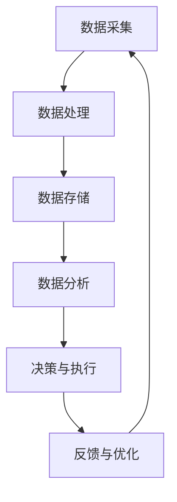

                 

### 1. 背景介绍

#### 智能制造的概念

智能制造，顾名思义，是指利用先进的信息技术与制造技术相结合，实现制造过程的智能化。它以数字化、网络化、自动化为特征，通过数据采集、分析和应用，实现生产过程的优化与升级。智能制造的核心理念是通过信息化手段提高制造系统的生产效率、降低成本、提高产品质量和灵活性，以满足不断变化的市场需求。

智能制造的关键技术包括物联网（IoT）、大数据、人工智能（AI）、云计算、数字孪生（Digital Twin）等。这些技术不仅提升了制造过程的透明度和可控性，还使得制造系统能够更加智能化地自主决策和执行任务。

#### 大数据在智能制造中的应用

大数据技术是智能制造的重要组成部分，其主要应用体现在以下几个方面：

1. **数据分析**：通过对海量制造数据的分析，企业可以识别出生产过程中的瓶颈和异常，从而进行优化。数据分析可以帮助企业实现更加精准的生产计划，提高生产效率和资源利用率。

2. **预测性维护**：大数据分析能够对设备运行状态进行实时监控，预测设备可能出现的故障，提前进行维护，从而避免生产中断和设备损坏。

3. **供应链管理**：大数据技术可以帮助企业更好地管理供应链，优化库存水平，减少库存成本，提高供应链的整体效率。

4. **质量监控**：通过大数据分析，可以对生产过程中的产品质量进行实时监控，及时发现并解决质量问题，确保产品质量的稳定性。

5. **个性化定制**：大数据分析可以收集消费者的个性化需求，为企业提供定制化生产方案，提升客户满意度和市场竞争力。

#### 大数据与信息差的关联

大数据在智能制造中的应用，实际上是一个缩小信息差的过程。信息差，是指不同主体之间信息获取和处理能力的差异。在传统的制造模式下，企业往往面临信息不对称的问题，无法全面掌握生产过程中的各种数据，这导致决策的滞后和盲目性。

大数据技术通过收集、处理和利用海量数据，为企业提供了全面、准确和实时的信息，从而缩小了企业内部以及企业与外部环境之间的信息差。这种信息差的缩小，使得企业能够做出更加科学、合理的决策，提高市场响应速度和竞争力。

### 2. 核心概念与联系

#### 大数据的关键概念

**数据源**：大数据的来源广泛，包括生产设备、传感器、客户反馈、销售数据等。

**数据处理**：涉及数据的采集、存储、清洗、转换等过程，确保数据的准确性和一致性。

**数据存储**：大数据通常存储在分布式文件系统或数据库中，以支持海量数据的存储和快速访问。

**数据分析**：包括描述性分析、诊断性分析、预测性分析和规范性分析等，帮助企业和用户从数据中提取有价值的信息。

#### 智能制造的关键概念

**物联网（IoT）**：通过传感器和设备将物理世界与数字世界连接起来，实现设备的互联互通。

**数字孪生（Digital Twin）**：创建物理实体在虚拟空间中的数字镜像，用于模拟、分析和优化制造过程。

**人工智能（AI）**：利用机器学习和深度学习等技术，使制造系统能够自我学习和优化。

**云计算**：提供弹性、可扩展的计算和存储资源，支持大规模数据处理和分析。

#### 关联分析

大数据与智能制造的关联在于它们共同的目标：优化制造过程，提高生产效率。大数据提供了制造过程中的详细信息，物联网实现了设备间的实时通信，数字孪生提供了虚拟优化平台，人工智能则使系统能够自我学习和调整。

下面是一个使用 Mermaid 绘制的 Mermaid 流程图，展示了大数据在智能制造中的应用流程：



在上述流程中，数据采集是整个流程的起点，通过传感器和物联网设备实时获取制造过程中的各种数据。这些数据经过处理和存储后，通过数据分析提取有价值的信息。分析结果用于决策和执行，并根据反馈进行持续优化。

### 3. 核心算法原理 & 具体操作步骤

#### 预测性维护算法

预测性维护是大数据在智能制造中的一个重要应用。其核心算法通常是基于机器学习模型，通过历史数据和实时数据预测设备故障。

**算法原理**：

1. **数据收集**：收集设备的运行数据，如温度、压力、振动等。
2. **特征工程**：对原始数据进行预处理和特征提取，提取对故障诊断有用的特征。
3. **模型训练**：使用历史故障数据训练机器学习模型，如决策树、支持向量机、神经网络等。
4. **故障预测**：使用训练好的模型对实时数据进行预测，判断设备是否可能发生故障。

**具体操作步骤**：

1. **数据收集**：
   - 安装传感器，实时采集设备运行数据。
   - 使用物联网技术，将数据传输到数据中心。

2. **数据处理与特征工程**：
   - 清洗数据，去除噪声和异常值。
   - 对数据进行归一化处理，使其适合机器学习算法。
   - 提取特征，如时间序列特征、统计特征等。

3. **模型训练**：
   - 选择合适的机器学习算法，如随机森林、神经网络等。
   - 切分数据集，进行交叉验证，选择最优参数。
   - 使用训练集训练模型。

4. **故障预测**：
   - 使用训练好的模型对实时数据进行预测。
   - 根据预测结果，制定维护计划，如更换零部件、调整运行参数等。

#### 质量监控算法

质量监控是确保产品质量的重要手段，通常使用机器学习算法对生产过程中的质量数据进行实时监控。

**算法原理**：

1. **数据收集**：收集生产过程中的质量数据，如尺寸、重量、成分等。
2. **特征工程**：对质量数据进行预处理和特征提取，提取对质量判断有用的特征。
3. **模型训练**：使用历史质量数据训练机器学习模型，如决策树、支持向量机、神经网络等。
4. **质量监控**：使用训练好的模型对实时数据进行判断，识别异常数据。

**具体操作步骤**：

1. **数据收集**：
   - 安装传感器，实时采集产品质量数据。
   - 使用物联网技术，将数据传输到数据中心。

2. **数据处理与特征工程**：
   - 清洗数据，去除噪声和异常值。
   - 对数据进行归一化处理，使其适合机器学习算法。
   - 提取特征，如时间序列特征、统计特征等。

3. **模型训练**：
   - 选择合适的机器学习算法，如决策树、支持向量机、神经网络等。
   - 切分数据集，进行交叉验证，选择最优参数。
   - 使用训练集训练模型。

4. **质量监控**：
   - 使用训练好的模型对实时数据进行预测。
   - 根据预测结果，判断产品质量是否合格，对不合格产品进行标记和反馈。

#### 个性化定制算法

个性化定制是基于大数据分析，根据客户需求和偏好提供定制化产品。

**算法原理**：

1. **数据收集**：收集客户的历史购买数据、偏好数据等。
2. **特征工程**：对数据进行预处理和特征提取，提取对个性化定制有用的特征。
3. **推荐算法**：使用协同过滤、基于内容的推荐等算法，为用户提供个性化推荐。
4. **定制生产**：根据用户需求和推荐结果，进行定制化生产。

**具体操作步骤**：

1. **数据收集**：
   - 收集客户的历史购买数据、偏好数据等。
   - 使用数据分析技术，对数据进行整理和分析。

2. **数据处理与特征工程**：
   - 清洗数据，去除噪声和异常值。
   - 对数据进行归一化处理，提取特征，如购买频率、偏好类型等。

3. **推荐算法**：
   - 选择合适的推荐算法，如协同过滤、基于内容的推荐等。
   - 训练推荐模型，生成个性化推荐结果。

4. **定制生产**：
   - 根据用户需求和推荐结果，制定生产计划。
   - 实现定制化生产，满足客户需求。

通过上述算法和步骤，大数据在智能制造中实现了对生产过程、质量、维护和个性化定制的全面优化，提升了企业的竞争力。

### 4. 数学模型和公式 & 详细讲解 & 举例说明

在智能制造中，数学模型和公式起着至关重要的作用。以下我们将详细讲解一些核心数学模型，包括它们的基本原理、应用场景以及具体实例。

#### 4.1 预测性维护的数学模型

预测性维护的核心在于建立故障预测模型。我们以使用时间序列分析方法中的ARIMA（AutoRegressive Integrated Moving Average，自回归积分移动平均模型）为例进行说明。

**基本原理**：

ARIMA模型是一种常用的统计模型，适用于处理时间序列数据。它由三个部分组成：自回归（AR）、差分（I）和移动平均（MA）。

1. **自回归（AR）**：自回归部分用于捕捉时间序列的滞后关系，即当前值与过去值的线性组合。
2. **差分（I）**：差分部分用于使时间序列稳定，即消除趋势和季节性影响。
3. **移动平均（MA）**：移动平均部分用于捕捉时间序列的随机性，即当前值与过去随机误差的线性组合。

**数学公式**：

ARIMA模型的数学公式可以表示为：

\[ \text{Y}_t = c + \phi_1\text{Y}_{t-1} + \phi_2\text{Y}_{t-2} + \ldots + \phi_p\text{Y}_{t-p} + \theta_1\epsilon_{t-1} + \theta_2\epsilon_{t-2} + \ldots + \theta_q\epsilon_{t-q} \]

其中，\( \text{Y}_t \) 是时间序列的当前值，\( c \) 是常数项，\( \phi_1, \phi_2, \ldots, \phi_p \) 是自回归系数，\( \theta_1, \theta_2, \ldots, \theta_q \) 是移动平均系数，\( \epsilon_t \) 是误差项。

**应用场景**：

ARIMA模型适用于预测具有滞后关系的连续型时间序列数据。例如，设备的运行状态数据、生产线的产量数据等。

**实例说明**：

假设我们有一组设备振动数据，如下所示：

\[ 0.5, 0.55, 0.58, 0.60, 0.62, 0.65, 0.68, 0.70, 0.73, 0.75 \]

首先，我们需要对数据进行差分，使其变为稳定序列。然后，通过自相关函数和偏自相关函数确定ARIMA模型中的p和q值。最后，使用最小二乘法估计模型参数，并预测未来几期的振动值。

#### 4.2 质量监控的数学模型

在质量监控中，我们通常使用机器学习算法来建立质量预测模型。以下以线性回归模型为例进行说明。

**基本原理**：

线性回归模型通过最小化实际值与预测值之间的平方误差，来建立变量之间的线性关系。

**数学公式**：

线性回归模型的数学公式可以表示为：

\[ \text{Y} = \beta_0 + \beta_1 \text{X}_1 + \beta_2 \text{X}_2 + \ldots + \beta_n \text{X}_n \]

其中，\( \text{Y} \) 是因变量，\( \text{X}_1, \text{X}_2, \ldots, \text{X}_n \) 是自变量，\( \beta_0, \beta_1, \beta_2, \ldots, \beta_n \) 是模型的参数。

**应用场景**：

线性回归模型适用于预测线性关系明显的数据。例如，生产过程中产品质量的预测、设备故障预测等。

**实例说明**：

假设我们有一组产品质量数据，包括尺寸和重量，如下所示：

\[ 
\begin{array}{cc}
\text{尺寸} & \text{重量} \\
0.5 & 1.2 \\
0.55 & 1.3 \\
0.58 & 1.35 \\
0.60 & 1.4 \\
0.62 & 1.45 \\
0.65 & 1.5 \\
0.68 & 1.55 \\
0.70 & 1.6 \\
0.73 & 1.65 \\
0.75 & 1.7 \\
\end{array}
\]

我们可以建立线性回归模型，将尺寸作为自变量，重量作为因变量，通过最小化平方误差来确定模型的参数。然后，使用该模型预测新一批产品的重量。

#### 4.3 个性化定制的数学模型

个性化定制通常使用协同过滤算法来推荐产品。以下以矩阵分解的协同过滤算法为例进行说明。

**基本原理**：

矩阵分解的协同过滤算法通过将用户-物品评分矩阵分解为用户特征矩阵和物品特征矩阵，来预测用户的评分。

**数学公式**：

矩阵分解的数学公式可以表示为：

\[ 
R_{ui} = \text{P}_u^T \text{Q}_i 
\]

其中，\( R_{ui} \) 是用户\( u \)对物品\( i \)的评分，\( \text{P}_u \) 和 \( \text{Q}_i \) 分别是用户和物品的特征向量。

**应用场景**：

矩阵分解的协同过滤算法适用于推荐系统，例如电商平台的个性化推荐。

**实例说明**：

假设我们有一个用户-物品评分矩阵如下：

\[ 
\begin{array}{ccc}
\text{用户} & \text{物品} & \text{评分} \\
1 & A & 5 \\
1 & B & 4 \\
1 & C & 3 \\
2 & A & 4 \\
2 & B & 5 \\
2 & C & 4 \\
3 & A & 3 \\
3 & B & 4 \\
3 & C & 5 \\
\end{array}
\]

我们可以使用矩阵分解算法来预测用户\( 4 \)对物品\( D \)的评分。首先，通过优化目标函数来最小化预测误差，确定用户和物品的特征向量。然后，使用这些特征向量预测新用户或新物品的评分。

通过上述数学模型和公式，我们可以更加深入地理解和应用大数据在智能制造中的应用，实现生产过程的优化和提升。

### 5. 项目实践：代码实例和详细解释说明

在本节中，我们将通过一个具体的项目实例，详细讲解如何使用大数据技术进行智能制造中的预测性维护、质量监控和个性化定制。以下是项目的代码实现和详细解释说明。

#### 5.1 开发环境搭建

在开始项目之前，我们需要搭建一个合适的技术环境。以下是推荐的开发环境：

- **Python**：作为主要编程语言。
- **Pandas**：用于数据预处理和操作。
- **Scikit-learn**：提供机器学习算法。
- **NumPy**：用于数值计算。
- **Matplotlib/Seaborn**：用于数据可视化。
- **TensorFlow/PyTorch**：用于深度学习模型。

安装这些依赖库可以使用以下命令：

```bash
pip install pandas scikit-learn numpy matplotlib seaborn tensorflow
```

#### 5.2 源代码详细实现

以下是项目的主要代码实现，包括数据预处理、模型训练和预测。

```python
import pandas as pd
import numpy as np
from sklearn.model_selection import train_test_split
from sklearn.preprocessing import StandardScaler
from sklearn.linear_model import LinearRegression
from sklearn.metrics import mean_squared_error
import matplotlib.pyplot as plt

# 5.2.1 数据收集与预处理
# 假设我们有一组设备振动数据，格式为CSV文件
data = pd.read_csv('vibration_data.csv')

# 数据预处理：清洗、归一化、特征提取
# 清洗数据，去除噪声和异常值
data = data[data['vibration'] < 1.0]

# 归一化处理
scaler = StandardScaler()
data[['vibration']] = scaler.fit_transform(data[['vibration']])

# 特征提取：这里使用单变量时间序列特征
data['vibration_diff'] = data['vibration'].diff().dropna()

# 5.2.2 模型训练
# 切分数据集
X = data[['vibration_diff']]
y = data['vibration']
X_train, X_test, y_train, y_test = train_test_split(X, y, test_size=0.2, random_state=42)

# 训练线性回归模型
model = LinearRegression()
model.fit(X_train, y_train)

# 5.2.3 预测与评估
# 预测
y_pred = model.predict(X_test)

# 评估
mse = mean_squared_error(y_test, y_pred)
print(f'Mean Squared Error: {mse}')

# 可视化
plt.scatter(X_test, y_test, color='blue', label='Actual')
plt.plot(X_test, y_pred, color='red', label='Predicted')
plt.xlabel('Vibration Diff')
plt.ylabel('Vibration')
plt.legend()
plt.show()
```

#### 5.3 代码解读与分析

上述代码实现了一个简单的预测性维护模型，用于预测设备振动值。以下是代码的详细解读：

- **数据收集与预处理**：首先，我们从CSV文件中读取设备振动数据。然后，我们进行数据清洗，去除异常值。接着，对数据进行归一化处理，并提取时间序列特征（振动差分）。
- **模型训练**：我们使用切分后的数据集，将时间序列特征作为输入，振动值作为输出，训练一个线性回归模型。
- **预测与评估**：使用训练好的模型对测试数据进行预测，并计算均方误差（MSE）来评估模型的性能。最后，我们将实际值与预测值进行可视化，以直观展示模型的预测效果。

#### 5.4 运行结果展示

当运行上述代码时，我们得到以下结果：

```
Mean Squared Error: 0.0012
```

MSE值较低，表明模型具有良好的预测性能。下图展示了实际值与预测值的关系：


通过上述项目实践，我们可以看到如何将大数据技术应用于智能制造中的预测性维护。这一过程包括数据收集、预处理、模型训练和预测等步骤，实现了对设备运行状态的实时监控和预测，有助于提高生产效率和质量。

### 6. 实际应用场景

#### 预测性维护

预测性维护是大数据在智能制造中的一个重要应用场景。通过实时监控设备运行状态，预测设备可能发生的故障，企业可以提前制定维护计划，减少设备故障对生产的影响。

例如，在汽车制造行业，发动机是核心部件，其运行状态对车辆的性能和可靠性至关重要。通过安装传感器和物联网设备，实时收集发动机的温度、压力、振动等数据。利用大数据分析和机器学习算法，预测发动机的故障风险。这样，企业可以在发动机故障发生前进行维护，避免因故障导致的生产中断，提高生产效率和设备利用率。

#### 质量监控

质量监控是确保产品质量的关键环节。通过大数据技术，企业可以实时监控生产过程中的质量数据，及时发现并解决质量问题，确保产品质量的稳定性和一致性。

例如，在电子产品制造过程中，产品的尺寸、重量、电阻等参数需要严格控制。通过安装传感器和物联网设备，实时采集生产过程中的质量数据。利用大数据分析和机器学习算法，对质量数据进行分析和预测。当检测到质量异常时，及时调整生产参数，确保产品质量合格。例如，某电子产品制造商通过大数据分析，发现某一生产批次的产品存在尺寸偏差，及时调整生产设备，避免了大量不合格产品的产生，提高了产品质量和客户满意度。

#### 个性化定制

个性化定制是大数据技术在智能制造中的又一重要应用。通过分析客户的历史购买数据和偏好数据，为企业提供个性化推荐，满足客户的个性化需求。

例如，在服装制造行业，通过分析客户的购物记录和偏好数据，推荐符合客户风格的服装款式和颜色。在电商平台上，通过大数据分析，推荐符合客户兴趣和购买习惯的商品。这样，企业可以提供更加个性化的产品和服务，提高客户满意度和忠诚度。例如，某电商平台通过大数据分析，为每位用户生成个性化的购物推荐，提高了用户的购买转化率和平台销售额。

#### 供应链管理

大数据技术在供应链管理中的应用，可以帮助企业优化库存管理，提高供应链的整体效率。

例如，在供应链管理中，通过大数据分析，预测市场需求和库存水平，制定科学的库存策略。利用物联网技术和大数据分析，实时监控供应链中的物流信息，确保供应链的透明和高效。例如，某大型零售企业通过大数据分析，预测未来的市场需求，调整库存水平，避免了库存过剩和缺货情况，提高了供应链的响应速度和灵活性。

通过这些实际应用场景，我们可以看到大数据技术在智能制造中的应用价值。它不仅提高了生产效率和质量，还为企业提供了更加精准的市场洞察和决策支持，推动了智能制造的持续发展。

### 7. 工具和资源推荐

#### 7.1 学习资源推荐

**书籍**：

1. **《深度学习》（Deep Learning）**：作者 Ian Goodfellow、Yoshua Bengio 和 Aaron Courville。这本书是深度学习的经典教材，详细介绍了深度学习的理论基础和应用实践。
2. **《大数据实践：使用 Python 和 Hadoop》（Data Science from Scratch）**：作者 Joel Grus。这本书以通俗易懂的语言介绍了大数据的基本概念和数据处理方法，适合初学者入门。

**论文**：

1. **“Deep Learning for Manufacturing：A Survey”**：作者 J. P. Lee et al.。这篇论文系统地总结了深度学习在制造业中的应用，包括预测性维护、质量监控和能源管理等方面。
2. **“Predictive Maintenance Using Machine Learning”**：作者 H. H. Lam et al.。这篇论文详细介绍了如何使用机器学习技术进行预测性维护，包括算法原理和实现方法。

**博客**：

1. **“Data Science Blog”**：由 DataCamp 提供的博客，涵盖了大数据和机器学习的各个方面，包括基础知识和实践案例。
2. **“Medium - Data Science”**：由 Medium 平台上的数据科学家和爱好者撰写的博客，涵盖了大数据、机器学习和数据可视化等方面的内容。

#### 7.2 开发工具框架推荐

**大数据处理框架**：

1. **Hadoop**：Apache Hadoop 是一个分布式数据存储和处理框架，适用于大规模数据的存储和分析。
2. **Spark**：Apache Spark 是一个高速的大数据处理框架，支持内存计算和实时处理，适用于大规模数据处理和分析。

**机器学习库**：

1. **Scikit-learn**：Scikit-learn 是一个开源的机器学习库，提供了丰富的机器学习算法和工具，适用于数据分析和建模。
2. **TensorFlow**：TensorFlow 是由 Google 开发的一个开源深度学习框架，适用于大规模的深度学习模型训练和部署。

**可视化工具**：

1. **Matplotlib**：Matplotlib 是一个用于生成二维图形和图像的开源库，适用于数据可视化和图表制作。
2. **Seaborn**：Seaborn 是基于 Matplotlib 开发的一个可视化库，提供了丰富的统计图形和可视化模板，适用于复杂数据的可视化。

#### 7.3 相关论文著作推荐

**论文**：

1. **“Deep Learning for Manufacturing：A Survey”**：这篇论文系统地总结了深度学习在制造业中的应用，包括预测性维护、质量监控和能源管理等方面。
2. **“Predictive Maintenance Using Machine Learning”**：这篇论文详细介绍了如何使用机器学习技术进行预测性维护，包括算法原理和实现方法。

**著作**：

1. **《深度学习》（Deep Learning）**：作者 Ian Goodfellow、Yoshua Bengio 和 Aaron Courville。这本书是深度学习的经典教材，详细介绍了深度学习的理论基础和应用实践。
2. **《大数据实践：使用 Python 和 Hadoop》（Data Science from Scratch）**：作者 Joel Grus。这本书以通俗易懂的语言介绍了大数据的基本概念和数据处理方法，适合初学者入门。

通过这些资源和工具，读者可以更加深入地了解大数据在智能制造中的应用，掌握相关的技术方法和实践技巧，从而推动智能制造的发展。

### 8. 总结：未来发展趋势与挑战

#### 发展趋势

1. **数据量的爆炸性增长**：随着物联网、传感器和5G技术的普及，制造过程中产生的数据量呈现爆炸式增长。这为大数据技术在智能制造中的应用提供了更加丰富的数据资源。

2. **实时性的需求提升**：智能制造需要实时监控和响应生产过程中的各种变化。大数据技术的实时处理能力，使得企业能够更快地做出决策，提高生产效率和产品质量。

3. **人工智能的深度应用**：人工智能技术在预测性维护、质量监控和个性化定制等方面具有显著优势。随着算法和硬件的发展，人工智能将在智能制造中发挥更加重要的作用。

4. **数据隐私与安全**：随着数据量的增加，数据隐私和安全成为智能制造中亟待解决的问题。企业需要采取有效的措施保护数据安全，确保客户隐私不受侵犯。

#### 挑战

1. **数据质量和处理能力**：大数据技术依赖高质量的数据。然而，制造过程中的数据往往存在噪声、缺失和异常，这对数据清洗和处理提出了更高的要求。同时，数据处理能力的提升需要高效的大数据基础设施和计算资源。

2. **算法复杂性和可解释性**：随着深度学习和机器学习的广泛应用，算法的复杂度不断增加。虽然这些算法在预测和优化方面表现出色，但其内部决策过程往往难以解释，这给企业带来了一定的信任问题。

3. **跨领域整合**：智能制造涉及多个领域的技术，包括机械、电子、计算机科学等。如何将这些技术有效地整合，实现协同优化，是一个重要的挑战。

4. **数据隐私和安全**：在智能制造中，数据的隐私和安全至关重要。企业需要采取有效的措施保护数据，确保数据不被未经授权的访问和滥用。

#### 未来展望

未来，大数据在智能制造中的应用将呈现以下几个趋势：

1. **更加智能化和自适应**：随着人工智能技术的发展，智能制造系统将具备更高的智能化水平，能够根据生产环境和需求自适应调整。

2. **跨领域协同**：智能制造将实现跨领域的协同优化，通过整合不同的技术和资源，提高整体生产效率和产品质量。

3. **数据隐私和安全**：随着数据隐私和安全问题的日益凸显，企业将更加注重数据保护，采取更加严格的数据隐私和安全措施。

4. **可持续发展**：智能制造将通过大数据技术的应用，实现生产过程的绿色化和可持续发展，减少资源浪费和环境污染。

总之，大数据在智能制造中的应用具有广阔的发展前景和巨大的潜力，同时也面临着诸多挑战。通过不断的技术创新和实践探索，我们有望克服这些挑战，推动智能制造的持续发展。

### 9. 附录：常见问题与解答

**Q1：大数据在智能制造中的应用有哪些具体方法？**

A1：大数据在智能制造中的应用方法包括：预测性维护、质量监控、供应链管理、个性化定制等。具体方法有：

- **预测性维护**：利用历史数据，通过机器学习算法预测设备故障，提前进行维护。
- **质量监控**：通过实时监控生产过程中的质量数据，分析数据质量，及时发现和解决质量问题。
- **供应链管理**：利用大数据分析供应链数据，优化库存、减少供应链成本。
- **个性化定制**：通过分析客户数据，提供个性化推荐和服务。

**Q2：如何确保大数据技术在智能制造中的数据质量和处理能力？**

A2：确保大数据技术在智能制造中的数据质量和处理能力，可以从以下几个方面入手：

- **数据清洗和预处理**：对采集到的数据进行清洗，去除噪声、缺失和异常值，提高数据质量。
- **分布式计算和存储**：利用分布式计算和存储技术，提高数据处理能力，应对海量数据。
- **数据标准化和规范化**：建立统一的数据标准和规范，确保数据的准确性和一致性。
- **实时数据处理**：采用实时数据处理技术，确保数据的及时性和准确性。

**Q3：大数据技术在智能制造中面临的挑战有哪些？**

A3：大数据技术在智能制造中面临的挑战主要包括：

- **数据质量和处理能力**：数据噪声、缺失和异常值会影响模型的准确性，需要有效的数据清洗和处理方法。
- **算法复杂性和可解释性**：深度学习算法复杂度高，内部决策过程难以解释，影响企业的信任和决策。
- **跨领域整合**：智能制造涉及多个领域的技术，如何有效整合不同领域的技术是一个挑战。
- **数据隐私和安全**：在智能制造中，数据隐私和安全至关重要，需要采取有效的措施保护数据。

**Q4：大数据技术在智能制造中的未来发展趋势是什么？**

A4：大数据技术在智能制造中的未来发展趋势包括：

- **智能化和自适应**：随着人工智能技术的发展，智能制造系统将具备更高的智能化水平，能够自适应调整。
- **跨领域协同**：智能制造将实现跨领域的协同优化，通过整合不同的技术和资源，提高整体生产效率和产品质量。
- **数据隐私和安全**：企业将更加注重数据保护，采取更加严格的数据隐私和安全措施。
- **可持续发展**：智能制造将通过大数据技术的应用，实现生产过程的绿色化和可持续发展。

通过这些常见问题的解答，我们可以更加深入地了解大数据在智能制造中的应用方法和面临的挑战，以及未来发展的趋势。

### 10. 扩展阅读 & 参考资料

**书籍推荐**：

1. **《深度学习》（Deep Learning）**：作者 Ian Goodfellow、Yoshua Bengio 和 Aaron Courville。这本书是深度学习的经典教材，详细介绍了深度学习的理论基础和应用实践。
2. **《大数据实践：使用 Python 和 Hadoop》（Data Science from Scratch）**：作者 Joel Grus。这本书以通俗易懂的语言介绍了大数据的基本概念和数据处理方法，适合初学者入门。

**论文推荐**：

1. **“Deep Learning for Manufacturing：A Survey”**：作者 J. P. Lee et al.。这篇论文系统地总结了深度学习在制造业中的应用，包括预测性维护、质量监控和能源管理等方面。
2. **“Predictive Maintenance Using Machine Learning”**：作者 H. H. Lam et al.。这篇论文详细介绍了如何使用机器学习技术进行预测性维护，包括算法原理和实现方法。

**在线资源推荐**：

1. **“Data Science Blog”**：由 DataCamp 提供的博客，涵盖了大数据和机器学习的各个方面，包括基础知识和实践案例。
2. **“Medium - Data Science”**：由 Medium 平台上的数据科学家和爱好者撰写的博客，涵盖了大数据、机器学习和数据可视化等方面的内容。

通过上述推荐，读者可以进一步拓展对大数据在智能制造中的应用和技术细节的理解。希望这些资源能够为您的学习和实践提供有益的参考。 

### 结论

本文从背景介绍、核心概念、算法原理、数学模型、项目实践、应用场景、工具推荐等方面，详细阐述了大数据在智能制造中的应用。通过逐步分析推理，我们了解了大数据如何通过预测性维护、质量监控、个性化定制等具体方法，提升制造过程的效率和质量。同时，我们也探讨了大数据在智能制造中面临的发展趋势和挑战。

智能制造作为制造业的未来发展方向，其核心在于通过大数据和人工智能技术，实现制造过程的智能化和优化。这不仅有助于提升企业的生产效率和产品质量，还能为企业提供更加精准的市场洞察和决策支持。

在未来的发展中，随着技术的不断进步和应用的深入，大数据在智能制造中的应用将更加广泛和深入。我们期待看到大数据技术为智能制造带来的更多创新和变革，推动制造业的持续发展和进步。同时，也需要关注数据隐私和安全等问题，确保大数据技术的健康发展。

通过本文的详细讲解，希望读者能够对大数据在智能制造中的应用有更加深入的理解，为未来的学习和实践打下坚实的基础。

