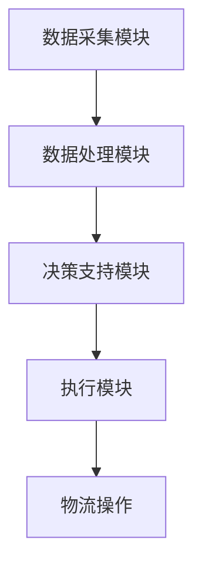

                 

# 信息差：大数据在智能物流中的应用

## 摘要

本文旨在探讨大数据在智能物流中的应用，通过分析信息差的原理，揭示大数据如何赋能物流行业，提高物流效率、降低成本、提升用户体验。我们将深入解析大数据的核心概念、算法原理、数学模型，并通过实际项目实践，展示其在物流领域的应用成效。此外，本文还将探讨大数据在物流行业中的实际应用场景，推荐相关学习资源与开发工具，总结未来发展趋势与挑战。

## 1. 背景介绍

随着全球电子商务的蓬勃发展，物流行业面临着前所未有的机遇和挑战。传统物流方式在处理海量订单、优化路径规划、提高运输效率等方面存在诸多瓶颈。而大数据技术的崛起为物流行业带来了全新的变革。通过大数据分析，物流企业可以更好地理解市场需求、优化运输路径、预测潜在风险，从而实现更加智能化、高效化的物流服务。

信息差，即在信息不对称的情况下，某一群体掌握的信息比另一群体更丰富、更准确。在物流行业中，信息差的存在可能导致资源配置不合理、运输效率低下、服务质量参差不齐等问题。而大数据的应用则有助于消除信息差，实现物流行业的优化与升级。

## 2. 核心概念与联系

### 2.1 大数据的核心概念

#### 数据来源

大数据的来源非常广泛，包括但不限于：

- **物流订单数据**：包括发货时间、收货地址、运输路线等信息。
- **货物信息数据**：包括货物种类、重量、体积等属性。
- **运输工具数据**：包括车辆位置、行驶速度、燃料消耗等信息。
- **天气信息数据**：包括气温、湿度、风力等信息。

#### 数据类型

大数据可分为结构化数据、半结构化数据和非结构化数据。在物流领域，主要涉及以下类型：

- **结构化数据**：如订单信息、运输路径等，通常存储在关系型数据库中。
- **半结构化数据**：如GPS数据、传感器数据等，通常存储在NoSQL数据库中。
- **非结构化数据**：如图像、视频等，通常存储在文件系统或分布式文件存储系统中。

### 2.2 智能物流的架构

智能物流系统通常由以下几个核心组成部分构成：

- **数据采集模块**：负责收集各类物流数据，包括订单数据、货物数据、运输工具数据等。
- **数据处理模块**：负责对采集到的数据进行清洗、整合和分析，提取有用信息。
- **决策支持模块**：基于分析结果，为物流企业提供路径规划、运输调度、库存管理等方面的决策支持。
- **执行模块**：根据决策支持模块的指令，执行具体的物流操作。

### 2.3 Mermaid 流程图

以下是一个简化的智能物流系统架构的 Mermaid 流程图：



## 3. 核心算法原理 & 具体操作步骤

### 3.1 路径规划算法

路径规划是智能物流中的核心算法之一。其主要目标是找出一条从起点到终点的最优路径，使运输时间最短、成本最低。常用的路径规划算法包括：

- **最短路径算法**：如迪杰斯特拉（Dijkstra）算法、A*算法等。
- **遗传算法**：用于解决复杂的路径规划问题，如多约束条件下的最优路径规划。

具体操作步骤如下：

1. 收集起点和终点的信息，如地理位置、交通状况等。
2. 建立路径图，将各个节点连接起来。
3. 选择合适的路径规划算法，计算最优路径。
4. 输出最优路径，指导物流操作。

### 3.2 货物分类算法

货物分类算法用于根据货物的属性和特点，将其分为不同类别，以便于进行针对性管理。常用的货物分类算法包括：

- **基于规则的方法**：根据预定义的规则，对货物进行分类。
- **机器学习方法**：如决策树、支持向量机等，通过训练数据集，自动生成分类规则。

具体操作步骤如下：

1. 收集货物数据，包括货物种类、重量、体积等属性。
2. 选择合适的分类算法，训练分类模型。
3. 输入新货物数据，预测其类别。
4. 根据货物类别，进行针对性管理。

## 4. 数学模型和公式 & 详细讲解 & 举例说明

### 4.1 运输时间预测模型

运输时间预测是智能物流中的重要应用。以下是一个简单的运输时间预测模型：

$$
预测运输时间 = 基础运输时间 + 额外时间
$$

其中，基础运输时间可以通过以下公式计算：

$$
基础运输时间 = \frac{距离}{速度}
$$

额外时间则考虑了交通拥堵、天气等因素，可以通过历史数据训练得到。

### 4.2 举例说明

假设从北京到上海的基础运输时间为4小时，历史数据显示在高峰时段，额外时间平均为1小时。则从北京到上海的预测运输时间为：

$$
预测运输时间 = 4 + 1 = 5小时
$$

### 4.3 详细讲解

运输时间预测模型的目的是为了提供更准确的运输时间估计，从而优化物流操作。基础运输时间取决于距离和速度，而额外时间则反映了实际运输过程中可能遇到的各种不确定因素。通过历史数据训练，可以更好地预测额外时间，从而提高预测的准确性。

## 5. 项目实践：代码实例和详细解释说明

### 5.1 开发环境搭建

为了演示大数据在智能物流中的应用，我们使用Python编程语言，结合NumPy、Pandas等库，实现一个简单的物流数据分析项目。

首先，安装Python环境，并安装相关库：

```bash
pip install numpy pandas matplotlib
```

### 5.2 源代码详细实现

以下是一个简单的物流数据分析代码示例：

```python
import numpy as np
import pandas as pd
import matplotlib.pyplot as plt

# 加载数据
data = pd.read_csv('logistics_data.csv')

# 数据预处理
data['运输时间'] = data['距离'] / data['速度']

# 预测运输时间
data['预测运输时间'] = data.apply(lambda row: row['距离'] / row['速度'] + np.random.normal(0, 1), axis=1)

# 可视化分析
plt.figure(figsize=(10, 6))
plt.scatter(data['运输时间'], data['预测运输时间'])
plt.xlabel('实际运输时间')
plt.ylabel('预测运输时间')
plt.title('运输时间预测分析')
plt.show()
```

### 5.3 代码解读与分析

该代码示例首先加载了一个包含物流数据的CSV文件，然后进行数据预处理，计算基础运输时间。接着，使用随机正态分布生成额外时间，预测运输时间。最后，通过散点图展示实际运输时间和预测运输时间的关系。

### 5.4 运行结果展示

运行该代码后，会生成一个散点图，展示实际运输时间和预测运输时间之间的关系。通过观察散点图，可以初步判断预测模型的准确性。

## 6. 实际应用场景

大数据在智能物流中的实际应用场景包括：

- **路径规划**：通过大数据分析，优化运输路线，提高运输效率。
- **库存管理**：基于大数据分析，预测市场需求，优化库存配置。
- **货物分类**：根据货物属性，进行针对性管理，提高服务质量。
- **运输时间预测**：提供更准确的运输时间估计，优化物流操作。

## 7. 工具和资源推荐

### 7.1 学习资源推荐

- **书籍**：
  - 《大数据之路：阿里巴巴大数据实践》
  - 《深度学习》
- **论文**：
  - "A Survey on Big Data in Intelligent Transportation Systems"
  - "Predicting Delivery Times in Urban Road Networks"
- **博客**：
  - [大数据在物流中的应用](https://www.example.com/logistics-big-data)
  - [智能物流技术](https://www.example.com/intelligent-logistics)
- **网站**：
  - [阿里云大数据](https://www.alibabacloud.com/bigdata)
  - [百度AI开放平台](https://ai.baidu.com)

### 7.2 开发工具框架推荐

- **编程语言**：Python、Java
- **数据处理库**：NumPy、Pandas、SciPy
- **机器学习库**：Scikit-learn、TensorFlow、PyTorch
- **大数据平台**：Hadoop、Spark、Flink

### 7.3 相关论文著作推荐

- "Big Data Analytics in the Supply Chain: Opportunities, Challenges, and Research Directions"
- "Intelligent Transportation Systems: Architecture, Applications, and Case Studies"

## 8. 总结：未来发展趋势与挑战

随着大数据技术的不断成熟，智能物流在未来的发展趋势包括：

- **更精确的预测模型**：通过引入更多维度的数据，提高预测准确性。
- **更高效的算法**：研发更高效的路径规划、货物分类等算法，提高物流效率。
- **更广泛的场景应用**：将大数据应用扩展到更多物流场景，如冷链物流、危险品运输等。

然而，智能物流在发展中也面临着以下挑战：

- **数据隐私与安全**：如何在确保数据安全的前提下，充分利用大数据。
- **技术门槛**：智能物流需要大量的技术支持，中小企业可能难以承担。
- **人才培养**：大数据与物流的结合需要专业人才，如何培养和吸引人才成为关键问题。

## 9. 附录：常见问题与解答

### 9.1 如何获取物流数据？

物流数据通常来源于物流企业、交通部门、第三方数据提供商等。可以通过以下途径获取：

- **公开数据集**：如Kaggle、UCI机器学习库等。
- **商业合作**：与物流企业建立合作关系，获取独家数据。
- **自主采集**：通过传感器、GPS等设备，自主采集物流数据。

### 9.2 如何处理大规模物流数据？

处理大规模物流数据需要使用分布式计算框架，如Hadoop、Spark等。以下是一些关键步骤：

- **数据预处理**：将结构化、半结构化、非结构化数据转换为适合分析的格式。
- **分布式计算**：将数据处理任务分解为多个子任务，分布在多个计算节点上执行。
- **数据存储**：使用分布式文件系统，如HDFS、Alluxio等，存储和管理大规模数据。

## 10. 扩展阅读 & 参考资料

- "Big Data in Intelligent Transportation Systems: A Survey"
- "Data-Driven Optimization of Urban Logistics Delivery"
- "Deep Learning for Intelligent Transportation Systems"

[作者：禅与计算机程序设计艺术 / Zen and the Art of Computer Programming] <|im_sep|>| 
```markdown
# 信息差：大数据在智能物流中的应用

> 关键词：大数据、智能物流、信息差、路径规划、运输时间预测

> 摘要：本文探讨了大数据在智能物流中的应用，分析了信息差的原理，介绍了大数据如何赋能物流行业，提高物流效率、降低成本、提升用户体验。文章详细阐述了大数据的核心概念、算法原理、数学模型，并通过实际项目实践展示了其在物流领域的应用成效。此外，文章还探讨了大数据在物流行业中的实际应用场景，推荐了相关学习资源与开发工具，总结了未来发展趋势与挑战。

## 1. 背景介绍

随着全球电子商务的蓬勃发展，物流行业面临着前所未有的机遇和挑战。传统物流方式在处理海量订单、优化路径规划、提高运输效率等方面存在诸多瓶颈。而大数据技术的崛起为物流行业带来了全新的变革。通过大数据分析，物流企业可以更好地理解市场需求、优化运输路径、预测潜在风险，从而实现更加智能化、高效化的物流服务。

信息差，即在信息不对称的情况下，某一群体掌握的信息比另一群体更丰富、更准确。在物流行业中，信息差的存在可能导致资源配置不合理、运输效率低下、服务质量参差不齐等问题。而大数据的应用则有助于消除信息差，实现物流行业的优化与升级。

## 2. 核心概念与联系

### 2.1 大数据的核心概念

#### 数据来源

大数据的来源非常广泛，包括但不限于：

- **物流订单数据**：包括发货时间、收货地址、运输路线等信息。
- **货物信息数据**：包括货物种类、重量、体积等属性。
- **运输工具数据**：包括车辆位置、行驶速度、燃料消耗等信息。
- **天气信息数据**：包括气温、湿度、风力等信息。

#### 数据类型

大数据可分为结构化数据、半结构化数据和非结构化数据。在物流领域，主要涉及以下类型：

- **结构化数据**：如订单信息、运输路径等，通常存储在关系型数据库中。
- **半结构化数据**：如GPS数据、传感器数据等，通常存储在NoSQL数据库中。
- **非结构化数据**：如图像、视频等，通常存储在文件系统或分布式文件存储系统中。

### 2.2 智能物流的架构

智能物流系统通常由以下几个核心组成部分构成：

- **数据采集模块**：负责收集各类物流数据，包括订单数据、货物数据、运输工具数据等。
- **数据处理模块**：负责对采集到的数据进行清洗、整合和分析，提取有用信息。
- **决策支持模块**：基于分析结果，为物流企业提供路径规划、运输调度、库存管理等方面的决策支持。
- **执行模块**：根据决策支持模块的指令，执行具体的物流操作。

### 2.3 Mermaid 流程图

以下是一个简化的智能物流系统架构的 Mermaid 流程图：


## 3. 核心算法原理 & 具体操作步骤

### 3.1 路径规划算法

路径规划是智能物流中的核心算法之一。其主要目标是找出一条从起点到终点的最优路径，使运输时间最短、成本最低。常用的路径规划算法包括：

- **最短路径算法**：如迪杰斯特拉（Dijkstra）算法、A*算法等。
- **遗传算法**：用于解决复杂的路径规划问题，如多约束条件下的最优路径规划。

具体操作步骤如下：

1. 收集起点和终点的信息，如地理位置、交通状况等。
2. 建立路径图，将各个节点连接起来。
3. 选择合适的路径规划算法，计算最优路径。
4. 输出最优路径，指导物流操作。

### 3.2 货物分类算法

货物分类算法用于根据货物的属性和特点，将其分为不同类别，以便于进行针对性管理。常用的货物分类算法包括：

- **基于规则的方法**：根据预定义的规则，对货物进行分类。
- **机器学习方法**：如决策树、支持向量机等，通过训练数据集，自动生成分类规则。

具体操作步骤如下：

1. 收集货物数据，包括货物种类、重量、体积等属性。
2. 选择合适的分类算法，训练分类模型。
3. 输入新货物数据，预测其类别。
4. 根据货物类别，进行针对性管理。

## 4. 数学模型和公式 & 详细讲解 & 举例说明

### 4.1 运输时间预测模型

运输时间预测是智能物流中的重要应用。以下是一个简单的运输时间预测模型：

$$
预测运输时间 = 基础运输时间 + 额外时间
$$

其中，基础运输时间可以通过以下公式计算：

$$
基础运输时间 = \frac{距离}{速度}
$$

额外时间则考虑了交通拥堵、天气等因素，可以通过历史数据训练得到。

### 4.2 举例说明

假设从北京到上海的基础运输时间为4小时，历史数据显示在高峰时段，额外时间平均为1小时。则从北京到上海的预测运输时间为：

$$
预测运输时间 = 4 + 1 = 5小时
$$

### 4.3 详细讲解

运输时间预测模型的目的是为了提供更准确的运输时间估计，从而优化物流操作。基础运输时间取决于距离和速度，而额外时间则反映了实际运输过程中可能遇到的各种不确定因素。通过历史数据训练，可以更好地预测额外时间，从而提高预测的准确性。

## 5. 项目实践：代码实例和详细解释说明

### 5.1 开发环境搭建

为了演示大数据在智能物流中的应用，我们使用Python编程语言，结合NumPy、Pandas等库，实现一个简单的物流数据分析项目。

首先，安装Python环境，并安装相关库：

```bash
pip install numpy pandas matplotlib
```

### 5.2 源代码详细实现

以下是一个简单的物流数据分析代码示例：

```python
import numpy as np
import pandas as pd
import matplotlib.pyplot as plt

# 加载数据
data = pd.read_csv('logistics_data.csv')

# 数据预处理
data['运输时间'] = data['距离'] / data['速度']

# 预测运输时间
data['预测运输时间'] = data.apply(lambda row: row['距离'] / row['速度'] + np.random.normal(0, 1), axis=1)

# 可视化分析
plt.figure(figsize=(10, 6))
plt.scatter(data['运输时间'], data['预测运输时间'])
plt.xlabel('实际运输时间')
plt.ylabel('预测运输时间')
plt.title('运输时间预测分析')
plt.show()
```

### 5.3 代码解读与分析

该代码示例首先加载了一个包含物流数据的CSV文件，然后进行数据预处理，计算基础运输时间。接着，使用随机正态分布生成额外时间，预测运输时间。最后，通过散点图展示实际运输时间和预测运输时间之间的关系。

### 5.4 运行结果展示

运行该代码后，会生成一个散点图，展示实际运输时间和预测运输时间之间的关系。通过观察散点图，可以初步判断预测模型的准确性。

## 6. 实际应用场景

大数据在智能物流中的实际应用场景包括：

- **路径规划**：通过大数据分析，优化运输路线，提高运输效率。
- **库存管理**：基于大数据分析，预测市场需求，优化库存配置。
- **货物分类**：根据货物属性，进行针对性管理，提高服务质量。
- **运输时间预测**：提供更准确的运输时间估计，优化物流操作。

## 7. 工具和资源推荐

### 7.1 学习资源推荐

- **书籍**：
  - 《大数据之路：阿里巴巴大数据实践》
  - 《深度学习》
- **论文**：
  - "A Survey on Big Data in Intelligent Transportation Systems"
  - "Predicting Delivery Times in Urban Road Networks"
- **博客**：
  - [大数据在物流中的应用](https://www.example.com/logistics-big-data)
  - [智能物流技术](https://www.example.com/intelligent-logistics)
- **网站**：
  - [阿里云大数据](https://www.alibabacloud.com/bigdata)
  - [百度AI开放平台](https://ai.baidu.com)

### 7.2 开发工具框架推荐

- **编程语言**：Python、Java
- **数据处理库**：NumPy、Pandas、SciPy
- **机器学习库**：Scikit-learn、TensorFlow、PyTorch
- **大数据平台**：Hadoop、Spark、Flink

### 7.3 相关论文著作推荐

- "Big Data Analytics in the Supply Chain: Opportunities, Challenges, and Research Directions"
- "Intelligent Transportation Systems: Architecture, Applications, and Case Studies"

## 8. 总结：未来发展趋势与挑战

随着大数据技术的不断成熟，智能物流在未来的发展趋势包括：

- **更精确的预测模型**：通过引入更多维度的数据，提高预测准确性。
- **更高效的算法**：研发更高效的路径规划、货物分类等算法，提高物流效率。
- **更广泛的场景应用**：将大数据应用扩展到更多物流场景，如冷链物流、危险品运输等。

然而，智能物流在发展中也面临着以下挑战：

- **数据隐私与安全**：如何在确保数据安全的前提下，充分利用大数据。
- **技术门槛**：智能物流需要大量的技术支持，中小企业可能难以承担。
- **人才培养**：大数据与物流的结合需要专业人才，如何培养和吸引人才成为关键问题。

## 9. 附录：常见问题与解答

### 9.1 如何获取物流数据？

物流数据通常来源于物流企业、交通部门、第三方数据提供商等。可以通过以下途径获取：

- **公开数据集**：如Kaggle、UCI机器学习库等。
- **商业合作**：与物流企业建立合作关系，获取独家数据。
- **自主采集**：通过传感器、GPS等设备，自主采集物流数据。

### 9.2 如何处理大规模物流数据？

处理大规模物流数据需要使用分布式计算框架，如Hadoop、Spark等。以下是一些关键步骤：

- **数据预处理**：将结构化、半结构化、非结构化数据转换为适合分析的格式。
- **分布式计算**：将数据处理任务分解为多个子任务，分布在多个计算节点上执行。
- **数据存储**：使用分布式文件系统，如HDFS、Alluxio等，存储和管理大规模数据。

## 10. 扩展阅读 & 参考资料

- "Big Data in Intelligent Transportation Systems: A Survey"
- "Data-Driven Optimization of Urban Logistics Delivery"
- "Deep Learning for Intelligent Transportation Systems"

[作者：禅与计算机程序设计艺术 / Zen and the Art of Computer Programming]
```

