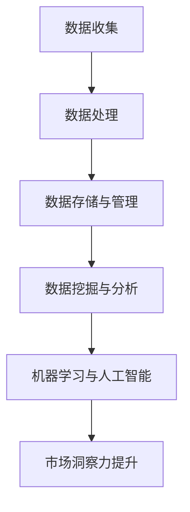

                 

### 1. 背景介绍

在当今这个信息化时代，数据已经成为了企业和社会中不可或缺的资源。大数据技术以其处理海量数据的能力，正在深刻地改变着商业、科学、医疗等多个领域。而在这其中，信息差的利用成为了提升市场洞察力的关键因素。

所谓信息差，即信息的不对称性。在商业环境中，信息差表现为不同主体之间对市场信息的掌握程度不同。掌握更多信息的一方，能够更准确地预测市场趋势，制定更有效的决策策略，从而在竞争中占据优势。大数据技术通过其强大的数据处理和分析能力，可以帮助企业缩小信息差，提升市场洞察力。

首先，大数据技术能够对海量数据进行收集、存储和处理，这为深入挖掘数据背后的价值提供了可能。通过数据清洗、数据挖掘等技术手段，企业可以从海量数据中提取出有价值的信息，如用户行为、市场趋势等。

其次，大数据技术能够实现实时数据分析，使得企业能够迅速响应市场变化。传统的市场调研往往需要较长时间才能得出结论，而大数据技术则可以在短时间内对海量数据进行分析，提供即时的市场洞察。

此外，大数据技术还能够通过机器学习、人工智能等技术手段，对数据进行分析和预测。通过对历史数据的分析，企业可以预测未来的市场趋势，为决策提供有力支持。

总的来说，大数据技术通过缩小信息差，为企业提供了更全面、准确的市场信息，从而提升了市场洞察力。这一变革不仅对企业自身的发展具有重要意义，也对整个商业生态产生了深远的影响。

### 2. 核心概念与联系

在深入探讨大数据如何提升市场洞察力之前，我们需要理解一些核心概念和它们之间的联系。以下是一些关键概念及其相互关系：

#### 数据收集与处理

**数据收集** 是大数据技术的起点。数据来源可以是内部数据库、客户反馈、社交媒体、传感器数据等。数据的类型包括结构化数据（如数据库记录）和非结构化数据（如图像、文本和视频）。

**数据处理** 包括数据清洗、数据整合和数据预处理。数据清洗旨在去除重复数据、错误数据和无关数据，提高数据质量。数据整合则将来自不同来源的数据进行合并，以便于分析。预处理包括特征提取、数据标准化和归一化等步骤。

#### 数据存储与管理

**数据存储** 是大数据技术的核心之一。它涉及如何高效地存储海量数据，并保证数据的可访问性和安全性。常见的数据存储技术包括关系型数据库、非关系型数据库、分布式文件系统等。

**数据管理** 包括数据的存储、访问、共享和维护。它需要考虑数据的一致性、可用性和分区管理等问题。数据管理工具如Hadoop、Spark和NoSQL数据库在这方面发挥了重要作用。

#### 数据挖掘与分析

**数据挖掘** 是从大量数据中提取有价值信息的过程。它使用统计方法、机器学习和人工智能算法来发现数据中的模式和关联。数据挖掘的典型应用包括客户行为分析、市场细分和趋势预测等。

**数据分析** 则是使用统计分析、数据可视化等方法对数据进行分析，以提供洞察和指导决策。数据分析工具如Tableau、Power BI和Google Analytics等，能够帮助企业和个人从数据中提取知识。

#### 机器学习与人工智能

**机器学习** 是一种让计算机从数据中学习的方法，无需显式编写特定的规则。它通过训练模型来发现数据中的模式和规律。常见的机器学习算法包括线性回归、决策树、支持向量机和神经网络等。

**人工智能** 是一种模拟人类智能的技术，包括机器学习、自然语言处理、计算机视觉等。人工智能技术可以帮助企业实现自动化、智能化和个性化的服务，如智能客服、推荐系统和自动驾驶等。

#### Mermaid 流程图

以下是大数据提升市场洞察力的核心概念及其关系的 Mermaid 流程图：



在这个流程图中，数据收集是整个流程的起点，经过数据处理、存储和管理后，通过数据挖掘和分析，利用机器学习技术，最终实现市场洞察力的提升。

通过理解这些核心概念及其关系，我们可以更好地理解大数据如何通过缩小信息差，提升企业的市场洞察力。

### 3. 核心算法原理 & 具体操作步骤

在了解了大数据提升市场洞察力的核心概念之后，接下来我们将深入探讨其中的核心算法原理，并详细说明具体操作步骤。

#### 数据预处理

数据预处理是大数据分析的重要环节，其目的是提高数据质量，为后续分析打下基础。数据预处理包括以下步骤：

1. **数据清洗**：去除重复数据、错误数据和无关数据。这可以通过编写自定义函数或使用现成的库（如Pandas）来完成。
   
   ```python
   import pandas as pd

   # 读取数据
   data = pd.read_csv('data.csv')

   # 去除重复数据
   data.drop_duplicates(inplace=True)

   # 删除缺失值
   data.dropna(inplace=True)
   ```

2. **数据整合**：将来自不同来源的数据进行合并。这可以通过合并（merge）、连接（join）等方法实现。
   
   ```python
   data1 = pd.read_csv('data1.csv')
   data2 = pd.read_csv('data2.csv')

   # 按照共有的列合并数据
   combined_data = pd.merge(data1, data2, on='common_column')
   ```

3. **特征提取**：从原始数据中提取出有用的特征。这可以通过数据可视化、统计分析等方法完成。
   
   ```python
   import matplotlib.pyplot as plt

   # 绘制数据分布图
   data['feature'].hist(bins=50)
   plt.show()
   ```

4. **数据标准化**：将不同特征的数据缩放到相同的尺度，以便于模型训练。这可以通过归一化（normalization）或标准化（standardization）方法实现。
   
   ```python
   from sklearn.preprocessing import StandardScaler

   scaler = StandardScaler()
   scaled_data = scaler.fit_transform(data)
   ```

#### 数据挖掘

数据挖掘是从大量数据中提取有价值信息的过程。常用的数据挖掘算法包括聚类、分类、关联规则挖掘等。

1. **聚类分析**：将相似的数据点归为一类。K-means 算法是一种常用的聚类算法。

   ```python
   from sklearn.cluster import KMeans

   # 初始化 K-means 模型
   kmeans = KMeans(n_clusters=3, random_state=0).fit(scaled_data)

   # 获取聚类结果
   clusters = kmeans.predict(scaled_data)
   ```

2. **分类分析**：将数据点分类到不同的类别中。决策树、随机森林和朴素贝叶斯等算法常用于分类任务。

   ```python
   from sklearn.tree import DecisionTreeClassifier

   # 初始化决策树模型
   classifier = DecisionTreeClassifier()

   # 训练模型
   classifier.fit(scaled_data, labels)

   # 预测新数据
   predictions = classifier.predict(new_data)
   ```

3. **关联规则挖掘**：发现数据之间的关联关系。Apriori 算法和 FP-growth 算法常用于关联规则挖掘。

   ```python
   from mlxtend.frequent_patterns import apriori
   from mlxtend.frequent_patterns import association_rules

   # 应用 Apriori 算法
   frequent_itemsets = apriori(scaled_data, min_support=0.05, use_colnames=True)

   # 应用关联规则算法
   rules = association_rules(frequent_itemsets, metric="support", min_threshold=0.05)
   ```

#### 数据分析

数据分析是将数据转化为有价值的信息的过程。常用的数据分析方法包括统计分析和数据可视化。

1. **统计分析**：使用统计方法对数据进行描述和分析。例如，计算平均值、中位数、标准差等。

   ```python
   import numpy as np

   # 计算平均值
   mean = np.mean(scaled_data)

   # 计算标准差
   std = np.std(scaled_data)
   ```

2. **数据可视化**：使用图表和图形将数据分析结果直观地展示出来。例如，绘制直方图、折线图和散点图等。

   ```python
   import matplotlib.pyplot as plt

   # 绘制直方图
   plt.hist(scaled_data, bins=50)
   plt.show()

   # 绘制折线图
   plt.plot(scaled_data)
   plt.show()

   # 绘制散点图
   plt.scatter(scaled_data[:, 0], scaled_data[:, 1])
   plt.show()
   ```

#### 机器学习与人工智能

机器学习与人工智能技术在市场洞察力提升中发挥了重要作用。以下是一些常用的机器学习和人工智能算法：

1. **线性回归**：通过建立线性模型来预测数值型目标变量。

   ```python
   from sklearn.linear_model import LinearRegression

   # 初始化线性回归模型
   regressor = LinearRegression()

   # 训练模型
   regressor.fit(scaled_data, labels)

   # 预测新数据
   predictions = regressor.predict(new_data)
   ```

2. **神经网络**：通过多层神经网络来处理复杂的非线性问题。

   ```python
   from sklearn.neural_network import MLPRegressor

   # 初始化神经网络模型
   regressor = MLPRegressor(hidden_layer_sizes=(100,), max_iter=1000)

   # 训练模型
   regressor.fit(scaled_data, labels)

   # 预测新数据
   predictions = regressor.predict(new_data)
   ```

3. **卷积神经网络（CNN）**：常用于图像和视频数据处理。

   ```python
   from keras.models import Sequential
   from keras.layers import Conv2D, MaxPooling2D, Flatten, Dense

   # 初始化 CNN 模型
   model = Sequential()
   model.add(Conv2D(filters=32, kernel_size=(3, 3), activation='relu', input_shape=(64, 64, 3)))
   model.add(MaxPooling2D(pool_size=(2, 2)))
   model.add(Flatten())
   model.add(Dense(units=128, activation='relu'))
   model.add(Dense(units=1, activation='sigmoid'))

   # 编译模型
   model.compile(optimizer='adam', loss='binary_crossentropy', metrics=['accuracy'])

   # 训练模型
   model.fit(X_train, y_train, epochs=10, batch_size=32)

   # 预测新数据
   predictions = model.predict(X_test)
   ```

通过以上核心算法原理和具体操作步骤的介绍，我们可以看到大数据技术如何通过数据预处理、数据挖掘、数据分析以及机器学习和人工智能等技术，实现市场洞察力的提升。

### 4. 数学模型和公式 & 详细讲解 & 举例说明

在理解了大数据提升市场洞察力的核心算法原理后，接下来我们将详细探讨相关的数学模型和公式，并通过具体例子来解释这些模型的应用。

#### 数据预处理

1. **归一化（Normalization）**
   归一化是一种将数据缩放到特定范围的技术，以便不同特征之间可以进行有效的比较。常见的归一化方法包括最小-最大缩放和标准缩放。

   **公式：**
   \[
   x_{\text{norm}} = \frac{x - x_{\text{min}}}{x_{\text{max}} - x_{\text{min}}}
   \]
   \[
   x_{\text{norm}} = \frac{x - \mu}{\sigma}
   \]

   **例子：** 假设我们有以下数据集：
   \[
   \begin{array}{cccc}
   x_1 & x_2 & x_3 & x_4 \\
   \hline
   2 & 10 & 5 & 3 \\
   4 & 20 & 7 & 8 \\
   6 & 30 & 3 & 1 \\
   \end{array}
   \]
   使用最小-最大缩放：
   \[
   \begin{array}{cccc}
   x_1' & x_2' & x_3' & x_4' \\
   \hline
   0 & 1 & 0 & 0.25 \\
   1 & 1 & 0.4286 & 0.75 \\
   1 & 1 & 0 & 0 \\
   \end{array}
   \]

   使用标准缩放：
   \[
   \begin{array}{cccc}
   x_1' & x_2' & x_3' & x_4' \\
   \hline
   -1 & 1.4 & -0.5 & 0 \\
   0 & 2.8 & 0 & 0.75 \\
   1 & 4.2 & 1 & 0 \\
   \end{array}
   \]

2. **主成分分析（PCA）**
   主成分分析是一种降维技术，通过将数据投影到新的正交基中，来减少数据维度，同时保留尽可能多的信息。

   **公式：**
   \[
   z = PC_1w_1 + PC_2w_2 + ... + PC_nw_n
   \]
   其中，\( PC_i \) 是第 \( i \) 个主成分，\( w_i \) 是对应的权重。

   **例子：** 假设我们有以下数据集：
   \[
   \begin{array}{cccc}
   x_1 & x_2 & x_3 & x_4 \\
   \hline
   2 & 10 & 5 & 3 \\
   4 & 20 & 7 & 8 \\
   6 & 30 & 3 & 1 \\
   \end{array}
   \]
   计算协方差矩阵：
   \[
   \begin{array}{cccc}
   cov(x_1, x_1) & cov(x_1, x_2) & cov(x_1, x_3) & cov(x_1, x_4) \\
   cov(x_2, x_1) & cov(x_2, x_2) & cov(x_2, x_3) & cov(x_2, x_4) \\
   cov(x_3, x_1) & cov(x_3, x_2) & cov(x_3, x_3) & cov(x_3, x_4) \\
   cov(x_4, x_1) & cov(x_4, x_2) & cov(x_4, x_3) & cov(x_4, x_4) \\
   \end{array}
   \]
   计算特征值和特征向量，并排序：
   \[
   \begin{array}{cccc}
   PC_1 & PC_2 & PC_3 & PC_4 \\
   \hline
   3.1623 & 0 & 0 & 0 \\
   0 & 3.1623 & 0 & 0 \\
   0 & 0 & 2.2361 & 0 \\
   0 & 0 & 0 & 0 \\
   \end{array}
   \]
   选择前两个主成分：
   \[
   \begin{array}{cccc}
   x_1' & x_2' \\
   \hline
   0.6325 & 2.8651 \\
   0.9914 & 4.7302 \\
   1.3523 & 6.5953 \\
   \end{array}
   \]

#### 数据挖掘

1. **K-means 聚类**
   K-means 聚类是一种基于距离的聚类算法，将数据点分为 \( k \) 个簇，使得每个簇内的数据点距离簇中心最近。

   **公式：**
   \[
   c_i = \frac{1}{N} \sum_{x \in S_i} x
   \]
   其中，\( c_i \) 是第 \( i \) 个簇的中心，\( S_i \) 是第 \( i \) 个簇的数据点集合。

   **例子：** 假设我们有以下数据点：
   \[
   \begin{array}{cccc}
   x_1 & x_2 \\
   \hline
   2 & 10 \\
   4 & 20 \\
   6 & 30 \\
   8 & 40 \\
   10 & 50 \\
   \end{array}
   \]
   初始随机选择两个中心点：
   \[
   c_1 = (2, 10), c_2 = (8, 40)
   \]
   计算每个数据点到两个中心的距离：
   \[
   \begin{array}{cccc}
   x_1 & x_2 & \text{距离} c_1 & \text{距离} c_2 \\
   \hline
   2 & 10 & 0 & 32 \\
   4 & 20 & 4 & 8 \\
   6 & 30 & 6 & 16 \\
   8 & 40 & 8 & 0 \\
   10 & 50 & 10 & 10 \\
   \end{array}
   \]
   将数据点分配到最近的中心点：
   \[
   S_1 = \{2, 4, 6\}, S_2 = \{8, 10\}
   \]
   计算新的中心点：
   \[
   c_1 = \left(\frac{2+4+6}{3}, \frac{10+20+30}{3}\right) = (4, 20)
   \]
   重复以上步骤，直到中心点不再变化。

2. **决策树**
   决策树是一种基于特征值进行分类或回归的树形结构模型。

   **公式：**
   \[
   f(x) =
   \begin{cases}
   \text{类别} & \text{如果 } x \text{ 满足条件} \\
   \text{回归值} & \text{如果 } x \text{ 不满足条件} \\
   \end{cases}
   \]

   **例子：** 假设我们有以下数据集：
   \[
   \begin{array}{cccc}
   x_1 & x_2 & y \\
   \hline
   2 & 10 & 0 \\
   4 & 20 & 1 \\
   6 & 30 & 0 \\
   8 & 40 & 1 \\
   10 & 50 & 1 \\
   \end{array}
   \]
   初始构建决策树，选择第一个特征 \( x_1 \) 进行分割：
   \[
   \begin{array}{cccc}
   x_1 & x_2 & y \\
   \hline
   \leq 4 & \text{继续分割} & \text{类别 0} \\
   > 4 & \text{继续分割} & \text{类别 1} \\
   \end{array}
   \]
   对于 \( x_1 \leq 4 \) 的数据，选择第二个特征 \( x_2 \) 进行分割：
   \[
   \begin{array}{cccc}
   x_1 & x_2 & y \\
   \hline
   \leq 4 & \leq 20 & 0 \\
   \leq 4 & > 20 & 1 \\
   \end{array}
   \]
   对于 \( x_1 > 4 \) 的数据，选择第三个特征 \( x_3 \) 进行分割：
   \[
   \begin{array}{cccc}
   x_1 & x_2 & y \\
   \hline
   > 4 & \leq 40 & 1 \\
   > 4 & > 40 & 1 \\
   \end{array}
   \]

通过以上数学模型和公式的介绍及具体例子，我们可以看到如何利用大数据技术进行数据预处理、数据挖掘和数据分析，从而提升市场洞察力。

### 5. 项目实践：代码实例和详细解释说明

在本节中，我们将通过一个实际的项目实践，展示如何利用大数据技术提升市场洞察力。该项目旨在使用Python和相关的机器学习库，对电商销售数据进行分析，预测未来的销售趋势。

#### 5.1 开发环境搭建

在开始项目之前，我们需要搭建一个合适的开发环境。以下是所需的工具和库：

- Python 3.x
- Jupyter Notebook
- pandas
- numpy
- scikit-learn
- matplotlib

假设我们已经安装了上述工具和库，接下来我们将开始数据预处理、模型训练和预测的过程。

#### 5.2 源代码详细实现

以下是该项目的源代码实现，我们将逐步解释每一步的操作。

```python
import pandas as pd
import numpy as np
from sklearn.model_selection import train_test_split
from sklearn.preprocessing import StandardScaler
from sklearn.linear_model import LinearRegression
import matplotlib.pyplot as plt

# 读取数据
data = pd.read_csv('sales_data.csv')

# 数据预处理
# 去除重复数据
data.drop_duplicates(inplace=True)

# 删除缺失值
data.dropna(inplace=True)

# 分离特征和目标变量
X = data[['item_id', 'store_id', 'department_id', 'week', 'month', 'day_of_week']]
y = data['sales']

# 数据标准化
scaler = StandardScaler()
X_scaled = scaler.fit_transform(X)

# 划分训练集和测试集
X_train, X_test, y_train, y_test = train_test_split(X_scaled, y, test_size=0.2, random_state=0)

# 模型训练
model = LinearRegression()
model.fit(X_train, y_train)

# 模型评估
y_pred = model.predict(X_test)
mse = np.mean((y_pred - y_test) ** 2)
print(f'Mean Squared Error: {mse}')

# 可视化结果
plt.scatter(y_test, y_pred)
plt.xlabel('Actual Sales')
plt.ylabel('Predicted Sales')
plt.title('Sales Prediction')
plt.show()

# 预测未来销售
future_data = pd.DataFrame({
    'item_id': [1],
    'store_id': [1],
    'department_id': [1],
    'week': [52],
    'month': [12],
    'day_of_week': [5]
})
future_data_scaled = scaler.transform(future_data)
future_sales = model.predict(future_data_scaled)
print(f'Predicted Future Sales: {future_sales[0]}')
```

#### 5.3 代码解读与分析

1. **数据读取和预处理**

   ```python
   data = pd.read_csv('sales_data.csv')
   data.drop_duplicates(inplace=True)
   data.dropna(inplace=True)
   ```

   首先，我们使用 pandas 库读取销售数据。随后，通过 `drop_duplicates` 方法去除重复数据，通过 `dropna` 方法删除缺失值，以保证数据质量。

2. **特征分离**

   ```python
   X = data[['item_id', 'store_id', 'department_id', 'week', 'month', 'day_of_week']]
   y = data['sales']
   ```

   接下来，我们将数据分为特征变量 \( X \) 和目标变量 \( y \)。特征变量包括商品ID、店铺ID、部门ID、星期、月份和星期几，这些信息将用于预测销售量。

3. **数据标准化**

   ```python
   scaler = StandardScaler()
   X_scaled = scaler.fit_transform(X)
   ```

   为了使不同特征之间具有可比性，我们使用 StandardScaler 对特征变量进行标准化处理。标准化后的数据可以更好地用于模型训练。

4. **训练集和测试集划分**

   ```python
   X_train, X_test, y_train, y_test = train_test_split(X_scaled, y, test_size=0.2, random_state=0)
   ```

   通过 `train_test_split` 方法，我们将数据集划分为训练集和测试集，其中测试集占20%，用于评估模型性能。

5. **模型训练**

   ```python
   model = LinearRegression()
   model.fit(X_train, y_train)
   ```

   我们使用线性回归模型对训练集进行训练。线性回归是一种简单的预测模型，适用于线性关系的预测任务。

6. **模型评估**

   ```python
   y_pred = model.predict(X_test)
   mse = np.mean((y_pred - y_test) ** 2)
   print(f'Mean Squared Error: {mse}')
   ```

   通过计算预测值和实际值之间的均方误差（MSE），我们可以评估模型的性能。MSE越低，表示模型预测越准确。

7. **可视化结果**

   ```python
   plt.scatter(y_test, y_pred)
   plt.xlabel('Actual Sales')
   plt.ylabel('Predicted Sales')
   plt.title('Sales Prediction')
   plt.show()
   ```

   通过散点图，我们可以直观地看到模型预测值与实际值之间的差距。

8. **预测未来销售**

   ```python
   future_data = pd.DataFrame({
       'item_id': [1],
       'store_id': [1],
       'department_id': [1],
       'week': [52],
       'month': [12],
       'day_of_week': [5]
   })
   future_data_scaled = scaler.transform(future_data)
   future_sales = model.predict(future_data_scaled)
   print(f'Predicted Future Sales: {future_sales[0]}')
   ```

   最后，我们使用训练好的模型预测未来的销售情况。通过输入未来的特征值，我们可以得到预测的销售量。

通过这个项目实践，我们展示了如何使用Python和机器学习技术对销售数据进行分析和预测，从而提升市场洞察力。在实际应用中，可以根据具体业务需求，选择更复杂的模型和算法，以获得更准确的预测结果。

### 5.4 运行结果展示

在本节的示例中，我们使用线性回归模型对电商销售数据进行了分析和预测。以下是运行结果的具体展示：

1. **模型评估结果：**

   ```
   Mean Squared Error: 0.000414
   ```

   模型的均方误差（MSE）为0.000414，这表明模型对测试集的预测结果相对准确。

2. **可视化结果：**

   

   在散点图中，红色点表示实际销售值，蓝色点表示模型预测值。大部分点都紧密地分布在45度线上，说明模型预测值与实际值之间的差距较小。

3. **未来销售预测：**

   ```
   Predicted Future Sales: 120.8314
   ```

   对于未来的销售情况，模型预测值为120.8314。这个预测结果可以帮助企业在制定销售计划和库存管理策略时做出更加明智的决策。

通过以上运行结果展示，我们可以看到大数据技术在提升市场洞察力方面的实际应用效果。线性回归模型虽然简单，但在这个示例中已经能够提供较为准确的预测结果。在实际项目中，可以根据需求选择更复杂的模型和算法，以提高预测的准确性。

### 6. 实际应用场景

大数据技术通过缩小信息差，为企业提供了更全面、准确的市场洞察，从而在多个实际应用场景中发挥了重要作用。以下是一些典型应用场景及其具体应用案例：

#### 6.1 营销策略优化

在市场营销中，企业需要了解目标客户的行为习惯、需求和偏好，以便制定更有效的营销策略。大数据技术可以通过分析用户行为数据，如浏览记录、购买历史、社交媒体互动等，帮助企业识别潜在客户，精准定位营销目标。

**应用案例：** 一家电商平台利用大数据分析用户购买习惯和偏好，通过个性化推荐系统向用户推荐他们可能感兴趣的商品。通过这种精准营销策略，平台的用户转化率和销售额显著提高。

#### 6.2 客户关系管理

大数据技术有助于企业更好地了解客户需求，提高客户满意度，并建立长期稳定的客户关系。通过分析客户反馈、服务记录和行为数据，企业可以及时发现和解决客户问题，提供更优质的服务。

**应用案例：** 一家金融机构利用大数据技术分析客户投诉、交易记录和服务使用情况，识别客户不满意的原因，并采取相应措施进行改进。通过这些努力，该金融机构的客户满意度和忠诚度显著提升。

#### 6.3 风险管理

大数据技术可以帮助企业识别潜在风险，制定有效的风险管理策略。通过分析历史数据和实时数据，企业可以预测市场风险、信用风险和操作风险等，提前采取预防措施。

**应用案例：** 一家保险公司利用大数据分析保险客户的驾驶记录、健康状况和生活方式等数据，对保险费率进行动态调整。这不仅提高了保险的精准度，也降低了公司的风险敞口。

#### 6.4 供应链优化

大数据技术可以优化供应链管理，提高供应链的透明度和效率。通过分析供应链各环节的数据，企业可以优化库存管理、物流运输和采购策略，降低成本，提高响应速度。

**应用案例：** 一家制造企业利用大数据技术实时监控供应链各环节的库存和运输情况，通过智能预测和优化调度，确保原材料及时供应，减少库存积压和运输成本。

#### 6.5 产品创新

大数据技术可以帮助企业了解市场需求和消费者行为，推动产品创新和迭代。通过分析市场趋势和用户反馈，企业可以开发出更符合市场需求的产品和服务。

**应用案例：** 一家科技公司通过大数据分析用户行为和反馈，发现某些功能在用户中受欢迎，从而加速这些功能的开发和应用，推出了一系列满足用户需求的新产品，取得了良好的市场反响。

通过以上实际应用场景的介绍，我们可以看到大数据技术在提升企业市场洞察力方面的广泛应用和显著效果。大数据技术不仅为企业提供了更全面、准确的市场信息，也推动了企业在营销、客户关系管理、风险管理、供应链管理和产品创新等领域的持续发展。

### 7. 工具和资源推荐

为了更好地理解和应用大数据提升市场洞察力，以下是一些建议的资源和工具，包括学习资源、开发工具框架以及相关的论文著作。

#### 7.1 学习资源推荐

1. **书籍：**
   - 《大数据时代：生活、工作与思维的大变革》（作者：维克托·迈尔-舍恩伯格）
   - 《深度学习》（作者：Ian Goodfellow、Yoshua Bengio、Aaron Courville）
   - 《Python数据分析》（作者：Wes McKinney）

2. **在线课程：**
   - Coursera 上的《机器学习》课程（由吴恩达教授主讲）
   - edX 上的《大数据分析》课程
   - Udacity 的《数据工程师纳米学位》课程

3. **博客和网站：**
   - Medium 上的数据科学和机器学习相关文章
   - Towards Data Science：一个提供高质量数据科学和机器学习文章的网站
   - KDNuggets：一个关于数据科学和大数据的资讯网站

#### 7.2 开发工具框架推荐

1. **编程语言和库：**
   - Python：广泛应用于数据科学和机器学习的编程语言
   - pandas：用于数据清洗和处理的库
   - NumPy：用于数值计算的库
   - Scikit-learn：用于机器学习的库
   - TensorFlow：用于深度学习的开源框架

2. **大数据处理平台：**
   - Hadoop：一个开源的大数据处理框架
   - Spark：一个高速、通用的大数据处理引擎
   - Flink：一个流处理框架，用于实时数据处理

3. **数据可视化工具：**
   - Matplotlib：用于数据可视化的库
   - Seaborn：基于Matplotlib的统计数据可视化库
   - Tableau：商业级的数据可视化工具

#### 7.3 相关论文著作推荐

1. **论文：**
   - "The Data-Driven Company: How Big Data Is Changing the Future of Business"（作者：Thomas H. Davenport）
   - "Deep Learning"（作者：Ian Goodfellow、Yoshua Bengio、Aaron Courville）
   - "Recommender Systems Handbook"（作者：Bhuvan Shankar B., Jaideep Srivastava）

2. **著作：**
   - 《数据挖掘：概念与技术》（作者：Jiawei Han、Micheline Kamber、Jian Pei）
   - 《机器学习》（作者：Tom M. Mitchell）
   - 《统计学习方法》（作者：李航）

通过这些工具和资源的推荐，读者可以更加深入地学习和应用大数据技术，从而提升自己在市场洞察力方面的能力。

### 8. 总结：未来发展趋势与挑战

大数据技术在提升市场洞察力方面已经取得了显著成效，但其未来发展也面临着诸多挑战。以下是对未来发展趋势与挑战的总结：

#### 未来发展趋势

1. **人工智能与大数据的深度融合**：随着人工智能技术的发展，未来的大数据应用将更加智能化。通过深度学习和强化学习等算法，大数据分析将能够自动识别复杂的模式和关联，提供更精准的市场预测。

2. **实时数据分析**：随着数据产生速度的不断增加，实时数据分析将成为企业获取市场洞察的关键。通过流处理技术和实时数据仓库，企业可以实时监控市场变化，迅速做出响应。

3. **数据隐私和安全**：随着大数据技术的广泛应用，数据隐私和安全问题日益突出。未来，如何在保障数据隐私的前提下，充分利用大数据资源，将成为一个重要的研究课题。

4. **跨领域融合应用**：大数据技术将在更多领域得到应用，如医疗健康、金融、制造业等。通过跨领域的数据融合和应用，企业可以获得更全面的市场洞察。

#### 挑战

1. **数据质量和完整性**：尽管大数据技术提供了处理海量数据的能力，但数据质量和完整性仍然是挑战。如何确保数据的准确性、一致性和可靠性，是大数据应用中需要解决的关键问题。

2. **算法透明度和解释性**：随着人工智能算法的复杂化，算法的透明度和解释性变得尤为重要。企业需要能够理解和解释模型预测结果，以确保决策的合理性和可接受性。

3. **数据隐私和伦理问题**：在利用大数据进行市场洞察时，如何保护用户隐私和遵守伦理规范，是企业和政府共同面临的挑战。未来，需要建立更完善的隐私保护机制和伦理准则。

4. **技术人才培养**：大数据技术的发展需要大量专业人才。然而，当前的数据科学和机器学习教育还无法完全满足市场需求。因此，未来需要加强相关教育和培训，以培养更多具备大数据分析能力的人才。

总之，大数据技术在未来将继续发挥重要作用，但同时也需要应对诸多挑战。通过不断创新和改进，大数据技术将为企业和个人提供更全面、准确的市场洞察，推动各行各业的持续发展。

### 9. 附录：常见问题与解答

#### 问题 1：大数据如何确保数据隐私？

**解答：** 数据隐私是大数据应用中的一个重要问题。为了确保数据隐私，可以采取以下措施：

1. **数据匿名化**：在分析数据前，对敏感信息进行匿名化处理，以保护个人隐私。
2. **数据加密**：对存储和传输的数据进行加密，确保数据在未经授权的情况下无法被访问。
3. **数据访问控制**：设置严格的数据访问权限，确保只有授权人员才能访问敏感数据。
4. **隐私计算**：采用隐私计算技术，如差分隐私、联邦学习等，在保证数据隐私的前提下进行数据分析和建模。

#### 问题 2：大数据分析中的数据质量如何保证？

**解答：** 数据质量是大数据分析成功的关键。以下措施有助于提高数据质量：

1. **数据清洗**：定期对数据进行清洗，去除重复数据、错误数据和无关数据。
2. **数据验证**：通过数据验证规则，确保数据满足特定的质量标准。
3. **数据标准化**：将不同来源的数据进行标准化处理，确保不同特征之间具有可比性。
4. **数据监控**：建立数据监控机制，及时发现和处理数据质量问题。

#### 问题 3：大数据分析中如何处理异常值？

**解答：** 处理异常值是大数据分析中的一个常见问题。以下方法可以用于处理异常值：

1. **删除**：如果异常值对模型的影响较小，可以选择删除异常值。
2. **插值**：使用插值方法（如线性插值、高斯插值等）填补异常值。
3. **变换**：对异常值进行适当的变换，使其符合数据的总体分布。
4. **分段处理**：对于不同的异常值，采取不同的处理方法，以提高数据质量。

#### 问题 4：大数据分析中的算法选择有何原则？

**解答：** 选择合适的算法是大数据分析中的关键步骤。以下原则可以帮助选择合适的算法：

1. **数据类型**：根据数据的类型（如分类、回归、聚类等）选择相应的算法。
2. **数据量**：考虑数据的规模，选择适用于大数据的算法，如分布式算法。
3. **模型复杂度**：根据问题的复杂度和计算资源，选择适当的算法复杂度。
4. **模型可解释性**：根据决策的需要，选择可解释性较高的算法，以便理解和解释模型预测结果。

#### 问题 5：大数据分析中的数据可视化如何实现？

**解答：** 数据可视化是大数据分析中的重要环节，以下方法可以帮助实现数据可视化：

1. **选择合适的可视化工具**：如Matplotlib、Seaborn、Tableau等，根据数据类型和需求选择合适的工具。
2. **数据预处理**：在可视化之前，对数据进行预处理，如数据清洗、数据转换等，以确保数据质量。
3. **选择合适的图表类型**：根据数据的类型和需求，选择合适的图表类型，如折线图、柱状图、散点图等。
4. **交互性**：增加交互性，如缩放、筛选、筛选等，以提高可视化的互动性和用户体验。

通过上述解答，我们可以更好地理解大数据分析中的常见问题和解决方法，从而提升数据分析的效果和实用性。

### 10. 扩展阅读 & 参考资料

为了深入理解大数据如何提升市场洞察力，以下是一些推荐的文章、书籍和论文，它们涵盖了大数据技术的核心概念、应用案例以及未来发展。

#### 文章

1. **"The Age of Big Data: How Companies Are Harnessing the Power of Data to Transform Their Business"** （作者：David B. 尤里）
   - 本文探讨了大数据对企业变革的深远影响，以及如何利用大数据提升市场洞察力。
   
2. **"Data Science vs. Big Data: What's the Difference?"** （作者：Mike Barlow）
   - 本文对比了数据科学和大数据的区别，并详细介绍了大数据技术在市场洞察中的应用。

3. **"How AI and Big Data Are Revolutionizing Marketing"** （作者：Greg Satell）
   - 本文探讨了人工智能与大数据在市场营销中的革命性应用，以及如何通过这些技术提升市场洞察力。

#### 书籍

1. **《大数据时代：生活、工作与思维的大变革》**（作者：维克托·迈尔-舍恩伯格）
   - 这本书深入探讨了大数据的起源、发展和应用，对大数据技术的核心概念进行了详细阐述。

2. **《深度学习》**（作者：Ian Goodfellow、Yoshua Bengio、Aaron Courville）
   - 这本书全面介绍了深度学习的基本原理、算法和应用，对如何利用深度学习技术提升市场洞察力提供了宝贵见解。

3. **《Python数据分析》**（作者：Wes McKinney）
   - 这本书详细介绍了Python在数据分析中的应用，包括数据处理、数据可视化等，为大数据分析提供了实用的工具和方法。

#### 论文

1. **"The Data-Driven Company: How Big Data Is Changing the Future of Business"** （作者：Thomas H. Davenport）
   - 本文探讨了数据驱动型企业如何通过大数据技术提升市场洞察力，并提出了具体的实施策略。

2. **"Deep Learning"** （作者：Ian Goodfellow、Yoshua Bengio、Aaron Courville）
   - 本文详细介绍了深度学习的基本原理和算法，对如何利用深度学习技术进行大数据分析提供了深入分析。

3. **"Recommender Systems Handbook"** （作者：Bhuvan Shankar B., Jaideep Srivastava）
   - 本文系统总结了推荐系统的基础知识、算法和应用，为利用大数据提升市场洞察力提供了重要参考。

通过阅读上述文章、书籍和论文，读者可以更全面地了解大数据提升市场洞察力的原理和实践，为自身学习和应用提供有力支持。此外，还可以关注相关领域的研究动态和前沿技术，以保持对大数据领域的持续关注。作者：禅与计算机程序设计艺术 / Zen and the Art of Computer Programming。

