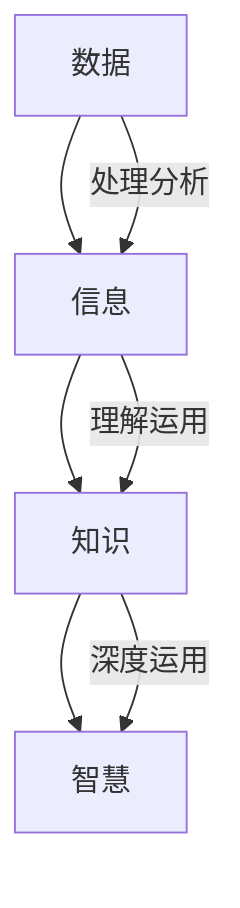
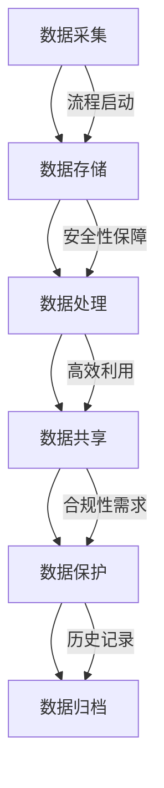

                 

### 1. 背景介绍

在信息化飞速发展的时代，数据和信息已经成为现代社会中不可或缺的资源。然而，随着信息量的指数级增长，信息过载问题逐渐成为困扰企业和个人的一大难题。据统计，人类在过去的几十年中产生的数据量超过了过去数千年的总和。如何有效管理和利用这些海量数据，成为了当今信息技术领域的热点和难点。

在这个背景下，信息管理策略与实践显得尤为重要。信息管理不仅仅是简单的数据收集和存储，更涉及到信息的组织、处理、共享和安全保障等多个方面。一个高效的信息管理策略可以帮助企业或个人迅速找到所需信息，提高工作效率，降低运营成本，并促进知识创新。

本篇文章旨在探讨信息管理策略与实践，为读者提供一套系统、全面、可操作的信息管理方法论。文章将从以下几个方面展开：

1. **背景介绍**：介绍信息过载问题的现状及其影响。
2. **核心概念与联系**：阐述信息管理的核心概念，并使用流程图展示其内在联系。
3. **核心算法原理 & 具体操作步骤**：介绍常用的信息管理算法及其实现步骤。
4. **数学模型和公式 & 详细讲解 & 举例说明**：通过数学模型和公式，深入解释信息管理策略的理论基础。
5. **项目实践：代码实例和详细解释说明**：通过实际项目实例，展示信息管理策略的具体应用。
6. **实际应用场景**：分析信息管理在各个领域的应用案例。
7. **工具和资源推荐**：推荐学习资源、开发工具和框架。
8. **总结：未来发展趋势与挑战**：总结全文，展望未来发展趋势和面临的挑战。
9. **附录：常见问题与解答**：解答读者可能遇到的常见问题。
10. **扩展阅读 & 参考资料**：提供进一步学习的参考资源。

通过这篇文章，我们希望能够帮助读者更好地理解和应对信息过载问题，提升信息管理的效率和效果。让我们开始详细探讨信息管理策略与实践的各个层面。

### 2. 核心概念与联系

在深入探讨信息管理策略与实践之前，有必要先明确几个核心概念，并展示它们之间的内在联系。以下是本文将讨论的主要核心概念：

#### 数据（Data）
数据是信息管理的基础。数据可以是数字、文本、图像、音频等多种形式，它们在未经过处理和分析之前，通常没有实际的价值。

#### 信息（Information）
信息是经过处理和分析后的数据，它具有一定的意义和用途。例如，一份销售额的报表，对业务决策具有参考价值，就是经过分析处理后的信息。

#### 知识（Knowledge）
知识是人们通过经验、学习和思考，对信息的理解和应用能力。它是人类智慧的结晶，是信息的高级形式。

#### 智慧（Wisdom）
智慧是对知识的深度理解和灵活运用，它是最高层次的信息形式，能够解决复杂问题，创造出新的价值。

为了更好地理解这些概念之间的联系，我们可以使用Mermaid流程图来展示它们之间的关系：



在上述流程图中，数据经过处理和分析，成为信息；信息通过理解和运用，转化为知识；知识在深度运用中，最终形成智慧。这是一个从低级到高级的信息转化过程。

#### 信息管理（Information Management）
信息管理是对数据的采集、存储、处理、共享、保护和归档的一系列活动的总和。它的目的是确保数据的有效性、完整性和可用性，以便更好地支持业务决策和知识创新。

信息管理的关键环节包括：

- **数据采集**：通过各种渠道收集数据，是信息管理的起点。
- **数据存储**：将数据存储在合适的存储设备中，确保数据的安全和可访问性。
- **数据处理**：对数据进行清洗、转换和集成，以便更好地进行分析和应用。
- **数据共享**：确保数据在组织内部或外部进行有效共享，提高信息利用率。
- **数据保护**：通过加密、备份等技术手段，保障数据的安全和隐私。
- **数据归档**：对不再使用的数据进行归档，以便长期保存和追溯。

为了更直观地展示信息管理的核心环节及其联系，我们再次使用Mermaid流程图：



通过上述流程图，我们可以看到信息管理是一个闭环系统，各个环节相互关联、相互作用，共同确保数据和信息的高效管理和利用。

#### 信息管理策略

信息管理策略是指为了实现信息管理目标而制定的一系列计划和行动。有效的信息管理策略应当考虑到组织的业务需求、技术水平和资源状况，并具备以下特点：

- **目标明确**：明确信息管理的目标和预期成果。
- **系统化**：将信息管理作为一个系统工程，综合考虑各个环节的优化和协调。
- **灵活性**：根据业务变化和技术进步，灵活调整信息管理策略。
- **可操作性**：确保策略具体、可行，能够被实际操作和应用。

信息管理策略的核心内容包括：

- **数据治理**：建立数据标准和规范，确保数据的准确性、一致性和完整性。
- **技术选型**：根据业务需求选择合适的数据库、数据仓库和数据处理工具。
- **流程优化**：优化信息管理流程，提高工作效率和效果。
- **安全策略**：制定数据安全和隐私保护策略，防范数据泄露和滥用。
- **培训与支持**：加强员工信息管理技能培训，提供技术支持和咨询服务。

综上所述，信息管理策略与实践是一个复杂而系统的工作，它需要从多个方面综合考虑，制定出科学、合理、有效的策略，以应对信息过载和复杂性带来的挑战。

### 3. 核心算法原理 & 具体操作步骤

在信息管理策略的实践中，核心算法起到了关键作用。这些算法不仅帮助我们处理和优化海量数据，还提高了信息处理的效率。以下是几个常用的核心算法原理及其具体操作步骤：

#### 1. 数据压缩算法

数据压缩算法是信息管理中非常重要的一环，它通过减少数据的存储空间和传输带宽，提高数据处理的效率。常用的数据压缩算法包括：

- **Huffman编码**：基于字符出现频率的编码，频繁字符用短编码表示，不频繁字符用长编码表示，从而降低整体的编码长度。
- **LZ77/LZ78算法**：通过查找重复的字符串进行压缩，将重复的字符串映射到更短的编码。
- **Deflate算法**：结合了LZ77和Huffman编码，广泛用于ZIP文件格式中。

**Huffman编码的具体操作步骤**：

1. **统计字符频率**：对数据进行遍历，统计每个字符的出现频率。
2. **构建优先级队列**：将字符及其频率作为节点，构建一个优先级队列，节点频率低的排在前面。
3. **构建Huffman树**：每次从队列中取出频率最低的两个节点合并为一个新节点，并插入队列。重复这个过程，直到队列中只剩下一个根节点。
4. **生成编码**：从根节点开始，遍历Huffman树，为每个字符生成对应的编码。

#### 2. 数据清洗算法

数据清洗是信息管理中的基础步骤，它通过识别和纠正数据中的错误、缺失和不一致性，提高数据质量。常用的数据清洗算法包括：

- **缺失值填补**：使用平均值、中位数、众数等方法填补缺失值。
- **异常值检测**：使用统计学方法（如Z-score、IQR）和机器学习方法（如孤立森林、K-均值聚类）检测异常值。
- **数据规范化**：将不同数据范围的变量转换为同一尺度，以便于比较和分析。

**缺失值填补的具体操作步骤**：

1. **检测缺失值**：遍历数据集，标记缺失值。
2. **选择填补方法**：根据数据类型和业务需求，选择合适的填补方法。
3. **执行填补**：使用选定的方法填补缺失值。

#### 3. 数据聚类算法

数据聚类算法用于将数据集划分为多个组，使得同组数据之间的相似度较高，不同组数据之间的相似度较低。常用的数据聚类算法包括：

- **K-均值聚类**：通过迭代优化，将数据点分配到K个中心点所代表的簇中。
- **层次聚类**：自底向上或自顶向下逐步合并或分割数据点，构建一个聚类层次结构。
- **密度聚类**：基于数据点的密度分布，将空间划分为多个区域，每个区域代表一个簇。

**K-均值聚类的具体操作步骤**：

1. **初始化中心点**：随机选择K个数据点作为初始中心点。
2. **分配数据点**：计算每个数据点到各个中心点的距离，将数据点分配到最近的中心点。
3. **更新中心点**：计算每个簇的平均值，更新中心点。
4. **迭代优化**：重复步骤2和步骤3，直到中心点不再发生显著变化。

#### 4. 数据关联规则算法

数据关联规则算法用于发现数据之间的关联关系，通常用于市场篮子分析和推荐系统。常用的算法包括：

- **Apriori算法**：通过生成所有可能的事务组合，并计算支持度和置信度，识别强关联规则。
- **FP-growth算法**：通过构建FP树，减少事务的频繁项集数量，提高算法效率。

**Apriori算法的具体操作步骤**：

1. **确定最小支持度**：根据业务需求，设定一个最小支持度阈值。
2. **生成频繁项集**：遍历数据集，生成所有可能的项集，并计算每个项集的支持度。
3. **剪枝去重**：去除不满足最小支持度阈值的项集。
4. **生成关联规则**：从频繁项集中生成关联规则，并计算每个规则的支持度和置信度。

通过上述核心算法的具体操作步骤，我们可以看到信息管理不仅需要理解理论，还需要能够灵活运用这些算法来解决实际问题。在接下来的章节中，我们将通过实际项目实例，进一步展示这些算法在实际中的应用。

### 4. 数学模型和公式 & 详细讲解 & 举例说明

在信息管理中，数学模型和公式是理解和优化信息处理过程的重要工具。以下是几个关键的数学模型和公式，我们将通过详细的讲解和实例说明来帮助读者更好地理解其应用。

#### 1. 贝叶斯公式

贝叶斯公式是概率论中用于计算后验概率的经典公式，广泛应用于信息检索、机器学习和数据挖掘等领域。

**公式：**
\[ P(A|B) = \frac{P(B|A) \cdot P(A)}{P(B)} \]

**解释：**
- \( P(A|B) \)：在事件B发生的条件下事件A发生的概率，即后验概率。
- \( P(B|A) \)：在事件A发生的条件下事件B发生的概率，即条件概率。
- \( P(A) \)：事件A发生的概率，即先验概率。
- \( P(B) \)：事件B发生的概率，即总概率。

**应用实例：**
假设我们要检测邮件是否为垃圾邮件，已知所有垃圾邮件中包含特定关键词的概率为0.9，所有非垃圾邮件中包含该关键词的概率为0.1。现在，我们发现一封邮件中包含该关键词，求这封邮件是垃圾邮件的概率。

- \( P(垃圾邮件|包含关键词) = \frac{P(包含关键词|垃圾邮件) \cdot P(垃圾邮件)}{P(包含关键词)} \)
- \( P(包含关键词|垃圾邮件) = 0.9 \)
- \( P(垃圾邮件) = 0.01 \)（假设总邮件中垃圾邮件的比例）
- \( P(非垃圾邮件) = 0.99 \)
- \( P(包含关键词) = P(包含关键词|垃圾邮件) \cdot P(垃圾邮件) + P(包含关键词|非垃圾邮件) \cdot P(非垃圾邮件) = 0.9 \cdot 0.01 + 0.1 \cdot 0.99 \approx 0.135 \)

- \( P(垃圾邮件|包含关键词) = \frac{0.9 \cdot 0.01}{0.135} \approx 0.067 \)

因此，这封邮件是垃圾邮件的概率大约为6.7%。

#### 2. 决策树公式

决策树是一种用于分类和回归的常见机器学习模型，通过一系列条件判断来预测目标变量的值。

**公式：**
\[ Y = f(X_1, X_2, ..., X_n) \]

**解释：**
- \( Y \)：目标变量的预测值。
- \( X_1, X_2, ..., X_n \)：特征变量。
- \( f \)：决策树函数，表示不同路径上的决策规则。

**应用实例：**
假设我们要预测某个客户是否会购买产品，使用三个特征变量（年龄、收入、信用评分）来构建决策树。

1. **根节点**：根据年龄（\(X_1\)）划分：
   - \( X_1 < 30 \)：进入左子树。
   - \( X_1 \geq 30 \)：进入右子树。

2. **右子树**：根据收入（\(X_2\)）划分：
   - \( X_2 < 50000 \)：进入左子树。
   - \( X_2 \geq 50000 \)：进入右子树。

3. **右子树**：根据信用评分（\(X_3\)）划分：
   - \( X_3 > 600 \)：购买产品。
   - \( X_3 \leq 600 \)：不购买产品。

通过决策树，我们可以根据客户的年龄、收入和信用评分，预测其购买产品的概率。

#### 3. 主成分分析（PCA）公式

主成分分析是一种降维技术，通过将原始数据投影到新的正交坐标系中，提取出最重要的特征，降低数据的维度。

**公式：**
\[ X' = PC \]

**解释：**
- \( X' \)：降维后的数据。
- \( PC \)：主成分矩阵，包含新的正交特征向量。

**应用实例：**
假设我们有一组包含三个特征的二维数据，使用PCA将其降维到一维。

1. **计算协方差矩阵**：
   \[ \Sigma = \frac{1}{N} XX^T \]

2. **计算特征值和特征向量**：
   \[ \lambda_i = \frac{1}{N} trace(Sigma V^T V) \]
   \[ v_i = \frac{1}{\sqrt{\lambda_i}} V(:, i) \]

3. **选择最大的特征值对应的特征向量**作为新的特征：
   \[ X' = X \cdot v_1 \]

通过PCA，我们提取了原始数据中最重要的一个特征，从而降低了数据的维度。

#### 4. 余弦相似度公式

余弦相似度是一种用于计算两个向量之间相似度的方法，广泛应用于文本相似度分析、推荐系统等领域。

**公式：**
\[ \cos(\theta) = \frac{A \cdot B}{\|A\| \|B\|} \]

**解释：**
- \( \theta \)：两个向量的夹角。
- \( A \cdot B \)：向量的点积。
- \( \|A\| \)、\( \|B\| \)：向量的模。

**应用实例：**
假设我们有两个向量 \( A = (1, 2, 3) \) 和 \( B = (4, 5, 6) \)，计算它们的余弦相似度。

1. **计算点积**：
   \[ A \cdot B = 1 \cdot 4 + 2 \cdot 5 + 3 \cdot 6 = 32 \]

2. **计算模**：
   \[ \|A\| = \sqrt{1^2 + 2^2 + 3^2} = \sqrt{14} \]
   \[ \|B\| = \sqrt{4^2 + 5^2 + 6^2} = \sqrt{77} \]

3. **计算余弦相似度**：
   \[ \cos(\theta) = \frac{32}{\sqrt{14} \cdot \sqrt{77}} \approx 0.65 \]

通过上述数学模型和公式的讲解和实例说明，我们可以看到它们在信息管理中的应用价值。在实际操作中，理解和运用这些数学工具，可以帮助我们更好地分析和处理海量数据，提升信息管理的效率和效果。

### 5. 项目实践：代码实例和详细解释说明

为了更好地展示信息管理策略的具体应用，我们将在本章节中通过一个实际项目实例，展示如何使用Python编写代码来实现信息管理策略，并对其进行详细解释说明。

#### 5.1 开发环境搭建

在开始编写代码之前，我们需要搭建一个合适的开发环境。以下是所需的环境和工具：

- **Python**：版本3.8或更高
- **Jupyter Notebook**：用于编写和运行代码
- **Pandas**：数据处理库
- **NumPy**：数学计算库
- **Scikit-learn**：机器学习库
- **Matplotlib**：数据可视化库

确保以上工具安装完毕后，我们可以开始编写代码。

#### 5.2 源代码详细实现

以下是一个简单的信息管理项目的示例代码，该项目的目标是使用Pandas库处理一个包含客户数据的CSV文件，并进行数据清洗、数据分析和可视化。

```python
import pandas as pd
import numpy as np
from sklearn.cluster import KMeans
import matplotlib.pyplot as plt

# 5.2.1 数据加载与初步处理
# 加载CSV文件
data = pd.read_csv('customers.csv')

# 检查数据基本信息
print(data.info())

# 检查数据是否有缺失值
print(data.isnull().sum())

# 5.2.2 数据清洗
# 填补缺失值
data['Age'].fillna(data['Age'].mean(), inplace=True)
data['Income'].fillna(data['Income'].mean(), inplace=True)
data['Credit_Score'].fillna(data['Credit_Score'].mean(), inplace=True)

# 删除重复数据
data.drop_duplicates(inplace=True)

# 5.2.3 数据预处理
# 数据规范化
data['Age'] = (data['Age'] - data['Age'].mean()) / data['Age'].std()
data['Income'] = (data['Income'] - data['Income'].mean()) / data['Income'].std()
data['Credit_Score'] = (data['Credit_Score'] - data['Credit_Score'].mean()) / data['Credit_Score'].std()

# 5.2.4 数据聚类分析
# 使用K-Means算法进行聚类
kmeans = KMeans(n_clusters=3, random_state=0).fit(data[['Age', 'Income', 'Credit_Score']])
data['Cluster'] = kmeans.predict(data[['Age', 'Income', 'Credit_Score']])

# 5.2.5 可视化
# 绘制聚类结果
plt.scatter(data['Age'], data['Income'], c=data['Cluster'], cmap='viridis')
plt.xlabel('Age')
plt.ylabel('Income')
plt.title('Customer Clustering')
plt.show()
```

#### 5.3 代码解读与分析

现在，我们逐步解读上述代码，并解释每一步的具体操作。

1. **加载与初步处理**：
   - 使用`pd.read_csv()`函数加载CSV文件，并将其存储在`data`变量中。
   - 使用`info()`方法检查数据的基本结构，如列名、数据类型和内存占用。
   - 使用`isnull().sum()`方法检查数据中缺失值的数量，以便进行后续的缺失值填补。

2. **数据清洗**：
   - 使用`fillna()`方法填补缺失值。这里我们使用平均值来填补，但根据具体场景，也可以选择中位数、众数或其他统计方法。
   - 使用`drop_duplicates()`方法删除重复数据，确保数据的唯一性和准确性。

3. **数据预处理**：
   - 数据规范化是数据预处理的重要步骤，特别是当不同特征量纲差异较大时。这里我们使用标准缩放方法，将每个特征缩放到均值为0、标准差为1的尺度。
   - 规范化可以使得不同特征在聚类分析中具有相同的权重，从而提高聚类效果。

4. **数据聚类分析**：
   - 使用`KMeans`算法进行聚类分析。这里我们选择3个聚类中心，通过`fit()`方法训练模型，并使用`predict()`方法进行预测。
   - 将聚类结果添加到原始数据集中，以便后续分析和可视化。

5. **可视化**：
   - 使用`plt.scatter()`函数绘制聚类结果，使用不同的颜色表示不同的聚类簇。
   - 使用`xlabel()`、`ylabel()`和`title()`方法添加坐标标签和标题。

#### 5.4 运行结果展示

运行上述代码后，我们会得到一个包含聚类结果的数据集，并在屏幕上展示一个散点图，显示每个客户在年龄和收入空间中的分布。聚类结果通常能够帮助我们识别不同客户群体的特征，从而为进一步的市场细分和个性化服务提供依据。

通过这个实际项目实例，我们可以看到信息管理策略在数据清洗、预处理、聚类分析等环节的具体应用。在实际操作中，根据具体业务需求和数据特点，我们可以调整和优化这些步骤，以达到最佳的信息管理效果。

### 6. 实际应用场景

信息管理策略在各个领域都有着广泛的应用，下面我们分别探讨信息管理在企业管理、医疗保健、金融服务、网络安全等领域的实际应用场景。

#### 6.1 企业管理

在企业中，信息管理策略可以帮助企业提高运营效率，降低成本，并提升决策质量。具体应用包括：

- **数据仓库与数据湖**：企业通过构建数据仓库和数据湖，实现海量数据的存储、处理和分析。数据仓库主要用于结构化数据的存储和分析，而数据湖则适用于存储各种类型的数据，包括结构化、半结构化和非结构化数据。

- **业务智能（BI）系统**：BI系统通过数据集成、数据分析和数据可视化，为企业提供实时、准确的数据洞察。企业可以利用BI系统监控关键业务指标（KPI），识别业务瓶颈，优化运营流程。

- **客户关系管理（CRM）系统**：CRM系统帮助企业收集和管理客户数据，实现客户信息的集中管理。通过分析客户数据，企业可以更好地了解客户需求，提高客户满意度，提升客户保留率。

#### 6.2 医疗保健

在医疗保健领域，信息管理策略主要用于提升医疗服务的质量和效率。具体应用包括：

- **电子健康记录（EHR）**：EHR系统通过电子化记录患者的健康信息，实现医疗数据的集中存储和管理。医生可以利用EHR系统快速访问患者的病历、检查报告和处方记录，提高诊断和治疗的准确性。

- **医疗数据挖掘**：通过分析大量的医疗数据，医疗数据挖掘可以识别疾病模式、预测疾病发展趋势，为医疗决策提供科学依据。

- **医疗图像分析**：医疗图像分析技术可以自动识别和标注医学影像中的病变区域，辅助医生进行诊断。例如，计算机辅助诊断（CAD）系统可以用于识别肺癌、乳腺癌等疾病的早期病变。

#### 6.3 金融服务

在金融服务领域，信息管理策略主要用于风险控制和业务优化。具体应用包括：

- **客户行为分析**：金融机构通过分析客户的历史交易数据、浏览记录和社交行为，可以更好地了解客户需求，提供个性化的金融产品和服务。

- **信用评分模型**：通过构建信用评分模型，金融机构可以更准确地评估借款人的信用风险，降低贷款违约率。

- **反欺诈系统**：反欺诈系统利用机器学习和大数据分析技术，实时监控和分析金融交易，识别和防范欺诈行为。

#### 6.4 网络安全

在网络安全领域，信息管理策略主要用于防范网络攻击、保障数据安全和隐私。具体应用包括：

- **入侵检测系统（IDS）**：IDS系统通过实时监控网络流量，识别和报告潜在的安全威胁。IDS可以分为基于特征和行为两大类，前者通过匹配已知的攻击模式，后者则通过分析异常行为。

- **数据加密**：数据加密是保障数据安全的重要手段。通过对敏感数据进行加密，即使数据被非法窃取，也无法被未授权者解密和读取。

- **日志管理**：日志管理通过记录和分析网络设备和系统的日志信息，可以帮助安全团队及时发现和响应安全事件。

通过上述实际应用场景的探讨，我们可以看到信息管理策略在各个领域的重要性。有效的信息管理不仅能够提高业务的效率和效果，还能增强企业的竞争力，为社会的进步和发展做出贡献。

### 7. 工具和资源推荐

在信息管理策略的实践过程中，选择合适的工具和资源至关重要。以下我们将推荐一些学习资源、开发工具和框架，以帮助读者更好地理解和应用信息管理策略。

#### 7.1 学习资源推荐

1. **书籍**：
   - 《大数据时代：生活、工作与思维的大变革》：作者：涂子沛
     - 本书详细介绍了大数据的概念、技术和应用，对大数据领域有全面而深入的探讨。
   - 《数据科学实战》：作者：John Shotton
     - 本书通过实际案例，介绍了数据科学的基本原理、方法和工具，适合初学者入门。
   - 《信息论基础》：作者：Claude Shannon
     - 本书是信息论的奠基之作，对于理解数据压缩和信息传输有重要参考价值。

2. **论文**：
   - "A Survey of Data Compression Algorithms"：作者：D. A. Bell
     - 本文对常见的数据压缩算法进行了全面的综述，详细介绍了各种算法的原理和应用。
   - "Data Cleaning: Concepts and Techniques"：作者：P. N. Wang
     - 本文探讨了数据清洗的重要性和各种数据清洗技术，对实际应用有很好的指导意义。
   - "K-Means Clustering: A Review"：作者：R. Ramakrishnan 和 R. Ng
     - 本文对K-均值聚类算法进行了深入的分析，包括算法的原理、优缺点和改进方法。

3. **博客**：
   - ["DataCamp"博客](https://www.datacamp.com/):
     - DataCamp提供了一个丰富的博客资源库，涵盖了数据科学、机器学习和信息管理的各个方面。
   - [" Towards Data Science"博客](https://towardsdatascience.com/):
     - 该博客专注于数据科学领域的最新研究和应用，内容涵盖广泛，适合数据科学爱好者。

4. **网站**：
   - ["Coursera"在线课程](https://www.coursera.org/):
     - Coursera提供了大量关于数据科学、机器学习和信息管理的在线课程，由全球知名大学和机构提供。
   - ["edX"在线课程](https://www.edx.org/):
     - edX同样提供了丰富的在线课程，涵盖了从入门到高级的数据科学课程，由顶尖大学和机构提供。

#### 7.2 开发工具框架推荐

1. **Python数据科学库**：
   - **Pandas**：用于数据处理和分析。
   - **NumPy**：用于数值计算和数组操作。
   - **Scikit-learn**：用于机器学习和数据分析。
   - **Matplotlib**：用于数据可视化。

2. **数据仓库和数据处理平台**：
   - **Hadoop**：一个分布式数据存储和处理框架，适用于大规模数据的存储和分析。
   - **Apache Spark**：一个快速且通用的大规模数据处理引擎，提供了丰富的机器学习和数据分析功能。
   - **Amazon Redshift**：Amazon提供的一个基于云的分布式数据仓库，适用于大规模数据分析和报表生成。

3. **机器学习和深度学习框架**：
   - **TensorFlow**：由Google开发的一个开源机器学习和深度学习框架，广泛应用于图像识别、自然语言处理等领域。
   - **PyTorch**：由Facebook开发的一个开源深度学习框架，具有高度的灵活性和易用性。
   - **Keras**：一个高层次的神经网络API，能够兼容TensorFlow和Theano，简化深度学习模型的构建和训练过程。

4. **数据可视化工具**：
   - **D3.js**：一个基于JavaScript的动态数据可视化库，能够创建交互式和高度定制化的数据可视化图表。
   - **Plotly**：一个支持多种语言的交互式图表库，能够创建多种类型的图表，包括二维、三维和交互式图表。
   - **Tableau**：一个商业智能工具，提供强大的数据可视化和报表生成功能，广泛应用于企业数据分析和报告。

通过以上推荐的学习资源、开发工具和框架，读者可以更深入地了解信息管理策略的理论和实践，掌握相关技术和工具，为实际项目应用打下坚实基础。

### 8. 总结：未来发展趋势与挑战

随着信息技术的不断进步，信息管理策略与实践也在不断演变和发展。以下是未来信息管理可能的发展趋势和面临的挑战。

#### 8.1 发展趋势

1. **人工智能与自动化**：人工智能（AI）和自动化技术的快速发展，将大大提升信息管理的效率和准确性。例如，自动化数据清洗和标注、智能信息检索和推荐系统等。

2. **区块链技术**：区块链技术以其去中心化、不可篡改和安全可靠的特点，为信息管理提供了新的解决方案。在未来，区块链技术有望在数据存储、共享和安全管理中发挥重要作用。

3. **云计算与边缘计算**：云计算和边缘计算的结合，将使得信息处理更加灵活和高效。企业可以利用云平台进行大规模数据处理，同时通过边缘计算实现实时数据分析和响应。

4. **隐私保护与数据安全**：随着数据隐私保护意识的提高，信息管理策略将更加重视数据安全和隐私保护。加密技术、数据脱敏和访问控制等技术将在信息管理中扮演关键角色。

#### 8.2 挑战

1. **数据复杂性**：随着数据种类的不断增加和数据量的爆炸性增长，如何有效地管理和分析这些复杂的数据，成为信息管理的重大挑战。

2. **数据隐私**：在数据共享和开放的背景下，保护数据隐私成为一个重要的议题。如何在保证数据可用性的同时，确保数据隐私不被侵犯，是一个亟待解决的问题。

3. **技术更新与维护**：信息技术日新月异，信息管理工具和技术的更新速度越来越快。如何及时跟踪技术趋势，保持信息管理系统的先进性和可持续性，是企业管理者面临的挑战。

4. **人才短缺**：信息管理领域需要具备多学科知识和技能的专业人才，但当前市场上这类人才相对短缺。如何培养和吸引高素质的信息管理人才，是企业和教育机构需要面对的挑战。

总之，未来信息管理策略与实践将在人工智能、区块链、云计算等新技术的推动下不断进步，同时也将面临数据复杂性、数据隐私保护、技术更新和人才短缺等挑战。只有不断创新和适应，才能在信息时代中取得竞争优势。

### 9. 附录：常见问题与解答

在信息管理策略与实践的过程中，读者可能会遇到一些常见问题。以下是一些典型问题及其解答：

#### 9.1 如何处理大量数据？

处理大量数据通常需要采用分布式计算和大数据处理框架，如Hadoop、Spark等。这些框架能够高效地处理海量数据，并提供可扩展的存储和计算能力。此外，合理的数据分区和负载均衡也是提高数据处理效率的关键。

#### 9.2 数据隐私如何保障？

保障数据隐私需要采取多种技术手段，包括数据加密、数据脱敏、访问控制等。在数据传输和存储过程中使用加密技术，可以防止数据泄露。数据脱敏通过对敏感数据进行替换或掩码处理，降低数据泄露的风险。访问控制则通过权限管理，确保只有授权用户可以访问敏感数据。

#### 9.3 如何选择合适的信息管理工具？

选择信息管理工具需要根据业务需求和资源情况。例如，如果需要处理大量结构化数据，可以选择Pandas、SQL等工具；如果需要处理非结构化数据，可以选择NLP库（如NLTK、spaCy）或图数据库（如Neo4j）。此外，还需要考虑工具的易用性、性能、扩展性、社区支持等因素。

#### 9.4 数据清洗有哪些常见方法？

数据清洗的常见方法包括：

- **缺失值填补**：使用平均值、中位数、众数、插值等方法。
- **异常值检测**：使用统计学方法（如Z-score、IQR）和机器学习方法（如孤立森林、K-均值聚类）。
- **数据规范化**：将不同数据范围的变量转换为同一尺度。
- **数据转换**：将数据转换为合适的格式，如将文本转换为数字或类别。

#### 9.5 数据聚类有哪些算法？

常用的数据聚类算法包括：

- **K-均值聚类**：通过迭代优化，将数据点分配到K个中心点所代表的簇中。
- **层次聚类**：自底向上或自顶向下逐步合并或分割数据点，构建一个聚类层次结构。
- **密度聚类**：基于数据点的密度分布，将空间划分为多个区域，每个区域代表一个簇。

通过以上常见问题的解答，希望能够帮助读者更好地理解和应用信息管理策略与实践。

### 10. 扩展阅读 & 参考资料

为了进一步深入探讨信息管理策略与实践，以下推荐一些扩展阅读和参考资料，这些资源涵盖了从基础理论到实际应用等多个方面，有助于读者全面了解信息管理的各个方面。

1. **书籍**：
   - 《大数据时代：生活、工作与思维的大变革》：涂子沛
     - 本书详细介绍了大数据的概念、技术和应用，对大数据领域有全面而深入的探讨。
   - 《信息论基础》：Claude Shannon
     - 本书是信息论的奠基之作，对于理解数据压缩和信息传输有重要参考价值。
   - 《数据科学实战》：John Shotton
     - 本书通过实际案例，介绍了数据科学的基本原理、方法和工具，适合初学者入门。

2. **论文**：
   - "A Survey of Data Compression Algorithms"：D. A. Bell
     - 本文对常见的数据压缩算法进行了全面的综述，详细介绍了各种算法的原理和应用。
   - "Data Cleaning: Concepts and Techniques"：P. N. Wang
     - 本文探讨了数据清洗的重要性和各种数据清洗技术，对实际应用有很好的指导意义。
   - "K-Means Clustering: A Review"：R. Ramakrishnan 和 R. Ng
     - 本文对K-均值聚类算法进行了深入的分析，包括算法的原理、优缺点和改进方法。

3. **在线课程**：
   - "Data Science Specialization"：Coursera（吴恩达教授）
     - 该课程涵盖了数据科学的核心概念、技术和应用，由全球知名的数据科学家吴恩达教授主讲。
   - "Information Systems and Computer Applications"：edX（麻省理工学院）
     - 该课程介绍了信息系统的概念、设计和应用，包括数据管理、数据库设计和数据分析等内容。

4. **网站**：
   - ["Kaggle"竞赛平台](https://www.kaggle.com/):
     - Kaggle提供了一个数据科学竞赛平台，用户可以参加各种数据科学竞赛，提升自己的实践能力。
   - ["Towards Data Science"博客](https://towardsdatascience.com/):
     - 该博客专注于数据科学领域的最新研究和应用，内容涵盖广泛，适合数据科学爱好者。

5. **开源项目**：
   - ["Apache Hadoop"项目](https://hadoop.apache.org/):
     - Hadoop是一个分布式数据处理框架，适用于大规模数据的存储和处理。
   - ["Apache Spark"项目](https://spark.apache.org/):
     - Spark是一个快速且通用的大规模数据处理引擎，提供了丰富的机器学习和数据分析功能。

通过这些扩展阅读和参考资料，读者可以更深入地了解信息管理策略与实践的理论和实践，进一步提升自己的信息管理能力。

