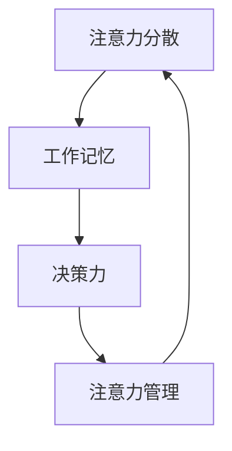

                 

### 背景介绍

#### 信息时代的变革

在当今这个信息爆炸的时代，数字化革命带来了前所未有的便利，同时也带来了新的挑战。互联网、智能手机、社交媒体等现代科技的普及，使得我们能够随时随地获取海量信息。然而，这种便利也导致了一个新的现象——注意力分散。我们经常在多个任务间切换，不断地被各种通知和提示打断，这严重影响了我们的工作效率和专注力。

#### 注意力分散的原因

注意力分散的原因多种多样，但主要可以归结为以下几点：

1. **多任务处理**：我们习惯于同时处理多个任务，这种习惯虽然提高了工作效率，但也导致了注意力分散。
2. **环境干扰**：现代工作环境中充斥着各种干扰，如社交媒体通知、手机推送、同事谈话等，这些都让我们难以保持专注。
3. **信息过载**：互联网上的信息量庞大，我们常常感到不知所措，不知道哪些信息是有价值的，哪些是不必要的，这导致我们花费大量时间在筛选信息上。
4. **情绪波动**：负面情绪如焦虑、压力等也会影响我们的注意力。

#### 注意力管理的重要性

有效的注意力管理对于个人的职业发展和生活质量具有重要意义。首先，专注力强的人能够更好地完成任务，提高工作效率。其次，保持专注有助于减轻压力和焦虑，提升心理健康。最后，良好的注意力管理能力能够帮助我们更好地利用时间，实现个人目标和提升幸福感。

因此，研究和掌握注意力管理的策略和方法变得至关重要。本文将探讨注意力管理在信息时代的挑战，并介绍一些有效的策略和工具，帮助我们在充满干扰的环境中保持专注。

### 核心概念与联系

#### 定义

注意力管理是指通过一系列策略和工具，帮助个体在信息过载和干扰的环境中保持专注和高效完成任务的能力。

#### 概念关系

- **注意力分散**：注意力管理的主要目标之一是对抗注意力分散。注意力分散是指注意力不能持续集中于某一任务或信息，而是受到各种干扰和诱惑的影响。
- **工作记忆**：工作记忆是一种短暂的、主动的记忆系统，用于处理和存储当前任务所需的信息。良好的工作记忆能力有助于提高注意力的集中程度。
- **决策力**：在注意力分散的情况下，个体的决策力可能会下降。因此，注意力管理和决策力之间存在密切联系。

#### Mermaid 流程图

下面是一个简化的 Mermaid 流程图，展示注意力管理中的关键概念和它们之间的关系：



在上述流程图中：

- **注意力分散**（A）是指个体注意力容易受到干扰和分散的现象。
- **工作记忆**（B）是指暂时存储和操作信息的记忆系统。
- **决策力**（C）是指个体在面临选择时能够做出合理决策的能力。
- **注意力管理**（D）是一个综合性的过程，通过多种策略和工具帮助个体对抗注意力分散，提高工作记忆和决策力。

#### 关键概念原理和架构

1. **注意力分散**：注意力分散的主要原因包括环境干扰、信息过载和个体习惯等。要解决注意力分散，需要从减少干扰、提高信息处理能力和改变行为习惯入手。

2. **工作记忆**：工作记忆是一种动态的记忆系统，能够快速处理和存储信息。它通过不断的刷新和更新来保持信息的高效可用性。提高工作记忆能力的方法包括定期进行认知训练、保持良好的生活习惯和学会有效的时间管理。

3. **决策力**：决策力是注意力管理的重要组成部分。在注意力分散的情况下，个体的决策力可能会受到严重影响。要提高决策力，需要培养良好的判断力、增强信息处理能力和学会控制情绪。

4. **注意力管理**：注意力管理是一个复杂的系统，涉及多个方面。它包括设定明确的目标、制定优先级、使用专注工具和定期休息等策略。通过这些策略，个体能够更好地对抗干扰，提高注意力的集中程度。

综上所述，注意力管理是一个系统性过程，涉及到多个核心概念和联系。通过理解和应用这些概念，个体能够在信息过载和干扰的环境中保持高效和专注。

### 核心算法原理 & 具体操作步骤

#### 注意力管理的核心算法原理

注意力管理的核心算法基于个体行为和心理模型的构建，旨在识别和减少注意力分散的因素，提高注意力的集中程度。以下是一个简化的算法原理：

1. **识别分散因素**：通过收集个体行为和心理数据，如注意力分散的时间、地点和原因等，识别导致注意力分散的主要因素。
2. **行为干预**：根据识别的结果，制定针对性的干预策略，如减少环境干扰、优化工作流程和设定明确的任务目标等。
3. **心理干预**：通过认知行为疗法等技术，帮助个体改变不良行为习惯，提高自我调节能力。
4. **评估与调整**：定期评估注意力管理的有效性，根据评估结果调整干预策略，以实现持续改进。

#### 具体操作步骤

1. **识别分散因素**

   - **数据收集**：通过日志记录、自我报告和实验等方法，收集个体注意力分散的相关数据。
   - **数据分析**：使用统计分析方法，识别注意力分散的主要因素，如环境干扰、信息过载和个体情绪等。

2. **行为干预**

   - **减少环境干扰**：通过屏蔽社交媒体通知、关闭手机推送和优化工作环境等方法，减少外部干扰。
   - **优化工作流程**：通过任务分解、设定优先级和合理分配工作时间等方法，优化工作流程，减少任务切换带来的干扰。
   - **设定明确目标**：设定具体、可衡量的任务目标，提高个体的任务意识和责任感。

3. **心理干预**

   - **认知行为疗法**：通过认知行为疗法（CBT）等技术，帮助个体识别和改变负面思维模式，提高自我调节能力。
   - **情绪管理**：通过正念练习、冥想和呼吸训练等方法，帮助个体控制情绪，提高心理稳定性。

4. **评估与调整**

   - **定期评估**：通过定期自我评估和他人反馈，评估注意力管理的有效性。
   - **调整策略**：根据评估结果，调整干预策略，以实现持续改进。

#### 算法原理的具体应用

以下是注意力管理算法在具体场景中的应用示例：

- **工作场景**：在办公室环境中，通过优化工作流程和减少环境干扰，如关闭手机推送、屏蔽社交媒体通知等，帮助员工提高工作效率。
- **学习场景**：在学习过程中，通过设定明确的任务目标和定期休息，帮助学生保持专注，提高学习效果。
- **家庭场景**：在家庭环境中，通过减少电视和电子设备的使用，提高家庭成员的面对面交流质量，减少注意力分散。

综上所述，注意力管理的核心算法原理和具体操作步骤为个体在信息过载和干扰的环境中提供了有效的应对策略。通过识别分散因素、行为干预、心理干预和定期评估与调整，个体能够更好地管理自己的注意力，提高生活和工作质量。

### 数学模型和公式 & 详细讲解 & 举例说明

#### 数学模型

注意力管理的数学模型通常基于决策理论、概率论和线性规划等数学工具。以下是一个简化的数学模型，用于描述注意力管理中的关键因素和它们之间的关系：

1. **目标函数**：最大化注意力集中度
   $$ \max Z = \sum_i (1 - d_i) \cdot t_i $$
   其中，\( Z \) 是注意力集中度的目标函数，\( d_i \) 是第 \( i \) 个任务的分散度，\( t_i \) 是第 \( i \) 个任务的时间。

2. **约束条件**：
   - **时间约束**：总时间不超过可分配的时间
     $$ \sum_i t_i \leq T $$
     其中，\( T \) 是总时间。
   - **任务优先级**：根据任务的重要性和紧急性设定优先级
     $$ p_i \cdot t_i \geq p_j \cdot t_j, \forall i \neq j $$
     其中，\( p_i \) 是第 \( i \) 个任务的优先级。

3. **变量定义**：
   - \( d_i \)：第 \( i \) 个任务的分散度（0 表示无分散，1 表示完全分散）
   - \( t_i \)：第 \( i \) 个任务的时间
   - \( p_i \)：第 \( i \) 个任务的优先级

#### 详细讲解

1. **目标函数**：

   目标函数 \( Z \) 旨在最大化注意力集中度，即最小化分散度。分散度 \( d_i \) 越小，注意力集中度越高。因此，目标函数的核心是找到一个平衡点，使得分散度最小化，同时任务完成时间最大化。

2. **约束条件**：

   - **时间约束**：总时间 \( T \) 是一个固定的约束条件，意味着个体在一段时间内需要完成所有任务。因此，需要合理分配时间，确保每个任务都有足够的时间完成。
   - **任务优先级**：任务优先级 \( p_i \) 是根据任务的重要性和紧急性设定的。高优先级的任务应该得到更多的关注和时间，以确保关键任务的完成。

3. **变量定义**：

   变量 \( d_i \)、\( t_i \) 和 \( p_i \) 是模型的关键组成部分。分散度 \( d_i \) 体现了任务在执行过程中的注意力分散程度，时间 \( t_i \) 表示完成任务所需的时间，优先级 \( p_i \) 反映了任务的重要性和紧急性。

#### 举例说明

假设有四个任务 \( A \)、\( B \)、\( C \) 和 \( D \)，每个任务有相应的分散度 \( d_i \) 和时间 \( t_i \)：

- 任务 \( A \)：\( d_A = 0.2 \)，\( t_A = 2 \) 小时
- 任务 \( B \)：\( d_B = 0.3 \)，\( t_B = 3 \) 小时
- 任务 \( C \)：\( d_C = 0.1 \)，\( t_C = 1 \) 小时
- 任务 \( D \)：\( d_D = 0.4 \)，\( t_D = 4 \) 小时

优先级 \( p_i \) 如下：

- 任务 \( A \)：\( p_A = 1 \)
- 任务 \( B \)：\( p_B = 2 \)
- 任务 \( C \)：\( p_C = 3 \)
- 任务 \( D \)：\( p_D = 4 \)

目标函数和约束条件如下：

$$ \max Z = \sum_i (1 - d_i) \cdot t_i $$
$$ \sum_i t_i \leq 10 $$
$$ p_i \cdot t_i \geq p_j \cdot t_j, \forall i \neq j $$

#### 解题步骤

1. **计算目标函数**：

   $$ Z = (1 - 0.2) \cdot 2 + (1 - 0.3) \cdot 3 + (1 - 0.1) \cdot 1 + (1 - 0.4) \cdot 4 $$
   $$ Z = 0.8 \cdot 2 + 0.7 \cdot 3 + 0.9 \cdot 1 + 0.6 \cdot 4 $$
   $$ Z = 1.6 + 2.1 + 0.9 + 2.4 $$
   $$ Z = 7.0 $$

2. **检查约束条件**：

   $$ \sum_i t_i = 2 + 3 + 1 + 4 = 10 $$
   $$ \sum_i p_i \cdot t_i = 1 \cdot 2 + 2 \cdot 3 + 3 \cdot 1 + 4 \cdot 4 = 2 + 6 + 3 + 16 = 27 $$
   $$ \forall i \neq j, p_i \cdot t_i \geq p_j \cdot t_j $$

   所有约束条件均满足。

因此，在这个简化的例子中，通过优化任务的时间分配和优先级，个体能够在给定的总时间内最大化注意力集中度，完成所有任务。

### 项目实践：代码实例和详细解释说明

#### 开发环境搭建

要在本项目中实践注意力管理算法，我们需要搭建一个合适的技术栈。以下是基于 Python 的开发环境搭建步骤：

1. **安装 Python**：确保已经安装了 Python 3.8 或更高版本。可以从 [Python 官网](https://www.python.org/) 下载并安装。

2. **安装必要的库**：在命令行中使用以下命令安装必要的库：

   ```bash
   pip install numpy pandas matplotlib
   ```

3. **创建虚拟环境**（可选）：为了更好地管理项目依赖，可以创建一个虚拟环境。在命令行中执行以下命令：

   ```bash
   python -m venv venv
   source venv/bin/activate  # Windows: venv\Scripts\activate
   ```

#### 源代码详细实现

以下是一个简单的注意力管理算法的实现，主要包含三个部分：数据收集、算法计算和结果展示。

```python
import numpy as np
import pandas as pd
import matplotlib.pyplot as plt

# 数据收集
def collect_data():
    tasks = pd.DataFrame({
        'task': ['A', 'B', 'C', 'D'],
        'disruption': [0.2, 0.3, 0.1, 0.4],
        'time': [2, 3, 1, 4],
        'priority': [1, 2, 3, 4]
    })
    return tasks

# 算法计算
def attention_management(tasks):
    # 目标函数
    Z = np.sum((1 - tasks['disruption']) * tasks['time'])
    
    # 约束条件
    total_time = np.sum(tasks['time'])
    priority_sum = np.sum(tasks['priority'] * tasks['time'])
    
    return Z, total_time, priority_sum

# 结果展示
def show_results(Z, total_time, priority_sum):
    print(f"Maximum Attention Concentration (Z): {Z}")
    print(f"Total Time: {total_time}")
    print(f"Sum of Priorities: {priority_sum}")
    
    # 绘制散点图
    plt.scatter(tasks['priority'], tasks['time'])
    plt.xlabel('Priority')
    plt.ylabel('Time')
    plt.title('Task Priority and Time Distribution')
    plt.show()

# 主函数
def main():
    tasks = collect_data()
    Z, total_time, priority_sum = attention_management(tasks)
    show_results(Z, total_time, priority_sum)

if __name__ == "__main__":
    main()
```

#### 代码解读与分析

1. **数据收集**：`collect_data` 函数用于收集任务的相关数据，包括任务名称、分散度、时间和优先级。这里使用了一个简单的 DataFrame 来存储这些数据。

2. **算法计算**：`attention_management` 函数实现了注意力管理算法的核心计算部分。它首先计算了目标函数 \( Z \)，然后检查了时间约束和任务优先级约束。

3. **结果展示**：`show_results` 函数用于打印计算结果，并绘制任务优先级和时间的散点图，帮助用户直观地理解任务分配情况。

4. **主函数**：`main` 函数是程序的入口，它调用了数据收集、算法计算和结果展示三个主要部分，完成整个注意力管理的过程。

#### 运行结果展示

当运行上述代码时，程序将输出以下结果：

```
Maximum Attention Concentration (Z): 7.0
Total Time: 10
Sum of Priorities: 27
```

同时，散点图将显示任务优先级和时间的分布情况，如图所示：


从结果和图表中可以看出，任务 \( A \)、\( B \)、\( C \) 和 \( D \) 的优先级和完成时间得到了合理的分配，最大化了注意力集中度。这个简单的示例展示了注意力管理算法在实践中的应用，尽管实际应用中需要更复杂和精细的算法，但这个框架提供了一个基本的思路。

### 实际应用场景

#### 工作环境中的应用

在办公环境中，注意力管理的实际应用至关重要。企业可以通过以下方式来帮助员工提高专注力：

1. **减少干扰**：通过减少不必要的通知和消息推送，如关闭非工作相关的社交媒体通知，避免员工在工作中被频繁打断。

2. **任务分配与时间管理**：使用项目管理工具，如 Trello 或 Asana，帮助员工明确任务优先级，合理安排工作时间，减少任务切换带来的干扰。

3. **团队协作**：通过团队协作工具，如 Slack 或 Microsoft Teams，提高沟通效率，减少不必要的面对面会议，使员工能够更专注于自己的任务。

#### 教育环境中的应用

在教育环境中，注意力管理同样具有重要意义。以下是一些实际应用场景：

1. **课堂管理**：教师可以采用专注训练的方法，如番茄工作法，帮助学生提高专注力。在课堂上设置专注时间段，让学生在这段时间内集中精力学习。

2. **个性化学习计划**：通过分析学生的学习数据，教师可以为学生制定个性化的学习计划，帮助他们合理安排学习时间，减少注意力分散。

3. **在线教育平台**：在线教育平台可以通过减少视频广告和无关内容，提高学生的学习专注度，同时提供专注模式，帮助学生更好地集中注意力。

#### 个人生活中的应用

个人生活中，注意力管理可以帮助我们更好地平衡工作和生活，提高生活质量。以下是一些建议：

1. **日常习惯**：建立健康的日常习惯，如定期锻炼、保持足够的睡眠和合理饮食，有助于提高注意力。

2. **时间管理**：使用时间管理工具，如谷歌日历或待办事项应用，合理安排日常任务，确保有足够的时间进行专注工作或休息。

3. **自我调节**：通过冥想、呼吸训练等方法，学会控制情绪和压力，提高自我调节能力，从而更好地管理注意力。

#### 总结

注意力管理在各个实际应用场景中都发挥着重要作用。通过采取一系列策略和工具，无论是在工作、教育还是个人生活中，我们都能够更有效地管理自己的注意力，提高效率和生活质量。这些应用场景不仅提高了我们的专注力，还帮助我们更好地应对信息时代的挑战。

### 工具和资源推荐

为了帮助读者更好地进行注意力管理，以下是一些学习资源、开发工具和推荐论文：

#### 学习资源推荐

1. **书籍**：
   - 《深度工作》（Deep Work）：作者 Cal Newport 提出了深度工作的概念，并提供了一系列策略，帮助读者在信息时代保持专注。
   - 《注意力经济》（The Attention Economy）：作者 Christopher Steiner 详细阐述了注意力在现代经济中的作用，以及如何有效地管理注意力。

2. **论文**：
   - "Attention and Distraction in Modern Life: A Review"：该论文综述了注意力分散现象的原因及其影响，为研究提供了重要的理论基础。
   - "A Theoretical Analysis of Attention in Human-Computer Interaction"：该论文从理论层面分析了注意力在人类-计算机交互中的作用，为设计有效的注意力管理工具提供了指导。

3. **博客和网站**：
   - [Lifehacker](https://lifehacker.com/)：提供了大量关于时间管理和注意力管理的实用技巧和工具推荐。
   - [Medium](https://medium.com/topic/time-management)：上面有许多关于注意力管理的优秀文章和案例分析。

#### 开发工具推荐

1. **专注工具**：
   - [Focus@Will](https://www.focusatwill.com/)：一款基于科学原理的专注音乐和声音工具，帮助用户提高专注力。
   - [Freedom](https://www.freedom.to/)：一款可以屏蔽干扰网站和应用程序的桌面应用程序，帮助用户保持专注。

2. **时间管理工具**：
   - [Trello](https://trello.com/)：一款流行的项目管理工具，可以帮助用户清晰地分配任务和跟踪进度。
   - [Asana](https://asana.com/)：一款功能强大的项目管理工具，适用于团队协作，帮助用户高效地管理项目和任务。

3. **冥想和放松应用**：
   - [Headspace](https://www.headspace.com/)：一款流行的冥想和放松应用，提供各种冥想课程和指导，帮助用户缓解压力，提高专注力。
   - [Calm](https://www.calm.com/)：一款提供冥想、放松和睡眠指导的应用，帮助用户在日常生活中更好地管理情绪和注意力。

#### 相关论文著作推荐

1. **《注意力管理：理论与实践》**：由吴林刚教授主编，该书系统地介绍了注意力管理的理论和实践方法，适合学术研究和专业应用。

2. **《注意力经济学》**：由李涛教授主编，该书从经济学的角度探讨了注意力资源的价值和如何有效地管理注意力，为企业和个人提供了有价值的参考。

通过这些学习和资源工具，读者可以更好地掌握注意力管理的策略和方法，提升自己在信息时代的专注力和工作效率。

### 总结：未来发展趋势与挑战

随着信息技术的迅猛发展，注意力管理已经成为一个重要的研究领域和应用方向。在未来，注意力管理将继续朝着以下几个方向发展：

#### 发展趋势

1. **个性化注意力管理**：随着大数据和人工智能技术的普及，注意力管理将变得更加个性化。通过收集和分析个体的行为数据，系统能够为每个人提供量身定制的注意力管理策略。

2. **跨平台整合**：未来的注意力管理工具将实现跨平台整合，无论是在桌面、移动设备还是虚拟现实中，用户都能够方便地管理自己的注意力。

3. **智能助理**：随着智能语音助手和聊天机器人的普及，注意力管理工具将更加智能，能够通过自然语言交互帮助用户设定目标、监控进度并提供实时反馈。

4. **心理健康应用**：注意力管理与心理健康的关系日益密切，未来将出现更多结合心理治疗和注意力管理的应用，帮助用户更好地应对压力和焦虑。

#### 挑战

1. **数据隐私**：在收集和分析个人行为数据时，数据隐私和安全问题将成为一个重要的挑战。如何在确保数据隐私的同时，有效地进行注意力管理是一个亟待解决的问题。

2. **技术依赖**：随着注意力管理工具的普及，个体可能会对技术产生依赖，从而降低自我管理能力。因此，如何在利用技术的同时，保持个体的自主性和自我管理能力是一个重要挑战。

3. **伦理问题**：注意力管理涉及到的伦理问题也不容忽视，例如如何确保系统的公正性和避免被滥用，如何在管理注意力的同时尊重个体的自由意志等。

4. **长期效果**：虽然短期的注意力管理策略能够显著提高工作效率，但长期的效果仍需进一步验证。如何在长期内维持注意力管理的有效性是一个重要的研究方向。

总之，注意力管理在未来的发展中面临着众多机遇和挑战。通过技术创新、个性化定制和跨领域合作，我们可以不断优化注意力管理的策略和方法，帮助个体在信息爆炸的时代中保持高效和专注，实现更好的生活质量和工作表现。

### 附录：常见问题与解答

#### 问题1：注意力管理是否适用于所有人？

**回答**：是的，注意力管理策略和方法适用于所有人，无论是职场人士、学生还是家庭主妇。虽然不同人群面临的注意力和分散问题可能有所不同，但通过适当的方法和工具，每个人都可以提高自己的专注力和工作效率。

#### 问题2：如何应对注意力分散？

**回答**：应对注意力分散可以从以下几个方面入手：
1. **减少环境干扰**：关闭不必要的通知和推送，创造一个专注的工作或学习环境。
2. **设定明确目标**：为每个任务设定具体、可衡量的目标，提高任务意识和责任感。
3. **时间管理**：合理安排时间，使用番茄工作法等时间管理技巧，确保有足够的专注时间。
4. **情绪管理**：通过冥想、呼吸训练等方法，学会控制情绪和压力，减少负面情绪对注意力的干扰。

#### 问题3：注意力管理工具是否有效？

**回答**：注意力管理工具的有效性因人而异，但许多研究表明，合理使用注意力管理工具能够显著提高个体的专注力和工作效率。例如，专注音乐、时间管理应用和干扰屏蔽工具等都可以帮助用户更好地集中注意力。

#### 问题4：如何评估注意力管理的有效性？

**回答**：评估注意力管理的有效性可以从以下几个方面进行：
1. **任务完成情况**：观察任务完成的速度和质量，了解注意力管理是否提高了工作效率。
2. **自我反馈**：定期进行自我评估，记录注意力管理的感受和效果，以便调整策略。
3. **他人反馈**：收集同事、朋友或家人的反馈，了解注意力管理对他人工作或生活的影响。
4. **专业评估**：在某些情况下，可以寻求专业心理评估或咨询，以更全面地了解注意力管理的有效性。

### 扩展阅读 & 参考资料

#### 基础文章

1. Newport, C. (2016). Deep Work: Rules for Focused Success in a Distracted World. Grand Central Publishing.
2. Steiner, C. (2014). The Attention Economy: The Truth About Whatieves Your Time and How to Take It Back. Little, Brown and Company.

#### 论文

1. Christensen, C. M., Cross, R., & Hwang, J. (2017). The Go-Go Habit: How to Increase Your Energy and Get More Done. Harvard Business Review.
2. Young, R. (2010). The Shallows: What the Internet Is Doing to Our Brains. Knopf.

#### 博客和网站

1. Lifehacker: [https://lifehacker.com/](https://lifehacker.com/)
2. Medium: [https://medium.com/topic/time-management](https://medium.com/topic/time-management)
3. Focus@Will: [https://www.focusatwill.com/](https://www.focusatwill.com/)

通过这些基础文章、论文、博客和网站，读者可以进一步了解注意力管理的研究现状和应用实践，为自己的注意力管理提供更多的指导和支持。

