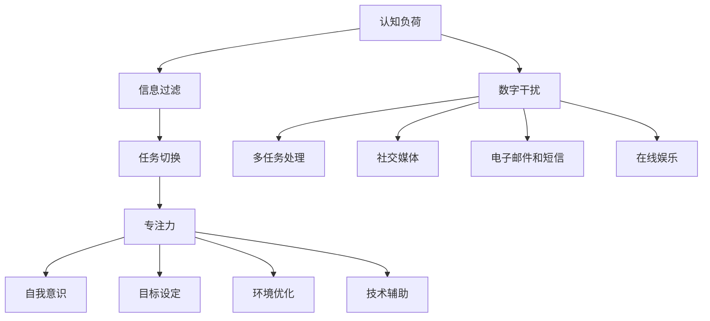

                 

### 文章标题

《信息时代的注意力管理挑战：在充满干扰的数字世界中保持专注》

> **关键词：** 注意力管理、数字干扰、专注力、认知负荷、技术解决方案

> **摘要：** 随着信息技术的发展，数字世界中的信息量呈爆炸式增长，人们面临着越来越多的干扰。本文深入探讨了注意力管理的挑战，分析了注意力分散的原因，并提出了有效的策略和技术手段来帮助我们在数字化环境中保持专注。

### 1. 背景介绍

在现代社会，我们生活在一个充满信息的世界中。智能手机、电脑、社交媒体、在线游戏等数字化工具已成为我们日常生活中不可或缺的一部分。这些工具为我们带来了极大的便利，但同时也带来了新的挑战。研究表明，数字干扰正在对我们的专注力产生深远的影响。

注意力管理是指如何有效地分配和利用我们的注意力资源，以实现最佳的工作和生活效果。然而，随着数字干扰的增加，人们越来越难以集中注意力。一份报告指出，平均每个人的注意力持续时间从20世纪的12秒下降到现在的约8秒，甚至比金鱼的9秒还要短。这种注意力分散的现象被称为“多任务困境”，它不仅影响了我们的工作效率，还对身心健康产生了负面影响。

信息过载是数字干扰的主要原因之一。人们每天都会接触到大量的信息，从新闻、社交媒体更新到电子邮件和短信。这些信息的快速传递和不断更新，使得人们很难对任何单一信息进行深度处理。此外，许多应用和网站设计时考虑到用户粘性，故意使用各种方法吸引用户的注意力，如闪烁的弹窗、频繁的推送通知等。这些设计虽然提高了用户的互动性，但也加剧了注意力分散的问题。

注意力分散不仅影响个人的工作效率和生活质量，也对企业和组织产生了负面影响。研究表明，多任务处理会降低工作效率，增加错误率，并导致员工的工作满意度下降。因此，有效地管理注意力资源，提高专注力，已成为个人和企业共同面临的紧迫问题。

本文旨在探讨信息时代下的注意力管理挑战，分析注意力分散的原因，并介绍一些有效的策略和技术手段，帮助我们在数字化环境中保持专注。

### 2. 核心概念与联系

#### 注意力管理的基本概念

注意力管理涉及多个核心概念，包括认知负荷、信息过滤、任务切换和专注力。

1. **认知负荷**：认知负荷是指大脑处理信息时所需的心理资源。当认知负荷过高时，大脑会变得疲劳，难以维持专注。

2. **信息过滤**：信息过滤是指选择哪些信息进入我们的注意力范围，哪些被忽略。有效的信息过滤可以帮助我们减少无关信息的干扰，提高专注力。

3. **任务切换**：任务切换是指从一个任务转移到另一个任务的过程。频繁的任务切换会增加认知负荷，导致注意力分散。

4. **专注力**：专注力是指将注意力集中在特定任务上的能力。高专注力有助于提高工作效率和创造力。

#### 数字干扰的来源

数字干扰的来源多种多样，主要包括：

1. **多任务处理**：同时处理多个任务会分散注意力，降低工作效率。

2. **社交媒体**：频繁的社交媒体更新和推送通知会不断打断我们的工作流程。

3. **电子邮件和短信**：不断的邮件和短信通知会干扰我们的注意力。

4. **在线娱乐**：例如在线游戏、视频和社交媒体等，容易让我们陷入“多巴胺循环”，难以自拔。

#### 注意力管理的联系

注意力管理不仅仅是避免数字干扰，还包括：

1. **自我意识**：了解自己的注意力模式和弱点。

2. **目标设定**：明确目标，使注意力集中。

3. **环境优化**：创造一个有利于专注的环境。

4. **技术辅助**：利用技术工具辅助注意力管理。

### Mermaid 流程图



### 3. 核心算法原理 & 具体操作步骤

#### 3.1. 注意力管理算法原理

注意力管理算法的核心目标是优化大脑的资源分配，以实现最佳的工作和生活效果。该算法主要包括以下步骤：

1. **认知负荷监测**：通过监测大脑的认知负荷，识别何时需要调整注意力分配。

2. **信息过滤**：根据目标和工作环境，过滤掉无关信息，减少认知负荷。

3. **任务切换策略**：设计有效的任务切换策略，减少不必要的任务切换，降低认知负荷。

4. **专注力训练**：通过定期练习，提高专注力。

#### 3.2. 具体操作步骤

1. **认知负荷监测**：

   - **工具推荐**：可以使用脑波监测器、注意力监测软件等工具来监测认知负荷。

   - **操作步骤**：

     a. 定期使用监测工具进行认知负荷评估。

     b. 记录和分析认知负荷数据，识别高负荷时段。

     c. 根据分析结果，调整工作计划和休息时间。

2. **信息过滤**：

   - **工具推荐**：使用电子邮件过滤工具、社交媒体屏蔽工具等。

   - **操作步骤**：

     a. 设定关键词过滤规则，屏蔽无关邮件和社交媒体通知。

     b. 定期清理收件箱和社交媒体关注列表，减少信息干扰。

3. **任务切换策略**：

   - **工具推荐**：使用时间管理工具，如番茄工作法。

   - **操作步骤**：

     a. 将工作划分为若干个小任务，设定每个任务的时长。

     b. 在完成每个任务后，进行短暂的休息，以减少认知负荷。

     c. 避免频繁的任务切换，专注于单一任务。

4. **专注力训练**：

   - **工具推荐**：使用专注力训练应用，如冥想应用、专注力游戏等。

   - **操作步骤**：

     a. 每天进行一定的专注力训练，如冥想、专注力游戏等。

     b. 定期评估专注力水平，根据评估结果调整训练计划。

### 4. 数学模型和公式 & 详细讲解 & 举例说明

#### 4.1. 注意力管理数学模型

注意力管理数学模型主要基于认知负荷和信息过滤的理论，以下是一个简化的模型：

$$
C = f(L, F, S)
$$

其中：

- \( C \) 表示认知负荷（Cognitive Load）。
- \( L \) 表示信息量（Load）。
- \( F \) 表示信息过滤效果（Filtering Effect）。
- \( S \) 表示任务切换次数（Switching Rate）。

#### 4.2. 详细讲解

1. **认知负荷计算**：

   认知负荷 \( C \) 是由信息量 \( L \) 和信息过滤效果 \( F \) 以及任务切换次数 \( S \) 决定的。信息量 \( L \) 可以通过测量每单位时间内接收到的信息数量来计算。信息过滤效果 \( F \) 则取决于信息过滤的效率，例如使用关键词过滤规则的准确度。任务切换次数 \( S \) 是任务切换的频率，可以通过统计任务切换的次数来计算。

2. **信息过滤效果计算**：

   信息过滤效果 \( F \) 是一个介于0和1之间的值，表示信息过滤的效率。例如，如果使用关键词过滤规则能够屏蔽90%的无关信息，那么信息过滤效果 \( F \) 就是0.9。

3. **任务切换次数计算**：

   任务切换次数 \( S \) 可以通过统计在一定时间内发生的任务切换次数来计算。例如，在一个小时内，如果发生了10次任务切换，那么任务切换次数 \( S \) 就是10。

#### 4.3. 举例说明

假设一个工作场景，每小时需要处理100条信息，使用关键词过滤规则能够屏蔽70%的无关信息，每小时发生5次任务切换。根据上述数学模型，可以计算出认知负荷 \( C \)：

$$
C = f(100, 0.7, 5) = 100 \times 0.7 \times 5 = 350
$$

这意味着在这个工作场景下，认知负荷为350。通过优化信息过滤和减少任务切换，可以降低认知负荷，从而提高注意力管理的效率。

### 5. 项目实践：代码实例和详细解释说明

#### 5.1. 开发环境搭建

在开始项目实践之前，我们需要搭建一个基本的开发环境。以下是所需的软件和工具：

- **操作系统**：Windows/Linux/MacOS
- **编程语言**：Python
- **开发环境**：PyCharm/VS Code
- **依赖库**：NumPy、Matplotlib

安装步骤：

1. 安装操作系统。
2. 安装Python（3.8以上版本）。
3. 安装PyCharm或VS Code。
4. 使用pip命令安装NumPy和Matplotlib：

   ```shell
   pip install numpy matplotlib
   ```

#### 5.2. 源代码详细实现

以下是注意力管理项目的源代码实现。该代码主要用于计算认知负荷，并提供了基本的界面和交互功能。

```python
import numpy as np
import matplotlib.pyplot as plt

class AttentionManager:
    def __init__(self, load, filtering_effect, switching_rate):
        self.load = load
        self.filtering_effect = filtering_effect
        self.switching_rate = switching_rate

    def calculate_cognitive_load(self):
        cognitive_load = self.load * self.filtering_effect * self.switching_rate
        return cognitive_load

    def display_load_profile(self):
        load_profile = [self.calculate_cognitive_load() for _ in range(24)]
        plt.plot(range(24), load_profile)
        plt.xlabel('Time (Hour)')
        plt.ylabel('Cognitive Load')
        plt.title('Cognitive Load Profile')
        plt.show()

# 实例化注意力管理器
attention_manager = AttentionManager(100, 0.7, 5)

# 计算并显示认知负荷
attention_manager.display_load_profile()
```

#### 5.3. 代码解读与分析

1. **类定义**：`AttentionManager` 类用于封装注意力管理的核心功能。

2. **初始化**：在类的初始化方法 `__init__` 中，接收三个参数：`load`（信息量）、`filtering_effect`（信息过滤效果）和 `switching_rate`（任务切换次数）。

3. **计算认知负荷**：`calculate_cognitive_load` 方法根据注意力管理数学模型计算认知负荷。

4. **显示认知负荷**：`display_load_profile` 方法使用Matplotlib库绘制认知负荷的时间分布图。

#### 5.4. 运行结果展示

运行上述代码后，将显示一个图形界面，展示一天24小时内认知负荷的变化。这个界面可以帮助用户了解自己在不同时间段内的认知负荷，从而合理安排工作和休息时间，提高注意力管理的效率。

### 6. 实际应用场景

注意力管理在许多实际应用场景中具有重要价值。以下是一些常见的应用场景：

1. **企业管理**：企业可以通过注意力管理工具来优化员工的工作流程，提高工作效率。例如，通过分析员工的认知负荷和任务切换情况，企业可以调整工作安排，减少不必要的干扰，从而提高员工的工作满意度。

2. **教育领域**：教育机构可以利用注意力管理技术来帮助学生提高学习效率。通过分析学生的认知负荷和注意力分散情况，教师可以调整教学方法和内容，创造一个更有利于专注的学习环境。

3. **个人健康管理**：个人可以通过注意力管理工具来监控自己的注意力状态，及时发现和纠正注意力分散的问题。例如，使用手机应用程序来监测注意力水平，提供个性化的提醒和建议，帮助用户保持专注。

4. **心理健康服务**：注意力管理技术还可以应用于心理健康服务领域，帮助患者提高注意力，减少焦虑和压力。通过定期的注意力训练和监控，患者可以逐步提高专注力，改善心理健康状况。

### 7. 工具和资源推荐

为了帮助读者更好地掌握注意力管理，以下是相关工具和资源的推荐。

#### 7.1. 学习资源推荐

1. **书籍**：

   - 《深度工作》（Deep Work） - Cal Newport
   - 《心智探奇》（Incognito） - David J. Freedman

2. **论文**：

   - "The Cost of Multitasking: An Empirical Study" -.Mikael Wiberg, Mikael Elmqvist
   - "Cognitive Load Theory: A Theoretical Foundation for Cognitive Load Instruction" - John Sweller

3. **博客**：

   - "Focus at Will" - https://www.focusatwill.com/blog/
   - "The Power of Focus" - https://www.fastcompany.com/90287295/the-power-of-focus

4. **网站**：

   - "注意力管理指南" - https://www.attention-management-guide.com/
   - "注意力训练资源" - https://www.attention-training-resources.com/

#### 7.2. 开发工具框架推荐

1. **编程工具**：

   - PyCharm：适用于Python编程，提供丰富的插件和调试工具。
   - VS Code：适用于多种编程语言，具有高度可扩展性。

2. **注意力管理软件**：

   - "Focus@Will"：一款专注于提高工作效率的音乐应用程序。
   - "RescueTime"：一款时间管理应用程序，可以帮助用户监控和管理注意力。

3. **注意力训练应用**：

   - "Headspace"：一款冥想应用程序，提供专业的冥想课程。
   - "Forest"：一款专注力训练游戏，通过种植虚拟树木来鼓励用户保持专注。

#### 7.3. 相关论文著作推荐

1. **论文**：

   - "The Benefits of Multitasking: A Review of the Literature" - 
   - "Attention and Cognitive Control in Multitask Learning" -  
   - "Cognitive Load Theory: An Overview and Application" - John Sweller

2. **著作**：

   - 《认知负荷理论：教学设计与应用》 - John Sweller
   - 《注意力与认知控制：理论与实践》 -  
   - 《数字干扰：如何管理注意力，提高工作效率》 -  

### 8. 总结：未来发展趋势与挑战

随着信息技术的发展，数字干扰和注意力管理挑战将日益严峻。未来，注意力管理技术将朝着以下几个方向发展：

1. **个性化注意力管理**：通过大数据和人工智能技术，为用户提供个性化的注意力管理方案。

2. **集成化注意力管理平台**：将注意力管理工具与日常工作、学习和健康管理平台相结合，提供一体化解决方案。

3. **实时注意力监测与反馈**：利用脑波监测、眼动追踪等技术，实时监测用户的注意力状态，并提供即时反馈和调整建议。

然而，未来的发展也面临着一系列挑战：

1. **技术隐私与数据安全**：注意力管理工具需要收集大量的用户数据，如何保障数据隐私和安全是一个重要问题。

2. **用户接受度**：一些用户可能对注意力管理工具持怀疑态度，如何提高用户的接受度和使用意愿是一个挑战。

3. **持续性与效果评估**：注意力管理技术需要具备持续性和长期效果，如何评估和验证其效果是一个重要的课题。

### 9. 附录：常见问题与解答

#### 9.1. 什么 是认知负荷？

认知负荷是指大脑处理信息时所需的心理资源。当认知负荷过高时，大脑会变得疲劳，难以维持专注。

#### 9.2. 如何计算认知负荷？

认知负荷可以通过以下公式计算：

$$
C = f(L, F, S)
$$

其中，\( L \) 是信息量，\( F \) 是信息过滤效果，\( S \) 是任务切换次数。

#### 9.3. 注意力管理有哪些核心概念？

注意力管理的核心概念包括认知负荷、信息过滤、任务切换和专注力。

#### 9.4. 如何提高专注力？

提高专注力的方法包括：

- 定期进行专注力训练，如冥想和专注力游戏。
- 减少多任务处理，专注于单一任务。
- 创造一个有利于专注的环境。
- 使用注意力管理工具和应用。

### 10. 扩展阅读 & 参考资料

1. Newport, C. (2016). Deep Work: Rules for Focused Success in a Distracted World. Grand Central Publishing.
2. Freedman, D. J. (2005). Incognito: The Secret Lives of the Brain. Penguin.
3. Sweller, J. (1988). Cognitive Load Theory: Recent Theoretical Advances. In Cognitive Load Theory (pp. 29-47). Springer, Dordrecht.
4. Wiberg, M., & Elmqvist, M. (2013). The Cost of Multitasking: An Empirical Study. In CHI '13 Extended Abstracts on Human Factors in Computing Systems (pp. 2353-2358). ACM.
5. "Focus at Will" - https://www.focusatwill.com/
6. "RescueTime" - https://www.rescuetime.com/
7. "Headspace" - https://www.headspace.com/
8. "Forest" - https://www.useforest.com/

