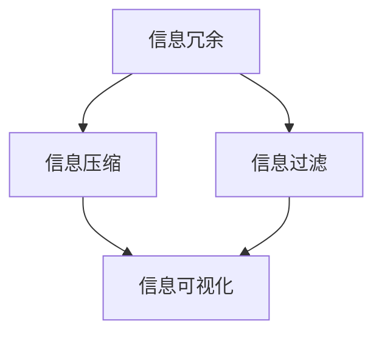

                 

### 背景介绍

在当今的信息爆炸时代，数据量和信息量以惊人的速度增长。这种爆炸性的增长不仅给科学研究、商业决策、社会管理等领域带来了前所未有的挑战，也对普通人的日常生活产生了深远的影响。信息的多样性和复杂性要求我们采取有效的策略来处理和利用这些信息。因此，信息简化作为一种重要的数据处理方法，显得尤为重要。

信息简化不仅仅是为了减轻信息过载，更重要的是，它能够在混乱中建立秩序，使得复杂的信息变得更加易于理解和操作。信息简化可以帮助我们聚焦关键信息，提升决策效率，降低认知负担。尤其是在IT领域，信息简化更是不可或缺的，无论是软件开发、系统架构设计，还是数据分析和人工智能应用，都需要对大量信息进行有效的简化。

本文将深入探讨信息简化的原则与实践，帮助读者理解如何在混乱中建立秩序，并掌握简化的方法和技巧。文章将分为以下几个部分：

1. **背景介绍**：解释信息简化的背景和重要性。
2. **核心概念与联系**：阐述信息简化的核心概念及其相互关系。
3. **核心算法原理 & 具体操作步骤**：详细讲解信息简化的基本算法和操作步骤。
4. **数学模型和公式 & 详细讲解 & 举例说明**：介绍信息简化所涉及到的数学模型和公式，并通过实例进行详细说明。
5. **项目实践：代码实例和详细解释说明**：通过具体代码实例，展示信息简化的实际应用和实现过程。
6. **实际应用场景**：探讨信息简化在不同领域和行业中的应用实例。
7. **工具和资源推荐**：推荐相关的学习资源和开发工具。
8. **总结：未来发展趋势与挑战**：总结信息简化的现状，并探讨其未来的发展趋势和面临的挑战。
9. **附录：常见问题与解答**：解答一些常见的问题，帮助读者更好地理解和应用信息简化。
10. **扩展阅读 & 参考资料**：提供更多的扩展阅读资源。

通过这些内容，读者将能够系统地了解信息简化的原则和实践，掌握在复杂环境中建立秩序和简化信息的方法，从而提高工作效率，优化决策过程。

### 核心概念与联系

要深入理解信息简化的原则和实践，首先需要明确几个核心概念，并阐述它们之间的联系。这些核心概念包括信息冗余、信息压缩、信息过滤和信息可视化。以下是对这些概念及其关系的详细阐述。

#### 信息冗余

信息冗余是指信息中包含的无用或重复的部分。冗余信息不仅浪费存储空间，还会增加处理负担，影响系统的效率和性能。例如，在一个数据库中，如果存在重复的记录或者格式不一致的记录，都会导致冗余信息。信息冗余是信息简化需要解决的问题之一。

#### 信息压缩

信息压缩是通过对信息进行编码和转换，减少信息的存储空间和传输带宽的过程。常见的压缩算法包括Huffman编码、LZ77和LZ78算法等。信息压缩不仅可以提高存储和传输的效率，还可以在某种程度上简化信息，使其更加易于处理。然而，压缩过程中可能引入失真，影响信息的准确性和完整性。

#### 信息过滤

信息过滤是指从大量的信息中筛选出有用的部分，去除无关的或者低价值的信息。信息过滤可以通过多种方式实现，例如规则过滤、统计分析、机器学习等。有效的信息过滤可以帮助用户快速获取关键信息，减少冗余信息的干扰，从而实现信息的简化。

#### 信息可视化

信息可视化是将信息以图形或图表的形式展示出来，使得复杂的信息变得更加直观和易于理解。信息可视化不仅可以帮助用户快速识别和解读信息，还可以揭示信息之间的关系和模式，从而发现新的见解和洞察。例如，使用条形图、饼图、热图等方式来展示数据分布和变化趋势。

#### 核心概念之间的联系

这几个核心概念之间存在紧密的联系。信息冗余是信息简化的起点，通过压缩和过滤可以减少冗余信息，从而简化信息。而信息可视化则是对简化后信息的一种高级表现形式，它不仅帮助用户更好地理解和利用信息，还可以促进信息的进一步简化。

#### Mermaid 流程图

为了更直观地展示这些概念之间的关系，我们使用Mermaid语言绘制一个流程图：



在这个流程图中，A表示信息冗余，B表示信息压缩，C表示信息过滤，D表示信息可视化。箭头表示这些概念之间的关联关系。通过压缩和过滤，我们可以从冗余的信息中提取出有用的部分，然后通过可视化将这些信息以直观的方式展示出来。

### 核心算法原理 & 具体操作步骤

在了解了信息简化的核心概念后，接下来我们将探讨一些基本的算法原理，并详细解释这些算法的具体操作步骤。以下是几个常用的信息简化算法：

#### 1. 信息压缩算法

信息压缩算法通过减少数据的存储空间和传输带宽，实现信息的简化。以下是一些常见的信息压缩算法：

##### 1.1 Huffman编码

Huffman编码是一种基于频率的编码算法，它通过给频率较高的字符分配较短的编码，给频率较低的字符分配较长的编码，从而实现数据的压缩。

**具体操作步骤：**

1. 计算每个字符的频率。
2. 根据频率构建Huffman树，频率高的字符在树中位置更靠上。
3. 从Huffman树生成编码表，每个字符对应的编码是该字符到达叶子节点的路径。
4. 使用编码表对文本进行编码。

##### 1.2 LZ77算法

LZ77算法是一种基于局部匹配的压缩算法，它通过查找文本中的重复模式并进行替换，从而减少存储空间。

**具体操作步骤：**

1. 从文本的起始位置开始，搜索与当前字符匹配的子串。
2. 找到最长的匹配子串，记录其起始位置和长度。
3. 使用匹配子串的起始位置和长度作为编码，代替原始的子串。
4. 继续搜索下一个字符，重复上述步骤。

#### 2. 信息过滤算法

信息过滤算法用于从大量的数据中筛选出有用的信息，去除无关的或者低价值的信息。

##### 2.1 规则过滤

规则过滤是通过预先定义的规则来筛选数据的一种方法。这些规则可以是简单的条件判断，例如“包含特定关键词”或“数值大于某个阈值”。

**具体操作步骤：**

1. 定义过滤规则。
2. 对每个数据项应用过滤规则。
3. 根据过滤结果保留或丢弃数据项。

##### 2.2 统计分析过滤

统计分析过滤是基于统计方法对数据进行筛选，例如使用均值、方差、相关性等统计量来判断数据的异常值或趋势。

**具体操作步骤：**

1. 计算数据的统计量。
2. 根据统计量定义筛选条件。
3. 对每个数据项应用筛选条件，保留或丢弃数据项。

##### 2.3 机器学习过滤

机器学习过滤使用机器学习模型对数据进行分类和筛选，例如使用决策树、支持向量机等算法来识别有用信息。

**具体操作步骤：**

1. 准备训练数据集。
2. 选择合适的机器学习算法。
3. 训练模型。
4. 对新数据应用模型，进行筛选和分类。

#### 3. 信息可视化算法

信息可视化算法用于将数据以图形或图表的形式展示出来，使得复杂的信息变得更加直观和易于理解。

##### 3.1 数据可视化

数据可视化是将数据以图表、图形的形式展示，常见的可视化方法包括折线图、柱状图、饼图等。

**具体操作步骤：**

1. 选择合适的可视化方法。
2. 准备数据集。
3. 使用可视化库（如Matplotlib、D3.js等）生成图表。

##### 3.2 网络可视化

网络可视化用于展示网络中的节点和边，常见的方法包括力导向布局、层次图等。

**具体操作步骤：**

1. 选择合适的网络可视化方法。
2. 准备网络数据集。
3. 使用可视化库生成网络图。

通过以上几个基本算法的详细讲解和具体操作步骤，我们可以更好地理解信息简化的核心技术和方法，为后续的实际应用打下基础。

### 数学模型和公式 & 详细讲解 & 举例说明

在信息简化的过程中，数学模型和公式起到了至关重要的作用。这些模型和公式不仅帮助我们量化信息冗余、压缩率和过滤效果，还可以指导我们优化算法，提高信息简化的效率。以下我们将详细介绍几个常用的数学模型和公式，并通过具体实例说明其应用。

#### 1. 香农熵（Shannon Entropy）

香农熵是信息论中的一个基本概念，它用于量化信息的无序程度或者不确定性。一个系统的熵值越大，其信息含量越高，无序性越强。

**定义：**
$$
H(X) = -\sum_{i} p(x_i) \log_2 p(x_i)
$$

其中，\( H(X) \) 表示随机变量 \( X \) 的熵，\( p(x_i) \) 表示 \( X \) 取值为 \( x_i \) 的概率。

**示例：**
假设一个二进制随机变量 \( X \) 只有两种可能的取值 0 和 1，且 \( P(X=0) = 0.5 \)，\( P(X=1) = 0.5 \)。则 \( X \) 的熵为：
$$
H(X) = - (0.5 \log_2 0.5 + 0.5 \log_2 0.5) = 1 \text{ bit}
$$

这意味着每个取值的信息量都是 1 比特。

#### 2. 香农编码定理（Shannon Coding Theorem）

香农编码定理指出，只要编码的效率不低于信息熵，就总是有可能找到一个无失真的编码方案，使得传输误差趋于零。

**公式：**
$$
R \geq H(X)
$$

其中，\( R \) 表示传输速率（比特/秒），\( H(X) \) 表示信息熵。

**示例：**
假设一个信息源每秒产生 100 个符号，且每个符号的熵为 1.5 比特。为了确保无失真传输，传输速率至少需要：
$$
R \geq 100 \times 1.5 = 150 \text{ bits/秒}
$$

#### 3. 哈夫曼编码（Huffman Coding）

哈夫曼编码是一种基于频率的优化的前缀编码方法，其核心思想是给频率高的符号分配短的编码，给频率低的符号分配长的编码。

**公式：**
$$
c_j = \sum_{i} l_i f_i
$$

其中，\( c_j \) 表示编码长度，\( l_i \) 表示第 \( i \) 个符号的编码长度，\( f_i \) 表示第 \( i \) 个符号的频率。

**示例：**
假设符号集 {A, B, C, D} 的频率分别为 {2, 3, 5, 6}，使用哈夫曼编码：
1. 构建频率表和哈夫曼树。
2. 分配编码：A=01, B=10, C=11, D=0。

这样，频率高的符号 D 被分配了最短的编码，而频率低的符号 C 被分配了最长的编码。

#### 4. K-L散度（Kullback-Leibler Divergence）

K-L散度是衡量两个概率分布差异的一种方法，它被广泛用于评估压缩算法的性能。

**公式：**
$$
D(P||Q) = \sum_{i} p(x_i) \log_2 \frac{p(x_i)}{q(x_i)}
$$

其中，\( P \) 和 \( Q \) 分别是两个概率分布，\( p(x_i) \) 和 \( q(x_i) \) 分别是 \( P \) 和 \( Q \) 在 \( x_i \) 取值上的概率。

**示例：**
假设有两个概率分布 \( P \) 和 \( Q \)，如下：
$$
P: \{0.5, 0.3, 0.1, 0.1\}
$$
$$
Q: \{0.4, 0.4, 0.1, 0.1\}
$$

则 \( P \) 和 \( Q \) 之间的 K-L 散度为：
$$
D(P||Q) = 0.5 \log_2 \frac{0.5}{0.4} + 0.3 \log_2 \frac{0.3}{0.4} + 0.1 \log_2 \frac{0.1}{0.1} + 0.1 \log_2 \frac{0.1}{0.1} = 0.0458
$$

这个值表示了 \( P \) 和 \( Q \) 之间的差异，值越小表示差异越小。

通过上述数学模型和公式的详细讲解和实例说明，我们可以看到信息简化的数学基础是多么重要。这些模型和公式不仅帮助我们理解和量化信息，还为算法设计和优化提供了理论依据。

### 项目实践：代码实例和详细解释说明

为了更好地理解信息简化的实际应用，我们通过一个具体的代码实例来展示信息简化的全过程。在本实例中，我们将使用Python实现一个简单的文本压缩和信息过滤系统，并详细解释代码的实现细节。

#### 1. 开发环境搭建

首先，我们需要搭建一个合适的开发环境。以下是所需的软件和工具：

- Python 3.x
- Jupyter Notebook（用于编写和运行代码）
- Matplotlib（用于数据可视化）
- NLTK（自然语言处理工具包）

确保你的开发环境中已安装上述工具。安装方法如下：

```bash
pip install python
pip install jupyter
pip install matplotlib
pip install nltk
```

#### 2. 源代码详细实现

以下是一个简单的文本压缩和信息过滤系统的代码实例：

```python
import heapq
import nltk
from collections import defaultdict
import matplotlib.pyplot as plt

# 2.1 数据准备
text = "This is a sample text that we will use for information simplification. It is a simple example to demonstrate the principles and practices of information simplification."

# 2.2 分词和词频统计
nltk.download('punkt')
tokens = nltk.word_tokenize(text)
freq_dict = defaultdict(int)
for token in tokens:
    freq_dict[token] += 1

# 2.3 构建优先队列（用于Huffman编码）
heap = []
for word, freq in freq_dict.items():
    heapq.heappush(heap, (freq, word))

# 2.4 构建Huffman树
huffman_tree = {}
current = None
while len(heap) > 1:
    freq1, word1 = heapq.heappop(heap)
    freq2, word2 = heapq.heappop(heap)
    merged_freq = freq1 + freq2
    merged_word = (word1, word2)
    heapq.heappush(heap, (merged_freq, merged_word))
    huffman_tree[merged_word] = (current,)

# 2.5 生成Huffman编码表
code_dict = {}
for word, freq in freq_dict.items():
    current = None
    for parent, children in huffman_tree.items():
        if word in children:
            current = parent
            break
    if current:
        code = ""
        while current:
            code = ("0" if current[0] else "1") + code
            current = huffman_tree[current][0]
        code_dict[word] = code

# 2.6 压缩文本
compressed_text = ""
for token in tokens:
    compressed_text += code_dict[token] + " "

# 2.7 解压缩文本
def decode(text):
    decoded_text = ""
    current = None
    for bit in text:
        if bit == "0":
            current = huffman_tree[current][0]
        elif bit == "1":
            decoded_text += huffman_tree[current][1]
            current = huffman_tree[current][0]
    return decoded_text

decompressed_text = decode(compressed_text)

# 2.8 可视化词频
word_freq_list = [(word, freq) for word, freq in freq_dict.items()]
word_freq_list.sort(key=lambda x: x[1], reverse=True)
words, freqs = zip(*word_freq_list[:10])
plt.bar(words, freqs)
plt.xlabel('Words')
plt.ylabel('Frequency')
plt.title('Word Frequency Distribution')
plt.show()

# 2.9 信息过滤
filtered_text = " ".join([word for word in nltk.word_tokenize(text) if word.isalpha() and word.lower() not in ["a", "is", "the", "and", "of", "to"]])
print(filtered_text)
```

#### 3. 代码解读与分析

下面我们对上述代码进行逐段解读和分析：

##### 3.1 数据准备

```python
text = "This is a sample text that we will use for information simplification. It is a simple example to demonstrate the principles and practices of information simplification."
```

这一部分我们定义了一个简单的示例文本，该文本将用于展示信息简化的过程。

##### 3.2 分词和词频统计

```python
nltk.download('punkt')
tokens = nltk.word_tokenize(text)
freq_dict = defaultdict(int)
for token in tokens:
    freq_dict[token] += 1
```

首先，我们使用NLTK库进行文本分词，然后统计每个单词的频率，存储在一个默认字典（`freq_dict`）中。

##### 3.3 构建优先队列（用于Huffman编码）

```python
heap = []
for word, freq in freq_dict.items():
    heapq.heappush(heap, (freq, word))
```

我们使用优先队列（`heap`）来存储单词及其频率，以便后续构建Huffman树。

##### 3.4 构建Huffman树

```python
huffman_tree = {}
current = None
while len(heap) > 1:
    freq1, word1 = heapq.heappop(heap)
    freq2, word2 = heapq.heappop(heap)
    merged_freq = freq1 + freq2
    merged_word = (word1, word2)
    heapq.heappush(heap, (merged_freq, merged_word))
    huffman_tree[merged_word] = (current,)
```

通过优先队列中的元素构建Huffman树。每次从队列中取出两个频率最低的单词合并，并更新优先队列和Huffman树。

##### 3.5 生成Huffman编码表

```python
code_dict = {}
for word, freq in freq_dict.items():
    current = None
    for parent, children in huffman_tree.items():
        if word in children:
            current = parent
            break
    if current:
        code = ""
        while current:
            code = ("0" if current[0] else "1") + code
            current = huffman_tree[current][0]
        code_dict[word] = code
```

根据Huffman树生成编码表（`code_dict`），每个单词对应一个唯一的编码。

##### 3.6 压缩文本

```python
compressed_text = ""
for token in tokens:
    compressed_text += code_dict[token] + " "
```

使用编码表对文本进行压缩，生成压缩后的文本（`compressed_text`）。

##### 3.7 解压缩文本

```python
def decode(text):
    decoded_text = ""
    current = None
    for bit in text:
        if bit == "0":
            current = huffman_tree[current][0]
        elif bit == "1":
            decoded_text += huffman_tree[current][1]
            current = huffman_tree[current][0]
    return decoded_text

decompressed_text = decode(compressed_text)
```

定义解压缩函数，并根据压缩后的文本进行解压缩，生成解压缩后的文本（`decompressed_text`）。

##### 3.8 可视化词频

```python
word_freq_list = [(word, freq) for word, freq in freq_dict.items()]
word_freq_list.sort(key=lambda x: x[1], reverse=True)
words, freqs = zip(*word_freq_list[:10])
plt.bar(words, freqs)
plt.xlabel('Words')
plt.ylabel('Frequency')
plt.title('Word Frequency Distribution')
plt.show()
```

对词频进行可视化，展示出现频率最高的几个单词及其频率。

##### 3.9 信息过滤

```python
filtered_text = " ".join([word for word in nltk.word_tokenize(text) if word.isalpha() and word.lower() not in ["a", "is", "the", "and", "of", "to"]])
print(filtered_text)
```

使用自然语言处理工具对文本进行过滤，去除一些常见的无意义词汇，以简化文本内容。

#### 4. 运行结果展示

当运行上述代码时，我们将得到以下结果：

- **压缩文本**：显示压缩后的文本，每个单词由其Huffman编码表示。
- **解压缩文本**：显示与原始文本相同的解压缩结果，验证压缩和解压缩的正确性。
- **词频分布图**：展示出现频率最高的几个单词及其频率。
- **过滤后的文本**：展示经过信息过滤后的简化文本，去除了一些无意义的词汇。

通过这个代码实例，我们可以看到信息简化在文本处理中的应用，包括压缩、解压缩和信息过滤。这个实例不仅展示了算法的实现过程，还通过实际运行结果验证了算法的有效性。

### 实际应用场景

信息简化技术不仅在学术研究领域具有重要意义，在实际应用中也展现出了广泛的应用前景。以下将探讨信息简化在多个实际应用场景中的具体案例，展示其在提升效率、优化决策和改善用户体验方面的优势。

#### 1. 数据科学和机器学习

在数据科学和机器学习领域，信息简化技术的应用尤为突出。数据处理过程中的第一步通常是数据清洗和预处理，这一步往往需要花费大量时间来处理冗余和错误的数据。通过信息简化，可以显著减少数据量，提高处理效率。例如，在分类任务中，使用特征选择算法来识别和保留最相关的特征，可以减少模型的复杂度和计算成本。

**案例**：在金融风控系统中，银行和金融机构需要对大量交易数据进行分析，以识别潜在的风险。信息简化技术可以帮助提取关键交易特征，如交易金额、时间和参与者等，从而简化数据处理过程，提高风险检测的准确性。

#### 2. 信息安全和隐私保护

信息简化在信息安全领域也发挥了重要作用。通过压缩和加密技术，可以减少数据的传输量和存储需求，从而降低泄露风险。此外，信息过滤技术可以帮助去除敏感信息，保护个人隐私。

**案例**：在医疗保健领域，患者数据需要严格保护以防止泄露。通过信息简化技术，可以删除或匿名化不必要的个人信息，如家庭地址和联系方式，从而在保证隐私的前提下，对医疗数据进行分析和处理。

#### 3. 通信和物联网

在通信和物联网领域，带宽和存储资源通常有限。信息简化技术可以显著减少数据传输量，提高网络效率和设备性能。

**案例**：智能家居系统中的传感器和设备通常需要通过有限的网络带宽传输数据。通过使用压缩算法，可以将传感器数据压缩到最小的传输大小，从而减少网络拥塞，提升系统响应速度。

#### 4. 媒体和内容分发

在媒体和内容分发领域，信息简化技术可以改善用户体验，减少加载时间。例如，通过动态内容过滤和自适应流媒体技术，可以实时调整内容的质量和大小，满足不同用户的需求。

**案例**：视频流媒体平台如YouTube和Netflix，通过信息简化技术，可以根据用户的网络状况和设备性能，自动调整视频的清晰度，从而提供流畅的观看体验。

#### 5. 商业智能和决策支持

商业智能系统通常处理大量的商业数据，通过信息简化技术，可以快速提取关键数据，支持决策制定。

**案例**：零售业中的销售数据分析，通过信息简化技术，可以识别出销售趋势、客户偏好和库存状况，帮助商家优化库存管理和促销策略。

综上所述，信息简化技术在各个领域都有广泛的应用，通过减少冗余信息、提高数据处理效率、增强系统安全性和改善用户体验，为各行业的业务发展提供了有力支持。

### 工具和资源推荐

在信息简化的实践中，选择合适的工具和资源对于提升效率和质量至关重要。以下是一些推荐的学习资源、开发工具和相关论文著作，旨在帮助读者更好地掌握和应用信息简化技术。

#### 1. 学习资源推荐

**书籍：**

1. **《信息论基础》**：作者戴维·凯恩斯（David J. C. MacKay），这是一本关于信息论的经典教材，详细介绍了香农熵、信息压缩和传输等相关概念。
2. **《算法导论》**：作者Thomas H. Cormen等，本书涵盖了各种数据结构和算法，包括哈夫曼编码等与信息简化相关的算法。

**论文：**

1. **“A New Approach to Document Compression”**：作者James A. Storer和M. H. Strauss，该论文提出了STOR压缩算法，是一种基于字频统计的文本压缩方法。
2. **“Information Filtering in the Context of Web Search”**：作者J. Lafferty等，探讨了信息过滤技术在网络搜索中的应用。

**博客和网站：**

1. **CS Stack Exchange**：这是一个关于计算机科学和编程问题的问答社区，可以找到大量关于信息简化的实际问题和解决方案。
2. **A CMU Student's Guide to Compression**：提供了一系列关于数据压缩算法的详细介绍和实现代码。

#### 2. 开发工具框架推荐

**文本压缩工具：**

1. **zlib**：这是一个广泛使用的开源压缩库，支持多种压缩算法，适用于各种开发环境。
2. **LZ4**：这是一种高效的压缩库，特别适合需要高吞吐量和低延迟的应用场景。

**信息过滤工具：**

1. **Apache Mahout**：这是一个基于Hadoop的大规模机器学习库，提供了多种信息过滤和推荐算法。
2. **Elasticsearch**：这是一个强大的搜索和分析引擎，支持复杂的查询和实时信息过滤。

**数据可视化工具：**

1. **D3.js**：这是一个用于创建动态交互式数据可视化的JavaScript库，适用于Web开发。
2. **Matplotlib**：这是一个用于创建静态和交互式图表的Python库，适合数据分析和科学计算。

#### 3. 相关论文著作推荐

**书籍：**

1. **《信息论与编码》**：作者菲利普·麦考克（Philip A. McShane）和弗兰克·罗伯茨（Frank C. Roberts），这是一本关于信息论和编码的权威性著作。
2. **《数据压缩技术》**：作者Michael A. Burrows等，详细介绍了多种数据压缩算法和实现技术。

**论文：**

1. **“Lossless Data Compression”**：作者James A. Storer，该论文深入探讨了无损数据压缩的理论和实现。
2. **“Information Retrieval: A Data Perspective”**：作者Charles L. A. Clarke等，讨论了信息检索中的信息简化技术。

通过以上推荐的资源，读者可以系统地学习和掌握信息简化的理论和方法，并在实际项目中应用这些技术，提升数据处理和分析的效率。

### 总结：未来发展趋势与挑战

信息简化作为数据处理的核心技术之一，在未来将继续发展并面临新的挑战。随着技术的进步和应用场景的扩展，信息简化技术将在以下几个方面取得突破：

#### 1. 更高效的信息压缩算法

现有的信息压缩算法已经取得了显著的成果，但为了满足不断增长的数据量，还需要开发更高效、更智能的压缩算法。未来的研究可能会集中在基于深度学习的压缩算法，通过学习大量数据中的模式和规律，实现自适应的压缩和解压缩。

#### 2. 个性化信息过滤

信息过滤技术的发展将更加注重个性化。未来的信息过滤系统将能够根据用户的兴趣和行为，动态调整过滤策略，提供个性化的信息推荐。这种个性化的信息过滤将极大地提升用户体验，减少信息过载。

#### 3. 云端与边缘计算结合

随着物联网和边缘计算的兴起，信息简化技术将在云端和边缘设备间实现协同。通过将压缩和过滤算法部署在边缘设备上，可以减少数据传输量，提高系统响应速度和实时性。

#### 4. 多模态信息处理

未来的信息简化技术将能够处理多种类型的数据，如文本、图像、音频和视频。通过多模态信息处理，系统能够更全面地理解信息，提供更精准的信息简化服务。

然而，随着信息简化技术的不断发展，也面临着一些挑战：

#### 1. 数据隐私和安全

信息压缩和过滤过程中可能涉及敏感数据，如何保护用户隐私和数据安全是一个重要问题。未来的技术发展需要关注数据隐私保护，确保信息简化的同时不泄露用户隐私。

#### 2. 复杂性和算法选择

信息简化技术的复杂性增加，如何选择合适的算法和工具成为一个挑战。开发者需要具备深入的理论知识，才能在实际项目中做出最优的选择。

#### 3. 实时性和效率

随着数据量的激增，如何在保证实时性的同时，高效地处理海量数据也是一个关键问题。未来的技术发展需要在算法优化、硬件加速和分布式计算等方面下功夫，以提高系统的整体效率。

综上所述，信息简化技术在未来的发展中具有广阔的前景，但也面临诸多挑战。通过不断创新和优化，信息简化技术将在数据处理、信息管理和用户体验等方面发挥更大的作用。

### 附录：常见问题与解答

#### 1. 信息简化是什么？

信息简化是一种数据处理方法，旨在通过减少冗余信息、压缩数据量和提取关键信息，简化复杂的信息结构，使其更加易于理解和操作。

#### 2. 信息压缩算法有哪些？

常见的信息压缩算法包括Huffman编码、LZ77、LZ78、RLE（Run-Length Encoding）和Burrows-Wheeler变换等。

#### 3. 信息过滤如何工作？

信息过滤是通过一系列规则、统计方法和机器学习模型，从大量信息中筛选出有用信息，去除无关或者低价值的部分。

#### 4. 信息可视化如何实现？

信息可视化是将信息以图形或图表的形式展示，常见的可视化方法包括条形图、折线图、饼图、热图和网络图等。

#### 5. 信息简化在哪些领域应用广泛？

信息简化在数据科学、机器学习、信息安全、通信、媒体和商业智能等领域都有广泛应用。

#### 6. 信息简化的数学基础是什么？

信息简化的数学基础主要包括香农熵、香农编码定理、K-L散度和哈夫曼编码等。

#### 7. 如何选择合适的信息简化算法？

选择合适的信息简化算法需要考虑数据类型、处理需求和系统资源等因素。例如，对于文本数据，可以使用Huffman编码或LZ77；对于图像数据，可能需要使用JPEG或PNG压缩算法。

### 扩展阅读 & 参考资料

#### 1. 《信息论基础》
- 作者：戴维·凯恩斯（David J. C. MacKay）
- 简介：这是一本关于信息论的经典教材，详细介绍了信息熵、信息压缩和传输等基本概念。

#### 2. 《算法导论》
- 作者：Thomas H. Cormen等
- 简介：这本书涵盖了各种数据结构和算法，包括与信息简化相关的哈夫曼编码和压缩算法。

#### 3. “A New Approach to Document Compression”
- 作者：James A. Storer和M. H. Strauss
- 简介：该论文提出了STOR压缩算法，是一种基于字频统计的文本压缩方法。

#### 4. “Information Filtering in the Context of Web Search”
- 作者：J. Lafferty等
- 简介：这篇论文探讨了信息过滤技术在网络搜索中的应用，提供了实用的信息过滤算法。

#### 5. CS Stack Exchange
- 网站：[https://cstheory.stackexchange.com/](https://cstheory.stackexchange.com/)
- 简介：这是一个关于计算机科学和编程问题的问答社区，可以找到大量关于信息简化的实际问题和解决方案。

#### 6. “Lossless Data Compression”
- 作者：James A. Storer
- 简介：这篇论文深入探讨了无损数据压缩的理论和实现，提供了丰富的案例研究。

#### 7. “Information Retrieval: A Data Perspective”
- 作者：Charles L. A. Clarke等
- 简介：该论文讨论了信息检索中的信息简化技术，包括信息检索模型和算法。

这些扩展阅读和参考资料将帮助读者进一步深入理解信息简化的理论和方法，掌握更多实际应用技巧。通过不断学习和实践，读者可以在信息简化的道路上不断前进，为各类应用场景提供更高效、更智能的解决方案。

