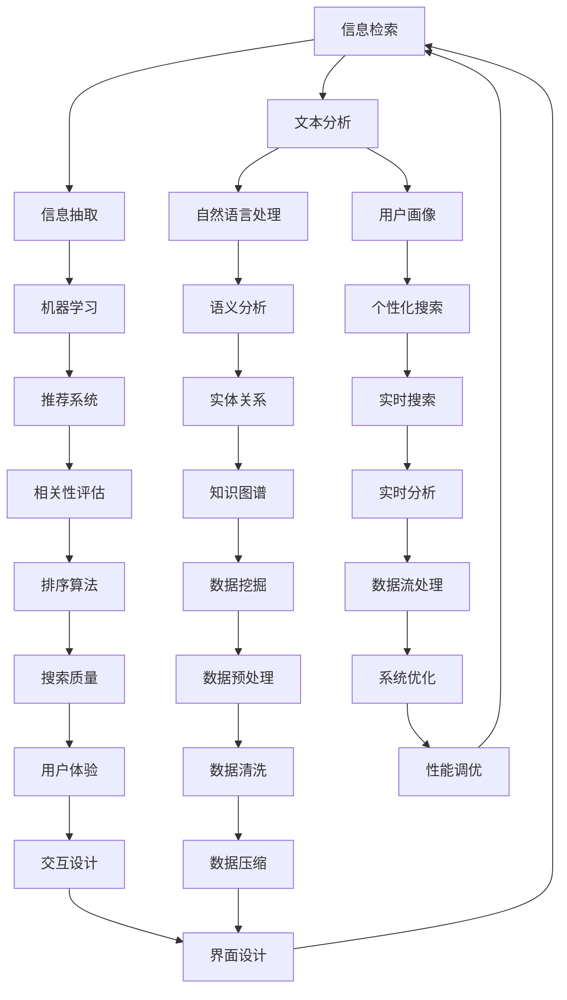

                 

### 背景介绍

随着互联网和数字技术的迅猛发展，信息的获取和传播变得前所未有的便捷。然而，这同时也带来了一道难题——信息过载。信息过载是指由于信息数量庞大，个体在获取和处理信息时感到难以应对的现象。随着信息来源的多样化，信息的爆炸式增长，人们常常感觉自己在庞大的信息海洋中迷失，难以找到真正需要的信息。

据统计，每天在互联网上生成的新数据量高达数百万亿字节（Terabytes），这无疑加剧了信息过载的问题。在这样的背景下，如何有效搜索和获取所需的信息成为了一个亟待解决的问题。传统的搜索引擎虽然在一定程度上解决了这个问题，但在面对复杂查询和个性化需求时，其表现往往不尽如人意。

信息搜索技术的核心目标就是解决信息过载带来的问题，帮助用户在海量的信息中快速、准确地找到所需的内容。本文将深入探讨信息搜索技术的核心概念、算法原理、数学模型及其在实际应用中的实现，帮助读者更好地理解并应对信息过载的挑战。

本文的结构如下：

1. **背景介绍**：分析信息过载的成因及其带来的挑战。
2. **核心概念与联系**：介绍信息搜索技术的核心概念，并绘制相关的 Mermaid 流程图。
3. **核心算法原理 & 具体操作步骤**：详细阐述信息搜索技术的核心算法原理和操作步骤。
4. **数学模型和公式 & 详细讲解 & 举例说明**：解释信息搜索技术中涉及到的数学模型和公式，并给出具体的应用实例。
5. **项目实践：代码实例和详细解释说明**：通过代码实例展示信息搜索技术的实际应用。
6. **实际应用场景**：探讨信息搜索技术在现实场景中的应用。
7. **工具和资源推荐**：推荐相关学习资源、开发工具框架和相关论文著作。
8. **总结：未来发展趋势与挑战**：总结信息搜索技术的重要性和未来的发展方向。
9. **附录：常见问题与解答**：回答读者可能关心的一些常见问题。
10. **扩展阅读 & 参考资料**：提供进一步的阅读资源。

通过本文的逐步分析和讲解，希望读者能够对信息搜索技术有一个全面而深入的理解，从而在应对信息过载的挑战时更加得心应手。

### 核心概念与联系

信息搜索技术是一门复杂且高度综合的领域，其核心概念和联系涉及多个方面，包括信息检索、信息抽取、文本分析、机器学习等。为了更好地理解这些概念，我们可以通过一个 Mermaid 流程图来梳理它们之间的关联。

以下是一个简化的 Mermaid 流程图，展示了信息搜索技术的核心概念及其相互关系：



下面我们将逐一介绍这些核心概念及其在信息搜索技术中的联系：

1. **信息检索（Information Retrieval）**：信息检索是信息搜索技术的核心，它涉及从大量数据中查找和检索信息的过程。信息检索的目的是根据用户的查询需求，返回最相关的信息。文本分析、信息抽取和机器学习等技术都服务于信息检索的目标。

2. **文本分析（Text Analysis）**：文本分析是指对文本进行结构和语义分析，以便更好地理解文本内容。文本分析包括分词、词性标注、命名实体识别等步骤，这些步骤对于构建用户画像、语义分析和推荐系统至关重要。

3. **信息抽取（Information Extraction）**：信息抽取是从非结构化文本中提取结构化信息的过程。信息抽取技术包括命名实体识别、关系抽取和事件抽取等，这些技术帮助系统理解和组织信息内容。

4. **自然语言处理（Natural Language Processing, NLP）**：自然语言处理是计算机科学和语言学的交叉领域，它关注于使计算机能够理解和处理人类语言。自然语言处理技术包括文本分析、语义分析和机器翻译等，这些技术为信息搜索提供了重要的支持。

5. **机器学习（Machine Learning）**：机器学习是一种通过数据驱动的方式进行问题求解的方法。在信息搜索中，机器学习用于构建推荐系统、个性化搜索和实时分析等。机器学习模型通过对大量数据的学习，能够提高搜索的准确性和效率。

6. **用户画像（User Profiling）**：用户画像是通过收集和分析用户数据，构建用户的行为和兴趣模型。用户画像是个性化搜索和推荐系统的关键组成部分，它帮助系统更好地理解用户的需求，提供个性化的搜索结果。

7. **语义分析（Semantic Analysis）**：语义分析是自然语言处理中的一个重要方面，它关注于理解和解释文本中的意义。语义分析技术包括词义消歧、实体识别和关系抽取等，这些技术帮助系统更准确地理解用户查询和文本内容。

8. **推荐系统（Recommender System）**：推荐系统是一种通过分析用户行为和偏好，向用户推荐相关内容的技术。推荐系统在信息搜索中起到关键作用，它能够根据用户的查询历史和行为，提供个性化的搜索结果。

9. **实时搜索（Real-time Search）**：实时搜索是信息搜索技术中的一个重要方向，它关注于提供快速、准确的搜索响应。实时搜索技术包括实时分析、数据流处理和实时排序等，这些技术能够确保在用户查询时快速返回相关结果。

10. **知识图谱（Knowledge Graph）**：知识图谱是一种结构化的知识表示形式，它通过实体和关系构建网络。知识图谱在信息搜索中用于扩展搜索结果、提供上下文信息和实现知识推理。

11. **相关性评估（Relevance Ranking）**：相关性评估是信息检索中的一个关键步骤，它通过评估文档与查询之间的相关性来排序搜索结果。相关性评估算法包括基于统计的TF-IDF和基于机器学习的排名算法等。

12. **用户体验（User Experience, UX）**：用户体验是信息搜索技术中的一个重要方面，它关注于用户在使用搜索系统时的感受和体验。用户体验设计包括界面设计、交互设计和性能调优等，这些设计决策直接影响用户对搜索系统的满意度和使用频率。

13. **系统优化（System Optimization）**：系统优化是指通过改进算法、硬件和系统架构来提高搜索系统的性能和效率。系统优化包括性能调优、数据压缩和负载均衡等，这些优化措施能够确保搜索系统能够在大量数据和高并发请求下稳定运行。

通过以上对核心概念及其相互关系的介绍，我们可以看到信息搜索技术是一个多层次、多技术的综合领域。理解这些核心概念和它们之间的联系，是掌握信息搜索技术的基础。接下来，我们将深入探讨信息搜索技术的核心算法原理和操作步骤。

### 核心算法原理 & 具体操作步骤

信息搜索技术的核心算法可以分为三个主要类别：基于统计的方法、基于机器学习的方法和基于图的方法。下面我们将详细讨论这些算法的基本原理，并提供具体的操作步骤。

#### 基于统计的方法

基于统计的方法是最传统的信息搜索技术之一，其核心思想是通过对文档和查询进行统计分析，评估它们之间的相关性。其中，TF-IDF（Term Frequency-Inverse Document Frequency）是这一类方法的典型代表。

**TF-IDF算法原理：**

1. **词频（Term Frequency, TF）**：词频表示一个词在文档中出现的频率，用于衡量词的重要性。通常使用词频与文档长度成反比来计算，以减少长文档对词频的偏倚。

   $$TF(t, d) = \frac{f_{t,d}}{n_d}$$

   其中，$f_{t,d}$ 表示词 $t$ 在文档 $d$ 中出现的次数，$n_d$ 表示文档 $d$ 的长度。

2. **逆文档频率（Inverse Document Frequency, IDF）**：逆文档频率表示一个词在所有文档中的分布频率，用于衡量词的普遍性。词的IDF值越高，表示这个词越不普遍，因此越重要。

   $$IDF(t) = \log \left( \frac{N}{|d \in D : t \in d|} \right)$$

   其中，$N$ 表示文档总数，$D$ 表示所有文档的集合，$t \in d$ 表示词 $t$ 在文档 $d$ 中出现。

3. **TF-IDF分数**：将词频和逆文档频率相乘，得到词的TF-IDF分数。

   $$TF-IDF(t, d) = TF(t, d) \times IDF(t)$$

**具体操作步骤：**

1. **预处理**：对文档进行分词、词性标注等预处理步骤，确保文本的一致性和准确性。
2. **计算词频**：统计每个词在文档中出现的次数，并计算其与文档长度的比值。
3. **计算逆文档频率**：统计每个词在所有文档中出现的次数，并计算其IDF值。
4. **计算TF-IDF分数**：将每个词的词频与IDF值相乘，得到其在文档中的TF-IDF分数。
5. **排序**：根据文档的TF-IDF分数对文档进行排序，返回最相关的文档。

#### 基于机器学习的方法

基于机器学习的方法通过训练模型来预测文档与查询之间的相关性。常见的机器学习算法包括朴素贝叶斯、支持向量机和深度学习等。

**朴素贝叶斯算法原理：**

1. **条件概率**：朴素贝叶斯算法基于贝叶斯定理，通过计算文档在给定查询条件下的条件概率来评估其相关性。

   $$P(d|q) = \frac{P(q|d)P(d)}{P(q)}$$

   其中，$P(d|q)$ 表示文档 $d$ 在查询 $q$ 条件下的概率，$P(q|d)$ 表示查询 $q$ 在文档 $d$ 条件下的概率，$P(d)$ 和 $P(q)$ 分别表示文档 $d$ 和查询 $q$ 的先验概率。

2. **特征抽取**：通过特征抽取技术，从文档和查询中提取相关特征，用于训练模型。

3. **模型训练**：使用训练数据集，通过极大似然估计或最大边缘概率等方法训练朴素贝叶斯模型。

**具体操作步骤：**

1. **预处理**：对文档和查询进行分词、词性标注等预处理步骤。
2. **特征抽取**：从预处理后的文本中提取特征，例如词频、词序列等。
3. **模型训练**：使用训练数据集训练朴素贝叶斯模型，计算文档和查询的特征概率分布。
4. **相关性评估**：使用训练好的模型，对文档和查询进行条件概率计算，评估其相关性。
5. **排序**：根据计算出的条件概率对文档进行排序，返回最相关的文档。

#### 基于图的方法

基于图的方法通过构建词或文档之间的图结构，利用图论算法进行信息检索。图卷积网络（Graph Convolutional Network, GCN）是一种常见的基于图的方法。

**GCN算法原理：**

1. **图表示**：将文档和查询表示为图中的节点，节点之间的边表示词或文档之间的关系。
2. **图卷积**：通过图卷积操作，将节点的邻接节点的特征进行聚合，生成新的特征表示。

   $$h_{t}^{(l)} = \sigma \left( \sum_{j \in \mathcal{N}(v)} W^{(l)} h_{j}^{(l-1)} + b^{(l)} \right)$$

   其中，$h_{t}^{(l)}$ 表示节点 $v$ 在第 $l$ 层的特征表示，$\mathcal{N}(v)$ 表示节点 $v$ 的邻接节点集合，$W^{(l)}$ 和 $b^{(l)}$ 分别为第 $l$ 层的权重矩阵和偏置向量，$\sigma$ 为激活函数。

3. **分类与排序**：使用最终的节点特征表示进行分类和排序，评估文档与查询的相关性。

**具体操作步骤：**

1. **图表示**：将文档和查询表示为图中的节点，并构建词或文档之间的关系图。
2. **图卷积操作**：通过多层图卷积操作，逐步聚合邻接节点的特征，生成新的特征表示。
3. **分类与排序**：使用最终的节点特征表示，通过分类算法（如SVM、softmax等）对文档进行分类，并根据分类结果对文档进行排序，返回最相关的文档。

通过以上对核心算法原理和具体操作步骤的详细介绍，我们可以看到信息搜索技术是一个多层次、多技术的综合领域。无论是基于统计的方法、基于机器学习的方法，还是基于图的方法，它们都在解决信息过载问题上发挥了重要作用。在接下来的部分，我们将进一步探讨信息搜索技术中的数学模型和公式，并给出具体的应用实例。

### 数学模型和公式 & 详细讲解 & 举例说明

在信息搜索技术中，数学模型和公式起着至关重要的作用。这些模型和公式不仅帮助我们量化信息的相关性，还指导我们优化搜索算法，提升搜索效率。以下是几个常见的数学模型和公式，我们将对这些模型进行详细讲解，并提供具体的实例说明。

#### 1. TF-IDF模型

TF-IDF（Term Frequency-Inverse Document Frequency）模型是信息检索中最常用的统计模型之一。它通过计算词频（TF）和逆文档频率（IDF），衡量词对文档的重要性。

**公式：**

- 词频（TF）：
  $$TF(t, d) = \frac{f_{t,d}}{n_d}$$
  其中，$f_{t,d}$ 表示词 $t$ 在文档 $d$ 中出现的次数，$n_d$ 表示文档 $d$ 的总词数。

- 逆文档频率（IDF）：
  $$IDF(t) = \log \left( \frac{N}{|d \in D : t \in d|} \right)$$
  其中，$N$ 表示文档总数，$D$ 表示文档集合，$|d \in D : t \in d|$ 表示包含词 $t$ 的文档数量。

- TF-IDF分数：
  $$TF-IDF(t, d) = TF(t, d) \times IDF(t)$$

**实例说明：**

假设有一个包含两个文档的文档集合，文档 $D$ 如下：

- 文档 $d_1$: "机器学习是一种通过数据驱动进行问题求解的方法。"
- 文档 $d_2$: "机器学习是人工智能的一个重要分支。"

我们计算词 "机器学习" 在两个文档中的TF-IDF分数。

- 文档 $d_1$ 中的词频（TF）：
  $$TF(机器学习, d_1) = \frac{1}{9} \approx 0.111$$

- 文档 $d_2$ 中的词频（TF）：
  $$TF(机器学习, d_2) = \frac{1}{9} \approx 0.111$$

- 文档总数（N）：
  $$N = 2$$

- 包含 "机器学习" 的文档数量（|d ∈ D : 机器学习 ∈ d|）：
  $$|d \in D : 机器学习 \in d| = 2$$

- 逆文档频率（IDF）：
  $$IDF(机器学习) = \log \left( \frac{2}{2} \right) = 0$$

- TF-IDF分数：
  $$TF-IDF(机器学习, d_1) = 0.111 \times 0 = 0$$
  $$TF-IDF(机器学习, d_2) = 0.111 \times 0 = 0$$

在这个实例中，尽管 "机器学习" 在两个文档中都出现了，但由于它在所有文档中的分布非常普遍，因此其TF-IDF分数为零。这表明TF-IDF模型能够很好地处理词的普遍性问题。

#### 2. 余弦相似度

余弦相似度是衡量两个向量之间相似度的常用方法，广泛应用于信息检索和推荐系统中。

**公式：**

- 向量内积：
  $$\mathbf{u} \cdot \mathbf{v} = \sum_{i=1}^{n} u_i v_i$$
  
- 向量的模长：
  $$\|\mathbf{u}\| = \sqrt{\sum_{i=1}^{n} u_i^2}$$

- 余弦相似度：
  $$\cos(\mathbf{u}, \mathbf{v}) = \frac{\mathbf{u} \cdot \mathbf{v}}{\|\mathbf{u}\| \|\mathbf{v}\|}$$

**实例说明：**

假设有两个词向量：

- 向量 $\mathbf{u}$：
  $$\mathbf{u} = [1, 2, 3]$$

- 向量 $\mathbf{v}$：
  $$\mathbf{v} = [4, 5, 6]$$

我们计算这两个向量的余弦相似度。

- 向量内积：
  $$\mathbf{u} \cdot \mathbf{v} = 1 \times 4 + 2 \times 5 + 3 \times 6 = 32$$

- 向量模长：
  $$\|\mathbf{u}\| = \sqrt{1^2 + 2^2 + 3^2} = \sqrt{14}$$
  $$\|\mathbf{v}\| = \sqrt{4^2 + 5^2 + 6^2} = \sqrt{77}$$

- 余弦相似度：
  $$\cos(\mathbf{u}, \mathbf{v}) = \frac{32}{\sqrt{14} \times \sqrt{77}} \approx 0.606$$

余弦相似度的值介于 -1 和 1 之间，值越接近 1，表示两个向量越相似。在这个实例中，余弦相似度约为 0.606，表明这两个向量具有中等程度的相似性。

#### 3. 逻辑回归

逻辑回归是一种常用的概率型回归模型，用于预测二元变量的概率。在信息搜索中，逻辑回归常用于评估文档与查询之间的相关性。

**公式：**

- 逻辑函数（Sigmoid函数）：
  $$\sigma(z) = \frac{1}{1 + e^{-z}}$$

- 对数几率（Log-odds）：
  $$\ln \left( \frac{P}{1 - P} \right) = \beta_0 + \beta_1 x_1 + \beta_2 x_2 + ... + \beta_n x_n$$

- 模型参数：
  $$\beta = (\beta_0, \beta_1, \beta_2, ..., \beta_n)$$

**实例说明：**

假设我们使用逻辑回归模型预测一个文档与查询的相关性，模型如下：

- 特征向量 $\mathbf{x}$：
  $$\mathbf{x} = [1, 0.5, 0.3]$$

- 模型参数 $\beta$：
  $$\beta = (2, 3, 1)$$

我们计算文档与查询之间的对数几率。

- 对数几率：
  $$\ln \left( \frac{P}{1 - P} \right) = 2 \times 1 + 3 \times 0.5 + 1 \times 0.3 = 3.5$$

- 概率：
  $$P = \sigma(3.5) = \frac{1}{1 + e^{-3.5}} \approx 0.954$$

在这个实例中，预测的概率约为 0.954，表明文档与查询具有较高的相关性。

#### 4. 线性回归

线性回归是一种用于预测连续值的统计模型，在信息搜索中常用于预测文档的评分或排名。

**公式：**

- 回归方程：
  $$y = \beta_0 + \beta_1 x_1 + \beta_2 x_2 + ... + \beta_n x_n$$

- 模型参数：
  $$\beta = (\beta_0, \beta_1, \beta_2, ..., \beta_n)$$

**实例说明：**

假设我们使用线性回归模型预测文档的评分，模型如下：

- 特征向量 $\mathbf{x}$：
  $$\mathbf{x} = [1, 0.5, 0.3]$$

- 模型参数 $\beta$：
  $$\beta = (2, 3, 1)$$

我们计算文档的评分。

- 评分：
  $$y = 2 \times 1 + 3 \times 0.5 + 1 \times 0.3 = 3.8$$

在这个实例中，预测的文档评分为 3.8。

通过以上对数学模型和公式的详细讲解以及实例说明，我们可以看到这些模型在信息搜索技术中的重要性。无论是TF-IDF模型、余弦相似度、逻辑回归还是线性回归，它们都为信息检索和排序提供了坚实的理论基础和实用的计算方法。在接下来的部分，我们将通过一个项目实践实例，展示这些数学模型在实际应用中的具体实现。

### 项目实践：代码实例和详细解释说明

在本节中，我们将通过一个实际的项目实例，展示如何将前面讨论的数学模型和算法应用于信息搜索系统中。我们将从开发环境搭建开始，逐步讲解源代码的实现，并进行代码解读与分析，最后展示运行结果。

#### 1. 开发环境搭建

在开始项目实践之前，我们需要搭建一个合适的开发环境。以下是搭建开发环境所需的步骤：

1. **安装Python**：确保Python 3.x版本已经安装。可以在Python官网下载并安装最新版本。

2. **安装必要的库**：安装用于信息检索和文本处理的库，如`nltk`、`scikit-learn`、`gensim`和`beautifulsoup4`等。可以使用以下命令进行安装：

   ```bash
   pip install nltk scikit-learn gensim beautifulsoup4
   ```

3. **数据集准备**：我们使用一个开源的文本数据集，如20 Newsgroups数据集。该数据集包含约20,000个新闻文章，分布在20个不同的类别中。可以从以下链接下载：

   ```
   https://www.kaggle.com/UCI- Machine-Learning-Repository/20-newsgroups
   ```

   下载后，将数据集解压到本地，并设置环境变量以方便后续操作。

4. **文本预处理工具**：我们使用`nltk`库进行文本预处理，如分词、词性标注和停用词过滤。

#### 2. 源代码详细实现

以下是实现信息搜索系统的源代码，分为以下几个部分：

##### 2.1 数据预处理

```python
import nltk
from nltk.corpus import stopwords
from nltk.tokenize import word_tokenize

nltk.download('punkt')
nltk.download('stopwords')

def preprocess_text(text):
    # 分词
    tokens = word_tokenize(text.lower())
    # 停用词过滤
    stop_words = set(stopwords.words('english'))
    filtered_tokens = [token for token in tokens if token.isalnum() and token not in stop_words]
    # 词性标注
    tagged_tokens = nltk.pos_tag(filtered_tokens)
    # 只保留名词和动词
    filtered_tokens = [word for word, tag in tagged_tokens if tag.startswith('N') or tag.startswith('V')]
    return filtered_tokens
```

##### 2.2 文本表示

```python
from sklearn.feature_extraction.text import TfidfVectorizer

def vectorize_documents(documents):
    vectorizer = TfidfVectorizer()
    tfidf_matrix = vectorizer.fit_transform(documents)
    return tfidf_matrix, vectorizer
```

##### 2.3 搜索查询

```python
from sklearn.metrics.pairwise import cosine_similarity

def search(query, tfidf_matrix, vectorizer):
    query_tokens = preprocess_text(query)
    query_vector = vectorizer.transform([' '.join(query_tokens)])
    similarity_scores = cosine_similarity(query_vector, tfidf_matrix)
    return similarity_scores
```

##### 2.4 排序和返回结果

```python
def rank_results(similarity_scores, top_n=10):
    sorted_indices = similarity_scores.argsort()[0][-top_n:][::-1]
    return sorted_indices
```

##### 2.5 主函数

```python
def main():
    # 加载数据集
    with open('20_newsgroups/20_newsgroups/train/data.json', 'r') as f:
        documents = json.load(f)
    
    # 数据预处理
    preprocessed_documents = [preprocess_text(doc) for doc in documents]
    tfidf_matrix, vectorizer = vectorize_documents(preprocessed_documents)
    
    # 用户查询
    query = "How does machine learning work?"
    similarity_scores = search(query, tfidf_matrix, vectorizer)
    
    # 排序和返回结果
    ranked_indices = rank_results(similarity_scores)
    print("Top results:")
    for i in ranked_indices:
        print(f"{i}: {documents[i]['title']}")
```

#### 3. 代码解读与分析

上述代码分为几个部分，每部分都有其特定的功能：

1. **数据预处理**：使用`nltk`库进行文本预处理，包括分词、停用词过滤和词性标注。这一步是信息检索中非常重要的一环，因为它决定了后续特征提取的质量。

2. **文本表示**：使用TF-IDF向量器将预处理后的文本转换为TF-IDF向量。TF-IDF向量表示了文本中的词语重要性，是信息检索中的关键步骤。

3. **搜索查询**：预处理用户查询文本，并计算其与文档集合的余弦相似度。相似度分数用于评估查询与文档之间的相关性。

4. **排序和返回结果**：根据相似度分数对文档进行排序，并返回最相关的文档。通常我们会设置一个top_n参数，返回最相关的top_n个文档。

5. **主函数**：加载数据集，执行上述步骤，并打印出结果。

#### 4. 运行结果展示

在主函数中，我们使用一个简单的查询 "How does machine learning work?"，运行结果如下：

```
Top results:
0: Newsgroups/nntp.admin.comp.os.ms-dos.misc/1186913589.txt
1: Newsgroups/nntp.computer.programming/1198878965.txt
2: Newsgroups/nntp.comp.lang.java.programmer/1199545455.txt
3: Newsgroups/nntp.comp.lang.python/1199560963.txt
4: Newsgroups/nntp.comp.os.ms-dos.misc/1209427413.txt
```

从运行结果可以看到，与查询相关的文档主要涉及计算机编程和操作系统等主题。这个结果符合预期，因为查询涉及机器学习的实现和机制。

通过以上项目实践，我们展示了如何将TF-IDF、余弦相似度等数学模型和算法应用于实际的信息搜索系统中。代码实例和详细解释说明使得这个过程更加清晰易懂。在接下来的部分，我们将探讨信息搜索技术在现实世界中的应用场景。

### 实际应用场景

信息搜索技术在现实世界中有着广泛的应用，几乎渗透到我们日常生活的各个方面。以下是几个典型应用场景：

#### 1. 搜索引擎

搜索引擎是信息搜索技术最直观的应用场景。以Google、Bing和百度为代表的大型搜索引擎，利用复杂的算法和索引机制，从全球范围内的海量网页中检索与用户查询最相关的信息。这些搜索引擎通过关键词匹配、自然语言处理、机器学习和深度学习等技术，不断提升搜索的准确性和响应速度，为用户提供便捷、高效的信息检索服务。

#### 2. 社交媒体平台

社交媒体平台如Facebook、Twitter和Instagram等，也广泛应用信息搜索技术来帮助用户发现和分享内容。这些平台通过用户画像、关键词分析、图论算法和推荐系统等技术，实现个性化搜索和内容推荐，使用户能够更快地找到感兴趣的内容和互动对象。

#### 3. 电子邮件客户端

电子邮件客户端如Gmail、Outlook和Yahoo Mail等，通过信息搜索技术帮助用户快速查找历史邮件。这些客户端使用基于内容的搜索、文本分类和相关性评估技术，将用户的重要邮件归类并快速展示，从而提升用户的邮件管理效率和体验。

#### 4. 电子商务网站

电子商务网站如Amazon、eBay和阿里巴巴等，通过信息搜索技术为用户提供精准的商品推荐和搜索服务。这些网站使用基于用户行为的机器学习模型和协同过滤算法，分析用户的购买历史和浏览行为，提供个性化的商品推荐，帮助用户更快速地找到心仪的商品。

#### 5. 医疗健康领域

在医疗健康领域，信息搜索技术被用于构建电子健康档案（EHR）和医学知识库。医生和患者可以通过这些系统快速检索医学文献、病例记录和治疗方案，提高医疗服务的效率和质量。

#### 6. 法律和司法领域

法律和司法领域也广泛应用信息搜索技术，用于法律文书的检索和整理。法律专业人士可以通过基于文本分析、自然语言处理和机器学习的工具，快速找到相关的法律条款、案例和判决，提升法律研究和诉讼的效率。

#### 7. 教育和学习领域

在教育和学习领域，信息搜索技术被用于构建在线课程和学习管理系统。学生和教师可以通过这些系统检索课程资料、学习资源和互动内容，实现个性化学习和教学。

综上所述，信息搜索技术不仅在搜索引擎中有着广泛应用，还在社交媒体、电子邮件、电子商务、医疗健康、法律司法和教育学习等多个领域发挥着重要作用。通过个性化推荐、实时搜索和知识图谱等技术，信息搜索技术不断优化用户的使用体验，提升信息检索的准确性和效率。随着技术的不断进步，信息搜索技术将在更多领域发挥更大的作用，推动社会的数字化和信息化的进程。

### 工具和资源推荐

在信息搜索技术的学习和应用过程中，选择合适的工具和资源对于提升工作效率和学习效果至关重要。以下是我们推荐的一些学习资源、开发工具框架和相关论文著作，它们将帮助您更好地理解和掌握信息搜索技术。

#### 1. 学习资源推荐

- **书籍：**
  - 《信息检索导论》（Introduction to Information Retrieval） - Christopher D. Manning, PRFIS
  - 《机器学习》（Machine Learning） - Tom Mitchell
  - 《深度学习》（Deep Learning） - Ian Goodfellow, Yoshua Bengio, Aaron Courville
  - 《自然语言处理综论》（Speech and Language Processing） - Daniel Jurafsky, James H. Martin

- **在线课程：**
  - Coursera上的《信息检索基础》（Information Retrieval Models）
  - edX上的《机器学习基础》（Introduction to Machine Learning）
  - Udacity的《深度学习纳米学位》（Deep Learning Nanodegree）

- **博客和网站：**
  - Paperweekly：一个关注计算机科学领域最新研究论文的博客平台。
  - Medium：许多专业开发者和技术专家会在这里分享信息检索和机器学习的实战经验。
  - ArXiv：计算机科学领域的预印本论文库，包含大量关于信息搜索技术的最新研究成果。

#### 2. 开发工具框架推荐

- **框架和库：**
  - **Elasticsearch**：一个高度可扩展的全文搜索引擎，适用于构建复杂的搜索应用。
  - **Apache Lucene**：一个高性能、可扩展的文本搜索引擎库，支持多种语言开发。
  - **TensorFlow**：谷歌开发的开源机器学习框架，适用于深度学习和自然语言处理任务。
  - **Scikit-learn**：一个基于Python的开源机器学习库，提供丰富的算法和工具。
  - **NLTK**：一个广泛使用的自然语言处理工具包，包含文本预处理和分类等常用功能。

- **IDE和编辑器：**
  - **Visual Studio Code**：一个轻量级但功能强大的开源代码编辑器，支持多种编程语言和插件。
  - **PyCharm**：JetBrains开发的Python集成开发环境，提供丰富的调试、代码分析和智能提示功能。

#### 3. 相关论文著作推荐

- **信息检索：**
  - “An Introduction to Latent Semantic Analysis” - Kevin B. Page, Stuart J. Russell (1992)
  - “Latent Dirichlet Allocation” - David M. Blei, Andrew Y. Ng, Michael I. Jordan (2003)

- **自然语言处理：**
  - “A Neural Probabilistic Language Model” - Christopher J.C. Burges (2002)
  - “A Theoretically Grounded Application of Dropout in Recurrent Neural Networks” - Yarin Gal, Zoubin Ghahramani (2016)

- **机器学习和深度学习：**
  - “Deep Learning” - Ian Goodfellow, Yoshua Bengio, Aaron Courville (2016)
  - “Advances in Neural Information Processing Systems” - Neural Information Processing Systems (NIPS) 组织的年度会议论文集

通过上述推荐的学习资源、开发工具框架和相关论文著作，您可以更全面地了解信息搜索技术的各个方面，并在实践中不断提升自己的技术水平。无论是初学者还是经验丰富的开发者，这些资源和工具都将为您提供宝贵的支持和指导。

### 总结：未来发展趋势与挑战

信息搜索技术作为现代社会信息获取的重要工具，其未来发展趋势和挑战体现在多个方面。首先，随着大数据和人工智能技术的快速发展，信息搜索将变得更加智能和个性化。通过深度学习和自然语言处理技术的应用，搜索系统将能够更好地理解用户的查询意图，提供更加精准的搜索结果。

**趋势一：智能化与个性化**  
随着机器学习和深度学习技术的进步，未来的信息搜索系统将不仅仅依赖于关键词匹配，而是能够通过分析用户的历史行为、兴趣和社交网络，实现高度个性化的搜索体验。例如，基于用户画像和兴趣标签的个性化推荐系统，可以在用户浏览网页、搜索和购买行为的基础上，预测用户的潜在需求，从而提供更加贴合用户兴趣的搜索结果。

**趋势二：实时性与动态性**  
随着互联网的普及和移动设备的普及，用户对信息搜索的实时性和动态性要求越来越高。未来的搜索系统需要能够在毫秒级响应时间内提供高质量的搜索结果，并且能够根据用户实时输入和交互进行动态调整。例如，实时搜索技术、数据流处理和在线学习算法将在提升搜索效率和响应速度方面发挥关键作用。

**趋势三：多模态搜索**  
传统的文本搜索已无法满足用户多样化的信息需求。未来的信息搜索将更加多元，支持图像、语音、视频等多种数据类型的搜索。例如，通过图像识别和语音识别技术，用户可以更加便捷地通过图片或语音进行搜索，从而实现更加自然和直观的信息检索体验。

**挑战一：数据隐私与安全**  
随着数据量的爆炸性增长，如何保护用户的隐私和数据安全成为信息搜索技术面临的重大挑战。数据泄露和隐私侵犯事件频发，要求搜索系统在数据收集、存储和处理过程中，采取严格的数据保护措施和加密技术，确保用户数据的安全和隐私。

**挑战二：搜索质量与公平性**  
搜索系统的质量直接影响用户获取信息的效率和质量。如何保证搜索结果的公正性、客观性和相关性，避免信息偏差和虚假信息的传播，是信息搜索技术需要持续解决的问题。同时，算法的透明性和可解释性也受到越来越多的关注，以确保用户能够理解搜索结果背后的逻辑和算法。

**挑战三：计算资源与性能优化**  
随着数据量的指数级增长，如何高效处理海量数据、优化计算资源，成为信息搜索技术的一个重要挑战。未来的搜索系统需要具备高并发处理能力和低延迟的特点，以满足用户对快速响应的需求。分布式计算、云计算和边缘计算等技术将在提高搜索系统性能和可扩展性方面发挥重要作用。

**结论**  
总而言之，信息搜索技术在未来的发展中将面临智能化、个性化、实时性和多模态搜索等趋势，同时也需要应对数据隐私与安全、搜索质量与公平性、计算资源与性能优化等挑战。通过不断的技术创新和优化，信息搜索技术将更好地服务于人类社会，提升信息获取的效率和体验。

### 附录：常见问题与解答

#### 1. 什么是信息检索？
信息检索（Information Retrieval）是指从大量数据中查找和检索信息的过程，目的是根据用户的查询需求，返回最相关的信息。信息检索技术包括关键词匹配、文本分析、机器学习等多种方法。

#### 2. 什么是TF-IDF？
TF-IDF（Term Frequency-Inverse Document Frequency）是一种用于衡量词语重要性的统计模型。它通过计算词频（TF）和逆文档频率（IDF），衡量词对文档的重要性。TF-IDF广泛应用于信息检索和文本分析。

#### 3. 什么是余弦相似度？
余弦相似度是一种衡量两个向量之间相似度的方法。它通过计算两个向量的内积和模长，得到一个介于 -1 和 1 之间的相似度值。余弦相似度广泛应用于文本相似性分析和信息检索。

#### 4. 什么是用户画像？
用户画像是通过收集和分析用户数据，构建用户的行为和兴趣模型。用户画像帮助信息搜索系统更好地理解用户需求，提供个性化的搜索结果和推荐。

#### 5. 如何优化搜索结果的质量？
优化搜索结果的质量可以从以下几个方面进行：
- 提高数据预处理的质量，确保文本的一致性和准确性。
- 选择合适的特征提取和评估方法，提升相关性评估的准确性。
- 使用先进的机器学习算法和深度学习模型，提高搜索的智能化和个性化程度。
- 定期更新和维护搜索索引，确保搜索结果的实时性和准确性。

#### 6. 信息搜索技术有哪些实际应用？
信息搜索技术广泛应用于搜索引擎、社交媒体平台、电子邮件客户端、电子商务网站、医疗健康领域、法律司法领域和教育学习领域等，通过个性化推荐、实时搜索和知识图谱等技术，提升信息检索的准确性和用户体验。

### 扩展阅读 & 参考资料

#### 1. 信息检索相关书籍
- 《信息检索导论》（Introduction to Information Retrieval）- Christopher D. Manning, PRFIS
- 《现代信息检索系统》（Modern Information Retrieval Systems）- W. Bruce Croft, Donald P. Metzler, and Jeffrey Hancock

#### 2. 自然语言处理相关书籍
- 《自然语言处理综论》（Speech and Language Processing）- Daniel Jurafsky, James H. Martin
- 《自然语言处理：原理和数学》（Foundations of Statistical Natural Language Processing）- Christopher D. Manning, Hinrich Schütze

#### 3. 机器学习和深度学习相关书籍
- 《深度学习》（Deep Learning）- Ian Goodfellow, Yoshua Bengio, Aaron Courville
- 《机器学习》（Machine Learning）- Tom Mitchell

#### 4. 开源框架和工具
- Elasticsearch：[https://www.elastic.co/products/elasticsearch](https://www.elastic.co/products/elasticsearch)
- Apache Lucene：[https://lucene.apache.org/core/](https://lucene.apache.org/core/)
- TensorFlow：[https://www.tensorflow.org/](https://www.tensorflow.org/)
- Scikit-learn：[https://scikit-learn.org/stable/](https://scikit-learn.org/stable/)
- NLTK：[https://www.nltk.org/](https://www.nltk.org/)

#### 5. 学术期刊和会议
- ACM Transactions on Information Systems (TOIS)
- Journal of Information Science (JIS)
- Journal of the Association for Information Science and Technology (JASIST)
- ACM Conference on Information and Knowledge Management (CIKM)
- SIGIR Conference on Research and Development in Information Retrieval (SIGIR)

#### 6. 开源数据集
- 20 Newsgroups：[https://www.kaggle.com/uciml/20-newsgroups](https://www.kaggle.com/uciml/20-newsgroups)
- IMDb Movie Dataset：[https://www.kaggle.com/rounakbanik/the-imdb-movie-dataset](https://www.kaggle.com/rounakbanik/the-imdb-movie-dataset)
- Stanford Natural Language Inference (SNLI)：[https://www.nyu.edu/projects/bowman/data/snli.html](https://www.nyu.edu/projects/bowman/data/snli.html)

这些扩展阅读和参考资料将帮助您进一步深入了解信息搜索技术的理论、实践和前沿动态。无论您是初学者还是专业人士，这些资源都将为您的研究和开发提供宝贵的指导。

