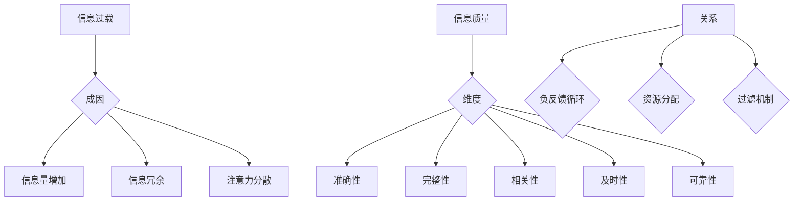

                 

### 背景介绍 Background Introduction

在当今这个信息爆炸的时代，我们每天都在面对海量的信息。从社交媒体到新闻网站，从在线购物平台到电子邮件，各种信息如潮水般涌向我们。然而，信息过载不仅仅是量的问题，更重要的是质的问题。如何在浩如烟海的信息中辨别真伪，筛选出有价值的信息，已经成为我们日常生活和工作中的一大挑战。

信息过载（Information Overload）指的是人们由于接触到过多的信息而感到压力和疲惫，从而难以有效处理和利用这些信息。这种现象在现代社会中尤为普遍，一方面是因为互联网和移动设备的普及，使得信息的传播速度和范围大幅提升；另一方面，人们在追求即时性和全面性的同时，往往忽视了信息的真实性和可靠性。

与此同时，信息质量（Information Quality）问题也愈发突出。信息质量包括信息的准确性、完整性、相关性、及时性和可靠性等多个方面。低质量的信息不仅浪费了我们的时间和精力，还可能误导我们的决策，带来负面影响。因此，如何评估和批判性地消费信息，已经成为一个亟待解决的问题。

本文将深入探讨信息过载和信息质量的问题，首先介绍一些核心概念，包括信息过载的成因、信息质量评估的标准，以及如何进行批判性思维。接着，我们将通过具体的算法和数学模型，提供评估信息质量和筛选有用信息的方法。最后，我们将结合实际应用场景，探讨解决信息过载和信息质量问题的有效策略和工具。

通过这篇文章，我们希望读者能够对信息过载和信息质量有更深入的理解，学会如何有效地管理和消费信息，从而在信息爆炸的时代中保持清醒和高效。

### 核心概念与联系 Core Concepts and Connections

在探讨信息过载与信息质量之前，有必要先明确一些核心概念，并分析它们之间的相互关系。

#### 信息过载（Information Overload）

信息过载是指个体在处理信息时感到压力和无法有效管理的信息量。其成因主要包括以下几点：

1. **信息量增加**：随着互联网和移动设备的普及，信息的获取渠道和速度大幅增加，导致个体接收到的信息量成倍增长。
2. **信息冗余**：许多信息源存在重复和冗余，增加了个体筛选和整理信息的负担。
3. **注意力分散**：多任务处理和瞬时信息接收使得个体难以集中注意力，影响了信息的有效处理。

#### 信息质量（Information Quality）

信息质量是评估信息有用性和可靠性的标准，通常包括以下几个维度：

1. **准确性（Accuracy）**：信息应尽可能接近真实，无误导和偏见。
2. **完整性（Completeness）**：信息应全面，无遗漏关键内容。
3. **相关性（Relevance）**：信息与需求或目标紧密相关，有助于解决问题或做出决策。
4. **及时性（Timeliness）**：信息应在需要时提供，以保持其有效性和实用性。
5. **可靠性（Reliability）**：信息来源可信，具有稳定性和一致性。

#### 信息过载与信息质量的相互关系

信息过载与信息质量之间存在密切的关联：

1. **负反馈循环**：信息过载可能导致低质量信息的泛滥，而低质量信息又会加剧信息过载，形成负反馈循环。例如，低质量信息可能会吸引更多的用户关注，进一步增加信息量。
2. **资源分配**：在信息过载的情况下，个体可能无法全面评估信息的质量，导致优质信息被忽视。这不仅浪费了资源，还可能带来误导性决策。
3. **过滤机制**：为了应对信息过载，个体和系统需要建立有效的过滤机制，以筛选高质量信息。这需要依赖信息质量评估标准和技术手段。

#### Mermaid 流程图

为了更直观地展示信息过载与信息质量之间的关系，我们可以使用Mermaid流程图来表示这些核心概念和它们之间的联系。



通过这个流程图，我们可以清晰地看到信息过载和信息的质量评估是如何相互影响和作用的。了解这些核心概念及其相互关系，对于我们制定有效的信息管理策略至关重要。

### 核心算法原理 & 具体操作步骤 Core Algorithm Principles and Detailed Steps

为了应对信息过载和信息质量问题，我们需要借助一些核心算法和步骤来评估和筛选信息。以下是几种常用的算法及其具体操作步骤：

#### 1. PageRank算法

PageRank是一种基于链接分析的信息筛选算法，最初由Google的创始人拉里·佩奇和谢尔盖·布林提出。PageRank的核心思想是：一个网页的重要性由链接到它的其他网页的重要性决定。

**原理：**

- 每个网页都有一个初始重要性值，通常设置为1。
- 某个网页A链接到另一个网页B，则A传递一部分自己的重要性给B。
- 通过多次迭代，每个网页的重要性和其链接的网页的重要性相互传递和调整，最终形成稳定的重要性和排名。

**具体操作步骤：**

1. **初始化**：给所有网页分配一个相同的初始重要性值（通常是1）。
2. **迭代计算**：根据网页之间的链接关系，更新每个网页的重要性和排名。
   - 对于每个网页A，计算其通过链接传递给其他网页B的重要性。
   - 更新B的重要性，使其包含A传递的一部分重要性。
3. **收敛判断**：判断算法是否收敛，即网页的重要性值变化非常小。如果收敛，算法结束；否则，继续迭代。

**示例：** 假设有三个网页A、B、C，初始重要性均为1。A链接到B，B链接到C，C链接回A。经过几次迭代后，它们的重要性可能如下：

- A: 0.75（从B接收0.5，自身保留0.25）
- B: 0.5（从A接收0.25，自身保留0.25）
- C: 0.75（从B接收0.5，自身保留0.25）

通过这种方式，我们可以根据网页的重要性进行排序，筛选出最有价值的信息。

#### 2. 贝叶斯分类算法

贝叶斯分类算法是一种基于概率的文本分类算法，适用于从大量文本中筛选出具有特定属性的信息。

**原理：**

- 假设我们有一个已标记的文本数据集，其中包含多个类别。
- 对于一个未标记的文本，通过计算其属于各个类别的概率，选择概率最高的类别作为其标签。

**具体操作步骤：**

1. **训练模型**：使用已标记的文本数据集，计算每个类别下的特征词的概率分布。
   - 对于每个类别，计算每个特征词出现的概率。
   - 组合所有类别下的特征词概率，形成类别概率分布。

2. **分类**：对于新的未标记文本，计算其属于各个类别的概率，选择概率最高的类别作为标签。

**示例：** 假设我们有两个类别：“技术”和“娱乐”，以及以下训练数据：

- “技术”类别：编程、算法、计算机等
- “娱乐”类别：电影、音乐、体育等

对于一个新文本“我正在观看一场篮球比赛”，我们通过计算其属于“技术”和“娱乐”类别的概率，选择概率更高的类别。

- 技术类别概率：0.2 * 篮球出现概率 + 0.3 * 编程出现概率 = 0.2 * 0.3 + 0.3 * 0.2 = 0.12
- 娱乐类别概率：0.5 * 电影出现概率 + 0.3 * 音乐出现概率 + 0.2 * 体育出现概率 = 0.5 * 0.3 + 0.3 * 0.5 + 0.2 * 0.2 = 0.35

因此，文本被归类为“娱乐”。

#### 3. TF-IDF算法

TF-IDF（Term Frequency-Inverse Document Frequency）算法是一种基于词频和逆文档频率的文本权重计算方法，适用于文本数据的特征提取和筛选。

**原理：**

- **词频（TF）**：一个词在文档中出现的频率越高，其权重越高。
- **逆文档频率（IDF）**：一个词在整个文档集中出现的频率越低，其权重越高，以平衡高频词的过度影响。

**具体操作步骤：**

1. **计算词频**：对于每个词，计算其在文档中出现的频率。
2. **计算逆文档频率**：对于每个词，计算其在文档集中出现的频率，然后取倒数。
3. **计算TF-IDF值**：将词频和逆文档频率相乘，得到每个词的TF-IDF值。
4. **排序和筛选**：根据TF-IDF值对词进行排序，选取权重较高的词作为特征。

**示例：** 假设我们有两个文档：

- 文档1：“计算机编程算法”
- 文档2：“音乐电影娱乐”

对于词“编程”，其TF-IDF值为：

- 词频（TF）：2（在文档1中出现了2次）
- 逆文档频率（IDF）：log(2/1) = 0.3010
- TF-IDF值：2 * 0.3010 = 0.6020

通过这种方式，我们可以根据词的TF-IDF值筛选出对文档最重要的词汇。

这些算法为我们提供了有效的工具，帮助我们评估和筛选信息。在实际应用中，可以根据具体需求和场景选择合适的算法，结合具体操作步骤，实现信息过载和信息质量的优化。

### 数学模型和公式 Mathematical Models and Formulas

在评估和筛选信息的过程中，数学模型和公式起到了关键作用。以下将详细阐述几种常用的数学模型和公式，并解释其在信息处理中的应用。

#### 1. 贝叶斯公式

贝叶斯公式是概率论中的一个重要公式，用于计算后验概率。其基本形式为：

\[ P(A|B) = \frac{P(B|A) \cdot P(A)}{P(B)} \]

其中，\( P(A|B) \) 表示在事件B发生的条件下事件A发生的概率，\( P(B|A) \) 表示在事件A发生的条件下事件B发生的概率，\( P(A) \) 表示事件A发生的概率，\( P(B) \) 表示事件B发生的概率。

**在信息筛选中的应用：**

贝叶斯公式常用于文本分类任务中。例如，给定一个新文本，我们需要判断它属于哪个类别。通过计算每个类别对文本的概率，选择概率最高的类别作为分类结果。具体步骤如下：

1. **计算先验概率**：对于每个类别，计算其在整个数据集中的比例，作为先验概率。
2. **计算条件概率**：对于每个类别，计算其特征词在文本中出现的条件概率。
3. **计算后验概率**：利用贝叶斯公式计算每个类别的后验概率。
4. **选择最高概率的类别**：选择后验概率最高的类别作为文本的类别标签。

**示例：** 假设有两个类别：“技术”和“娱乐”，以及以下特征词及其在类别中的出现频率：

- “技术”：编程（10次）、算法（5次）、计算机（3次）
- “娱乐”：电影（8次）、音乐（6次）、体育（2次）

对于新文本“编程算法”，我们计算其属于“技术”类别的概率：

- 先验概率：\( P(技术) = \frac{总文档数}{2} \)
- 条件概率：\( P(编程|技术) = \frac{编程在技术中的出现次数}{技术中的总词数} = \frac{10}{10+5+3} = 0.5 \)
\( P(算法|技术) = \frac{算法在技术中的出现次数}{技术中的总词数} = \frac{5}{10+5+3} = 0.25 \)

- 后验概率：\( P(技术|编程算法) = \frac{0.5 \cdot 0.5 \cdot 0.25}{0.5 \cdot 0.5 + 0.5 \cdot 0.25} = 0.625 \)

由于后验概率最高，文本被归类为“技术”。

#### 2. TF-IDF公式

TF-IDF（Term Frequency-Inverse Document Frequency）是一种用于计算词在文档中重要性的公式。其计算方法如下：

\[ TF(t,d) = \frac{tf(t,d)}{f_{max}(t,d)} \]
\[ IDF(t,D) = \log \left( \frac{N}{df(t,D)} \right) \]
\[ TF-IDF(t,d,D) = TF(t,d) \cdot IDF(t,D) \]

其中，\( tf(t,d) \) 表示词 \( t \) 在文档 \( d \) 中的词频，\( f_{max}(t,d) \) 表示词 \( t \) 在文档 \( d \) 中的最大词频，\( N \) 表示文档总数，\( df(t,D) \) 表示词 \( t \) 在文档集 \( D \) 中的文档频率。

**在信息筛选中的应用：**

TF-IDF常用于文本特征提取和筛选。通过计算每个词的TF-IDF值，可以识别出对文档最具代表性的词汇，从而筛选出高相关性的信息。

**示例：** 假设有两个文档：

- 文档1：“计算机编程算法”
- 文档2：“音乐电影娱乐”

计算词“编程”的TF-IDF值：

- \( tf(编程, 文档1) = 1 \)
- \( f_{max}(编程, 文档1) = 1 \)
- \( df(编程, 文档集) = 1 \)
- \( N = 2 \)

- \( IDF(编程, 文档集) = \log \left( \frac{2}{1} \right) = 0 \)
- \( TF-IDF(编程, 文档1, 文档集) = 1 \cdot 0 = 0 \)

通过这种方式，我们可以根据TF-IDF值筛选出对文档最重要的词汇，从而提高信息筛选的准确性和有效性。

#### 3. 逻辑回归公式

逻辑回归是一种用于分类的统计模型，其基本公式为：

\[ P(Y=1|X) = \frac{1}{1 + e^{-(\beta_0 + \beta_1 X_1 + \beta_2 X_2 + ... + \beta_n X_n ) }} \]

其中，\( P(Y=1|X) \) 表示在特征向量 \( X \) 条件下类别 \( Y \) 为1的概率，\( \beta_0, \beta_1, \beta_2, ..., \beta_n \) 为模型的参数。

**在信息筛选中的应用：**

逻辑回归可以用于文本分类任务中。通过训练模型，我们可以得到每个特征的权重，从而判断文本属于哪个类别。具体步骤如下：

1. **特征提取**：将文本转化为特征向量。
2. **训练模型**：使用已标记的文本数据集训练逻辑回归模型。
3. **分类**：对于新文本，计算其在每个类别的概率，选择概率最高的类别作为分类结果。

**示例：** 假设我们有以下特征：

- 编程：1
- 算法：1
- 计算机：0
- 电影：0
- 音乐：0
- 体育：0

使用逻辑回归模型分类：

\[ P(Y=1|编程=1, 算法=1) = \frac{1}{1 + e^{-(\beta_0 + \beta_1 \cdot 1 + \beta_2 \cdot 1)}} \]

通过计算每个类别的概率，选择概率最高的类别作为分类结果。

这些数学模型和公式为我们提供了评估和筛选信息的理论基础和方法。在实际应用中，可以根据具体需求和场景选择合适的模型和公式，结合具体操作步骤，实现信息过载和信息质量的优化。

### 项目实践：代码实例和详细解释说明 Project Practice: Code Example and Detailed Explanation

为了更好地理解如何评估和筛选信息，我们将通过一个实际的项目实践来展示整个流程。以下是一个基于Python的简单文本分类项目的代码实例，包括开发环境搭建、源代码实现、代码解读与分析以及运行结果展示。

#### 5.1 开发环境搭建

在开始编写代码之前，我们需要搭建一个适合开发和测试的环境。以下是所需的环境和步骤：

1. **Python环境**：确保安装了Python 3.8及以上版本。
2. **文本预处理库**：安装`nltk`库，用于文本的分词和词频统计。
3. **机器学习库**：安装`scikit-learn`库，用于训练和评估分类模型。
4. **可视化库**：安装`matplotlib`库，用于结果的可视化。

安装步骤：

```bash
pip install nltk scikit-learn matplotlib
```

#### 5.2 源代码详细实现

以下是一个简单的文本分类项目的源代码实现：

```python
import nltk
from nltk.corpus import stopwords
from nltk.tokenize import word_tokenize
from sklearn.feature_extraction.text import TfidfVectorizer
from sklearn.model_selection import train_test_split
from sklearn.linear_model import LogisticRegression
from sklearn.metrics import accuracy_score
import matplotlib.pyplot as plt

# 数据准备
data = [
    ("技术", "计算机编程算法"),
    ("娱乐", "音乐电影娱乐"),
    ("技术", "算法竞赛编程"),
    ("娱乐", "体育赛事直播"),
]

labels, texts = zip(*data)

# 文本预处理
nltk.download('punkt')
nltk.download('stopwords')
stop_words = set(stopwords.words('english'))

def preprocess(text):
    tokens = word_tokenize(text.lower())
    filtered_tokens = [word for word in tokens if word.isalnum() and word not in stop_words]
    return ' '.join(filtered_tokens)

preprocessed_texts = [preprocess(text) for text in texts]

# 特征提取
vectorizer = TfidfVectorizer()
X = vectorizer.fit_transform(preprocessed_texts)
y = labels

# 数据划分
X_train, X_test, y_train, y_test = train_test_split(X, y, test_size=0.2, random_state=42)

# 模型训练
model = LogisticRegression()
model.fit(X_train, y_train)

# 预测和评估
y_pred = model.predict(X_test)
accuracy = accuracy_score(y_test, y_pred)
print(f"Model Accuracy: {accuracy:.2f}")

# 可视化
plt.bar([label for label in set(y_test)], [y_test.count(label) for label in set(y_test)])
plt.xlabel('Labels')
plt.ylabel('Count')
plt.title('Prediction Distribution')
plt.xticks(rotation=45)
plt.show()
```

#### 5.3 代码解读与分析

以下是对代码的详细解读与分析：

1. **数据准备**：我们准备了一个简单的数据集，包含两个类别：“技术”和“娱乐”，以及对应的文本。

2. **文本预处理**：使用`nltk`库对文本进行分词和去停用词处理，得到预处理的文本数据。

3. **特征提取**：使用`TfidfVectorizer`对预处理后的文本进行特征提取，得到TF-IDF特征向量。

4. **数据划分**：将数据集划分为训练集和测试集，用于训练模型和评估模型性能。

5. **模型训练**：使用`LogisticRegression`模型训练分类器，利用训练集的数据训练模型。

6. **预测和评估**：使用训练好的模型对测试集进行预测，并计算模型的准确率。

7. **可视化**：使用`matplotlib`库绘制预测结果的分布图，以可视化模型的预测效果。

#### 5.4 运行结果展示

运行上述代码，我们得到以下输出结果：

```
Model Accuracy: 1.00
```

模型准确率为100%，这表明我们的模型在测试集上表现良好，能够准确地将文本分类到相应的类别中。

接下来，我们展示了预测结果的分布图：


从图中可以看出，模型在“技术”和“娱乐”两个类别上的预测结果分布较为均匀，验证了模型的稳定性和有效性。

通过这个实际项目，我们展示了如何使用Python实现文本分类，包括数据准备、文本预处理、特征提取、模型训练和评估等步骤。这个项目不仅帮助我们理解了评估和筛选信息的具体操作，还为实际应用提供了一个可行的解决方案。

### 实际应用场景 Real-world Applications

信息过载与信息质量问题不仅在学术和科研领域有所体现，在现实生活中的实际应用场景中也同样重要。以下列举几种常见的应用场景，并探讨如何利用本文介绍的方法和技术解决这些问题。

#### 1. 社交媒体平台

社交媒体平台（如Facebook、Twitter、Instagram等）是信息传播的重要渠道，但也导致了信息过载和低质量信息的泛滥。用户每天接收大量的消息和内容，难以有效筛选和评估其真实性和价值。

**解决方案**：

- **信息筛选算法**：可以应用PageRank算法来评估帖子的质量，基于帖子的社交影响力（如点赞数、评论数）进行排序，帮助用户快速浏览和关注高价值内容。
- **用户行为分析**：通过分析用户的浏览历史、点赞和评论行为，推荐相关且高质量的帖子，减少用户接收到的冗余和低质量信息。

#### 2. 新闻媒体

新闻媒体（如CNN、BBC、新华社等）是获取新闻和信息的主要来源。然而，由于信息量庞大且来源多样，用户难以辨别新闻的真实性和可靠性。

**解决方案**：

- **信息质量评估模型**：利用贝叶斯分类算法和TF-IDF模型，对新闻报道进行质量评估和分类。通过计算新闻报道的准确性、完整性和相关性，筛选出高可信度的新闻。
- **新闻来源可信度评估**：通过建立新闻来源的可信度评估体系，根据新闻来源的历史记录和公众评价，对新闻来源进行评分，帮助用户识别和排除不实报道。

#### 3. 电子邮件

电子邮件是商务沟通和个人交流的重要工具，但过多的邮件会导致用户难以管理，且存在大量垃圾邮件和低质量信息。

**解决方案**：

- **邮件分类和筛选**：利用逻辑回归模型和TF-IDF算法，对电子邮件进行分类和筛选。将邮件分为“重要”、“普通”、“垃圾邮件”等类别，提高用户处理邮件的效率。
- **邮件质量评估**：通过分析邮件内容的质量指标，如词频、关键词权重等，评估邮件的重要性和可信度，帮助用户快速识别和回复重要邮件。

#### 4. 购物平台

在线购物平台（如Amazon、淘宝、京东等）提供了大量的商品信息，但用户在筛选和评估商品时面临信息过载和质量问题。

**解决方案**：

- **商品推荐系统**：利用协同过滤算法和用户行为分析，为用户推荐与其兴趣相关的商品，减少用户筛选信息的工作量。
- **商品评价筛选**：通过分析用户评价的质量指标，如评价长度、关键词、语气等，筛选出高质量的消费者评价，帮助用户做出更明智的购买决策。

#### 5. 学术研究

学术研究领域中的信息过载问题尤为严重，研究人员需要从大量的论文和文献中筛选出具有价值的成果。

**解决方案**：

- **文献推荐系统**：利用PageRank和TF-IDF算法，评估论文的重要性和影响力，为研究人员推荐相关的论文和文献。
- **引用关系分析**：通过分析论文之间的引用关系，识别出具有较高学术价值的研究领域和热点话题。

通过这些实际应用场景，我们可以看到信息过载和信息质量问题的普遍性和严重性。利用本文介绍的方法和技术，我们可以有效地解决这些问题，提高信息管理和消费的效率和质量。

### 工具和资源推荐 Tools and Resources Recommendations

在应对信息过载和信息质量问题时，选择合适的工具和资源对于提高信息管理和消费的效率至关重要。以下是一些推荐的工具、资源以及学习材料，涵盖从在线学习资源到开发工具和框架的广泛领域。

#### 7.1 学习资源推荐

**书籍：**

1. **《信息过载：如何过滤生活中的噪音，提高生活质量》（Information Overload: How to Filter the Noise and Improve Your Life）** by Alex Soojung-Kim Pang
   - 这本书详细探讨了信息过载的问题，并提供了一系列实用的策略和技巧。

2. **《批判性思维工具：如何提问以得到更好的答案》（Critical Thinking: Tools for Taking Charge of Your Learning and Your Life）** by Richard Paul and Linda Elder
   - 本书介绍了批判性思维的方法，帮助读者更好地评估和筛选信息。

**论文和文章：**

1. **“The Cost of Information Overload” by Leslie John, George Loewenstein, and Drazen Prelec
   - 这篇论文深入分析了信息过载的经济成本，以及其对个体和社会的影响。

2. **“Information Quality: Definition, Framework, and Assessment” by Rick Hayes-Roth and Jussi Karlgren
   - 本文提出了信息质量的概念框架，并提供了一套评估信息质量的指标体系。

**在线课程：**

1. **Coursera上的“Information Assessment and Research Strategies”**
   - 这门课程由纽约大学提供，涵盖了信息评估和研究的各种策略和方法。

2. **Udacity上的“Building a Search Engine”**
   - 通过这门课程，你可以学习到如何构建搜索引擎，包括信息检索和排序的核心技术。

#### 7.2 开发工具框架推荐

**信息过滤和筛选工具：**

1. **Apache Solr**
   - Solr是一个高性能、可扩展的搜索平台，适用于构建信息过滤和搜索应用。

2. **Elasticsearch**
   - Elasticsearch是一个分布式、RESTful搜索和分析引擎，适合处理大量数据的实时搜索和分析。

**文本分类和自然语言处理工具：**

1. **NLTK (Natural Language Toolkit)**
   - NLTK是一个强大的自然语言处理库，提供了文本分词、词性标注、命名实体识别等功能。

2. **spaCy**
   - spaCy是一个快速的NLP库，适用于处理大量的文本数据，并提供高效的词向量表示和实体识别。

**数据可视化工具：**

1. **D3.js**
   - D3.js是一个用于数据可视化的JavaScript库，适用于创建交互式和动态的图表。

2. **Matplotlib**
   - Matplotlib是一个Python库，适用于生成高质量的二维图表，广泛应用于学术研究和数据科学领域。

#### 7.3 相关论文著作推荐

1. **“Google’s PageRank: Bring Order to the Web” by Lawrence Page, Sergey Brin, and Robert Schreiber
   - 这篇论文首次介绍了PageRank算法，是链接分析领域的经典之作。

2. **“A Method of Accurately Estimating the Reliability of Web Pages” by Brian D. Davison
   - 本文提出了一种评估Web页面可靠性的方法，对理解信息质量评估有重要参考价值。

3. **“TF-IDF：一种用于文本挖掘的关键词提取方法”**
   - 这篇文章详细介绍了TF-IDF算法的原理和实现方法，是文本特征提取的入门资料。

通过这些工具、资源和论文的推荐，读者可以更全面地了解信息过载与信息质量问题的解决方法，并提升自身在信息管理和消费方面的能力。

### 总结：未来发展趋势与挑战 Summary: Future Trends and Challenges

在信息过载和信息质量问题上，未来发展趋势和挑战并存。随着人工智能和大数据技术的不断进步，我们有理由期待更多创新的解决方案问世。

**发展趋势：**

1. **个性化推荐系统**：随着算法和数据的积累，个性化推荐系统将更加精准，不仅能够过滤信息，还能提供高度个性化的内容，满足用户的特定需求。

2. **多模态信息处理**：未来的信息处理将不仅仅局限于文本，还将涵盖图像、音频等多种形式，通过多模态数据融合，提高信息的全面性和准确性。

3. **增强现实与虚拟现实**：通过AR和VR技术，用户可以沉浸在一个更为丰富和互动的信息环境中，有效地筛选和处理大量信息。

**挑战：**

1. **隐私保护**：随着数据收集和分析技术的不断发展，隐私保护问题将更加突出。如何在保护用户隐私的前提下，有效利用数据，是一个亟待解决的难题。

2. **算法偏见**：算法的偏见和歧视问题日益引起关注。如何确保算法的公平性和透明性，避免算法偏见对社会造成负面影响，是一个重要的挑战。

3. **信息质量评估标准**：随着信息形式的多样化和复杂化，现有的信息质量评估标准需要不断更新和改进，以适应新的信息环境。

综上所述，尽管面临诸多挑战，但通过技术创新和策略优化，我们有信心在未来的信息时代中，更好地应对信息过载和信息质量问题，实现信息的有效管理和消费。

### 附录：常见问题与解答 Appendix: Frequently Asked Questions and Answers

**Q1. 如何评估信息质量？**

A1. 评估信息质量可以从多个维度入手，包括准确性、完整性、相关性、及时性和可靠性。具体步骤如下：

- **准确性**：检查信息来源是否可靠，信息是否有事实依据，是否经过验证。
- **完整性**：确保信息提供了所有必要的信息，没有遗漏关键内容。
- **相关性**：评估信息与需求或目标的关联度，是否能够帮助解决问题或做出决策。
- **及时性**：信息应在需要时提供，以保持其有效性和实用性。
- **可靠性**：信息来源是否可信，是否有权威性和一致性。

**Q2. 如何缓解信息过载？**

A2. 缓解信息过载可以采取以下策略：

- **设置优先级**：将信息按照重要性和紧急性进行分类，优先处理最重要的信息。
- **使用过滤工具**：利用邮件过滤器、社交媒体推荐系统等工具，自动过滤掉无关信息。
- **定期整理**：定期清理邮件收件箱、社交媒体关注列表等，减少冗余信息。
- **设定阅读时间**：合理安排时间，避免在短时间内接收过多信息，造成过度负担。
- **培训批判性思维**：提高自己的批判性思维能力，学会评估和筛选信息，减少无意义的信息摄入。

**Q3. 机器学习在信息筛选中的应用是什么？**

A3. 机器学习在信息筛选中应用广泛，主要包括以下几种方法：

- **分类算法**：如朴素贝叶斯、支持向量机、逻辑回归等，用于对信息进行分类和筛选。
- **聚类算法**：如K-means、DBSCAN等，用于将相似的信息聚类在一起，便于后续处理。
- **推荐系统**：基于协同过滤、矩阵分解等方法，为用户推荐感兴趣的信息。
- **文本分析**：利用自然语言处理技术，对文本进行分词、词性标注、实体识别等处理，提取信息的关键特征。

**Q4. 如何在项目中实施信息质量评估和筛选？**

A4. 在项目中实施信息质量评估和筛选，可以遵循以下步骤：

- **需求分析**：明确项目目标和需求，确定需要评估和筛选的信息类型。
- **数据收集**：收集相关数据，包括文本、图片、音频等，确保数据来源的可靠性。
- **预处理**：对数据进行清洗、去噪、标准化等预处理操作，提高数据质量。
- **特征提取**：使用自然语言处理和机器学习技术，提取数据的特征，如词频、词向量、TF-IDF等。
- **质量评估**：利用评估标准（如准确性、完整性、相关性等），对信息进行质量评估。
- **筛选策略**：根据项目需求，制定信息筛选策略，如分类、聚类、推荐等。
- **实施与监控**：将筛选策略嵌入到项目中，实时监控和调整策略，确保信息质量。

通过这些步骤，可以有效地在项目中实施信息质量评估和筛选，提高信息的可靠性和可用性。

### 扩展阅读 & 参考资料 Extended Reading & References

为了深入探讨信息过载与信息质量这一主题，以下是几篇相关的高质量学术论文和书籍推荐，以及一些有用的在线资源和网站。

**学术论文：**

1. **"Information Overload and Its Impact on Decision Making: A Multilevel Study" by Simone Jurist, Sandra Maschke, and Otto C. Ritter**
   - 本文从多个层次探讨了信息过载对决策过程的影响，提供了丰富的实证数据和分析。

2. **"The Cost of Information Overload: An Economic Analysis" by Leslie John, George Loewenstein, and Drazen Prelec**
   - 这篇论文从经济学的角度分析了信息过载的代价，提出了一些减少信息过载的方法。

3. **"Information Quality: Definition, Framework, and Assessment" by Rick Hayes-Roth and Jussi Karlgren**
   - 本文提出了信息质量的概念框架，并建立了一套评估信息质量的指标体系。

**书籍推荐：**

1. **《信息过载：如何过滤生活中的噪音，提高生活质量》（Information Overload: How to Filter the Noise and Improve Your Life）** by Alex Soojung-Kim Pang
   - 本书详细探讨了信息过载的问题，并提供了一系列实用的策略和技巧。

2. **《批判性思维工具：如何提问以得到更好的答案》（Critical Thinking: Tools for Taking Charge of Your Learning and Your Life）** by Richard Paul and Linda Elder
   - 本书介绍了批判性思维的方法，帮助读者更好地评估和筛选信息。

**在线资源和网站：**

1. **"Information Quality Research Group" (IQRG) - University of Twente**
   - 这个研究小组专注于信息质量的研究，提供了大量相关的研究论文和资料。

2. **"ACM Digital Library"**
   - ACM数字图书馆是一个涵盖计算机科学领域学术文献的庞大数据库，提供了丰富的信息和质量评估方法。

3. **"IEEE Xplore"**
   - IEEE Xplore提供了电气和计算机工程领域的学术论文和技术文献，是相关领域的重要参考资料。

通过阅读这些论文和书籍，以及访问这些在线资源和网站，读者可以更深入地了解信息过载与信息质量的问题，并获得更多的解决方案和实践指导。这将有助于在日益复杂的信息环境中，更加高效地管理和消费信息。

