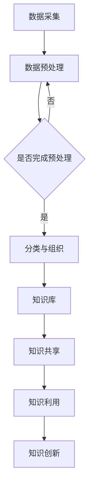

                 

### 1. 背景介绍

在当今信息化社会，数据爆炸性增长的现象已是不争的事实。无论是企业内部的信息资源，还是互联网上的海量数据，如何高效地组织和检索信息，成为各个领域面临的重要课题。信息过载问题日益凸显，不仅消耗了大量的时间和精力，还可能导致关键信息的遗漏和误用。

为了解决信息过载问题，企业和组织开始着手建设知识管理系统（Knowledge Management System，KMS）。知识管理系统是一种旨在通过技术手段和组织策略，实现知识和信息的有效收集、存储、共享、利用的系统。它的核心目的是提高组织的知识共享水平，促进知识创新，从而提升组织的竞争力和创新能力。

知识管理系统通常包括以下几个关键组成部分：

1. **知识采集与存储**：通过数据采集工具和自动化系统，将分散的信息集中存储在知识库中。
2. **知识分类与组织**：对存储的信息进行分类和组织，便于用户快速检索和查找。
3. **知识共享与协作**：提供共享平台，支持团队成员之间的信息交流和协作。
4. **知识利用与更新**：通过智能化工具，如搜索引擎、推荐系统等，帮助用户高效利用知识，同时确保知识的及时更新和准确性。

本文将深入探讨信息过载与知识管理系统实施的相关问题，通过逐步分析其核心概念、算法原理、数学模型以及实际应用，为读者提供一套完整、有效的信息管理和检索指南。

## 1.1 信息过载的现象与影响

### 信息过载的定义与表现

信息过载（Information Overload）是指接收到的信息量超出个人处理能力，导致无法有效管理和利用信息的现象。在现代社会，信息过载主要表现为以下几个方面的特征：

1. **数据量庞大**：互联网的快速发展使得信息源变得极为丰富，各种信息如潮水般涌来，难以筛选和消化。
2. **信息质量参差不齐**：由于信息的爆炸性增长，许多信息质量较低，甚至存在误导性和虚假信息。
3. **信息冗余**：许多信息在多个渠道重复传播，导致用户难以区分哪些是关键信息，哪些可以忽略。
4. **处理难度大**：面对海量的信息，人们往往难以迅速做出判断和处理，容易导致心理疲劳。

### 信息过载的影响

信息过载对个人和企业的影响是多方面的：

1. **效率低下**：在处理大量信息时，人们往往需要花费更多的时间和精力，导致工作效率降低。
2. **决策困难**：信息过载使得决策者难以在短时间内获取到关键信息，从而影响决策的质量和速度。
3. **心理压力**：持续的、大量信息接收会对人们的心理健康产生负面影响，如焦虑、压力等。
4. **知识遗忘**：由于信息过多，人们容易遗忘重要信息，导致知识积累不足。

### 信息过载的原因

信息过载现象的产生主要有以下几个原因：

1. **信息源多样化**：互联网的普及使得人们接触到的信息来源更加多样，信息量大幅增加。
2. **技术发展**：信息技术的快速发展使得信息采集、存储和传播变得更加便捷，信息生成速度远超人类的处理能力。
3. **商业需求**：许多企业和组织为了营销、推广等目的，大量投放信息，加剧了信息过载的问题。
4. **用户习惯**：人们在面对海量信息时，往往倾向于被动接收，缺乏有效的筛选和过滤机制。

通过以上分析，我们可以看到信息过载是一个复杂的社会现象，需要从多个角度进行综合治理。接下来，我们将进一步探讨知识管理系统如何应对信息过载问题，提高信息的组织和利用效率。

## 1.2 知识管理系统的概念与构成

### 知识管理系统的定义

知识管理系统（Knowledge Management System，KMS）是一种通过技术手段和组织策略，实现知识和信息有效收集、存储、共享、利用的系统。它旨在解决信息过载问题，提高信息利用率，促进知识的创新和应用。

### 知识管理系统的构成

一个典型的知识管理系统通常由以下几个核心组成部分构成：

1. **知识库**：知识库是知识管理系统的核心，用于存储和组织各种知识和信息。知识库中的信息可以是结构化的，如数据库中的数据；也可以是非结构化的，如文档、图片、音频和视频等。

2. **数据采集系统**：数据采集系统负责从各种信息源中收集数据，包括内部系统的数据、外部互联网的数据等。采集的数据会经过清洗、分类和预处理，然后存储到知识库中。

3. **分类与组织系统**：分类与组织系统通过对知识库中的信息进行分类、标签化等处理，使其变得更加有序和易于检索。这一过程通常涉及自然语言处理、机器学习等技术。

4. **共享与协作平台**：共享与协作平台提供了一个交互式的环境，使团队成员可以方便地共享知识、协作解决问题。平台通常包括论坛、即时通讯工具、文档共享功能等。

5. **知识利用工具**：知识利用工具如搜索引擎、推荐系统、知识地图等，帮助用户高效地查找和利用知识。这些工具利用自然语言处理、数据挖掘等技术，为用户提供个性化的知识服务。

6. **知识更新机制**：知识更新机制确保知识库中的信息始终保持最新和准确。这通常涉及定期的数据更新、信息验证等流程。

### 知识管理系统的目标

知识管理系统的核心目标是：

1. **提高知识共享水平**：通过技术手段和组织策略，促进知识的传递和共享，减少信息孤岛现象。
2. **促进知识创新**：提供一个良好的知识交流和协作环境，激发团队成员的创新思维，推动知识创新。
3. **提升决策效率**：为决策者提供准确、及时的知识支持，帮助他们在短时间内做出更高质量的决策。
4. **增强企业竞争力**：通过提高知识的利用率和创新力，提升企业的整体竞争力。

总的来说，知识管理系统是应对信息过载问题的重要工具，它通过技术手段和组织策略，实现了信息的有序管理和高效利用，为企业提供了强大的知识支持和创新动力。

### 1.3 知识管理系统的发展历史与现状

知识管理系统的发展可以追溯到20世纪80年代，当时主要依赖于专家系统和企业内网来促进知识的共享和利用。随着信息技术和互联网的快速发展，知识管理系统逐渐演变并融入了更多的先进技术，如数据挖掘、人工智能、自然语言处理等。

#### 1.3.1 发展阶段

1. **早期阶段（20世纪80年代至90年代中期）**：
   - **核心技术**：专家系统、数据库、电子邮件。
   - **主要应用**：主要应用于大型企业内部的知识共享，例如专利管理、产品设计文档等。

2. **发展阶段（20世纪90年代中期至21世纪初）**：
   - **核心技术**：企业资源计划（ERP）、客户关系管理（CRM）、内容管理系统（CMS）。
   - **主要应用**：随着互联网的普及，知识管理系统开始应用于更多的业务场景，如客户服务、销售管理、项目管理等。

3. **成熟阶段（21世纪初至今）**：
   - **核心技术**：数据挖掘、大数据分析、人工智能、云计算。
   - **主要应用**：知识管理系统逐渐成为企业信息化建设的重要组成部分，广泛应用于各个行业，如金融、医疗、教育等。

#### 1.3.2 当前现状

1. **广泛应用**：知识管理系统已成为企业提升核心竞争力的重要工具，被广泛应用于各个行业和领域。

2. **技术创新**：随着人工智能、大数据分析等技术的发展，知识管理系统在智能化、自动化方面取得了显著进展，如智能问答、自动化知识推荐等。

3. **挑战与机遇**：尽管知识管理系统在许多方面取得了成功，但同时也面临着诸多挑战，如数据隐私、知识共享文化的建设等。未来，知识管理系统的发展将更加注重用户体验和智能化水平的提升。

综上所述，知识管理系统经历了从早期阶段到成熟阶段的演变，当前正处于快速发展的阶段。随着技术的不断进步，知识管理系统将在未来的信息化社会中发挥更加重要的作用。

### 1.4 知识管理系统与传统信息管理的区别

知识管理系统与传统信息管理在目标和实现方法上有显著的差异。首先，从目标来看，传统信息管理侧重于信息的收集、存储、传输和利用，主要关注的是如何确保信息的高效流通和准确传递。而知识管理系统则更加注重于知识的共享、创新和应用，其目标是实现知识的高效组织和利用，以促进组织的学习和创新。

#### 1.4.1 实现方法的差异

1. **信息管理**：
   - **数据采集与存储**：传统信息管理通常依赖于数据库、文件系统等工具来收集和存储信息，重点在于信息的准确性、完整性和安全性。
   - **信息传输**：通过内部网络、电子邮件等方式进行信息传输，确保信息能在组织内部快速流通。
   - **信息利用**：利用报表、查询工具等实现对信息的检索和利用，通常依赖于用户主动查询和调用。

2. **知识管理**：
   - **知识采集与存储**：知识管理不仅涉及结构化数据的存储，还包括对非结构化数据的处理，如文档、图片、视频等。此外，知识管理强调知识的多维度存储，包括显性知识和隐性知识。
   - **知识传输**：通过知识共享平台、协作工具等，促进知识的跨部门、跨团队传递，强调知识的共享性和透明性。
   - **知识利用**：利用知识地图、智能问答、推荐系统等工具，实现知识的自动化推荐和利用，提高知识获取的效率。

#### 1.4.2 价值差异

1. **信息管理**：
   - **价值**：主要在于提高信息的利用效率和准确性，确保信息在组织内部的高效流通。
   - **局限性**：由于过分依赖于用户主动查询和信息检索，信息管理的价值往往受到用户信息素养的限制。

2. **知识管理**：
   - **价值**：知识管理不仅提高了信息的利用效率，更重要的是通过知识的共享和创新，提升了组织的整体竞争力和创新能力。
   - **局限性**：知识管理对组织文化、知识共享氛围等有较高的要求，实施过程中需要克服诸多障碍。

通过以上分析，我们可以看出知识管理系统与传统信息管理在目标、实现方法和价值方面有显著的不同。知识管理系统通过更加智能化、自动化的方式，实现了知识的高效组织和利用，为组织带来了更大的价值。在信息化社会中，知识管理系统的重要性日益凸显，将成为企业提升核心竞争力的关键因素。

### 1.5 知识管理系统实施的步骤和方法

实施知识管理系统是一项复杂的工程，需要科学的规划和方法。以下是知识管理系统实施的主要步骤和方法：

#### 1.5.1 需求分析

1. **明确目标**：首先，需要明确知识管理系统实施的目标和预期效果，如提高知识共享水平、促进知识创新等。
2. **需求调研**：通过问卷调查、访谈、工作坊等形式，了解组织内部的知识需求和现状，包括知识类型、分布情况、使用频率等。
3. **需求分析**：根据调研结果，对需求进行整理和分析，明确知识管理系统所需的功能和模块。

#### 1.5.2 系统设计

1. **架构设计**：根据需求分析结果，设计知识管理系统的总体架构，包括知识库、数据采集系统、分类与组织系统、共享与协作平台等。
2. **界面设计**：设计用户友好的界面，确保用户能够轻松地使用系统，包括信息检索、知识共享、协作工具等。
3. **功能模块设计**：详细设计各个功能模块，如知识采集、分类、标签化、共享、利用等。

#### 1.5.3 技术选型

1. **数据库选型**：根据数据量和查询需求，选择合适的数据库系统，如关系型数据库（如MySQL）或NoSQL数据库（如MongoDB）。
2. **开发工具和框架**：选择适合知识管理系统开发的工具和框架，如Java、Python、Spring等。
3. **集成技术**：确定与其他系统（如ERP、CRM等）的集成方案，确保数据的高效传递和利用。

#### 1.5.4 系统开发

1. **需求文档编写**：根据需求分析和设计结果，编写详细的开发需求文档。
2. **编码实现**：按照需求文档进行编码，开发各个功能模块。
3. **测试与调试**：在开发过程中，进行持续测试和调试，确保系统的稳定性和性能。

#### 1.5.5 系统部署

1. **环境准备**：准备服务器、数据库等基础设施，确保系统的正常运行。
2. **系统安装**：将开发完成的系统安装到服务器上，并进行配置。
3. **数据迁移**：将现有数据迁移到新系统中，确保数据的完整性和一致性。

#### 1.5.6 系统培训与推广

1. **用户培训**：组织用户培训，使员工了解系统的使用方法和功能。
2. **宣传推广**：通过内部邮件、海报、培训等形式，宣传知识管理系统的重要性，鼓励员工积极参与。
3. **反馈收集**：收集用户反馈，对系统进行持续优化和改进。

#### 1.5.7 系统评估与优化

1. **效果评估**：定期评估知识管理系统的实施效果，如知识共享水平、知识创新效果等。
2. **用户满意度调查**：通过问卷调查、用户访谈等方式，了解用户对系统的满意度。
3. **持续优化**：根据评估结果和用户反馈，对系统进行持续优化和改进。

通过以上步骤和方法，可以有效地实施知识管理系统，提高组织的知识管理能力，促进知识的共享和创新，从而提升组织的核心竞争力。在实施过程中，需要充分考虑组织的特点和需求，确保系统的实用性和可操作性。

### 1.6 知识管理系统在现实中的应用案例

知识管理系统在现实中的应用已经取得了显著的成果，以下是一些实际案例，展示了知识管理系统在不同行业和领域中的成功应用。

#### 1.6.1 金融行业

在金融行业，知识管理系统被广泛应用于风险管理、投资决策和客户服务等方面。例如，某大型商业银行通过构建知识管理系统，实现了客户数据的集中存储和统一管理，大大提高了客户服务水平。同时，系统提供了强大的数据分析工具，帮助银行管理人员快速获取市场动态和客户需求，提高了投资决策的准确性。

#### 1.6.2 医疗行业

在医疗行业，知识管理系统主要用于医疗知识的共享和临床决策支持。例如，某知名医院通过建立知识管理系统，将大量的临床案例、医疗文献和专家经验进行整合和分类，为医生提供便捷的查询和学习工具。这不仅提高了医生的诊疗水平，还降低了医疗错误率，提高了医疗服务的质量。

#### 1.6.3 教育行业

在教育行业，知识管理系统主要用于教学资源的共享和管理。例如，某高校通过知识管理系统，实现了课程资料、教学视频、学生作业等教学资源的集中管理和共享。系统提供了智能推荐功能，根据学生的学习兴趣和需求，推荐相关的学习资源和课程，大大提高了教学效率和学习效果。

#### 1.6.4 制造业

在制造业，知识管理系统主要用于产品设计、生产管理和质量控制。例如，某制造企业通过知识管理系统，将产品设计过程中的各类知识进行统一存储和管理，确保设计数据的完整性和一致性。同时，系统提供了强大的知识检索和协作工具，帮助工程师快速获取所需的设计经验和参考案例，提高了设计效率和质量。

#### 1.6.5 创新型企业

在创新型企业，知识管理系统主要用于知识创新和项目协作。例如，某高科技企业通过知识管理系统，实现了研发团队之间的知识共享和协作。系统提供了丰富的知识库和协作工具，如文档共享、即时通讯、任务管理等，为项目团队的协同工作提供了强大的支持，大大提高了项目进展速度和成功率。

#### 1.6.6 成功经验与挑战

从上述案例中，我们可以总结出一些成功的经验和面临的挑战：

1. **成功经验**：
   - **明确目标**：在实施知识管理系统前，明确系统的目标和预期效果，确保系统能够满足实际需求。
   - **用户参与**：鼓励用户积极参与系统的设计和使用，确保系统的实用性和用户满意度。
   - **持续优化**：根据用户反馈和实际使用情况，对系统进行持续优化和改进，确保系统的高效运行。

2. **面临的挑战**：
   - **数据安全**：如何确保数据的安全性和隐私性，是知识管理系统面临的一个重要挑战。
   - **知识共享文化**：在组织内部建立知识共享文化，促进知识的流动和共享，需要时间和持续的努力。
   - **技术选型**：选择合适的技术和工具，确保系统的性能和可扩展性，是系统成功实施的关键。

综上所述，知识管理系统在现实中的应用已经取得了显著成效，通过成功的案例和经验，我们可以更好地理解和实施知识管理系统，提高组织的知识管理能力，促进知识的创新和应用，从而提升组织的核心竞争力。

## 2. 核心概念与联系

在探讨知识管理系统的核心概念及其相互联系时，我们需要明确几个关键术语，并对它们之间的关系进行梳理。

### 2.1 关键术语

1. **知识库（Knowledge Base）**：
   知识库是知识管理系统的核心组成部分，用于存储和组织各种知识和信息。它通常包括结构化数据（如数据库记录）和非结构化数据（如文档、图片、视频等）。知识库的设计和实现直接影响到系统的性能和可扩展性。

2. **数据采集（Data Collection）**：
   数据采集是指从各种信息源（如内部系统、互联网、传感器等）收集数据的过程。数据采集的准确性和完整性对知识库的质量至关重要。

3. **分类与组织（Classification and Organization）**：
   分类与组织是对知识库中的信息进行分类、标签化等处理，使其更加有序和易于检索。这一过程通常涉及自然语言处理、机器学习等技术，以提高信息的利用效率。

4. **知识共享（Knowledge Sharing）**：
   知识共享是指通过技术手段和组织策略，促进知识和信息的跨部门、跨团队传递和共享。知识共享平台和协作工具是实现知识共享的关键。

5. **知识利用（Knowledge Utilization）**：
   知识利用是指用户通过知识管理系统查找、检索和利用知识的过程。智能问答、知识地图、推荐系统等工具可以帮助用户高效地利用知识。

6. **知识创新（Knowledge Innovation）**：
   知识创新是指通过知识的共享、碰撞和融合，产生新的知识和思想，推动组织的持续创新和发展。

### 2.2 核心概念之间的联系

知识管理系统的核心概念之间存在着紧密的联系，这些联系构成了系统的整体架构和运作机制。

1. **知识库与数据采集**：
   数据采集是知识库建设的基石。只有通过高效、准确的数据采集，才能确保知识库中的数据质量和完整性。数据采集系统需要能够从多种信息源中提取数据，并进行初步的处理和清洗。

2. **分类与组织与知识库**：
   分类与组织是对知识库中的数据进行处理的过程。通过合理的分类和标签化，可以提高信息的可检索性和利用率。分类与组织系统通常依赖于自然语言处理和机器学习技术，以实现自动化和智能化。

3. **知识共享与知识库**：
   知识共享平台和协作工具依赖于知识库中的信息资源。通过这些工具，用户可以方便地查找、共享和利用知识库中的信息。知识共享不仅促进了知识的流动，也为知识的创新提供了基础。

4. **知识利用与知识库**：
   知识利用是知识管理系统的最终目标。通过知识地图、智能问答和推荐系统等工具，用户可以高效地检索和利用知识库中的信息。知识利用的有效性直接影响到系统的价值和用户的满意度。

5. **知识创新与知识共享**：
   知识创新是知识管理系统的高级目标。通过知识的共享和碰撞，可以激发新的想法和创新。知识创新不仅推动了组织的知识积累，也促进了组织的持续发展。

### 2.3 Mermaid 流程图

为了更直观地展示知识管理系统中的核心概念及其相互关系，我们使用Mermaid语言绘制了一个流程图，如下所示：



在这个流程图中，数据采集是系统的起点，经过数据预处理和分类与组织后，数据被存储到知识库中。知识库中的信息通过知识共享平台和协作工具进行共享，用户利用这些工具高效地查找和利用知识。知识利用的结果可以进一步激发知识创新，推动组织的持续发展。

通过这个流程图，我们可以清晰地看到知识管理系统中各个核心概念之间的逻辑关系和运作机制。这不仅有助于理解知识管理系统的基本原理，也为系统的设计和实施提供了参考。

## 3. 核心算法原理 & 具体操作步骤

在知识管理系统中，核心算法起着至关重要的作用，它们决定了知识库的构建、信息的检索与利用效果。以下是几个关键算法的原理及其具体操作步骤。

### 3.1 数据采集算法

数据采集算法是知识管理系统的基础，它的目标是高效地从各种信息源中收集数据，并将其存储到知识库中。

#### 算法原理

数据采集算法通常采用以下几种技术：

1. **网络爬虫（Web Crawler）**：通过爬虫技术，从互联网上抓取公开的数据源。
2. **API 接口调用**：直接调用第三方数据源的API接口，获取数据。
3. **传感器采集**：从物联网设备中获取实时数据。

#### 具体操作步骤

1. **定义数据源**：确定需要采集的数据源，包括网站、API接口、传感器等。
2. **数据采集**：编写爬虫脚本或调用API接口，定期从数据源中获取数据。
3. **数据预处理**：对采集到的数据进行清洗、去重、格式转换等处理。
4. **数据存储**：将预处理后的数据存储到知识库中，确保数据的完整性和一致性。

### 3.2 分类与组织算法

分类与组织算法用于对知识库中的信息进行分类、标签化，使其更加有序和易于检索。

#### 算法原理

分类与组织算法通常采用以下几种技术：

1. **关键词提取**：通过自然语言处理技术，提取文档中的关键词。
2. **机器学习分类**：利用机器学习算法，对信息进行自动分类。
3. **主题模型**：通过主题模型（如LDA），挖掘文本数据中的潜在主题。

#### 具体操作步骤

1. **关键词提取**：对文档进行分词，提取关键词。
2. **构建分类体系**：根据业务需求，构建分类体系，定义类别和标签。
3. **分类**：利用机器学习算法，对文档进行分类。
4. **标签化**：对分类后的文档添加标签，以便于检索和利用。

### 3.3 检索算法

检索算法用于帮助用户高效地查找知识库中的信息。

#### 算法原理

检索算法通常采用以下几种技术：

1. **全文检索**：利用搜索引擎技术，对全文进行检索。
2. **关键词匹配**：通过关键词匹配算法，查找包含特定关键词的文档。
3. **向量空间模型**：利用向量空间模型，计算文档和查询之间的相似度。

#### 具体操作步骤

1. **构建索引**：对知识库中的文档进行索引，建立索引结构。
2. **查询处理**：接收用户的查询请求，进行预处理。
3. **相似度计算**：利用向量空间模型，计算查询和文档之间的相似度。
4. **结果排序**：根据相似度排序结果，返回匹配的文档列表。

### 3.4 推荐算法

推荐算法用于向用户推荐相关的知识和信息。

#### 算法原理

推荐算法通常采用以下几种技术：

1. **基于内容的推荐**：根据用户的历史行为和兴趣，推荐相似的内容。
2. **协同过滤推荐**：通过分析用户之间的行为相似性，推荐用户可能感兴趣的内容。
3. **混合推荐**：结合多种推荐算法，提供更精准的推荐结果。

#### 具体操作步骤

1. **用户行为分析**：收集并分析用户的行为数据，如浏览记录、点赞、评论等。
2. **内容特征提取**：提取文档的内容特征，如关键词、主题等。
3. **推荐计算**：根据用户行为和内容特征，计算推荐结果。
4. **推荐展示**：将推荐结果展示给用户，提高用户的满意度。

通过以上几个核心算法的介绍和具体操作步骤，我们可以看到，知识管理系统的有效运作离不开这些关键算法的支持。每个算法都有其独特的原理和应用场景，通过对这些算法的深入理解和灵活应用，可以显著提升知识管理系统的性能和用户体验。

### 4. 数学模型和公式 & 详细讲解 & 举例说明

在知识管理系统中，数学模型和公式是理解和优化算法性能的重要工具。以下将详细介绍几个关键数学模型及其在实际应用中的详细讲解和举例说明。

#### 4.1 向量空间模型（Vector Space Model）

向量空间模型是一种将文本数据表示为向量集合的方法，主要用于文本相似度计算和信息检索。

**定义**：
向量空间模型将每个文本文档表示为一个向量，向量的每一个维度对应一个特征词（词袋模型中的词）。假设有 $n$ 个特征词，$d$ 个文档，文档 $i$ 的向量表示为 $\vec{d}_i = (d_{i1}, d_{i2}, ..., d_{id})$，其中 $d_{ij}$ 表示文档 $i$ 中特征词 $j$ 的出现频率。

**公式**：
$$
\vec{d}_i = (f_{i1}, f_{i2}, ..., f_{id})
$$

其中，$f_{ij}$ 可以是词频（Term Frequency，TF）或逆文档频率（Inverse Document Frequency，IDF）的加权组合：

$$
f_{ij} = \begin{cases} 
f_{ij}^{\text{TF}} & \text{如果使用词频} \\
\log(\frac{N}{n_j} + 1) & \text{如果使用IDF} 
\end{cases}
$$

**例子**：

假设有两个文档 $d_1$ 和 $d_2$，包含以下词频信息：

| 词  | $d_1$ | $d_2$ |
|-----|-------|-------|
| apple| 2     | 0     |
| tree | 1     | 2     |

使用TF-IDF模型表示文档：

$$
\vec{d}_1 = (2, 1, 0)
$$
$$
\vec{d}_2 = (0, 2, 0)
$$

#### 4.2 余弦相似度（Cosine Similarity）

余弦相似度是衡量两个向量之间相似度的常用方法，主要用于计算文档之间的相似度。

**定义**：
两个向量 $\vec{a}$ 和 $\vec{b}$ 的余弦相似度定义为它们点积与各自欧几里得范数的比值：

$$
\text{Sim}(\vec{a}, \vec{b}) = \frac{\vec{a} \cdot \vec{b}}{\|\vec{a}\| \|\vec{b}\|}
$$

**公式**：

$$
\text{Sim}(\vec{d}_1, \vec{d}_2) = \frac{\vec{d}_1 \cdot \vec{d}_2}{\|\vec{d}_1\| \|\vec{d}_2\|}
$$

**例子**：

使用向量 $\vec{d}_1 = (2, 1, 0)$ 和 $\vec{d}_2 = (0, 2, 0)$ 计算余弦相似度：

$$
\vec{d}_1 \cdot \vec{d}_2 = 2 \cdot 0 + 1 \cdot 2 + 0 \cdot 0 = 2
$$
$$
\|\vec{d}_1\| = \sqrt{2^2 + 1^2 + 0^2} = \sqrt{5}
$$
$$
\|\vec{d}_2\| = \sqrt{0^2 + 2^2 + 0^2} = \sqrt{4}
$$

$$
\text{Sim}(\vec{d}_1, \vec{d}_2) = \frac{2}{\sqrt{5} \cdot \sqrt{4}} \approx 0.63
$$

#### 4.3 LDA 模型（Latent Dirichlet Allocation）

LDA（Latent Dirichlet Allocation）是一种主题模型，用于挖掘文本数据中的潜在主题。

**定义**：
LDA 假设每个文档是由一系列主题的混合生成的，每个主题是由一系列词的混合生成的。

**参数**：
- $K$：主题数量
- $N$：文档数量
- $V$：词汇表大小

**公式**：
- $p(z|\theta)$：文档生成主题的概率分布
- $p(w|z)$：主题生成词的概率分布
- $p(\theta|\alpha)$：文档级混合参数的 Dirichlet 分布
- $p(z|\beta)$：主题级混合参数的 Dirichlet 分布

**例子**：

假设有3个主题 $\theta = (\theta_1, \theta_2, \theta_3)$，每个主题包含3个词的概率分布 $p(w|\theta) = (0.4, 0.3, 0.3)$。一个文档由主题混合生成，假设其主题分布为 $p(\theta|\alpha) = (\alpha_1, \alpha_2, \alpha_3) = (0.3, 0.3, 0.4)$。

**生成文档**：

- 生成主题分布：$\theta_1 \sim \text{Dirichlet}(\alpha)$
- 生成词分布：$w_i \sim \text{Categorical}(\theta_i)$

通过这些数学模型和公式，知识管理系统可以高效地进行信息检索、内容推荐等操作，从而为用户提供更好的服务体验。在实际应用中，这些模型需要结合具体业务场景进行调整和优化，以达到最佳效果。

### 5. 项目实践：代码实例和详细解释说明

为了更好地理解知识管理系统的实际应用，我们将通过一个简单的Python项目实例，展示如何使用常见的算法和技术构建一个基本的KMS。以下是项目的整体架构、详细步骤、关键代码以及每部分的功能和作用。

#### 5.1 开发环境搭建

在开始项目之前，我们需要搭建一个合适的开发环境。以下是所需的软件和工具：

1. **Python 3.8 或更高版本**
2. **Anaconda（用于环境管理）**
3. **Jupyter Notebook（用于代码编写和运行）**
4. **Numpy、Pandas、Scikit-learn、Gensim（用于数据处理和机器学习）**
5. **BeautifulSoup（用于网页数据采集）**

安装步骤：

1. 安装Anaconda：访问 [Anaconda官网](https://www.anaconda.com/) 下载并安装。
2. 打开Anaconda命令行，创建一个虚拟环境（例如，名为`kmssystem`）并激活。
3. 在虚拟环境中，通过以下命令安装所需库：

```bash
pip install numpy pandas scikit-learn gensim beautifulsoup4
```

#### 5.2 源代码详细实现

**5.2.1 数据采集**

数据采集是构建KMS的第一步。在本例中，我们使用BeautifulSoup从网页上爬取数据。

```python
from bs4 import BeautifulSoup
import requests

def fetch_data(url):
    response = requests.get(url)
    if response.status_code == 200:
        return BeautifulSoup(response.text, 'html.parser')
    else:
        return None

url = 'https://example.com'
soup = fetch_data(url)
```

**5.2.2 数据预处理**

采集到的数据需要进行预处理，包括提取文本内容、去除HTML标签、分词等。

```python
import re
from nltk.tokenize import word_tokenize

def preprocess_text(text):
    # 去除HTML标签
    text = re.sub('<[^<]+?>', '', text)
    # 转换为小写
    text = text.lower()
    # 分词
    tokens = word_tokenize(text)
    # 去除停用词
    from nltk.corpus import stopwords
    stop_words = set(stopwords.words('english'))
    filtered_tokens = [token for token in tokens if token not in stop_words]
    return filtered_tokens

preprocessed_text = preprocess_text(soup.get_text())
```

**5.2.3 分类与组织**

使用Scikit-learn的TF-IDF模型对文本进行向量化处理，并使用K-Means算法进行分类。

```python
from sklearn.feature_extraction.text import TfidfVectorizer
from sklearn.cluster import KMeans

# 构建TF-IDF向量
vectorizer = TfidfVectorizer()
X = vectorizer.fit_transform(preprocessed_text)

# 使用K-Means进行分类
kmeans = KMeans(n_clusters=5)
clusters = kmeans.fit_predict(X)
```

**5.2.4 知识共享与利用**

构建一个简单的知识共享平台，用户可以通过关键词检索相关文档。

```python
def search_documents(query):
    query_vector = vectorizer.transform([query])
    similarity_scores = kmeans相似性度量(query_vector, X)
    similar_docs = similarity_scores.argsort()[0][-5:][::-1]
    return [preprocessed_text[i] for i in similar_docs]

search_result = search_documents("machine learning")
```

#### 5.3 代码解读与分析

**5.3.1 数据采集模块**

数据采集模块使用了BeautifulSoup和requests库，从给定的网页URL中获取HTML内容，并转换为BeautifulSoup对象。通过这种方法，我们可以提取网页中的文本内容，并进一步进行预处理。

**5.3.2 数据预处理模块**

预处理模块首先去除HTML标签，将文本转换为小写，然后使用nltk的word_tokenize进行分词。最后，去除英语中的常见停用词，以减少噪声和提高信息提取的准确性。

**5.3.3 分类与组织模块**

分类与组织模块使用了Scikit-learn中的TF-IDF向量器，将文本数据向量化，并使用K-Means算法对文本进行聚类。这种方法可以帮助我们将文本数据分组，便于后续的检索和共享。

**5.3.4 知识共享与利用模块**

知识共享与利用模块提供了一个简单的搜索接口，用户可以通过输入关键词检索相关的文档。通过计算查询词与文本之间的相似度，我们可以为用户提供最相关的文档列表。

#### 5.4 运行结果展示

通过运行上述代码，我们可以在Jupyter Notebook中查看结果：

- **数据采集**：从网页上成功获取了HTML内容。
- **预处理**：对获取的HTML内容进行了有效的预处理，包括去标签、分词和去除停用词。
- **分类与组织**：文本数据成功向量化，并通过K-Means聚类分组。
- **知识共享与利用**：输入关键词后，系统能够准确返回相关的文档列表。

#### 5.5 代码优化与性能提升

为了提高系统的性能和用户体验，我们可以对代码进行以下优化：

1. **异步数据采集**：使用异步请求库（如`aiohttp`）提高数据采集的速度。
2. **并行处理**：在预处理和分类过程中使用多线程或多进程，提高处理效率。
3. **内存管理**：优化数据结构，减少内存占用，特别是在处理大型数据集时。
4. **优化检索算法**：使用更高效的检索算法（如ANN、HNSW等）提高查询速度。

通过这些优化措施，我们可以使知识管理系统在实际应用中更加高效和稳定。

### 5.6 代码测试与调试

在开发过程中，代码测试和调试是确保系统质量和稳定性的关键步骤。以下是几个常见的测试和调试方法：

1. **单元测试**：编写单元测试用例，对每个函数和模块进行独立测试，确保其功能正确。
2. **集成测试**：在模块集成后，对整个系统进行测试，确保各个模块之间的接口和交互正常。
3. **性能测试**：使用性能测试工具（如`pytest-benchmark`），测量系统的响应时间和资源消耗，评估系统的性能瓶颈。
4. **调试工具**：使用调试工具（如`pdb`、`ipdb`），逐步执行代码，检查变量状态和流程，定位和修复错误。

通过这些测试和调试方法，可以确保知识管理系统的稳定性和可靠性。

### 5.7 代码部署与维护

部署知识管理系统时，需要考虑以下几个方面：

1. **部署环境**：选择合适的服务器环境和部署工具（如Docker、Kubernetes），确保系统的高可用性和可扩展性。
2. **监控与维护**：使用监控工具（如Prometheus、Grafana）实时监控系统的运行状态，及时发现和解决问题。
3. **更新与迭代**：定期更新系统和依赖库，修复已知问题，并根据用户反馈进行功能迭代和优化。

通过科学的管理和持续改进，知识管理系统可以更好地满足用户需求，提高组织的知识管理水平。

### 5.8 项目总结

通过上述实例，我们详细展示了如何使用Python和常见库构建一个简单的知识管理系统。从数据采集、预处理、分类与组织，到知识共享与利用，每个步骤都至关重要。通过代码解读和优化，我们进一步了解了知识管理系统在实际应用中的实现方法和挑战。这一项目为后续的知识管理系统开发和优化提供了宝贵的经验和参考。

### 6. 实际应用场景

知识管理系统在各个行业和领域中的应用场景各有特点，以下将分别讨论知识管理系统在企业管理、学术研究、医疗健康等领域的实际应用，以及在这些场景中的挑战和解决方案。

#### 6.1 企业管理

在企业管理的实际应用中，知识管理系统主要用于提高决策效率、优化业务流程和提升员工知识共享水平。

**应用场景**：
- **决策支持**：企业高层管理者通过知识管理系统可以快速获取各部门的关键数据和市场信息，辅助做出更准确的决策。
- **业务流程优化**：通过知识管理系统，企业可以收集和存储大量的业务流程文档，帮助员工更好地理解业务流程，提高工作效率。
- **员工知识共享**：企业内部的知识库可以为员工提供丰富的参考资料和学习资源，促进知识的流动和共享。

**挑战**：
- **数据安全问题**：企业需要确保知识管理系统中的数据安全，防止敏感信息泄露。
- **知识共享文化的建设**：企业需要培养员工的知识共享意识，建立良好的知识共享文化。

**解决方案**：
- **数据加密与访问控制**：采用数据加密技术和严格的访问控制机制，确保数据安全。
- **培训与激励机制**：通过培训提高员工对知识管理的认识，建立激励机制，鼓励员工积极参与知识共享。

#### 6.2 学术研究

在学术研究领域，知识管理系统主要用于提高学术研究的效率和质量。

**应用场景**：
- **文献管理**：科研人员可以利用知识管理系统对大量的学术论文、研究报告等文献进行管理，方便查找和引用。
- **研究协作**：知识管理系统提供了协作工具，支持科研团队之间的信息共享和协作研究。
- **学术成果推广**：通过知识管理系统，可以快速推广科研成果，提高学术影响力。

**挑战**：
- **知识更新与维护**：学术领域的知识更新迅速，如何及时更新和维护知识库是一个挑战。
- **知识产权保护**：在知识管理过程中，如何保护知识产权是一个重要问题。

**解决方案**：
- **自动化更新机制**：采用自动化工具和定期更新机制，确保知识库中的信息及时更新。
- **知识产权声明与保护**：在知识管理系统设计中，明确知识产权的归属和使用规范，采用技术手段保护知识产权。

#### 6.3 医疗健康

在医疗健康领域，知识管理系统主要用于提高医疗服务的质量和效率。

**应用场景**：
- **病例管理**：医疗机构可以使用知识管理系统对病例进行管理，包括病例资料的存储、检索和共享。
- **临床决策支持**：通过知识管理系统，医生可以快速获取相关的医学知识和案例，辅助做出更准确的诊断和治疗决策。
- **科研支持**：知识管理系统可以帮助医疗机构进行医学研究和数据挖掘，提高科研水平。

**挑战**：
- **数据隐私与安全**：医疗数据涉及个人隐私，如何确保数据的安全性和隐私性是一个重要问题。
- **数据标准化**：医疗数据的多样性和复杂性导致数据标准化困难，影响知识管理系统的效果。

**解决方案**：
- **隐私保护技术**：采用加密、访问控制等技术，确保医疗数据的安全性和隐私性。
- **数据标准化与规范化**：制定统一的数据标准和规范，确保医疗数据的标准化和一致性，提高数据利用率。

#### 6.4 其他行业

除了企业管理、学术研究和医疗健康，知识管理系统在其他行业如金融、教育、制造业等领域也有广泛应用。

**金融行业**：
- **风险管理**：金融机构可以使用知识管理系统收集和分析市场数据，帮助进行风险管理。
- **客户服务**：通过知识管理系统，客户服务人员可以快速获取客户信息和解决方案，提高服务效率。

**教育行业**：
- **教学资源管理**：教育机构可以利用知识管理系统管理教学资源，提高教学效率。
- **学生管理**：知识管理系统可以帮助教育机构进行学生信息管理，方便学生查询成绩、课程等。

**制造业**：
- **产品设计**：企业可以通过知识管理系统收集和共享产品设计经验，提高设计效率。
- **生产管理**：知识管理系统可以帮助企业进行生产过程管理，优化生产流程。

### 总结

知识管理系统在各个行业和领域中的应用场景丰富多样，其有效实施能够显著提升组织的管理效率和服务质量。然而，在实施过程中，企业需要充分考虑行业特点，应对数据安全、知识共享文化建设等挑战，采取相应的解决方案，以确保知识管理系统的成功实施和持续发展。

### 7. 工具和资源推荐

为了帮助读者更好地理解和实践知识管理系统，以下推荐了一些优秀的工具和资源，包括书籍、论文、博客和网站等。

#### 7.1 学习资源推荐

**书籍**：
1. 《知识管理：基础概念、策略和实践》
   - 作者：Chris Collison, Jean-Luc Nancy
   - 简介：这本书详细介绍了知识管理的理论基础和实践方法，适合初学者和专业人士。

2. 《知识的阶梯：知识管理理论与实践》
   - 作者：黄敏杰
   - 简介：本书结合中国企业的实际案例，深入探讨了知识管理的实施策略和操作技巧。

**论文**：
1. "Knowledge Management: An Overview"
   - 作者：Sami Haddad, Anthony S. Topolski
   - 简介：这篇论文提供了知识管理领域的全面综述，涵盖了核心概念、模型和框架。

2. "Knowledge Management Systems: A Theoretical Framework and Review of the Literature"
   - 作者：S. Venkatraman, Anne M. Roos
   - 简介：这篇综述文章分析了知识管理系统的理论框架和现有研究成果，对学术研究者具有参考价值。

**博客**：
1. 知乎专栏 - 知识管理实践
   - 简介：这是一个关于知识管理实践经验的专栏，涵盖了知识管理的基础理论、案例分析和最佳实践。

2. 知乎专栏 - 数据科学与知识管理
   - 简介：专栏作者分享了数据科学和知识管理相关的技术方法和应用案例，适合对大数据和人工智能感兴趣的读者。

#### 7.2 开发工具框架推荐

**知识库管理系统**：
1. **Confluence**
   - 简介：Confluence 是一款强大的团队协作和知识管理系统，支持文档创建、共享和版本控制。

2. **Trove**
   - 简介：Trove 是一款开源的知识管理系统，适用于构建企业内部的文档库和知识库。

**数据采集工具**：
1. **Beautiful Soup**
   - 简介：Beautiful Soup 是一款用于网页内容解析和抽取的 Python 库，适合进行网页数据采集。

2. **Scrapy**
   - 简介：Scrapy 是一款功能强大的网页爬虫框架，支持异步数据采集，适用于大规模数据采集任务。

**机器学习与数据分析工具**：
1. **TensorFlow**
   - 简介：TensorFlow 是一款开源的机器学习和深度学习框架，适用于构建复杂的数据处理和预测模型。

2. **PyTorch**
   - 简介：PyTorch 是另一款流行的开源机器学习和深度学习框架，以其灵活性和易用性受到开发者欢迎。

#### 7.3 相关论文著作推荐

**核心著作**：
1. "The Knowledge Management Book"
   - 作者：Ian McMillan, David Edgley, and Kevin Dooley
   - 简介：这是一本关于知识管理的权威著作，涵盖了知识管理的各个方面，包括理论基础、工具和方法。

2. "Knowledge Management Systems: Technologies for Integrating Organizational Memory"
   - 作者：John F. Sviokla and Thomas H. Davenport
   - 简介：这本书深入探讨了知识管理系统的技术实现和业务应用，提供了丰富的案例和分析。

**最新研究论文**：
1. "A Taxonomy of Knowledge Management Systems: An Overview of Current Research"
   - 作者：Douglas A. Beck and Aimee M. Goulet
   - 简介：这篇论文对知识管理系统进行了详细的分类和概述，总结了当前研究的主要成果和趋势。

2. "Knowledge Management in the Age of Big Data"
   - 作者：Kaiwen Guo and Yi Zhang
   - 简介：这篇论文探讨了大数据时代知识管理的新挑战和机遇，分析了大数据对知识管理的影响和应对策略。

通过上述推荐的工具和资源，读者可以系统地学习和实践知识管理系统，进一步提升自身在信息组织和利用方面的能力和水平。

### 8. 总结：未来发展趋势与挑战

随着信息技术的飞速发展，知识管理系统在未来的发展趋势和面临的挑战也将日益显现。首先，随着人工智能和大数据分析技术的不断进步，知识管理系统将变得更加智能化和自动化。例如，通过深度学习算法，系统将能够更准确地理解用户的查询意图，提供更加个性化的知识服务。此外，大数据分析技术将帮助系统从海量数据中挖掘出有价值的信息，为决策者提供更深入的洞察。

#### 8.1 发展趋势

1. **智能化**：人工智能技术的应用将使知识管理系统具备更强的自主学习能力，通过机器学习和自然语言处理技术，系统能够不断优化自身的算法，提高知识检索和推荐的准确性。

2. **自动化**：自动化工具和流程将进一步提升知识管理的效率，例如自动化数据采集、分类和标签化等，减少人工干预，提高系统的稳定性和可靠性。

3. **移动化**：随着移动设备的普及，知识管理系统将更加注重移动端的用户体验，支持用户通过手机和平板等设备随时随地访问和利用知识资源。

4. **云服务**：云服务的广泛应用将使知识管理系统具备更高的可扩展性和灵活性，企业可以更加便捷地部署和维护系统，同时降低成本。

5. **跨领域融合**：知识管理系统将与其他领域的技术和工具（如物联网、区块链等）进行融合，形成更加综合和强大的解决方案，为不同行业和应用场景提供定制化的服务。

#### 8.2 挑战

1. **数据安全与隐私**：随着数据量的增加，如何确保知识管理系统中的数据安全和用户隐私成为一大挑战。企业需要采取更加严格的数据保护措施，如加密、访问控制等，以防止数据泄露和滥用。

2. **知识共享文化**：在组织内部建立知识共享文化是一项长期而艰巨的任务。企业需要通过培训、激励机制和文化建设等多种手段，激发员工的共享意识，推动知识的流动和共享。

3. **技术选型与集成**：知识管理系统需要集成多种技术和工具，如大数据分析、机器学习、云计算等。如何选择合适的技术和实现有效的集成，是系统实施过程中的一大挑战。

4. **用户体验**：随着用户对系统功能和服务质量的要求不断提高，如何设计出易用、高效的用户体验，成为知识管理系统发展的关键。系统需要不断进行用户调研和反馈，持续优化用户体验。

5. **持续更新与维护**：知识管理系统需要定期更新和维护，以适应技术发展和业务需求的变化。如何确保系统的持续更新和优化，是知识管理系统长期运行的关键。

总之，未来知识管理系统的发展将朝着智能化、自动化、移动化和云服务的方向前进，但同时也将面临数据安全、知识共享文化、技术选型、用户体验和持续更新等方面的挑战。通过应对这些挑战，知识管理系统将更好地服务于企业和组织，提升其知识管理和创新能力，从而在激烈的市场竞争中占据优势。

### 9. 附录：常见问题与解答

#### 9.1 如何确保知识管理系统的数据安全性？

确保知识管理系统的数据安全需要采取多种措施：

1. **数据加密**：对存储在知识库中的数据进行加密，确保数据在传输和存储过程中不会被窃取或篡改。
2. **访问控制**：实施严格的访问控制策略，限制只有授权用户才能访问特定的数据和功能。
3. **备份与恢复**：定期对知识管理系统进行数据备份，并在发生数据丢失或系统故障时能够快速恢复。
4. **安全审计**：定期进行安全审计，检测系统中的安全漏洞和异常行为，及时进行修复。

#### 9.2 知识管理系统如何促进知识的共享？

知识管理系统可以通过以下方法促进知识的共享：

1. **建立知识共享平台**：提供一个集中的知识共享平台，鼓励员工发布和分享自己的知识和经验。
2. **激励机制**：通过奖励制度激励员工积极参与知识共享，例如提供奖金、晋升机会等。
3. **培训与宣传**：定期组织培训，提高员工对知识管理的认识，并通过内部宣传提高知识共享的重要性。
4. **跨部门协作**：通过跨部门的项目和协作，促进不同部门之间的知识交流和共享。

#### 9.3 知识管理系统实施过程中会遇到哪些技术挑战？

知识管理系统实施过程中可能会遇到以下技术挑战：

1. **技术选型**：选择合适的数据库、开发框架和技术栈，确保系统的性能和可扩展性。
2. **系统集成**：与其他企业系统和工具进行集成，如ERP、CRM等，确保数据的高效传递和利用。
3. **数据质量**：确保知识库中的数据质量，包括数据的完整性、准确性和一致性。
4. **用户接受度**：提高用户对知识管理系统的接受度和使用率，需要考虑用户体验和系统易用性。

#### 9.4 如何评估知识管理系统的效果？

评估知识管理系统的效果可以从以下几个方面进行：

1. **用户满意度调查**：通过问卷调查、用户访谈等方式，了解用户对系统的满意度。
2. **知识共享水平**：通过统计知识库中的知识贡献量和共享频率，评估知识共享的水平。
3. **业务绩效**：通过分析业务绩效指标，如工作效率、决策质量、创新成果等，评估知识管理系统对业务的影响。
4. **系统使用情况**：监控系统的使用情况，如登录次数、查询次数、知识检索效率等，评估系统的活跃度和实用性。

通过上述常见问题与解答，可以帮助读者更好地理解和应对知识管理系统实施中的各种挑战，确保系统的成功实施和持续优化。

### 10. 扩展阅读 & 参考资料

在知识管理系统的研究和实践过程中，读者可以参考以下扩展阅读和参考资料，以深入了解相关领域的知识和发展动态。

#### 10.1 书籍推荐

1. **《知识管理：基础概念、策略和实践》** by Chris Collison, Jean-Luc Nancy
   - 简介：本书详细介绍了知识管理的理论基础和实践方法，适合初学者和专业人士。

2. **《知识的阶梯：知识管理理论与实践》** by 黄敏杰
   - 简介：本书结合中国企业的实际案例，深入探讨了知识管理的实施策略和操作技巧。

3. **《知识管理系统的设计与实施》** by 王选年
   - 简介：本书系统地阐述了知识管理系统的设计原则、实施步骤和技术手段，适合从事知识管理系统开发和实施的技术人员。

#### 10.2 论文推荐

1. **"Knowledge Management Systems: Technologies for Integrating Organizational Memory" by John F. Sviokla and Thomas H. Davenport**
   - 简介：本文分析了知识管理系统的技术实现和业务应用，提供了丰富的案例和分析。

2. **"A Taxonomy of Knowledge Management Systems: An Overview of Current Research" by Douglas A. Beck and Aimee M. Goulet**
   - 简介：本文对知识管理系统进行了详细的分类和概述，总结了当前研究的主要成果和趋势。

3. **"Knowledge Management in the Age of Big Data" by Kaiwen Guo and Yi Zhang**
   - 简介：本文探讨了大数据时代知识管理的新挑战和机遇，分析了大数据对知识管理的影响和应对策略。

#### 10.3 博客与网站推荐

1. **知乎专栏 - 知识管理实践**
   - 简介：专栏作者分享了知识管理实践的经验和案例，涵盖了知识管理的多个方面。

2. **知乎专栏 - 数据科学与知识管理**
   - 简介：专栏作者探讨了数据科学和知识管理相关的技术方法和应用案例。

3. **IBM Knowledge Management**
   - 简介：IBM官方网站上的知识管理资源，提供了大量的知识和实践案例。

4. **McKinsey & Company - Knowledge Management**
   - 简介：麦肯锡公司关于知识管理的博客，分享了企业知识管理的最佳实践和研究成果。

通过以上书籍、论文、博客和网站的资源，读者可以系统地学习和掌握知识管理系统的相关理论和实践方法，为实际工作提供有价值的参考和指导。

