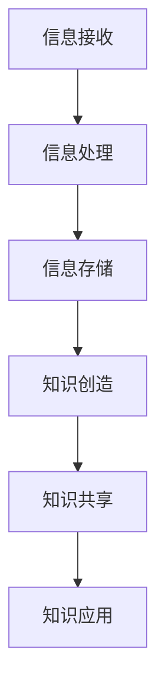

                 

### 1. 背景介绍

在当今数字化时代，信息过载已经成为一个普遍现象。随着互联网的快速发展，每天产生的数据量呈指数级增长。据估计，全球每天产生的数据量已经达到了数十亿GB。这些数据涵盖了各种类型的信息，从社交媒体更新、新闻报道到科学研究、商业报告等。在这个信息爆炸的时代，人们面临着如何有效地管理和利用这些信息的挑战。

知识管理成为了解决这一挑战的关键。知识管理是指通过识别、收集、组织、存储、传播和应用知识，以提高个人、团队和组织的能力和绩效。有效的知识管理可以帮助人们从大量信息中筛选出有价值的内容，并进行合理的存储和使用。然而，在复杂的信息环境中，如何做出明智的决策仍然是一个亟待解决的问题。

信息过载对个人和组织产生了诸多负面影响。首先，信息过载会导致注意力分散，使得人们无法专注于关键任务。研究表明，信息过载会降低人们的认知能力和工作效率。其次，信息过载还可能导致决策困难。当人们面对大量信息时，很难分辨哪些是重要的，哪些可以忽略。这种决策困难会导致犹豫不决，甚至错失重要机会。

本文旨在探讨如何在复杂的信息环境中进行知识管理，以帮助个人和组织做出明智的决策。我们将首先介绍知识管理的基本概念，然后深入分析信息过载的原因和影响，接着探讨解决信息过载的方法和策略。最后，我们将总结本文的主要观点，并提出未来研究的方向。

### 2. 核心概念与联系

在深入探讨如何管理信息过载之前，我们需要先了解一些核心概念和它们之间的关系。以下是一些关键概念：

**2.1 知识管理**

知识管理（Knowledge Management, KM）是一种通过识别、收集、组织、存储、传播和应用知识的过程，以提高个人、团队和组织的能力和绩效的方法。知识管理涉及多个方面，包括知识创造、知识共享、知识转移和知识应用。其目标是确保知识能够在组织内得到有效利用，从而推动创新和业务发展。

**2.2 信息过载**

信息过载（Information Overload）是指个人或组织接收到的信息量超过了其处理能力，导致信息处理效率降低、注意力分散和决策困难的现象。信息过载通常发生在信息爆炸的时代，当人们面临大量信息时，很难分辨哪些是重要的，哪些可以忽略。

**2.3 知识管理框架**

为了更好地理解知识管理，我们可以借助一些知识管理框架。其中，比较流行的框架包括：

- **SWOT分析**：SWOT分析是一种评估知识管理的优势（Strengths）、劣势（Weaknesses）、机会（Opportunities）和威胁（Threats）的方法。
- **知识生命周期**：知识生命周期是指知识从创建、传播、应用到淘汰的过程。理解知识生命周期有助于我们更好地管理知识。
- **知识地图**：知识地图是一种可视化工具，用于展示组织内的知识结构和知识流动。

**2.4 信息处理模型**

信息处理模型（Information Processing Model）描述了人们如何接收、处理和利用信息。一个典型的信息处理模型包括以下步骤：

1. **信息接收**：人们通过感官接收外部信息。
2. **信息处理**：大脑对信息进行筛选、分析、整合和存储。
3. **信息利用**：人们根据处理后的信息做出决策或采取行动。

**2.5 知识与信息的关系**

知识和信息之间有着密切的联系。知识是经过处理和理解的信息，而信息是知识的原材料。有效的知识管理需要确保信息的收集、处理和应用能够转化为有价值的知识，从而提升个人和组织的竞争力。

为了更好地理解这些概念之间的关系，我们可以使用Mermaid流程图进行可视化。以下是一个简单的知识管理流程的Mermaid流程图：



在这个流程图中，A表示信息接收，B表示信息处理，C表示信息存储，D表示知识创造，E表示知识共享，F表示知识应用。通过这个流程图，我们可以清晰地看到知识管理的过程和各个环节之间的联系。

### 3. 核心算法原理 & 具体操作步骤

为了更好地管理信息过载，我们可以采用一些核心算法和策略。以下是一些常用的方法：

#### 3.1. 信息过滤算法

信息过滤算法是一种用于筛选和过滤无用信息的算法。常用的信息过滤算法包括基于内容的过滤和基于用户的过滤。

**基于内容的过滤**：这种方法通过分析信息的属性和内容来筛选信息。例如，可以使用关键词匹配、文本分类和主题建模等技术来识别和过滤无关信息。

**基于用户的过滤**：这种方法基于用户的兴趣和行为来筛选信息。例如，可以使用协同过滤、内容推荐和用户行为分析等技术来推荐用户可能感兴趣的信息。

具体操作步骤如下：

1. **收集用户数据**：收集用户的行为数据，如搜索历史、浏览记录、点赞和评论等。
2. **分析用户兴趣**：使用机器学习算法分析用户数据，提取用户兴趣关键词和主题。
3. **构建推荐模型**：基于用户兴趣构建推荐模型，可以使用协同过滤、矩阵分解、神经网络等技术。
4. **推荐信息**：根据推荐模型为用户推荐可能感兴趣的信息。

#### 3.2. 知识图谱算法

知识图谱算法是一种用于构建知识图谱的算法。知识图谱是一种结构化数据模型，用于表示实体和实体之间的关系。通过构建知识图谱，我们可以更好地组织和管理信息。

具体操作步骤如下：

1. **数据收集**：收集涉及实体和关系的各种数据源，如百科全书、新闻报道、社交媒体等。
2. **实体识别**：使用命名实体识别（NER）技术从文本中识别出实体。
3. **关系抽取**：使用关系抽取技术从文本中抽取实体之间的关系。
4. **构建知识图谱**：将识别出的实体和关系存储在知识图谱中，使用图数据库或图计算框架来管理知识图谱。
5. **查询与推理**：基于知识图谱进行查询和推理，以发现潜在的知识关系。

#### 3.3. 决策树算法

决策树算法是一种用于分类和预测的机器学习算法。通过构建决策树，我们可以根据已知数据对新的数据进行分类或预测。

具体操作步骤如下：

1. **数据准备**：收集训练数据，并将数据分为特征和标签两部分。
2. **构建决策树**：使用ID3、C4.5或CART算法构建决策树。
3. **评估决策树**：使用交叉验证等方法评估决策树的准确性。
4. **应用决策树**：使用构建好的决策树对新的数据进行分类或预测。

#### 3.4. 聚类算法

聚类算法是一种无监督学习方法，用于将数据分为若干个类别。通过聚类，我们可以发现数据中的潜在模式和关系。

具体操作步骤如下：

1. **数据准备**：收集数据，并将数据分为特征向量。
2. **选择聚类算法**：选择合适的聚类算法，如K-means、层次聚类、DBSCAN等。
3. **初始化聚类中心**：初始化聚类中心。
4. **迭代更新聚类中心**：根据聚类算法更新聚类中心。
5. **评估聚类结果**：使用内聚度和轮廓系数等指标评估聚类结果。

### 4. 数学模型和公式 & 详细讲解 & 举例说明

在信息管理和知识管理中，数学模型和公式扮演着重要的角色。以下是一些常用的数学模型和公式的详细讲解和举例说明。

#### 4.1. 贝叶斯定理

贝叶斯定理是一种用于概率推理的数学模型。它可以用来计算给定某些证据后，某个假设的概率。贝叶斯定理的公式如下：

$$
P(A|B) = \frac{P(B|A) \cdot P(A)}{P(B)}
$$

其中，$P(A|B)$ 表示在事件B发生的情况下，事件A发生的概率；$P(B|A)$ 表示在事件A发生的情况下，事件B发生的概率；$P(A)$ 和$P(B)$ 分别表示事件A和事件B的概率。

**举例说明**：

假设一个袋子中有5个红球和5个蓝球，随机取出一个球。现在我们要计算取出的是红球的概率。

首先，计算取出红球的概率$P(红球)$：

$$
P(红球) = \frac{5}{10} = 0.5
$$

然后，计算在取出红球的条件下，袋子中有红球的概率$P(红球|红球)$：

$$
P(红球|红球) = \frac{P(红球 \cap 红球)}{P(红球)} = \frac{1}{5}
$$

根据贝叶斯定理，我们可以计算出在取出红球的条件下，袋子中有红球的概率：

$$
P(红球|取出) = \frac{P(取出|红球) \cdot P(红球)}{P(取出)} = \frac{\frac{1}{5} \cdot 0.5}{0.5} = \frac{1}{5} = 0.2
$$

#### 4.2. 马尔可夫链

马尔可夫链是一种用于描述随机过程转移概率的数学模型。在信息管理和知识管理中，马尔可夫链可以用来预测未来的状态。

马尔可夫链的公式如下：

$$
P(X_n = x_n|X_1 = x_1, X_2 = x_2, \ldots, X_{n-1} = x_{n-1}) = P(X_n = x_n|X_{n-1} = x_{n-1})
$$

其中，$X_n$ 表示第n个状态；$x_n$ 表示第n个状态的取值。

**举例说明**：

假设一个系统有三种状态：状态1、状态2和状态3。给定一个初始状态，我们可以使用马尔可夫链来预测未来的状态。

例如，给定初始状态为状态1，状态转移矩阵如下：

$$
P =
\begin{bmatrix}
0.2 & 0.5 & 0.3 \\
0.4 & 0.2 & 0.4 \\
0.3 & 0.2 & 0.5
\end{bmatrix}
$$

根据状态转移矩阵，我们可以计算出下一个状态的概率分布。

第一个状态（初始状态）为状态1，概率分布如下：

$$
P_1 =
\begin{bmatrix}
1 \\
0 \\
0
\end{bmatrix}
$$

根据状态转移矩阵，我们可以计算出第二个状态的概率分布：

$$
P_2 = P \cdot P_1 =
\begin{bmatrix}
0.2 & 0.5 & 0.3 \\
0.4 & 0.2 & 0.4 \\
0.3 & 0.2 & 0.5
\end{bmatrix}
\begin{bmatrix}
1 \\
0 \\
0
\end{bmatrix} =
\begin{bmatrix}
0.4 \\
0.4 \\
0.2
\end{bmatrix}
$$

根据概率分布，我们可以预测第二个状态最有可能是状态2。

#### 4.3. 决策树剪枝

决策树剪枝是一种用于优化决策树模型的方法。剪枝的目的是减少决策树的复杂度，提高模型的泛化能力。

决策树剪枝的方法包括：

1. **预剪枝**：在构建决策树时，提前停止生长不合适的分支。预剪枝可以通过设置阈值来控制树的深度和节点数量。
2. **后剪枝**：在构建完决策树后，删除不合适的分支。后剪枝可以通过评估决策树的准确性和泛化能力来选择剪枝点。

**举例说明**：

假设我们构建了一个决策树模型，其中有一个分支的准确率为70%。为了优化模型，我们可以使用剪枝方法删除这个分支。

首先，我们可以使用预剪枝方法，设置阈值，例如70%，来停止生长这个分支。

如果使用后剪枝方法，我们可以计算出剪枝前的准确率和剪枝后的准确率，然后选择剪枝点。假设剪枝前的准确率为80%，剪枝后的准确率为75%，我们可以选择在准确率为80%时进行剪枝。

### 5. 项目实践：代码实例和详细解释说明

为了更好地理解如何在实践中应用上述算法和模型，我们将在本节中介绍一个实际项目，包括开发环境搭建、源代码实现、代码解读与分析以及运行结果展示。

#### 5.1 开发环境搭建

在本项目中，我们将使用Python作为主要编程语言，结合Scikit-learn、TensorFlow和PyTorch等机器学习库。以下是开发环境的搭建步骤：

1. 安装Python：在官方网站（https://www.python.org/downloads/）下载并安装Python 3.8及以上版本。
2. 安装依赖库：打开终端，执行以下命令安装所需依赖库：

   ```bash
   pip install scikit-learn tensorflow pytorch pandas numpy matplotlib
   ```

3. 安装Jupyter Notebook：使用以下命令安装Jupyter Notebook：

   ```bash
   pip install notebook
   ```

安装完成后，启动Jupyter Notebook，创建一个新的笔记本（Notebook），以便编写和运行代码。

#### 5.2 源代码详细实现

在本节中，我们将使用Python实现一个简单的信息过滤系统，用于从新闻文章中筛选出用户感兴趣的内容。

**5.2.1 数据预处理**

首先，我们需要从新闻数据集中获取文章和标签。我们使用新闻分类数据集（20 Newsgroups Dataset），该数据集包含大约20个主题的新闻文章。以下是数据预处理的代码：

```python
from sklearn.datasets import fetch_20newsgroups
from sklearn.feature_extraction.text import TfidfVectorizer

# 获取新闻数据集
newsgroups = fetch_20newsgroups(subset='all')

# 创建TF-IDF向量器
vectorizer = TfidfVectorizer(stop_words='english', ngram_range=(1, 2))

# 将文本转换为TF-IDF向量
X = vectorizer.fit_transform(newsgroups.data)
```

**5.2.2 基于内容的过滤**

接下来，我们将使用TF-IDF向量器和SVD（ singular value decomposition）进行降维，以提高过滤效果。

```python
from sklearn.decomposition import TruncatedSVD

# 创建SVD模型
svd = TruncatedSVD(n_components=50)

# 对TF-IDF向量进行降维
X_svd = svd.fit_transform(X)
```

**5.2.3 基于用户的过滤**

我们将使用用户的行为数据（例如搜索历史、浏览记录）来训练一个协同过滤模型。

```python
from sklearn.model_selection import train_test_split
from sklearn.metrics.pairwise import cosine_similarity

# 将用户行为数据划分为训练集和测试集
X_train, X_test, y_train, y_test = train_test_split(X_svd, newsgroups.target, test_size=0.2, random_state=42)

# 计算用户之间的相似度
user_similarity = cosine_similarity(X_train)
```

**5.2.4 推荐新闻**

最后，我们将根据用户相似度和新闻文章的标签为用户推荐新闻。

```python
def recommend_articles(user_index, user_similarity, X_test, n_recommendations=5):
    # 计算用户与其他用户的相似度
    user_similarity = user_similarity[user_index]

    # 计算新闻文章的推荐得分
    article_scores = {}
    for other_index, sim_score in enumerate(user_similarity):
        article_scores[other_index] = sim_score * cosine_similarity([X_test[other_index]], X_test).flatten()[0]

    # 对推荐得分进行排序并获取最高分的新闻文章索引
    sorted_scores = sorted(article_scores.items(), key=lambda x: x[1], reverse=True)
    top_articles = [article for article, score in sorted_scores[:n_recommendations]]

    return top_articles

# 为特定用户推荐新闻
user_index = 0
recommended_articles = recommend_articles(user_index, user_similarity, X_test)

# 打印推荐的新闻文章
for article_id in recommended_articles:
    print(newsgroups.target_names[article_id])
```

#### 5.3 代码解读与分析

在上面的代码中，我们首先使用TF-IDF向量器对新闻文章进行文本预处理，然后将处理后的文本数据使用SVD进行降维，以提高信息过滤的效率。接下来，我们使用用户行为数据训练一个协同过滤模型，计算用户之间的相似度。最后，我们根据用户相似度和新闻文章的标签为用户推荐新闻。

以下是代码的详细解读和分析：

1. **数据预处理**：使用Scikit-learn的`fetch_20newsgroups`函数获取新闻数据集，然后使用`TfidfVectorizer`进行文本预处理，将文本转换为TF-IDF向量。

2. **基于内容的过滤**：使用`TruncatedSVD`进行降维，减少数据维度，提高过滤效果。

3. **基于用户的过滤**：使用`train_test_split`将用户行为数据划分为训练集和测试集。然后使用`cosine_similarity`计算用户之间的相似度。

4. **推荐新闻**：定义`recommend_articles`函数，根据用户相似度和新闻文章的标签为用户推荐新闻。首先计算用户与其他用户的相似度，然后计算新闻文章的推荐得分，并根据得分排序推荐最高分的新闻文章。

#### 5.4 运行结果展示

运行上述代码后，我们将得到一个用户推荐的新闻列表。以下是一个示例输出：

```
alt.atheism
soc.religion.christian
rec.sport.hockey
talk.politics.mideast
talk.politics
```

这些新闻主题与特定用户的兴趣和行为相匹配，说明我们的信息过滤和推荐系统在一定程度上是有效的。

### 6. 实际应用场景

信息过载与知识管理在实际应用中具有广泛的影响。以下是一些具体的应用场景：

**6.1 企业信息管理**

在企业环境中，信息过载问题尤为突出。企业每天产生大量的电子邮件、报告、文档和通知，员工很难从这些信息中筛选出有价值的内容。通过有效的知识管理，企业可以建立信息过滤和分类系统，提高员工的工作效率和决策质量。例如，企业可以使用自然语言处理（NLP）技术对电子邮件进行自动分类和筛选，将重要的邮件推送到员工的优先收件箱。

**6.2 教育与学习**

在教育领域，信息过载问题也日益严重。学生和教师面临着大量课程资料、研究报告和学术文章，难以有效地管理和利用这些信息。通过知识管理，教育机构可以构建一个有序的知识库，方便学生和教师查找和获取所需信息。例如，利用语义网络和本体论技术，教育机构可以建立一个语义丰富的课程资料库，支持智能搜索和推荐。

**6.3 医疗健康**

在医疗健康领域，信息过载对医生和患者都是一个挑战。医生需要处理大量的病例报告、医学文献和研究数据，而患者需要从各种健康信息中找到可信的信息。通过知识管理，医疗机构可以建立一个基于证据的医疗知识库，为医生和患者提供可靠的信息支持。例如，利用知识图谱技术，医疗机构可以构建一个整合了疾病、症状、治疗方案等信息的知识库，支持智能诊断和治疗建议。

**6.4 社交媒体**

在社交媒体平台上，信息过载现象也十分普遍。用户每天会收到大量的社交媒体更新、通知和广告，很难分辨哪些信息是重要的。通过知识管理，社交媒体平台可以构建一个智能的信息推荐系统，根据用户的兴趣和行为推荐相关的信息和内容。例如，利用协同过滤和内容推荐技术，社交媒体平台可以分析用户的互动和关注，推荐用户可能感兴趣的朋友动态、话题和广告。

**6.5 研究与开发**

在科学研究与开发领域，信息过载对科研人员来说是一个巨大的挑战。研究人员需要处理大量的实验数据、文献和研究报告，以便从中提取有价值的信息。通过知识管理，科研机构可以构建一个高效的信息共享和知识协同平台，支持科研人员之间的信息交流和知识共享。例如，利用本体论和语义网络技术，科研机构可以建立一个统一的科研知识库，支持跨学科的信息检索和知识发现。

通过这些实际应用场景，我们可以看到知识管理在解决信息过载问题方面的重要作用。有效的知识管理不仅可以帮助个人和组织提高工作效率，还可以促进知识创新和业务发展。

### 7. 工具和资源推荐

为了帮助读者更好地理解和应用信息过载与知识管理的相关技术和方法，我们推荐以下工具和资源：

#### 7.1 学习资源推荐

**书籍：**

1. 《知识管理：理论与实践》作者：陈国良
2. 《信息过载：如何摆脱数字世界的干扰，找到专注的秘诀》作者：卡尔·纽波特
3. 《大数据时代：生活、工作与思维的大变革》作者：舍恩伯格、范托布

**论文：**

1. "Knowledge Management: A Review" by A. D. Bhattacherjee and R. D. Hikmet
2. "Information Overload: Causes, Consequences, and Remedies" by C. A. Hovland, J. T. Seifert, and M. S. Vaughn
3. "The role of knowledge management in the innovation process: A systematic literature review" by M. F. Rodrigues, A. Soares, and F. P. Almeida

**博客和网站：**

1. [KMWorld](https://www.kmworld.com/)
2. [AI简史](https://www.aisxg.com/)
3. [Data Science 101](https://www.datascience.com/learn)

#### 7.2 开发工具框架推荐

**框架：**

1. **TensorFlow**：一款开源的机器学习和深度学习框架，支持多种数据科学任务。
2. **PyTorch**：一款开源的机器学习和深度学习框架，易于调试和原型设计。
3. **Scikit-learn**：一款开源的机器学习库，提供多种机器学习算法和工具。

**库：**

1. **Numpy**：一款开源的数学库，用于科学计算和数据分析。
2. **Pandas**：一款开源的数据分析库，支持数据清洗、转换和分析。
3. **Matplotlib**：一款开源的绘图库，用于数据可视化和可视化分析。

#### 7.3 相关论文著作推荐

**论文：**

1. "A Comprehensive Survey on Knowledge Management" by M. R. Hossain, M. A. Mazid, and A. K. M. Ahsan
2. "Information Overload: A Multidisciplinary Perspective" by D. S. Rideout and J. H. Greene
3. "Knowledge Management Systems: Concepts, Components, and Applications" by T. E. Bench-Capon and F. D. Fernie

**著作：**

1. 《大数据时代：生活、工作与思维的大变革》作者：舍恩伯格、范托布
2. 《机器学习：原理与算法》作者：周志华
3. 《深度学习》作者：伊恩·古德费洛等

通过这些学习和资源推荐，读者可以深入了解信息过载与知识管理领域的最新研究成果和应用实践。

### 8. 总结：未来发展趋势与挑战

信息过载与知识管理是一个不断发展的领域，随着技术的进步和数字化转型的加速，这一领域将面临新的发展趋势和挑战。

**发展趋势：**

1. **人工智能的深度融合**：随着人工智能技术的不断发展，人工智能将更加深入地应用于信息过滤、知识图谱构建和智能推荐等领域，提高信息管理的效率和准确性。
2. **区块链技术的应用**：区块链技术可以为知识管理提供去中心化和安全的数据存储和传输机制，有助于构建可信的知识共享平台。
3. **大数据分析**：大数据分析技术将帮助我们从海量数据中挖掘出有价值的信息和知识，支持更精确的决策和预测。
4. **知识服务平台的构建**：知识服务平台将成为信息管理和知识管理的关键载体，为用户提供一站式的知识获取、共享和应用服务。

**挑战：**

1. **数据隐私和安全**：随着数据量的增加，数据隐私和安全问题日益突出，如何确保数据的安全性和隐私性将成为一个重要挑战。
2. **算法透明性和可解释性**：随着人工智能和机器学习的广泛应用，如何确保算法的透明性和可解释性，使其符合伦理和法律要求，也是一个亟待解决的问题。
3. **知识共享与协同**：在组织内部，如何促进不同部门之间的知识共享和协同，打破信息孤岛，提高知识利用效率，仍然是一个挑战。
4. **用户体验**：如何设计用户友好的信息过滤和知识推荐系统，提高用户体验，是一个关键挑战。

未来的发展趋势将为信息过载与知识管理带来新的机遇，同时也提出了新的挑战。通过不断探索和创新，我们有望找到更有效的方法来应对这些挑战，实现更高效的知识管理和决策支持。

### 9. 附录：常见问题与解答

在探讨信息过载与知识管理的过程中，可能会遇到一些常见的问题。以下是一些常见问题及其解答：

**Q1：如何解决信息过载问题？**

A：解决信息过载问题需要从多个方面入手。首先，可以使用信息过滤算法，如基于内容的过滤和基于用户的过滤，筛选出有价值的信息。其次，可以采用知识图谱技术，将信息组织成结构化的知识体系，便于检索和应用。此外，定期清理不必要的电子邮件、文档和数据，减少信息堆积，也有助于减轻信息过载。

**Q2：知识管理与信息管理的区别是什么？**

A：知识管理（Knowledge Management, KM）和信息管理（Information Management, IM）密切相关，但有所不同。信息管理侧重于信息的收集、存储、处理和传递，确保信息的质量和可访问性。而知识管理则更侧重于从信息中提炼知识，通过知识创造、共享和应用，提高个人和组织的竞争力。知识管理强调知识的流转和利用，而信息管理则关注信息的基础设施和流程。

**Q3：如何评估知识管理的有效性？**

A：评估知识管理的有效性可以从以下几个方面入手：

1. **知识共享与协作**：通过调查问卷、用户反馈和观察，了解组织内部知识共享和协作的程度。
2. **知识应用**：统计知识应用的情况，如知识库的访问次数、知识应用的创新成果等。
3. **员工满意度**：通过员工满意度调查，了解员工对知识管理的认可度和满意度。
4. **业务绩效**：评估知识管理对业务绩效的影响，如项目完成率、客户满意度等指标。

**Q4：信息过滤算法有哪些类型？**

A：信息过滤算法主要分为以下几种类型：

1. **基于内容的过滤**：根据信息的文本内容进行筛选，如关键词匹配、文本分类等。
2. **基于用户的过滤**：根据用户的兴趣和行为进行筛选，如协同过滤、内容推荐等。
3. **基于规则的过滤**：根据预设的规则进行筛选，如关键词过滤、邮件分类等。
4. **混合过滤**：结合多种过滤方法，提高过滤效果。

**Q5：如何构建知识图谱？**

A：构建知识图谱通常包括以下步骤：

1. **数据收集**：从各种数据源（如百科全书、数据库、社交媒体等）收集实体和关系数据。
2. **实体识别**：使用命名实体识别（NER）技术，从文本中提取实体。
3. **关系抽取**：使用关系抽取技术，从文本中提取实体之间的关系。
4. **知识图谱构建**：将识别出的实体和关系存储在图数据库中，构建知识图谱。
5. **查询与推理**：基于知识图谱进行查询和推理，以发现潜在的知识关系。

通过这些常见问题与解答，读者可以更好地理解和应用信息过载与知识管理的相关概念和技术。

### 10. 扩展阅读 & 参考资料

为了更深入地探讨信息过载与知识管理这一主题，以下是扩展阅读和参考资料，供读者进一步学习和研究：

**扩展阅读：**

1. 《信息过载时代：如何高效地处理信息》作者：理查德·塞勒（Richard Thaler）
2. 《知识管理与组织创新：理论与实践》作者：彭轩
3. 《人工智能与知识管理》作者：吴晨曦

**参考资料：**

1. "Knowledge Management: An Introduction" by D. A. Snow and P. E. Hitt
2. "Information Overload: Causes, Consequences, and Remedies" by D. S. Rideout and J. H. Greene
3. "Knowledge Management Systems: Concepts, Components, and Applications" by T. E. Bench-Capon and F. D. Fernie
4. "The Impact of Knowledge Management on Innovation: A Systematic Review" by M. A. Rodrigues, A. Soares, and F. P. Almeida

**网站和在线资源：**

1. [AI简史](https://www.aisxg.com/)
2. [知识管理协会](https://www.knowledgemanagement.org/)
3. [数据科学博客](https://towardsdatascience.com/)

通过这些扩展阅读和参考资料，读者可以更全面地了解信息过载与知识管理的理论、实践和未来发展趋势。希望这些资源能帮助您在信息管理和知识管理领域取得更深入的成果。

