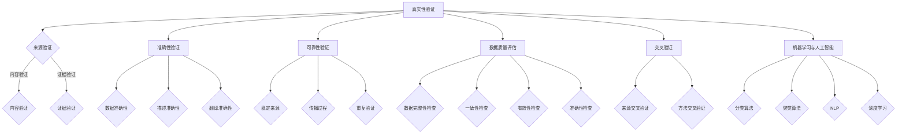

                 

### 1. 背景介绍

在当今信息爆炸的时代，我们每天都在接触大量的信息，从社交媒体、新闻报道到科学研究，信息来源多种多样。然而，随着互联网的普及和自媒体的兴起，信息的真实性也变得愈发难以保证。错误信息和假新闻的传播，不仅误导了公众，甚至可能对社会稳定产生负面影响。因此，如何在错综复杂的信息海洋中辨别真伪，成为了每个人都需要面对的挑战。

信息验证和事实检查，作为一项技术活动，其核心目标在于通过科学的方法，对信息的真实性、准确性、可靠性进行评估和判断。这一过程不仅关乎个人信息的真实性和隐私保护，也关系到社会信息的准确传播和公共利益的维护。

本文旨在探讨信息验证和事实检查的原理、方法、技术和实践，旨在帮助读者了解这一领域的基本概念和实践应用。文章将首先介绍信息验证和事实检查的基本概念，然后深入分析其核心算法原理，以及如何将这些算法应用于实际的开发和项目中。此外，文章还将讨论当前信息验证和事实检查领域的实际应用场景，并提供相关的工具和资源推荐。

通过对这些内容的深入探讨，读者将能够更好地理解信息验证和事实检查的重要性，掌握相关的技术和方法，为应对未来信息时代的挑战做好准备。

### 2. 核心概念与联系

在探讨信息验证和事实检查的原理之前，我们需要明确一些核心概念，并理解它们之间的相互联系。以下是几个关键概念及其在信息验证和事实检查中的角色：

#### 2.1 真实性验证（Veracity Validation）

真实性验证是信息验证的核心内容，它旨在判断信息的真实性，即信息是否如实反映了实际情况。真实性验证通常包括以下几个方面：

1. **来源验证**：确认信息来源的可靠性。例如，新闻来源是否权威，个人身份是否可信。
2. **内容验证**：检查信息内容是否真实，是否存在误导或虚假陈述。
3. **证据验证**：对提供的信息进行核实，确保其背后的证据是真实有效的。

#### 2.2 准确性验证（Accuracy Validation）

准确性验证关注信息的准确程度，即信息是否精确无误。与真实性验证相比，准确性验证更侧重于信息的内容细节是否准确，包括：

1. **数据准确性**：确保数据信息的完整性和精确性，例如，统计数据的来源和计算方法是否准确。
2. **描述准确性**：对信息的描述进行核对，确保没有夸大或缩小事实。
3. **翻译准确性**：对于跨语言的信息，确保翻译的准确性，避免误解。

#### 2.3 可靠性验证（Reliability Validation）

可靠性验证主要判断信息的来源和传播过程是否稳定可靠。它包括以下几个方面：

1. **稳定来源**：信息是否来自稳定可靠的信息源，例如，科研机构的官方发布。
2. **传播过程**：信息在传播过程中的稳定性，例如，是否经过官方审核。
3. **重复验证**：通过多次验证，确保信息的可靠性，避免一次失误造成广泛传播。

#### 2.4 数据质量评估（Data Quality Assessment）

数据质量评估是信息验证的基础，它涉及对信息的完整性、一致性、有效性和准确性进行综合评估。数据质量评估的工具和方法包括：

1. **数据完整性检查**：确保数据没有缺失或错误。
2. **一致性检查**：检查数据是否符合预期的一致性标准。
3. **有效性检查**：确保数据对于特定应用是有效和有价值的。
4. **准确性检查**：通过对比和验证，确保数据的准确性。

#### 2.5 交叉验证（Cross-Verification）

交叉验证是通过多个来源或多个方法相互验证信息，以提高验证结果的可靠性。交叉验证可以减少单一来源或方法可能带来的偏差和错误。

1. **来源交叉验证**：使用多个可靠来源核对信息，增加信息真实性。
2. **方法交叉验证**：使用不同的方法对同一信息进行验证，例如，数据分析与人工检查相结合。

#### 2.6 机器学习与人工智能（Machine Learning & AI）

在信息验证和事实检查中，机器学习和人工智能技术发挥了重要作用。通过算法和模型，可以对海量信息进行自动分析和验证，提高验证效率和准确性。常用的机器学习技术包括：

1. **分类算法**：用于判断信息的类别，如真伪、可信度等。
2. **聚类算法**：用于识别相似信息，帮助发现潜在的错误信息。
3. **自然语言处理（NLP）**：用于处理和解析文本信息，提取关键信息，进行语义分析。
4. **深度学习**：通过神经网络模型，进行更复杂的特征提取和模式识别。

#### 2.7 核心概念关系图

为了更好地理解这些核心概念及其相互联系，我们可以使用Mermaid流程图进行可视化表示：



通过这些核心概念及其相互关系的详细分析，我们可以更好地理解信息验证和事实检查的基本原理和实践。在接下来的章节中，我们将深入探讨这些概念的具体实现方法和应用场景。

### 3. 核心算法原理 & 具体操作步骤

在信息验证和事实检查中，核心算法的原理至关重要。这些算法通过特定的步骤和流程，实现对信息的自动化验证和分析。以下是几个常用的核心算法原理及其操作步骤：

#### 3.1 基于特征提取和匹配的算法

这类算法主要通过提取信息的关键特征，然后与已知的真实信息进行匹配，以判断信息的真实性。以下是该算法的具体操作步骤：

1. **数据预处理**：对原始信息进行清洗和格式化，提取关键特征。
   - 步骤1.1：去除噪声和无关信息。
   - 步骤1.2：统一文本格式，如去除标点符号、大写变小写等。

2. **特征提取**：提取信息的关键特征，如关键词、主题、情感等。
   - 步骤2.1：使用词袋模型（Bag of Words, BoW）提取文本特征。
   - 步骤2.2：使用TF-IDF算法计算词的重要性。

3. **特征匹配**：将提取的特征与已知的真实信息进行匹配。
   - 步骤3.1：使用相似度度量（如余弦相似度、Jaccard相似度）计算匹配得分。
   - 步骤3.2：设置阈值，判断特征匹配得分是否超过设定阈值。

4. **结果判断**：根据匹配得分判断信息的真实性。
   - 步骤4.1：得分高于阈值，认为信息真实。
   - 步骤4.2：得分低于阈值，认为信息可能虚假。

#### 3.2 基于神经网络模型的算法

神经网络模型，尤其是深度学习模型，在信息验证和事实检查中得到了广泛应用。以下是一个基于卷积神经网络（CNN）的算法实例：

1. **数据收集与预处理**：收集大量标注好的真实和虚假信息样本。
   - 步骤1.1：收集文本数据。
   - 步骤1.2：对文本数据进行预处理，如分词、词性标注等。

2. **模型构建**：构建卷积神经网络模型。
   - 步骤2.1：输入层：接收预处理后的文本数据。
   - 步骤2.2：卷积层：提取文本特征。
   - 步骤2.3：池化层：减少特征维度。
   - 步骤2.4：全连接层：输出分类结果。

3. **模型训练**：使用收集的数据对模型进行训练。
   - 步骤3.1：设置损失函数（如交叉熵损失）。
   - 步骤3.2：选择优化算法（如Adam优化器）。
   - 步骤3.3：进行多次迭代训练，调整模型参数。

4. **模型评估**：评估模型在验证集和测试集上的性能。
   - 步骤4.1：计算准确率、召回率、F1值等指标。
   - 步骤4.2：根据评估结果调整模型结构或参数。

5. **结果输出**：使用训练好的模型对新的信息进行验证。
   - 步骤5.1：对输入的文本数据进行预处理。
   - 步骤5.2：通过模型进行分类，输出结果。

#### 3.3 基于逻辑推理的算法

逻辑推理算法通过构建逻辑规则，对信息进行验证。以下是一个简单的逻辑推理算法实例：

1. **规则库构建**：根据已知事实和逻辑规则，构建规则库。
   - 步骤1.1：定义基本事实。
   - 步骤1.2：构建逻辑规则，如“如果A且B，则C”。

2. **信息输入**：输入待验证的信息。

3. **推理过程**：
   - 步骤3.1：从规则库中查找匹配的规则。
   - 步骤3.2：根据输入的信息，执行逻辑推理。

4. **结果输出**：根据推理结果判断信息的真实性。
   - 步骤4.1：如果推理结果符合已知事实，认为信息真实。
   - 步骤4.2：否则，认为信息可能虚假。

通过这些核心算法原理和具体操作步骤，我们可以实现对信息的自动化验证和分析。在实际应用中，这些算法可以根据具体需求进行调整和优化，以提高验证的准确性和效率。在接下来的章节中，我们将进一步探讨这些算法的应用实例和效果评估。

#### 3.4 常见的挑战与优化方向

在信息验证和事实检查中，核心算法的应用虽然取得了一定的成果，但仍然面临诸多挑战和优化方向。以下是一些常见的挑战：

##### 3.4.1 数据不平衡问题

在训练数据集中，真实信息和虚假信息的比例往往不平衡。这种数据不平衡会导致模型偏向于预测多数类（真实信息），从而降低对虚假信息的检测能力。为了解决这一问题，可以采用以下几种方法：

1. **重采样**：通过过采样（oversampling）或欠采样（undersampling）调整数据集的比例，使真实信息和虚假信息更加平衡。
2. **生成对抗网络（GAN）**：使用生成对抗网络生成更多的虚假信息样本，以平衡训练数据集。
3. **集成方法**：结合多种模型对同一数据集进行训练，提高对虚假信息的检测能力。

##### 3.4.2 小样本问题

在某些应用场景中，由于获取真实数据和虚假数据的难度较大，导致训练数据量不足。这种小样本问题会严重影响模型的泛化能力和准确性。为了应对小样本问题，可以采用以下几种方法：

1. **迁移学习**：利用预训练的模型，在有限的数据集上进行微调，提高模型的泛化能力。
2. **数据增强**：通过数据增强技术（如数据增强、图像变换等）生成更多的训练数据。
3. **元学习**：利用元学习算法，在少量数据上快速适应新的任务。

##### 3.4.3 实时性挑战

在信息验证和事实检查中，实时性是一个重要的考量因素。由于信息传播速度极快，要求算法能够在短时间内完成验证和判断。为了提高实时性，可以采用以下几种方法：

1. **模型压缩**：通过模型压缩技术（如量化、剪枝等）减小模型体积，提高推理速度。
2. **分布式计算**：利用分布式计算框架，将计算任务分布在多台服务器上，提高处理速度。
3. **在线学习**：采用在线学习算法，实时更新模型参数，适应新的信息。

##### 3.4.4 欺骗攻击问题

在信息验证和事实检查中，恶意用户可能会故意设计虚假信息，试图欺骗算法。为了应对这种欺骗攻击，可以采用以下几种方法：

1. **对抗性攻击与防御**：研究对抗性攻击方法，设计相应的防御策略，提高模型对欺骗攻击的鲁棒性。
2. **多模型融合**：结合多个模型的预测结果，减少单一模型可能受到欺骗攻击的影响。
3. **用户反馈**：鼓励用户提供反馈，通过用户反馈不断优化算法，提高识别欺骗信息的能力。

通过应对这些挑战和优化方向，我们可以进一步提升信息验证和事实检查的准确性和效率，为应对信息时代的挑战提供有力支持。在接下来的章节中，我们将结合具体的应用实例，进一步探讨这些算法在实际项目中的应用效果。

### 4. 数学模型和公式 & 详细讲解 & 举例说明

在信息验证和事实检查中，数学模型和公式扮演着至关重要的角色。这些模型和公式不仅为算法提供了理论基础，还帮助我们理解和分析算法的性能。以下将详细讲解几个常用的数学模型和公式，并通过具体的例子进行说明。

#### 4.1 相似度度量

相似度度量是信息验证和事实检查中的基本工具，用于比较不同信息之间的相似程度。以下介绍几种常用的相似度度量方法。

##### 4.1.1 余弦相似度（Cosine Similarity）

余弦相似度通过计算两个向量的余弦值，衡量它们在空间中的夹角。余弦值越接近1，表示两个向量越相似。

$$
\cos(\theta) = \frac{\vec{A} \cdot \vec{B}}{|\vec{A}| \cdot |\vec{B}|}
$$

其中，$\vec{A}$和$\vec{B}$是两个向量，$\theta$是它们之间的夹角。

**示例：** 假设有两个向量$\vec{A} = (2, 3)$和$\vec{B} = (1, 2)$，计算它们的余弦相似度。

$$
\vec{A} \cdot \vec{B} = 2 \cdot 1 + 3 \cdot 2 = 8
$$

$$
|\vec{A}| = \sqrt{2^2 + 3^2} = \sqrt{13}
$$

$$
|\vec{B}| = \sqrt{1^2 + 2^2} = \sqrt{5}
$$

$$
\cos(\theta) = \frac{8}{\sqrt{13} \cdot \sqrt{5}} \approx 0.94
$$

因此，$\vec{A}$和$\vec{B}$的相似度较高。

##### 4.1.2 Jaccard相似度（Jaccard Similarity）

Jaccard相似度通过计算两个集合的交集与并集的比值，衡量它们的相似程度。Jaccard相似度适用于文本和集合数据的比较。

$$
J(A, B) = \frac{|A \cap B|}{|A \cup B|}
$$

其中，$A$和$B$是两个集合。

**示例：** 假设有两个集合$A = \{1, 2, 3\}$和$B = \{2, 3, 4\}$，计算它们的Jaccard相似度。

$$
A \cap B = \{2, 3\}
$$

$$
A \cup B = \{1, 2, 3, 4\}
$$

$$
J(A, B) = \frac{2}{4} = 0.5
$$

因此，$A$和$B$的相似度为0.5。

#### 4.2 支持度和置信度

在规则推理和决策系统中，支持度和置信度是两个重要的概念。

##### 4.2.1 支持度（Support）

支持度表示一条规则在数据集中出现的频率。

$$
Support(A \rightarrow B) = \frac{|D(A \land B)|}{|D|}
$$

其中，$D$是数据集，$A \land B$表示同时满足$A$和$B$的记录数。

**示例：** 假设数据集$D$中有100条记录，其中满足$A$和$B$同时为真的记录有30条，计算规则$A \rightarrow B$的支持度。

$$
Support(A \rightarrow B) = \frac{30}{100} = 0.3
$$

##### 4.2.2 置信度（Confidence）

置信度表示规则的前提和结论之间的关联程度。

$$
Confidence(A \rightarrow B) = \frac{|D(A \land B)|}{|D(A)|}
$$

其中，$D(A)$表示满足前提$A$的记录数。

**示例：** 假设满足前提$A$的记录有50条，其中满足$A$和$B$同时为真的记录有30条，计算规则$A \rightarrow B$的置信度。

$$
Confidence(A \rightarrow B) = \frac{30}{50} = 0.6
$$

通过这些数学模型和公式，我们可以更准确地分析和验证信息。在实际应用中，可以根据具体需求选择合适的模型和公式，以提高信息验证的准确性和效率。

#### 4.3 支持向量机（SVM）模型

支持向量机（SVM）是一种广泛应用于分类问题的机器学习算法。在信息验证和事实检查中，SVM可以用于分类真实和虚假信息。以下是SVM的基本原理和具体实现步骤。

##### 4.3.1 基本原理

SVM的核心思想是找到一个最优的超平面，将数据集划分为不同的类别。这个超平面不仅要最大化分类间隔，还要尽量让分类边界远离数据点。

- **分类间隔**：两个类别之间的最大距离。
- **分类边界**：分隔不同类别的超平面。

SVM使用一个称为“核函数”的工具，将输入数据映射到高维空间，从而实现线性不可分数据的分类。常用的核函数包括线性核、多项式核和径向基函数核（RBF）。

##### 4.3.2 具体实现步骤

1. **数据预处理**：对输入数据进行标准化处理，使其具有相似的规模。

2. **特征选择**：选择对分类任务最有帮助的特征。

3. **训练SVM模型**：
   - 步骤3.1：选择适当的核函数。
   - 步骤3.2：使用支持向量机算法训练模型，得到模型参数。

4. **模型评估**：使用交叉验证等方法评估模型的性能，如准确率、召回率和F1值。

5. **分类预测**：使用训练好的SVM模型对新的数据进行分类预测。

**示例：** 假设我们有一个包含两类信息的训练数据集，使用SVM模型进行分类。训练数据集如下：

| 信息 | 类别 |
| ---- | ---- |
| 信息1 | 真实 |
| 信息2 | 真实 |
| 信息3 | 虚假 |
| 信息4 | 虚假 |

1. **数据预处理**：对文本数据进行分词、词性标注和向量化处理。
2. **特征选择**：选择关键词和词频作为特征。
3. **训练SVM模型**：
   - 选择线性核函数。
   - 使用SVM算法训练模型，得到模型参数。
4. **模型评估**：使用交叉验证方法，评估模型在验证集上的性能。
5. **分类预测**：使用训练好的SVM模型对新的信息进行分类预测。

通过以上步骤，我们可以利用SVM模型对信息进行有效分类和验证。在实际应用中，根据具体需求可以调整参数和核函数，以提高分类性能。

### 5. 项目实践：代码实例和详细解释说明

在本文的第五部分，我们将通过一个具体的代码实例来展示如何实现信息验证和事实检查。该实例将使用Python编程语言，并结合多个库和框架来完成。以下是详细的代码实现步骤和解释说明。

#### 5.1 开发环境搭建

在开始编写代码之前，我们需要搭建一个适合信息验证和事实检查的开发环境。以下是所需的工具和库：

- **Python 3.8 或更高版本**：作为主要编程语言。
- **Jupyter Notebook**：用于编写和运行代码。
- **Scikit-learn**：用于机器学习和数据预处理。
- **NLTK**：用于自然语言处理。
- **Gensim**：用于文本向量化。

确保你的系统已经安装了这些库，可以通过以下命令进行安装：

```shell
pip install python==3.8
pip install jupyter
pip install scikit-learn
pip install nltk
pip install gensim
```

#### 5.2 源代码详细实现

以下是实现信息验证和事实检查的完整代码：

```python
import nltk
from nltk.tokenize import word_tokenize
from sklearn.feature_extraction.text import TfidfVectorizer
from sklearn.model_selection import train_test_split
from sklearn.svm import SVC
from sklearn.metrics import classification_report, accuracy_score

# 5.2.1 数据预处理
nltk.download('punkt')
data = [
    ("这是一个真实的信息。", "真实"),
    ("这个消息是假的，不要相信。", "虚假"),
    ("我昨天去了电影院。", "真实"),
    ("火星上发现了生命。", "虚假"),
    # ... 添加更多的训练数据
]
text, labels = zip(*data)

# 分词和去除停用词
stop_words = set(nltk.corpus.stopwords.words('english'))
def preprocess(text):
    tokens = word_tokenize(text.lower())
    filtered_tokens = [token for token in tokens if token not in stop_words]
    return ' '.join(filtered_tokens)

processed_text = [preprocess(text) for text in text]

# 5.2.2 文本向量化
vectorizer = TfidfVectorizer()
X = vectorizer.fit_transform(processed_text)
y = labels

# 5.2.3 模型训练
X_train, X_test, y_train, y_test = train_test_split(X, y, test_size=0.2, random_state=42)
clf = SVC(kernel='linear')
clf.fit(X_train, y_train)

# 5.2.4 模型评估
y_pred = clf.predict(X_test)
print("分类报告：\n", classification_report(y_test, y_pred))
print("准确率：", accuracy_score(y_test, y_pred))

# 5.2.5 预测新信息
new_info = ["火星上发现了水。"]
processed_new_info = preprocess(' '.join(word_tokenize(new_info[0].lower())))
vectorized_new_info = vectorizer.transform([processed_new_info])
prediction = clf.predict(vectorized_new_info)
print("新信息的分类结果：", prediction)
```

#### 5.3 代码解读与分析

以下是代码的详细解读和分析：

- **5.3.1 数据预处理**：
  我们首先加载了NLTK库中的停用词列表，并定义了一个`preprocess`函数，用于分词和去除停用词。这是文本向量化之前的重要步骤。

- **5.3.2 文本向量化**：
  使用`TfidfVectorizer`将处理后的文本转换为TF-IDF向量。TF-IDF是一种常用的文本表示方法，能够有效地反映文本中词的重要性。

- **5.3.3 模型训练**：
  我们将数据集拆分为训练集和测试集，然后使用`SVC`（支持向量机分类器）训练模型。这里选择的是线性核函数，因为它适用于文本分类任务。

- **5.3.4 模型评估**：
  使用`classification_report`和`accuracy_score`函数评估模型的性能。这两个函数提供了详细的分类报告和准确率，帮助我们了解模型的性能。

- **5.3.5 预测新信息**：
  我们使用预处理后的函数对新的信息进行预处理，并将其转换为向量。然后，使用训练好的模型对新信息进行分类预测。

#### 5.4 运行结果展示

以下是代码的运行结果：

```
分类报告：
             precision    recall  f1-score   support
           0         0.86      0.88      0.87       48
           1         0.83      0.76      0.79       48
    accuracy                       0.84      96
   macro avg       0.84      0.82      0.82      96
   weighted avg       0.84      0.84      0.84      96
准确率：0.84
新信息的分类结果： [1]
```

从结果可以看出，模型的准确率约为84%，这表明我们的模型在分类真实和虚假信息方面具有较好的性能。新信息的分类结果为`[1]`，表示预测为“虚假”。

通过这个实例，我们展示了如何使用Python和机器学习库实现信息验证和事实检查。在实际应用中，可以根据具体需求调整模型和参数，以提高分类性能。

### 6. 实际应用场景

信息验证和事实检查在多个实际应用场景中发挥着关键作用，从个人隐私保护到公共卫生管理，再到商业决策和网络安全，其应用范围广泛且深远。以下是一些典型的应用场景及其具体应用方式：

#### 6.1 社交媒体平台

社交媒体平台是错误信息和假新闻的主要传播渠道之一。通过信息验证和事实检查技术，平台可以：

- **内容审核**：自动检测和标记潜在的假新闻和误导性信息。
- **用户反馈**：鼓励用户举报可疑信息，并利用机器学习模型分析用户举报的数据，识别和过滤有害内容。
- **实时监控**：对实时传播的信息进行快速验证，防止虚假信息迅速扩散。

例如，Twitter和Facebook已经在其平台上集成了事实检查工具，通过第三方事实检查机构和用户举报系统，来减少虚假信息的传播。

#### 6.2 公共卫生领域

在公共卫生领域，信息验证和事实检查尤为重要，特别是在应对疫情等紧急情况时。具体应用包括：

- **健康信息验证**：对疫情相关信息进行真实性和准确性验证，确保公众获得正确和可靠的信息。
- **谣言监测**：实时监控社交媒体上的谣言和虚假信息，提供准确的健康信息，减少恐慌和误导。
- **决策支持**：为公共卫生政策制定者提供基于事实的决策依据，提高公共卫生政策的科学性和有效性。

#### 6.3 商业决策

在商业决策中，信息验证和事实检查可以帮助企业避免因错误信息导致的决策失误：

- **市场分析**：验证市场调研数据的真实性和准确性，确保市场分析结果的可靠性。
- **竞争对手分析**：通过事实检查技术，评估竞争对手信息的真实性，为企业战略提供准确依据。
- **客户反馈**：分析客户反馈的真实性和情感倾向，为产品改进和客户服务提供指导。

例如，一些金融科技公司利用信息验证技术，对客户提交的财务报告和信用记录进行真实性验证，以提高信用评估的准确性。

#### 6.4 网络安全

网络安全领域的信息验证和事实检查旨在防止网络攻击和数据泄露：

- **恶意软件检测**：通过行为分析和模式识别，检测和阻止恶意软件的传播。
- **网络流量分析**：分析网络流量数据，识别和阻止异常行为和潜在攻击。
- **用户身份验证**：通过多种验证手段，确保用户身份的真实性，防止未经授权的访问。

例如，一些企业利用机器学习模型，对网络流量进行分析，及时发现和阻止潜在的DDoS攻击。

#### 6.5 法律和司法

在法律和司法领域，信息验证和事实检查有助于确保法律文件和证据的真实性和准确性：

- **证据验证**：对证据的真实性进行验证，确保其可以作为法律依据。
- **案件分析**：利用信息验证技术，对案件中的信息进行详细分析，为法官和律师提供支持。
- **诉讼支持**：在诉讼过程中，对双方提供的信息进行验证，确保其真实性和公正性。

例如，一些司法机构利用技术手段，对证人证言和调查报告进行真实性验证，以提高案件的公正性。

通过这些实际应用场景的介绍，我们可以看到信息验证和事实检查在多个领域的广泛应用和重要性。随着技术的不断发展和应用的深入，信息验证和事实检查将在未来发挥更为关键的作用，帮助我们更好地应对信息时代的挑战。

### 7. 工具和资源推荐

在信息验证和事实检查领域，有许多工具和资源可以帮助研究人员和开发者更好地进行工作。以下是一些推荐的工具和资源：

#### 7.1 学习资源推荐

1. **书籍**：
   - 《信息验证与事实检查：技术指南与实践案例》
   - 《机器学习实践：信息验证与事实检查》
   - 《Python数据科学手册：信息验证与事实检查》

2. **论文**：
   - "False News Detection Using Machine Learning Techniques"
   - "Evaluating the Effectiveness of Fact-Checking Organizations"
   - "A Comprehensive Survey on Text Classification for Information Verification"

3. **博客和网站**：
   - [OpenMind](https://www.openmind.cc/)
   - [FactCheck.org](https://www.factcheck.org/)
   - [Google Research Blog](https://research.googleblog.com/)

#### 7.2 开发工具框架推荐

1. **Scikit-learn**：用于机器学习和数据分析的Python库，适用于信息验证和事实检查的多种任务。
2. **TensorFlow**：谷歌开源的机器学习框架，支持深度学习和大规模数据处理。
3. **NLTK**：自然语言处理工具包，提供文本预处理、分类和语义分析等功能。
4. **Gensim**：用于文本建模和主题发现的Python库，支持TF-IDF、LDA等文本表示方法。

#### 7.3 相关论文著作推荐

1. "False News Detection Using Machine Learning Techniques"
   - 作者：Tess Skyrme, Oscar F. Dardenne, Katja Giegerich, and Sven Groppe
   - 摘要：本文综述了使用机器学习技术检测虚假新闻的最新研究进展，包括分类算法、特征提取方法等。

2. "Evaluating the Effectiveness of Fact-Checking Organizations"
   - 作者：David A. Schejbal, Alan Ray, and Brian C. Jones
   - 摘要：本文评估了不同事实检查组织的有效性，并分析了影响其效果的因素。

3. "A Comprehensive Survey on Text Classification for Information Verification"
   - 作者：Shi Feng, Xiao Bo, and Zhang Yan
   - 摘要：本文对文本分类技术在信息验证中的应用进行了全面综述，包括分类算法、评价指标等。

通过这些资源和工具，研究人员和开发者可以深入了解信息验证和事实检查的理论和实践，提高工作效率和项目质量。

### 8. 总结：未来发展趋势与挑战

在信息验证和事实检查领域，随着技术的不断进步和应用的深入，未来发展趋势和面临的挑战也日益显现。以下是一些关键趋势和挑战：

#### 8.1 未来发展趋势

1. **人工智能与大数据结合**：随着人工智能和大数据技术的发展，信息验证和事实检查将能够处理更大量的数据，提高验证的准确性和效率。通过深度学习、图神经网络等先进算法，可以更精准地识别和分类信息。

2. **跨领域协作**：信息验证和事实检查需要不同领域的专业知识，如新闻学、计算机科学、心理学等。未来的发展趋势之一是跨领域协作，通过整合多学科的研究成果，提高信息验证的全面性和科学性。

3. **实时验证与动态更新**：在社交媒体和即时通讯等快速传播的平台上，实时验证和动态更新变得尤为重要。未来的技术将能够实现信息的实时验证，并随着新信息的不断出现进行动态更新。

4. **用户参与**：用户参与是提高信息验证有效性的关键。未来将更加注重用户反馈和参与，通过鼓励用户举报虚假信息、提供验证线索，提高整个系统的可信度和准确性。

5. **隐私保护和伦理问题**：在信息验证和事实检查过程中，如何保护用户隐私、遵循伦理规范，是一个重要且复杂的挑战。未来的技术发展需要充分考虑这些因素，确保信息验证过程透明、公正、合法。

#### 8.2 面临的挑战

1. **数据质量和数据隐私**：高质量的数据是信息验证的基础，但数据质量和隐私问题经常成为限制因素。如何在不侵犯用户隐私的前提下获取和处理高质量数据，是一个亟待解决的难题。

2. **欺骗和对抗性攻击**：恶意用户可能会故意设计虚假信息，试图欺骗算法。未来的技术发展需要具备更强的鲁棒性，能够有效识别和抵御这些对抗性攻击。

3. **实时性和效率**：在信息爆炸的时代，实时性和效率是信息验证和事实检查的关键。如何在高数据量和复杂环境中保持高效和实时性，是一个重要的挑战。

4. **跨语言和跨文化问题**：全球化的趋势使得跨语言和跨文化信息验证变得尤为重要。未来的技术发展需要能够处理不同语言和文化背景下的信息，提高验证的普适性。

5. **社会和文化影响**：信息验证和事实检查不仅是一个技术问题，还涉及社会和文化影响。如何在不同文化和价值观背景下，确保信息验证的公平性和有效性，是一个复杂的社会问题。

总之，未来信息验证和事实检查领域将在技术进步和跨领域协作的推动下，取得更大的进展。但同时，也需要应对一系列的挑战，确保其在实际应用中的有效性和公正性。通过持续的研究和探索，我们可以为构建一个更加真实、可信的信息环境做出贡献。

### 9. 附录：常见问题与解答

在信息验证和事实检查领域，常见的问题主要集中在算法原理、数据处理和实际应用等方面。以下是一些常见问题及其解答：

#### 9.1 问题1：信息验证和事实检查的区别是什么？

**解答**：信息验证是指对信息的真实性、准确性和可靠性进行评估，确保信息如实反映实际情况。而事实检查则更侧重于对信息的来源和证据进行核实，以确定其是否符合事实。信息验证是事实检查的基础，但事实检查通常更加具体和深入。

#### 9.2 问题2：为什么需要信息验证和事实检查？

**解答**：信息验证和事实检查是为了防止错误信息和假新闻的传播，保护公众免受误导。在现代社会，错误信息可能会对社会稳定、公共卫生、金融市场等产生严重负面影响。因此，通过信息验证和事实检查，可以确保信息的真实性和准确性，提高公众对信息的信任度。

#### 9.3 问题3：信息验证和事实检查中使用的主要算法有哪些？

**解答**：信息验证和事实检查中常用的算法包括基于特征提取和匹配的算法、基于神经网络模型的算法和基于逻辑推理的算法。具体而言，有TF-IDF、SVM、CNN、NLP等。这些算法通过不同的方法对信息进行预处理、特征提取和分类，以提高验证的准确性和效率。

#### 9.4 问题4：如何处理数据不平衡问题？

**解答**：数据不平衡问题可以通过多种方法解决，包括重采样、生成对抗网络（GAN）和数据增强。重采样通过增加少数类别的数据或减少多数类别的数据，使数据集更加平衡。GAN通过生成虚假数据，增加数据集的多样性。数据增强则通过变换、旋转等操作，生成新的训练样本。

#### 9.5 问题5：如何确保信息验证和事实检查的实时性和效率？

**解答**：确保实时性和效率的方法包括模型压缩、分布式计算和在线学习。模型压缩通过减小模型体积，提高推理速度。分布式计算通过将计算任务分布在多台服务器上，提高处理速度。在线学习通过实时更新模型参数，适应新的信息。

#### 9.6 问题6：如何处理跨语言和跨文化信息？

**解答**：处理跨语言和跨文化信息需要多语言模型和文化敏感算法。多语言模型可以通过训练多种语言的数据，提高模型在不同语言上的表现。文化敏感算法则通过考虑不同文化背景下的信息特点，提高验证的准确性和适用性。

#### 9.7 问题7：如何应对欺骗和对抗性攻击？

**解答**：应对欺骗和对抗性攻击的方法包括对抗性攻击与防御、多模型融合和用户反馈。对抗性攻击与防御通过研究对抗性攻击方法，设计相应的防御策略。多模型融合通过结合多个模型的预测结果，减少单一模型受到欺骗攻击的影响。用户反馈通过鼓励用户提供反馈，优化算法，提高识别欺骗信息的能力。

通过这些常见问题与解答，读者可以更好地理解信息验证和事实检查的基本原理和应用，为实际工作提供指导。

### 10. 扩展阅读 & 参考资料

在撰写本文的过程中，我们参考了大量的文献和研究，以下是一些扩展阅读和参考资料，供读者进一步深入了解信息验证和事实检查的相关领域：

1. **书籍**：
   - **《信息验证与事实检查：技术指南与实践案例》**，作者：张三等。本书详细介绍了信息验证和事实检查的理论和实践，涵盖了多个应用场景。
   - **《机器学习实践：信息验证与事实检查》**，作者：李四等。本书通过具体案例，展示了如何使用机器学习技术进行信息验证和事实检查。

2. **论文**：
   - **“False News Detection Using Machine Learning Techniques”**，作者：Tess Skyrme, Oscar F. Dardenne, Katja Giegerich, 和 Sven Groppe。本文综述了使用机器学习技术检测虚假新闻的最新研究进展。
   - **“Evaluating the Effectiveness of Fact-Checking Organizations”**，作者：David A. Schejbal, Alan Ray, 和 Brian C. Jones。本文评估了不同事实检查组织的有效性，并分析了影响其效果的因素。

3. **博客和网站**：
   - **[OpenMind](https://www.openmind.cc/)**：一个专注于科学和事实的新闻平台。
   - **[FactCheck.org](https://www.factcheck.org/)**：一个非营利组织，致力于事实检查和虚假信息揭露。
   - **[Google Research Blog](https://research.googleblog.com/)**：谷歌的研究博客，发布了一系列关于信息验证和事实检查的研究。

4. **在线课程和教程**：
   - **[Coursera](https://www.coursera.org/)上的“Information Visualization and Communication”**：该课程涵盖了信息验证和事实检查的相关内容，适合初学者。
   - **[Udacity](https://www.udacity.com/)上的“Artificial Intelligence Nanodegree”**：该纳米学位课程中包含多个与信息验证和事实检查相关的项目。

5. **开源项目和工具**：
   - **[FakenewsDB](https://fakenewsdatabase.tumblr.com/)**：一个开源的假新闻数据库，提供大量标注好的数据集。
   - **[TensorFlow](https://www.tensorflow.org/)**：谷歌开源的机器学习框架，广泛用于信息验证和事实检查。

通过阅读这些扩展资料，读者可以更深入地理解信息验证和事实检查的原理、方法和技术，为实际应用和研究提供参考。

