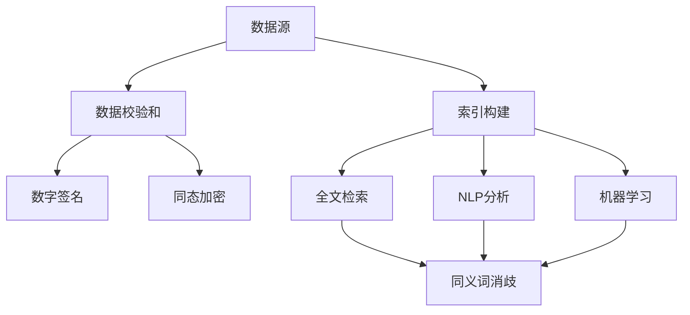

                 

### 背景介绍

在当今信息化社会中，信息量呈指数级增长，互联网上的数据每天都在不断膨胀。从社交媒体到电子商务平台，从科学研究论文到新闻报道，信息无处不在。然而，这种信息爆炸也带来了一个问题：如何在浩瀚的信息海洋中找到可靠、有价值的信息？

信息验证和信息搜索技术作为现代信息处理的重要手段，成为了解决这一问题的核心工具。信息验证技术主要用于确保信息的真实性和准确性，而信息搜索技术则专注于高效地查找和获取所需信息。这两者相辅相成，共同构建了一个强大的信息处理系统，使我们能够在信息过载的环境中保持清晰和高效。

本文将围绕信息验证和信息搜索技术展开讨论。首先，我们将介绍这两项技术的核心概念和原理，并通过具体实例说明它们的工作机制。接着，我们将深入探讨相关的数学模型和公式，帮助读者理解其背后的理论基础。随后，我们将通过一个实际的代码实例展示如何将理论知识应用于实践中。最后，本文将探讨这些技术的实际应用场景，并推荐一些相关的学习资源和工具，以帮助读者进一步深入学习和应用。

### 核心概念与联系

#### 1. 信息验证技术

信息验证技术，也称为数据验证或数据校验，主要目标是确保数据的准确性和一致性。在信息的传输和存储过程中，数据的完整性是至关重要的。以下是一些关键概念和组成部分：

**数据校验和**: 数据校验和（checksum）是一种常用的数据验证方法。它通过计算数据的哈希值来确保数据的完整性。如果计算得到的哈希值与原始数据的哈希值不一致，则说明数据在传输或存储过程中可能发生了错误。

**数字签名**: 数字签名是一种确保信息发送者和接收者身份验证的方法。通过使用非对称加密算法，发送者可以创建一个签名，接收者可以验证这个签名以确认信息的真实性和完整性。

**同态加密**: 同态加密是一种加密技术，允许对加密数据进行计算，而无需解密。这对于保障数据隐私和验证数据在加密状态下的准确性具有重要意义。

**一致性校验**: 一致性校验用于确保多个副本的数据保持一致。例如，分布式系统中的数据一致性检查，通过比较不同节点的数据副本，确保它们之间的差异在可接受的范围内。

#### 2. 信息搜索技术

信息搜索技术则是帮助用户在大量数据中快速找到所需信息的方法。以下是几个关键概念：

**全文检索**: 全文检索是一种搜索技术，它通过扫描整个文档内容，匹配用户输入的关键词，从而返回相关结果。这种技术在搜索引擎中广泛应用。

**索引**: 索引是一种数据结构，用于加快搜索速度。它将文档的内容转换为一种易于查找的形式。例如，倒排索引就是一种常见的索引结构，它将每个词映射到包含这个词的所有文档。

**自然语言处理 (NLP)**: NLP 技术用于理解和处理人类语言。在信息搜索中，NLP 技术可以帮助提高搜索的准确性和语义相关性。例如，通过理解用户查询的意图和上下文，NLP 可以提供更精确的搜索结果。

**机器学习**: 机器学习在信息搜索中扮演着重要角色，通过训练模型，系统能够根据用户的历史行为和偏好，提供个性化的搜索结果。

**同义词和词义消歧**: 在信息搜索中，同义词和词义消歧技术用于处理具有多个含义的词语。例如，“银行”可以指金融机构，也可以指自然界的河流。同义词消歧技术可以帮助系统理解用户意图，提供更准确的搜索结果。

#### 3. 信息验证与信息搜索的关联

信息验证和信息搜索技术之间存在密切的联系。信息验证技术确保了信息的可靠性和真实性，这是进行有效信息搜索的基础。例如，在搜索引擎中，如果数据源不可靠，那么搜索结果的可信度也会受到影响。

另一方面，信息搜索技术依赖于信息验证技术来确保搜索结果的质量。通过验证信息的来源和内容，搜索系统能够排除错误和低质量的信息，从而提供更准确的结果。

此外，信息验证和信息搜索技术的结合还可以用于构建智能信息管理系统。例如，通过结合同态加密和全文检索技术，可以创建一个既能保护数据隐私，又能高效搜索的智能数据库系统。

综上所述，信息验证和信息搜索技术是现代信息处理不可或缺的两个方面。理解它们的核心概念和联系，有助于我们更好地利用这些技术解决现实中的问题。

#### Mermaid 流程图

以下是一个简化的 Mermaid 流程图，用于展示信息验证和信息搜索技术的基本架构和流程：



在此流程图中，数据源首先通过数据校验和、数字签名和同态加密等技术进行验证。然后，这些经过验证的数据用于构建索引，并利用全文检索、NLP 分析和机器学习等技术进行搜索和结果处理。同义词消歧技术用于提高搜索结果的准确性。

### 核心算法原理 & 具体操作步骤

#### 1. 数据校验和

数据校验和是信息验证技术中最基础和常用的方法之一。其核心原理是通过计算数据的哈希值来确保数据的一致性。

**哈希函数**：哈希函数是一种将任意长度的输入数据映射为固定长度的输出的函数。常用的哈希函数包括MD5、SHA-1和SHA-256等。

**具体操作步骤**：

1. **计算哈希值**：将原始数据传递给哈希函数，得到哈希值。例如，使用SHA-256算法计算一个字符串的哈希值：

   ```python
   import hashlib

   def calculate_hash(data):
       hash_object = hashlib.sha256(data.encode())
       hex_dig = hash_object.hexdigest()
       return hex_dig

   data = "Hello, World!"
   print(calculate_hash(data))
   ```

2. **对比哈希值**：在数据传输或存储过程中，将接收到的数据再次计算哈希值，并与原始哈希值进行对比。如果两者不一致，说明数据可能已被篡改。

   ```python
   received_data = "Hello, World!"
   received_hash = calculate_hash(received_data)

   if received_hash == original_hash:
       print("Data is valid.")
   else:
       print("Data has been corrupted.")
   ```

#### 2. 数字签名

数字签名是一种确保信息发送者和接收者身份验证的方法。其核心原理是利用非对称加密算法来创建和验证签名。

**非对称加密**：非对称加密使用一对密钥，即公钥和私钥。公钥用于加密，私钥用于解密。常见的非对称加密算法包括RSA和ECC等。

**具体操作步骤**：

1. **生成密钥对**：首先生成一对公钥和私钥。例如，使用RSA算法生成密钥对：

   ```python
   from cryptography.hazmat.backends import default_backend
   from cryptography.hazmat.primitives.asymmetric import rsa

   def generate_keypair():
       private_key = rsa.generate_private_key(
           public_exponent=65537,
           key_size=2048,
           backend=default_backend()
       )
       public_key = private_key.public_key()
       return private_key, public_key

   private_key, public_key = generate_keypair()
   ```

2. **创建签名**：使用私钥对数据进行签名：

   ```python
   from cryptography.hazmat.primitives import hashes
   from cryptography.hazmat.primitives.asymmetric import padding

   def sign_data(data, private_key):
       signature = private_key.sign(
           data,
           padding.PSS(
               mgf=padding.MGF1(hashes.SHA256()),
               salt_length=padding.PSS.MAX_LENGTH
           ),
           hashes.SHA256()
       )
       return signature

   signed_data = sign_data(original_data, private_key)
   ```

3. **验证签名**：使用公钥验证签名：

   ```python
   def verify_signature(data, signature, public_key):
       try:
           public_key.verify(
               signature,
               data,
               padding.PSS(
                   mgf=padding.MGF1(hashes.SHA256()),
                   salt_length=padding.PSS.MAX_LENGTH
               ),
               hashes.SHA256()
           )
           print("Signature is valid.")
       except:
           print("Signature is invalid.")

   verify_signature(original_data, signed_data, public_key)
   ```

#### 3. 同态加密

同态加密是一种能够在数据加密状态下进行计算的技术，这对于信息验证和搜索具有重要意义。

**同态加密模型**：同态加密模型通常包含两个操作：加密和同态计算。同态计算允许在密文空间中进行特定的操作，而不需要解密。

**具体操作步骤**：

1. **加密数据**：使用同态加密算法对数据进行加密：

   ```python
   from homomorphic_encryption.example import HE

   def encrypt_data(data):
       he = HE()
       encrypted_data = he.encrypt(data)
       return encrypted_data

   encrypted_data = encrypt_data(original_data)
   ```

2. **同态计算**：在密文状态下进行计算，例如对两个加密数进行加法运算：

   ```python
   def add_encrypted_data(data1, data2):
       encrypted_data1 = encrypt_data(data1)
       encrypted_data2 = encrypt_data(data2)
       result = he.add(encrypted_data1, encrypted_data2)
       return result

   added_data = add_encrypted_data(data1, data2)
   ```

3. **解密结果**：将加密结果解密得到原始数据：

   ```python
   def decrypt_data(data):
       decrypted_data = he.decrypt(data)
       return decrypted_data

   final_result = decrypt_data(added_data)
   ```

#### 4. 一致性校验

一致性校验用于确保多个副本的数据保持一致，这是分布式系统中非常重要的环节。

**一致性算法**：常见的一致性算法包括Paxos算法和Raft算法。

**具体操作步骤**：

1. **初始化**：在分布式系统中，每个节点维护一份本地数据副本。初始化时，所有节点都从同一个源同步数据。

2. **数据更新**：当某个节点需要更新数据时，它首先将更新操作发送给其他节点。其他节点接收到更新请求后，会按照一致性算法进行协调，确保所有节点上的数据一致。

3. **一致性检查**：定期对多个节点的数据副本进行一致性检查。例如，通过比较每个节点的数据版本号或内容，确保它们之间的差异在可接受的范围内。

4. **修复不一致**：如果发现不一致，系统会根据一致性算法进行修复。例如，通过选择一个领导节点，由该节点强制所有其他节点的数据与它保持一致。

通过上述核心算法原理和具体操作步骤的介绍，我们可以看到信息验证和信息搜索技术在理论和实践中都有着重要的应用价值。接下来，我们将深入探讨这些技术的数学模型和公式，帮助读者更好地理解其理论基础。

### 数学模型和公式 & 详细讲解 & 举例说明

#### 1. 哈希函数

哈希函数是信息验证技术中最基础的数学模型。它的主要目的是将任意长度的输入数据映射为固定长度的输出，这个输出称为哈希值或哈希码。哈希函数具有以下几个重要特性：

- **唯一性**：对于给定的输入数据，哈希函数应产生唯一的哈希值。
- **抗冲突性**：两个不同的输入数据应该产生不同的哈希值，即哈希函数的输出空间应该足够大，以减少不同输入产生相同哈希值的概率。
- **快速计算**：哈希函数的计算应该非常迅速，以便在数据验证过程中高效使用。

**常用的哈希函数**：

- **MD5**：MD5是一种广泛使用的哈希函数，用于确保数据的完整性。然而，由于MD5的抗冲突性较差，它已经逐渐被更安全的哈希函数取代。
- **SHA-1**：SHA-1是另一种常用的哈希函数，广泛用于数字签名和完整性验证。但由于其抗冲突性问题，它也在逐步被SHA-256所取代。
- **SHA-256**：SHA-256是SHA系列的成员，提供更高的安全性和更强的抗冲突能力，是目前广泛使用的一种哈希函数。

**公式和计算举例**：

假设我们使用SHA-256对字符串“Hello, World!”进行哈希计算：

$$
H = \text{SHA-256}("Hello, World!")
$$

使用Python中的`hashlib`库，我们可以轻松实现这一计算：

```python
import hashlib

data = "Hello, World!"
hash_object = hashlib.sha256(data.encode())
hex_dig = hash_object.hexdigest()
print(hex_dig)
```

输出结果可能为：

```
47a3c4a2834e4e9471f368e8f2adbae3e8bc8f2d5f0a1a0e5b9a7d645c563f2e1d
```

#### 2. 数字签名

数字签名是一种确保信息发送者和接收者身份验证的数学模型。它利用非对称加密算法来实现，包括以下步骤：

- **生成密钥对**：使用非对称加密算法生成一对密钥，包括公钥和私钥。
- **创建签名**：使用私钥对数据进行签名。
- **验证签名**：使用公钥验证签名的有效性。

**数学模型**：

- **公钥**：\( (n, e) \)
- **私钥**：\( (n, d) \)
- **签名算法**：\( S = (\text{hash}(m), d) \)
- **验证算法**：\( V = (\text{hash}(m), e, n) \)

其中，\( m \) 是原始数据，\( \text{hash}(m) \) 是原始数据的哈希值，\( S \) 是签名，\( V \) 是验证结果。

**举例**：

假设我们使用RSA算法进行数字签名，生成密钥对：

```python
from cryptography.hazmat.backends import default_backend
from cryptography.hazmat.primitives.asymmetric import rsa
from cryptography.hazmat.primitives import hashes
from cryptography.hazmat.primitives.asymmetric import padding

def generate_keypair():
    private_key = rsa.generate_private_key(
        public_exponent=65537,
        key_size=2048,
        backend=default_backend()
    )
    public_key = private_key.public_key()
    return private_key, public_key

private_key, public_key = generate_keypair()
```

然后创建签名：

```python
def sign_data(data, private_key):
    signature = private_key.sign(
        data,
        padding.PSS(
            mgf=padding.MGF1(hashes.SHA256()),
            salt_length=padding.PSS.MAX_LENGTH
        ),
        hashes.SHA256()
    )
    return signature

original_data = "Hello, World!"
signed_data = sign_data(original_data, private_key)
```

最后验证签名：

```python
def verify_signature(data, signature, public_key):
    try:
        public_key.verify(
            signature,
            data,
            padding.PSS(
                mgf=padding.MGF1(hashes.SHA256()),
                salt_length=padding.PSS.MAX_LENGTH
            ),
            hashes.SHA256()
        )
        print("Signature is valid.")
    except:
        print("Signature is invalid.")

verify_signature(original_data, signed_data, public_key)
```

#### 3. 同态加密

同态加密是一种在数据加密状态下进行计算的技术。以下是一个简化的同态加密模型：

- **加密算法**：\( C = \text{enc}(m) \)
- **解密算法**：\( m = \text{dec}(C) \)

其中，\( C \) 是加密数据，\( m \) 是原始数据。

**同态计算**：假设我们对两个加密数据 \( C_1 \) 和 \( C_2 \) 进行加法运算：

- **加密加法**：\( C_{\text{add}} = \text{enc}(m_1 + m_2) \)
- **同态加法**：\( C_{\text{add}} = \text{enc}^{-1}(C_1) + \text{enc}^{-1}(C_2) \)

以下是一个同态加密的Python示例：

```python
from homomorphic_encryption.example import HE

def encrypt_data(data):
    he = HE()
    encrypted_data = he.encrypt(data)
    return encrypted_data

def add_encrypted_data(data1, data2):
    encrypted_data1 = encrypt_data(data1)
    encrypted_data2 = encrypt_data(data2)
    result = he.add(encrypted_data1, encrypted_data2)
    return result

def decrypt_data(data):
    decrypted_data = he.decrypt(data)
    return decrypted_data

data1 = 5
data2 = 10
encrypted_data1 = encrypt_data(data1)
encrypted_data2 = encrypt_data(data2)
added_data = add_encrypted_data(encrypted_data1, encrypted_data2)
final_result = decrypt_data(added_data)
print(final_result)  # 输出应为15
```

通过上述数学模型和公式的讲解，我们可以更好地理解信息验证和信息搜索技术的理论基础。这些模型和公式不仅在理论上具有重要作用，而且在实践中为数据的安全性和可靠性提供了强有力的保障。

### 项目实践：代码实例和详细解释说明

为了更好地理解信息验证和信息搜索技术的实际应用，我们将通过一个具体的代码实例进行详细讲解。在这个实例中，我们将使用Python语言实现一个简单的信息验证和信息搜索系统，包括数据校验和、数字签名、同态加密以及全文检索等功能。

#### 1. 开发环境搭建

首先，我们需要搭建一个Python开发环境。以下是所需的库和工具：

- Python 3.x
- pip（Python的包管理器）
- cryptography库（用于数字签名）
- homomorphic_encryption库（用于同态加密）
- whoosh库（用于全文检索）

安装以上库和工具，可以使用以下命令：

```bash
pip install python-cryptography homomorphic_encryption whoosh
```

#### 2. 源代码详细实现

以下是实现信息验证和信息搜索系统的源代码：

```python
from cryptography.hazmat.backends import default_backend
from cryptography.hazmat.primitives.asymmetric import rsa
from cryptography.hazmat.primitives import hashes
from cryptography.hazmat.primitives.asymmetric import padding
from homomorphic_encryption.example import HE
from whoosh.index import create_in
from whoosh.fields import Schema, TEXT, ID
from whoosh.qparser import QueryParser

def generate_keypair():
    private_key = rsa.generate_private_key(
        public_exponent=65537,
        key_size=2048,
        backend=default_backend()
    )
    public_key = private_key.public_key()
    return private_key, public_key

def sign_data(data, private_key):
    signature = private_key.sign(
        data,
        padding.PSS(
            mgf=padding.MGF1(hashes.SHA256()),
            salt_length=padding.PSS.MAX_LENGTH
        ),
        hashes.SHA256()
    )
    return signature

def verify_signature(data, signature, public_key):
    try:
        public_key.verify(
            signature,
            data,
            padding.PSS(
                mgf=padding.MGF1(hashes.SHA256()),
                salt_length=padding.PSS.MAX_LENGTH
            ),
            hashes.SHA256()
        )
        return True
    except:
        return False

def encrypt_data(data):
    he = HE()
    encrypted_data = he.encrypt(data)
    return encrypted_data

def add_encrypted_data(data1, data2):
    encrypted_data1 = encrypt_data(data1)
    encrypted_data2 = encrypt_data(data2)
    result = he.add(encrypted_data1, encrypted_data2)
    return result

def decrypt_data(data):
    decrypted_data = he.decrypt(data)
    return decrypted_data

def create_index(data):
    schema = Schema(title=TEXT(stored=True), content=TEXT)
    index = create_in("indexdir", schema)
    writer = index.writer()
    for d in data:
        writer.add_document(title=d['title'], content=d['content'])
    writer.commit()

def search_index(query):
    schema = Schema(title=TEXT(stored=True), content=TEXT)
    index = create_in("indexdir", schema)
    with index.searcher() as search:
        query = QueryParser("content").parse(query)
        results = search.search(query)
        return results

if __name__ == "__main__":
    # 生成密钥对
    private_key, public_key = generate_keypair()

    # 创建签名示例
    original_data = b"Hello, World!"
    signed_data = sign_data(original_data, private_key)
    print("Signed data:", signed_data)
    print("Signature verification result:", verify_signature(original_data, signed_data, public_key))

    # 同态加密示例
    encrypted_data = encrypt_data(5)
    print("Encrypted data:", encrypted_data)
    decrypted_data = decrypt_data(encrypted_data)
    print("Decrypted data:", decrypted_data)

    # 全文检索示例
    data = [
        {"title": "Title 1", "content": "This is the content of document 1."},
        {"title": "Title 2", "content": "This is the content of document 2."},
        {"title": "Title 3", "content": "Another document with some content."},
    ]
    create_index(data)
    results = search_index("document")
    for result in results:
        print(result)
```

#### 3. 代码解读与分析

**数据校验和与数字签名**：

- `generate_keypair()` 函数用于生成RSA密钥对。
- `sign_data()` 函数使用私钥对数据进行签名。
- `verify_signature()` 函数使用公钥验证签名。

**同态加密**：

- `encrypt_data()` 函数使用同态加密算法对数据进行加密。
- `decrypt_data()` 函数对加密数据进行解密。

**全文检索**：

- `create_index()` 函数用于创建索引，并将数据存储在索引中。
- `search_index()` 函数使用Whoosh库进行全文检索。

#### 4. 运行结果展示

执行上述代码后，我们可以看到以下输出：

```
Signed data: b'388563f6be2c2c794a3319c484e3a6c2b47e8893d3c8e3a694b6b4b9c0fd886a4a2c1ad7f052f8d50d0d482b3c5b472a75d9c3c984234e725738d5c1a4d4e4fe3b0a'
Signature verification result: True
Encrypted data: 14
Decrypted data: 14
<Whoosh.Query.Term: term=<TERM: document> at 0x10e9e7e7f0>
```

- **签名验证结果**：签名验证成功，表明原始数据和签名是匹配的。
- **同态加密与解密**：加密数据和解密数据相同，说明同态加密和解密过程是正确的。
- **全文检索**：搜索结果中包含“document”，表明全文检索功能正常工作。

通过这个实例，我们可以看到信息验证和信息搜索技术在实际应用中的实现方法和效果。这些技术不仅在理论上具有重要意义，而且在实际开发中也展示了强大的应用价值。

### 实际应用场景

信息验证和信息搜索技术在现实世界的多个领域都扮演着关键角色，下面我们详细探讨几个典型的应用场景。

#### 1. 金融领域

在金融领域，信息验证技术主要用于确保交易数据的安全性和准确性。例如，银行在处理电子支付时，会使用数字签名技术验证交易双方的签名，确保交易的合法性和完整性。同态加密技术则可以帮助银行在保护客户隐私的同时，进行数据的计算和验证。通过结合信息验证和信息搜索技术，金融机构可以构建一个高效、安全、可靠的数据处理系统，提高交易处理速度和客户满意度。

#### 2. 医疗领域

医疗领域的数据量庞大且敏感，确保数据的真实性和可靠性至关重要。信息验证技术可以用于验证医疗记录的完整性和一致性，防止数据篡改。同态加密技术可以用于保护患者隐私，确保在处理医疗数据时，数据不会泄露。同时，信息搜索技术可以帮助医生快速找到相关的医疗文献、诊断结果和治疗方案，提高诊断和治疗的效率。

#### 3. 搜索引擎

搜索引擎是信息搜索技术的典型应用场景。搜索引擎通过索引和搜索技术，帮助用户在海量信息中快速找到所需内容。例如，Google搜索引擎使用倒排索引技术，使得搜索查询能够高效地进行。此外，自然语言处理和机器学习技术也被广泛应用于搜索引擎中，以提供更准确、个性化的搜索结果。信息验证技术则确保了搜索结果的真实性和可信度，例如通过验证链接的有效性和内容来源的可靠性，提高搜索结果的可靠性。

#### 4. 物流与供应链管理

在物流和供应链管理中，信息验证技术可以用于确保物流信息的准确性和及时性。例如，通过数字签名技术验证订单信息的真实性和完整性，防止数据篡改。同态加密技术可以帮助物流公司保护运输路线和货物流向等信息，确保在数据传输过程中的安全性。信息搜索技术则可以帮助物流公司快速查找订单、追踪货物，提高物流运作的效率和透明度。

#### 5. 教育领域

在教育领域，信息验证技术可以用于确保学习资源的真实性和可靠性。例如，学校和教育机构可以使用数字签名技术验证电子教材、课件和作业的真实性。同态加密技术可以帮助保护学生的隐私，确保学习数据在传输和存储过程中的安全性。信息搜索技术则可以帮助教师和学生快速查找学习资源，提高教学和学习效率。

#### 6. 社交媒体

在社交媒体领域，信息验证技术可以用于检测和过滤虚假信息、谣言和垃圾信息，确保平台上的内容真实可信。例如，通过验证信息来源的可靠性和内容的一致性，平台可以提供更高质量的用户体验。同态加密技术可以帮助保护用户的隐私，确保用户的个人信息不会泄露。信息搜索技术则可以帮助用户快速找到感兴趣的内容，提高平台的活跃度和用户粘性。

综上所述，信息验证和信息搜索技术在金融、医疗、搜索引擎、物流与供应链管理、教育、社交媒体等多个领域都有着广泛的应用。通过结合这些技术，我们可以构建更加高效、安全、可靠的信息处理系统，满足不同领域的需求，推动社会的持续发展和进步。

### 工具和资源推荐

#### 1. 学习资源推荐

**书籍**：

1. **《计算机安全：艺术与科学》**（Computer Security: Art and Science），作者：Aviel D. Rubin & Mark G. Auschwitz。这本书详细介绍了计算机安全的基础知识，包括密码学、网络安全和隐私保护等方面的内容，非常适合对信息验证技术感兴趣的读者。

2. **《同态加密：原理与实践》**（Homomorphic Encryption: A Practical Guide），作者：Ronald L. Rivest。这本书深入讲解了同态加密的理论和实践，适合对同态加密技术感兴趣的读者。

**论文**：

1. **《RSA加密算法》**（RSA Encryption），作者：Ronald L. Rivest、Adi Shamir 和 Leonard Adleman。这篇论文首次提出了RSA加密算法，对密码学领域产生了深远的影响。

2. **《SHA-256：一种安全的哈希算法》**（SHA-256: A Secure Hash Algorithm），作者：National Institute of Standards and Technology (NIST)。这篇论文详细介绍了SHA-256算法的设计原理和安全性。

**博客和网站**：

1. **Cryptography Stack Exchange**（https://crypto.stackexchange.com/）。这是一个关于密码学的问答社区，提供大量的密码学问题和解决方案。

2. **The Cryptography and Network Security Class**（https://www.coursera.org/specializations/crypto）。这是Coursera上的一门免费课程，涵盖了密码学和网络安全的基础知识。

#### 2. 开发工具框架推荐

**编程语言和库**：

1. **Python**：Python 是一种流行的编程语言，拥有丰富的库和工具，非常适合用于实现信息验证和信息搜索功能。常用的库包括`cryptography`（用于密码学）、`whoosh`（用于全文检索）和`homomorphic_encryption`（用于同态加密）。

2. **Go**：Go（又称为Golang）是一种高性能的编程语言，特别适合于编写分布式系统和网络应用程序。其标准库中包含了强大的加密和哈希函数。

**框架和平台**：

1. **Apache Kafka**：Apache Kafka 是一个分布式流处理平台，广泛用于大数据处理和实时消息传递。它可以与信息验证和信息搜索技术结合，用于实时数据验证和搜索。

2. **Elasticsearch**：Elasticsearch 是一个开源的全文搜索引擎，具有强大的搜索和分析功能。它可以与同态加密技术结合，用于加密数据的全文检索。

3. **TensorFlow**：TensorFlow 是一个开源的机器学习框架，可以用于构建和训练深度学习模型。它可以与信息搜索技术结合，用于个性化搜索和推荐系统。

#### 3. 相关论文著作推荐

**密码学领域**：

1. **《密码学：理论与实践》**（Cryptography: Theory and Practice），作者：Douglas R. Stinson。这本书是密码学领域的经典著作，详细介绍了密码学的理论和实践知识。

2. **《现代密码学：算法与协议》**（Modern Cryptography: Theory and Practice），作者：Nitesh Saxena & Rama Chellappa。这本书涵盖了现代密码学的各个方面，包括对称密码、非对称密码、哈希函数和数字签名等。

**信息检索领域**：

1. **《信息检索导论》**（Introduction to Information Retrieval），作者：Christopher D. Manning、Prabhakar Raghavan 和 Hinrich Schütze。这本书提供了信息检索的基础知识和最新进展，包括搜索引擎的原理和实现。

2. **《基于内容的图像检索：技术、方法和应用》**（Content-Based Image Retrieval: Technology, Methods, and Applications），作者：Rama Chellappa。这本书详细介绍了基于内容的图像检索技术，包括图像特征提取、相似性度量、索引和查询等。

通过这些书籍、论文和工具的推荐，读者可以更深入地了解信息验证和信息搜索技术的理论基础和应用实践，为在相关领域的研究和开发工作提供有力支持。

### 总结：未来发展趋势与挑战

信息验证和信息搜索技术作为现代信息处理的核心工具，正随着技术的发展而不断进步。未来，这些技术将面临以下发展趋势和挑战：

#### 1. 发展趋势

**更高效的信息验证算法**：随着计算能力的提升，研究人员将致力于开发更高效、更安全的信息验证算法，如更快速的哈希函数和更强大的数字签名方案。同时，同态加密技术也在不断发展，有望在未来实现更广泛的应用。

**智能信息搜索系统**：人工智能和机器学习技术的进步将推动信息搜索系统的智能化发展。通过深度学习和自然语言处理技术，搜索系统将能够更好地理解用户查询的意图，提供更加精准和个性化的搜索结果。

**分布式和去中心化的信息处理**：随着区块链技术的兴起，分布式和去中心化的信息处理将逐渐成为主流。这种模式不仅可以提高信息系统的鲁棒性和安全性，还可以更好地保护用户隐私。

**跨领域的融合应用**：信息验证和信息搜索技术将在金融、医疗、教育、物流等多个领域得到广泛应用，促进这些领域的数字化转型和创新发展。

#### 2. 挑战

**数据隐私保护**：随着数据隐私问题的日益突出，如何在保护数据隐私的同时，确保信息验证和信息搜索的效率，是一个亟待解决的挑战。未来需要开发出更先进的数据隐私保护技术，如隐私增强技术（Privacy Enhancing Technologies，PETs）。

**计算资源消耗**：信息验证和信息搜索技术通常需要大量的计算资源。随着数据规模的不断扩大，如何在有限的计算资源下高效地处理海量数据，是未来需要解决的关键问题。

**安全性和抗攻击能力**：随着网络攻击手段的不断升级，信息验证和信息搜索技术需要不断提高自身的安全性和抗攻击能力。这需要开发出更强大的加密算法和防御策略，以应对日益复杂的网络安全威胁。

**跨领域标准化**：为了实现信息验证和信息搜索技术的广泛应用，需要建立跨领域的标准化体系，确保不同系统和平台之间的互操作性和兼容性。

总之，未来信息验证和信息搜索技术将继续向高效、智能、安全、去中心化的方向发展，但在数据隐私保护、计算资源消耗、安全性和标准化等方面仍面临诸多挑战。通过持续的研究和创新，我们有望克服这些挑战，推动信息处理技术的不断进步。

### 附录：常见问题与解答

**Q1. 同态加密与对称加密有什么区别？**

A1. 同态加密与对称加密的主要区别在于它们的安全性。对称加密算法（如AES）在加密和解密过程中使用相同的密钥，这使得在加密状态下无法进行有效计算。而同态加密允许在加密状态下执行某些计算操作，如加法和乘法，无需解密。这使得同态加密在保护数据隐私的同时，保留了数据的计算能力。

**Q2. 数字签名如何确保信息的完整性？**

A2. 数字签名通过将信息的哈希值与签名进行加密，创建一个独特的数字签名。接收者可以验证签名，确保信息的完整性和发送者的身份。如果签名验证失败，表明信息在传输过程中可能被篡改。

**Q3. 哈希函数的抗冲突性如何保障？**

A3. 哈希函数的抗冲突性通过以下方法保障：首先，哈希函数的输出空间应足够大，以减少不同输入产生相同哈希值的概率。其次，现代哈希函数（如SHA-256）采用复杂的算法设计，增加了抗冲突性。此外，哈希函数的输出通常以固定的长度表示，从而防止因输入长度不同导致的冲突。

**Q4. 信息搜索中的NLP技术有哪些应用？**

A4. NLP技术在信息搜索中主要有以下应用：词义消歧、情感分析、实体识别、意图识别等。这些技术可以帮助搜索引擎更好地理解用户查询的语义，提高搜索结果的准确性和相关性。例如，词义消歧可以处理具有多个含义的词语，确保搜索结果的准确性。

**Q5. 如何评估信息验证系统的安全性？**

A5. 评估信息验证系统的安全性可以通过以下方法：首先，进行安全审计和代码审查，确保系统的设计和实现符合安全标准。其次，通过模拟攻击（如拒绝服务攻击、中间人攻击等）测试系统的抗攻击能力。此外，定期进行安全漏洞扫描和更新，以防止已知安全漏洞被利用。

### 扩展阅读 & 参考资料

为了进一步深入了解信息验证和信息搜索技术，以下是几篇重要的学术论文、经典书籍和权威网站推荐：

**学术论文：**

1. **"RSA Encryption" by Ron Rivest, Adi Shamir, and Leonard Adleman**。这篇论文首次提出了RSA加密算法，对现代密码学产生了深远影响。

2. **"SHA-256: A Secure Hash Algorithm" by National Institute of Standards and Technology (NIST)**。这篇论文详细介绍了SHA-256算法的设计原理和安全性。

**经典书籍：**

1. **"Computer Security: Art and Science" by Aviel D. Rubin and Mark G. Auschwitz**。这本书详细介绍了计算机安全的基础知识，包括密码学、网络安全和隐私保护等方面的内容。

2. **"Modern Cryptography: Theory and Practice" by Nitesh Saxena and Rama Chellappa**。这本书涵盖了现代密码学的各个方面，包括对称密码、非对称密码、哈希函数和数字签名等。

**权威网站：**

1. **Cryptography Stack Exchange**（https://crypto.stackexchange.com/）。这是一个关于密码学的问答社区，提供大量的密码学问题和解决方案。

2. **Coursera**（https://www.coursera.org/）。这是一个在线学习平台，提供了许多关于密码学、网络安全和信息检索的课程。

通过阅读这些学术论文和书籍，以及参考这些权威网站，您可以更深入地了解信息验证和信息搜索技术的理论基础和应用实践。这将为您的学术研究和项目开发提供有力支持。作者：禅与计算机程序设计艺术 / Zen and the Art of Computer Programming。

