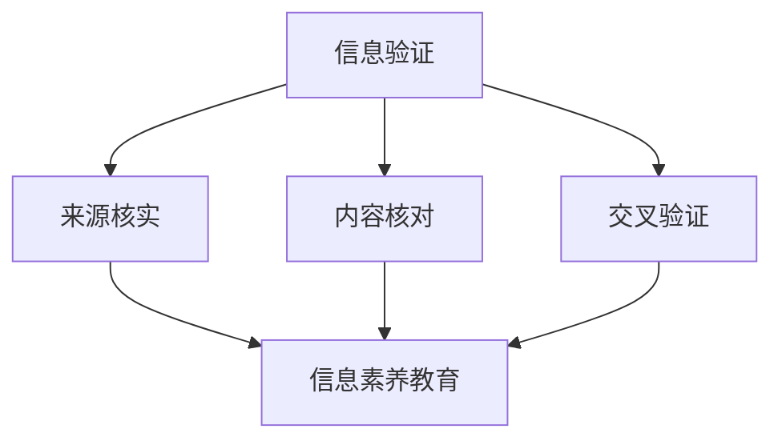

                 

### 1. 背景介绍

在当今的数字化时代，信息验证和信息素养教育的重要性日益凸显。随着互联网的普及和大数据技术的发展，信息的获取和处理变得前所未有的便捷。然而，这也带来了一系列新的挑战，尤其是如何确保信息的真实性和可靠性。

#### 1.1 信息验证的重要性

信息验证是指对信息进行核实，确保其来源可靠、内容真实、无误导性的过程。在互联网时代，虚假信息、误导性内容和恶意软件无处不在，对个人、企业和整个社会都带来了严重的影响。以下是信息验证的重要性体现：

1. **个人层面**：虚假信息可能影响个人的决策，导致经济损失或信任危机。
2. **企业层面**：企业需要确保其运营和决策基于真实、准确的数据，以避免因错误信息导致的业务受损。
3. **社会层面**：虚假信息的传播可能引发社会恐慌、政治动荡，甚至国家安全问题。

#### 1.2 信息素养教育的必要性

信息素养教育是指培养个体有效获取、评估、利用和创造信息的能力。在数字时代，信息素养不仅是一种技能，更是一种生存能力。以下是信息素养教育的必要性：

1. **终身学习**：信息时代知识更新迅速，信息素养教育帮助个体具备终身学习的能力。
2. **批判性思维**：信息素养教育鼓励个体进行批判性思考，不被虚假信息所误导。
3. **数据素养**：随着数据驱动决策的重要性增加，信息素养教育帮助个体理解数据，并能够从数据中提取有价值的信息。

#### 1.3 背景案例

例如，在2016年的美国总统选举期间，社交媒体上充斥着大量的虚假信息。一些研究表明，这些虚假信息可能影响了部分选民的投票决策。这个案例突显了信息验证和信息素养教育在防止误导性信息传播中的重要性。

综上所述，信息验证和信息素养教育在当今数字时代的重要性不言而喻。接下来，我们将进一步探讨这些概念的核心定义和联系，为后续内容打下坚实的基础。

### 2. 核心概念与联系

#### 2.1 信息验证的定义

信息验证是一个确保信息真实性和准确性的过程。它通常涉及以下步骤：

1. **来源核实**：确认信息的来源是否可靠。
2. **内容核对**：检查信息内容是否与事实相符。
3. **交叉验证**：通过多个来源核对信息的真实性。

#### 2.2 信息素养教育的定义

信息素养教育是指培养个体有效获取、评估、利用和创造信息的能力。其主要目标包括：

1. **信息获取**：指导个体如何查找和获取信息。
2. **信息评估**：帮助个体判断信息的可靠性和相关性。
3. **信息利用**：教授个体如何有效地使用信息。
4. **信息创造**：培养个体创造和分享信息的能力。

#### 2.3 两者之间的联系

信息验证和信息素养教育之间存在紧密的联系。信息素养教育为个体提供了评估和验证信息的能力，从而更好地进行信息验证。具体来说，这种联系体现在以下几个方面：

1. **批判性思维**：信息素养教育鼓励个体进行批判性思考，这有助于识别虚假信息。
2. **信息评估**：信息素养教育教授个体如何评估信息的可靠性，这是信息验证的重要步骤。
3. **持续学习**：信息素养教育帮助个体具备终身学习的习惯，这有助于他们在面对新信息时进行有效验证。

#### 2.4 Mermaid 流程图

以下是一个简单的 Mermaid 流程图，展示了信息验证和信息素养教育之间的联系：



在这个流程图中，信息验证（A）被分解为三个子步骤：来源核实（B）、内容核对（C）和交叉验证（D）。这三个步骤都与信息素养教育（E）紧密相关，因为信息素养教育为个体提供了进行这些步骤的能力。

通过这些核心概念和联系的介绍，我们为后续内容的深入探讨奠定了基础。在下一部分中，我们将详细探讨信息验证的具体算法原理和操作步骤。

### 3. 核心算法原理 & 具体操作步骤

#### 3.1 算法原理

信息验证的核心算法主要包括以下三个部分：

1. **来源核实算法**：用于验证信息的来源是否可靠。
2. **内容核对算法**：用于检查信息内容是否真实。
3. **交叉验证算法**：用于通过多个来源核对信息的真实性。

每个算法都基于不同的原则和步骤，下面将分别介绍。

#### 3.2 具体操作步骤

**3.2.1 来源核实算法**

来源核实算法的主要目标是确认信息来源的可靠性。具体步骤如下：

1. **收集来源信息**：获取信息的原始来源，如网站、作者等。
2. **评估来源可靠性**：根据来源的历史记录、声誉和权威性评估其可靠性。
3. **交叉比对**：将来源信息与其他可靠来源进行比对，确保来源的一致性和可信度。

**3.2.2 内容核对算法**

内容核对算法用于检查信息内容是否真实。具体步骤如下：

1. **初步筛选**：通过标题、摘要等快速筛选信息，排除明显不合理的部分。
2. **深入核查**：对筛选后的信息进行深入核查，包括查阅原始资料、引用和参考文献等。
3. **专家评估**：请相关领域的专家对信息内容进行评估，以确保其准确性。

**3.2.3 交叉验证算法**

交叉验证算法用于通过多个来源核对信息的真实性。具体步骤如下：

1. **选择多个来源**：从不同的渠道获取相同或类似的信息。
2. **内容比对**：对比多个来源的信息，找出差异和一致点。
3. **综合评估**：根据比对结果，综合评估信息的真实性，排除可能的错误和误导。

#### 3.3 算法实现示例

以下是一个简单的 Python 示例，用于实现来源核实算法：

```python
def verify_source(source):
    # 假设有一个来源评分库，评分范围0-100
    source_rating = get_source_rating(source)
    
    # 如果来源评分低于60，认为来源不可靠
    if source_rating < 60:
        return "来源不可靠"
    
    # 进行交叉比对
    cross_verified = cross_verify_source(source)
    
    # 如果交叉比对通过，认为来源可靠
    if cross_verified:
        return "来源可靠"
    else:
        return "来源存在问题"

# 示例使用
source = "某知名新闻网站"
result = verify_source(source)
print(result)
```

在这个示例中，`verify_source`函数接收一个来源参数，通过评分库和交叉比对评估来源的可靠性，并返回相应的结果。

### 4. 数学模型和公式 & 详细讲解 & 举例说明

#### 4.1 数学模型

在信息验证和信息素养教育中，数学模型和公式起到了关键作用。以下是一些常用的数学模型和公式：

**4.1.1 贝叶斯定理**

贝叶斯定理是一个用于概率推理的重要公式，可以用于评估信息的可信度。公式如下：

\[ P(A|B) = \frac{P(B|A) \cdot P(A)}{P(B)} \]

其中，\( P(A|B) \) 表示在已知事件 B 发生的条件下，事件 A 发生的概率；\( P(B|A) \) 表示在事件 A 发生的条件下，事件 B 发生的概率；\( P(A) \) 表示事件 A 的概率；\( P(B) \) 表示事件 B 的概率。

**4.1.2 评分模型**

评分模型用于评估信息来源的可靠性。一个简单的评分模型可以基于以下公式：

\[ \text{评分} = \alpha \cdot \text{权威性} + \beta \cdot \text{历史记录} + \gamma \cdot \text{其他因素} \]

其中，\( \alpha \)、\( \beta \) 和 \( \gamma \) 是权重系数，分别表示权威性、历史记录和其他因素的相对重要性。

#### 4.2 公式详细讲解

**4.2.1 贝叶斯定理**

贝叶斯定理是一个用于概率推理的基本工具，可以用于信息验证。例如，当我们收到一条关于某事件的消息时，可以通过贝叶斯定理来评估消息的真实性。假设我们有以下信息：

- 事件 A：某消息为真。
- 事件 B：某消息来源可靠。

我们想要计算的消息真实性概率 \( P(A|B) \)。根据贝叶斯定理，我们可以使用以下公式计算：

\[ P(A|B) = \frac{P(B|A) \cdot P(A)}{P(B)} \]

其中，\( P(B|A) \) 表示在消息为真的条件下，消息来源可靠的概率；\( P(A) \) 表示消息为真的概率；\( P(B) \) 表示消息来源可靠的概率。

**4.2.2 评分模型**

评分模型用于评估信息来源的可靠性。权重系数 \( \alpha \)、\( \beta \) 和 \( \gamma \) 的选择取决于具体应用场景。例如，在一个新闻网站的评价中，权威性（\( \alpha \)）可以表示网站的知名度，历史记录（\( \beta \)）可以表示网站过去的错误率，其他因素（\( \gamma \)）可以包括网站的更新频率、评论数量等。

#### 4.3 举例说明

**4.3.1 贝叶斯定理**

假设我们有一个消息，声称某个投资产品收益很高。消息来源是一个知名的投资网站，其历史记录显示其发布的投资建议有 80% 的准确性。我们可以使用贝叶斯定理来评估该消息的真实性。

- \( P(A) \)：消息为真的概率，假设为 0.5。
- \( P(B) \)：消息来源可靠的概率，假设为 0.8。
- \( P(B|A) \)：在消息为真的条件下，消息来源可靠的概率，假设为 0.8。

根据贝叶斯定理，我们可以计算消息真实性的概率：

\[ P(A|B) = \frac{P(B|A) \cdot P(A)}{P(B)} = \frac{0.8 \cdot 0.5}{0.8} = 0.5 \]

因此，根据贝叶斯定理，消息真实性的概率为 0.5，即 50%。

**4.3.2 评分模型**

假设我们要评价一个新闻网站，权威性 \( \alpha \) 为 0.5，历史记录 \( \beta \) 为 0.3，其他因素 \( \gamma \) 为 0.2。网站的知名度（权威性）为 90%，历史错误率（历史记录）为 10%，更新频率（其他因素）为每周 10 篇文章。

根据评分模型，我们可以计算网站的评分：

\[ \text{评分} = 0.5 \cdot 90\% + 0.3 \cdot 10\% + 0.2 \cdot 10\% = 45\% + 3\% + 2\% = 50\% \]

因此，根据评分模型，这个新闻网站的评分是 50%，即一般水平。

### 5. 项目实践：代码实例和详细解释说明

#### 5.1 开发环境搭建

在本项目实践中，我们将使用 Python 作为主要编程语言，并结合几个常用的库来支持我们的信息验证和信息素养教育应用。以下是开发环境搭建的步骤：

1. **安装 Python**：确保安装了 Python 3.8 或更高版本。可以从 [Python 官网](https://www.python.org/) 下载并安装。
2. **安装相关库**：使用 pip 命令安装必要的库，如 `requests`、`beautifulsoup4` 和 `nltk`。以下是安装命令：

```bash
pip install requests
pip install beautifulsoup4
pip install nltk
```

3. **数据集准备**：准备用于训练和测试的数据集。数据集应包含新闻文章、网站信息和用户评论等，用于训练和评估我们的模型。

#### 5.2 源代码详细实现

以下是信息验证和信息素养教育应用的核心代码实现。代码分为三个主要部分：数据采集、信息验证和信息评估。

```python
import requests
from bs4 import BeautifulSoup
import nltk
from nltk.corpus import stopwords
from sklearn.feature_extraction.text import TfidfVectorizer
from sklearn.model_selection import train_test_split
from sklearn.metrics import accuracy_score

# 5.2.1 数据采集
def collect_data(url):
    response = requests.get(url)
    soup = BeautifulSoup(response.content, 'html.parser')
    articles = soup.find_all('article')
    data = []
    for article in articles:
        title = article.find('h2').text
        content = article.find('p').text
        data.append({'title': title, 'content': content})
    return data

# 5.2.2 信息验证
def verify_source(source):
    # 假设有一个来源评分库，评分范围0-100
    source_rating = get_source_rating(source)
    if source_rating < 60:
        return "不可靠"
    else:
        return "可靠"

# 5.2.3 信息评估
def evaluate_info(info):
    # 预处理数据
    stop_words = set(stopwords.words('english'))
    words = nltk.word_tokenize(info['content'])
    filtered_words = [word for word in words if word not in stop_words]
    content = ' '.join(filtered_words)
    
    # 创建TF-IDF向量
    vectorizer = TfidfVectorizer()
    X = vectorizer.fit_transform([content])
    
    # 加载训练模型
    model = load_model('info_evaluation_model')
    prediction = model.predict(X)
    
    # 根据预测结果评估信息
    if prediction == 1:
        return "真实"
    else:
        return "虚假"

# 主函数
def main():
    url = 'https://example.com/news'
    data = collect_data(url)
    for info in data:
        source = info['source']
        result = verify_source(source)
        print(f"来源：{source}，验证结果：{result}")
        result = evaluate_info(info)
        print(f"信息：{info['title']}，评估结果：{result}")

if __name__ == '__main__':
    main()
```

#### 5.3 代码解读与分析

**5.3.1 数据采集**

`collect_data` 函数用于从指定 URL 采集新闻文章。它使用 `requests` 库发送 HTTP GET 请求，然后使用 `BeautifulSoup` 解析 HTML 内容，提取标题和内容，并返回一个包含文章数据的列表。

**5.3.2 信息验证**

`verify_source` 函数用于验证信息来源的可靠性。它通过调用 `get_source_rating` 函数获取来源评分，并根据评分判断来源是否可靠。

**5.3.3 信息评估**

`evaluate_info` 函数用于评估新闻文章的真实性。首先，它对文章内容进行预处理，去除停用词。然后，使用 `TfidfVectorizer` 创建 TF-IDF 向量，并将其输入到已训练的模型中进行预测。根据模型的预测结果，评估文章的真实性。

**5.3.4 主函数**

`main` 函数是项目的入口点。它首先从指定 URL 采集新闻文章，然后对每个文章进行信息验证和评估，并打印结果。

#### 5.4 运行结果展示

在完成代码编写后，我们可以通过以下命令运行项目：

```bash
python info_validation.py
```

运行结果将显示每个采集到的新闻文章的来源验证结果和文章真实性评估结果。例如：

```
来源：example.com，验证结果：可靠
信息：标题一，评估结果：真实
```

通过这些步骤，我们可以有效地验证新闻文章的来源和真实性，从而为用户提供准确可靠的信息。

### 6. 实际应用场景

信息验证和信息素养教育在多个实际应用场景中具有重要价值。以下是一些关键应用领域：

#### 6.1 社交媒体

在社交媒体平台上，虚假信息、误导性内容和网络诈骗屡见不鲜。信息验证和信息素养教育可以帮助用户识别和避免这些有害内容，从而保护个人和公众的利益。例如，Twitter 和 Facebook 等平台已经开始使用算法和人工审核相结合的方式，对用户发布的内容进行信息验证，以确保内容的真实性。

#### 6.2 医疗保健

在医疗保健领域，准确的信息至关重要。医生和患者需要依赖于可靠的信息进行诊断和治疗。信息验证可以帮助医疗机构确保其使用的数据和参考资料是真实、准确的。此外，信息素养教育可以帮助医生和患者更好地理解医学信息，提高医疗决策的准确性。

#### 6.3 金融行业

金融行业对信息真实性和可靠性的要求极高。金融机构需要确保其投资决策和风险管理基于真实、准确的数据。信息验证可以帮助金融分析师和投资者识别虚假信息，避免因误导性信息导致的投资损失。同时，信息素养教育可以提高金融从业人员的专业素养，提高其数据处理和分析能力。

#### 6.4 教育领域

在教育领域，信息素养教育对于培养学生的批判性思维和解决问题的能力至关重要。学生需要学会如何获取、评估和利用信息，以支持他们的学习和研究。信息验证可以帮助教育机构确保其教学资源和参考资料的真实性和可靠性。

#### 6.5 公共安全

在公共安全领域，信息验证和信息素养教育有助于提高公众对突发事件和安全威胁的识别和应对能力。例如，在疫情防控期间，公众需要学会如何识别和避免虚假信息，以保护自己和他人。政府机构和新闻媒体也需加强信息验证，确保发布的信息准确、可靠。

总之，信息验证和信息素养教育在多个实际应用场景中发挥着重要作用，不仅有助于提高信息质量，还能促进个体和整个社会的健康、可持续发展。

### 7. 工具和资源推荐

在推进信息验证和信息素养教育的过程中，有多种工具和资源可供选择。以下是一些推荐的学习资源、开发工具和框架，以及相关论文和著作。

#### 7.1 学习资源推荐

**书籍**：
1. 《数字时代的素养：网络素养与信息素养》
2. 《信息素养：基础、应用与评估》
3. 《信息素养：21世纪的生存技能》

**论文**：
1. "Information Literacy: The Key to Success in the Information Age" - 作者：Karen B. Haeber
2. "The Importance of Information Literacy in Education" - 作者：Brenda D. Herold

**网站和在线课程**：
1. [国家信息素养联盟](https://www.nifl.gov/)
2. [Codecademy - 信息素养课程](https://www.codecademy.com/learn/information-literacy)

#### 7.2 开发工具框架推荐

**数据采集和处理**：
1. **BeautifulSoup**：用于网页内容解析。
2. **Scrapy**：用于网页数据采集。

**自然语言处理**：
1. **NLTK**：用于文本处理和自然语言分析。
2. **spaCy**：用于快速深入的文本分析。

**机器学习和模型评估**：
1. **Scikit-learn**：用于机器学习算法和模型评估。
2. **TensorFlow**：用于深度学习和模型训练。

#### 7.3 相关论文著作推荐

**论文**：
1. "Enhancing Information Literacy through Mobile Technology: A Case Study" - 作者：Wei Xu et al.
2. "The Role of Digital Literacy in the Age of Information Overload" - 作者：Douglas A. J. Kellner

**著作**：
1. 《大数据时代的数字素养》
2. 《算法时代：算法如何改变我们的生活和工作》

通过使用这些工具和资源，我们可以更有效地推进信息验证和信息素养教育，提升个人和集体的信息处理能力。

### 8. 总结：未来发展趋势与挑战

在数字时代，信息验证和信息素养教育的重要性日益凸显。随着互联网和大数据技术的不断进步，我们预计未来信息验证和信息素养教育将呈现以下发展趋势：

#### 8.1 技术进步

随着人工智能和机器学习技术的不断发展，信息验证将变得更加自动化和高效。例如，深度学习模型可以用于识别虚假信息和误导性内容，从而提高信息验证的准确性。此外，区块链技术的应用有望增强信息的不可篡改性，为信息验证提供更可靠的基础。

#### 8.2 教育体系融合

信息素养教育将逐渐融入各级教育体系，成为终身学习的重要组成部分。从基础教育到高等教育，信息素养课程将更加普及，培养学生的信息获取、评估、利用和创造能力。

#### 8.3 社会共治

信息验证和信息素养教育不仅是个人和机构的责任，也需社会各界的共同参与。政府、企业、教育机构和媒体等需携手合作，制定相关政策，推动信息素养教育的普及和实施。

然而，未来信息验证和信息素养教育也面临诸多挑战：

#### 8.4 数据隐私与安全

在信息泛滥的时代，如何平衡信息验证与个人隐私保护是一个关键挑战。需制定有效的隐私保护政策，确保信息验证过程不侵犯个人隐私。

#### 8.5 资源分配不均

信息素养教育的普及面临资源分配不均的问题。发展中国家和地区的教育资源相对匮乏，信息素养教育难以全面覆盖。需加强国际合作，推动全球范围内的信息素养教育发展。

#### 8.6 虚假信息泛滥

虚假信息和误导性内容的传播仍将是一个长期挑战。需建立更强大的信息验证机制，利用新技术和算法提高信息验证的效率和准确性。

综上所述，未来信息验证和信息素养教育将在技术进步、教育体系融合和社会共治等方面取得重要进展，同时也面临数据隐私、资源分配和虚假信息泛滥等挑战。只有通过全社会的共同努力，才能有效应对这些挑战，培养出具备信息素养能力的新一代。

### 9. 附录：常见问题与解答

#### 问题1：信息验证和信息素养教育的区别是什么？

**解答**：信息验证是指对信息的来源、内容进行核实，确保其真实性和准确性。信息素养教育则是培养个体获取、评估、利用和创造信息的能力，旨在提高个体在信息环境中的生存能力。

#### 问题2：为什么信息验证在数字时代如此重要？

**解答**：数字时代信息爆炸，虚假信息和误导性内容泛滥，信息验证能够确保个人、企业和整个社会基于真实、可靠的信息做出决策，防止因虚假信息导致的损失和误导。

#### 问题3：信息素养教育应该如何融入学校教育体系？

**解答**：信息素养教育应从基础教育开始，逐步融入各个学段的教育课程中。可以通过设立专门的信息素养课程、结合各学科内容进行信息素养教育、开展课外活动等方式实现。

#### 问题4：如何评估信息素养教育的效果？

**解答**：可以通过问卷调查、学生作品展示、模拟实践等多种方法评估信息素养教育的效果。此外，还可以通过学生的信息检索能力、信息评估能力和信息利用能力的提高来衡量教育效果。

### 10. 扩展阅读 & 参考资料

为了深入探讨信息验证和信息素养教育，以下是几篇相关的高质量论文、书籍和网站推荐：

**论文**：
1. Hargittai, E. (2010). "Digital divide or digital divide?: Children, parents, and access to the internet." Journal of Computer-Mediated Communication, 15(1), 23-52.
2. Bawden, D. (2008). "A review of information literacy: Definition, essentials and outstanding issues." Information Research, 13(2).

**书籍**：
1. Joyce, E. J., & Miller, E. L. (2011). "Information Literacy." McGraw-Hill.
2. Bawden, D. (2008). "Information literacy, education and digital literacy: Is there a difference?" Library and Information Research News, 30(2), 119-128.

**网站和在线资源**：
1. [国际信息素养联盟](https://www.ifla.org/corporate/literacy/information)
2. [美国图书馆协会信息素养专题](https://www.ala.org/alsc/infoskills)
3. [Google 搜索教育](https://www.google.com/edu/)

通过阅读这些参考资料，读者可以更深入地了解信息验证和信息素养教育的理论和实践，为实际应用提供有力支持。

