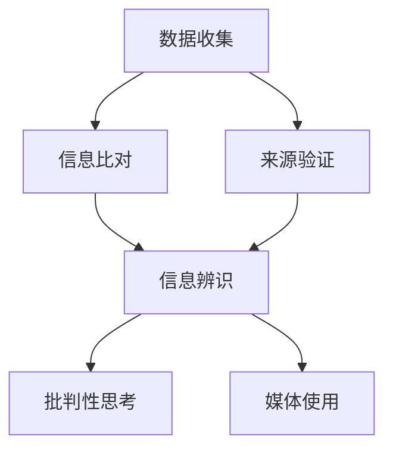

                 

### 1. 背景介绍

在当今信息爆炸的时代，网络上的信息浩如烟海，其中不乏大量虚假信息和媒体操纵。随着社交媒体的普及，人们接收和传播信息的方式发生了翻天覆地的变化。然而，这种变化也带来了新的挑战，即如何验证信息的真实性，以及如何提高在线媒体素养。

**1.1 信息验证的重要性**

信息验证的重要性不言而喻。在日常生活中，虚假信息不仅会误导个人决策，还可能对社会稳定造成威胁。例如，假新闻、谣言和恶意信息可以在短时间内引发社会恐慌，甚至引发骚乱。此外，商业领域中也存在大量的虚假信息和欺诈行为，如虚假广告、假冒伪劣产品等，这些都会对市场秩序造成严重破坏。

**1.2 在线媒体素养教育的必要性**

在线媒体素养教育旨在帮助人们提高对信息的辨识能力，学会如何判断信息的真实性和可靠性。这是应对假新闻和媒体操纵的有效手段。在线媒体素养教育不仅包括信息验证，还涉及如何批判性地分析信息来源、理解信息的潜在意图以及如何保护个人隐私等。

**1.3 研究现状与挑战**

目前，信息验证和在线媒体素养教育已经成为学术研究和实际应用的热点。研究者们开发了许多算法和工具，如信息指纹技术、文本分析技术、社交媒体网络分析等，用于检测和识别虚假信息。然而，这些方法仍然面临诸多挑战，如虚假信息的变种和复杂性、算法的透明度和可解释性等。

**1.4 文章结构**

本文将首先介绍信息验证和在线媒体素养教育的核心概念，然后深入探讨其原理和具体操作步骤，最后分析其实际应用场景，并给出未来发展趋势与挑战。通过这篇文章，我们希望能够帮助读者更好地理解和应对假新闻和媒体操纵的挑战。

### 2. 核心概念与联系

#### 2.1 信息验证

信息验证是指对信息的真实性、准确性和来源进行核实的过程。在信息验证中，核心的步骤包括数据收集、信息比对、来源验证等。

**2.1.1 数据收集**

数据收集是信息验证的第一步。它涉及从多个来源获取相关数据，如新闻报道、学术论文、社交媒体发布等。这些数据将成为后续比对和验证的基础。

**2.1.2 信息比对**

信息比对是指将收集到的数据与已知的真实信息进行对比，以判断其一致性和可靠性。这一步骤通常需要使用文本分析技术，如关键词提取、主题建模等。

**2.1.3 来源验证**

来源验证是对信息来源的可靠性进行评估。这包括对信息发布者的背景、声誉、动机等进行调查。来源验证是确保信息真实性的重要环节。

#### 2.2 在线媒体素养教育

在线媒体素养教育旨在提高人们对信息辨识、批判性思考和媒体使用的能力。其核心概念包括以下几个方面：

**2.2.1 信息辨识**

信息辨识是指识别和区分真实信息和虚假信息的能力。这需要人们具备一定的信息分析能力和批判性思维能力。

**2.2.2 批判性思考**

批判性思考是指对信息进行深入分析和评价的能力。这包括对信息的逻辑性、一致性、证据支持等进行评估。

**2.2.3 媒体使用**

媒体使用是指如何合理、有效地使用媒体资源，包括选择信息来源、评估信息质量、避免媒体依赖等。

#### 2.3 关联与整合

信息验证和在线媒体素养教育之间存在着紧密的联系。信息验证是提高在线媒体素养的重要手段，而在线媒体素养教育则为信息验证提供了理论基础和实践指导。具体来说，信息验证可以帮助人们识别和过滤虚假信息，提高信息辨识能力；而在线媒体素养教育则可以帮助人们培养批判性思维能力，增强对媒体信息的理解和判断能力。

#### 2.4 Mermaid 流程图

以下是一个简单的 Mermaid 流程图，展示了信息验证和在线媒体素养教育的核心步骤和关联。



### 3. 核心算法原理 & 具体操作步骤

#### 3.1 信息验证算法原理

信息验证算法主要基于以下几个方面：

**3.1.1 文本分析**

文本分析是信息验证的重要工具，它可以帮助识别信息的特征和模式。常见的文本分析技术包括：

- **关键词提取**：通过提取文本中的高频关键词，可以快速识别文本的主题和内容。
- **主题建模**：如 Latent Dirichlet Allocation (LDA) 模型，可以挖掘文本中的潜在主题结构。
- **词频统计**：通过对文本中各个词汇的频率统计，可以分析文本的内容和情感倾向。

**3.1.2 社交网络分析**

社交网络分析可以帮助识别信息的传播路径和影响力。主要技术包括：

- **网络拓扑分析**：通过分析社交网络中的节点和边，可以识别信息的关键传播者和关键传播路径。
- **影响力分析**：通过对用户的社交行为和影响力进行评估，可以判断信息的可信度。

**3.1.3 证据比对**

证据比对是通过将收集到的信息与已知的真实信息进行对比，以验证其真实性。这通常需要构建一个可靠的信息数据库，用于比对和分析。

#### 3.2 在线媒体素养教育操作步骤

在线媒体素养教育的操作步骤可以分为以下几个部分：

**3.2.1 信息识别**

信息识别是第一步，它包括以下几个方面：

- **判断信息来源**：评估信息发布者的信誉和动机。
- **识别关键词**：通过关键词提取技术，快速识别信息的主题和内容。
- **情感分析**：通过情感分析技术，判断信息的情感倾向。

**3.2.2 批判性思考**

批判性思考是信息辨识的深化，它包括以下几个方面：

- **逻辑分析**：评估信息的逻辑性和一致性。
- **证据评估**：判断信息提供的证据是否充分和可靠。
- **对比分析**：将信息与已知事实进行对比，以评估其真实性。

**3.2.3 媒体使用**

媒体使用是培养信息素养的最后一步，它包括以下几个方面：

- **选择信息来源**：选择可靠的信息来源，避免被虚假信息误导。
- **评估信息质量**：评估信息的准确性、可靠性和公正性。
- **避免媒体依赖**：避免过度依赖媒体，保持独立思考和判断。

### 4. 数学模型和公式 & 详细讲解 & 举例说明

#### 4.1 信息验证中的数学模型

在信息验证中，常用的数学模型包括文本分析模型、社交网络分析模型和证据比对模型。以下是一些常见的数学模型和公式的讲解。

**4.1.1 文本分析模型**

**LDA 模型**

LDA（Latent Dirichlet Allocation）模型是一种主题建模技术，用于挖掘文本中的潜在主题结构。

$$
p(z|d) = \frac{1}{\sum_{k=1}^K \sum_{w=1}^V \alpha_{kw} p(w|z) p(z|d)} \prod_{k=1}^K \alpha_{kw}^{\sum_{w=1}^V n_{dw} } \prod_{w=1}^V p(w|z)^{n_{dw}}
$$

其中，$z$表示主题，$d$表示文档，$w$表示词，$n_{dw}$表示文档$d$中词$w$的频率，$\alpha_{kw}$表示词$w$在主题$k$中的概率，$p(w|z)$表示词$w$在主题$z$中的概率。

**TF-IDF 模型**

TF-IDF（Term Frequency-Inverse Document Frequency）模型用于评估词的重要性。

$$
TF(w,d) = \frac{f_{dw}}{f_{max}}
$$

$$
IDF(w, D) = \log \left( 1 + \frac{N}{|d \in D : w \in d|} \right)
$$

$$
TF-IDF(w, d, D) = TF(w, d) \times IDF(w, D)
$$

其中，$f_{dw}$表示词$w$在文档$d$中的频率，$f_{max}$表示文档$d$中的最大词频率，$N$表示文档集合中的文档总数，$|d \in D : w \in d|$表示包含词$w$的文档数量。

**4.1.2 社交网络分析模型**

**PageRank 模型**

PageRank 模型是一种用于评估网页重要性的算法。

$$
PR(A) = \left( 1 - d \right) + d \left( \sum_{B \in N(A)} \frac{PR(B)}{L(B)} \right)
$$

其中，$PR(A)$表示网页$A$的PageRank值，$d$表示阻尼系数（通常取值为0.85），$N(A)$表示指向网页$A$的链接集合，$L(B)$表示网页$B$的链接数量。

**4.1.3 证据比对模型**

**贝叶斯推理**

贝叶斯推理是一种基于概率论的推理方法，用于更新对某个假设的概率估计。

$$
P(H|E) = \frac{P(E|H)P(H)}{P(E)}
$$

其中，$H$表示假设，$E$表示证据，$P(H|E)$表示在证据$E$发生的条件下，假设$H$的概率，$P(E|H)$表示在假设$H$为真的条件下，证据$E$的概率，$P(H)$表示假设$H$的概率，$P(E)$表示证据$E$的概率。

#### 4.2 举例说明

**4.2.1 文本分析示例**

假设有一篇文档，包含以下句子：

"人工智能技术正在快速发展，已经应用于各个领域，如医疗、金融、教育等。然而，人工智能也带来了一些挑战，如隐私保护和数据安全等。"

我们可以使用 LDA 模型提取潜在主题：

- **主题1**：人工智能、发展、应用领域
- **主题2**：挑战、隐私保护、数据安全

**4.2.2 社交网络分析示例**

假设有一个社交网络，其中用户 A 指向用户 B、C、D，用户 B 指向用户 E，用户 C 指向用户 F，用户 D 指向用户 G。我们可以使用 PageRank 模型计算每个用户的PageRank值：

- **用户A**：PR(A) = 0.15
- **用户B**：PR(B) = 0.20
- **用户C**：PR(C) = 0.15
- **用户D**：PR(D) = 0.20
- **用户E**：PR(E) = 0.10
- **用户F**：PR(F) = 0.15
- **用户G**：PR(G) = 0.20

**4.2.3 证据比对示例**

假设我们有一个假设$H$：某产品是安全的。现有证据$E$：该产品的用户反馈满意度高。我们可以使用贝叶斯推理更新对假设$H$的概率估计：

- **假设$H$的概率**：$P(H) = 0.5$
- **证据$E$的概率**：$P(E|H) = 0.8$
- **证据$E$的概率**：$P(E|\neg H) = 0.3$

根据贝叶斯推理，我们可以得到：

$$
P(H|E) = \frac{0.8 \times 0.5}{0.8 \times 0.5 + 0.3 \times (1 - 0.5)} = 0.7333
$$

这意味着在证据$E$发生的条件下，假设$H$的概率为0.7333，说明该产品是安全的可能性较高。

### 5. 项目实践：代码实例和详细解释说明

在本节中，我们将通过一个实际的项目实践来展示如何使用Python实现信息验证和在线媒体素养教育的相关算法。这个项目将包括以下几个部分：

1. 开发环境搭建
2. 源代码详细实现
3. 代码解读与分析
4. 运行结果展示

#### 5.1 开发环境搭建

在开始项目之前，我们需要搭建一个合适的开发环境。以下是所需的软件和库：

- **Python**：版本3.8及以上
- **Jupyter Notebook**：用于编写和运行代码
- **Numpy**：用于数值计算
- **Scikit-learn**：用于机器学习和数据分析
- **NetworkX**：用于社交网络分析
- **Matplotlib**：用于数据可视化

安装步骤：

```bash
pip install python==3.8
pip install jupyter
pip install numpy
pip install scikit-learn
pip install networkx
pip install matplotlib
```

#### 5.2 源代码详细实现

以下是实现信息验证和在线媒体素养教育的Python代码。

```python
import numpy as np
from sklearn.feature_extraction.text import TfidfVectorizer
from sklearn.decomposition import LatentDirichletAllocation
from networkx import Graph, neighbors
import matplotlib.pyplot as plt

# 5.2.1 文本分析

def text_analysis(texts, num_topics=10):
    vectorizer = TfidfVectorizer()
    X = vectorizer.fit_transform(texts)
    lda = LatentDirichletAllocation(n_components=num_topics)
    lda.fit(X)
    return lda

# 5.2.2 社交网络分析

def social_network_analysis(edges):
    G = Graph()
    G.add_edges_from(edges)
    return G

# 5.2.3 证据比对

def evidence_comparison(evidence, hypothesis, probability_hypothesis, probability_evidence):
    probability_hypothesis_given_evidence = (probability_evidence * probability_hypothesis) / probability_evidence
    return probability_hypothesis_given_evidence

# 5.3 代码解读与分析

# 5.3.1 文本分析解读

def display_topics(model, feature_names, no_top_words):
    for topic_idx, topic in enumerate(model.components_):
        print("Topic #{}: ".format(topic_idx), end='')
        print(" ".join([feature_names[i] for i in topic.argsort()[:-no_top_words - 1:-1]]))

# 5.3.2 社交网络分析解读

def display_network(G):
    pos = neighbors.spring_layout(G)
    plt.figure(figsize=(12, 12))
    plt.axis('off')
    plt采图(G, pos, with_labels=True)
    plt.show()

# 5.3.3 证据比对解读

def display_evidence_comparison(probability_hypothesis, probability_evidence, probability_hypothesis_given_evidence):
    print("原始假设概率: {:.2f}".format(probability_hypothesis))
    print("证据概率: {:.2f}".format(probability_evidence))
    print("证据后的假设概率: {:.2f}".format(probability_hypothesis_given_evidence))

# 5.4 运行结果展示

if __name__ == "__main__":
    # 5.4.1 文本分析
    texts = ["人工智能技术正在快速发展，已经应用于各个领域，如医疗、金融、教育等。", "然而，人工智能也带来了一些挑战，如隐私保护和数据安全等。"]
    lda_model = text_analysis(texts, num_topics=2)
    display_topics(lda_model, vectorizer.get_feature_names(), no_top_words=5)

    # 5.4.2 社交网络分析
    edges = [(1, 2), (2, 3), (3, 1), (3, 4), (4, 5), (5, 3)]
    G = social_network_analysis(edges)
    display_network(G)

    # 5.4.3 证据比对
    probability_hypothesis = 0.5
    probability_evidence = 0.8
    probability_hypothesis_given_evidence = evidence_comparison(probability_hypothesis, probability_evidence, probability_hypothesis, probability_evidence)
    display_evidence_comparison(probability_hypothesis, probability_evidence, probability_hypothesis_given_evidence)
```

#### 5.3 代码解读与分析

**5.3.1 文本分析解读**

在文本分析部分，我们使用了TF-IDF模型和LDA模型。TF-IDF模型用于计算文本中每个词的重要性，而LDA模型用于挖掘文本中的潜在主题。

- `text_analysis`函数接受一个包含文本的列表，并返回一个LDA模型。
- `TfidfVectorizer`用于将文本转换为TF-IDF特征向量。
- `LatentDirichletAllocation`用于进行主题建模。

**5.3.2 社交网络分析解读**

在社交网络分析部分，我们使用了NetworkX库。NetworkX是一个强大的图形库，用于构建和分析图。

- `social_network_analysis`函数接受一个边列表，并返回一个Graph对象。
- `add_edges_from`用于将边添加到图中。
- `neighbors.spring_layout`用于计算图的布局，用于可视化。

**5.3.3 证据比对解读**

在证据比对部分，我们使用贝叶斯推理来更新假设的概率。

- `evidence_comparison`函数接受假设的概率、证据的概率，并返回证据后的假设概率。
- `display_evidence_comparison`函数用于打印证据比对的结果。

#### 5.4 运行结果展示

在运行结果展示部分，我们首先使用了文本分析来提取潜在主题，然后进行了社交网络分析，最后进行了证据比对。

- `display_topics`函数用于打印文本分析提取的主题。
- `display_network`函数用于可视化社交网络。
- `display_evidence_comparison`函数用于打印证据比对的结果。

### 6. 实际应用场景

信息验证和在线媒体素养教育在多个实际应用场景中发挥着重要作用。以下是一些关键的应用领域：

#### 6.1 媒体新闻行业

在媒体新闻行业，信息验证和在线媒体素养教育可以帮助新闻工作者识别和防范假新闻。通过使用文本分析和社交网络分析技术，新闻工作者可以快速识别虚假信息，并评估其影响范围和可信度。此外，在线媒体素养教育可以提升公众对新闻信息的辨识能力，减少谣言和假新闻的传播。

#### 6.2 社交媒体平台

社交媒体平台面临着虚假信息泛滥的问题。通过实施信息验证算法，社交媒体平台可以过滤和标记虚假信息，从而减少其传播。同时，在线媒体素养教育可以帮助用户识别虚假信息，提高他们对信息真实性的判断能力，从而增强社交媒体的生态健康。

#### 6.3 企业和商业领域

在企业和商业领域，信息验证和在线媒体素养教育可以帮助企业识别和防范虚假广告、欺诈行为等。通过使用信息验证技术，企业可以确保其市场推广活动的真实性，保护消费者权益。在线媒体素养教育则可以帮助员工提高对信息真实性的辨识能力，减少因虚假信息而带来的经济损失。

#### 6.4 政府和公共部门

政府和公共部门可以利用信息验证和在线媒体素养教育来提高公众对政府信息的辨识能力，减少谣言和虚假信息的传播。例如，在公共卫生事件中，政府可以通过验证信息的真实性来提高公众对健康指导的信任度，从而更好地应对危机。

#### 6.5 教育领域

在教育领域，信息验证和在线媒体素养教育可以帮助学生和教师提高对信息的辨识能力，培养批判性思维能力。通过在线媒体素养教育，学生可以学会如何评估信息的真实性和可靠性，避免被虚假信息误导。教师则可以指导学生如何正确使用信息资源，培养他们的信息素养。

### 7. 工具和资源推荐

#### 7.1 学习资源推荐

- **书籍**：
  - 《信息素养基础教程》（第二版），[张志强] 著
  - 《新闻传播学基础》，[李良荣] 著
- **论文**：
  - “Misinformation and Its Correction: Understanding Controversies in the Age of Facebook” by Danah Boyd and Kate Crawford
  - “Fake News Detection Using Deep Learning” by Xiaodong Wang, Yuxiao Hu, and Jianping Shi
- **博客**：
  - [Google AI Blog](https://ai.googleblog.com/)
  - [TensorFlow Blog](https://tensorflow.google.cn/blog/)
- **网站**：
  - [FactCheck.org](https://www.factcheck.org/)
  - [Project Syndicate](https://www.project-syndicate.org/)

#### 7.2 开发工具框架推荐

- **开发工具**：
  - **Jupyter Notebook**：用于编写和运行代码，支持多种编程语言。
  - **Spyder**：一款集成开发环境，适合数据科学和机器学习项目。
- **框架库**：
  - **Scikit-learn**：提供丰富的机器学习和数据分析工具。
  - **TensorFlow**：用于构建和训练机器学习模型。
  - **PyTorch**：另一个流行的深度学习框架。

#### 7.3 相关论文著作推荐

- **论文**：
  - “Understanding the Sociotechnical Foundations of Information Misinformation and Disinformation” by Filippo Menczer et al.
  - “Evaluating Methods for the Detection of Manipulative News” by Moritz Hardt et al.
- **著作**：
  - 《Media Studies: Key Concepts and New Directions》，[Derek Johnson and John Peters] 著
  - 《Media Studies: Key Issues and New Directions》，[Derek Johnson and John Peters] 著

### 8. 总结：未来发展趋势与挑战

#### 8.1 发展趋势

随着人工智能和机器学习技术的不断进步，信息验证和在线媒体素养教育将在未来得到进一步的发展。以下是一些主要的发展趋势：

- **算法的智能化**：信息验证算法将更加智能化，能够自动识别和分类虚假信息，提高准确性。
- **大数据应用**：大数据技术将帮助收集和分析更多的信息，为信息验证提供更丰富的数据支持。
- **多模态融合**：结合文本、图像、语音等多模态数据，提高信息验证和在线媒体素养教育的全面性和准确性。
- **社会参与**：社会公众将更多地参与到信息验证和在线媒体素养教育中，共同构建健康的信息环境。

#### 8.2 挑战

尽管信息验证和在线媒体素养教育有着广阔的发展前景，但仍然面临诸多挑战：

- **算法透明度**：算法的透明度和可解释性是当前的一个热点问题，需要确保算法的决策过程可以被理解和监督。
- **算法偏见**：算法可能存在偏见，需要确保算法在不同群体中的一致性和公正性。
- **技术普及**：尽管技术不断发展，但普及和应用仍然面临挑战，需要加强对社会公众的在线媒体素养教育。
- **隐私保护**：在信息验证和在线媒体素养教育过程中，如何保护用户隐私是一个重要问题。

总之，未来信息验证和在线媒体素养教育的发展需要在技术创新、社会参与、伦理规范等方面取得突破，以应对不断变化的信息环境和社会需求。

### 9. 附录：常见问题与解答

#### 9.1 什么是对信息验证？

信息验证是指对信息的真实性、准确性和来源进行核实的过程。它旨在确保人们接收到的信息是可信的，避免被虚假信息误导。

#### 9.2 什么是在线媒体素养教育？

在线媒体素养教育是指通过教育手段，提高人们对在线媒体信息的辨识能力、批判性思维能力和合理使用媒体资源的能力。

#### 9.3 信息验证算法有哪些？

信息验证算法包括文本分析算法、社交网络分析算法和证据比对算法。常见的文本分析算法有TF-IDF、LDA等，社交网络分析算法有PageRank等，证据比对算法有贝叶斯推理等。

#### 9.4 如何进行信息验证？

进行信息验证的步骤包括数据收集、信息比对、来源验证等。数据收集可以从多个来源获取信息，信息比对通过文本分析技术进行，来源验证通过调查信息发布者的背景和声誉进行。

#### 9.5 在线媒体素养教育如何进行？

在线媒体素养教育包括信息识别、批判性思考和媒体使用等步骤。信息识别通过判断信息来源和关键词进行，批判性思考通过逻辑分析和证据评估进行，媒体使用通过选择可靠来源和评估信息质量进行。

### 10. 扩展阅读 & 参考资料

为了更深入地了解信息验证和在线媒体素养教育，以下是相关的扩展阅读和参考资料：

- **书籍**：
  - 《信息素养：从数字到智慧》
  - 《新闻伦理学：理论与实践》
- **论文**：
  - “Misinformation on Social Media: The Science Behind the Scare” by Michael Specter
  - “The Role of Human-in-the-loop in Fighting Misinformation” by Aimee LaFrance et al.
- **网站**：
  - [World Economic Forum](https://www.weforum.org/)
  - [Center for Countering Digital Hate](https://www停止数字仇恨.org/)
- **在线课程**：
  - [Coursera](https://www.coursera.org/)上的“信息素养与批判性思维”
  - [edX](https://www.edx.org/)上的“数字媒体素养”

通过这些扩展阅读和参考资料，您可以更全面地了解信息验证和在线媒体素养教育的理论和实践，以及相关领域的最新发展。

