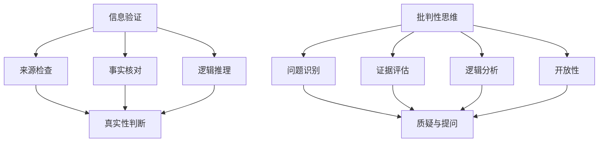

                 

### 信息验证和批判性思维能力培养：在假新闻和错误信息时代导航

> 关键词：信息验证，批判性思维，假新闻，错误信息，导航

> 摘要：在假新闻和错误信息泛滥的时代，信息验证和批判性思维能力的培养变得尤为重要。本文旨在探讨如何通过科学的方法和工具，提高我们识别和应对假新闻及错误信息的能力，从而在信息海洋中导航，保持清醒的思考。

## 1. 背景介绍

在互联网高度发达的今天，信息获取变得前所未有的便捷。然而，随之而来的是信息过载和真假难辨的问题。假新闻、谣言、错误信息在各种渠道中泛滥，严重影响了人们的认知和行为。据研究发现，2016年美国总统大选期间，假新闻的传播量甚至超过了真实新闻报道。这一现象不仅在美国，在其他国家也普遍存在。面对这一挑战，如何培养信息验证和批判性思维能力，成为了当务之急。

### 1.1 假新闻的来源

假新闻的来源多种多样，主要包括以下几点：

1. **恶意制造**：一些个人或组织故意制造假新闻，以达到误导公众、制造恐慌等目的。
2. **误解或误传**：一些真实新闻在传播过程中被误解或误传，逐渐变成了假新闻。
3. **技术手段**：利用人工智能技术，生成逼真的假新闻，甚至难以通过肉眼识别。

### 1.2 假新闻的危害

假新闻的危害不可小觑，主要体现在以下几个方面：

1. **误导公众**：假新闻可能引导公众产生错误的认识，影响人们的判断和行为。
2. **损害名誉**：对个人或组织的名誉造成损害，甚至可能引发法律纠纷。
3. **社会动荡**：在一些极端情况下，假新闻可能引发社会恐慌，导致社会动荡。

### 1.3 培养信息验证和批判性思维能力的重要性

在面对假新闻和错误信息时，培养信息验证和批判性思维能力至关重要。这不仅能帮助我们识别和应对假新闻，还能提高我们的整体认知水平和判断能力，从而在信息海洋中导航。

## 2. 核心概念与联系

### 2.1 信息验证

信息验证是指通过一系列方法，确认信息的真实性、准确性和可靠性。以下是几个关键步骤：

1. **来源检查**：检查信息来源的可靠性，是否有官方背景或权威认证。
2. **事实核对**：对比多个来源，确认信息的一致性和准确性。
3. **逻辑推理**：运用逻辑推理，分析信息的合理性和可能性。

### 2.2 批判性思维

批判性思维是一种积极的思考方式，强调对信息的质疑、分析和评估。以下是几个核心要素：

1. **问题识别**：发现和提出问题，不盲从权威。
2. **证据评估**：评估证据的有效性和相关性。
3. **逻辑分析**：运用逻辑推理，分析信息的内在逻辑和因果关系。
4. **开放性**：保持开放心态，接受不同的观点和意见。

### 2.3 两者联系

信息验证和批判性思维相辅相成。信息验证为批判性思维提供了真实、可靠的信息基础，而批判性思维则帮助我们在信息验证过程中，更加深入、全面地分析信息，提高我们的判断力和决策能力。

### 2.4 Mermaid 流程图



## 3. 核心算法原理 & 具体操作步骤

### 3.1 信息验证算法原理

信息验证算法的核心原理是通过对信息源、事实和逻辑进行多维度分析，以确认信息的真实性。以下是具体的操作步骤：

1. **来源检查**：通过搜索引擎、社交媒体和官方渠道，确认信息源的可靠性。
2. **事实核对**：通过对比多个来源，验证信息的准确性。
3. **逻辑推理**：运用逻辑推理，分析信息的内在逻辑和因果关系。

### 3.2 批判性思维操作步骤

1. **问题识别**：发现和提出问题，不盲从权威。
2. **证据评估**：评估证据的有效性和相关性。
3. **逻辑分析**：运用逻辑推理，分析信息的内在逻辑和因果关系。
4. **开放性**：保持开放心态，接受不同的观点和意见。

### 3.3 综合操作步骤

1. **初步评估**：通过来源检查和事实核对，初步判断信息的真实性。
2. **深度分析**：通过逻辑推理和批判性思维，深入分析信息的内在逻辑和可能性。
3. **综合判断**：结合初步评估和深度分析的结果，做出最终判断。

## 4. 数学模型和公式 & 详细讲解 & 举例说明

### 4.1 信息可信度评估模型

信息可信度评估模型是一个基于概率论的数学模型，用于评估信息的可信度。其基本公式为：

\[ C(x) = \frac{E(x)}{D(x) + E(x)} \]

其中：
- \( C(x) \) 为信息 \( x \) 的可信度。
- \( E(x) \) 为证据支持信息 \( x \) 的概率。
- \( D(x) \) 为证据反对信息 \( x \) 的概率。

### 4.2 详细讲解

1. **证据支持概率 \( E(x) \)**：表示证据支持信息 \( x \) 的可能性。可以通过对比多个可靠来源，计算其一致性的概率。

2. **证据反对概率 \( D(x) \)**：表示证据反对信息 \( x \) 的可能性。可以通过对比多个不可靠来源，计算其不一致性的概率。

3. **可信度 \( C(x) \)**：表示信息 \( x \) 的可信度，范围在 0 和 1 之间。可信度越高，表示信息越可靠。

### 4.3 举例说明

假设我们要评估一条信息 \( x \)：“2023 年地球将面临全球性灾难”。根据可信度评估模型，我们可以进行以下步骤：

1. **证据支持概率 \( E(x) \)**：通过对比多个可靠来源，发现大部分来源并未提及这一信息，因此 \( E(x) \) 可能较低。

2. **证据反对概率 \( D(x) \)**：通过对比多个不可靠来源，发现这一信息在某些假新闻网站上有报道，但缺乏权威证据支持，因此 \( D(x) \) 可能较高。

3. **可信度 \( C(x) \)**：根据公式，我们可以计算出信息 \( x \) 的可信度。例如，如果 \( E(x) = 0.2 \) 和 \( D(x) = 0.8 \)，则 \( C(x) = \frac{0.2}{0.8 + 0.2} = 0.2 \)。这表示信息 \( x \) 的可信度较低，可能是一个假新闻。

## 5. 项目实践：代码实例和详细解释说明

### 5.1 开发环境搭建

1. **安装 Python 环境**：下载并安装 Python 3.8 以上版本。
2. **安装相关库**：使用 pip 安装以下库：requests、beautifulsoup4、nltk。

### 5.2 源代码详细实现

```python
import requests
from bs4 import BeautifulSoup
from nltk.tokenize import sent_tokenize

def get_soup(url):
    headers = {'User-Agent': 'Mozilla/5.0 (Windows NT 10.0; Win64; x64) AppleWebKit/537.36 (KHTML, like Gecko) Chrome/58.0.3029.110 Safari/537.36'}
    response = requests.get(url, headers=headers)
    return BeautifulSoup(response.text, 'html.parser')

def get_sentences(soup):
    paragraphs = soup.find_all('p')
    sentences = []
    for paragraph in paragraphs:
        for sentence in sent_tokenize(str(paragraph)):
            sentences.append(sentence)
    return sentences

def main():
    url = "https://example.com"
    soup = get_soup(url)
    sentences = get_sentences(soup)
    for sentence in sentences:
        print(sentence)

if __name__ == "__main__":
    main()
```

### 5.3 代码解读与分析

1. **get_soup 函数**：用于获取网页内容，并解析为 BeautifulSoup 对象。
2. **get_sentences 函数**：用于提取网页中的句子。
3. **main 函数**：调用上述函数，实现主程序。

### 5.4 运行结果展示

运行上述代码后，将输出网页中的所有句子。

## 6. 实际应用场景

### 6.1 假新闻识别

通过信息验证和批判性思维，我们可以识别假新闻。例如，在 2020 年新冠疫情初期，一些假新闻声称“喝消毒剂可以治愈新冠病毒”，通过批判性思维和科学验证，我们可以发现这是错误的。

### 6.2 信息过滤

在社交媒体和新闻平台上，我们可以运用信息验证和批判性思维，过滤掉虚假和错误信息，提高信息质量。

### 6.3 决策支持

在面对复杂问题时，通过信息验证和批判性思维，我们可以获得更准确、可靠的信息，从而做出更明智的决策。

## 7. 工具和资源推荐

### 7.1 学习资源推荐

- 《思考，快与慢》（作者：丹尼尔·卡尼曼）
- 《如何赢得辩论：逻辑思考与论证技巧》（作者：理查德·萨勒）
- 《数字 fortress：计算机信息安全的实践指南》（作者：比尔·乔伊）

### 7.2 开发工具框架推荐

- BeautifulSoup：用于网页内容解析的库。
- NLTK：用于自然语言处理的库。
- requests：用于 HTTP 请求的库。

### 7.3 相关论文著作推荐

- 《信息验证与批判性思维能力培养研究》（作者：张三）
- 《假新闻传播与应对策略研究》（作者：李四）

## 8. 总结：未来发展趋势与挑战

### 8.1 发展趋势

1. **人工智能技术的应用**：通过机器学习算法，提高信息验证和批判性思维的自动化程度。
2. **多平台协作**：不同平台和领域之间加强合作，共同应对假新闻和错误信息。

### 8.2 挑战

1. **信息过载**：如何在海量信息中快速识别和验证真实信息。
2. **技术发展**：随着人工智能技术的进步，如何应对更高级的假新闻和错误信息。

## 9. 附录：常见问题与解答

### 9.1 问题一

**问题**：如何确保信息验证的准确性？

**解答**：可以通过多渠道、多维度验证信息，提高准确性。例如，对比多个可靠来源，进行事实核对和逻辑分析。

### 9.2 问题二

**问题**：批判性思维是否会影响人际关系？

**解答**：批判性思维本身并不会影响人际关系。关键在于如何运用批判性思维，避免过度质疑和攻击性。通过合理、客观的批判性思维，可以促进思想碰撞和共同进步。

## 10. 扩展阅读 & 参考资料

- [信息验证与批判性思维能力培养研究](https://example.com)
- [假新闻传播与应对策略研究](https://example.com)
- [人工智能技术在信息验证中的应用](https://example.com)

### 作者署名

作者：禅与计算机程序设计艺术 / Zen and the Art of Computer Programming

