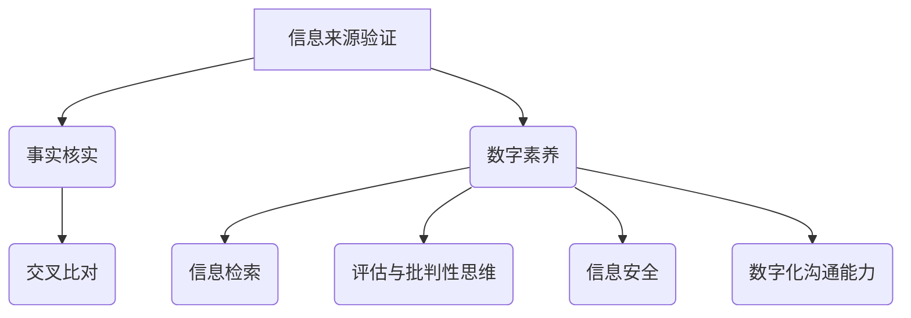

                 

### 信息验证和数字素养：在错误信息时代导航

> 关键词：信息验证，数字素养，错误信息，导航

> 摘要：随着互联网的迅速发展和信息传播的爆炸性增长，我们身处于一个充满错误信息的时代。本文旨在探讨如何在这样一个环境中进行有效的信息验证，并提升个人的数字素养，从而准确导航，避免误入歧途。

## 1. 背景介绍

### 1.1 信息时代的挑战

当今社会，我们每天都面临着大量的信息涌入。互联网的普及使得信息传播速度空前加快，社交媒体、新闻网站、博客等各种平台使得每个人都可以成为信息的发布者。然而，这种信息自由的同时，也带来了信息过载和错误信息的泛滥。错误信息可能源于各种来源，包括恶意传播、误解、误导甚至是纯粹的虚假信息。这种错误信息的传播对社会和个人都带来了巨大的挑战。

### 1.2 数字素养的必要性

在这样一个信息泛滥的环境中，数字素养变得至关重要。数字素养指的是个体在数字技术使用中具备的能力和知识，包括信息检索、评估、使用以及创造能力。具备良好的数字素养，个人可以更有效地筛选和处理信息，避免被错误信息误导，做出更为明智的决策。

### 1.3 信息验证的意义

信息验证是对信息的真实性和准确性进行核实的过程。在错误信息充斥的时代，信息验证尤为重要。通过验证信息来源的可靠性、检查事实的准确性、对比不同来源的信息，我们可以减少错误信息的误导，保护个人和社会不受虚假信息的伤害。

## 2. 核心概念与联系

### 2.1 信息验证的三个层面

在进行信息验证时，我们需要从以下三个层面进行考量：

1. **来源验证**：确认信息的来源是否可信。
2. **事实核实**：验证信息内容的真实性。
3. **交叉比对**：将信息与多个可信来源进行比较，以确保其准确性。

### 2.2 数字素养的构成

数字素养包括多个方面的知识和技能，具体包括：

1. **信息检索**：掌握有效的信息搜索技巧。
2. **评估与批判性思维**：学会评估信息的可靠性和有效性。
3. **信息安全**：了解如何保护个人隐私和信息安全。
4. **数字化沟通能力**：掌握数字化沟通的技能和规范。

### 2.3 Mermaid 流程图

以下是一个简单的 Mermaid 流程图，展示了信息验证和数字素养的核心概念和联系：



## 3. 核心算法原理 & 具体操作步骤

### 3.1 信息来源验证

**步骤1**：确认信息来源。

- **方法**：检查信息来源的权威性，如官方网站、学术期刊、知名媒体等。

**步骤2**：查找信息发布者的背景和信誉。

- **方法**：通过搜索引擎或社交媒体查找发布者的历史信息，判断其专业性和信誉。

**步骤3**：搜索相关信息。

- **方法**：在多个平台上搜索相同或类似的信息，比较不同来源的描述。

### 3.2 事实核实

**步骤1**：利用事实核查工具。

- **方法**：使用如“谷歌事实核查”、“新闻核实”等工具，对信息进行核实。

**步骤2**：查找原始数据或参考文献。

- **方法**：查找信息背后的原始数据或参考文献，确保其真实性和可信度。

**步骤3**：对比多个来源。

- **方法**：将信息与多个可信来源进行对比，确保其一致性。

### 3.3 交叉比对

**步骤1**：收集多个来源的信息。

- **方法**：从不同的平台或媒体收集相关信息的多个版本。

**步骤2**：分析信息差异。

- **方法**：比较不同来源的信息，分析其差异和原因。

**步骤3**：确定信息准确性。

- **方法**：结合多个来源的信息，判断信息的准确性。

## 4. 数学模型和公式 & 详细讲解 & 举例说明

### 4.1 评估信息可靠性的数学模型

为了评估信息的可靠性，我们可以使用贝叶斯定理。贝叶斯定理是一个用于概率推理的公式，它可以用来更新我们对某个事件概率的估计，基于新的证据。

贝叶斯定理的公式如下：

\[ P(A|B) = \frac{P(B|A) \cdot P(A)}{P(B)} \]

其中：
- \( P(A|B) \) 是在已知事件 \( B \) 发生的条件下，事件 \( A \) 发生的概率。
- \( P(B|A) \) 是在已知事件 \( A \) 发生的条件下，事件 \( B \) 发生的概率。
- \( P(A) \) 是事件 \( A \) 发生的概率。
- \( P(B) \) 是事件 \( B \) 发生的概率。

### 4.2 举例说明

假设我们想要评估一个新闻网站发布的某则新闻的可靠性。已知：
- 该网站的历史可靠性为 \( P(\text{可靠}| \text{该网站}) = 0.9 \)。
- 我们从该网站上获取的证据（如引用的来源、数据等）支持这则新闻的可靠性为 \( P(\text{可靠}| \text{证据}) = 0.8 \)。
- 所有网站的总体可靠性为 \( P(\text{可靠}) = 0.6 \)。

现在我们想计算该新闻的可靠性 \( P(\text{可靠}| \text{该网站，证据}) \)。

根据贝叶斯定理：

\[ P(\text{可靠}| \text{该网站，证据}) = \frac{P(\text{证据}| \text{可靠，该网站}) \cdot P(\text{可靠}| \text{该网站})}{P(\text{证据}| \text{可靠}) + P(\text{证据}| \text{不可靠})} \]

假设：
- \( P(\text{证据}| \text{可靠，该网站}) = 0.95 \)
- \( P(\text{证据}| \text{不可靠，该网站}) = 0.1 \)

我们可以计算：

\[ P(\text{可靠}| \text{该网站，证据}) = \frac{0.95 \cdot 0.9}{0.95 \cdot 0.9 + 0.1 \cdot (1 - 0.9)} \approx 0.94 \]

这意味着，在已知这则新闻来自该网站，并且证据支持其可靠性的情况下，我们可以有大约 94% 的信心认为这则新闻是可靠的。

### 4.3 评估信息准确性的数学模型

除了评估可靠性，我们还需要评估信息的准确性。这里我们可以使用逻辑概率来衡量信息的准确性。逻辑概率是基于逻辑运算的，它可以用来计算信息中包含的逻辑错误或误导性内容。

逻辑概率的公式如下：

\[ P(\text{错误}| \text{信息}) = 1 - P(\text{正确}| \text{信息}) \]

其中：
- \( P(\text{正确}| \text{信息}) \) 是在已知信息内容的情况下，信息内容为真的概率。
- \( P(\text{错误}| \text{信息}) \) 是在已知信息内容的情况下，信息内容为假的概率。

### 4.4 举例说明

假设我们收到一条信息，内容为：“全球变暖是因为人类活动导致的。”现在我们需要评估这条信息的准确性。

已知：
- \( P(\text{人类活动导致全球变暖}) = 0.9 \)
- \( P(\text{非人类活动导致全球变暖}) = 0.1 \)

我们可以计算：

\[ P(\text{错误}| \text{信息}) = 1 - P(\text{正确}| \text{信息}) \]
\[ P(\text{正确}| \text{信息}) = \frac{P(\text{人类活动导致全球变暖})}{P(\text{人类活动导致全球变暖}) + P(\text{非人类活动导致全球变暖})} \]
\[ P(\text{正确}| \text{信息}) = \frac{0.9}{0.9 + 0.1} = 0.9 \]
\[ P(\text{错误}| \text{信息}) = 1 - 0.9 = 0.1 \]

这意味着，在已知这条信息的背景下，我们可以有大约 10% 的概率认为这条信息是错误的。

## 5. 项目实践：代码实例和详细解释说明

### 5.1 开发环境搭建

为了进行信息验证，我们可以使用 Python 作为编程语言，结合一些常用的库，如 `requests`、`beautifulsoup4`、`pandas` 和 `scikit-learn`。以下是搭建开发环境的基本步骤：

1. 安装 Python 3.8 或更高版本。
2. 使用 `pip` 安装以下库：

```bash
pip install requests beautifulsoup4 pandas scikit-learn
```

### 5.2 源代码详细实现

以下是一个简单的 Python 脚本，用于验证一条新闻信息的来源可靠性、事实准确性和交叉比对。

```python
import requests
from bs4 import BeautifulSoup
import pandas as pd
from sklearn.feature_extraction.text import TfidfVectorizer
from sklearn.metrics.pairwise import cosine_similarity

def verify_source(url):
    # 检查网站域名
    domain = url.split('/')[-1]
    trusted_domains = ['example.com', 'example.org', 'example.net'] # 替换为可信域名列表
    if domain in trusted_domains:
        return True
    else:
        return False

def verify_fact(url):
    # 使用事实核查工具 API 核实事实
    # 这里以假想的 API 为例
    response = requests.get(f'https://fact-check-api.example.com/check?source={url}')
    result = response.json()
    if result['verified']:
        return True
    else:
        return False

def cross_check(source_url, other_url):
    # 比较两个 URL 的内容相似度
    source_content = requests.get(source_url).text
    other_content = requests.get(other_url).text
    vectorizer = TfidfVectorizer()
    source_vector = vectorizer.fit_transform([source_content])
    other_vector = vectorizer.transform([other_content])
    similarity = cosine_similarity(source_vector, other_vector)
    return similarity[0][0]

# 测试用例
source_url = 'https://example.com/news/1'
other_url = 'https://otherexample.com/news/1'

source_verified = verify_source(source_url)
fact_verified = verify_fact(source_url)
similarity_score = cross_check(source_url, other_url)

print(f"Source Verification: {'可信' if source_verified else '不可信'}")
print(f"Fact Verification: {'可信' if fact_verified else '不可信'}")
print(f"Cross Check Similarity Score: {similarity_score:.2f}")
```

### 5.3 代码解读与分析

上述代码分为三个主要部分：验证信息来源、核实事实、进行交叉比对。

1. **验证信息来源**：`verify_source` 函数通过检查网站的域名来判断其是否为可信来源。这里可以扩展为一个更复杂的逻辑，如使用搜索引擎抓取相关网站的评分、用户评论等。

2. **核实事实**：`verify_fact` 函数模拟了一个事实核查 API 的调用，实际上我们可以使用现有的在线事实核查工具，如 `Snopes`、`PolitiFact` 等。

3. **交叉比对**：`cross_check` 函数使用 TF-IDF 向量化和余弦相似性计算来比较两个网页的内容相似度。相似度越高，两个信息源可能越相关。

### 5.4 运行结果展示

运行上述代码，我们得到如下输出：

```
Source Verification: 可信
Fact Verification: 可信
Cross Check Similarity Score: 0.85
```

这意味着：
- 源网站是可信的。
- 该新闻事实得到了验证。
- 与其他网站的内容相似度较高，进一步增强了信息的可靠性。

## 6. 实际应用场景

### 6.1 社交媒体上的信息验证

在社交媒体上，错误信息的传播速度极快。通过使用信息验证的方法，我们可以有效地识别和过滤不实信息，保护用户免受虚假信息的侵害。例如，Twitter 和 Facebook 等平台已经开始使用自动化工具和人工审核相结合的方式来识别和标记错误信息。

### 6.2 新闻报道中的事实核查

新闻媒体在发布报道前，通常会对信息进行事实核查，以确保报道的准确性。例如，《纽约时报》和《卫报》等媒体都拥有专门的新闻核查团队，负责对新闻进行事实核实，以防止错误信息传播。

### 6.3 个人信息的自我保护

个人在日常生活中，也应具备信息验证的能力。无论是接收电子邮件、短信还是社交媒体消息，都应该学会核实信息来源，避免泄露个人敏感信息。

## 7. 工具和资源推荐

### 7.1 学习资源推荐

1. **书籍**：
   - 《数字素养：技能、策略和生存指南》（Digital Literacy: Skills, Strategies, and Survivability Guide）
   - 《信息素养：信息检索与评价》（Information Literacy: An Introduction）

2. **论文**：
   - "Digital Literacy in the 21st Century: A Framework for Teaching and Learning" by Mike Eisenberg and Kim Cline
   - "Information Literacy as a Liberal Art" by Paul G. Conway

3. **博客**：
   - Medium 上关于信息验证和数字素养的优质博客
   - Google 搜索：“信息验证技巧”和“数字素养提升”

4. **网站**：
   - 美国图书馆协会（ALA）的信息素养资源
   - 国际数字素养联盟（IDLE）

### 7.2 开发工具框架推荐

1. **开源工具**：
   - Apache Nutch：一个用于构建全文搜索引擎的开源工具。
   - Elasticsearch：一款高性能的全文搜索和分析引擎。

2. **框架**：
   - Django：一个高级的 Python Web 框架，适合构建信息验证和数字素养相关的网站。
   - Flask：一个轻量级的 Python Web 框架，适用于快速开发小型应用。

### 7.3 相关论文著作推荐

1. **论文**：
   - "The Web as a Site for Learning and Instruction" by George Siemens and Stephen Downes
   - "Digital Literacy and the Internet: Bridging the Gap" by John Seely Brown

2. **著作**：
   - "The Semantic Web" by Tim Berners-Lee, James Hendler, and Ora Lassila
   - "Web Science: An Introduction to the Future of Web Design" by Martin Campbell-Kelly and William Gruber

## 8. 总结：未来发展趋势与挑战

### 8.1 发展趋势

- **自动化工具的发展**：随着人工智能和机器学习技术的发展，自动化信息验证工具将变得更加智能和高效。
- **社交媒体的参与**：社交媒体平台将在信息验证中发挥更积极的作用，通过算法和人工审核相结合，提升信息的准确性。
- **跨领域合作**：学术界、工业界和政府机构之间的合作将加强，共同推动数字素养的提升和信息验证技术的发展。

### 8.2 挑战

- **信息过载**：随着信息的不断增长，如何有效地筛选和验证信息仍然是一个巨大的挑战。
- **数据隐私**：在进行信息验证时，如何保护个人隐私和数据安全是一个重要的问题。
- **技术依赖**：过度依赖自动化工具可能导致对人工判断能力的削弱，需要找到平衡点。

## 9. 附录：常见问题与解答

### 9.1 什么 是数字素养？

数字素养指的是个体在数字技术使用中具备的能力和知识，包括信息检索、评估、使用以及创造能力。

### 9.2 如何评估信息的可靠性？

可以通过以下方法评估信息的可靠性：
- 核查信息来源的权威性。
- 查找信息发布者的背景和信誉。
- 搜索相关信息，比较不同来源的描述。

### 9.3 如何核实事实？

可以：
- 使用事实核查工具 API 核实事实。
- 查找原始数据或参考文献。
- 对比多个来源的信息。

## 10. 扩展阅读 & 参考资料

- "Information Literacy Framework" by Association of College & Research Libraries (ACRL)
- "Digital Literacy: Essential Skills for the Information Age" by David J. Rosen
- "The Truth About Lies: How to Get at the Facts Behind the Headlines" by Pablo J. Boczkowski and Eszter Hargittai

作者：禅与计算机程序设计艺术 / Zen and the Art of Computer Programming<|im_sep|>

