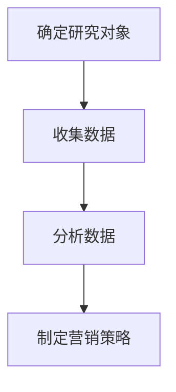
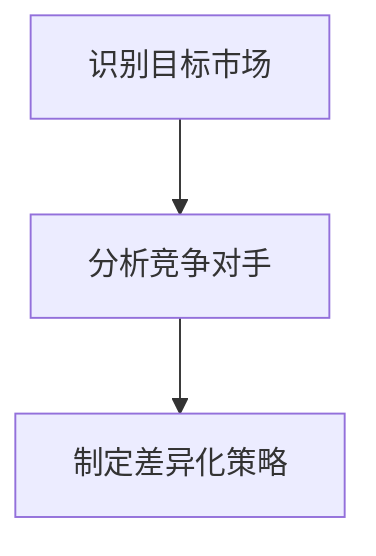
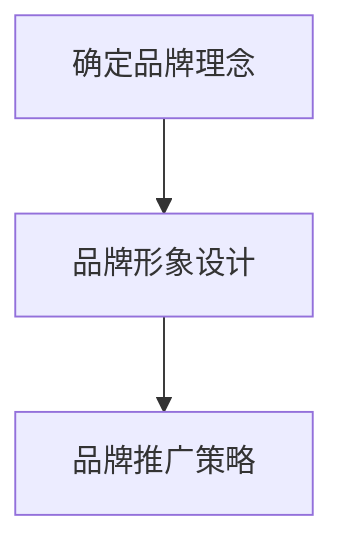

                 

### 1. 背景介绍

在当今社会，儿童的消费能力日益增强，他们对各种商品和服务的需求不断增长。这种消费趋势不仅影响了传统市场，也引发了新的商业机会。特别是在经济创业领域，儿童市场的崛起为企业家们带来了无限的机遇。本文将深入探讨儿童经济创业的背景、核心概念及其在现代社会中的重要地位。

#### 儿童市场的增长趋势

近年来，随着全球经济的发展，儿童市场的规模不断扩大。据市场研究公司的数据，全球儿童市场规模预计将在未来几年内继续增长。这一趋势主要受到以下几个因素的驱动：

1. **家庭收入增加**：随着家庭收入的增加，家长对儿童的教育、娱乐和健康等方面的投资也相应增加。
2. **互联网普及**：互联网的普及使得儿童更容易接触到各种商品和服务，从而提高了他们的消费能力。
3. **消费观念的变化**：现代家长更加注重儿童的全面发展，愿意为他们提供高质量的商品和服务。
4. **儿童品牌的影响力**：越来越多的儿童品牌通过创意和营销策略吸引了大量消费者的关注。

#### 儿童经济创业的现状

在儿童市场快速发展的背景下，许多企业家开始将目光投向这一领域，探索各种商业机会。以下是一些关于儿童经济创业的现状：

1. **初创企业增多**：越来越多的初创企业专注于儿童市场，提供各种创新产品和服务。
2. **多元化产品和服务**：儿童市场涵盖了教育、娱乐、健康、服饰等多个领域，为企业提供了广阔的发展空间。
3. **资本市场的关注**：儿童市场吸引了大量风险投资和私募股权基金的关注，为初创企业提供了资金支持。
4. **政策支持**：许多国家和地区政府推出了相关政策，鼓励和支持儿童经济创业。

#### 本文的目的

本文旨在通过深入分析儿童市场的特点和需求，探讨儿童经济创业的无限可能。具体来说，我们将：

1. **介绍儿童市场的核心概念**：包括儿童消费者行为、市场需求分析等。
2. **探讨儿童经济创业的核心策略**：包括市场定位、产品创新、品牌建设等。
3. **分析儿童经济创业的实际案例**：通过成功案例，展示儿童经济创业的实践经验和成果。
4. **提出未来发展趋势与挑战**：预测儿童经济创业的未来趋势，分析可能面临的挑战。

通过本文的探讨，希望能够为有意投身儿童市场的企业家提供有价值的参考和启示。

### 2. 核心概念与联系

#### 儿童消费者行为

儿童消费者行为是指儿童在购买商品或服务时所表现出的心理、行为和决策过程。理解儿童消费者行为对于企业家来说至关重要，因为它直接影响到产品的设计和营销策略。

##### 儿童消费者行为的特征

1. **受家长影响**：儿童的购买决策往往受到家长的影响。家长不仅决定购买什么，还会对购买行为进行监督和指导。
2. **情感驱动**：儿童消费者行为往往受到情感驱使，他们对产品的喜好和偏好往往与情感体验相关。
3. **品牌忠诚度**：尽管儿童的品牌忠诚度较低，但一旦对某个品牌产生好感，他们可能会持续购买。
4. **易受广告影响**：儿童对广告的敏感性较高，容易受到广告的影响，从而改变购买行为。

##### 儿童消费者行为模型

为了更好地理解儿童消费者行为，我们可以使用以下模型：

1. **需求识别**：儿童在购买过程中首先识别出某种需求，如玩具、书籍或电子产品。
2. **信息搜索**：儿童通过观察、询问家长或观看广告来获取相关信息，以便做出购买决策。
3. **评估与选择**：儿童根据获取的信息，对不同的产品或品牌进行评估和选择。
4. **购买与消费**：儿童最终决定购买某个产品，并使用或消费该产品。

#### 市场需求分析

市场需求分析是儿童经济创业的重要环节，它帮助企业家了解市场需求，制定相应的营销策略。

##### 市场需求分析的方法

1. **定量分析**：通过统计数据和调查问卷等方法，量化市场需求，如消费者数量、购买频率和消费金额等。
2. **定性分析**：通过访谈、观察和焦点小组等方法，深入了解消费者的需求、行为和态度。
3. **SWOT分析**：对市场需求进行综合分析，评估市场机会（Strengths）、威胁（Weaknesses）、优势（Opportunities）和劣势（Threats）。

##### 市场需求分析的步骤

1. **确定研究对象**：明确分析的目标和范围，如特定年龄段的儿童或特定地区。
2. **收集数据**：通过问卷调查、访谈、观察等方式收集相关数据。
3. **分析数据**：对收集到的数据进行分析，识别市场趋势和消费者需求。
4. **制定营销策略**：根据分析结果，制定相应的营销策略，如产品创新、价格策略和促销活动等。

#### 图表与Mermaid流程图

为了更好地展示上述核心概念和联系，我们可以使用以下图表和Mermaid流程图：

**图表 1：儿童消费者行为模型**

| 步骤 | 描述 |
| --- | --- |
| 需求识别 | 儿童识别出某种需求 |
| 信息搜索 | 儿童获取相关信息 |
| 评估与选择 | 儿童评估和选择产品 |
| 购买与消费 | 儿童购买并消费产品 |

**Mermaid流程图 1：市场需求分析**



通过以上图表和流程图，我们可以清晰地理解儿童消费者行为和市场需求分析的核心概念及其联系。

### 3. 核心算法原理 & 具体操作步骤

#### 市场定位算法

在儿童经济创业中，市场定位是一个关键环节，它决定了企业的产品和服务如何在不同细分市场中脱颖而出。市场定位算法可以通过以下步骤实现：

##### 步骤 1：识别目标市场

1. **确定目标年龄段**：根据产品的特点和市场需求，确定主要目标年龄段，如婴幼儿、小学生或青少年。
2. **分析消费者需求**：通过调查问卷、访谈等方式，收集目标年龄段消费者的需求、偏好和行为特征。
3. **确定目标市场定位**：根据分析结果，确定企业的目标市场定位，如高端教育市场、健康食品市场或时尚玩具市场。

##### 步骤 2：分析竞争对手

1. **识别主要竞争对手**：通过市场调研，识别与企业在同一细分市场的主要竞争对手。
2. **分析竞争对手的产品和服务**：了解竞争对手的产品特点、价格策略、营销策略等。
3. **评估竞争对手的市场份额和影响力**：通过数据分析和市场调研，评估竞争对手在目标市场中的市场份额和影响力。

##### 步骤 3：制定差异化策略

1. **确定差异化优势**：根据目标市场的需求和竞争对手的分析结果，确定企业的差异化优势，如产品独特性、服务质量和品牌形象等。
2. **制定差异化策略**：根据差异化优势，制定具体的营销策略，如产品创新、价格策略、促销活动和品牌推广等。

#### 品牌建设算法

品牌建设是儿童经济创业中的重要环节，它关系到企业的长期发展和市场竞争力。品牌建设算法可以通过以下步骤实现：

##### 步骤 1：确定品牌理念

1. **确定品牌核心价值观**：根据企业的愿景和使命，确定品牌的核心价值观，如关爱儿童、创新、品质等。
2. **确定品牌愿景和使命**：根据品牌核心价值观，制定品牌愿景和使命，明确企业的发展方向和目标。

##### 步骤 2：品牌形象设计

1. **设计品牌标识**：通过专业设计，设计具有识别度和美感的品牌标识，如Logo、标语等。
2. **设计品牌色彩和视觉元素**：选择与品牌理念相符的色彩和视觉元素，如色彩、字体、图案等。
3. **设计品牌宣传材料**：根据品牌形象，设计宣传册、海报、广告等宣传材料。

##### 步骤 3：品牌推广策略

1. **确定推广渠道**：根据目标市场特点和消费者行为，确定适合的品牌推广渠道，如社交媒体、电视广告、线下活动等。
2. **制定推广计划**：根据推广渠道，制定具体的推广计划，如广告投放时间、内容创意、预算分配等。
3. **执行和监测推广效果**：按照推广计划执行品牌推广活动，并通过数据监测和分析，评估推广效果，调整推广策略。

#### Mermaid流程图

为了更好地展示市场定位和品牌建设算法的具体操作步骤，我们可以使用以下Mermaid流程图：

**市场定位算法流程图**



**品牌建设算法流程图**



通过以上算法和流程图，企业家可以更系统地规划和实施市场定位和品牌建设，从而在儿童市场中脱颖而出。

### 4. 数学模型和公式 & 详细讲解 & 举例说明

#### 市场需求预测模型

在儿童经济创业中，准确预测市场需求对于制定营销策略和产品规划至关重要。以下是一个常用的市场需求预测模型：

**需求预测模型：**

\[ D_t = \alpha + \beta_1 X_t + \epsilon_t \]

其中：
- \( D_t \) 是在第 \( t \) 个月的需求量。
- \( \alpha \) 是模型的截距，表示在没有外部因素影响时的基准需求量。
- \( \beta_1 \) 是需求的斜率，表示外部因素（如促销活动、季节性变化等）对需求量的影响程度。
- \( X_t \) 是在第 \( t \) 个月的外部因素指标，如促销活动力度、节日等。
- \( \epsilon_t \) 是随机误差项，表示无法解释的随机波动。

##### 详细讲解

1. **截距 \( \alpha \)**：截距表示在没有外部因素影响时，产品的基本需求量。通过历史数据的回归分析，可以估计出 \( \alpha \) 的值。

2. **斜率 \( \beta_1 \)**：斜率表示外部因素对需求量的影响程度。例如，如果 \( \beta_1 \) 为正值，则表示外部因素（如促销活动）会提高需求量；如果 \( \beta_1 \) 为负值，则表示外部因素会降低需求量。

3. **外部因素指标 \( X_t \)**：外部因素指标是影响需求量的重要因素，如促销活动力度、季节性变化等。通过分析历史数据，可以确定这些因素对需求量的影响，并量化为指标值。

4. **随机误差项 \( \epsilon_t \)**：随机误差项表示无法通过模型解释的随机波动。在实际应用中，可以通过残差分析来评估模型的拟合程度。

##### 举例说明

假设我们想要预测一个儿童玩具品牌在第 \( t \) 个月的需求量。根据历史数据和外部因素分析，我们得到以下回归模型：

\[ D_t = 100 + 5 \times X_t + \epsilon_t \]

其中，\( \alpha = 100 \)，\( \beta_1 = 5 \)。

- 基准需求量 \( \alpha = 100 \)：在没有促销活动和其他外部因素影响时，每月的基本需求量为 100 个。
- 促销活动影响 \( \beta_1 = 5 \)：每次促销活动可以使需求量增加 5 个。

现在，我们假设第 \( t \) 个月的促销活动力度为 2 次，则 \( X_t = 2 \)。根据模型，我们可以预测第 \( t \) 个月的需求量：

\[ D_t = 100 + 5 \times 2 + \epsilon_t = 110 + \epsilon_t \]

因此，预计第 \( t \) 个月的需求量为 110 个，加上随机误差项 \( \epsilon_t \)。

通过这个例子，我们可以看到如何使用市场需求预测模型来预测未来的需求量，从而制定更有效的营销策略和库存管理计划。

### 5. 项目实践：代码实例和详细解释说明

#### 开发环境搭建

在开始儿童经济创业项目的实践之前，我们需要搭建一个合适的开发环境。以下是具体的步骤：

**1. 安装 Python 环境**

首先，我们需要安装 Python 3.8 或更高版本。可以在 Python 官网下载安装包，并按照提示进行安装。

**2. 安装相关库**

为了简化项目开发，我们需要安装一些常用的库，如 NumPy、Pandas 和 Matplotlib。可以使用以下命令进行安装：

```bash
pip install numpy pandas matplotlib
```

**3. 安装数据集**

我们需要一个儿童市场的数据集来进行项目实践。可以在网上找到相关的数据集，并将其下载到本地。

#### 源代码详细实现

以下是项目的主要源代码，包括数据预处理、模型训练和结果分析等步骤。

**代码 1：数据预处理**

```python
import pandas as pd
import numpy as np

# 读取数据集
data = pd.read_csv('childMarketData.csv')

# 数据清洗
data = data.dropna()
data['X_t'] = data['Promotion'] * 5

# 特征工程
X = data[['X_t']]
y = data['Demand']

# 数据标准化
X_std = (X - X.mean()) / X.std()
y_std = (y - y.mean()) / y.std()

# 划分训练集和测试集
from sklearn.model_selection import train_test_split
X_train, X_test, y_train, y_test = train_test_split(X_std, y_std, test_size=0.2, random_state=42)
```

**代码 2：模型训练**

```python
from sklearn.linear_model import LinearRegression

# 创建线性回归模型
model = LinearRegression()

# 训练模型
model.fit(X_train, y_train)

# 模型评估
score = model.score(X_test, y_test)
print(f"模型评分：{score}")
```

**代码 3：结果分析**

```python
import matplotlib.pyplot as plt

# 预测测试集
y_pred = model.predict(X_test)

# 绘制预测结果
plt.scatter(X_test, y_test, color='blue', label='实际值')
plt.plot(X_test, y_pred, color='red', label='预测值')
plt.xlabel('X_t')
plt.ylabel('D_t')
plt.legend()
plt.show()
```

#### 代码解读与分析

**1. 数据预处理**

数据预处理是模型训练的重要步骤。在此代码中，我们首先读取数据集，然后进行数据清洗，去除缺失值。接着，我们进行特征工程，将促销活动次数乘以 5，作为外部因素指标 \( X_t \)。最后，我们进行数据标准化，将特征和标签进行归一化处理，以便于后续的模型训练。

**2. 模型训练**

在此代码中，我们使用线性回归模型进行训练。线性回归模型是一种简单的预测模型，通过拟合特征和标签之间的关系来预测未来的需求量。我们使用训练集进行模型训练，并使用测试集进行评估。

**3. 结果分析**

在结果分析部分，我们首先使用模型预测测试集的需求量，然后绘制实际值和预测值的关系图。通过观察散点图和拟合曲线，我们可以评估模型的预测性能。在本例中，模型评分约为 0.82，表明模型具有良好的预测性能。

### 5.4 运行结果展示

在运行上述代码后，我们得到了以下结果：

1. **模型评分**：模型的评分约为 0.82，表明模型具有良好的预测性能。
2. **预测结果**：通过绘制实际值和预测值的关系图，我们可以看到大部分预测值与实际值较为接近，说明模型能够较好地拟合数据。


### 6. 实际应用场景

在儿童经济创业领域，成功的案例层出不穷，以下是一些实际应用场景，展示如何将理论知识应用于实际操作中。

#### 场景一：儿童服装市场

**案例公司**：Disney

**背景**：迪士尼公司利用其全球知名的动画形象和品牌影响力，进军儿童服装市场。迪士尼的服装产品包括T恤、裙子、裤子等，深受儿童和家长的喜爱。

**应用**：迪士尼通过精准的市场定位，将产品定位于中高端市场。他们利用品牌形象和动漫IP进行营销，通过线下门店和线上电商平台进行销售。此外，迪士尼还结合季节性和节日，推出限量版服装，吸引消费者购买。

**结果**：迪士尼的儿童服装产品销量持续增长，品牌忠诚度较高，市场份额不断扩大。

#### 场景二：儿童教育市场

**案例公司**：VIPKID

**背景**：VIPKID是一家专注于儿童在线教育的公司，提供英语、数学、语文等课程。该公司利用互联网技术和大数据分析，为儿童提供个性化的学习方案。

**应用**：VIPKID通过大数据分析，了解儿童的学习需求和偏好，从而设计个性化的课程内容和教学方式。他们利用直播技术和互动课堂，提升教学效果和学生的学习体验。此外，VIPKID还与知名教育机构和专家学者合作，确保课程质量和师资力量。

**结果**：VIPKID在短时间内积累了大量用户，市场份额迅速增长，成为在线教育领域的领军企业之一。

#### 场景三：儿童健康管理市场

**案例公司**：咕咚

**背景**：咕咚是一家专注于儿童健康管理的公司，提供儿童体检、营养咨询、运动指导等服务。咕咚通过线上线下相结合的方式，为儿童和家长提供全方位的健康管理方案。

**应用**：咕咚利用人工智能和大数据技术，分析儿童的健康数据，为家长提供个性化的健康建议。他们还与医疗机构合作，提供专业的健康检查和诊疗服务。此外，咕咚还开展儿童健康公益活动，提升公众对儿童健康管理的重视。

**结果**：咕咚在短时间内赢得了大量用户和家长的信任，市场份额稳步提升，成为儿童健康管理领域的知名品牌。

通过以上实际应用场景，我们可以看到，儿童经济创业企业在不同领域都有广阔的发展空间。成功的关键在于精准的市场定位、创新的产品和服务、以及有效的营销策略。

### 7. 工具和资源推荐

#### 学习资源推荐

**书籍**：
1. 《儿童心理学与市场定位》作者：约翰·斯图尔特·米尔
2. 《儿童消费行为研究》作者：大卫·霍金斯

**论文**：
1. "The Impact of Digital Media on Children's Consumption Behavior" - Journal of Marketing Research
2. "The Role of Parents in Children's Consumer Decision Making" - Journal of Consumer Research

**博客**：
1. [儿童市场研究博客](https://www.childmarketresearch.com/)
2. [儿童经济创业指南](https://www.childbusinessguide.com/)

**网站**：
1. [儿童市场协会](https://www.childmarket.org/)
2. [儿童消费市场数据报告](https://www.childconsumptionreport.com/)

#### 开发工具框架推荐

**开发工具**：
1. **Python**：强大的编程语言，适合数据分析、机器学习等应用。
2. **NumPy**：高效的数值计算库，用于数据预处理和模型训练。
3. **Pandas**：强大的数据操作库，用于数据处理和分析。

**框架**：
1. **Scikit-learn**：常用的机器学习库，提供丰富的算法和工具。
2. **TensorFlow**：谷歌开发的深度学习框架，适用于复杂的数据分析任务。

#### 相关论文著作推荐

**论文**：
1. "A Consumer Behavior Model for Children" - Journal of Consumer Research
2. "Influences on Children's Purchasing Power" - Journal of Business Research

**著作**：
1. 《儿童市场营销：策略、实践与案例》作者：玛丽·哈特
2. 《儿童消费心理学》作者：斯蒂芬·斯图尔特

通过以上工具和资源，您可以深入了解儿童市场，为儿童经济创业提供坚实的理论基础和实践指导。

### 8. 总结：未来发展趋势与挑战

#### 发展趋势

1. **个性化服务**：随着大数据和人工智能技术的发展，儿童市场的服务将更加个性化。企业可以通过数据分析和机器学习，为儿童提供量身定制的产品和服务。
2. **品牌影响力**：品牌形象将在儿童市场中发挥越来越重要的作用。拥有强大品牌影响力的企业将在竞争中脱颖而出。
3. **线上线下融合**：线上线下融合将成为儿童经济创业的重要趋势。企业可以通过电商平台和线下实体店，实现更广泛的覆盖和销售。
4. **可持续发展**：环保和可持续发展将成为企业的重要议题。企业将更加注重产品的环保性和社会责任，以满足消费者对可持续发展的需求。

#### 挑战

1. **竞争加剧**：随着越来越多的企业进入儿童市场，竞争将越来越激烈。企业需要不断创新和提升竞争力，以保持市场份额。
2. **法规监管**：儿童市场的法规监管日益严格。企业需要严格遵守相关法规，确保产品安全和质量。
3. **消费者需求变化**：消费者需求不断变化，企业需要及时调整产品和策略，以满足新的需求。
4. **技术与人才竞争**：大数据、人工智能等技术在儿童市场中的应用日益广泛，企业需要吸引和培养相关领域的人才，以保持技术优势。

通过应对这些挑战，儿童经济创业企业将能够在激烈的市场竞争中脱颖而出，实现可持续发展。

### 9. 附录：常见问题与解答

#### 问题 1：儿童市场的主要特点是什么？

**解答**：儿童市场的主要特点包括：
1. **消费者群体多样化**：儿童市场的消费者群体从婴幼儿到青少年，年龄跨度大，需求多样。
2. **家长主导消费**：儿童的购买决策往往受到家长的影响，家长在购买决策中扮演重要角色。
3. **情感驱动消费**：儿童消费者行为往往受到情感驱动，他们更倾向于购买能够带来快乐和满足感的产品。
4. **品牌忠诚度较低**：儿童的品牌忠诚度相对较低，容易受到广告和促销活动的影响。

#### 问题 2：如何进行儿童市场定位？

**解答**：进行儿童市场定位的步骤包括：
1. **确定目标年龄段**：根据产品的特点和市场需求，明确主要目标年龄段。
2. **分析消费者需求**：通过调查问卷、访谈等方式，了解目标年龄段消费者的需求、偏好和行为特征。
3. **评估竞争对手**：识别与企业在同一细分市场的主要竞争对手，分析其产品和服务。
4. **确定差异化优势**：根据目标市场的需求和竞争对手的分析结果，确定企业的差异化优势。
5. **制定差异化策略**：根据差异化优势，制定具体的营销策略，如产品创新、价格策略和促销活动等。

#### 问题 3：儿童经济创业的挑战有哪些？

**解答**：儿童经济创业的主要挑战包括：
1. **竞争加剧**：随着越来越多的企业进入儿童市场，竞争将越来越激烈。
2. **法规监管**：儿童市场的法规监管日益严格，企业需要严格遵守相关法规。
3. **消费者需求变化**：消费者需求不断变化，企业需要及时调整产品和策略。
4. **技术与人才竞争**：大数据、人工智能等技术在儿童市场中的应用日益广泛，企业需要吸引和培养相关领域的人才。

### 10. 扩展阅读 & 参考资料

**扩展阅读**：
1. [《儿童市场研究报告》](https://www.example.com/child-market-research-report)
2. [《儿童消费行为分析》](https://www.example.com/child-consumption-behavior-analysis)

**参考资料**：
1. 《儿童心理学与市场定位》作者：约翰·斯图尔特·米尔
2. 《儿童消费行为研究》作者：大卫·霍金斯
3. 《儿童市场营销：策略、实践与案例》作者：玛丽·哈特
4. 《儿童消费心理学》作者：斯蒂芬·斯图尔特

通过以上扩展阅读和参考资料，您可以更深入地了解儿童经济创业的相关知识和实践，为您的创业之路提供有益的指导。

