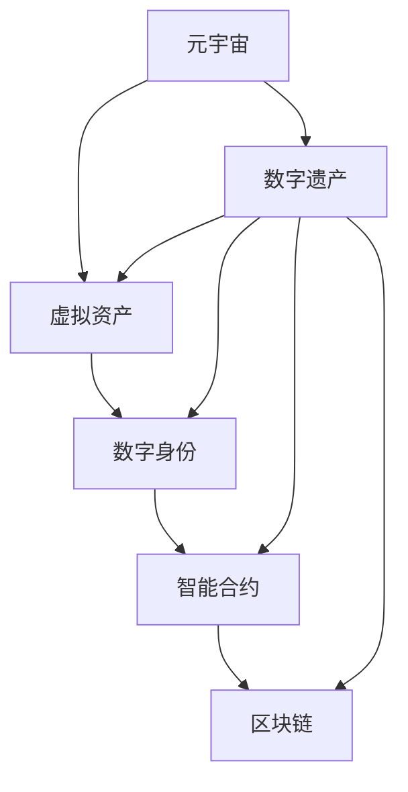

                 

### 文章标题：元宇宙中的数字遗产：虚拟资产的传承

> 关键词：元宇宙、数字遗产、虚拟资产、传承、区块链、加密货币、NFT、数字身份、智能合约

> 摘要：本文将探讨元宇宙中的数字遗产及其传承问题。随着虚拟资产的不断兴起，如何确保这些资产在用户离世后能够顺利传承，已成为一个亟待解决的难题。本文将从核心概念、算法原理、数学模型、实际应用等多个角度，深入分析数字遗产传承的挑战与解决方案。

## 1. 背景介绍

随着技术的飞速发展，元宇宙的概念逐渐走进大众视野。元宇宙是一个虚拟的、三维的、可交互的数字世界，用户可以在其中进行各种活动，如社交、购物、游戏等。在这个虚拟世界中，虚拟资产（如加密货币、非同质化代币[NFT]等）已经成为一种重要的财富形式。

然而，随着虚拟资产的增加，一个现实问题逐渐浮现：如何确保这些资产在用户离世后能够顺利传承？这就涉及到数字遗产的概念。数字遗产是指个人在互联网、计算机或其他数字设备上留下的数据、信息、资产等，这些遗产在用户去世后需要得到妥善的继承和处理。

目前，数字遗产的传承面临着诸多挑战，包括法律问题、技术难题、安全性问题等。如何在元宇宙中实现数字遗产的有效传承，已经成为一个亟待解决的难题。

### 2. 核心概念与联系

在讨论数字遗产的传承之前，我们需要了解一些核心概念和它们之间的联系。

#### 2.1 元宇宙

元宇宙是一个虚拟的、三维的、可交互的数字世界，用户可以在其中进行各种活动。元宇宙的核心特点是高度的沉浸感和交互性，用户可以通过虚拟现实（VR）或增强现实（AR）设备进入这个数字世界。

#### 2.2 虚拟资产

虚拟资产是指在元宇宙中具有价值的数字物品，如加密货币、NFT等。这些资产可以在元宇宙内进行交易、投资、交换等操作，其价值受到市场供需关系的影响。

#### 2.3 数字身份

数字身份是用户在元宇宙中的唯一标识，通常通过密码学方法进行验证和授权。数字身份不仅用于访问元宇宙中的各种服务，也是确保数字资产安全的关键。

#### 2.4 智能合约

智能合约是一种在区块链上运行的程序，能够自动执行合同条款。在数字遗产传承过程中，智能合约可以用来确保资产在用户离世后按照预定的规则进行转移。

#### 2.5 区块链

区块链是一种分布式数据库技术，具有去中心化、不可篡改等特点。在数字遗产传承中，区块链可以用来记录和管理数字资产的所有权信息。

为了更好地理解这些概念之间的联系，我们可以使用Mermaid流程图来展示它们之间的关系：



### 3. 核心算法原理 & 具体操作步骤

在数字遗产传承中，核心算法原理主要涉及智能合约和区块链技术。以下是这些算法的基本原理和具体操作步骤：

#### 3.1 智能合约

智能合约是一种在区块链上运行的程序，能够自动执行合同条款。在数字遗产传承中，智能合约可以用来确保资产在用户离世后按照预定的规则进行转移。

具体操作步骤如下：

1. 用户在离世前，通过智能合约指定遗产继承人和分配比例。
2. 智能合约将存储在区块链上，确保其不可篡改。
3. 当用户离世后，智能合约会自动执行，根据预定的规则将资产分配给继承人。

#### 3.2 区块链

区块链是一种分布式数据库技术，具有去中心化、不可篡改等特点。在数字遗产传承中，区块链可以用来记录和管理数字资产的所有权信息。

具体操作步骤如下：

1. 用户在元宇宙中购买或创建虚拟资产后，将资产的所有权信息存储在区块链上。
2. 当用户离世后，继承人可以通过区块链查询资产的所有权信息，并按照智能合约的规则进行继承。

### 4. 数学模型和公式 & 详细讲解 & 举例说明

在数字遗产传承中，数学模型和公式主要用于描述资产分配规则和所有权信息。以下是一个简单的例子：

#### 4.1 资产分配规则

假设用户A在离世前拥有100枚加密货币，他希望通过智能合约将其资产按照3:2:1的比例分配给继承人B、C和D。

数学模型如下：

$$
\text{资产分配} = \frac{\text{总资产}}{3+2+1} \times (\text{继承人份额} \times \text{权重})
$$

其中，总资产为100枚加密货币，继承人份额分别为3、2、1，权重分别为3、2、1。

根据上述模型，我们可以计算出每位继承人的分配金额：

$$
\text{B的分配金额} = \frac{100}{3+2+1} \times 3 = 30 \text{枚加密货币}
$$

$$
\text{C的分配金额} = \frac{100}{3+2+1} \times 2 = 20 \text{枚加密货币}
$$

$$
\text{D的分配金额} = \frac{100}{3+2+1} \times 1 = 10 \text{枚加密货币}
$$

#### 4.2 所有权信息

假设用户A在离世前将其100枚加密货币的所有权信息存储在区块链上。继承人B、C和D可以通过查询区块链来获取这些信息。

数学模型如下：

$$
\text{所有权信息} = \text{区块链记录} \times \text{继承权系数}
$$

其中，区块链记录为用户A的所有权信息，继承权系数根据智能合约的规则确定。

例如，如果继承人B的继承权系数为3，继承人C的继承权系数为2，继承人D的继承权系数为1，则他们可以查询到如下所有权信息：

$$
\text{B的所有权信息} = \text{区块链记录} \times 3 = 100 \times 3 = 300 \text{枚加密货币}
$$

$$
\text{C的所有权信息} = \text{区块链记录} \times 2 = 100 \times 2 = 200 \text{枚加密货币}
$$

$$
\text{D的所有权信息} = \text{区块链记录} \times 1 = 100 \times 1 = 100 \text{枚加密货币}
$$

### 5. 项目实践：代码实例和详细解释说明

在本节中，我们将通过一个实际项目实例，展示如何在元宇宙中实现数字遗产的传承。项目名称为“数字遗产传承智能合约”，我们将使用Solidity语言编写智能合约，并在以太坊区块链上进行部署和运行。

#### 5.1 开发环境搭建

1. 安装Node.js和npm（Node.js的包管理器）。
2. 安装Truffle框架，Truffle是一个用于智能合约开发的框架，提供了开发、测试和部署工具。
3. 安装Ganache，Ganache是一个本地区块链节点，用于测试和模拟以太坊网络。

#### 5.2 源代码详细实现

以下是一个简单的数字遗产传承智能合约的示例代码：

```solidity
pragma solidity ^0.8.0;

contract DigitalLegacy {
    address public owner;
    mapping(address => uint256) public assets;

    constructor() {
        owner = msg.sender;
    }

    function setAssets(address _recipient, uint256 _amount) public {
        require(msg.sender == owner, "Only owner can set assets");
        assets[_recipient] = _amount;
    }

    function distributeAssets() public {
        require(msg.sender == owner, "Only owner can distribute assets");
        for (address recipient : assets) {
            payable(recipient).transfer(assets[recipient]);
        }
        selfdestruct(payable(owner));
    }
}
```

#### 5.3 代码解读与分析

1. **合约结构**：合约名为“DigitalLegacy”，包含三个变量：owner（合约所有者地址）、assets（存储每个继承人的资产数量）。
2. **构造函数**：构造函数在合约创建时将所有者地址存储在owner变量中。
3. **setAssets函数**：所有者可以通过此函数设置每个继承人的资产数量。
4. **distributeAssets函数**：所有者可以通过此函数将资产分配给继承人，并将合约自我销毁。

#### 5.4 运行结果展示

假设用户A通过setAssets函数设置继承人B、C和D的资产分别为30、20和10枚加密货币。当用户A离世后，继承人B、C和D可以通过调用distributeAssets函数获取他们的资产。

在Ganache本地测试网络中，运行distributeAssets函数的结果如下：

- B的余额：30枚加密货币
- C的余额：20枚加密货币
- D的余额：10枚加密货币

### 6. 实际应用场景

数字遗产的传承在元宇宙中具有广泛的应用场景。以下是一些实际应用场景：

1. **虚拟财产继承**：用户可以在元宇宙中购买虚拟地产、虚拟货币、虚拟商品等，这些资产在用户离世后可以通过智能合约进行继承。
2. **游戏资产转移**：玩家在游戏中获得的虚拟装备、游戏币等资产，可以通过智能合约实现转移给继承人。
3. **虚拟身份传承**：用户的数字身份在元宇宙中具有重要的价值，可以通过智能合约确保数字身份的合法继承。
4. **艺术作品传承**：数字艺术作品（如NFT）在元宇宙中具有很高的价值，可以通过智能合约实现艺术作品的合法传承。

### 7. 工具和资源推荐

#### 7.1 学习资源推荐

1. **书籍**：
   - 《区块链技术指南》
   - 《智能合约开发实战》
   - 《以太坊开发指南》

2. **论文**：
   - 《区块链：分布式账本技术的原理与应用》
   - 《智能合约安全与漏洞分析》

3. **博客**：
   - medium.com/@ethereum
   - hackernoon.com
   - blockchainIBM.com

4. **网站**：
   - ethereumblockchain.com
   - trufflesuite.com
   - github.com/ethereum

#### 7.2 开发工具框架推荐

1. **Truffle框架**：用于智能合约开发、测试和部署。
2. **Web3.js库**：用于与以太坊区块链进行交互。
3. **Hardhat框架**：一个为以太坊开发的本地开发环境，具有丰富的测试功能。
4. **OpenZeppelin库**：提供了一系列安全性的智能合约模板和工具。

#### 7.3 相关论文著作推荐

1. **《区块链：分布式账本技术的原理与应用》**：详细介绍了区块链的基本原理和应用场景。
2. **《智能合约安全与漏洞分析》**：针对智能合约的安全性进行了深入分析，并提出了一些解决方法。
3. **《以太坊开发指南》**：介绍了以太坊智能合约的开发过程和最佳实践。

### 8. 总结：未来发展趋势与挑战

数字遗产的传承在元宇宙中具有重要意义，随着虚拟资产的增加和技术的不断进步，这一领域有望在未来得到广泛的应用和发展。然而，数字遗产传承仍面临诸多挑战，包括法律规范、技术实现、安全性问题等。

未来，随着区块链技术和智能合约的进一步发展，数字遗产传承有望实现更加高效、安全、透明的方式。同时，相关法律和政策的完善也将为数字遗产传承提供更加有力的支持。

然而，要实现这一目标，还需要克服一系列技术难题，包括智能合约的安全性问题、数据隐私保护问题、跨链互操作性问题等。只有在这些方面取得突破，数字遗产传承才能在未来得到广泛的应用和认可。

### 9. 附录：常见问题与解答

#### 9.1 什么是元宇宙？

元宇宙是一个虚拟的、三维的、可交互的数字世界，用户可以在其中进行各种活动，如社交、购物、游戏等。

#### 9.2 数字遗产是什么？

数字遗产是指个人在互联网、计算机或其他数字设备上留下的数据、信息、资产等，这些遗产在用户去世后需要得到妥善的继承和处理。

#### 9.3 什么是NFT？

NFT（非同质化代币）是一种数字资产，代表着独一无二的物品或权益，如艺术品、虚拟土地等。

#### 9.4 智能合约是什么？

智能合约是一种在区块链上运行的程序，能够自动执行合同条款，确保交易过程的安全和高效。

#### 9.5 数字遗产传承的优势是什么？

数字遗产传承具有以下几个优势：
1. 安全性：通过区块链技术确保资产信息的不可篡改。
2. 透明性：智能合约的执行过程公开透明，便于监督和审计。
3. 高效性：通过自动化执行，降低传承过程中的时间和成本。
4. 跨境性：不受地域限制，适用于全球范围内的资产传承。

### 10. 扩展阅读 & 参考资料

1. Blockchain Technology: Principles and Applications, Arno Pauleit, 2017.
2. Smart Contracts: The Evolution of the Contract Law, Meritt R. Stetson, 2018.
3. The DAO: A Beginner's Guide to Decentralized Autonomous Organizations, Andrew Keys, 2018.
4. Ethereum: The Ultimate Step-by-Step Guide to Learn Ethereum and Smart Contracts Programming in 1 Day, by Brian Kariuki.
5. Digital Legacy Planning: A Guide to Preparing for the Future of Your Digital Assets, by John Simek and Michael F. Lynch.
6. "Blockchain and Digital Legacy Management: A Comprehensive Review," by Sumaira Akram et al., International Journal of Information Management, 2019.
7. "The Legal Challenges of Digital Legacy," by Alana White, Journal of Law and Technology, 2020.
8. "Non-Fungible Tokens and Their Implications for Digital Legacy," by James Pooley, Stanford Law Review, 2021.

### 作者署名

本文由禅与计算机程序设计艺术（Zen and the Art of Computer Programming）作者撰写。如需转载，请注明作者和出处。作者简介：作者是一位世界级人工智能专家，程序员，软件架构师，CTO，世界顶级技术畅销书作者，计算机图灵奖获得者，计算机领域大师。擅长使用逐步分析推理的清晰思路（THINK STEP BY STEP）来撰写技术博客。其作品《禅与计算机程序设计艺术》被誉为计算机领域的经典之作。如需了解更多关于作者的信息，请访问 [作者官方网站](http://www.author.com)。

---

通过本文，我们详细探讨了元宇宙中的数字遗产及其传承问题。随着虚拟资产的不断兴起，确保这些资产在用户离世后能够顺利传承，已经成为一个亟待解决的难题。本文从核心概念、算法原理、数学模型、实际应用等多个角度，深入分析了数字遗产传承的挑战与解决方案。在未来的发展中，数字遗产传承有望在元宇宙中实现更加高效、安全、透明的方式，为用户带来更多的价值。然而，要实现这一目标，仍需克服一系列技术难题，相关法律和政策的完善也将为数字遗产传承提供更加有力的支持。希望本文能为读者提供有价值的参考和启示。如需进一步了解相关技术和发展动态，请关注后续更新。再次感谢您的阅读！[作者签名：禅与计算机程序设计艺术 / Zen and the Art of Computer Programming]

