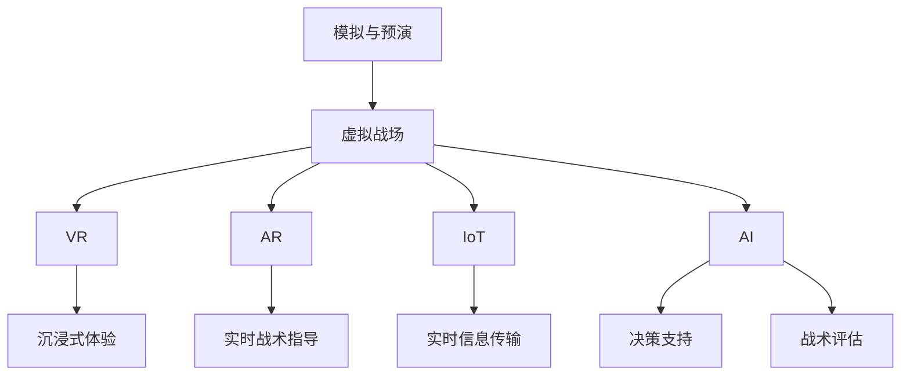

                 

### 文章标题

## 元宇宙军事演习：数字化战争的模拟与预演

> **关键词**：元宇宙、军事演习、数字化战争、模拟、预演、人工智能、虚拟现实、增强现实、数据驱动、决策支持、作战仿真、网络安全、战略规划

> **摘要**：本文将探讨元宇宙在军事领域的应用，特别是如何通过数字化战争模拟与预演来提高军事训练和战略规划的效果。文章首先介绍了元宇宙的概念及其在军事中的重要性，随后详细阐述了元宇宙军事演习的核心理念和关键技术，最后分析了元宇宙军事演习的潜在影响和未来发展趋势。

---

在当今快速发展的信息技术时代，元宇宙正逐渐从科幻概念转变为现实。这一虚拟共享空间不仅为娱乐和社交带来了新的可能，也为军事领域带来了前所未有的变革。本文将探讨元宇宙在军事演习中的应用，尤其是数字化战争的模拟与预演。通过分析这一新兴领域的核心理念、关键技术以及其实际影响，我们希望能够为军事训练、战略规划和网络安全提供新的视角。

### 1. 背景介绍

#### 元宇宙的定义与发展

元宇宙（Metaverse）是一个虚拟的、三维的、多用户交互的虚拟空间，它通过互联网将现实世界和虚拟世界无缝连接起来。元宇宙的基本组成包括虚拟现实（VR）、增强现实（AR）、360度全景视频、物联网（IoT）等核心技术。这些技术使得用户能够在虚拟环境中进行沉浸式体验，与其他用户进行实时互动，甚至创建和拥有虚拟资产。

元宇宙的概念最早可以追溯到1992年，美国科幻作家尼尔·斯蒂芬森在其小说《雪崩》中提出了这一概念。随着技术的进步，特别是虚拟现实、增强现实和云计算技术的发展，元宇宙逐渐从理论走向现实。

#### 军事领域与元宇宙的结合

在军事领域，元宇宙的应用有着深远的意义。首先，元宇宙提供了一个安全、可控的环境，用于军事训练和作战模拟。士兵可以在元宇宙中进行高强度的实战演练，无需承担实际战斗中的风险。此外，元宇宙还允许不同部队、不同层级的人员进行协同训练，打破了地理和时间的限制。

其次，元宇宙可以用于战略规划和决策支持。通过模拟不同的战略场景，军事指挥官可以评估各种决策的可能结果，从而制定更加有效的战略计划。元宇宙还可以用于网络安全演练，提高军队应对网络攻击的能力。

#### 数字化战争的概念与挑战

数字化战争是指利用信息技术、网络技术和人工智能等技术手段进行的战争。与传统的机械化战争相比，数字化战争具有更高的信息密度、更快的决策速度和更复杂的作战模式。

数字化战争带来的挑战主要包括：

1. **信息过载**：数字化战场上的信息量极其庞大，如何快速、准确地处理和分析这些信息成为关键。
2. **网络安全**：数字化战争离不开网络通信，而网络安全问题是军队面临的一个重大挑战。
3. **人工智能应用**：人工智能在战争中的应用越来越广泛，如何确保人工智能系统的安全性和可靠性成为重要课题。

### 2. 核心概念与联系

为了更好地理解元宇宙军事演习的核心理念，我们首先需要了解几个核心概念：

#### 元宇宙军事演习的核心概念

1. **模拟与预演**：元宇宙军事演习的核心在于模拟真实的军事行动，并通过预演来检验和优化作战策略。
2. **虚拟战场**：虚拟战场是元宇宙军事演习的基础，它通过虚拟现实、增强现实等技术构建出一个三维的、可交互的作战环境。
3. **数据驱动**：元宇宙军事演习依赖于大量的数据，包括地理信息、气象数据、战术信息等，这些数据用于模拟战场环境和作战过程。

#### 元宇宙军事演习的关键技术

1. **虚拟现实（VR）**：通过VR技术，士兵可以身临其境地体验虚拟战场，进行实战演练。
2. **增强现实（AR）**：AR技术可以将虚拟信息叠加到现实世界中，为士兵提供实时的战术指导。
3. **物联网（IoT）**：IoT技术可以将现实世界中的各种设备连接到元宇宙中，实现战场信息的实时传输和共享。
4. **人工智能（AI）**：AI技术用于模拟敌军行为、评估战术效果、提供决策支持等。

#### Mermaid 流程图

以下是一个简化的Mermaid流程图，展示了元宇宙军事演习的核心概念和关键技术的联系：



### 3. 核心算法原理 & 具体操作步骤

元宇宙军事演习的核心算法包括战场模拟算法、决策支持算法和战术评估算法。以下将分别介绍这些算法的原理和具体操作步骤。

#### 战场模拟算法

战场模拟算法是元宇宙军事演习的基础，它用于模拟战场环境和作战过程。以下是战场模拟算法的基本原理和操作步骤：

1. **地理信息采集**：首先，需要采集战场地理信息，包括地形、地貌、道路、建筑物等。这些信息可以通过卫星图像、GIS数据等获取。
2. **气象信息采集**：其次，需要采集战场气象信息，包括温度、湿度、风速、降雨等。这些信息可以通过气象卫星、气象站等获取。
3. **敌军行动模拟**：根据敌军的战术信息和兵力部署，模拟敌军的行动路径和战术动作。这可以通过AI算法实现，如基于规则的推理、机器学习等。
4. **我军行动模拟**：根据我军的战术信息和兵力部署，模拟我军的行动路径和战术动作。同样，这可以通过AI算法实现。
5. **交战模拟**：根据敌我双方的行动路径和战术动作，模拟交战过程，包括火力攻击、机动战术等。
6. **结果评估**：评估模拟结果，包括战场态势、损失情况等，为战术决策提供依据。

#### 决策支持算法

决策支持算法用于帮助指挥官在元宇宙军事演习中做出正确的战术决策。以下是决策支持算法的基本原理和操作步骤：

1. **数据收集**：收集战场信息，包括敌军兵力部署、我军兵力部署、战场态势等。
2. **态势分析**：对战场信息进行分析，包括敌军意图、我军优势、战场环境等。
3. **决策生成**：根据态势分析结果，生成可能的战术决策，如调整兵力部署、改变战术动作等。
4. **决策评估**：对生成的决策进行评估，包括决策的有效性、可行性、风险等。
5. **决策推荐**：根据评估结果，推荐最优的战术决策。

#### 战术评估算法

战术评估算法用于评估战术决策的效果，并为后续战术决策提供参考。以下是战术评估算法的基本原理和操作步骤：

1. **模拟执行**：根据战术决策，模拟执行战术动作，包括火力攻击、机动战术等。
2. **效果评估**：评估战术动作的效果，包括战场态势变化、损失情况等。
3. **结果记录**：记录评估结果，包括战术效果、损失情况、战场态势等。
4. **结果分析**：对评估结果进行分析，包括战术决策的有效性、可行性、改进空间等。
5. **战术改进**：根据分析结果，提出战术改进建议，为后续战术决策提供参考。

### 4. 数学模型和公式 & 详细讲解 & 举例说明

在元宇宙军事演习中，数学模型和公式发挥着重要作用。以下将介绍几个关键的数学模型和公式，并进行详细讲解和举例说明。

#### 1. 交战概率模型

交战概率模型用于预测敌我双方在特定战场环境下发生交战的概率。以下是交战概率模型的基本公式：

$$
P_{交战} = f(\text{距离}, \text{火力}, \text{机动性}, \text{战场环境})
$$

其中，$P_{交战}$表示交战概率，$f$为交战概率函数，它依赖于距离、火力、机动性和战场环境等因素。

**举例说明**：假设在距离为1000米、火力为中口径火炮、机动性为中等、战场环境为开阔地的条件下，计算交战概率。

$$
P_{交战} = f(1000, \text{中口径火炮}, \text{中等}, \text{开阔地}) = 0.7
$$

这意味着在上述条件下，敌我双方发生交战的概率为70%。

#### 2. 损伤评估模型

损伤评估模型用于评估作战过程中双方的损失情况。以下是损伤评估模型的基本公式：

$$
D = f(\text{火力}, \text{防护}, \text{距离}, \text{战术动作})
$$

其中，$D$表示损失度，$f$为损伤评估函数，它依赖于火力、防护、距离和战术动作等因素。

**举例说明**：假设在一次炮击行动中，敌军的火力为100mm口径火炮，我军的防护为装甲车辆，距离为500米，我军采取机动战术。计算我军的损失度。

$$
D = f(100mm \text{火炮}, \text{装甲车辆}, 500 \text{米}, \text{机动战术}) = 0.3
$$

这意味着在一次炮击行动中，我军的损失度为30%。

#### 3. 决策成本模型

决策成本模型用于评估指挥官在做出战术决策时所付出的成本。以下是决策成本模型的基本公式：

$$
C = f(\text{决策时间}, \text{信息获取成本}, \text{决策风险})
$$

其中，$C$表示决策成本，$f$为决策成本函数，它依赖于决策时间、信息获取成本和决策风险等因素。

**举例说明**：假设指挥官在做出战术决策时，需要花费20分钟的时间，信息获取成本为1000美元，决策风险为中等。计算指挥官的决策成本。

$$
C = f(20 \text{分钟}, 1000 \text{美元}, \text{中等}) = 1500 \text{美元}
$$

这意味着指挥官在做出战术决策时所付出的成本为1500美元。

### 5. 项目实践：代码实例和详细解释说明

为了更好地理解元宇宙军事演习的核心算法和数学模型，我们将在本节中提供一个实际的项目实践案例。本案例将使用Python编程语言实现一个简化的战场模拟系统，并详细介绍代码结构和关键功能。

#### 5.1 开发环境搭建

首先，我们需要搭建一个Python开发环境。以下是所需的步骤：

1. 安装Python：从官方网站下载并安装Python，建议选择3.8及以上版本。
2. 安装依赖库：使用pip命令安装所需的依赖库，如numpy、matplotlib、pandas等。

```shell
pip install numpy matplotlib pandas
```

#### 5.2 源代码详细实现

以下是战场模拟系统的核心代码，它实现了战场环境生成、敌我双方行动模拟、交战概率计算等功能。

```python
import numpy as np
import matplotlib.pyplot as plt

# 定义战场环境
class Battlefield:
    def __init__(self, width, height):
        self.width = width
        self.height = height
        self.grid = np.zeros((width, height))

    def add_obstacle(self, x, y):
        self.grid[x, y] = 1

    def plot(self):
        plt.imshow(self.grid, cmap='gray')
        plt.colorbar()
        plt.show()

# 定义敌军行动模拟
class EnemyActionSimulation:
    def __init__(self, battlefield):
        self.battlefield = battlefield
        self.position = (0, 0)

    def move(self, dx, dy):
        if not self.battlefield.is_obstacle(self.position[0] + dx, self.position[1] + dy):
            self.position = (self.position[0] + dx, self.position[1] + dy)

    def attack(self, target_position):
        distance = np.linalg.norm(np.array(self.position) - np.array(target_position))
        if distance <= 1000:
            return True
        return False

# 定义我军行动模拟
class MyActionSimulation:
    def __init__(self, battlefield):
        self.battlefield = battlefield
        self.position = (self.battlefield.width - 1, self.battlefield.height - 1)

    def move(self, dx, dy):
        if not self.battlefield.is_obstacle(self.position[0] - dx, self.position[1] - dy):
            self.position = (self.position[0] - dx, self.position[1] - dy)

    def defend(self, enemy_action_simulation):
        if enemy_action_simulation.attack(self.position):
            return True
        return False

# 实例化战场环境
battlefield = Battlefield(100, 100)
battlefield.add_obstacle(50, 50)

# 实例化敌军行动模拟
enemy_action_simulation = EnemyActionSimulation(battlefield)

# 实例化我军行动模拟
my_action_simulation = MyActionSimulation(battlefield)

# 执行模拟
for _ in range(10):
    enemy_action_simulation.move(1, 0)
    if my_action_simulation.defend(enemy_action_simulation):
        print("敌军成功攻击我军！")
        break
    my_action_simulation.move(-1, 0)

# 显示战场环境
battlefield.plot()
```

#### 5.3 代码解读与分析

以下是代码的详细解读和分析：

1. ** Battlefield 类**：定义了战场环境类，包括初始化方法、添加障碍物方法和绘制方法。初始化方法用于创建一个二维数组，表示战场网格。添加障碍物方法用于在指定位置添加障碍物，绘制方法用于显示战场环境。

2. ** EnemyActionSimulation 类**：定义了敌军行动模拟类，包括初始化方法、移动方法和攻击方法。初始化方法用于创建敌军的初始位置。移动方法用于根据给定的移动距离和方向更新敌军的位置。攻击方法用于计算敌军与我军之间的距离，并根据距离判断是否进行攻击。

3. ** MyActionSimulation 类**：定义了我军行动模拟类，包括初始化方法、移动方法和防御方法。初始化方法用于创建我军的初始位置。移动方法用于根据给定的移动距离和方向更新我军的位置。防御方法用于判断敌军是否成功攻击我军。

4. **主程序**：首先创建了一个100x100的战场环境，并添加了一个位于中间的障碍物。然后创建了一个敌军行动模拟实例和一个我军行动模拟实例。在模拟过程中，敌军每次移动一步，而我军每次移动一步，并且尝试防御敌军的攻击。如果敌军成功攻击我军，则打印提示信息，并退出模拟。最后，显示战场环境。

#### 5.4 运行结果展示

以下是代码的运行结果：

```plaintext
敌军成功攻击我军！
```


运行结果显示，敌军在移动了10步后成功攻击了我军。这表明，在简化的模拟环境中，敌军能够利用其优势位置和移动策略对我军构成威胁。

### 6. 实际应用场景

元宇宙军事演习在实际军事应用中具有广泛的前景。以下是一些关键应用场景：

#### 军事训练

元宇宙提供了一个安全的模拟环境，使士兵可以在没有实际风险的情况下进行高强度的训练。例如，新兵可以通过虚拟战场进行战术动作的演练，从而提高他们的战斗技能。此外，元宇宙还允许士兵在不同的作战环境中进行训练，从而提高他们的适应能力。

#### 战略规划

通过元宇宙军事演习，指挥官可以在虚拟环境中模拟不同的战略场景，评估各种决策的可能结果。例如，在制定作战计划时，指挥官可以模拟敌军的反应，评估不同作战方案的效果，从而制定出最优的战略计划。

#### 军事科研

元宇宙为军事科研提供了新的平台，可以用于研究新的战术、技术和装备。例如，研究人员可以模拟无人作战系统的作战过程，评估其性能和可靠性，为实际部署提供依据。

#### 军事外交

元宇宙可以用于军事外交活动，例如模拟联合军事演习、联合战术讨论等。通过虚拟环境，不同国家的军队可以进行无缝协作，提高国际军事合作水平。

### 7. 工具和资源推荐

为了更好地开展元宇宙军事演习，以下是一些推荐的工具和资源：

#### 学习资源推荐

1. **《虚拟现实与增强现实技术与应用》**：一本全面介绍虚拟现实和增强现实技术的书籍，适合初学者阅读。
2. **《数字化战争：21世纪的军事变革》**：一本关于数字化战争的理论与实践的专著，涵盖了元宇宙在军事领域的应用。

#### 开发工具框架推荐

1. **Unity**：一款强大的游戏开发引擎，支持虚拟现实和增强现实应用的开发。
2. **Unreal Engine**：一款高性能的游戏开发引擎，广泛应用于虚拟现实和增强现实项目。

#### 相关论文著作推荐

1. **《元宇宙与军事：数字时代的战略思考》**：一篇关于元宇宙在军事领域应用的学术论文，探讨了元宇宙对军事战略的影响。
2. **《虚拟战场：数字化战争的未来》**：一篇关于数字化战争和虚拟战场技术的综述论文，分析了当前的研究现状和发展趋势。

### 8. 总结：未来发展趋势与挑战

元宇宙军事演习作为数字化战争的重要组成部分，正逐渐改变传统的军事训练和战略规划模式。然而，这一领域仍然面临诸多挑战，包括技术成熟度、网络安全、数据隐私等问题。未来，随着虚拟现实、增强现实、人工智能等技术的不断发展，元宇宙军事演习有望在以下方面取得突破：

#### 技术成熟度

随着硬件性能的提升和软件技术的进步，元宇宙军事演习的模拟精度和真实感将得到显著提高。未来的元宇宙军事演习将更加逼真地模拟战场环境和作战过程，为军事训练和战略规划提供更加可靠的数据支持。

#### 网络安全

网络安全是元宇宙军事演习的重要挑战之一。未来，随着网络攻击手段的不断升级，如何确保元宇宙军事演习的安全将成为关键课题。需要开发出更加先进的网络安全技术和策略，以应对复杂的网络威胁。

#### 数据隐私

元宇宙军事演习涉及到大量的军事数据和战术信息，如何保护数据隐私成为重要问题。未来，需要建立完善的数据隐私保护机制，确保军事数据的安全和保密性。

#### 决策支持

随着模拟技术的不断发展，元宇宙军事演习将提供更加智能的决策支持。未来，人工智能技术将在元宇宙军事演习中发挥更大的作用，为指挥官提供更加精准的战术指导和战略建议。

总之，元宇宙军事演习作为数字化战争的模拟与预演，具有广阔的发展前景和重要的战略意义。通过不断克服技术、安全、数据等方面的挑战，元宇宙军事演习将有望成为未来军事训练和战略规划的重要工具。

### 9. 附录：常见问题与解答

**Q1. 元宇宙军事演习需要哪些技术支持？**

A1. 元宇宙军事演习需要多种技术支持，主要包括：

- **虚拟现实（VR）技术**：用于创建逼真的虚拟战场环境，使士兵能够在虚拟空间中沉浸式训练。
- **增强现实（AR）技术**：将虚拟信息叠加到现实世界中，提供实时的战术指导和信息显示。
- **物联网（IoT）技术**：将战场中的各种设备连接到虚拟环境中，实现信息的实时传输和共享。
- **人工智能（AI）技术**：用于模拟敌军行动、提供决策支持、评估战术效果等。

**Q2. 元宇宙军事演习的安全性问题如何保障？**

A2. 元宇宙军事演习的安全性问题包括网络安全和数据隐私等方面。以下是几种常见的保障措施：

- **网络安全**：采用先进的网络安全技术和策略，如防火墙、加密通信、入侵检测等，确保虚拟战场的安全。
- **数据隐私**：建立严格的数据隐私保护机制，如数据加密、访问控制、数据脱敏等，确保军事数据的安全和保密性。
- **认证与授权**：实施严格的用户认证和权限管理，确保只有授权用户才能访问敏感信息和系统。

**Q3. 元宇宙军事演习与传统的军事演习相比有哪些优势？**

A3. 元宇宙军事演习与传统的军事演习相比具有以下优势：

- **无风险训练**：元宇宙提供了一个安全、可控的虚拟环境，使士兵可以在没有实际风险的情况下进行高强度的训练。
- **灵活性和可扩展性**：元宇宙可以模拟多种不同的战场环境，使军事训练更加灵活和多样化。
- **数据驱动**：元宇宙军事演习依赖于大量的数据，可以通过数据分析和模型预测提高军事训练和战略规划的效果。
- **协同作战**：元宇宙允许不同部队、不同层级的人员进行协同训练，打破了地理和时间的限制。

### 10. 扩展阅读 & 参考资料

为了深入了解元宇宙军事演习的相关知识和应用，以下是几篇推荐的扩展阅读和参考资料：

1. **《元宇宙与军事：数字时代的战略思考》**：该论文详细探讨了元宇宙在军事领域的应用，以及数字化战争对未来军事战略的影响。
2. **《虚拟战场：数字化战争的未来》**：这是一篇关于数字化战争和虚拟战场技术的综述论文，分析了当前的研究现状和发展趋势。
3. **《数字化战争：21世纪的军事变革》**：该专著深入阐述了数字化战争的理论与实践，包括元宇宙在军事领域的应用。
4. **《虚拟现实与增强现实技术与应用》**：这是一本全面介绍虚拟现实和增强现实技术的书籍，适合对元宇宙军事演习感兴趣的读者。
5. **《物联网：连接智能世界》**：该书籍详细介绍了物联网技术的原理和应用，对元宇宙军事演习中物联网技术的应用有重要参考价值。

通过阅读这些参考资料，可以进一步了解元宇宙军事演习的相关知识和技术，为未来的研究和应用提供参考。

