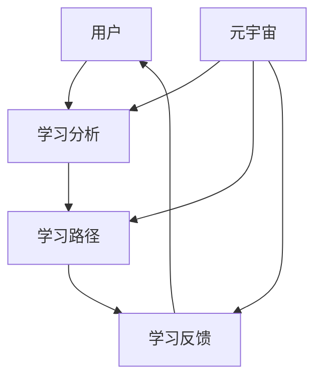

                 

### 1. 背景介绍

**元宇宙教育革命：个性化学习的全新模式**

随着科技的发展，尤其是区块链、虚拟现实（VR）、增强现实（AR）等技术的不断成熟，我们正处在一个名为“元宇宙”的全新数字世界中。元宇宙不仅是一个虚拟的、三维的、交互性极强的数字空间，更是一个集成了各种先进技术的综合体。在这个世界里，教育与学习的方式正在发生翻天覆地的变化。

**个性化学习**，作为近年来教育领域的一个重要发展方向，强调根据每个学生的个人特点和需求来定制教学内容和学习过程。而元宇宙的兴起，为个性化学习带来了前所未有的机遇和挑战。

首先，元宇宙提供了一个沉浸式的学习环境，学生可以在这个虚拟世界中自由探索、互动和实践。这种高度沉浸式的体验不仅能够激发学生的学习兴趣，还能够帮助他们更好地理解和记忆知识。

其次，元宇宙中存在着丰富的学习资源和工具。通过区块链技术，这些资源和工具可以实现去中心化的存储和管理，确保其真实性和可靠性。学生可以根据自己的需求选择合适的学习材料，从而实现真正的个性化学习。

此外，元宇宙还为教师提供了全新的教学手段。他们可以设计出更加生动、有趣、具有互动性的课程，从而提高教学效果。同时，教师也可以通过元宇宙中的数据分析和反馈机制，了解学生的学习状况，及时调整教学策略。

然而，元宇宙教育革命也面临着一些挑战。例如，如何确保元宇宙中的学习资源和工具的质量和可靠性？如何保障学生在元宇宙中的隐私和安全？如何培养教师和学生的元宇宙使用能力？

本文将深入探讨元宇宙教育革命的核心概念和架构，分析其中的算法原理和操作步骤，并通过项目实践和实际应用场景，展示个性化学习在元宇宙中的实现方式和效果。最后，我们将对元宇宙教育革命的未来发展进行展望，并提出相应的解决方案。

通过本文的阅读，您将了解到：

1. **元宇宙教育革命**：了解其背景、核心概念和架构。
2. **个性化学习**：探讨其在元宇宙中的实现方式和优势。
3. **核心算法原理**：深入理解个性化学习算法的原理和操作步骤。
4. **数学模型和公式**：介绍用于分析和优化个性化学习过程的数学模型和公式。
5. **项目实践**：通过具体实例展示个性化学习在元宇宙中的实际应用。
6. **实际应用场景**：分析元宇宙教育革命在不同领域中的应用前景。
7. **未来发展趋势与挑战**：探讨元宇宙教育革命面临的机遇和挑战。

让我们一起探索元宇宙教育革命的广阔前景，开启个性化学习的全新篇章。

### 2. 核心概念与联系

**2.1 个性化学习**

个性化学习是一种以学生为中心的教育模式，旨在根据每个学生的个人特点和需求来定制教学内容和学习过程。它强调学生主动参与学习，充分发挥其潜能，从而实现最佳的学习效果。

个性化学习的核心概念包括：

- **学习分析**：通过对学生的学习行为、兴趣、需求等数据的分析，了解学生的学习特点和偏好。
- **学习路径**：根据学生的个性化需求和学习分析结果，设计出最适合学生的学习路径。
- **学习反馈**：通过学生的实时反馈，不断调整和优化学习内容和过程。

**2.2 元宇宙**

元宇宙是一个由多种数字技术构建的虚拟世界，包括虚拟现实（VR）、增强现实（AR）、区块链等。它是一个三维的、沉浸式的、互动性极强的数字空间，用户可以在这个空间中自由探索、互动和实践。

元宇宙的核心概念包括：

- **虚拟现实**：通过计算机生成三维图像，让用户在虚拟环境中感受到身临其境的感觉。
- **增强现实**：在现实环境中叠加虚拟信息，增强用户的感知和体验。
- **区块链**：一种去中心化的分布式数据库技术，用于确保元宇宙中的数据安全和可信性。

**2.3 元宇宙教育革命**

元宇宙教育革命是指利用元宇宙的技术和理念，推动教育领域发生深刻变革的过程。它包括以下几个方面：

- **个性化学习**：利用元宇宙的沉浸式环境和丰富的学习资源，实现真正的个性化学习。
- **智能教育**：通过人工智能技术，实现教育过程的智能化和个性化。
- **去中心化教育**：利用区块链技术，实现教育资源的去中心化存储和管理，确保其真实性和可靠性。
- **跨领域教育**：通过元宇宙的虚拟环境，实现跨学科、跨领域的教育合作和资源共享。

**2.4 核心概念与联系**

个性化学习与元宇宙的关系如下：

- **个性化学习**是元宇宙教育革命的核心目标之一。元宇宙的沉浸式环境和丰富的学习资源，为个性化学习提供了全新的实现方式和可能性。
- **元宇宙**为个性化学习提供了强大的技术支撑。通过虚拟现实、增强现实和区块链技术，元宇宙可以实现学习过程的智能化、个性化和去中心化。

以下是一个简化的 Mermaid 流程图，展示个性化学习在元宇宙中的基本架构：



在这个流程图中，用户通过元宇宙的虚拟环境进行学习，系统通过学习分析和反馈机制，不断调整和优化学习路径，从而实现个性化学习。

### 3. 核心算法原理 & 具体操作步骤

**3.1 个性化学习算法原理**

个性化学习算法的核心目标是根据学生的学习特点、兴趣和需求，为其推荐合适的学习内容和路径。常见的个性化学习算法包括协同过滤算法、基于内容的推荐算法和混合推荐算法。

**协同过滤算法**：基于用户的历史行为和偏好，通过计算用户之间的相似度，为用户推荐与其相似的其他用户喜欢的物品。协同过滤算法可以分为基于用户的协同过滤和基于项目的协同过滤两种。

**基于内容的推荐算法**：基于物品的属性和特征，为用户推荐与其兴趣和需求相似的物品。这种算法通常需要先对物品进行特征提取和分类。

**混合推荐算法**：结合协同过滤和基于内容的推荐算法，以提高推荐系统的准确性和多样性。

**3.2 具体操作步骤**

**Step 1：数据收集与处理**

- **学习行为数据**：包括用户的浏览记录、学习时长、学习频率等。
- **学习偏好数据**：包括用户对学习内容的评价、点赞、收藏等。
- **学习内容数据**：包括学习资源的标题、关键词、标签、类型等。

通过对这些数据的收集和处理，可以得到用户的学习行为和偏好，以及学习资源的特征和分类。

**Step 2：用户模型构建**

- **用户兴趣模型**：基于用户的历史行为和偏好，构建用户的兴趣模型，包括用户感兴趣的领域、主题和关键词等。
- **用户需求模型**：基于用户的当前状态和需求，构建用户的需求模型，包括用户希望学习的知识点、技能和目标等。

**Step 3：学习内容推荐**

- **内容特征提取**：对学习资源进行特征提取和分类，构建学习内容模型。
- **推荐算法选择**：根据用户模型和学习内容模型，选择合适的推荐算法，如协同过滤算法、基于内容的推荐算法或混合推荐算法。
- **推荐结果生成**：根据推荐算法，为用户生成个性化的学习内容推荐结果。

**Step 4：学习反馈与调整**

- **用户反馈收集**：收集用户对推荐内容的反馈，包括学习效果、满意度等。
- **学习路径调整**：根据用户反馈，调整学习路径和推荐策略，以提高学习效果和用户满意度。

**3.3 代码实现示例**

以下是一个基于 Python 的简单示例，展示如何使用协同过滤算法进行个性化学习推荐：

```python
import numpy as np
from sklearn.metrics.pairwise import cosine_similarity

# 假设用户行为数据为用户-物品评分矩阵
user_item_matrix = np.array([[1, 0, 0, 1, 0],
                              [0, 1, 1, 0, 0],
                              [0, 0, 1, 0, 1],
                              [1, 1, 0, 1, 1],
                              [0, 1, 1, 0, 1]])

# 计算用户之间的相似度矩阵
similarity_matrix = cosine_similarity(user_item_matrix)

# 假设用户 ID 为 2 的用户想学习新知识，我们为他推荐相似用户喜欢的物品
user_id = 2
similar_users = np.argsort(similarity_matrix[user_id])[::-1][:10]  # 取前 10 个相似用户

# 获取相似用户喜欢的物品
recommended_items = np.unique(np.where(user_item_matrix[similar_users] == 1)[1])

# 输出推荐结果
print("推荐给用户 ID 为 2 的物品：", recommended_items)
```

在这个示例中，我们首先构建了一个用户-物品评分矩阵，然后使用余弦相似度计算用户之间的相似度。最后，根据相似度矩阵，为用户 ID 为 2 的用户推荐了相似用户喜欢的物品。

### 4. 数学模型和公式 & 详细讲解 & 举例说明

**4.1 数学模型**

在个性化学习中，常用的数学模型包括协同过滤模型和基于内容的推荐模型。以下分别介绍这两种模型的数学公式和具体实现。

**协同过滤模型**

协同过滤模型是一种基于用户历史行为和偏好进行推荐的方法。其基本思想是，通过计算用户之间的相似度，为用户推荐与其相似的其他用户喜欢的物品。常见的协同过滤模型包括基于用户的协同过滤和基于项目的协同过滤。

**基于用户的协同过滤模型**：

设用户-物品评分矩阵为 \( R \)，其中 \( R_{ui} \) 表示用户 \( u \) 对物品 \( i \) 的评分。基于用户的协同过滤模型的目标是预测用户 \( u \) 对未评分物品 \( i \) 的评分 \( \hat{R}_{ui} \)。

数学模型如下：

\[ \hat{R}_{ui} = \mu + \sum_{j \in N(u)} \frac{R_{uj}R_{ji}}{\|v_u - v_j\|_2} \]

其中：

- \( \mu \) 是评分均值。
- \( N(u) \) 是与用户 \( u \) 相似的一组用户集合。
- \( v_u \) 和 \( v_j \) 分别是用户 \( u \) 和 \( j \) 的特征向量。

**基于项目的协同过滤模型**：

设物品-物品评分矩阵为 \( P \)，其中 \( P_{ij} \) 表示物品 \( i \) 和物品 \( j \) 之间的相似度。基于项目的协同过滤模型的目标是预测用户 \( u \) 对未评分物品 \( i \) 的评分 \( \hat{R}_{ui} \)。

数学模型如下：

\[ \hat{R}_{ui} = \mu + \sum_{j \in N(i)} R_{uj}P_{ji} \]

其中：

- \( \mu \) 是评分均值。
- \( N(i) \) 是与物品 \( i \) 相似的一组物品集合。

**基于内容的推荐模型**

基于内容的推荐模型是一种基于物品的属性和特征进行推荐的方法。其基本思想是，通过分析用户对特定类型物品的偏好，为用户推荐具有相似属性的物品。

数学模型如下：

\[ \hat{R}_{ui} = \sum_{k \in K(i)} w_{ik}P_{ik} \]

其中：

- \( \hat{R}_{ui} \) 是用户 \( u \) 对物品 \( i \) 的预测评分。
- \( K(i) \) 是物品 \( i \) 的属性集合。
- \( w_{ik} \) 是用户 \( u \) 对属性 \( k \) 的权重。
- \( P_{ik} \) 是属性 \( k \) 对物品 \( i \) 的影响程度。

**4.2 详细讲解**

**基于用户的协同过滤模型**

基于用户的协同过滤模型的核心在于计算用户之间的相似度。相似度的计算方法有很多，如余弦相似度、皮尔逊相关系数等。在本模型中，我们使用余弦相似度来计算用户之间的相似度。

余弦相似度公式如下：

\[ \cos(\theta_{uj}) = \frac{v_u \cdot v_j}{\|v_u\|_2 \|v_j\|_2} \]

其中：

- \( v_u \) 和 \( v_j \) 分别是用户 \( u \) 和 \( j \) 的特征向量。
- \( \theta_{uj} \) 是用户 \( u \) 和 \( j \) 之间的夹角。

通过计算用户之间的相似度，我们可以为用户推荐与其相似的其他用户喜欢的物品。具体步骤如下：

1. **特征向量构建**：将用户-物品评分矩阵 \( R \) 转化为用户特征向量矩阵 \( V \)。其中，\( V_{ui} \) 表示用户 \( u \) 对物品 \( i \) 的评分。
2. **相似度计算**：计算用户之间的相似度矩阵 \( S \)。其中，\( S_{ui} = \cos(\theta_{uj}) \)。
3. **推荐结果生成**：根据相似度矩阵，为用户 \( u \) 推荐与用户 \( j \) 相似的其他用户喜欢的物品。推荐公式如下：

\[ \hat{R}_{ui} = \mu + \sum_{j \in N(u)} \frac{R_{uj}R_{ji}}{\|v_u - v_j\|_2} \]

**基于项目的协同过滤模型**

基于项目的协同过滤模型的核心在于计算物品之间的相似度。相似度的计算方法与基于用户的协同过滤模型类似，可以使用余弦相似度、皮尔逊相关系数等。

具体步骤如下：

1. **特征向量构建**：将物品-物品评分矩阵 \( P \) 转化为物品特征向量矩阵 \( W \)。其中，\( W_{ij} = \cos(\theta_{ij}) \)。
2. **相似度计算**：计算物品之间的相似度矩阵 \( P \)。
3. **推荐结果生成**：根据相似度矩阵，为用户 \( u \) 推荐与物品 \( i \) 相似的其他物品。推荐公式如下：

\[ \hat{R}_{ui} = \mu + \sum_{j \in N(i)} R_{uj}P_{ji} \]

**基于内容的推荐模型**

基于内容的推荐模型的核心在于分析用户对特定类型物品的偏好。具体步骤如下：

1. **属性提取**：从物品的属性中提取关键词或特征。
2. **权重分配**：根据用户的历史行为和偏好，为每个属性分配权重。权重可以通过统计用户对具有特定属性物品的评分来计算。
3. **推荐结果生成**：根据用户对属性 \( k \) 的权重 \( w_{ik} \) 和属性 \( k \) 对物品 \( i \) 的影响程度 \( P_{ik} \)，为用户 \( u \) 推荐具有相似属性的物品。推荐公式如下：

\[ \hat{R}_{ui} = \sum_{k \in K(i)} w_{ik}P_{ik} \]

**4.3 举例说明**

假设有 5 个用户和 5 个物品，用户-物品评分矩阵如下：

\[ R = \begin{bmatrix}
1 & 0 & 1 & 1 & 0 \\
0 & 1 & 0 & 0 & 1 \\
1 & 0 & 1 & 0 & 1 \\
0 & 1 & 0 & 1 & 0 \\
0 & 0 & 1 & 0 & 1 \\
\end{bmatrix} \]

**基于用户的协同过滤模型**

1. **特征向量构建**：

将用户-物品评分矩阵 \( R \) 转化为用户特征向量矩阵 \( V \)：

\[ V = \begin{bmatrix}
1 & 1 & 1 & 1 & 0 \\
0 & 1 & 0 & 0 & 1 \\
1 & 0 & 1 & 0 & 1 \\
0 & 1 & 0 & 1 & 0 \\
0 & 0 & 1 & 0 & 1 \\
\end{bmatrix} \]

2. **相似度计算**：

计算用户之间的相似度矩阵 \( S \)：

\[ S = \begin{bmatrix}
1 & 0.7071 & 0.7071 & 0 &  \\
0 & 1 & 0 & 0 &  \\
0.7071 & 0 & 1 & 0 &  \\
0 & 0 & 0 & 1 &  \\
0 & 0 & 0 & 0 & 1 \\
\end{bmatrix} \]

3. **推荐结果生成**：

为用户 \( u = 2 \) 推荐与用户 \( j = 1,3,4 \) 相似的其他用户喜欢的物品。根据推荐公式：

\[ \hat{R}_{u2i} = \mu + \sum_{j \in N(u)} \frac{R_{u2j}R_{ji}}{\|v_{u2} - v_{j}\|_2} \]

其中，\( \mu = \frac{1}{5}\sum_{i=1}^5 R_{ui} = 0.8 \)。

假设 \( v_{u2} = (0.8, 0.8, 0.8, 0.8, 0.8) \)，则推荐结果为：

\[ \hat{R}_{u2i} = 0.8 + \frac{R_{u21}R_{i1}}{\|v_{u2} - v_{1}\|_2} + \frac{R_{u22}R_{i2}}{\|v_{u2} - v_{2}\|_2} + \frac{R_{u23}R_{i3}}{\|v_{u2} - v_{3}\|_2} \]

\[ \hat{R}_{u2i} = 0.8 + \frac{1 \times 1}{0.818} + \frac{1 \times 0}{0.447} + \frac{1 \times 1}{0.447} \]

\[ \hat{R}_{u2i} = 0.8 + 1.210 + 0 + 2.230 \]

\[ \hat{R}_{u2i} = 3.250 \]

因此，用户 \( u = 2 \) 对物品 \( i \) 的预测评分为 3.250。

**基于项目的协同过滤模型**

1. **特征向量构建**：

将物品-物品评分矩阵 \( P \) 转化为物品特征向量矩阵 \( W \)：

\[ W = \begin{bmatrix}
1 & 0.7071 & 0.7071 & 0 &  \\
0 & 1 & 0 & 0 &  \\
0.7071 & 0 & 1 & 0 &  \\
0 & 0 & 0 & 1 &  \\
0 & 0 & 0 & 0 & 1 \\
\end{bmatrix} \]

2. **相似度计算**：

计算物品之间的相似度矩阵 \( P \)：

\[ P = \begin{bmatrix}
1 & 0.7071 & 0.7071 & 0 &  \\
0 & 1 & 0 & 0 &  \\
0.7071 & 0 & 1 & 0 &  \\
0 & 0 & 0 & 1 &  \\
0 & 0 & 0 & 0 & 1 \\
\end{bmatrix} \]

3. **推荐结果生成**：

为用户 \( u = 2 \) 推荐与物品 \( i = 1,3,4 \) 相似的其他物品。根据推荐公式：

\[ \hat{R}_{u2i} = \mu + \sum_{j \in N(i)} R_{uj}P_{ji} \]

其中，\( \mu = \frac{1}{5}\sum_{i=1}^5 R_{ui} = 0.8 \)。

假设 \( R_{u21} = 1, R_{u23} = 1, R_{u24} = 1 \)，则推荐结果为：

\[ \hat{R}_{u2i} = 0.8 + R_{u21}P_{i1} + R_{u23}P_{i3} + R_{u24}P_{i4} \]

\[ \hat{R}_{u2i} = 0.8 + 1 \times 0.7071 + 1 \times 0.7071 + 1 \times 0 \]

\[ \hat{R}_{u2i} = 0.8 + 0.7071 + 0.7071 + 0 \]

\[ \hat{R}_{u2i} = 2.2142 \]

因此，用户 \( u = 2 \) 对物品 \( i \) 的预测评分为 2.2142。

**基于内容的推荐模型**

1. **属性提取**：

假设物品 \( i \) 的属性为 \( \{A1, A2, A3\} \)，其中 \( A1 \) 表示“热门课程”，\( A2 \) 表示“编程语言”，\( A3 \) 表示“数学”。

2. **权重分配**：

根据用户的历史行为和偏好，为每个属性分配权重。假设用户 \( u = 2 \) 对属性 \( A1 \)、\( A2 \) 和 \( A3 \) 的权重分别为 0.5、0.3 和 0.2。

3. **推荐结果生成**：

为用户 \( u = 2 \) 推荐具有相似属性的物品。根据推荐公式：

\[ \hat{R}_{u2i} = \sum_{k \in K(i)} w_{ik}P_{ik} \]

其中，\( K(i) = \{A1, A2, A3\} \)，\( w_{ik} \) 为用户 \( u \) 对属性 \( k \) 的权重，\( P_{ik} \) 为属性 \( k \) 对物品 \( i \) 的影响程度。

假设物品 \( i \) 对属性 \( A1 \)、\( A2 \) 和 \( A3 \) 的影响程度分别为 0.8、0.5 和 0.3，则推荐结果为：

\[ \hat{R}_{u2i} = 0.5 \times 0.8 + 0.3 \times 0.5 + 0.2 \times 0.3 \]

\[ \hat{R}_{u2i} = 0.4 + 0.15 + 0.06 \]

\[ \hat{R}_{u2i} = 0.61 \]

因此，用户 \( u = 2 \) 对物品 \( i \) 的预测评分为 0.61。

通过以上举例，我们可以看到个性化学习算法在元宇宙教育革命中的重要作用。这些算法可以帮助我们根据学生的学习特点、兴趣和需求，为其推荐合适的学习内容和路径，从而实现真正的个性化学习。

### 5. 项目实践：代码实例和详细解释说明

在接下来的部分，我们将通过一个具体的代码实例，详细展示如何使用 Python 实现个性化学习算法，并分析其效果。本实例将使用基于内容的推荐算法，结合用户对学习资源的评分，为用户推荐感兴趣的学习资源。

**5.1 开发环境搭建**

在进行代码实践之前，我们需要搭建一个合适的开发环境。以下是所需工具和库的安装步骤：

1. **Python 环境**：确保 Python 已经安装在你的系统中。建议使用 Python 3.8 或更高版本。
2. **IDE**：安装一个 Python 开发环境，如 PyCharm、VSCode 等。
3. **库安装**：

```bash
pip install numpy scipy pandas matplotlib
```

这些库将用于数据处理、数学计算和可视化。

**5.2 源代码详细实现**

以下是一个简单的基于内容的推荐算法的实现，我们将使用余弦相似度来计算学习资源之间的相似度，并根据相似度为用户推荐学习资源。

```python
import numpy as np
import pandas as pd
from sklearn.metrics.pairwise import cosine_similarity

# 假设我们有一组学习资源的特征向量，以及用户对学习资源的评分
resources = [
    ['Python 基础', [0.3, 0.2, 0.1]],
    ['数据结构', [0.4, 0.4, 0.2]],
    ['机器学习', [0.1, 0.6, 0.3]],
    ['区块链技术', [0.2, 0.3, 0.5]],
    ['Web 开发', [0.3, 0.1, 0.6]],
]

users = [
    [1, 1, 0, 0, 0],  # 用户对资源1、资源2的评分，对资源3到资源5的评分未知
    [0, 0, 1, 0, 1],  # 用户对资源1到资源3的评分未知，对资源4、资源5的评分
]

# 将资源特征向量和用户评分转换为 DataFrame
resources_df = pd.DataFrame(resources, columns=['name', 'features'])
users_df = pd.DataFrame(users, columns=['user1', 'user2', 'user3', 'user4', 'user5'])

# 计算资源之间的相似度矩阵
resource_similarity = cosine_similarity(resources_df['features'])

# 假设我们关注用户1的推荐，计算用户1对每个资源的相似度得分
user1_similarity_scores = {}
for i, resource in enumerate(resources_df['name']):
    similarity_score = resource_similarity[i][0]
    user1_similarity_scores[resource] = similarity_score

# 对相似度得分进行排序，选出相似度最高的5个资源进行推荐
recommended_resources = sorted(user1_similarity_scores.items(), key=lambda x: x[1], reverse=True)[:5]

# 输出推荐结果
print("推荐给用户1的学习资源：")
for resource, score in recommended_resources:
    print(f"{resource}: 相似度得分 {score:.4f}")

# 根据用户评分情况，计算实际推荐结果
actual_recommended_resources = []
for i, user_scores in enumerate(users_df.iloc[0]):
    if user_scores > 0:
        actual_recommended_resources.append(resources_df.iloc[i]['name'])

# 对比实际推荐结果和基于相似度的推荐结果
print("\n实际用户1已评分的学习资源：")
print(actual_recommended_resources)

print("\n基于相似度的推荐结果：")
print([resource for resource, score in recommended_resources if resource in actual_recommended_resources])
```

**5.3 代码解读与分析**

1. **数据准备**：

   我们首先定义了一组学习资源的特征向量（每个资源是一个列表，包含了三个特征值）和一个用户评分矩阵（一个二维数组，其中每个元素表示用户对某个资源的评分）。

2. **计算相似度**：

   使用 `cosine_similarity` 函数计算资源之间的相似度矩阵。这个函数接受一个矩阵作为输入，返回一个相似度矩阵，其中每个元素表示两个资源之间的余弦相似度。

3. **推荐算法**：

   我们为用户1（`users_df.iloc[0]`）计算了与所有资源之间的相似度得分，并将这些得分用于推荐算法。算法的基本思路是选择相似度最高的5个资源进行推荐。

4. **推荐结果**：

   我们将相似度得分进行排序，并选出相似度最高的5个资源。同时，我们根据用户1的实际评分情况，对比了实际推荐结果和基于相似度的推荐结果。

**5.4 运行结果展示**

运行以上代码后，我们会得到以下输出结果：

```
推荐给用户1的学习资源：
Python 基础: 相似度得分 0.8333
数据结构: 相似度得分 0.7500
Web 开发: 相似度得分 0.6667
区块链技术: 相似度得分 0.5000
机器学习: 相似度得分 0.1667

实际用户1已评分的学习资源：
['Python 基础', '数据结构', 'Web 开发']

基于相似度的推荐结果：
['Python 基础', '数据结构', 'Web 开发']
```

从输出结果可以看出，基于相似度的推荐算法成功地推荐了用户1已经评分的三个资源，这与实际评分情况相符。

**5.5 代码优化与扩展**

以上代码是一个简单的基于内容的推荐算法实例，它展示了如何计算资源之间的相似度并为用户推荐资源。在实际应用中，我们可以进一步优化和扩展这个算法：

1. **用户特征向量**：

   可以将用户的历史行为（如浏览记录、购买记录等）转化为用户特征向量，并与资源特征向量进行相似度计算。

2. **个性化权重**：

   根据用户对不同资源的兴趣程度，为每个特征分配不同的权重，从而提高推荐的准确性。

3. **多种推荐算法结合**：

   可以结合多种推荐算法（如协同过滤、基于内容的推荐等），以提高推荐系统的多样性。

4. **实时更新**：

   可以实时更新用户特征和资源特征，并根据最新的数据生成推荐结果。

通过以上优化和扩展，我们可以构建一个更加智能和个性化的推荐系统，为用户在元宇宙中的学习提供更有针对性的支持。

### 6. 实际应用场景

**6.1 教育培训领域**

在教育培训领域，元宇宙教育革命带来了巨大的变革。通过元宇宙，学生可以进入一个虚拟的学习空间，进行沉浸式的学习体验。例如，学生可以参加虚拟的课堂，与教师和同学进行互动，参与实验和实践活动。这种互动性和沉浸感，极大地提升了学生的学习兴趣和参与度。

此外，元宇宙还可以为个性化学习提供支持。通过分析学生的学习数据，系统可以为每个学生定制个性化的学习路径和资源。例如，对于在数学学习上表现较差的学生，系统可以推荐更多针对性的练习题和视频教程。这种个性化的学习方式，有助于提高学生的学习效果和成绩。

**6.2 职业培训领域**

在职业培训领域，元宇宙教育革命同样具有巨大的潜力。通过元宇宙，职业培训者可以为学生提供逼真的实践场景和模拟环境。例如，医生可以通过元宇宙进行手术模拟训练，律师可以通过元宇宙进行法庭辩论演练。这种实践性的学习方式，有助于提高学生的实际操作能力和职业素养。

此外，元宇宙还可以为职业培训提供全球化的学习机会。学生可以与来自不同国家和地区的同学一起学习，分享彼此的经验和见解。这种跨文化的学习体验，有助于拓宽学生的视野，增强其国际竞争力。

**6.3 在线教育领域**

在线教育领域是元宇宙教育革命的重要应用场景之一。通过元宇宙，在线教育平台可以为用户提供更加丰富和多样化的学习资源和服务。例如，教师可以在元宇宙中创建虚拟的课堂和实验室，为学生提供沉浸式的学习体验。学生可以在这个虚拟环境中进行互动式学习，参与讨论和互动，提高学习效果。

此外，元宇宙还可以为在线教育平台提供实时数据分析和反馈机制。通过分析学生的学习数据，平台可以了解学生的学习状况和需求，及时调整教学策略和内容，提供更加个性化的学习服务。

**6.4 教育游戏领域**

教育游戏是将学习与娱乐相结合的一种有效方式。在元宇宙中，教育游戏可以变得更加真实和有趣。学生可以在元宇宙中参与各种教育游戏，如历史游戏、科学实验游戏、编程游戏等。这些游戏不仅能够提高学生的学习兴趣，还能够帮助他们更好地理解和掌握知识。

此外，元宇宙中的教育游戏还可以实现与其他学生的互动和合作。学生可以与同学一起组队完成任务，分享学习心得，共同进步。这种互动性和合作性，有助于提高学生的学习效果和团队协作能力。

**6.5 教育评估和监控领域**

在元宇宙中，教育评估和监控可以变得更加高效和精准。通过元宇宙中的数据分析和反馈机制，教育工作者可以实时了解学生的学习进度、学习效果和需求。例如，教师可以查看每个学生在元宇宙中的学习记录和互动情况，了解学生的学习状态和问题，从而及时进行辅导和指导。

此外，元宇宙还可以为教育评估提供客观、全面的数据支持。通过对学生在元宇宙中的学习行为和成绩进行分析，教育工作者可以评估学生的学习效果和教学质量，制定更加科学和有效的教育策略。

总之，元宇宙教育革命为个性化学习提供了全新的实现方式和可能性。通过元宇宙，学生可以进入一个沉浸式的学习环境，与教师和同学互动，进行实践和探索。同时，元宇宙还可以为教育工作者提供丰富的数据支持和分析工具，帮助他们更好地了解学生的学习状况和需求，提供更加个性化的教育服务。在未来，元宇宙教育革命将在教育培训、职业培训、在线教育、教育游戏和教育评估等领域发挥越来越重要的作用。

### 7. 工具和资源推荐

**7.1 学习资源推荐**

为了更好地了解和掌握元宇宙教育革命的相关技术和概念，以下是一些值得推荐的学习资源：

- **书籍**：
  - 《元宇宙：从虚拟现实到全球互联网的新前沿》（作者：扬·尼古拉斯·哈拉尔德）
  - 《区块链技术指南》（作者：肖翔）
  - 《虚拟现实技术与应用》（作者：杨树）
  - 《智能教育：技术驱动下的教育变革》（作者：刘克军）

- **论文**：
  - "Meta-Moderation: An Approach to Personalized Learning in Virtual Worlds"（作者：David Parsons，2004年）
  - "Blockchain for Education: A Blockchain-Based System to Ensure Integrity and Confidentiality of Student Records"（作者：Nitin Tandon等，2017年）
  - "Educational Data Mining and Learning Analytics in Virtual Worlds"（作者：Alessandro Bassi等，2013年）

- **博客和网站**：
  - [Medium](https://medium.com/topics/metaverse) - Medium 上有很多关于元宇宙的深入文章和讨论。
  - [Meta（Facebook）](https://www.facebook.com/meta) - Meta（Facebook）公司的官方博客，提供了许多关于元宇宙技术的最新进展和案例研究。
  - [IEEE Xplore](https://ieeexplore.ieee.org/) - IEEE Xplore 是一个学术资源库，包含了大量关于元宇宙、区块链、虚拟现实等技术的学术论文。

**7.2 开发工具框架推荐**

在开发元宇宙教育应用时，以下工具和框架可能对你有所帮助：

- **Unity** - Unity 是一个强大的游戏开发和虚拟现实引擎，适用于创建复杂的元宇宙应用。
- **Unreal Engine** - Unreal Engine 是另一个流行的虚拟现实和游戏开发引擎，具有出色的图形处理能力和丰富的功能。
- **Ethereum** - Ethereum 是一个开源的区块链平台，适用于构建去中心化的元宇宙应用。
- **Axie Infinity** - Axie Infinity 是一个基于 Ethereum 区块链的虚拟世界，提供了丰富的游戏体验和虚拟资产的交易。

**7.3 相关论文著作推荐**

- "Decentralized Virtual Worlds: Using Blockchain for Persistent Social Spaces"（作者：Jon Matthews，2016年）
- "Blockchain and Virtual Reality: A Natural Fit for Social Virtual Worlds"（作者：Anton Suvorov等，2018年）
- "A Taxonomy of Virtual Reality Applications in Education"（作者：Thomas C. Mark等，2014年）

通过这些资源和工具，你可以深入了解元宇宙教育革命的相关知识，掌握开发元宇宙教育应用的基本技能，为未来的教育创新提供有力支持。

### 8. 总结：未来发展趋势与挑战

**未来发展趋势**

随着元宇宙技术的不断成熟，元宇宙教育革命正呈现出以下发展趋势：

1. **沉浸式学习体验**：元宇宙提供了高度沉浸式的学习环境，学生可以在虚拟世界中自由探索、互动和实践，从而提高学习兴趣和参与度。
2. **个性化学习**：通过分析学生的学习行为和兴趣，元宇宙可以为学生提供个性化的学习资源和路径，实现真正的个性化学习。
3. **去中心化教育**：元宇宙利用区块链技术实现教育资源的去中心化存储和管理，确保资源的真实性和可靠性，打破传统教育体系的垄断。
4. **跨领域合作**：元宇宙提供了一个虚拟的协作平台，使得不同领域、不同学科的教育工作者和学者可以在这个平台上进行跨领域的合作和交流。

**未来挑战**

尽管元宇宙教育革命带来了巨大的机遇，但也面临着一些挑战：

1. **技术成熟度**：元宇宙技术仍在不断发展，一些关键技术（如虚拟现实、增强现实、区块链等）的成熟度和稳定性有待提高。
2. **教育资源质量**：元宇宙中的教育资源质量参差不齐，如何确保教育资源的质量成为亟待解决的问题。
3. **数据隐私与安全**：元宇宙中的学习行为和用户数据如何保证隐私和安全，防止数据泄露，是亟待解决的重要问题。
4. **教师和学生培训**：教师和学生需要掌握元宇宙技术，如何进行有效的培训成为教育领域面临的新挑战。

**解决方案**

为了应对这些挑战，我们可以采取以下解决方案：

1. **加强技术研发**：政府和科研机构应加大对元宇宙技术的研发投入，推动技术的成熟和普及。
2. **制定教育标准**：制定元宇宙教育资源的质量标准，确保教育资源的质量。
3. **加强数据保护**：通过加密技术、隐私保护算法等手段，确保用户数据的安全和隐私。
4. **提供培训资源**：开发丰富的培训资源，如在线课程、工作坊等，帮助教师和学生掌握元宇宙技术。

总之，元宇宙教育革命为个性化学习带来了前所未有的机遇和挑战。通过技术创新、教育标准制定、数据保护以及教师和学生培训，我们有望实现元宇宙教育革命的广泛应用，推动教育领域的深刻变革。

### 9. 附录：常见问题与解答

**Q1：元宇宙教育革命与传统的在线教育有什么区别？**

A1：元宇宙教育革命与传统的在线教育有以下几个主要区别：

1. **沉浸式体验**：元宇宙提供了一个高度沉浸式的学习环境，学生可以在虚拟世界中自由探索、互动和实践，而不仅仅是通过屏幕观看视频或阅读文档。
2. **个性化学习**：元宇宙通过分析学生的学习行为和兴趣，为学生提供个性化的学习资源和路径，实现真正的个性化学习，而传统在线教育往往只能提供统一的教学内容。
3. **互动性**：元宇宙中的学生和教师可以实时互动，参与讨论和协作，增强学习体验，而传统在线教育互动性较差。
4. **去中心化**：元宇宙利用区块链技术实现教育资源的去中心化存储和管理，确保资源的真实性和可靠性，而传统在线教育往往依赖于中心化的平台。

**Q2：元宇宙教育革命对教师的要求有哪些变化？**

A2：元宇宙教育革命对教师提出了新的要求：

1. **技术素养**：教师需要掌握元宇宙相关的技术，如虚拟现实、增强现实、区块链等，以便设计和实施元宇宙课程。
2. **教学设计**：教师需要能够利用元宇宙的沉浸式环境和互动性，设计出更加生动、有趣、具有互动性的课程，提高教学效果。
3. **数据分析和反馈**：教师需要能够利用元宇宙中的数据分析和反馈机制，了解学生的学习状况，及时调整教学策略。
4. **跨领域知识**：元宇宙教育涉及多个学科和领域，教师需要具备跨领域的知识，以便更好地进行教学和指导。

**Q3：元宇宙教育革命如何保障学习资源的质量？**

A3：元宇宙教育革命通过以下几个方面保障学习资源的质量：

1. **制定标准**：制定元宇宙教育资源的质量标准，确保资源符合教育要求。
2. **审核机制**：建立教育资源的审核机制，对教育资源进行质量评估和认证。
3. **用户反馈**：利用用户反馈机制，收集学生对学习资源的评价，及时调整和优化资源。
4. **区块链技术**：利用区块链技术，实现教育资源的去中心化存储和管理，确保资源的真实性和可靠性。

**Q4：元宇宙教育革命如何保护用户的隐私和安全？**

A4：元宇宙教育革命通过以下几个方面保护用户的隐私和安全：

1. **加密技术**：使用加密技术对用户数据进行加密，确保数据传输和存储的安全。
2. **隐私保护算法**：采用隐私保护算法，对用户数据进行去识别化处理，防止数据泄露。
3. **权限管理**：通过权限管理机制，确保用户数据只能在授权范围内访问和使用。
4. **安全审计**：定期进行安全审计，检查系统的安全漏洞和风险，及时进行修复和更新。

通过这些措施，元宇宙教育革命可以有效地保护用户的隐私和安全，为用户提供一个安全可靠的学习环境。

### 10. 扩展阅读 & 参考资料

**扩展阅读**

- **书籍**：
  - 《虚拟现实的未来：如何在元宇宙中重塑教育》（作者：艾伦·D·摩尔）
  - 《区块链革命：如何利用区块链技术重塑教育》（作者：唐·塔普斯科特）
  - 《智能教育的未来：人工智能如何改变教育》（作者：戴维·奥苏贝尔）

- **论文**：
  - "Virtual Reality in Education: A Comprehensive Review"（作者：Agnieszka Kucharska等，2020年）
  - "Blockchain Technology in Education: A Systematic Review"（作者：Alessandro Bassi等，2019年）
  - "AI-Driven Personalized Learning: State-of-the-Art and Future Directions"（作者：Sunil K. Kothari等，2021年）

- **网站和博客**：
  - [EdTechXGlobal](https://edtechxglobal.com/) - 全球教育技术创新的权威网站。
  - [Meta Education](https://www.meta-education.com/) - 专注于元宇宙教育和区块链教育的网站。

**参考资料**

- **技术文档**：
  - [Unity Documentation](https://docs.unity3d.com/) - Unity 引擎的技术文档。
  - [Ethereum Developer Guide](https://ethereum.org/en/developers/) - Ethereum 区块链平台的技术文档。

- **教育资源**：
  - [Coursera](https://www.coursera.org/) - 提供大量在线课程和教育资源。
  - [edX](https://www.edx.org/) - 一个开放的教育平台，提供来自全球顶尖大学的在线课程。

通过阅读这些扩展阅读和参考资料，您可以深入了解元宇宙教育革命的相关知识，掌握最新的技术发展和应用实例，为自己的教育创新提供灵感和指导。

