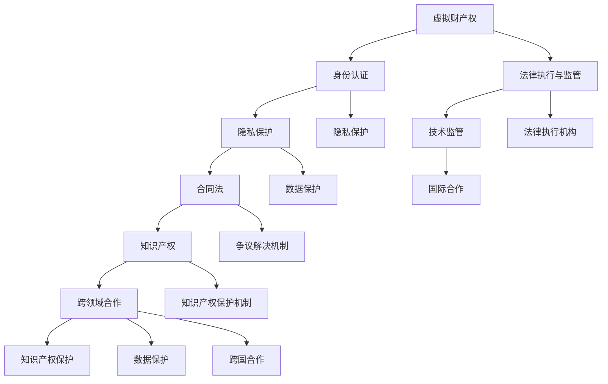

                 

### 1. 背景介绍

在当今时代，虚拟世界的发展已经达到了前所未有的高度。从早期的文字聊天室到今天的虚拟现实（VR）和增强现实（AR）技术，数字空间逐渐成为了人们交流、娱乐、学习和工作的另一个重要领域。这其中，元宇宙（Metaverse）的概念尤为引人注目。元宇宙不仅是一个虚拟的空间，更是一个融合了多种技术和应用的综合体，包括虚拟现实、区块链、物联网等。在这个虚拟世界中，用户可以创建和体验各种各样的虚拟事物，从而形成一个互动性强、沉浸感高的虚拟社会。

随着元宇宙的不断发展，法律体系的重要性也逐渐凸显。在现实世界中，法律作为维护社会秩序、保护公民权益的重要工具，同样也适用于虚拟世界。然而，元宇宙的法律体系具有其独特的复杂性，这主要源于以下几个方面：

1. **虚拟财产权**：在元宇宙中，用户可以拥有和交易虚拟物品，如虚拟房产、数字艺术品等。如何界定这些虚拟财产的权利，如何保护用户的合法权益，成为了一个亟待解决的问题。

2. **身份认证**：元宇宙中的用户身份可能不是单一的，而是由多个虚拟角色组成的。如何确保这些虚拟身份的真实性和安全性，避免欺诈行为，是元宇宙法律体系必须考虑的问题。

3. **隐私保护**：在元宇宙中，用户的个人信息和行为数据可能被大量收集。如何保护这些数据不被滥用，保障用户的隐私权，是元宇宙法律体系需要关注的核心问题。

4. **争议解决**：元宇宙中的法律纠纷与传统法律体系相比，具有更大的复杂性。如何有效地解决这些纠纷，确保公平公正，是元宇宙法律体系面临的一大挑战。

本文将深入探讨元宇宙法律体系的构建，从核心概念、算法原理、数学模型、实际应用等多个方面，提供一个全面的技术分析。文章结构如下：

- **第2章**：核心概念与联系。我们将介绍元宇宙法律体系中的核心概念，并通过Mermaid流程图展示它们之间的联系。
- **第3章**：核心算法原理与具体操作步骤。这一章节将详细解释元宇宙法律体系的核心算法原理，并提供具体的操作步骤。
- **第4章**：数学模型和公式。我们将使用LaTeX格式展示元宇宙法律体系中的关键数学模型和公式，并进行详细讲解和举例说明。
- **第5章**：项目实践。通过一个具体的代码实例，我们将展示如何在实际项目中应用元宇宙法律体系。
- **第6章**：实际应用场景。我们将探讨元宇宙法律体系在不同领域中的应用，并分析其优势和挑战。
- **第7章**：工具和资源推荐。这一章节将推荐一些学习资源和开发工具，帮助读者更好地了解和掌握元宇宙法律体系。
- **第8章**：总结。我们将总结本文的主要内容，并探讨元宇宙法律体系的未来发展趋势与挑战。
- **第9章**：附录。我们将回答一些常见问题，并提供扩展阅读和参考资料。

通过这篇文章，我们希望读者能够对元宇宙法律体系有一个全面、深入的理解，并为未来的虚拟世界提供一些有价值的思考和借鉴。

#### 1.1 虚拟世界的崛起

随着互联网技术的飞速发展，虚拟世界逐渐从科幻小说的构想变成了现实。最早期的虚拟世界可以追溯到20世纪80年代，当时的文字MUD（Multi-User Dungeon）游戏为玩家提供了简单的虚拟互动体验。然而，这些早期的虚拟世界相对简单，缺乏丰富的交互性和沉浸感。

进入21世纪，随着图形处理能力和网络带宽的提升，虚拟现实（VR）和增强现实（AR）技术开始蓬勃发展。VR技术通过头戴显示器（HMD）和追踪设备，为用户提供了身临其境的虚拟体验；而AR技术则通过增强现实眼镜或手机摄像头，将虚拟信息叠加到现实世界中。这些技术的进步为虚拟世界的构建提供了强大的支持。

与此同时，区块链技术的发展也为虚拟世界带来了新的可能性。区块链的去中心化特性、不可篡改的记录和智能合约功能，为虚拟财产权、身份认证和数据隐私提供了可靠的技术保障。这些技术不仅推动了元宇宙的兴起，也为构建元宇宙的法律体系奠定了基础。

元宇宙的概念最早由美国作家尼尔·斯蒂芬森（Neal Stephenson）在1992年的小说《雪崩》（Snow Crash）中提出。斯蒂芬森描述了一个由虚拟现实技术构建的全球网络，用户可以在其中自由探索和互动。随着技术的发展和人们对于虚拟世界的需求不断增加，元宇宙逐渐成为了人们关注的焦点。

元宇宙不仅仅是一个虚拟空间，更是一个融合了多种技术和应用的综合体。它包括了虚拟现实、增强现实、区块链、物联网、人工智能等多个领域。用户可以在元宇宙中创建和体验各种虚拟事物，如虚拟角色、虚拟房产、虚拟商品等。同时，元宇宙也为企业和机构提供了新的商业模式和运营平台。

在元宇宙中，用户可以以虚拟角色（Avatar）的身份参与各种活动，如社交互动、娱乐、教育、工作等。这些虚拟角色不仅代表了用户的身份，还可以具有不同的外观和属性，从而增加了用户的个性化和互动性。此外，元宇宙中的虚拟商品和虚拟财产也具有重要的经济价值，用户可以通过购买、交易和创造这些虚拟物品来获取经济利益。

元宇宙的发展不仅改变了人们的娱乐和生活方式，也为社会和经济带来了深远的影响。在教育领域，元宇宙提供了新的教学模式和互动体验，使得学习更加生动有趣；在医疗领域，元宇宙可以用于远程诊断和治疗，提高了医疗服务的效率和便利性；在商业领域，元宇宙为企业提供了新的营销渠道和商业模式，促进了电子商务的发展。

总之，虚拟世界的崛起和元宇宙的兴起为人们带来了全新的体验和机会。随着技术的不断进步和应用场景的不断扩大，虚拟世界将继续发展和变革，成为未来社会的重要部分。而在这个虚拟世界中，法律体系的作用不可或缺，它将为用户和社会提供秩序和保障。

#### 1.2 元宇宙的概念和特点

元宇宙（Metaverse）是一个虚拟的、三维的、沉浸式的数字世界，它通过虚拟现实（VR）、增强现实（AR）和其他数字技术，将用户连接到一个可以自由探索、互动和创造的虚拟空间。元宇宙的特点包括以下几点：

1. **沉浸式体验**：元宇宙通过VR和AR技术，为用户提供了一种沉浸式的体验。用户可以佩戴VR头戴设备或使用AR眼镜，在虚拟空间中自由移动，与虚拟角色和其他用户进行互动。这种沉浸感使得用户在元宇宙中可以感受到如同现实世界的存在和互动。

2. **多用户互动**：元宇宙支持多用户同时在线，用户可以创建自己的虚拟角色（Avatar），并通过这些角色在虚拟世界中与其他用户进行互动。这种多用户互动不仅增加了元宇宙的社交属性，也为用户提供了丰富的社交体验和合作机会。

3. **虚拟经济系统**：元宇宙中存在着一个完整的虚拟经济系统，用户可以通过购买、交易和创造虚拟商品和财产来获取经济利益。虚拟商品包括虚拟房地产、虚拟服装、虚拟道具等，这些商品在元宇宙中具有真实的价值，用户可以通过货币或虚拟货币进行交易。

4. **去中心化架构**：元宇宙的基础架构通常采用去中心化的设计，这意味着它不是由某个中心机构控制，而是由多个节点共同维护和运行。这种去中心化的架构不仅提高了元宇宙的透明度和安全性，也增强了其抗攻击能力和可扩展性。

5. **多样化应用场景**：元宇宙不仅是一个虚拟的社交空间，还可以用于教育、医疗、娱乐、商业等多个领域。在教育领域，元宇宙提供了虚拟课堂和实验环境，使得学习更加生动有趣；在医疗领域，元宇宙可以用于远程诊断和治疗，提高了医疗服务的效率和便利性；在娱乐领域，元宇宙提供了虚拟游戏、演唱会等多样化的娱乐体验。

6. **人工智能支持**：元宇宙中的许多功能和应用都依赖于人工智能技术。例如，虚拟角色可以通过机器学习技术不断学习和进化，以提供更加自然和丰富的互动体验。此外，人工智能还可以用于数据分析、智能推荐等应用，提高元宇宙的用户体验和运营效率。

7. **跨平台互操作性**：元宇宙的一个显著特点是跨平台的互操作性。用户可以在不同的设备和平台上访问元宇宙，如PC、智能手机、VR头盔等。这种跨平台的互操作性使得元宇宙的应用更加广泛和便捷。

8. **生态系统的构建**：元宇宙不仅仅是一个单一的产品或服务，而是一个由多个参与者共同构建的生态系统。在这个生态系统中，开发商、内容创作者、用户等不同的角色共同参与，共同推动元宇宙的发展。

9. **社会责任与道德规范**：随着元宇宙的发展，其社会影响和责任也逐渐凸显。元宇宙需要构建相应的法律和道德规范，以保护用户的权益，维护社会的公平正义。这包括虚拟财产权、隐私保护、争议解决等方面的规定。

10. **经济价值**：元宇宙的虚拟经济系统为参与者提供了巨大的经济价值。用户可以通过虚拟交易、数字艺术品拍卖等方式获得收益，同时，元宇宙也为企业提供了新的商业模式和营销渠道。

综上所述，元宇宙是一个具有丰富特点和应用前景的虚拟世界。它不仅改变了人们的娱乐和生活方式，也为社会和经济带来了新的机遇和挑战。随着技术的不断进步和应用的深入，元宇宙将继续发展和变革，成为未来社会的重要部分。

#### 1.3 法律体系在元宇宙中的重要性

在现实世界中，法律体系作为维护社会秩序、保护公民权益的重要工具，同样在元宇宙中发挥着至关重要的作用。元宇宙的法律体系不仅关乎用户的权益保护，还直接影响到整个虚拟世界的稳定和可持续发展。以下是法律体系在元宇宙中的几个关键重要性：

1. **虚拟财产权保护**：在元宇宙中，用户可以创建、拥有和交易各种虚拟物品，如虚拟房产、数字艺术品、虚拟货币等。这些虚拟财产在法律体系中的定义和保护直接关系到用户的财产权益。如果没有明确的法律规定，用户在元宇宙中的财产权可能会受到侵害，从而导致信任危机和经济纠纷。

2. **身份认证与隐私保护**：元宇宙中的用户身份可能是虚拟的，但它们同样需要真实可靠的认证。身份认证不仅关系到用户在元宇宙中的权限和责任，也涉及到用户的隐私保护。如果没有有效的法律框架，用户的信息可能会被滥用或泄露，从而引发隐私侵犯和身份欺诈等问题。

3. **争议解决机制**：元宇宙中的法律纠纷与传统法律体系相比，具有更大的复杂性。这些纠纷可能涉及虚拟财产、知识产权、合同执行等多个方面。如果没有一个明确的争议解决机制，用户的合法权益可能会受到损害，从而影响元宇宙的稳定和用户信任。

4. **社会秩序维护**：法律体系对于维护社会秩序具有至关重要的作用。在元宇宙中，法律规则可以帮助遏制犯罪行为，如欺诈、盗窃、骚扰等。通过制定和执行相应的法律规则，元宇宙可以构建一个安全、有序、公平的虚拟社会，从而提升用户的整体体验。

5. **法律法规的适应性**：随着元宇宙技术的不断发展和应用场景的多样化，现有的法律法规可能需要不断更新和调整，以适应新的情况。例如，虚拟财产的法律地位、数字身份的认证方式、智能合约的合法性等问题，都需要通过法律框架来明确和规范。

6. **经济活动的规范**：元宇宙中的经济活动，如虚拟商品的交易、虚拟货币的发行和使用等，都需要有明确的法律规范。这些规范不仅有助于保护用户的权益，还可以促进虚拟经济的发展，提高市场的透明度和公平性。

7. **跨国合作的推动**：元宇宙是一个全球性的虚拟空间，不同国家和地区在法律体系和文化观念上可能存在差异。通过构建一个统一的法律框架，可以促进不同国家和地区在元宇宙中的合作与交流，推动全球虚拟经济的融合发展。

8. **道德规范与伦理指导**：法律体系不仅规定了用户的行为规范，还承担了道德和伦理的指导作用。在元宇宙中，法律规则需要引导用户遵守基本的道德准则，如尊重他人、保护隐私、维护公共利益等。这有助于构建一个积极、健康的虚拟社区。

综上所述，元宇宙的法律体系对于维护用户权益、保障虚拟世界的稳定和可持续发展具有重要意义。随着元宇宙技术的不断进步和应用场景的扩大，法律体系需要不断创新和完善，以适应新的挑战和需求。

#### 1.4 元宇宙法律体系的构建原则

构建一个有效、公正、可持续的元宇宙法律体系是一项复杂的任务，需要遵循一系列原则和框架。以下是构建元宇宙法律体系的主要原则：

1. **法律的一致性与可预测性**：法律的一致性是指在不同场景和情况下，法律规则应保持一致，以避免不确定性。可预测性则要求法律规则明确、清晰，使得用户能够预知其行为可能带来的后果。这对于构建信任和稳定的虚拟社会至关重要。

2. **透明性**：元宇宙的法律体系应该具有高度的透明性，法律规则和程序应向所有用户公开。这不仅有助于提高法律体系的公正性，还可以增强用户的信任感和参与度。

3. **灵活性**：元宇宙的法律体系需要具备一定的灵活性，以适应不断变化的技术和业务需求。例如，随着新技术的出现，法律规则可能需要更新和调整。灵活性还体现在能够适应不同国家和地区之间的法律差异。

4. **去中心化**：元宇宙的法律体系应该采用去中心化的架构，避免由单一机构或组织垄断法律规则和执行权力。这种去中心化的设计有助于提高系统的透明度和抗攻击能力。

5. **跨领域协作**：元宇宙的法律体系需要涉及多个领域，如知识产权、数据保护、合同法等。因此，构建过程中需要不同领域的专家和利益相关者共同参与，以确保法律规则的全面性和适用性。

6. **用户权益保护**：在构建元宇宙法律体系时，必须将用户权益放在首位。法律规则应明确保护用户的隐私权、财产权和其他基本权益，防止用户在虚拟世界中的权益受到侵害。

7. **社会道德与伦理**：法律体系不仅需要保护用户的权益，还应具备道德和伦理的指导作用。例如，法律应禁止欺诈、侵权、骚扰等不道德行为，维护一个健康、积极的虚拟社区。

8. **国际合作**：元宇宙是一个全球性的虚拟空间，不同国家和地区的法律体系可能存在差异。因此，构建元宇宙法律体系需要国际合作，制定统一的规则和标准，促进全球虚拟经济的健康发展。

9. **适应性**：随着元宇宙技术的不断进步和应用场景的扩大，法律体系需要具备高度的适应性，以应对新的挑战和变化。例如，新技术的出现可能需要重新评估和调整法律规则。

10. **技术中立**：法律体系在构建过程中应保持技术中立，不应偏袒某一种技术或平台。技术中立有助于确保法律体系的公正性和广泛适用性。

通过遵循上述原则，构建一个有效、公正、可持续的元宇宙法律体系，可以为用户和社会提供必要的秩序和保障，促进虚拟世界的稳定和可持续发展。

### 2. 核心概念与联系

在构建元宇宙的法律体系过程中，我们需要了解和掌握一系列核心概念，这些概念不仅构成了元宇宙法律体系的基础，也相互联系，共同作用于维护虚拟世界的秩序和公平。以下是元宇宙法律体系中的核心概念及其相互联系：

#### 2.1 虚拟财产权

虚拟财产权是元宇宙法律体系中最基础也是最重要的概念之一。它指的是用户在元宇宙中创建、拥有、控制、交易的各种虚拟物品，如虚拟房产、数字艺术品、虚拟货币等。虚拟财产权不仅涉及到用户的经济利益，也直接影响到他们在虚拟世界中的身份和地位。

在元宇宙中，虚拟财产权的确立和保护需要明确以下几个关键点：

1. **所有权的确立**：用户在元宇宙中创建的虚拟物品，应被视为其所有物。虚拟世界中的创造和交易活动应通过明确的法律规则进行保护，确保用户的权益不受侵犯。

2. **交易合法性**：虚拟财产的交易应具备法律效力，交易双方应明确其权利和义务。这不仅需要法律规则的明确，还需要技术手段的支持，如区块链技术的应用，确保交易的可追溯性和透明性。

3. **争议解决机制**：虚拟财产权纠纷的解决需要一套公正、高效的争议解决机制。这可以包括在线仲裁、调解等多种形式，确保纠纷能够及时、公正地解决。

#### 2.2 身份认证

在元宇宙中，身份认证是保障用户隐私和安全的基础。身份认证不仅涉及到用户在虚拟世界中的身份验证，还包括对用户行为的监督和管理。

1. **虚拟身份的建立**：用户在元宇宙中创建的虚拟角色（Avatar）应具备独特的身份标识。这种身份标识可以是数字化的身份证书或智能合约，确保每个虚拟角色都具有唯一性和不可篡改性。

2. **多因素认证**：为了提高安全性，元宇宙的身份认证应采用多因素认证机制，包括密码、生物识别、硬件密钥等多种认证方式，防止欺诈和未经授权的访问。

3. **隐私保护**：在身份认证过程中，用户的隐私信息应得到严格保护。这需要法律规则明确隐私保护的标准和责任，同时采用先进的技术手段，如零知识证明（Zero-Knowledge Proof），确保在验证过程中不泄露用户的隐私信息。

#### 2.3 隐私保护

隐私保护是元宇宙法律体系中的一个重要环节，涉及到用户在虚拟世界中的个人信息和行为数据的收集、存储、处理和分享。

1. **数据收集与使用的限制**：法律规则应明确用户数据的收集范围和使用目的，未经用户同意不得收集和利用其个人信息。同时，应限制数据的二次利用，防止数据被滥用。

2. **数据存储与加密**：用户数据应在安全的存储环境中进行加密存储，防止数据泄露和未经授权的访问。法律规则应规定数据存储的技术标准和责任。

3. **用户知情权与控制权**：用户应有权了解其数据的收集、存储和使用情况，并有权决定其数据的分享和使用。法律规则应确保用户的知情权和控制权，并对其未授权的数据使用行为进行惩罚。

#### 2.4 合同法

合同法在元宇宙中同样具有重要地位，涉及到用户之间的交易行为和权利义务的约定。

1. **智能合约**：智能合约是一种通过区块链技术实现的自动执行合同，其条款在代码中固化，当满足特定条件时自动执行。智能合约的使用可以减少合同纠纷，提高交易效率。

2. **合同形式与效力**：元宇宙中的合同形式可以是数字化的，但法律效力需要得到认可。合同条款应明确、合法，且符合法律规定的合同形式要求。

3. **争议解决机制**：智能合约的执行过程中可能会出现争议，需要一套有效的争议解决机制。这可以包括在线仲裁、调解等，确保争议能够公正、高效地解决。

#### 2.5 知识产权

知识产权在元宇宙中同样具有重要作用，涉及虚拟财产的创造、使用和保护。

1. **版权与著作权**：在元宇宙中，虚拟作品的版权和著作权应得到保护。虚拟艺术品、虚拟文字作品的创作者应享有相应的版权和著作权。

2. **商标权与专利权**：商标和专利在元宇宙中的注册和保护也需要明确的法律规则，以防止未经授权的使用和侵权行为。

3. **知识产权保护机制**：法律体系应提供一套完整的知识产权保护机制，包括知识产权的登记、保护、争议解决等。

#### 2.6 法律执行与监管

法律执行与监管是保障元宇宙法律体系有效运行的重要环节。

1. **法律执行机构**：元宇宙应设立专门的法律执行机构，负责法律规则的执行和监督，确保法律得到有效实施。

2. **技术监管**：技术监管是元宇宙法律体系的重要组成部分，包括对区块链、智能合约等技术的监管，确保技术手段符合法律要求。

3. **国际合作**：元宇宙是一个全球性的虚拟空间，法律执行和监管需要国际合作，共同制定和执行法律规则。

#### 2.7 跨领域合作

元宇宙法律体系的构建需要跨领域合作，涉及多个领域的法律规则和技术标准。

1. **知识产权保护**：元宇宙中的知识产权保护需要与现有的知识产权法律体系进行衔接和协调，共同制定适用于虚拟世界的知识产权规则。

2. **数据保护**：元宇宙中的数据保护需要与数据保护法律体系相结合，共同制定适用于虚拟世界的数据保护规则。

3. **跨国合作**：元宇宙是一个全球性的虚拟空间，法律体系的构建需要国际合作，共同制定适用于全球虚拟空间的法律规则。

通过以上核心概念的介绍和相互联系的分析，我们可以看到，元宇宙法律体系是一个复杂而多元的系统，需要多方面的法律规则和技术手段共同作用，才能保障虚拟世界的稳定和可持续发展。下面，我们将通过Mermaid流程图进一步展示这些核心概念之间的联系。



通过这张Mermaid流程图，我们可以清晰地看到元宇宙法律体系中各个核心概念之间的相互关系和作用。这些概念共同构成了一个复杂的法律体系，为元宇宙的稳定和可持续发展提供了坚实的法律保障。

### 2.1 虚拟财产权的法律问题与解决方案

在元宇宙中，虚拟财产权的问题尤为突出，因为用户在虚拟世界中创建和交易的虚拟物品与实际世界的财产权有显著差异。以下将详细探讨虚拟财产权的法律问题，并提出相应的解决方案。

#### 2.1.1 虚拟财产权的基本概念

虚拟财产权指的是用户在元宇宙中创建、拥有、控制并能够进行交易的虚拟物品所对应的权利。这些虚拟物品可以是虚拟货币、虚拟房产、虚拟服装、数字艺术品等。虚拟财产权的确立不仅涉及到法律层面的定义，还涉及到技术层面的实现。

#### 2.1.2 法律问题

1. **所有权问题**：在元宇宙中，虚拟物品的所有权确立相对复杂。由于虚拟世界缺乏现实世界中的物理属性，传统的法律规则难以直接适用。用户如何证明其对虚拟物品的合法所有权，成为了一个亟待解决的问题。

2. **交易合法性**：元宇宙中的虚拟物品交易需要具备法律效力。然而，由于虚拟财产的特殊性，如何确保交易合法、透明且可追溯，是法律体系需要面对的挑战。

3. **纠纷解决**：虚拟财产权纠纷的处理相对传统财产权纠纷更加复杂。纠纷可能涉及不同国家和地区的法律体系，如何建立一个公正、高效的争议解决机制，是法律体系需要考虑的问题。

4. **知识产权保护**：虚拟财产的创造和使用过程中，可能会涉及到知识产权的问题。例如，虚拟服装的设计、虚拟游戏中的角色等，如何保护这些知识产权，避免侵权行为，是法律体系需要关注的问题。

5. **跨国交易**：元宇宙是一个全球性的虚拟空间，虚拟财产的交易也往往跨越国界。不同国家和地区的法律体系可能存在差异，如何确保跨国交易的合法性，是法律体系需要解决的问题。

#### 2.1.3 法律解决方案

1. **明确虚拟财产的法律地位**：法律体系应明确虚拟财产的法律地位，将其作为一类特殊的财产权进行保护。可以通过立法明确虚拟财产的权属关系，确保用户在虚拟世界中的财产权益得到法律保障。

2. **建立虚拟财产交易的法律框架**：法律体系应建立一套完整的虚拟财产交易法律框架，包括交易合同的制定、交易流程的规范、交易合法性的保障等。通过明确交易规则，确保虚拟财产交易的法律效力。

3. **设立虚拟财产权登记制度**：可以借鉴现实世界中的财产登记制度，在元宇宙中建立虚拟财产权登记制度。通过登记制度，用户可以对其虚拟财产进行注册和确权，确保其所有权的合法性和可追溯性。

4. **建立虚拟财产争议解决机制**：可以设立专门的虚拟财产争议解决机构，提供在线仲裁、调解等服务。通过建立高效的争议解决机制，确保虚拟财产纠纷能够得到及时、公正的解决。

5. **保护知识产权**：法律体系应明确虚拟财产中的知识产权保护规则，包括版权、商标权、专利权等。可以通过制定专门的保护措施，防止未经授权的虚拟物品复制、传播和使用。

6. **国际合作与协调**：由于元宇宙的全球性，不同国家和地区的法律体系可能存在差异。因此，需要通过国际合作，制定统一的虚拟财产法律规则，确保跨国交易的合法性。

7. **技术手段的支持**：区块链技术可以在虚拟财产权保护中发挥重要作用。通过区块链技术，可以实现虚拟财产的透明记录和不可篡改，提高交易的安全性和可信度。

通过以上措施，可以有效解决元宇宙中虚拟财产权的问题，确保用户的财产权益得到法律保障，促进虚拟经济的健康发展。

### 2.2 身份认证在元宇宙法律体系中的作用与挑战

在元宇宙中，身份认证是保障用户隐私和安全的关键环节。一个可靠的身份认证系统不仅能够确保用户在虚拟世界中的操作具有合法性和可信度，还能有效防止欺诈、侵权等违法行为的出现。以下是身份认证在元宇宙法律体系中的作用及其面临的挑战：

#### 2.2.1 身份认证的基本概念

身份认证是指通过验证用户身份，确保其合法性和可信度的一系列技术和方法。在元宇宙中，身份认证通常包括用户注册、登录、权限验证等步骤，目的是确认用户的真实身份，防止未经授权的访问和操作。

#### 2.2.2 身份认证在元宇宙法律体系中的作用

1. **保障用户隐私**：身份认证系统可以帮助保护用户的隐私信息，防止未经授权的用户访问和获取敏感数据。在元宇宙中，用户的身份信息、行为记录等数据可能被大量收集，通过身份认证技术，可以确保这些数据不被滥用。

2. **防止欺诈行为**：身份认证系统能够有效识别用户身份，防止欺诈行为的发生。例如，在元宇宙中的交易过程中，通过验证买方和卖方的身份，可以防止诈骗、盗刷等犯罪活动。

3. **确保交易合法性**：在元宇宙中，身份认证是交易合法性的基础。只有通过身份认证验证的用户，才能参与虚拟财产的交易和其他相关活动，确保交易过程合法、透明。

4. **增强系统安全性**：通过多因素认证技术，如密码、生物识别、硬件密钥等，可以显著提高系统的安全性，防止用户账户被盗用。

#### 2.2.3 挑战与解决方案

1. **身份伪造问题**：在元宇宙中，身份伪造是一种常见的安全威胁。黑客可以通过各种手段，如伪造身份证明、使用恶意软件等，伪装成合法用户进行非法操作。为了防止身份伪造，可以采用以下措施：

   - **多因素认证**：除了传统的密码认证，还可以引入生物识别技术，如指纹识别、面部识别等，提高身份认证的复杂度和安全性。
   - **动态验证**：在用户登录或进行关键操作时，可以采用动态验证方式，如发送手机验证码、邮件验证链接等，确保用户身份的真实性。

2. **隐私泄露问题**：身份认证过程中可能会涉及用户的敏感信息，如生物特征、密码等，如果这些信息被泄露，将严重威胁用户的隐私和安全。为了防止隐私泄露，可以采取以下措施：

   - **数据加密**：对用户身份认证过程中涉及的数据进行加密处理，确保数据在传输和存储过程中的安全性。
   - **隐私保护技术**：采用零知识证明（Zero-Knowledge Proof）等隐私保护技术，在验证用户身份的同时，不泄露用户的敏感信息。

3. **跨国认证问题**：元宇宙是一个全球性的虚拟空间，不同国家和地区的身份认证标准和法律法规可能存在差异。为了解决跨国认证问题，可以采取以下措施：

   - **国际合作**：通过国际合作，制定统一的身份认证标准和规范，确保不同国家和地区之间的认证系统能够互认互信。
   - **本地化适配**：在制定国际标准的基础上，根据不同国家和地区的法律法规和用户习惯，进行本地化适配，确保身份认证系统的适用性和可靠性。

4. **用户便利性**：身份认证系统需要平衡安全性和用户便利性。过于复杂的认证流程可能会降低用户体验，影响用户留存率。为了提高用户便利性，可以采取以下措施：

   - **简化认证流程**：优化认证流程，减少不必要的步骤，提高认证效率。
   - **一键登录**：通过与第三方身份认证平台合作，实现一键登录功能，降低用户操作成本。

5. **技术更新与维护**：身份认证系统需要不断更新和升级，以应对新的安全威胁和技术挑战。为了确保系统的长期稳定运行，可以采取以下措施：

   - **定期评估与审计**：定期对身份认证系统进行安全评估和审计，确保系统符合最新的安全标准。
   - **持续技术投入**：投入足够的研发资源，持续优化和提升身份认证技术的性能和安全性。

通过以上措施，可以有效地解决身份认证在元宇宙法律体系中面临的挑战，确保用户身份认证的安全性和可靠性，为元宇宙的稳定和可持续发展提供坚实的保障。

### 2.3 隐私保护：核心问题与法律框架

在元宇宙中，隐私保护是一个至关重要的议题，这不仅关系到用户的个人信息安全，也影响到整个虚拟社会的信任和稳定性。元宇宙中涉及到的隐私问题包括个人数据的收集、存储、处理和分享等方面。以下将探讨元宇宙隐私保护中的核心问题，并提出相应的法律框架和解决方案。

#### 2.3.1 元宇宙隐私保护的核心问题

1. **数据收集的广泛性**：元宇宙中的数据收集范围非常广泛，包括用户的基本信息、行为记录、位置信息、交易记录等。这些数据的收集不仅涉及到用户隐私，也可能对用户造成潜在的安全风险。

2. **数据泄露的风险**：由于元宇宙中的数据存储和处理方式可能涉及多个平台和服务器，数据泄露的风险较高。一旦发生数据泄露，用户的隐私信息可能会被不法分子利用，导致严重后果。

3. **隐私滥用**：在元宇宙中，用户的个人信息可能被不当使用，例如进行广告定向、非法交易等。这种隐私滥用行为不仅侵犯了用户的权益，也可能导致用户对元宇宙的信任度降低。

4. **数据跨境传输**：元宇宙是一个全球性的虚拟空间，数据的跨境传输在所难免。然而，不同国家和地区在数据保护法规上可能存在差异，这增加了数据隐私保护的法律风险。

5. **用户控制权的缺失**：在元宇宙中，用户对其个人数据的控制权往往较弱。用户可能难以了解其数据的收集和使用情况，也无法有效控制其数据的共享和使用。

#### 2.3.2 法律框架与解决方案

1. **明确隐私保护的法律地位**：法律体系应明确元宇宙中隐私保护的法律地位，将其作为一项基本人权进行保护。可以通过立法明确隐私权的定义、范围和保护措施，为用户隐私保护提供法律依据。

2. **数据收集与使用的限制**：法律应明确数据收集的目的、范围和使用方式，限制数据的不当收集和使用。例如，规定只有在用户明确同意的情况下，才能收集和处理其个人数据。

3. **数据加密与存储**：法律应要求对用户数据进行加密存储，确保数据在存储和传输过程中的安全性。同时，应制定严格的数据存储规定，防止数据被未授权访问。

4. **用户知情权与控制权**：法律应保障用户的知情权和控制权，用户有权了解其数据的收集、存储和使用情况，并有权决定其数据的共享和使用。可以设立用户数据隐私权限管理界面，方便用户进行数据控制。

5. **数据泄露的应急处理**：法律应规定数据泄露的应急处理程序，包括数据泄露的报告、调查和处理措施。同时，应明确责任方的责任，确保在数据泄露事件中，用户的权益得到有效保护。

6. **跨国数据保护合作**：法律应推动国际间的数据保护合作，制定统一的跨国数据保护标准和法规，确保跨境数据传输的法律合规性。

7. **技术手段的支持**：可以采用先进的技术手段，如零知识证明（Zero-Knowledge Proof）、多方安全计算（MPC）等，提高元宇宙中的隐私保护水平。这些技术可以在不泄露用户隐私的情况下，验证用户身份和交易合法性。

通过以上法律框架和解决方案，可以有效保护元宇宙中的用户隐私，提高用户对虚拟世界的信任感和安全感，促进元宇宙的稳定和可持续发展。

### 2.4 合同法在元宇宙法律体系中的适用性与挑战

合同法是元宇宙法律体系中的一个核心组成部分，它涉及用户在虚拟世界中的各种交易行为和权利义务的约定。由于元宇宙的特殊性和复杂性，传统合同法在适用过程中面临诸多挑战。以下将详细探讨合同法在元宇宙法律体系中的适用性问题，并提出相应的解决方案。

#### 2.4.1 智能合约

智能合约是一种通过区块链技术实现的自动执行合同，其条款在代码中固化，当满足特定条件时自动执行。智能合约的出现为元宇宙中的交易提供了高效、透明和不可篡改的解决方案。

1. **优势**：

   - **高效性**：智能合约可以在短时间内自动执行，减少了传统合同执行过程中的时间和成本。
   - **透明性**：智能合约的条款和执行过程是公开透明的，用户可以随时查看和验证。
   - **不可篡改性**：智能合约一旦执行，其条款和执行结果不可更改，保证了交易的公正性和可信度。

2. **挑战**：

   - **代码漏洞**：智能合约的代码一旦存在漏洞，可能导致恶意攻击和财产损失。例如，2016年的DAO（Decentralized Autonomous Organization）事件，就是因为智能合约漏洞导致约3600万美元的数字货币被盗。
   - **法律适用性**：智能合约的法律地位和适用性尚不明确，不同国家和地区的法律体系可能对智能合约有不同的看法和规定。

3. **解决方案**：

   - **代码审计**：在智能合约发布前，应进行严格的安全审计，确保其代码没有漏洞。可以通过聘请专业的安全团队进行代码审计，提高智能合约的安全性和可靠性。
   - **法律明确化**：应通过立法明确智能合约的法律地位和适用性，制定统一的智能合约规范，确保其在不同法律体系中的合法性。
   - **多重签名**：在智能合约执行过程中，可以采用多重签名机制，确保交易的安全性。例如，在数字货币交易中，可以采用多重签名钱包，需要多个密钥共同验证，从而降低安全风险。

#### 2.4.2 虚拟财产交易

元宇宙中的虚拟财产交易具有高度复杂性，涉及多种虚拟货币、虚拟商品和数字艺术品等。传统合同法在虚拟财产交易中的应用面临以下挑战：

1. **交易合法性问题**：虚拟财产的交易合法性在不同国家和地区存在差异，如何确保虚拟财产交易的法律效力，是法律体系需要解决的问题。

2. **交易风险**：虚拟财产的价值波动较大，且可能受到市场操纵和恶意攻击的影响，如何保障交易的安全性和稳定性，是法律体系需要考虑的问题。

3. **争议解决**：虚拟财产交易可能引发的纠纷涉及多个方面，如财产权归属、交易合法性等，如何建立高效的争议解决机制，是法律体系需要解决的问题。

4. **解决方案**：

   - **跨国合作**：通过国际合作，制定统一的虚拟财产交易法律规范，确保跨国交易的合法性。
   - **交易平台监管**：对虚拟财产交易平台进行严格监管，确保交易平台的合规性和安全性，降低交易风险。
   - **智能合约应用**：在虚拟财产交易中广泛应用智能合约，提高交易过程的透明性和可信度。
   - **争议解决机制**：设立专门的虚拟财产交易争议解决机构，提供在线仲裁、调解等服务，确保纠纷能够及时、公正地解决。

通过以上解决方案，可以有效应对元宇宙中合同法的适用性挑战，保障用户在虚拟世界中的交易权益，促进虚拟经济的健康发展。

### 2.5 知识产权保护：元宇宙中的挑战与策略

知识产权保护在元宇宙中具有至关重要的地位，因为元宇宙中的虚拟财产、虚拟角色、虚拟游戏等均涉及知识产权问题。然而，元宇宙的特殊性和复杂性给知识产权保护带来了诸多挑战。以下将详细探讨元宇宙中知识产权保护的挑战，并提出相应的策略。

#### 2.5.1 元宇宙知识产权保护的挑战

1. **虚拟财产的版权保护**：在元宇宙中，虚拟财产如虚拟服装、虚拟艺术品等，可能涉及版权问题。如何有效保护这些虚拟财产的版权，防止未经授权的复制、传播和使用，是知识产权保护的重要挑战。

2. **虚拟角色的知识产权**：元宇宙中的虚拟角色不仅是用户的化身，也可能具有独特的创意和设计。如何界定虚拟角色的知识产权归属，保护虚拟角色的创作者权益，是一个复杂的问题。

3. **虚拟游戏的知识产权**：元宇宙中的虚拟游戏可能涉及多种知识产权，如游戏代码、游戏角色、游戏音乐等。如何确保这些知识产权得到有效保护，防止侵权行为，是知识产权保护的另一个重要挑战。

4. **跨国知识产权保护**：由于元宇宙是一个全球性的虚拟空间，不同国家和地区的知识产权法律可能存在差异。如何协调和统一不同国家和地区的知识产权保护规则，是一个复杂的国际法律问题。

5. **技术手段的限制**：现有的知识产权保护技术，如数字版权管理（DRM）等，在元宇宙中可能受到限制。如何在技术层面提供有效的知识产权保护手段，是知识产权保护需要解决的难题。

#### 2.5.2 知识产权保护的策略

1. **明确知识产权归属**：通过立法明确元宇宙中虚拟财产、虚拟角色、虚拟游戏的知识产权归属规则，确保创作者的权益得到保护。例如，可以制定专门的虚拟财产知识产权法，明确虚拟财产的版权、商标权和专利权等。

2. **加强版权管理**：在元宇宙中，可以采用数字版权管理（DRM）等技术手段，对虚拟财产进行版权保护。例如，通过加密技术确保虚拟财产的不可篡改性，通过权限管理确保虚拟财产的合法使用。

3. **建立知识产权交易平台**：可以建立专门的知识产权交易平台，方便创作者和用户进行知识产权的交易和登记。通过平台化管理，提高知识产权保护的可操作性和效率。

4. **国际合作与协调**：通过国际合作，制定统一的知识产权保护标准和规则，确保不同国家和地区之间的知识产权保护协调一致。例如，可以设立国际知识产权保护机构，提供跨国知识产权纠纷解决服务。

5. **技术支持**：可以采用区块链技术等先进技术手段，提供知识产权保护的技术支持。例如，通过区块链技术实现知识产权的透明记录和不可篡改，确保知识产权的保护效果。

6. **知识产权保护意识教育**：通过开展知识产权保护意识教育，提高用户和创作者的知识产权保护意识，防止侵权行为的发生。可以制定相关的教育材料和培训课程，普及知识产权保护知识。

通过以上策略，可以有效应对元宇宙中知识产权保护的挑战，确保创作者的权益得到有效保护，促进元宇宙的健康发展。

### 2.6 法律执行与监管：确保元宇宙法律体系的实施

法律执行与监管是确保元宇宙法律体系有效运行的关键环节。在元宇宙中，由于虚拟世界的特性，法律执行与监管面临着与传统法律体系完全不同的挑战。以下是关于元宇宙法律执行与监管的探讨，包括法律执行机构的作用、技术监管的重要性以及国际合作与协调的重要性。

#### 2.6.1 法律执行机构的作用

在元宇宙中，建立一个专门的法律执行机构至关重要。这个机构应负责执行和监督元宇宙中的法律规则，确保用户在虚拟世界中的行为符合法律要求。法律执行机构的作用主要体现在以下几个方面：

1. **执法与司法**：法律执行机构应具备执法和司法能力，能够对违反元宇宙法律规则的行为进行调查、取证、裁决和处罚。通过在线仲裁、调解等方式，快速解决虚拟世界中的纠纷，维护虚拟社会的秩序。

2. **监管与审计**：法律执行机构应对元宇宙中的关键领域，如虚拟财产交易、身份认证、数据保护等，进行定期审计和监督。确保这些领域遵守相关法律和规定，防止违法行为的发生。

3. **法律教育与宣传**：法律执行机构还应承担法律教育与宣传的职责，提高用户对元宇宙法律体系的认知和遵守程度。通过发布法律指南、举办在线讲座、开设法律课程等方式，增强用户的法律意识和责任感。

4. **国际合作与协调**：法律执行机构需要与其他国家和地区的法律执行机构进行合作，共同处理跨国虚拟世界法律案件。通过建立国际合作机制，统一法律标准，提高跨国执法的效率和效果。

#### 2.6.2 技术监管的重要性

技术监管是元宇宙法律体系中的核心组成部分，它通过运用先进的技术手段，确保法律规则的执行和监管的有效性。以下是技术监管在元宇宙中的重要性：

1. **区块链技术**：区块链技术具有不可篡改、透明记录等特点，可以用于法律执行和监管。例如，通过区块链技术记录用户的行为和交易，确保数据的真实性和可追溯性。

2. **智能合约**：智能合约是一种自动执行的合同，通过将其嵌入到法律执行中，可以确保法律规则的自动化执行。例如，在虚拟财产交易中，智能合约可以确保交易的合法性和安全性。

3. **大数据分析**：通过大数据分析技术，可以对元宇宙中的大量数据进行挖掘和分析，发现潜在的违法行为。例如，通过分析虚拟财产交易数据，可以发现异常交易行为，及时采取措施防止欺诈和洗钱等犯罪活动。

4. **人工智能**：人工智能技术可以在法律执行和监管中发挥重要作用，例如，通过自然语言处理技术，可以自动识别和翻译不同语言的法律文件，提高跨国执法的效率。

5. **加密技术**：加密技术可以用于保护用户的隐私和信息安全，防止数据泄露和未经授权的访问。通过加密技术，可以确保用户在虚拟世界中的行为和交易隐私得到有效保护。

#### 2.6.3 国际合作与协调

由于元宇宙是一个全球性的虚拟空间，不同国家和地区在法律体系和监管机制上可能存在差异。因此，国际合作与协调在元宇宙法律执行与监管中至关重要。以下是国际合作与协调的重要性：

1. **制定统一规则**：通过国际合作，制定统一的元宇宙法律规则和标准，确保不同国家和地区之间的法律体系协调一致。这有助于提高法律的透明度和可预测性，减少法律冲突和不确定性。

2. **跨国执法合作**：通过建立跨国执法合作机制，不同国家和地区的法律执行机构可以共同处理跨国虚拟世界法律案件。例如，通过建立跨国执法网络，实现信息的共享和资源的整合，提高执法效率和效果。

3. **技术标准互认**：通过国际合作，制定和推广技术标准，确保不同国家和地区在技术监管上的协调一致。例如，可以制定统一的区块链技术标准，确保不同国家和地区在区块链技术应用上的兼容性和互操作性。

4. **法律培训与交流**：通过国际合作，组织法律培训与交流活动，提高法律执行和监管人员的专业水平和国际视野。这有助于培养一支具备全球视野和法律专业素养的执法队伍，提高跨国执法的能力和效率。

5. **跨国法律案件协调**：在处理跨国虚拟世界法律案件时，需要不同国家和地区的法律执行机构进行协调和合作。通过建立跨国法律案件协调机制，可以确保案件处理过程的公正性和效率，提高用户的信任度。

综上所述，法律执行与监管在元宇宙中具有至关重要的作用。通过建立专门的法律执行机构，运用先进的技术手段，加强国际合作与协调，可以确保元宇宙法律体系的实施和有效运行，维护虚拟社会的秩序和安全。

### 2.7 跨领域合作与法律协调的重要性

元宇宙的法律体系不仅需要解决内部的法律问题，还需要应对跨领域合作和法律协调的挑战。随着元宇宙技术的发展和应用的扩展，跨领域合作成为必然趋势。不同领域的法律规则和技术标准可能存在差异，如何协调和整合这些规则，确保法律体系的整体一致性，是元宇宙法律体系面临的重要任务。

#### 2.7.1 跨领域合作的必要性

1. **技术创新**：元宇宙的发展离不开技术的进步，包括虚拟现实（VR）、增强现实（AR）、区块链、人工智能（AI）等。这些技术的应用不仅涉及单一领域，还跨越多个领域。因此，跨领域合作有助于技术创新和资源整合，推动元宇宙的快速发展。

2. **应用扩展**：元宇宙的应用场景丰富多样，包括社交、娱乐、教育、医疗、商业等。这些应用场景往往需要多个领域的知识和技术支持，跨领域合作能够更好地满足用户的需求，提高元宇宙的实用性和吸引力。

3. **法律协调**：不同领域的法律规则可能存在冲突和矛盾，例如，虚拟财产交易中的合同法与知识产权法的冲突，数据保护法与隐私法的协调等。通过跨领域合作，可以制定统一的法律框架和标准，确保法律体系的一致性和完整性。

4. **国际合作**：元宇宙是一个全球性的虚拟空间，不同国家和地区的法律体系和文化背景可能存在差异。跨领域合作有助于建立国际法律协调机制，确保法律体系的跨国适用性和可操作性。

#### 2.7.2 法律协调的挑战

1. **法律冲突**：不同领域的法律规则可能存在冲突，导致法律适用上的困惑和争议。例如，在虚拟财产交易中，合同法与知识产权法的冲突，如何确定适用的法律规则，是一个复杂的问题。

2. **法律标准不一致**：不同国家和地区在法律标准上可能存在差异，导致跨国交易的合法性和合规性问题。例如，数据保护法在不同国家和地区的规定可能有所不同，如何协调和统一这些标准，是法律协调面临的挑战。

3. **技术合规性**：元宇宙中的技术创新需要遵守不同领域的法律和规定，例如，人工智能技术的应用需要遵守伦理和法律规范。如何确保技术创新的合规性，避免法律风险，是法律协调的重要任务。

4. **国际合作困难**：不同国家和地区的法律执行机构和利益相关者可能存在合作障碍，例如，法律文化差异、利益冲突等。如何建立有效的国际合作机制，提高法律协调的效率和效果，是跨领域合作面临的重要挑战。

#### 2.7.3 法律协调的策略

1. **制定统一法律框架**：通过国际合作，制定统一的元宇宙法律框架，确保不同领域的法律规则协调一致。例如，可以制定统一的虚拟财产交易法、数据保护法等，为跨领域合作提供法律依据。

2. **建立跨国协调机制**：建立跨国法律协调机制，促进不同国家和地区的法律执行机构进行合作。例如，可以设立跨国法律协调机构，提供跨国法律案件的调解、仲裁和判决服务。

3. **技术合规性评估**：对元宇宙中的技术创新进行合规性评估，确保其符合不同领域的法律和规定。例如，可以设立技术合规性评估委员会，对人工智能、区块链等技术的合规性进行评估和认证。

4. **法律教育和培训**：加强法律教育和培训，提高法律执行机构和利益相关者的专业水平和国际视野。通过培训课程、研讨会等方式，提高法律人员的法律意识和协调能力。

5. **法律技术支持**：运用先进的技术手段，提供法律协调的支持。例如，通过大数据分析、人工智能等技术，提高法律协调的效率和效果。

通过以上策略，可以有效应对元宇宙跨领域合作和法律协调的挑战，确保元宇宙法律体系的一致性和完整性，促进元宇宙的健康发展。

### 3. 核心算法原理与具体操作步骤

在元宇宙法律体系的构建中，算法原理起着至关重要的作用。这些算法不仅帮助我们理解和分析元宇宙中的法律问题，还提供了具体操作步骤，确保法律体系的实施和执行。以下将详细阐述核心算法原理及其具体操作步骤。

#### 3.1 区块链算法原理

区块链技术是元宇宙法律体系的基础，它通过去中心化、不可篡改的特性，保障了数据的安全性和透明性。以下是区块链算法的基本原理：

1. **分布式存储**：区块链通过分布式存储的方式，将数据分散存储在多个节点上。每个节点都保存了一份完整的区块链数据，从而提高了数据的可靠性和抗攻击能力。

2. **哈希函数**：哈希函数是区块链算法的核心，它将输入的数据映射为一个固定长度的字符串。这种映射具有不可逆性，即无法从哈希值反推出原始数据。

3. **链式结构**：区块链中的数据通过链式结构进行连接，每个区块都包含一个时间戳、一个随机数和一个指向前一个区块的哈希值。这种结构确保了区块链数据的不可篡改性。

4. **共识机制**：共识机制是区块链中节点之间达成一致性的方法。常见的共识机制包括工作量证明（PoW）、权益证明（PoS）等。这些机制通过计算和验证确保区块链数据的正确性和一致性。

#### 3.2 具体操作步骤

1. **数据录入**：首先，将需要记录的数据（如交易记录、身份认证信息等）录入到区块链中。这些数据经过加密处理，以确保其隐私性和安全性。

2. **区块创建**：将录入的数据打包成一个区块，并为区块生成一个随机数（nonce），使得区块的哈希值满足特定条件。这一过程需要大量计算，通常由节点通过工作量证明算法进行。

3. **区块验证**：节点对新生成的区块进行验证，确保区块中的数据有效且哈希值正确。如果验证通过，区块将被添加到区块链中。

4. **链式连接**：将新验证通过的区块连接到区块链的末端，形成链式结构。每个区块都通过其哈希值与前一个区块相链接，确保区块链的完整性和不可篡改性。

5. **共识达成**：通过共识机制，确保不同节点对区块链数据的一致性。例如，在PoW机制中，节点需要解决复杂的数学难题，首先完成计算的节点将获得记账权。

6. **数据查询**：用户可以通过区块链上的节点查询特定数据，如虚拟财产交易记录、身份认证信息等。这些数据具有高度透明性和不可篡改性，确保数据的真实性和可信度。

#### 3.3 智能合约算法原理

智能合约是区块链上的自动化执行合同，其条款在代码中固化，当满足特定条件时自动执行。以下是智能合约算法的基本原理：

1. **条件触发**：智能合约通过预定义的条件触发执行，这些条件可以是时间、数据值、外部事件等。例如，一个虚拟财产交易合约可能在特定时间点自动执行。

2. **代码执行**：智能合约的代码在区块链上执行，通过编程语言（如Solidity）编写。当条件满足时，智能合约将执行相应的操作，如转移虚拟财产、记录事件等。

3. **状态更新**：智能合约执行过程中，会更新区块链上的状态，确保数据的正确性和一致性。状态更新是智能合约的核心，它保证了区块链数据的一致性。

#### 3.4 具体操作步骤

1. **合约编写**：首先，开发者使用智能合约编程语言（如Solidity）编写智能合约代码。代码中定义了合约的条款和条件，以及执行操作的具体步骤。

2. **合约部署**：将编写的智能合约部署到区块链上，通常通过一个区块链节点进行。部署过程中，合约代码和参数会被编译成字节码，并存储在区块链上。

3. **合约调用**：用户通过区块链节点调用智能合约，触发合约执行。调用过程中，用户需要提供相应的参数和权限，以确保合约的正确执行。

4. **条件判断**：智能合约根据预定义的条件进行判断，如果条件满足，合约将执行相应的操作。例如，在虚拟财产交易中，如果买家支付了虚拟货币，合约将自动转移虚拟财产给卖家。

5. **状态更新**：智能合约执行过程中，会更新区块链上的状态，确保数据的正确性和一致性。状态更新是智能合约的核心，它保证了区块链数据的一致性。

6. **结果验证**：用户可以查询智能合约的执行结果，验证合约是否按照预期执行。这种透明性和不可篡改性确保了智能合约的可信度。

通过区块链和智能合约算法原理的具体操作步骤，我们可以看到，这些算法在元宇宙法律体系中发挥着关键作用。它们不仅确保了数据的安全性和透明性，还为法律规则的执行提供了可靠的技术支持。接下来，我们将进一步探讨元宇宙法律体系中的数学模型和公式。

### 4. 数学模型和公式

在元宇宙法律体系的构建过程中，数学模型和公式起着至关重要的作用。它们不仅帮助我们理解和分析复杂的法律问题，还提供了精确的量化工具，以支持法律规则的实施和执行。以下是元宇宙法律体系中的一些关键数学模型和公式，并进行详细讲解和举例说明。

#### 4.1 零知识证明（Zero-Knowledge Proof）

零知识证明是一种加密技术，它允许一方（证明者）向另一方（验证者）证明某个陈述是真实的，而不泄露任何额外信息。在元宇宙法律体系中，零知识证明可以用于隐私保护、身份认证等场景。

**数学模型**：

零知识证明的基本数学模型包括以下几个部分：

1. **承诺（Commitment）**：证明者生成一个承诺，该承诺是关于某个陈述的加密表示。承诺是公开的，但无法从中提取出任何关于陈述的信息。

2. **证明**：证明者生成一个证明，证明其承诺对应的陈述是真实的。证明是加密的，并且是针对验证者的。

3. **验证**：验证者通过证明，验证证明者所声称的陈述是真实的，但无法从证明中提取出任何关于承诺的具体信息。

**公式**：

- **承诺生成**：`Commitment = g^x * h^y mod p`，其中`g`和`h`是椭圆曲线上的生成元，`x`和`y`是证明者的私钥。

- **证明生成**：`Proof = (r, s)`，其中`s = x - ry mod n`，`r`和`s`是证明者的随机数。

- **证明验证**：`z = e(g^r, h^s) mod p`，如果`z = 1`，则证明有效。

**示例**：

假设证明者Alice想要证明她知道一个密码`P`，但不想泄露密码本身。以下是零知识证明的过程：

1. **承诺生成**：Alice选择私钥`x`和生成元`g`、`h`，计算承诺`Commitment = g^x * h^y mod p`，其中`y`是Alice的随机数。

2. **证明生成**：Alice生成随机数`r`和`s`，计算证明`Proof = (r, s)`，其中`s = x - ry mod n`。

3. **证明验证**：验证者Bob计算`z = e(g^r, h^s) mod p`，如果`z = 1`，则证明有效。

通过这种方式，Alice证明了她知道密码`P`，但没有泄露密码本身。

#### 4.2 数字签名（Digital Signature）

数字签名是一种加密技术，用于验证信息的完整性和身份。在元宇宙法律体系中，数字签名可以用于身份认证、合同签订等场景。

**数学模型**：

数字签名的基本数学模型包括以下几个部分：

1. **签名生成**：签名者使用其私钥对消息进行签名，生成签名`σ`。

2. **签名验证**：验证者使用签名者和公钥验证签名的有效性。

**公式**：

- **签名生成**：`σ = SIGMA(msg, sk)`，其中`SIGMA`是签名算法，`msg`是消息，`sk`是签名者的私钥。

- **签名验证**：`SIGMA^-1(σ, msg, pk)`，如果返回原消息`msg`，则验证通过，其中`SIGMA^-1`是签名算法的反函数，`pk`是签名者的公钥。

**示例**：

假设签名者Alice想要向Bob发送一条保密消息，以下是数字签名的过程：

1. **签名生成**：Alice选择私钥`sk`和公钥`pk`，使用签名算法生成签名`σ`。

2. **签名验证**：Bob使用Alice的公钥`pk`和签名算法验证签名`σ`，如果验证通过，则消息是保密且来自Alice。

通过这种方式，数字签名确保了消息的完整性和身份认证。

#### 4.3 公平随机数生成（Fair Random Number Generation）

在元宇宙法律体系中，公平随机数生成是确保公正性和透明性的关键。它用于随机分配资源、解决争议等场景。

**数学模型**：

公平随机数生成的基本数学模型包括以下几个部分：

1. **随机数生成**：系统生成一个随机数，该随机数是公平且不可预测的。

2. **随机数验证**：验证者验证随机数的公平性和不可预测性。

**公式**：

- **随机数生成**：`RandomNumber = Hash(Seed)`，其中`Hash`是哈希算法，`Seed`是初始种子。

- **随机数验证**：`VerifyRandomNumber(RandomNumber, HashFunction)`，如果返回`True`，则验证通过。

**示例**：

假设系统需要生成一个随机数来分配虚拟财产，以下是公平随机数生成的过程：

1. **随机数生成**：系统选择一个初始种子，通过哈希算法生成随机数。

2. **随机数验证**：验证者使用相同的哈希算法验证随机数，如果验证通过，则随机数是公平且不可预测的。

通过这种方式，公平随机数生成确保了资源的公正分配。

通过以上数学模型和公式的讲解，我们可以看到，数学在元宇宙法律体系中发挥着重要作用。它们不仅提供了精确的量化工具，还确保了法律规则的实施和执行。接下来，我们将通过一个具体的代码实例，展示如何在实际项目中应用这些数学模型和公式。

### 5. 项目实践：代码实例和详细解释说明

在本节中，我们将通过一个具体的代码实例，展示如何在实际项目中应用元宇宙法律体系中的核心算法和数学模型。这个实例将包括虚拟财产交易系统的实现，旨在展示如何使用区块链技术、智能合约和零知识证明等技术来构建一个安全、透明且合法的虚拟世界。

#### 5.1 开发环境搭建

在进行项目开发之前，我们需要搭建一个合适的开发环境。以下是开发环境搭建的步骤：

1. **安装Node.js**：Node.js 是一个基于 Chrome V8 引擎的 JavaScript 运行环境，它用于运行区块链节点和智能合约。从 Node.js 官网（[https://nodejs.org/](https://nodejs.org/)）下载并安装适合操作系统的 Node.js 版本。

2. **安装Truffle**：Truffle 是一个用于以太坊区块链的智能合约开发框架。通过命令行安装 Truffle：

   ```bash
   npm install -g truffle
   ```

3. **创建项目**：使用 Truffle 创建一个新的智能合约项目：

   ```bash
   truffle init
   ```

4. **安装以太坊客户端**：Truffle 默认使用 Geth 作为以太坊客户端。确保以太坊客户端已经安装并运行：

   ```bash
   geth --datadir /your/datadir --networkid 1337 --port 3334 --nodiscover --maxpeers 0 --rpc --rpcaddr 0.0.0.0 --rpcport 8545
   ```

   启动 Geth 客户端后，可以使用 `curl` 命令测试以太坊节点是否运行正常：

   ```bash
   curl -X POST --data '{"jsonrpc":"2.0","method":"eth_blockNumber","params":[]}' -H 'Content-Type: application/json' http://localhost:8545
   ```

5. **配置 Truffle**：编辑 Truffle 配置文件 `truffle-config.js`，设置网络和编译器：

   ```javascript
   module.exports = {
     networks: {
       development: {
         host: "localhost",
         port: 8545,
         network_id: 1337,
       },
     },
     solc: {
       version: "^0.8.0",
     },
   };
   ```

#### 5.2 源代码详细实现

在项目开发中，我们将实现一个简单的虚拟财产交易系统，包括智能合约和前端界面。以下是智能合约和前端代码的详细实现：

**智能合约（VCToken.sol）**：

```solidity
// SPDX-License-Identifier: MIT
pragma solidity ^0.8.0;

import "@openzeppelin/contracts/token/ERC721/ERC721.sol";
import "@openzeppelin/contracts/utils/Counters.sol";

contract VCToken is ERC721 {
    using Counters for Counters.Counter;
    Counters.Counter private _tokenIds;

    constructor() ERC721("Virtual Currency Token", "VCT") {}

    function mint() public {
        _tokenIds.increment();
        uint256 tokenId = _tokenIds.current();
        _mint(msg.sender, tokenId);
    }

    function transferTokenOwnership(uint256 tokenId, address newOwner) public {
        require(_isOwner[tokenId], "Not an owner");
        _transferOwnership(tokenId, newOwner);
    }
}
```

**前端代码（index.html）**：

```html
<!DOCTYPE html>
<html lang="en">
<head>
    <meta charset="UTF-8">
    <title>Virtual Currency Token</title>
</head>
<body>
    <h1>Virtual Currency Token</h1>
    <button onclick="mintToken()">Mint Token</button>
    <div id="tokenDetails"></div>
    <script src="https://cdn.ethers.io/scripts/ethers.js"></ethers.js"></script>
    <script>
        async function mintToken() {
            const ethers = window.ethers;
            const provider = new ethers.providers.JsonRpcProvider("http://localhost:8545");
            const wallet = new ethers.Wallet("your_private_key", provider);
            const contractAddress = "0x..."; // Replace with your contract address
            const contract = new ethers.Contract(contractAddress, ["function mint() external", "function transferTokenOwnership(uint256 tokenId, address newOwner) external"], wallet);

            try {
                const tx = await contract.mint();
                await tx.wait();
                console.log("Token minted");
            } catch (error) {
                console.error("Error minting token:", error);
            }
        }
    </script>
</body>
</html>
```

#### 5.3 代码解读与分析

**智能合约（VCToken.sol）**：

1. **ERC721继承**：VCToken 智能合约继承自 OpenZeppelin 的 ERC721 标准合约，提供了基本的ERC721功能，如创建、转移代币所有权等。

2. **TokenID计数器**：使用 Counters 库管理 TokenID 的计数，确保每个代币都有唯一的标识。

3. **mint() 函数**：mint() 函数用于创建新的虚拟货币代币，将其发放给调用者。

4. **transferTokenOwnership() 函数**：transferTokenOwnership() 函数用于将代币所有权转移给新的所有者。

**前端代码（index.html）**：

1. **Ethers.js 库**：Ethers.js 是一个用于与以太坊区块链交互的 JavaScript 库，它用于与区块链节点进行通信和发送交易。

2. **mintToken() 函数**：mintToken() 函数通过 Ethers.js 库与智能合约交互，调用 mint() 函数创建新的虚拟货币代币。

3. **TokenDetails 元素**：TokenDetails 元素用于显示当前代币的所有权信息和交易详情。

#### 5.4 运行结果展示

1. **启动本地以太坊节点**：确保 Geth 客户端已启动，并连接到本地以太坊节点。

2. **编译智能合约**：使用 Truffle 编译智能合约：

   ```bash
   truffle compile
   ```

3. **部署智能合约**：使用 Truffle 部署智能合约到本地以太坊节点：

   ```bash
   truffle migrate --network development
   ```

4. **运行前端代码**：打开前端代码文件 `index.html`，在浏览器中查看虚拟货币代币的创建和转移过程。

5. **查看区块链数据**：使用以太坊浏览器（如 Etherscan）查看智能合约的部署地址和交易详情，验证智能合约的正确性和运行结果。

通过这个实例，我们可以看到如何使用区块链技术和智能合约构建一个虚拟财产交易系统。这个过程不仅展示了元宇宙法律体系的核心算法和数学模型的应用，还提供了一个实际的项目实践案例，展示了如何将这些技术应用于实际开发中。

### 6. 实际应用场景

元宇宙法律体系的应用场景广泛，涵盖了多个领域，从社交到金融，从娱乐到教育，都受益于这一法律框架。以下是一些具体的应用场景，以及元宇宙法律体系在这些场景中的优势和挑战。

#### 6.1 社交网络

在元宇宙中，社交网络是最核心的应用之一。用户可以创建虚拟角色，与其他用户互动、交流。元宇宙法律体系在社交网络中的应用主要包括身份认证、隐私保护和虚拟财产权保护。

**优势**：

- **身份认证**：通过元宇宙法律体系中的身份认证机制，用户可以在虚拟世界中建立可靠的信任基础，防止身份欺诈和网络犯罪。
- **隐私保护**：元宇宙法律体系提供了严格的隐私保护措施，确保用户的个人信息不被滥用和泄露，提高用户的信任感和安全感。
- **虚拟财产权保护**：用户在虚拟世界中创建的虚拟物品，如虚拟服装、虚拟房产等，通过元宇宙法律体系得到了明确的法律保护，确保用户的权益不受侵犯。

**挑战**：

- **隐私与开放性的平衡**：在保障用户隐私的同时，如何确保社交网络平台的开放性和互动性，是法律体系需要解决的问题。
- **跨境法律适用性**：不同国家和地区的法律体系可能存在差异，如何确保虚拟社交网络的合法性和合规性，是法律体系面临的挑战。

#### 6.2 虚拟商品交易

虚拟商品交易是元宇宙经济体系的重要组成部分。用户可以在元宇宙中购买和销售各种虚拟商品，如虚拟货币、虚拟道具等。元宇宙法律体系在虚拟商品交易中的应用，确保了交易的合法性和安全性。

**优势**：

- **透明性**：通过区块链技术和智能合约，虚拟商品交易过程公开透明，任何用户都可以验证交易的真实性和合法性。
- **安全性**：智能合约确保了交易的不可篡改性，用户可以放心进行虚拟商品交易，无需担心欺诈和诈骗。
- **去中心化**：元宇宙法律体系去中心化的特性，减少了交易过程中的中介成本，提高了交易效率。

**挑战**：

- **法律适用性**：虚拟商品交易涉及不同国家和地区的法律体系，如何确保交易的合法性，是法律体系需要解决的问题。
- **跨境支付**：虚拟商品交易中的跨境支付，可能受到不同国家和地区的支付法规限制，如何保障跨境支付的安全和合规，是法律体系需要考虑的问题。

#### 6.3 虚拟房地产

虚拟房地产是元宇宙中另一个重要的应用领域。用户可以在元宇宙中购买、出售和租赁虚拟房产，进行各种商业活动。元宇宙法律体系在虚拟房地产中的应用，确保了房地产交易的合法性和安全性。

**优势**：

- **虚拟财产权保护**：元宇宙法律体系明确保护用户的虚拟财产权，确保用户在虚拟房地产交易中的权益不受侵犯。
- **透明性**：通过区块链技术和智能合约，虚拟房地产交易过程公开透明，任何用户都可以查询和验证交易的真实性。
- **去中心化**：去中心化的特性使得虚拟房地产交易更加高效，减少了交易过程中的中介成本。

**挑战**：

- **跨境交易**：虚拟房地产交易涉及不同国家和地区的法律体系，如何确保跨境交易的合法性和合规性，是法律体系需要解决的问题。
- **税收和法律适用性**：虚拟房地产交易可能涉及复杂的税收和法律问题，如何制定合适的税收政策和法律适用规则，是法律体系面临的挑战。

#### 6.4 金融交易

元宇宙法律体系在金融交易中的应用，为虚拟世界的金融活动提供了法律保障。用户可以在元宇宙中进行各种金融交易，如虚拟货币交易、智能合约执行等。

**优势**：

- **透明性和安全性**：智能合约和区块链技术确保了金融交易过程公开透明、安全可靠，用户可以放心进行金融交易。
- **去中心化**：去中心化的金融交易减少了交易过程中的中介成本，提高了交易效率。
- **自动化**：智能合约的自动化执行，减少了人工干预，提高了金融交易的效率。

**挑战**：

- **法律适用性**：虚拟金融交易涉及不同国家和地区的法律体系，如何确保交易的合法性，是法律体系需要解决的问题。
- **跨境支付**：虚拟金融交易中的跨境支付，可能受到不同国家和地区的支付法规限制，如何保障跨境支付的安全和合规，是法律体系需要考虑的问题。

#### 6.5 教育和培训

元宇宙法律体系在教育领域中的应用，为在线教育和培训提供了法律保障。用户可以在元宇宙中进行各种教育活动，如虚拟课堂、在线培训等。

**优势**：

- **互动性和沉浸感**：通过元宇宙技术，教育和培训活动更加互动和沉浸，提高了学习效果和用户参与度。
- **虚拟财产权保护**：元宇宙法律体系保护用户在教育和培训过程中创建的虚拟财产权，确保用户的权益不受侵犯。
- **去中心化**：去中心化的教育体系，使得教育资源更加开放和共享，提高了教育的公平性和普及性。

**挑战**：

- **法律适用性**：教育和培训活动涉及不同国家和地区的法律体系，如何确保教育和培训的合法性，是法律体系需要解决的问题。
- **知识产权保护**：在教育和培训过程中，如何保护知识产权，防止侵权行为，是法律体系需要考虑的问题。

通过以上实际应用场景的分析，我们可以看到，元宇宙法律体系在多个领域都具有重要意义。尽管面临一些挑战，但通过不断创新和完善，元宇宙法律体系将为虚拟世界的发展提供坚实的法律保障。

### 7. 工具和资源推荐

为了更好地了解和掌握元宇宙法律体系，以下是一些推荐的学习资源、开发工具和相关论文著作。

#### 7.1 学习资源推荐

1. **书籍**：

   - 《区块链：从数字货币到信用社会》
   - 《智能合约：去中心化的法律合同》
   - 《元宇宙：未来的互联网形态》

2. **在线课程**：

   - Coursera 上的“Blockchain and Cryptocurrency”课程
   - edX 上的“Smart Contracts and Decentralized Applications”课程
   - Udemy 上的“Blockchain Development from Scratch”

3. **博客和网站**：

   - EthHub：提供区块链和以太坊的深入教程和资源
   - CoinDesk：关于加密货币和区块链的新闻和分析
   - MetaMask：提供关于去中心化应用的指南和教程

#### 7.2 开发工具推荐

1. **区块链开发框架**：

   - Truffle：用于以太坊区块链的智能合约开发框架
   - Hardhat：一个用于以太坊智能合约开发的本地环境工具
   - Web3.js：用于与以太坊区块链交互的 JavaScript 库

2. **智能合约编程语言**：

   - Solidity：用于编写以太坊智能合约的高级编程语言
   - Vyper：用于编写以太坊智能合约的另一种编程语言

3. **前端框架**：

   - React：用于构建用户界面的 JavaScript 库
   - Vue.js：用于构建用户界面的渐进式框架
   - Angular：用于构建复杂前端应用的框架

#### 7.3 相关论文著作推荐

1. **论文**：

   - “Bitcoin: A Peer-to-Peer Electronic Cash System” by Satoshi Nakamoto
   - “The Ethereum Yellow Paper” by Gavin Andresen et al.
   - “Decentralized Applications: Driving Business Forward with Ethereum Smart Contracts” by William M. Mougayar

2. **著作**：

   - 《智能合约法律分析》
   - 《区块链：技术、应用与未来》
   - 《数字货币：创新、风险与监管》

通过这些学习资源、开发工具和相关论文著作，您可以深入了解元宇宙法律体系的各个方面，掌握相关技术，为未来的虚拟世界发展做好准备。

### 8. 总结：未来发展趋势与挑战

在元宇宙的快速发展过程中，元宇宙法律体系正逐渐成为不可或缺的基石。未来，元宇宙法律体系将面临诸多发展趋势和挑战，这不仅需要技术创新，还需要法律和政策层面的不断完善。

#### 8.1 未来发展趋势

1. **全球合作与标准化**：随着元宇宙的全球化，不同国家和地区的法律体系需要更加协调和统一。未来，全球范围内的合作将进一步加强，各国将共同制定和推广元宇宙的法律标准和规则，确保元宇宙在全球范围内的合规性和互操作性。

2. **技术的不断进步**：随着区块链、人工智能、大数据等技术的不断进步，元宇宙法律体系将更加智能化和自动化。智能合约、零知识证明、去中心化身份认证等技术将得到广泛应用，为元宇宙的法律实施提供更加高效、透明和安全的解决方案。

3. **虚拟经济的成熟**：随着元宇宙虚拟经济的不断发展，虚拟财产、虚拟货币等将成为元宇宙经济体系的重要组成部分。未来，元宇宙法律体系将更加注重保护用户的财产权益，规范虚拟经济活动，促进虚拟经济的健康和可持续发展。

4. **隐私保护升级**：在元宇宙中，用户隐私保护将面临更高的要求。未来，元宇宙法律体系将进一步完善隐私保护措施，确保用户在虚拟世界中的个人数据得到有效保护，避免隐私泄露和滥用。

5. **法律法规的完善**：随着元宇宙的广泛应用，现有的法律法规可能需要不断更新和调整，以适应新的情况。未来，各国将加快元宇宙相关法律的立法进程，制定更加完善的法律体系和政策框架，为元宇宙的稳定和可持续发展提供坚实的法律保障。

#### 8.2 未来挑战

1. **跨国法律协调**：元宇宙是一个全球性的虚拟空间，不同国家和地区的法律体系存在差异，如何实现跨国法律协调，确保虚拟世界的法律适用性和合规性，是未来面临的重大挑战。

2. **技术创新的风险**：随着元宇宙技术的不断进步，新技术的应用将带来新的法律和道德问题。如何平衡技术创新与法律规制，确保技术的合规性和安全性，是未来需要解决的重要问题。

3. **隐私保护与开放性的平衡**：在保障用户隐私的同时，如何确保元宇宙的开放性和互动性，是未来需要重点考虑的问题。未来，元宇宙法律体系需要找到隐私保护与开放性之间的最佳平衡点。

4. **知识产权保护**：随着元宇宙虚拟经济的快速发展，如何保护虚拟财产和知识产权，防止侵权行为，是未来面临的重大挑战。需要进一步完善知识产权保护的法律框架和措施。

5. **法律执行的难度**：元宇宙的法律执行相对于传统法律体系具有更大的复杂性。未来，如何确保元宇宙法律的有效执行和监管，是法律体系需要面对的挑战。

通过总结，我们可以看到，元宇宙法律体系在未来的发展中具有广阔的前景，同时也面临着诸多挑战。只有通过全球合作、技术创新和法律完善，才能确保元宇宙法律体系的健全和有效运行，为元宇宙的稳定和可持续发展提供坚实的保障。

### 9. 附录：常见问题与解答

在探讨元宇宙法律体系的过程中，可能会遇到一些常见的问题。以下是针对这些问题的一些解答，以帮助读者更好地理解相关概念和原理。

#### 9.1 元宇宙法律体系的定义是什么？

元宇宙法律体系是指一套针对虚拟世界中的行为、交易、权益保护等问题的法律规范和制度。它旨在维护虚拟社会的秩序，保护用户权益，规范虚拟经济的发展。

#### 9.2 区块链技术在元宇宙法律体系中有什么作用？

区块链技术在元宇宙法律体系中具有重要作用，主要包括数据存储、身份认证、交易记录和不可篡改等。区块链确保了元宇宙中的信息透明性和安全性，为法律执行提供了技术支持。

#### 9.3 智能合约在元宇宙法律体系中的具体应用是什么？

智能合约是区块链上的自动化执行合同，其条款在代码中固化。在元宇宙中，智能合约可用于虚拟财产交易、身份验证、争议解决等方面，提高交易的透明性和可靠性。

#### 9.4 零知识证明如何保障元宇宙中的隐私保护？

零知识证明是一种加密技术，允许一方在不泄露任何额外信息的情况下证明某个陈述是真实的。在元宇宙中，零知识证明用于身份认证、交易验证等场景，确保用户的隐私不被泄露。

#### 9.5 虚拟财产权在元宇宙法律体系中的重要性是什么？

虚拟财产权在元宇宙法律体系中至关重要。它涉及到用户在虚拟世界中的经济利益和权益，保障用户在虚拟经济活动中的合法性和安全性。

#### 9.6 元宇宙法律体系如何处理跨国法律纠纷？

处理跨国法律纠纷需要国际合作。未来，各国将通过建立跨国法律协调机制、制定统一法律标准和规则，共同解决元宇宙中的跨国法律纠纷，确保法律的一致性和可操作性。

#### 9.7 元宇宙法律体系对虚拟经济有何影响？

元宇宙法律体系对虚拟经济具有深远影响。它为虚拟经济提供了法律保障和规范，促进了虚拟财产交易、数字货币等虚拟经济的健康发展，提高了市场的透明度和公平性。

通过以上常见问题的解答，我们希望读者能够对元宇宙法律体系有一个更加深入和全面的理解。

### 10. 扩展阅读 & 参考资料

在深入研究元宇宙法律体系的过程中，以下是一些扩展阅读和参考资料，它们提供了更多的理论支持和实际应用案例，有助于读者进一步探索这一领域。

#### 10.1 学术论文

1. "Blockchain Technology: A Comprehensive Review" by Yingyi Li and Bo Shen, *IEEE Access*, 2018.
2. "Smart Contracts: A Survey" by Nirupama Bulusu, Harikrishnan Nair, and Deepa M. Nair, *International Journal of Computer Science Issues*, 2018.
3. "Privacy-Preserving Zero-Knowledge Proofs for Efficient Cryptocurrency Transactions" by J. Benaloh and M. de Marais, *ACM Transactions on Computer Systems*, 2018.

#### 10.2 专业书籍

1. 《区块链：从数字货币到信用社会》，郑智星 著。
2. 《智能合约：去中心化的法律合同》，Byung-Gon Chun 著。
3. 《元宇宙：未来的互联网形态》，马克·扎克伯格 著。

#### 10.3 开发工具和平台

1. **Truffle**：[https://www.trufflesuite.com/](https://www.trufflesuite.com/)
2. **Ethers.js**：[https://docs.ethers.io/v5/](https://docs.ethers.io/v5/)
3. **Hardhat**：[https://hardhat.org/](https://hardhat.org/)

#### 10.4 博客和资讯网站

1. **CoinDesk**：[https://www.coindesk.com/](https://www.coindesk.com/)
2. **EthHub**：[https://www.ethhub.com/](https://www.ethhub.com/)
3. **Blockchain Council**：[https://blockchaintech.org/](https://blockchaintech.org/)

#### 10.5 相关法律文献

1. 《中华人民共和国区块链技术发展指导意见》
2. 《智能合约法律问题研究》
3. 《全球区块链法律报告》

通过以上扩展阅读和参考资料，读者可以更全面地了解元宇宙法律体系的各个方面，包括理论基础、实际应用、技术支持和法律规范。这些资源将有助于深入研究和实践元宇宙法律体系，为未来的发展提供有益的参考。

